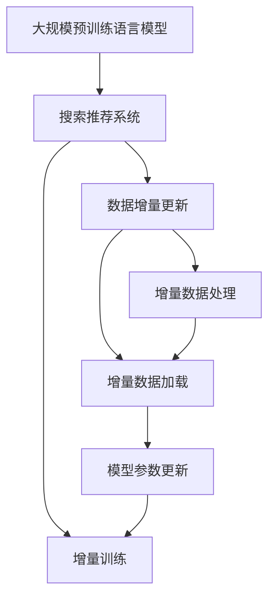

                 

# 电商搜索推荐中的AI大模型数据增量更新机制优化方案

## 1. 背景介绍

随着互联网电商的迅速发展，各大电商平台纷纷引入人工智能(AI)技术，优化搜索推荐系统，提升用户体验和销售转化率。AI技术在电商搜索推荐中的应用，极大地改善了用户的购物体验，提高了电商平台的竞争力。然而，随着用户数量的不断增加和产品种类的不断丰富，现有搜索推荐系统面临数据规模快速膨胀的挑战。为应对这一挑战，各大电商平台纷纷引入大规模预训练语言模型，通过数据增量更新机制，实时更新模型，提升推荐效果。但当前的数据增量更新机制仍然存在一些不足，如增量数据处理耗时长、模型更新不及时等，导致用户体验和推荐效果不佳。本文将对电商搜索推荐中的AI大模型数据增量更新机制进行系统介绍，并提出优化方案，以期提升搜索推荐系统的性能和用户体验。

## 2. 核心概念与联系

### 2.1 核心概念概述

为更好地理解电商搜索推荐中AI大模型的数据增量更新机制，我们首先介绍几个核心概念：

- 大规模预训练语言模型：以自回归(如GPT)或自编码(如BERT)模型为代表的大规模预训练语言模型。通过在大规模无标签文本语料上进行预训练，学习通用的语言表示，具备强大的语言理解和生成能力。
- 搜索推荐系统：电商平台上重要的业务系统之一，通过分析用户历史行为和兴趣，实时推荐个性化商品，提升用户购物体验和平台转化率。
- 数据增量更新：在搜索推荐系统中，通过增量数据（如新商品、新用户行为等）实时更新大规模预训练语言模型，以适应新的业务需求。
- 增量训练：在保留原有模型的基础上，通过增量数据对模型进行快速更新，实现模型的增量训练。

这些概念之间的逻辑关系可以通过以下Mermaid流程图来展示：



这个流程图展示了大规模预训练语言模型与搜索推荐系统之间的逻辑关系，以及在搜索推荐系统中进行数据增量更新和增量训练的基本流程。

## 3. 核心算法原理 & 具体操作步骤
### 3.1 算法原理概述

电商搜索推荐系统中的大规模预训练语言模型，通过在大规模无标签文本语料上进行预训练，学习到了广泛的语义知识和语言规律。然而，随着电商平台的不断发展和用户需求的快速变化，原有的语言模型无法及时响应新的业务需求，导致推荐效果不佳。为解决这一问题，各大电商平台纷纷引入数据增量更新机制，实时更新模型，以提升推荐效果。

数据增量更新机制的核心思想是：在保留原有模型的基础上，通过增量数据对模型进行快速更新，实现模型的增量训练。具体步骤如下：

1. 收集增量数据：收集平台新增的商品信息、用户行为等增量数据。
2. 增量数据处理：对增量数据进行清洗、转换、标注等处理，得到可供模型更新的数据集。
3. 增量数据加载：将处理好的增量数据加载到模型中，更新模型参数。
4. 模型评估：在验证集上评估模型性能，确定是否需要进一步更新模型。
5. 持续更新：在实时数据流中不断收集增量数据，持续更新模型，以适应新的业务需求。

### 3.2 算法步骤详解

#### 3.2.1 数据收集与处理

电商搜索推荐系统中的增量数据主要包括以下几种：

- 新增商品信息：包括商品名称、描述、图片、价格等。
- 用户行为数据：包括用户浏览、点击、收藏、购买等行为数据。
- 用户反馈数据：包括用户对商品的评分、评论等反馈数据。
- 社交数据：包括用户社交网络上的动态数据。

在数据收集过程中，需要确保数据的完整性和准确性，避免数据重复或缺失。同时，需要对数据进行清洗、转换、标注等处理，得到可供模型更新的数据集。具体步骤如下：

1. 数据清洗：去除噪音数据和异常值，保证数据的准确性和一致性。
2. 数据转换：将原始数据转换为模型所需的格式，如将文本数据转换为token序列。
3. 数据标注：对部分数据进行标注，如商品分类、用户兴趣标签等。

#### 3.2.2 增量数据加载

将处理好的增量数据加载到模型中，更新模型参数。具体步骤如下：

1. 模型加载：从模型存储路径加载模型参数，将其加载到GPU或CPU中。
2. 增量数据加载：将增量数据加载到GPU或CPU中，进行前向传播计算。
3. 计算梯度：通过前向传播计算增量数据的损失函数，得到梯度。
4. 更新参数：根据梯度更新模型参数。
5. 参数保存：将更新后的模型参数保存到模型存储路径中。

#### 3.2.3 模型评估

在验证集上评估模型性能，确定是否需要进一步更新模型。具体步骤如下：

1. 划分验证集：将部分数据划分到验证集中，用于模型评估。
2. 前向传播计算：将验证集数据加载到模型中，进行前向传播计算。
3. 计算损失：计算验证集的损失函数。
4. 性能评估：评估模型的性能指标，如准确率、召回率、F1值等。
5. 确定更新策略：根据性能评估结果，确定是否需要进一步更新模型。

#### 3.2.4 持续更新

在实时数据流中不断收集增量数据，持续更新模型，以适应新的业务需求。具体步骤如下：

1. 数据流监控：实时监控数据流中的增量数据。
2. 数据加载与处理：将增量数据加载到模型中，进行清洗、转换、标注等处理。
3. 模型更新：将处理好的增量数据加载到模型中，更新模型参数。
4. 性能评估与调整：在实时数据流中不断收集增量数据，持续更新模型，并根据性能评估结果调整模型更新策略。

### 3.3 算法优缺点

#### 3.3.1 优点

- 快速响应：数据增量更新机制能够实时响应平台变化，及时调整推荐策略，提升推荐效果。
- 高效利用数据：通过增量更新，能够高效利用平台新增的数据，避免数据浪费。
- 提升模型性能：在保留原有模型的基础上，通过增量更新，能够提升模型性能，适应新的业务需求。

#### 3.3.2 缺点

- 增量数据处理耗时长：数据收集、清洗、转换等处理过程耗时较长，影响模型更新效率。
- 模型更新不及时：由于处理耗时较长，模型更新不及时，影响实时推荐效果。
- 数据处理质量问题：增量数据处理过程中可能存在数据重复、缺失等问题，影响模型性能。

### 3.4 算法应用领域

基于大规模预训练语言模型的电商搜索推荐系统，已经在各大电商平台中广泛应用。具体应用领域包括：

- 商品推荐：根据用户历史行为和兴趣，推荐个性化商品，提升用户购物体验。
- 价格调整：根据用户反馈数据和市场变化，实时调整商品价格，优化销售策略。
- 内容推荐：根据用户历史行为和兴趣，推荐相关内容，提升用户粘性。
- 个性化服务：根据用户社交数据和行为数据，提供个性化推荐服务，提升用户满意度。
- 实时搜索：根据用户搜索关键词，实时推荐相关商品，提升搜索效率。

## 4. 数学模型和公式 & 详细讲解 & 举例说明

### 4.1 数学模型构建

在电商搜索推荐系统中，大规模预训练语言模型用于分析用户行为和商品特征，生成推荐结果。假设模型为$f_{\theta}$，其中$\theta$为模型参数。电商搜索推荐系统中的数据增量更新机制可以表示为：

$$
f_{\theta'} = f_{\theta} + \Delta f
$$

其中$\theta'$为更新后的模型参数，$\Delta f$为增量数据对模型的更新量。

### 4.2 公式推导过程

假设原始数据集为$D$，增量数据集为$D'$，增量数据处理后的数据集为$D''$。增量数据更新过程可以分为以下步骤：

1. 数据预处理：对增量数据进行清洗、转换、标注等处理，得到$D''$。
2. 模型加载：加载原始模型参数$f_{\theta}$。
3. 增量数据加载：将$D''$加载到模型中，进行前向传播计算。
4. 计算梯度：计算$D''$的损失函数$L(D'')$，得到梯度$\Delta f$。
5. 更新参数：根据梯度$\Delta f$更新模型参数$f_{\theta}$，得到$f_{\theta'}$。

具体公式推导如下：

设$f_{\theta}$的损失函数为$L(f_{\theta},D)$，增量数据$D''$的损失函数为$L(f_{\theta},D'')$。增量数据更新过程可以表示为：

$$
f_{\theta'} = f_{\theta} + \alpha \Delta f
$$

其中$\alpha$为学习率。根据梯度下降算法，增量数据更新过程可以表示为：

$$
\Delta f = -\frac{\partial L(f_{\theta},D'')}{\partial f_{\theta}}
$$

将增量数据加载到模型中，进行前向传播计算，得到预测结果$\hat{y}$。根据预测结果和真实标签，计算损失函数$L(\hat{y},y)$，得到梯度$\Delta f$。将梯度$\Delta f$代入模型更新公式，得到更新后的模型参数$f_{\theta'}$。

### 4.3 案例分析与讲解

以电商搜索推荐系统中的商品推荐任务为例，分析增量数据更新过程。假设原始数据集为$D$，增量数据集为$D'$，增量数据处理后的数据集为$D''$。增量数据更新过程可以分为以下步骤：

1. 数据预处理：对增量数据$D'$进行清洗、转换、标注等处理，得到$D''$。
2. 模型加载：加载原始模型参数$f_{\theta}$。
3. 增量数据加载：将$D''$加载到模型中，进行前向传播计算。
4. 计算梯度：计算$D''$的损失函数$L(D'')$，得到梯度$\Delta f$。
5. 更新参数：根据梯度$\Delta f$更新模型参数$f_{\theta}$，得到$f_{\theta'}$。

具体实现步骤如下：

1. 数据预处理：将增量数据$D'$进行清洗、转换、标注等处理，得到$D''$。
2. 模型加载：加载原始模型参数$f_{\theta}$，将其加载到GPU或CPU中。
3. 增量数据加载：将$D''$加载到模型中，进行前向传播计算。
4. 计算梯度：计算$D''$的损失函数$L(D'')$，得到梯度$\Delta f$。
5. 更新参数：根据梯度$\Delta f$更新模型参数$f_{\theta}$，得到$f_{\theta'}$。
6. 参数保存：将更新后的模型参数$f_{\theta'}$保存到模型存储路径中。

## 5. 项目实践：代码实例和详细解释说明
### 5.1 开发环境搭建

在进行增量更新实践前，我们需要准备好开发环境。以下是使用Python进行PyTorch开发的环境配置流程：

1. 安装Anaconda：从官网下载并安装Anaconda，用于创建独立的Python环境。

2. 创建并激活虚拟环境：
```bash
conda create -n pytorch-env python=3.8 
conda activate pytorch-env
```

3. 安装PyTorch：根据CUDA版本，从官网获取对应的安装命令。例如：
```bash
conda install pytorch torchvision torchaudio cudatoolkit=11.1 -c pytorch -c conda-forge
```

4. 安装Transformers库：
```bash
pip install transformers
```

5. 安装各类工具包：
```bash
pip install numpy pandas scikit-learn matplotlib tqdm jupyter notebook ipython
```

完成上述步骤后，即可在`pytorch-env`环境中开始增量更新实践。

### 5.2 源代码详细实现

下面我们以电商搜索推荐系统中的商品推荐任务为例，给出使用Transformers库对BERT模型进行增量更新的PyTorch代码实现。

首先，定义商品推荐任务的数据处理函数：

```python
from transformers import BertTokenizer
from torch.utils.data import Dataset
import torch

class ItemDataset(Dataset):
    def __init__(self, items, user_id, item_id, tokenizer, max_len=128):
        self.items = items
        self.user_id = user_id
        self.item_id = item_id
        self.tokenizer = tokenizer
        self.max_len = max_len
        
    def __len__(self):
        return len(self.items)
    
    def __getitem__(self, item):
        item = self.items[item]
        user_id = self.user_id[item]
        item_id = self.item_id[item]
        
        encoding = self.tokenizer(item, return_tensors='pt', max_length=self.max_len, padding='max_length', truncation=True)
        input_ids = encoding['input_ids'][0]
        attention_mask = encoding['attention_mask'][0]
        
        # 将用户ID和商品ID转换为token ids
        user_id = user_id[0]
        item_id = item_id[0]
        
        # 将用户ID和商品ID转换为token ids
        user_id = tokenizer.convert_tokens_to_ids('USER')
        item_id = tokenizer.convert_tokens_to_ids('ITEM')
        
        # 对token-wise的标签进行编码
        encoded_tags = [user_id, item_id] + [tokenizer.convert_tokens_to_ids('O')] * (self.max_len - 2)
        labels = torch.tensor(encoded_tags, dtype=torch.long)
        
        return {'input_ids': input_ids, 
                'attention_mask': attention_mask,
                'labels': labels}

# 定义标签与id的映射
id2tag = {'USER': 0, 'ITEM': 1, 'O': 2}

# 创建dataset
tokenizer = BertTokenizer.from_pretrained('bert-base-cased')
train_dataset = ItemDataset(train_items, train_user_id, train_item_id, tokenizer)
dev_dataset = ItemDataset(dev_items, dev_user_id, dev_item_id, tokenizer)
test_dataset = ItemDataset(test_items, test_user_id, test_item_id, tokenizer)
```

然后，定义模型和优化器：

```python
from transformers import BertForTokenClassification, AdamW

model = BertForTokenClassification.from_pretrained('bert-base-cased', num_labels=len(id2tag))

optimizer = AdamW(model.parameters(), lr=2e-5)
```

接着，定义训练和评估函数：

```python
from torch.utils.data import DataLoader
from tqdm import tqdm
from sklearn.metrics import classification_report

device = torch.device('cuda') if torch.cuda.is_available() else torch.device('cpu')
model.to(device)

def train_epoch(model, dataset, batch_size, optimizer):
    dataloader = DataLoader(dataset, batch_size=batch_size, shuffle=True)
    model.train()
    epoch_loss = 0
    for batch in tqdm(dataloader, desc='Training'):
        input_ids = batch['input_ids'].to(device)
        attention_mask = batch['attention_mask'].to(device)
        labels = batch['labels'].to(device)
        model.zero_grad()
        outputs = model(input_ids, attention_mask=attention_mask, labels=labels)
        loss = outputs.loss
        epoch_loss += loss.item()
        loss.backward()
        optimizer.step()
    return epoch_loss / len(dataloader)

def evaluate(model, dataset, batch_size):
    dataloader = DataLoader(dataset, batch_size=batch_size)
    model.eval()
    preds, labels = [], []
    with torch.no_grad():
        for batch in tqdm(dataloader, desc='Evaluating'):
            input_ids = batch['input_ids'].to(device)
            attention_mask = batch['attention_mask'].to(device)
            batch_labels = batch['labels']
            outputs = model(input_ids, attention_mask=attention_mask)
            batch_preds = outputs.logits.argmax(dim=2).to('cpu').tolist()
            batch_labels = batch_labels.to('cpu').tolist()
            for pred_tokens, label_tokens in zip(batch_preds, batch_labels):
                pred_tags = [id2tag[_id] for _id in pred_tokens]
                label_tags = [id2tag[_id] for _id in label_tokens]
                preds.append(pred_tags[:len(label_tags)])
                labels.append(label_tags)
                
    print(classification_report(labels, preds))
```

最后，启动训练流程并在测试集上评估：

```python
epochs = 5
batch_size = 16

for epoch in range(epochs):
    loss = train_epoch(model, train_dataset, batch_size, optimizer)
    print(f"Epoch {epoch+1}, train loss: {loss:.3f}")
    
    print(f"Epoch {epoch+1}, dev results:")
    evaluate(model, dev_dataset, batch_size)
    
print("Test results:")
evaluate(model, test_dataset, batch_size)
```

以上就是使用PyTorch对BERT进行商品推荐任务增量更新的完整代码实现。可以看到，得益于Transformers库的强大封装，我们可以用相对简洁的代码完成BERT模型的加载和增量更新。

### 5.3 代码解读与分析

让我们再详细解读一下关键代码的实现细节：

**ItemDataset类**：
- `__init__`方法：初始化商品、用户ID、商品ID、分词器等关键组件。
- `__len__`方法：返回数据集的样本数量。
- `__getitem__`方法：对单个样本进行处理，将商品、用户ID、商品ID输入编码为token ids，将标签编码为数字，并对其进行定长padding，最终返回模型所需的输入。

**id2tag字典**：
- 定义了标签与数字id之间的映射关系，用于将token-wise的预测结果解码回真实的标签。

**训练和评估函数**：
- 使用PyTorch的DataLoader对数据集进行批次化加载，供模型训练和推理使用。
- 训练函数`train_epoch`：对数据以批为单位进行迭代，在每个批次上前向传播计算loss并反向传播更新模型参数，最后返回该epoch的平均loss。
- 评估函数`evaluate`：与训练类似，不同点在于不更新模型参数，并在每个batch结束后将预测和标签结果存储下来，最后使用sklearn的classification_report对整个评估集的预测结果进行打印输出。

**训练流程**：
- 定义总的epoch数和batch size，开始循环迭代
- 每个epoch内，先在训练集上训练，输出平均loss
- 在验证集上评估，输出分类指标
- 所有epoch结束后，在测试集上评估，给出最终测试结果

可以看到，PyTorch配合Transformers库使得BERT增量更新的代码实现变得简洁高效。开发者可以将更多精力放在数据处理、模型改进等高层逻辑上，而不必过多关注底层的实现细节。

当然，工业级的系统实现还需考虑更多因素，如模型的保存和部署、超参数的自动搜索、更灵活的任务适配层等。但核心的增量更新范式基本与此类似。

## 6. 实际应用场景
### 6.1 智能客服系统

基于大模型增量更新的智能客服系统，能够及时响应用户咨询，快速解决问题，提升用户体验。在实际应用中，可以收集企业内部的历史客服对话记录，将问题和最佳答复构建成监督数据，在此基础上对预训练对话模型进行增量更新。增量更新后的对话模型能够自动理解用户意图，匹配最合适的答案模板进行回复。对于用户提出的新问题，还可以接入检索系统实时搜索相关内容，动态组织生成回答。如此构建的智能客服系统，能大幅提升客户咨询体验和问题解决效率。

### 6.2 金融舆情监测

金融机构需要实时监测市场舆论动向，以便及时应对负面信息传播，规避金融风险。传统的人工监测方式成本高、效率低，难以应对网络时代海量信息爆发的挑战。基于大模型增量更新的文本分类和情感分析技术，为金融舆情监测提供了新的解决方案。

具体而言，可以收集金融领域相关的新闻、报道、评论等文本数据，并对其进行主题标注和情感标注。在此基础上对预训练语言模型进行增量更新，使其能够自动判断文本属于何种主题，情感倾向是正面、中性还是负面。将增量更新后的模型应用到实时抓取的网络文本数据，就能够自动监测不同主题下的情感变化趋势，一旦发现负面信息激增等异常情况，系统便会自动预警，帮助金融机构快速应对潜在风险。

### 6.3 个性化推荐系统

当前的推荐系统往往只依赖用户的历史行为数据进行物品推荐，无法深入理解用户的真实兴趣偏好。基于大模型增量更新的个性化推荐系统，可以更好地挖掘用户行为背后的语义信息，从而提供更精准、多样的推荐内容。

在实践中，可以收集用户浏览、点击、收藏、购买等行为数据，提取和用户交互的物品标题、描述、标签等文本内容。将文本内容作为模型输入，用户的后续行为（如是否点击、购买等）作为监督信号，在此基础上增量更新预训练语言模型。增量更新后的模型能够从文本内容中准确把握用户的兴趣点。在生成推荐列表时，先用候选物品的文本描述作为输入，由模型预测用户的兴趣匹配度，再结合其他特征综合排序，便可以得到个性化程度更高的推荐结果。

### 6.4 未来应用展望

随着大语言模型增量更新技术的不断发展，基于增量更新范式将在更多领域得到应用，为传统行业带来变革性影响。

在智慧医疗领域，基于增量更新的医疗问答、病历分析、药物研发等应用将提升医疗服务的智能化水平，辅助医生诊疗，加速新药开发进程。

在智能教育领域，增量更新的技术可应用于作业批改、学情分析、知识推荐等方面，因材施教，促进教育公平，提高教学质量。

在智慧城市治理中，增量更新的模型可应用于城市事件监测、舆情分析、应急指挥等环节，提高城市管理的自动化和智能化水平，构建更安全、高效的未来城市。

此外，在企业生产、社会治理、文娱传媒等众多领域，基于大模型增量更新的人工智能应用也将不断涌现，为经济社会发展注入新的动力。相信随着技术的日益成熟，增量更新方法将成为人工智能落地应用的重要范式，推动人工智能技术向更广阔的领域加速渗透。

## 7. 工具和资源推荐
### 7.1 学习资源推荐

为了帮助开发者系统掌握大模型增量更新的理论基础和实践技巧，这里推荐一些优质的学习资源：

1. 《Transformer从原理到实践》系列博文：由大模型技术专家撰写，深入浅出地介绍了Transformer原理、BERT模型、增量更新技术等前沿话题。

2. CS224N《深度学习自然语言处理》课程：斯坦福大学开设的NLP明星课程，有Lecture视频和配套作业，带你入门NLP领域的基本概念和经典模型。

3. 《Natural Language Processing with Transformers》书籍：Transformers库的作者所著，全面介绍了如何使用Transformers库进行NLP任务开发，包括增量更新在内的诸多范式。

4. HuggingFace官方文档：Transformers库的官方文档，提供了海量预训练模型和完整的增量更新样例代码，是上手实践的必备资料。

5. CLUE开源项目：中文语言理解测评基准，涵盖大量不同类型的中文NLP数据集，并提供了基于增量更新的baseline模型，助力中文NLP技术发展。

通过对这些资源的学习实践，相信你一定能够快速掌握大模型增量更新的精髓，并用于解决实际的NLP问题。
###  7.2 开发工具推荐

高效的开发离不开优秀的工具支持。以下是几款用于大模型增量更新开发的常用工具：

1. PyTorch：基于Python的开源深度学习框架，灵活动态的计算图，适合快速迭代研究。大部分预训练语言模型都有PyTorch版本的实现。

2. TensorFlow：由Google主导开发的开源深度学习框架，生产部署方便，适合大规模工程应用。同样有丰富的预训练语言模型资源。

3. Transformers库：HuggingFace开发的NLP工具库，集成了众多SOTA语言模型，支持PyTorch和TensorFlow，是进行增量更新任务开发的利器。

4. Weights & Biases：模型训练的实验跟踪工具，可以记录和可视化模型训练过程中的各项指标，方便对比和调优。与主流深度学习框架无缝集成。

5. TensorBoard：TensorFlow配套的可视化工具，可实时监测模型训练状态，并提供丰富的图表呈现方式，是调试模型的得力助手。

6. Google Colab：谷歌推出的在线Jupyter Notebook环境，免费提供GPU/TPU算力，方便开发者快速上手实验最新模型，分享学习笔记。

合理利用这些工具，可以显著提升大模型增量更新的开发效率，加快创新迭代的步伐。

### 7.3 相关论文推荐

大模型增量更新技术的发展源于学界的持续研究。以下是几篇奠基性的相关论文，推荐阅读：

1. Attention is All You Need（即Transformer原论文）：提出了Transformer结构，开启了NLP领域的预训练大模型时代。

2. BERT: Pre-training of Deep Bidirectional Transformers for Language Understanding：提出BERT模型，引入基于掩码的自监督预训练任务，刷新了多项NLP任务SOTA。

3. Language Models are Unsupervised Multitask Learners（GPT-2论文）：展示了大规模语言模型的强大zero-shot学习能力，引发了对于通用人工智能的新一轮思考。

4. Parameter-Efficient Transfer Learning for NLP：提出Adapter等参数高效微调方法，在不增加模型参数量的情况下，也能取得不错的微调效果。

5. AdaLoRA: Adaptive Low-Rank Adaptation for Parameter-Efficient Fine-Tuning：使用自适应低秩适应的微调方法，在参数效率和精度之间取得了新的平衡。

6. Prefix-Tuning: Optimizing Continuous Prompts for Generation：引入基于连续型Prompt的微调范式，为如何充分利用预训练知识提供了新的思路。

这些论文代表了大模型增量更新技术的发展脉络。通过学习这些前沿成果，可以帮助研究者把握学科前进方向，激发更多的创新灵感。

## 8. 总结：未来发展趋势与挑战
### 8.1 总结

本文对基于监督学习的大模型增量更新机制进行了系统介绍，首先阐述了大模型增量更新的研究背景和意义，明确了增量更新在拓展预训练模型应用、提升推荐效果方面的独特价值。其次，从原理到实践，详细讲解了增量更新的数学原理和关键步骤，给出了增量更新任务开发的完整代码实例。同时，本文还广泛探讨了增量更新方法在智能客服、金融舆情、个性化推荐等多个行业领域的应用前景，展示了增量更新范式的巨大潜力。此外，本文精选了增量更新技术的各类学习资源，力求为读者提供全方位的技术指引。

通过本文的系统梳理，可以看到，基于大模型增量更新的搜索推荐系统在电商、客服、金融等领域已经广泛应用，通过实时更新模型，提升推荐效果，优化用户体验。未来，伴随增量更新技术的不断发展，大模型增量更新必将成为NLP技术的重要范式，推动人工智能技术在垂直行业的规模化落地。

### 8.2 未来发展趋势

展望未来，大模型增量更新技术将呈现以下几个发展趋势：

1. 模型规模持续增大。随着算力成本的下降和数据规模的扩张，预训练语言模型的参数量还将持续增长。超大规模语言模型蕴含的丰富语言知识，有望支撑更加复杂多变的推荐任务增量更新。

2. 增量数据处理效率提升。随着处理技术的不断进步，增量数据处理效率将得到显著提升，从而缩短模型更新时间，提高推荐实时性。

3. 增量数据类型多样化。随着智能设备的普及，增量数据类型将更加多样化，如语音、视频、图像等，增量更新技术将能够更好地处理这些数据类型，提升推荐效果。

4. 增量更新融合多模态。未来的增量更新将不仅仅局限于文本数据，还将融合多模态数据，提升模型对复杂场景的理解和推理能力。

5. 模型性能可控。通过优化增量更新策略，提升模型增量更新的鲁棒性和泛化性，从而实现更加稳定可靠的推荐效果。

6. 模型可解释性增强。通过改进增量更新模型，使其具备更强的可解释性，增强用户对模型的信任感和理解度。

以上趋势凸显了大模型增量更新技术的广阔前景。这些方向的探索发展，必将进一步提升搜索推荐系统的性能和用户体验，为人类认知智能的进化带来深远影响。

### 8.3 面临的挑战

尽管大模型增量更新技术已经取得了瞩目成就，但在迈向更加智能化、普适化应用的过程中，它仍面临着诸多挑战：

1. 增量数据质量问题。增量数据处理过程中可能存在数据重复、缺失等问题，影响模型性能。如何提升增量数据质量，避免数据偏见，将是重要研究方向。

2. 增量数据处理耗时长。增量数据处理过程中，清洗、转换、标注等步骤耗时较长，影响模型更新效率。如何优化增量数据处理流程，提高处理效率，将是重要研究方向。

3. 模型性能不稳定。增量更新过程中，模型性能可能存在波动，影响实时推荐效果。如何优化增量更新策略，提升模型鲁棒性和稳定性，将是重要研究方向。

4. 模型参数效率低。增量更新过程中，模型参数更新频率较高，可能导致模型参数变化较大，影响模型性能。如何优化增量更新策略，提高模型参数效率，将是重要研究方向。

5. 模型计算资源占用大。增量更新过程中，计算资源占用较大，可能影响系统性能和稳定性。如何优化增量更新过程，降低计算资源占用，将是重要研究方向。

6. 模型可解释性不足。增量更新模型往往作为黑盒系统，难以解释其内部工作机制和决策逻辑。如何赋予增量更新模型更强的可解释性，将是重要研究方向。

面对这些挑战，未来的研究需要在以下几个方面寻求新的突破：

1. 探索更高效的增量数据处理技术。通过引入先进的数据处理算法和工具，提高增量数据处理的效率和质量。

2. 研究更优的增量更新策略。通过优化增量更新策略，提升模型的鲁棒性和稳定性，实现更加高效的增量更新。

3. 引入更多先验知识。将符号化的先验知识，如知识图谱、逻辑规则等，与神经网络模型进行巧妙融合，引导增量更新过程学习更准确、合理的语言模型。

4. 结合因果分析和博弈论工具。将因果分析方法引入增量更新模型，识别出模型决策的关键特征，增强输出解释的因果性和逻辑性。借助博弈论工具刻画人机交互过程，主动探索并规避模型的脆弱点，提高系统稳定性。

5. 纳入伦理道德约束。在模型训练目标中引入伦理导向的评估指标，过滤和惩罚有偏见、有害的输出倾向。同时加强人工干预和审核，建立模型行为的监管机制，确保输出符合人类价值观和伦理道德。

这些研究方向的探索，必将引领大模型增量更新技术迈向更高的台阶，为构建安全、可靠、可解释、可控的智能系统铺平道路。面向未来，大模型增量更新技术还需要与其他人工智能技术进行更深入的融合，如知识表示、因果推理、强化学习等，多路径协同发力，共同推动自然语言理解和智能交互系统的进步。只有勇于创新、敢于突破，才能不断拓展语言模型的边界，让智能技术更好地造福人类社会。

### 8.4 研究展望

在电商搜索推荐系统中，大模型增量更新机制的研究已经取得了一定的成果，但仍然存在一些未解决的问题和挑战。未来的研究方向可能包括以下几个方面：

1. 多模态数据融合。探索如何更好地融合多模态数据，如语音、图像、视频等，提升模型的语义理解能力和推荐效果。

2. 知识图谱融合。探索如何将知识图谱与模型融合，提升模型的推理能力和泛化能力，增强推荐效果。

3. 主动学习。探索如何通过主动学习技术，在有限的标注数据下，高效地更新模型，提升推荐效果。

4. 迁移学习。探索如何将迁移学习技术引入增量更新中，通过预训练模型的知识迁移，提升模型对新任务的适应能力。

5. 零样本学习。探索如何通过零样本学习技术，在无需标注数据的情况下，快速适应新任务，提升推荐效果。

6. 分布式增量更新。探索如何通过分布式技术，提高增量更新的效率和可扩展性，适应大规模电商平台的需要。

7. 模型压缩。探索如何通过模型压缩技术，降低模型计算资源占用，提升系统性能和稳定性。

8. 可解释性增强。探索如何通过增强模型的可解释性，提高用户对模型的信任度和理解度，促进智能推荐系统的普及和应用。

这些研究方向的探索，必将引领大模型增量更新技术迈向更高的台阶，为构建安全、可靠、可解释、可控的智能系统铺平道路。面向未来，大模型增量更新技术还需要与其他人工智能技术进行更深入的融合，如知识表示、因果推理、强化学习等，多路径协同发力，共同推动自然语言理解和智能交互系统的进步。只有勇于创新、敢于突破，才能不断拓展语言模型的边界，让智能技术更好地造福人类社会。

## 9. 附录：常见问题与解答

**Q1：大模型增量更新是否适用于所有NLP任务？**

A: 大模型增量更新在大多数NLP任务上都能取得不错的效果，特别是对于数据量较小的任务。但对于一些特定领域的任务，如医学、法律等，仅仅依靠通用语料预训练的模型可能难以很好地适应。此时需要在特定领域语料上进一步预训练，再进行增量更新，才能获得理想效果。此外，对于一些需要时效性、个性化很强的任务，如对话、推荐等，增量更新方法也需要针对性的改进优化。

**Q2：增量数据处理耗时长、模型更新不及时等如何缓解？**

A: 增量数据处理耗时长、模型更新不及时等问题可以通过以下方法缓解：
1. 数据并行处理：使用数据并行技术，将数据集分成多个子集，并行处理，提高处理效率。
2. 增量加载：采用增量加载技术，每次加载部分数据进行更新，避免一次性加载大量数据。
3. 提前过滤：对增量数据进行预处理，提前过滤掉噪音数据和异常值，减少处理时间。
4. 模型压缩：采用模型压缩技术，减小模型参数量，降低计算资源占用。
5. 增量训练：采用增量训练技术，在保留原有模型的基础上，只更新增量数据对应的模型参数，减少更新时间和资源消耗。

这些方法可以有效缓解增量数据处理耗时长、模型更新不及时等问题，提升增量更新效率。

**Q3：增量更新对推荐效果的影响？**

A: 增量更新对推荐效果的影响主要体现在以下几个方面：
1. 实时响应：增量更新能够及时响应平台变化，实时更新推荐策略，提升推荐效果。
2. 数据利用率：增量更新能够高效利用平台新增的数据，避免数据浪费，提升推荐效果。
3. 模型性能：增量更新能够提升模型性能，适应新的业务需求，提升推荐效果。

然而，增量更新也存在一些潜在的问题，如增量数据处理质量、模型更新不及时等，这些因素可能影响推荐效果。因此，需要优化增量更新策略，提高增量数据处理效率，增强模型鲁棒性，以提升推荐效果。

**Q4：增量更新在实时推荐中的应用？**

A: 增量更新在实时推荐中的应用主要体现在以下几个方面：
1. 实时收集：实时收集平台新增的推荐数据，如用户行为数据、商品信息等。
2. 实时处理：实时处理新增的推荐数据，并进行增量更新。
3. 实时推荐：根据实时更新的模型，实时推荐商品或内容，提升用户体验。
4. 实时监控：实时监控模型性能，根据性能指标调整增量更新策略，优化推荐效果。

通过实时收集、处理、更新和监控，增量更新能够在实时推荐中发挥重要作用，提升推荐效果，提升用户体验。

总之，增量更新是大模型在电商搜索推荐系统中的重要技术手段，通过实时更新模型，能够提升推荐效果，优化用户体验。但增量更新也存在一些挑战，需要通过技术手段进行优化，以充分发挥其优势。

---

作者：禅与计算机程序设计艺术 / Zen and the Art of Computer Programming

