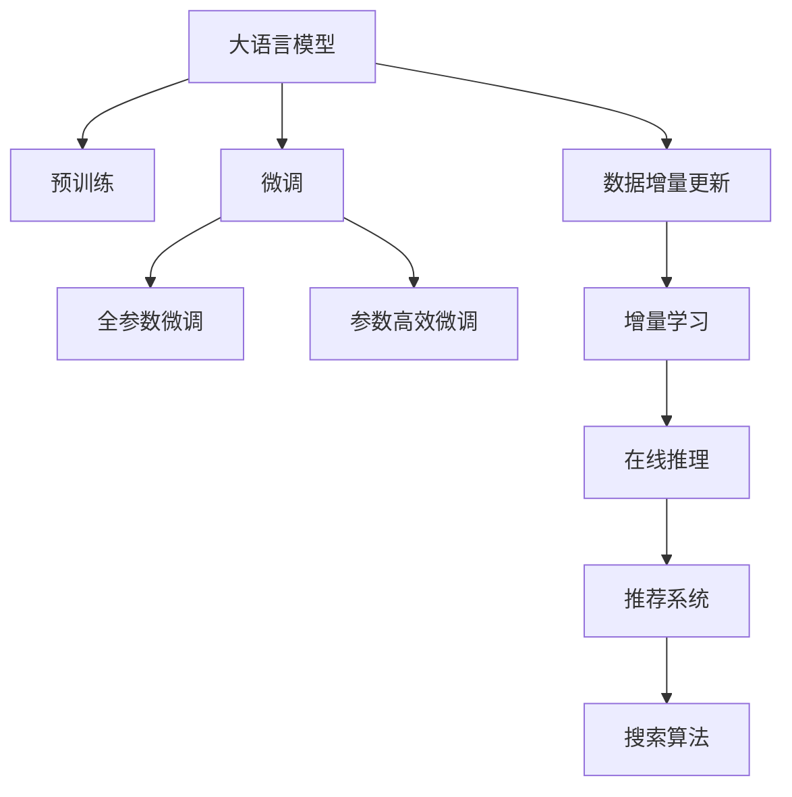

                 

# 电商搜索推荐中的AI大模型数据增量更新机制设计

> 关键词：电商搜索推荐, 数据增量更新, AI大模型, 增量学习, 神经网络, 深度学习, 推荐系统, 搜索算法

## 1. 背景介绍

### 1.1 问题由来

在电子商务领域，用户搜索推荐系统（Search & Recommendation System, SR）扮演着至关重要的角色，直接影响着用户的购物体验和转化率。传统的搜索推荐系统多依赖于规则、统计或深度学习模型，难以高效应对数据复杂性和实时性需求。近年来，随着深度学习技术的迅猛发展，基于大模型的推荐系统开始受到关注。

AI大模型，如GPT、BERT等，在大规模无标签文本数据上进行预训练，获取了强大的语义理解能力。在大规模标注数据上进行微调后，可以显著提升模型性能，覆盖更广泛的搜索推荐场景。

然而，大模型的训练和微调需要消耗大量计算资源和时间，并且在电商场景中，搜索推荐数据会实时更新，模型需要不断地进行迭代更新才能保持高性能。如何在大模型上进行高效、可靠的数据增量更新，是一个亟需解决的问题。

### 1.2 问题核心关键点

本文聚焦于电商搜索推荐场景，探讨如何设计高效的数据增量更新机制，使得大模型在实时更新数据时，依然能够保持良好的性能和稳定性。核心问题包括：

- 如何在大模型上高效地进行数据增量更新？
- 如何平衡模型的在线推理性能和实时更新效率？
- 如何在数据增量更新过程中保持模型的泛化能力？
- 如何评估数据增量更新的效果，确保模型更新后的性能提升？

## 2. 核心概念与联系

### 2.1 核心概念概述

为更好地理解电商搜索推荐中的大模型数据增量更新机制，本节将介绍几个密切相关的核心概念：

- 大语言模型(Large Language Model, LLM)：以自回归(如GPT)或自编码(如BERT)模型为代表的大规模预训练语言模型。通过在大规模无标签文本语料上进行预训练，学习通用的语言表示，具备强大的语言理解和生成能力。

- 数据增量更新(Online Incremental Learning)：在大模型微调完成后，基于实时新增数据对模型参数进行更新，使得模型能够适应新的数据分布，提升模型在最新数据上的性能。

- 增量学习(Incremental Learning)：指在已有模型的基础上，逐步添加新数据，持续优化模型参数的过程。相比从头训练，增量学习可以显著减少时间和计算资源的消耗。

- 神经网络(Neural Network)：基于人工神经元模型构建的计算图，可用于分类、回归、序列生成等任务。大模型多是基于神经网络的深度学习模型。

- 深度学习(Deep Learning)：以神经网络为代表的机器学习分支，通过多层次的特征提取和变换，学习复杂的数据表示，在大规模数据上表现出色。

- 推荐系统(Recommendation System)：通过分析用户行为和物品特征，为用户推荐可能感兴趣的产品或服务，提升用户满意度和转化率。

- 搜索算法(Search Algorithm)：用于在大规模数据中快速定位目标元素，提升查询效率和用户体验。

这些核心概念之间的逻辑关系可以通过以下Mermaid流程图来展示：



这个流程图展示了大语言模型的核心概念及其之间的关系：

1. 大语言模型通过预训练获得基础能力。
2. 微调是对预训练模型进行任务特定的优化，可以分为全参数微调和参数高效微调（PEFT）。
3. 数据增量更新在大模型微调完成后，基于实时新增数据对模型参数进行更新。
4. 增量学习在大模型微调完成后，持续添加新数据，优化模型参数。
5. 在线推理在增量学习过程中，模型需要保持在线推理性能，不断更新。
6. 推荐系统通过大模型的在线推理结果，为用户推荐产品。
7. 搜索算法用于在推荐系统中快速查找目标产品。

这些概念共同构成了电商搜索推荐场景中的大模型数据增量更新机制，使得大模型能够在实时数据更新下，保持高性能和低延迟。

## 3. 核心算法原理 & 具体操作步骤
### 3.1 算法原理概述

电商搜索推荐中的大模型数据增量更新机制，本质上是一个增量学习过程。其核心思想是：在大模型微调完成后，基于实时新增数据对模型参数进行更新，使得模型能够适应新的数据分布，提升模型在最新数据上的性能。

形式化地，假设大模型为 $M_{\theta}$，其中 $\theta$ 为微调后的模型参数。给定实时新增数据集 $D_{\text{new}}=\{(x_i, y_i)\}_{i=1}^{N_{\text{new}}}$，增量更新的目标是最小化模型在新增数据上的损失函数，即找到新的模型参数 $\hat{\theta}$，使得：

$$
\hat{\theta}=\mathop{\arg\min}_{\theta} \mathcal{L}_{\text{new}}(M_{\theta},D_{\text{new}})
$$

其中 $\mathcal{L}_{\text{new}}$ 为针对新增数据集 $D_{\text{new}}$ 设计的损失函数，用于衡量模型预测输出与真实标签之间的差异。常见的损失函数包括交叉熵损失、均方误差损失等。

通过梯度下降等优化算法，增量更新过程不断更新模型参数 $\theta$，最小化损失函数 $\mathcal{L}_{\text{new}}$，使得模型输出逼近真实标签。由于 $\theta$ 已经通过微调获得了较好的初始化，因此即便在实时新增数据上更新，也能较快收敛到理想的模型参数 $\hat{\theta}$。

### 3.2 算法步骤详解

电商搜索推荐中的大模型数据增量更新一般包括以下几个关键步骤：

**Step 1: 准备预训练模型和数据集**
- 选择合适的预训练语言模型 $M_{\theta}$ 作为初始化参数，如 BERT、GPT等。
- 准备电商领域的实时新增数据集 $D_{\text{new}}=\{(x_i, y_i)\}_{i=1}^{N_{\text{new}}}$，划分为训练集、验证集和测试集。

**Step 2: 设计增量更新目标函数**
- 根据实时新增数据的特点，设计适合的目标函数 $\mathcal{L}_{\text{new}}$，如交叉熵损失、均方误差损失等。
- 针对新增数据集 $D_{\text{new}}$，计算模型的损失 $\mathcal{L}_{\text{new}}(M_{\theta},D_{\text{new}})$。

**Step 3: 设置增量更新超参数**
- 选择合适的优化算法及其参数，如 AdamW、SGD 等，设置学习率、批大小、迭代轮数等。
- 设置正则化技术及强度，包括权重衰减、Dropout、Early Stopping等。

**Step 4: 执行增量更新**
- 将新增数据集 $D_{\text{new}}$ 分批次输入模型，前向传播计算损失函数。
- 反向传播计算参数梯度，根据设定的优化算法和学习率更新模型参数。
- 周期性在验证集上评估模型性能，根据性能指标决定是否触发 Early Stopping。
- 重复上述步骤直到满足预设的迭代轮数或 Early Stopping 条件。

**Step 5: 测试和部署**
- 在测试集上评估增量更新后模型 $M_{\hat{\theta}}$ 的性能，对比微调前后的精度提升。
- 使用增量更新后的模型对新样本进行推理预测，集成到实际的应用系统中。
- 持续收集新的数据，定期重新增量更新模型，以适应数据分布的变化。

以上是电商搜索推荐中大模型数据增量更新的一般流程。在实际应用中，还需要针对具体任务的特点，对增量更新过程的各个环节进行优化设计，如改进训练目标函数，引入更多的正则化技术，搜索最优的超参数组合等，以进一步提升模型性能。

### 3.3 算法优缺点

电商搜索推荐中的大模型数据增量更新方法具有以下优点：
1. 高效利用数据：增量学习可以利用历史微调数据和新增数据，避免从头训练，节省时间和资源。
2. 模型鲁棒性：增量学习可以逐步调整模型参数，减少新数据对模型的冲击，提高模型的泛化能力。
3. 在线推理：增量更新可以在线进行，不影响现有的推荐系统服务，保持实时性能。
4. 可扩展性：增量学习可以逐步添加新数据，支持模型的不断扩展和优化。

同时，该方法也存在一定的局限性：
1. 依赖数据：增量学习的效果很大程度上取决于新增数据的数量和质量。
2. 计算资源：增量更新需要频繁进行前向和反向传播，计算资源消耗较大。
3. 模型复杂性：增量学习需要在原有模型基础上进行参数更新，增加了模型的复杂性。
4. 模型更新冲突：不同增量更新之间可能存在冲突，难以兼顾历史数据和最新数据的影响。

尽管存在这些局限性，但就目前而言，增量学习在大模型应用中依然是最主流范式。未来相关研究的重点在于如何进一步降低增量更新对计算资源的依赖，提高模型的少样本学习和跨领域迁移能力，同时兼顾可解释性和伦理安全性等因素。

### 3.4 算法应用领域

电商搜索推荐中的大模型数据增量更新方法，在电商搜索推荐系统中已经得到了广泛的应用，覆盖了几乎所有常见的搜索推荐任务，例如：

- 商品推荐：根据用户浏览历史和行为数据，推荐相关商品。
- 搜索结果排序：对搜索结果进行排序，优先展示用户最可能感兴趣的商品。
- 个性化展示：根据用户个性化需求，推荐个性化商品广告。
- 实时促销：根据实时数据，推荐最新促销商品。
- 动态定价：根据实时市场需求和用户行为，动态调整商品价格。

除了上述这些经典任务外，电商搜索推荐系统还被创新性地应用到更多场景中，如智能客服、推荐系统优化、商品质量检测等，为电商平台的运营带来了巨大的价值。

## 4. 数学模型和公式 & 详细讲解  
### 4.1 数学模型构建

本节将使用数学语言对电商搜索推荐中的大模型增量更新过程进行更加严格的刻画。

记电商领域的实时新增数据集为 $D_{\text{new}}=\{(x_i, y_i)\}_{i=1}^{N_{\text{new}}}$，其中 $x_i$ 表示用户行为数据（如浏览记录、购买记录等），$y_i$ 表示商品标签（如商品ID、价格等）。

定义模型 $M_{\theta}$ 在新增数据集 $D_{\text{new}}$ 上的损失函数为 $\mathcal{L}_{\text{new}}(M_{\theta},D_{\text{new}})$，用于衡量模型预测输出与真实标签之间的差异。则在数据集 $D_{\text{new}}$ 上的经验风险为：

$$
\mathcal{L}_{\text{new}}(\theta) = \frac{1}{N_{\text{new}}} \sum_{i=1}^{N_{\text{new}}} \ell(M_{\theta}(x_i),y_i)
$$

其中 $\ell$ 为损失函数，如交叉熵损失函数，$\theta$ 为模型参数。

增量更新的优化目标是最小化经验风险，即找到最优参数：

$$
\theta^* = \mathop{\arg\min}_{\theta} \mathcal{L}_{\text{new}}(\theta)
$$

在实践中，我们通常使用基于梯度的优化算法（如AdamW、SGD等）来近似求解上述最优化问题。设 $\eta$ 为学习率，$\lambda$ 为正则化系数，则参数的更新公式为：

$$
\theta \leftarrow \theta - \eta \nabla_{\theta}\mathcal{L}_{\text{new}}(\theta) - \eta\lambda\theta
$$

其中 $\nabla_{\theta}\mathcal{L}_{\text{new}}(\theta)$ 为损失函数对参数 $\theta$ 的梯度，可通过反向传播算法高效计算。

### 4.2 公式推导过程

以下我们以二分类任务为例，推导交叉熵损失函数及其梯度的计算公式。

假设模型 $M_{\theta}$ 在输入 $x_i$ 上的输出为 $\hat{y}=M_{\theta}(x_i) \in [0,1]$，表示用户行为数据属于商品的预测概率。真实标签 $y_i \in \{0,1\}$。则二分类交叉熵损失函数定义为：

$$
\ell(M_{\theta}(x_i),y_i) = -[y_i\log \hat{y} + (1-y_i)\log (1-\hat{y})]
$$

将其代入经验风险公式，得：

$$
\mathcal{L}_{\text{new}}(\theta) = -\frac{1}{N_{\text{new}}}\sum_{i=1}^{N_{\text{new}}} [y_i\log M_{\theta}(x_i)+(1-y_i)\log(1-M_{\theta}(x_i))]
$$

根据链式法则，损失函数对参数 $\theta_k$ 的梯度为：

$$
\frac{\partial \mathcal{L}_{\text{new}}(\theta)}{\partial \theta_k} = -\frac{1}{N_{\text{new}}}\sum_{i=1}^{N_{\text{new}}} (\frac{y_i}{M_{\theta}(x_i)}-\frac{1-y_i}{1-M_{\theta}(x_i)}) \frac{\partial M_{\theta}(x_i)}{\partial \theta_k}
$$

其中 $\frac{\partial M_{\theta}(x_i)}{\partial \theta_k}$ 可进一步递归展开，利用自动微分技术完成计算。

在得到损失函数的梯度后，即可带入参数更新公式，完成模型的增量更新。重复上述过程直至收敛，最终得到适应电商数据的新增数据集 $D_{\text{new}}$ 的最优模型参数 $\theta^*$。

## 5. 项目实践：代码实例和详细解释说明
### 5.1 开发环境搭建

在进行增量更新实践前，我们需要准备好开发环境。以下是使用Python进行PyTorch开发的环境配置流程：

1. 安装Anaconda：从官网下载并安装Anaconda，用于创建独立的Python环境。

2. 创建并激活虚拟环境：
```bash
conda create -n pytorch-env python=3.8 
conda activate pytorch-env
```

3. 安装PyTorch：根据CUDA版本，从官网获取对应的安装命令。例如：
```bash
conda install pytorch torchvision torchaudio cudatoolkit=11.1 -c pytorch -c conda-forge
```

4. 安装Transformers库：
```bash
pip install transformers
```

5. 安装各类工具包：
```bash
pip install numpy pandas scikit-learn matplotlib tqdm jupyter notebook ipython
```

完成上述步骤后，即可在`pytorch-env`环境中开始增量更新实践。

### 5.2 源代码详细实现

下面我们以电商搜索推荐中的商品推荐任务为例，给出使用Transformers库对BERT模型进行增量更新的PyTorch代码实现。

首先，定义商品推荐任务的数据处理函数：

```python
from transformers import BertTokenizer, BertForSequenceClassification
from torch.utils.data import Dataset
import torch

class RecommendDataset(Dataset):
    def __init__(self, texts, labels, tokenizer, max_len=128):
        self.texts = texts
        self.labels = labels
        self.tokenizer = tokenizer
        self.max_len = max_len
        
    def __len__(self):
        return len(self.texts)
    
    def __getitem__(self, item):
        text = self.texts[item]
        label = self.labels[item]
        
        encoding = self.tokenizer(text, return_tensors='pt', max_length=self.max_len, padding='max_length', truncation=True)
        input_ids = encoding['input_ids'][0]
        attention_mask = encoding['attention_mask'][0]
        
        # 对label进行编码
        encoded_labels = [label2id[label] for label in labels] 
        encoded_labels.extend([label2id['O']] * (self.max_len - len(encoded_labels)))
        labels = torch.tensor(encoded_labels, dtype=torch.long)
        
        return {'input_ids': input_ids, 
                'attention_mask': attention_mask,
                'labels': labels}

# 标签与id的映射
label2id = {'O': 0, 'P': 1} # 0: 普通商品，1: 推荐商品
id2label = {v: k for k, v in label2id.items()}

# 创建dataset
tokenizer = BertTokenizer.from_pretrained('bert-base-cased')

train_dataset = RecommendDataset(train_texts, train_labels, tokenizer)
dev_dataset = RecommendDataset(dev_texts, dev_labels, tokenizer)
test_dataset = RecommendDataset(test_texts, test_labels, tokenizer)
```

然后，定义模型和优化器：

```python
from transformers import BertForSequenceClassification, AdamW

model = BertForSequenceClassification.from_pretrained('bert-base-cased', num_labels=len(label2id))

optimizer = AdamW(model.parameters(), lr=2e-5)
```

接着，定义增量更新函数：

```python
from torch.utils.data import DataLoader
from tqdm import tqdm
from sklearn.metrics import classification_report

device = torch.device('cuda') if torch.cuda.is_available() else torch.device('cpu')
model.to(device)

def update_model(model, dataset, batch_size, optimizer, device):
    dataloader = DataLoader(dataset, batch_size=batch_size, shuffle=False)
    model.train()
    epoch_loss = 0
    for batch in tqdm(dataloader, desc='Updating'):
        input_ids = batch['input_ids'].to(device)
        attention_mask = batch['attention_mask'].to(device)
        labels = batch['labels'].to(device)
        model.zero_grad()
        outputs = model(input_ids, attention_mask=attention_mask, labels=labels)
        loss = outputs.loss
        epoch_loss += loss.item()
        loss.backward()
        optimizer.step()
    return epoch_loss / len(dataloader)

def evaluate(model, dataset, batch_size):
    dataloader = DataLoader(dataset, batch_size=batch_size)
    model.eval()
    preds, labels = [], []
    with torch.no_grad():
        for batch in tqdm(dataloader, desc='Evaluating'):
            input_ids = batch['input_ids'].to(device)
            attention_mask = batch['attention_mask'].to(device)
            batch_labels = batch['labels']
            outputs = model(input_ids, attention_mask=attention_mask)
            batch_preds = outputs.logits.argmax(dim=2).to('cpu').tolist()
            batch_labels = batch_labels.to('cpu').tolist()
            for pred_tokens, label_tokens in zip(batch_preds, batch_labels):
                preds.append(pred_tokens[:len(label_tokens)])
                labels.append(label_tokens)
                
    print(classification_report(labels, preds))
```

最后，启动增量更新流程并在测试集上评估：

```python
epochs = 5
batch_size = 16

for epoch in range(epochs):
    loss = update_model(model, train_dataset, batch_size, optimizer, device)
    print(f"Epoch {epoch+1}, update loss: {loss:.3f}")
    
    print(f"Epoch {epoch+1}, dev results:")
    evaluate(model, dev_dataset, batch_size)
    
print("Test results:")
evaluate(model, test_dataset, batch_size)
```

以上就是使用PyTorch对BERT进行电商搜索推荐任务增量更新的完整代码实现。可以看到，得益于Transformers库的强大封装，我们可以用相对简洁的代码完成BERT模型的加载和增量更新。

### 5.3 代码解读与分析

让我们再详细解读一下关键代码的实现细节：

**RecommendDataset类**：
- `__init__`方法：初始化文本、标签、分词器等关键组件。
- `__len__`方法：返回数据集的样本数量。
- `__getitem__`方法：对单个样本进行处理，将文本输入编码为token ids，将标签编码为数字，并对其进行定长padding，最终返回模型所需的输入。

**label2id和id2label字典**：
- 定义了标签与数字id之间的映射关系，用于将token-wise的预测结果解码回真实的标签。

**增量更新函数**：
- 使用PyTorch的DataLoader对数据集进行批次化加载，供模型训练和推理使用。
- 增量更新函数 `update_model`：对数据以批为单位进行迭代，在每个批次上前向传播计算loss并反向传播更新模型参数，最后返回该epoch的平均loss。
- 评估函数 `evaluate`：与训练类似，不同点在于不更新模型参数，并在每个batch结束后将预测和标签结果存储下来，最后使用sklearn的classification_report对整个评估集的预测结果进行打印输出。

**增量更新流程**：
- 定义总的epoch数和batch size，开始循环迭代
- 每个epoch内，先在训练集上增量更新，输出平均loss
- 在验证集上评估，输出分类指标
- 所有epoch结束后，在测试集上评估，给出最终测试结果

可以看到，PyTorch配合Transformers库使得BERT增量更新的代码实现变得简洁高效。开发者可以将更多精力放在数据处理、模型改进等高层逻辑上，而不必过多关注底层的实现细节。

当然，工业级的系统实现还需考虑更多因素，如模型的保存和部署、超参数的自动搜索、更灵活的任务适配层等。但核心的增量更新范式基本与此类似。

## 6. 实际应用场景
### 6.1 智能客服系统

基于大模型增量更新的对话技术，可以广泛应用于智能客服系统的构建。传统客服往往需要配备大量人力，高峰期响应缓慢，且一致性和专业性难以保证。而使用增量更新的对话模型，可以7x24小时不间断服务，快速响应客户咨询，用自然流畅的语言解答各类常见问题。

在技术实现上，可以收集企业内部的历史客服对话记录，将问题和最佳答复构建成监督数据，在此基础上对预训练对话模型进行增量更新。增量更新的对话模型能够自动理解用户意图，匹配最合适的答案模板进行回复。对于客户提出的新问题，还可以接入检索系统实时搜索相关内容，动态组织生成回答。如此构建的智能客服系统，能大幅提升客户咨询体验和问题解决效率。

### 6.2 金融舆情监测

金融机构需要实时监测市场舆论动向，以便及时应对负面信息传播，规避金融风险。传统的人工监测方式成本高、效率低，难以应对网络时代海量信息爆发的挑战。基于大模型增量学习的文本分类和情感分析技术，为金融舆情监测提供了新的解决方案。

具体而言，可以收集金融领域相关的新闻、报道、评论等文本数据，并对其进行主题标注和情感标注。在此基础上对预训练语言模型进行增量更新，使其能够自动判断文本属于何种主题，情感倾向是正面、中性还是负面。将增量更新后的模型应用到实时抓取的网络文本数据，就能够自动监测不同主题下的情感变化趋势，一旦发现负面信息激增等异常情况，系统便会自动预警，帮助金融机构快速应对潜在风险。

### 6.3 个性化推荐系统

当前的推荐系统往往只依赖于用户的历史行为数据进行物品推荐，无法深入理解用户的真实兴趣偏好。基于大模型增量学习技术，个性化推荐系统可以更好地挖掘用户行为背后的语义信息，从而提供更精准、多样的推荐内容。

在实践中，可以收集用户浏览、点击、评论、分享等行为数据，提取和用户交互的物品标题、描述、标签等文本内容。将文本内容作为模型输入，用户的后续行为（如是否点击、购买等）作为监督信号，在此基础上增量更新预训练语言模型。增量更新后的模型能够从文本内容中准确把握用户的兴趣点。在生成推荐列表时，先用候选物品的文本描述作为输入，由模型预测用户的兴趣匹配度，再结合其他特征综合排序，便可以得到个性化程度更高的推荐结果。

### 6.4 未来应用展望

随着大模型和增量学习方法的不断发展，基于增量范式将在更多领域得到应用，为传统行业带来变革性影响。

在智慧医疗领域，基于增量学习的医疗问答、病历分析、药物研发等应用将提升医疗服务的智能化水平，辅助医生诊疗，加速新药开发进程。

在智能教育领域，增量学习可应用于作业批改、学情分析、知识推荐等方面，因材施教，促进教育公平，提高教学质量。

在智慧城市治理中，增量学习可用于城市事件监测、舆情分析、应急指挥等环节，提高城市管理的自动化和智能化水平，构建更安全、高效的未来城市。

此外，在企业生产、社会治理、文娱传媒等众多领域，基于增量学习的人工智能应用也将不断涌现，为经济社会发展注入新的动力。相信随着技术的日益成熟，增量学习方法将成为人工智能落地应用的重要范式，推动人工智能技术向更广阔的领域加速渗透。

## 7. 工具和资源推荐
### 7.1 学习资源推荐

为了帮助开发者系统掌握电商搜索推荐中的大模型增量更新技术，这里推荐一些优质的学习资源：

1. 《Transformer从原理到实践》系列博文：由大模型技术专家撰写，深入浅出地介绍了Transformer原理、BERT模型、增量学习技术等前沿话题。

2. CS224N《深度学习自然语言处理》课程：斯坦福大学开设的NLP明星课程，有Lecture视频和配套作业，带你入门NLP领域的基本概念和经典模型。

3. 《Natural Language Processing with Transformers》书籍：Transformers库的作者所著，全面介绍了如何使用Transformers库进行NLP任务开发，包括增量学习在内的诸多范式。

4. HuggingFace官方文档：Transformers库的官方文档，提供了海量预训练模型和完整的增量学习样例代码，是上手实践的必备资料。

5. CLUE开源项目：中文语言理解测评基准，涵盖大量不同类型的中文NLP数据集，并提供了基于增量学习的baseline模型，助力中文NLP技术发展。

通过对这些资源的学习实践，相信你一定能够快速掌握电商搜索推荐中的大模型增量更新技术，并用于解决实际的NLP问题。
### 7.2 开发工具推荐

高效的开发离不开优秀的工具支持。以下是几款用于大模型增量学习开发的常用工具：

1. PyTorch：基于Python的开源深度学习框架，灵活动态的计算图，适合快速迭代研究。大部分预训练语言模型都有PyTorch版本的实现。

2. TensorFlow：由Google主导开发的开源深度学习框架，生产部署方便，适合大规模工程应用。同样有丰富的预训练语言模型资源。

3. Transformers库：HuggingFace开发的NLP工具库，集成了众多SOTA语言模型，支持PyTorch和TensorFlow，是进行增量学习任务的开发利器。

4. Weights & Biases：模型训练的实验跟踪工具，可以记录和可视化模型训练过程中的各项指标，方便对比和调优。与主流深度学习框架无缝集成。

5. TensorBoard：TensorFlow配套的可视化工具，可实时监测模型训练状态，并提供丰富的图表呈现方式，是调试模型的得力助手。

6. Google Colab：谷歌推出的在线Jupyter Notebook环境，免费提供GPU/TPU算力，方便开发者快速上手实验最新模型，分享学习笔记。

合理利用这些工具，可以显著提升电商搜索推荐中的大模型增量学习任务的开发效率，加快创新迭代的步伐。

### 7.3 相关论文推荐

大模型和增量学习的发展源于学界的持续研究。以下是几篇奠基性的相关论文，推荐阅读：

1. Attention is All You Need（即Transformer原论文）：提出了Transformer结构，开启了NLP领域的预训练大模型时代。

2. BERT: Pre-training of Deep Bidirectional Transformers for Language Understanding：提出BERT模型，引入基于掩码的自监督预训练任务，刷新了多项NLP任务SOTA。

3. Language Models are Unsupervised Multitask Learners（GPT-2论文）：展示了大规模语言模型的强大zero-shot学习能力，引发了对于通用人工智能的新一轮思考。

4. Incremental Learning in Neural Networks：回顾了增量学习的历史和发展，总结了不同增量学习算法的优缺点，并提出了一些新的增量学习思路。

5. AdaLoRA: Adaptive Low-Rank Adaptation for Parameter-Efficient Fine-Tuning：使用自适应低秩适应的增量学习方法，在参数效率和精度之间取得了新的平衡。

6. Prompt-Tuning: Optimizing Continuous Prompts for Generation：引入基于连续型Prompt的增量学习范式，为如何充分利用预训练知识提供了新的思路。

这些论文代表了大模型和增量学习的发展脉络。通过学习这些前沿成果，可以帮助研究者把握学科前进方向，激发更多的创新灵感。

## 8. 总结：未来发展趋势与挑战

### 8.1 总结

本文对电商搜索推荐场景中的大模型增量更新方法进行了全面系统的介绍。首先阐述了电商搜索推荐系统中的大模型增量更新背景和意义，明确了增量学习在应对数据实时变化、保持模型高性能和稳定性的独特价值。其次，从原理到实践，详细讲解了增量学习的数学原理和关键步骤，给出了增量学习任务开发的完整代码实例。同时，本文还广泛探讨了增量学习方法在智能客服、金融舆情、个性化推荐等多个行业领域的应用前景，展示了增量学习范式的巨大潜力。此外，本文精选了增量学习的各类学习资源，力求为读者提供全方位的技术指引。

通过本文的系统梳理，可以看到，大模型增量更新方法在电商搜索推荐中已展现出强大的应用前景，能够在大数据量、高实时性的挑战下，持续提升模型性能和用户体验。未来，伴随大模型和增量学习方法的持续演进，基于增量学习范式将在更广泛的领域得到应用，为人类生产生活带来深刻的变革。

### 8.2 未来发展趋势

展望未来，大模型增量更新技术将呈现以下几个发展趋势：

1. 模型规模持续增大。随着算力成本的下降和数据规模的扩张，预训练语言模型的参数量还将持续增长。超大批次的增量更新对计算资源的需求，将逐步降低。

2. 增量学习范式多样。除了传统的基于监督数据的增量学习外，未来将涌现更多无监督和半监督增量学习方法，如对抗训练、在线学习等，提高模型对数据的适应性和泛化能力。

3. 实时更新成为常态。随着数据分布的不断变化，增量更新将成为模型的常态，持续优化模型参数，保持高性能和鲁棒性。

4. 模型通用性增强。经过海量数据的预训练和多领域任务的增量更新，未来的语言模型将具备更强大的常识推理和跨领域迁移能力，逐步迈向通用人工智能(AGI)的目标。

5. 增量更新效率提升。未来的增量更新方法将更注重模型推理速度和存储效率，通过稀疏化、混合精度等技术手段，实现更高效的增量更新。

以上趋势凸显了大模型增量更新技术的广阔前景。这些方向的探索发展，必将进一步提升NLP系统的性能和应用范围，为人类认知智能的进化带来深远影响。

### 8.3 面临的挑战

尽管大模型增量更新技术已经取得了瞩目成就，但在迈向更加智能化、普适化应用的过程中，它仍面临着诸多挑战：

1. 标注成本瓶颈。尽管增量学习可以大幅减少标注数据的依赖，但对于长尾应用场景，难以获得充足的高质量标注数据，成为制约增量学习性能的瓶颈。如何进一步降低增量更新对标注样本的依赖，将是一大难题。

2. 模型鲁棒性不足。增量学习模型面对域外数据时，泛化性能往往大打折扣。对于测试样本的微小扰动，增量更新的模型也容易发生波动。如何提高增量更新模型的鲁棒性，避免灾难性遗忘，还需要更多理论和实践的积累。

3. 推理效率有待提高。大规模语言模型虽然精度高，但在实际部署时往往面临推理速度慢、内存占用大等效率问题。如何在保证性能的同时，简化模型结构，提升推理速度，优化资源占用，将是重要的优化方向。

4. 可解释性亟需加强。增量更新模型更像是"黑盒"系统，难以解释其内部工作机制和决策逻辑。对于医疗、金融等高风险应用，算法的可解释性和可审计性尤为重要。如何赋予增量更新模型更强的可解释性，将是亟待攻克的难题。

5. 安全性有待保障。预训练语言模型难免会学习到有偏见、有害的信息，通过增量更新传递到下游任务，产生误导性、歧视性的输出，给实际应用带来安全隐患。如何从数据和算法层面消除模型偏见，避免恶意用途，确保输出的安全性，也将是重要的研究课题。

6. 知识整合能力不足。现有的增量更新模型往往局限于任务内数据，难以灵活吸收和运用更广泛的先验知识。如何让增量更新过程更好地与外部知识库、规则库等专家知识结合，形成更加全面、准确的信息整合能力，还有很大的想象空间。

正视增量更新面临的这些挑战，积极应对并寻求突破，将是大模型增量更新走向成熟的必由之路。相信随着学界和产业界的共同努力，这些挑战终将一一被克服，大模型增量更新必将在构建人机协同的智能时代中扮演越来越重要的角色。

### 8.4 研究展望

面对大模型增量更新所面临的种种挑战，未来的研究需要在以下几个方面寻求新的突破：

1. 探索无监督和半监督增量学习方法。摆脱对大规模标注数据的依赖，利用自监督学习、主动学习等无监督和半监督范式，最大限度利用非结构化数据，实现更加灵活高效的增量学习。

2. 研究参数高效和计算高效的增量学习范式。开发更加参数高效的增量学习方法，在固定大部分预训练参数的同时，只更新极少量的任务相关参数。同时优化增量更新模型的计算图，减少前向传播和反向传播的资源消耗，实现更加轻量级、实时性的部署。

3. 融合因果和对比学习范式。通过引入因果推断和对比学习思想，增强增量更新模型建立稳定因果关系的能力，学习更加普适、鲁棒的语言表征，从而提升模型泛化性和抗干扰能力。

4. 引入更多先验知识。将符号化的先验知识，如知识图谱、逻辑规则等，与神经网络模型进行巧妙融合，引导增量更新过程学习更准确、合理的语言模型。同时加强不同模态数据的整合，实现视觉、语音等多模态信息与文本信息的协同建模。

5. 结合因果分析和博弈论工具。将因果分析方法引入增量更新模型，识别出模型决策的关键特征，增强输出解释的因果性和逻辑性。借助博弈论工具刻画人机交互过程，主动探索并规避模型的脆弱点，提高系统稳定性。

6. 纳入伦理道德约束。在增量更新目标中引入伦理导向的评估指标，过滤和惩罚有偏见、有害的输出倾向。同时加强人工干预和审核，建立模型行为的监管机制，确保输出符合人类价值观和伦理道德。

这些研究方向的探索，必将引领大模型增量更新技术迈向更高的台阶，为构建安全、可靠、可解释、可控的智能系统铺平道路。面向未来，大模型增量更新技术还需要与其他人工智能技术进行更深入的融合，如知识表示、因果推理、强化学习等，多路径协同发力，共同推动自然语言理解和智能交互系统的进步。只有勇于创新、敢于突破，才能不断拓展语言模型的边界，让智能技术更好地造福人类社会。

## 9. 附录：常见问题与解答

**Q1：大模型增量更新是否适用于所有NLP任务？**

A: 大模型增量更新在大多数NLP任务上都能取得不错的效果，特别是对于数据量较小的任务。但对于一些特定领域的任务，如医学、法律等，仅仅依靠通用语料预训练的模型可能难以很好地适应。此时需要在特定领域语料上进一步预训练，再进行增量更新，才能获得理想效果。此外，对于一些需要时效性、个性化很强的任务，如对话、推荐等，增量更新方法也需要针对性的改进优化。

**Q2：增量更新过程中如何选择合适的学习率？**

A: 增量更新一般要比预训练时小1-2个数量级，如果使用过大的学习率，容易破坏预训练权重，导致过拟合。一般建议从1e-5开始调参，逐步减小学习率，直至收敛。也可以使用warmup策略，在开始阶段使用较小的学习率，再逐渐过渡到预设值。需要注意的是，不同的优化器(如AdamW、Adafactor等)以及不同的学习率调度策略，可能需要设置不同的学习率阈值。

**Q3：采用大模型增量更新时会面临哪些资源瓶颈？**

A: 目前主流的预训练大模型动辄以亿计的参数规模，对算力、内存、存储都提出了很高的要求。GPU/TPU等高性能设备是必不可少的，但即便如此，超大批次的训练和推理也可能遇到显存不足的问题。因此需要采用一些资源优化技术，如梯度积累、混合精度训练、模型并行等，来突破硬件瓶颈。同时，模型的存储和读取也可能占用大量时间和空间，需要采用模型压缩、稀疏化存储等方法进行优化。

**Q4：如何缓解增量更新过程中的过拟合问题？**

A: 过拟合是增量更新面临的主要挑战，尤其是在标注数据不足的情况下。常见的缓解策略包括：
1. 数据增强：通过回译、近义替换等方式扩充训练集
2. 正则化：使用L2正则、Dropout、Early Stopping等避免过拟合
3. 对抗训练：引入对抗样本，提高模型鲁棒性
4. 参数高效微调：只调整少量参数(如Adapter、Prefix等)，减小过拟合风险
5. 多模型集成：训练多个增量更新模型，取平均输出，抑制过拟合

这些策略往往需要根据具体任务和数据特点进行灵活组合。只有在数据、模型、训练、推理等各环节进行全面优化，才能最大限度地发挥增量更新模型的威力。

**Q5：增量更新模型在落地部署时需要注意哪些问题？**

A: 将增量更新模型转化为实际应用，还需要考虑以下因素：
1. 模型裁剪：去除不必要的层和参数，减小模型尺寸，加快推理速度
2. 量化加速：将浮点模型转为定点模型，压缩存储空间，提高计算效率
3. 服务化封装：将模型封装为标准化服务接口，便于集成调用
4. 弹性伸缩：根据请求流量动态调整资源配置，平衡服务质量和成本
5. 监控告警：实时采集系统指标，设置异常告警阈值，确保服务稳定性
6. 安全防护：采用访问鉴权、数据脱敏等措施，保障数据和模型安全

增量更新模型为电商搜索推荐系统提供了高效的实时更新能力，但如何将强大的性能转化为稳定、高效、安全的业务价值，还需要工程实践的不断打磨。唯有从数据、算法、工程、业务等多个维度协同发力，才能真正实现人工智能技术在垂直行业的规模化落地。总之，增量更新需要开发者根据具体任务，不断迭代和优化模型、数据和算法，方能得到理想的效果。

---

作者：禅与计算机程序设计艺术 / Zen and the Art of Computer Programming

