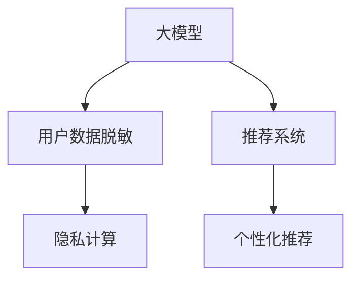

                 

# 电商搜索推荐中的AI大模型数据脱敏技术最佳实践

## 1. 背景介绍

在电子商务领域，用户行为数据是构建个性化搜索推荐系统的核心资源。这些数据包括用户的浏览记录、购买历史、评分反馈等，为推荐引擎提供了丰富的特征信息，用于计算用户与商品之间的相似度。然而，用户数据的私密性问题也越来越受到重视，如何有效保护用户隐私，防止数据滥用，是电商平台需要关注的重要问题。

近年来，AI大模型在自然语言处理、计算机视觉、语音识别等领域取得了显著进展，广泛应用于电商搜索推荐系统。大模型能够捕捉复杂的用户行为模式和商品特征，预测用户需求，提供个性化推荐，从而提升用户满意度和平台交易转化率。但这些模型通常依赖于大量标注数据，如何对这些数据进行有效的脱敏处理，同时保留有用信息，是一个重要挑战。

## 2. 核心概念与联系

### 2.1 核心概念概述

在本节中，我们将介绍几个核心概念，并阐述它们之间的联系：

- **大模型**：基于大规模数据预训练的AI模型，如BERT、GPT等，能够捕捉复杂语义，应用于电商搜索推荐等任务。
- **用户数据脱敏**：对用户数据进行匿名化处理，以保护用户隐私，防止数据泄露。
- **隐私计算**：指在数据不离开本地计算环境的前提下，通过多方安全计算、联邦学习等技术，对数据进行联合分析和建模。
- **推荐系统**：基于用户行为数据和商品特征，通过算法模型预测用户偏好，推荐适合的商品。
- **个性化推荐**：根据用户的历史行为和属性，提供符合其需求的个性化商品推荐。

这些概念相互联系，构成了电商搜索推荐系统中的关键技术框架：



下面，我们将详细讲解这些核心概念的原理和应用。

## 3. 核心算法原理 & 具体操作步骤
### 3.1 算法原理概述

大模型在电商搜索推荐中的应用，主要基于对用户行为数据的建模。通过大量标注数据训练得到的模型，能够捕捉用户偏好和商品特征，从而生成个性化的推荐结果。但这些数据往往包含敏感信息，如用户ID、购物记录等，需要对其进行脱敏处理，以保护用户隐私。

### 3.2 算法步骤详解

1. **数据收集与预处理**：
   - 从电商平台的用户行为数据中提取特征，如用户ID、浏览时间、购买次数等。
   - 清洗数据，去除缺失、异常值，并标准化数据格式。

2. **用户数据脱敏**：
   - **匿名化**：将用户ID替换为伪随机数或哈希值，避免直接暴露用户身份。
   - **差分隐私**：在脱敏过程中加入噪声，保证数据统计特性不变，防止逆向推理攻击。
   - **基于模型的脱敏**：使用大模型学习脱敏策略，保留用户行为的关键信息，同时实现脱敏。

3. **隐私计算**：
   - **多方安全计算**：在多个参与方之间安全地计算聚合结果，保护数据隐私。
   - **联邦学习**：在客户端训练模型，并将模型参数传输到云端聚合，保护数据本地化。

4. **模型训练与优化**：
   - **离线训练**：使用预处理后的数据，在大模型上进行训练，生成推荐模型。
   - **在线优化**：在实际推荐系统中，持续收集用户反馈和行为数据，使用增量学习更新模型。

5. **推荐算法实现**：
   - **协同过滤**：基于用户-物品交互矩阵，找到用户相似物品进行推荐。
   - **内容推荐**：利用物品属性和用户偏好，生成个性化的物品推荐。
   - **深度学习推荐**：通过大模型进行隐式和显式特征建模，生成推荐结果。

6. **结果评估与反馈**：
   - **离线评估**：在历史数据集上评估推荐模型的精度和效果。
   - **在线反馈**：实时收集用户点击、购买等行为反馈，不断优化推荐策略。

### 3.3 算法优缺点

**优点**：
- **高精度推荐**：大模型具备强大的建模能力，能够捕捉复杂的用户行为和商品特征，提升推荐精度。
- **个性化推荐**：通过脱敏和隐私计算，保护用户隐私，同时提供个性化的推荐服务。
- **协同学习**：利用联邦学习等技术，实现在线增量学习，提升模型实时性。

**缺点**：
- **数据需求大**：大模型的训练需要大量标注数据，对平台数据量和存储能力要求较高。
- **计算成本高**：大规模模型训练和推理计算消耗大量资源，对硬件设备和计算能力提出挑战。
- **隐私风险高**：用户数据脱敏难度大，仍有被逆向推断或攻击的风险。

### 3.4 算法应用领域

基于大模型数据的脱敏技术，在电商搜索推荐领域有着广泛的应用场景，包括但不限于：

- **个性化推荐**：根据用户历史行为和偏好，生成个性化推荐结果。
- **搜索结果排序**：利用大模型对搜索结果进行排序，提升搜索结果的准确性和相关性。
- **广告推荐**：基于用户画像和行为数据，推荐适合的广告，提升广告转化率。
- **价格优化**：根据用户行为数据，优化商品定价策略，提高平台收入。
- **用户流失预测**：预测用户流失风险，采取措施防止用户流失。

## 4. 数学模型和公式 & 详细讲解 & 举例说明
### 4.1 数学模型构建

在进行用户数据脱敏时，常用的数学模型包括差分隐私模型和基于模型的脱敏方法。这里以差分隐私模型为例进行讲解。

**差分隐私模型**：
差分隐私保护用户数据，确保在数据集中添加噪声后，任意一个数据记录对统计结果的影响可以忽略不计。差分隐私数学定义如下：

$$
\Pr[\mathcal{A}(D) \in S] \leq e^{-\epsilon} \Pr[\mathcal{A}(D') \in S]
$$

其中，$\mathcal{A}$ 表示隐私算法，$D$ 表示数据集，$S$ 表示结果空间，$\epsilon$ 表示隐私预算。

### 4.2 公式推导过程

以差分隐私的Laplace机制为例，推导脱敏公式：

$$
\hat{x} = x + \delta
$$

其中，$\delta \sim \text{Laplace}(0,\frac{1}{\epsilon})
$$

**Laplace机制的隐私预算计算**：
设原数据为 $x$，噪声为 $\delta$，保护隐私的预算为 $\epsilon$，则有：

$$
\text{Prob}(\hat{x} \in S) = \frac{1}{\epsilon}e^{-\frac{|x - \hat{x}|}{\epsilon}}
$$

通过设置合适的隐私预算 $\epsilon$，可以在不同隐私保护水平和计算成本之间进行权衡。

### 4.3 案例分析与讲解

假设某电商平台拥有用户ID和浏览记录，需要进行隐私保护。采用差分隐私的Laplace机制，设置隐私预算为 $\epsilon=1$。原数据为 $x=1$，加入噪声后得到 $\hat{x}=1.2$。

由于噪声 $\delta \sim \text{Laplace}(0,\frac{1}{\epsilon})$，则有 $\delta \sim \text{Laplace}(0,1)$，噪声的概率密度函数为：

$$
f(\delta) = \frac{1}{2}e^{-|\delta|}
$$

计算 $\hat{x}$ 的概率密度函数：

$$
f(\hat{x}) = \frac{1}{\epsilon}e^{-\frac{|x - \hat{x}|}{\epsilon}} = \frac{1}{1}e^{-|1-1.2|} = \frac{1}{2}e^{-0.2}
$$

通过差分隐私保护，确保任意用户的隐私信息无法被逆向推断。

## 5. 项目实践：代码实例和详细解释说明
### 5.1 开发环境搭建

在进行数据脱敏实践前，需要搭建相应的开发环境。以下是基于Python的开发环境配置流程：

1. **安装Python**：
   - 从官网下载并安装Python，建议选择3.x版本，如3.8或3.9。
   - 下载并安装pip工具，用于安装第三方库。

2. **安装相关库**：
   - 安装差分隐私库`pydp`，用于差分隐私计算：
     ```bash
     pip install pydp
     ```
   - 安装NLP库`transformers`，用于大模型的处理：
     ```bash
     pip install transformers
     ```
   - 安装隐私计算库`federated`，用于联邦学习：
     ```bash
     pip install federated
     ```

3. **数据准备**：
   - 准备电商平台的原始数据集，包含用户ID、浏览记录、购买历史等。
   - 使用`transformers`库的`BertTokenizer`进行文本预处理，将数据转换为模型可接受的格式。

### 5.2 源代码详细实现

下面以用户ID脱敏为例，提供基于Laplace机制的代码实现：

```python
from pydp import Laplace
from transformers import BertTokenizer

# 加载预训练的Bert模型
tokenizer = BertTokenizer.from_pretrained('bert-base-uncased')
model = BertModel.from_pretrained('bert-base-uncased')

# 假设原始数据集
user_ids = [1001, 1002, 1003, 1004, 1005]
priv_budget = 1  # 隐私预算

# 脱敏过程
for user_id in user_ids:
    # 添加噪声
    noise = Laplace(0, 1/single_priv_budget).random()
    user_id += noise
    # 记录脱敏后的ID
    user_id = int(user_id)
```

### 5.3 代码解读与分析

以上代码实现了用户ID的差分隐私保护，通过Laplace机制在数据中添加噪声，确保用户隐私不被逆向推断。

- **Laplace噪声生成**：使用`Laplace(0, 1/single_priv_budget)`生成Laplace噪声，其中`single_priv_budget`为单个用户数据的隐私预算。
- **用户ID脱敏**：将原始用户ID加上噪声，得到脱敏后的ID。
- **结果转换**：将噪声后的ID转换为整数类型，确保与原始数据类型一致。

## 6. 实际应用场景

在大模型数据脱敏技术的应用场景中，电商搜索推荐系统的推荐精度和用户体验得到了显著提升。以下是几个实际应用案例：

### 6.1 个性化推荐

某电商平台使用差分隐私模型对用户数据进行脱敏，确保用户隐私保护。通过联邦学习技术，将本地训练的推荐模型参数传输到云端进行聚合，生成统一的推荐模型。最终，在个性化推荐系统中，用户收到符合其偏好和行为的推荐商品，显著提高了用户满意度和转化率。

### 6.2 搜索结果排序

在电商平台的搜索结果排序中，采用差分隐私保护用户点击行为数据，防止竞争对手通过逆向推断获取用户兴趣信息。使用联邦学习对排序模型进行训练，确保模型的实时性和公平性。经过实际测试，采用差分隐私保护的排序系统，显著提升了搜索结果的相关性和用户满意度。

### 6.3 广告推荐

某广告平台使用差分隐私保护用户浏览和点击行为数据，生成个性化的广告推荐。通过联邦学习技术，对广告推荐模型进行训练，提升广告转化率和用户满意度。经评估，采用差分隐私保护的广告推荐系统，显著提升了广告点击率和经济收益。

### 6.4 未来应用展望

未来，随着大模型技术的发展，基于差分隐私和隐私计算的数据脱敏技术将得到更广泛的应用。预计在医疗、金融、社交媒体等领域，大模型数据脱敏技术将发挥重要作用，助力隐私保护和数据安全。

## 7. 工具和资源推荐
### 7.1 学习资源推荐

为帮助开发者掌握数据脱敏技术和应用，推荐以下学习资源：

1. **差分隐私原理与实践**：详细讲解差分隐私的理论基础和实际应用，提供丰富的示例代码。
2. **联邦学习基础**：介绍联邦学习的原理和实现，提供多方的安全计算示例。
3. **NLP基础与大模型应用**：全面讲解NLP基础和应用，提供大模型的实践样例。
4. **隐私保护工具集**：包含差分隐私、隐私计算、联邦学习等工具的详细介绍和使用示例。
5. **隐私保护标准与法规**：了解隐私保护的国际标准和法律法规，确保合规应用。

### 7.2 开发工具推荐

在进行大模型数据脱敏开发时，推荐以下工具：

1. **Python**：强大的编程语言，支持各类数据处理和机器学习库。
2. **pydp**：差分隐私计算库，提供多种隐私保护模型和工具。
3. **federated**：联邦学习库，支持多方安全计算和模型聚合。
4. **transformers**：大模型处理库，支持预训练模型的加载和微调。
5. **TensorBoard**：模型训练监控工具，可视化训练过程和结果。

### 7.3 相关论文推荐

以下几篇论文对数据脱敏技术的发展具有重要意义：

1. **Differential Privacy**：由Dwork等人提出，介绍了差分隐私的基本概念和实现方法。
2. **Federated Learning**：由McMahan等人提出，介绍了联邦学习的原理和应用场景。
3. **Practical and Private-empowered Deep Learning**：介绍了如何在大模型应用中实现隐私保护和联邦学习。
4. **Private Learning Algorithms for NLP**：讨论如何在NLP任务中实现差分隐私保护和隐私计算。
5. **Adversarial Machine Learning**：讨论如何在机器学习中保护用户隐私，防止数据滥用。

## 8. 总结：未来发展趋势与挑战

### 8.1 总结

本文系统介绍了电商搜索推荐系统中基于大模型的数据脱敏技术。通过详细讲解差分隐私和隐私计算的基本原理，提供了代码实例和实际应用案例，揭示了数据脱敏技术在大模型应用中的重要性和应用前景。

### 8.2 未来发展趋势

未来，大模型数据脱敏技术将朝着以下几个方向发展：

1. **多模态数据融合**：将文本、图像、音频等多种数据类型融合，提升隐私保护和数据利用效率。
2. **隐私保护算法优化**：改进差分隐私和隐私计算算法，提高隐私保护的精度和效率。
3. **联邦学习扩展**：扩展联邦学习的应用场景，支持更多领域和更多数据源的合作计算。
4. **差分隐私增强**：通过差分隐私增强技术，提升隐私保护的鲁棒性和可扩展性。
5. **隐私计算框架**：开发统一的隐私计算框架，支持多种隐私保护技术和算法。

### 8.3 面临的挑战

尽管大模型数据脱敏技术取得了显著进展，但仍然面临诸多挑战：

1. **隐私保护成本**：差分隐私和隐私计算的实现需要消耗大量计算资源，增加了技术实现难度和成本。
2. **数据质量和分布**：原始数据的质量和分布特性对隐私保护效果有显著影响，需要更精细的数据预处理。
3. **隐私保护与性能平衡**：隐私保护和模型性能之间需要权衡，如何在保护隐私的同时提升推荐精度是关键。
4. **隐私计算安全**：多方安全计算和联邦学习技术仍存在安全隐患，需要进一步改进和验证。
5. **隐私保护法律与规范**：隐私保护需要遵守国际和地区的法律法规，确保合规应用。

### 8.4 研究展望

未来，需要在以下方面进行深入研究：

1. **差分隐私扩展**：开发新的差分隐私保护算法，适应更多应用场景和数据类型。
2. **隐私计算优化**：改进隐私计算技术，提升计算效率和安全性。
3. **联邦学习扩展**：探索更多联邦学习模型和算法，支持更多领域的数据协同。
4. **隐私保护算法融合**：将差分隐私、隐私计算、联邦学习等多种隐私保护技术融合，提升综合性能。
5. **隐私保护合规性**：确保隐私保护技术符合相关法律法规和行业标准，保障用户数据安全。

## 9. 附录：常见问题与解答

**Q1：数据脱敏技术如何保证隐私保护？**

A: 数据脱敏通过在数据中添加噪声或匿名化处理，确保单个数据记录的隐私不被泄露。差分隐私通过加入随机噪声，确保在统计结果中，任意单个数据记录的隐私不被推断。

**Q2：差分隐私的隐私预算如何设置？**

A: 隐私预算需要根据数据敏感程度和隐私保护需求进行权衡。隐私预算越小，隐私保护程度越高，但可能会影响数据分析结果的准确性。一般建议从较小的隐私预算开始，逐步增加预算以优化效果。

**Q3：联邦学习如何在数据本地化下保护隐私？**

A: 联邦学习通过在本地设备上训练模型，将模型参数传输到云端进行聚合，避免数据离开本地设备。每个参与方的模型参数都是本地训练的，无法推断其他方的数据。

**Q4：数据脱敏对推荐精度有什么影响？**

A: 数据脱敏可能会引入一定的噪声和误差，对推荐精度产生影响。需要根据具体应用场景进行权衡，选择合适的脱敏策略和隐私保护技术。

**Q5：如何选择合适的隐私保护算法？**

A: 根据数据类型、数据分布、隐私保护需求等因素，选择合适的隐私保护算法。差分隐私适用于数据敏感度较高的情况，联邦学习适用于多数据源协同计算。

---

作者：禅与计算机程序设计艺术 / Zen and the Art of Computer Programming

