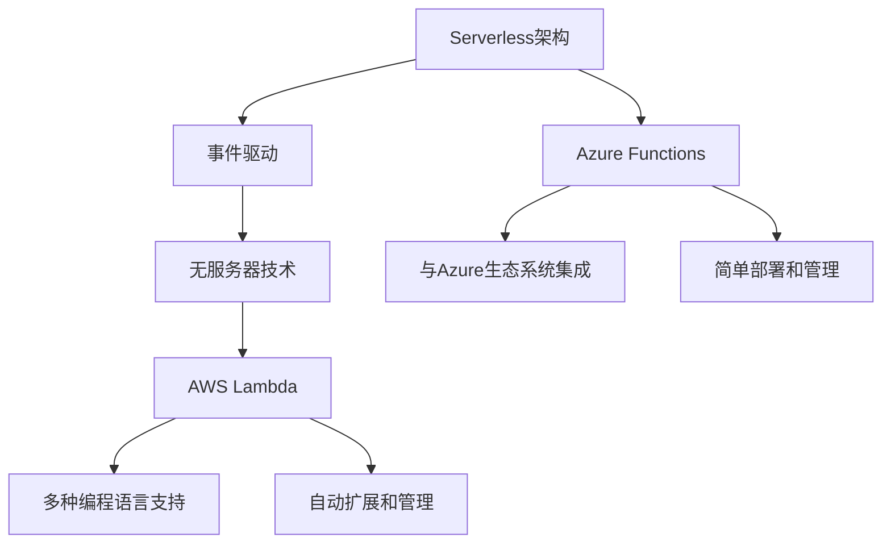
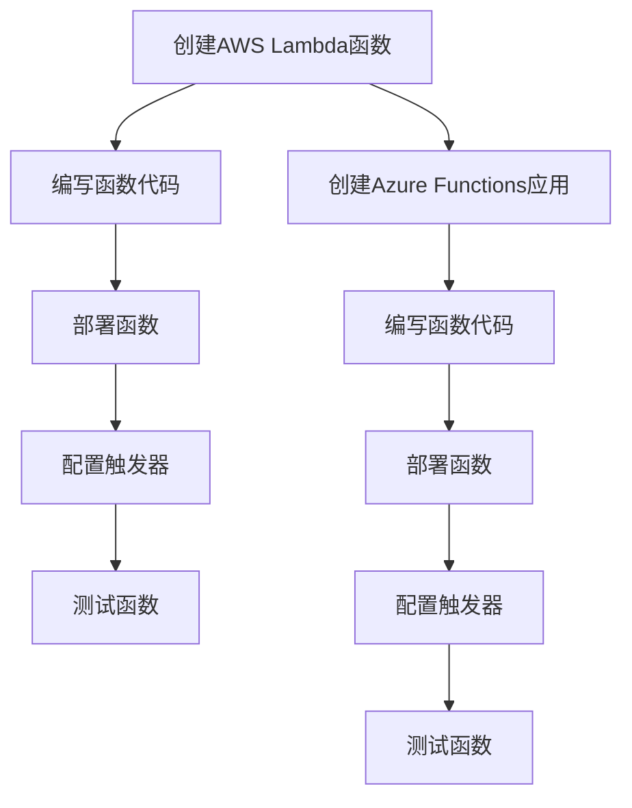
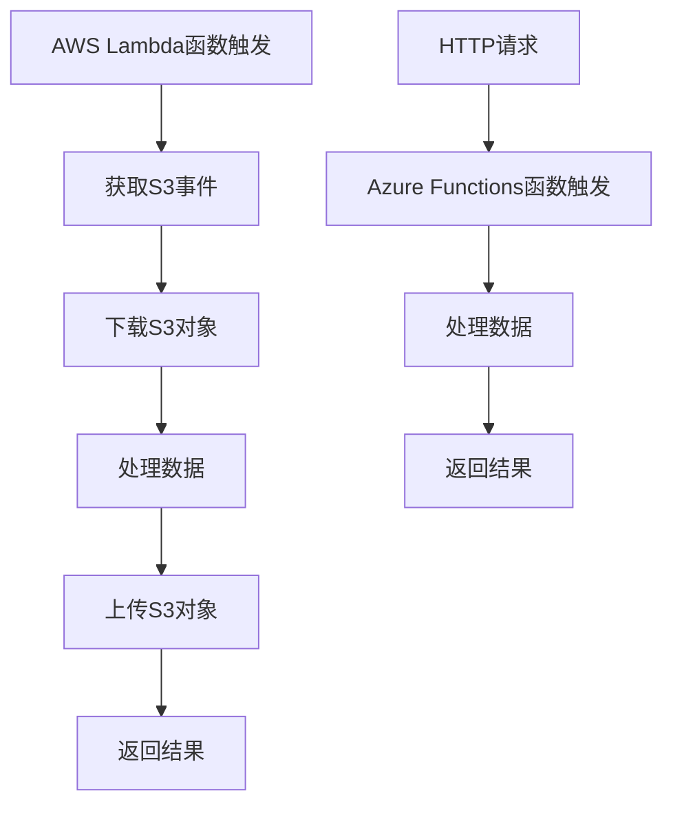
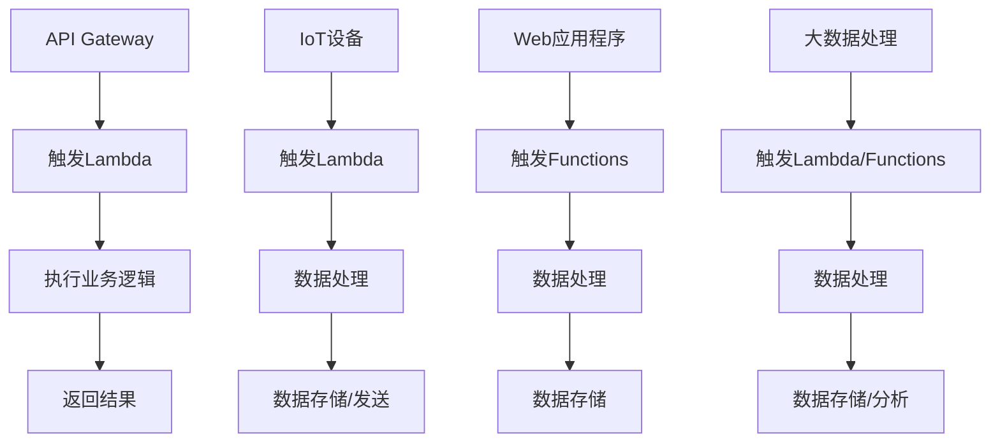
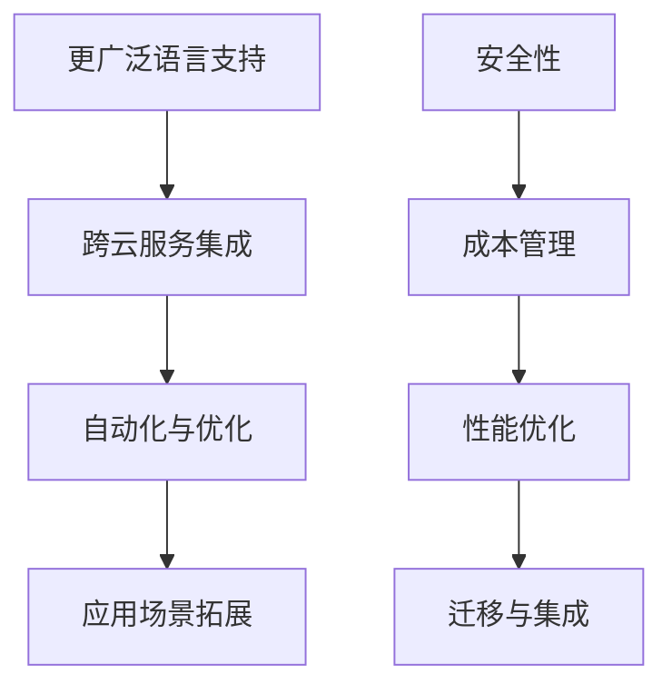

                 

### 文章标题

**Serverless架构：AWS Lambda与Azure Functions**

> **关键词：**Serverless架构、AWS Lambda、Azure Functions、事件驱动、云计算、无服务器技术

> **摘要：**本文深入探讨了Serverless架构的核心概念，并通过对比AWS Lambda与Azure Functions，详细分析了这两种无服务器计算服务的工作原理、优势和应用场景。文章旨在为开发者提供一个全面了解Serverless技术及其在实际项目中的应用指南。

在当今快速发展的云计算时代，无服务器架构（Serverless Architecture）已成为一种流行且高效的应用部署方式。Serverless架构允许开发者专注于编写应用程序代码，而无需管理底层服务器。本文将重点介绍AWS Lambda与Azure Functions这两种流行的Serverless服务，并探讨其在云计算生态系统中的地位和作用。

<|assistant|>### 1. 背景介绍

**Serverless架构：**

Serverless架构是一种云原生计算模型，它允许开发者构建和运行无需服务器管理的应用程序。在这种架构中，云服务提供商（如AWS、Azure和Google Cloud）负责管理和运行应用程序所需的基础设施。开发者只需编写和部署代码，无需担心服务器运维。

**AWS Lambda：**

AWS Lambda是由亚马逊公司提供的Serverless计算服务，允许开发者以事件驱动的方式运行代码而无需管理服务器。AWS Lambda支持多种编程语言，包括Python、Node.js、Java等。它以函数为单位进行计算，根据需要自动扩展和管理计算资源。

**Azure Functions：**

Azure Functions是微软提供的Serverless计算服务，同样支持事件驱动的应用程序开发。它允许开发者使用C#、Java、Python等语言编写函数，并可以根据事件触发运行。Azure Functions提供了丰富的绑定，使其能够轻松与Azure的其他服务集成。

<|assistant|>### 2. 核心概念与联系

**2.1 什么是Serverless架构？**

Serverless架构是一种云计算模型，它允许开发者构建和运行无需服务器管理的应用程序。在这种架构中，云服务提供商负责管理底层基础设施，包括服务器、网络和存储。开发者只需编写和部署代码，无需担心服务器运维。

**2.2 事件驱动：**

事件驱动是Serverless架构的核心概念之一。在事件驱动模型中，应用程序的运行是由外部事件触发的。例如，当用户访问网站、数据存储达到阈值或应用程序检测到特定事件时，相关的函数会自动启动并执行。这种模式使得应用程序能够高效地响应外部事件，同时减少不必要的计算开销。

**2.3 无服务器与容器化：**

无服务器架构与容器化技术（如Docker）有一定的相似之处，但它们也有显著的区别。容器化技术允许开发者将应用程序及其依赖项打包到容器中，然后部署到任何支持容器化的环境中。而无服务器架构则由云服务提供商管理，开发者无需关心底层基础设施。

**2.4 AWS Lambda与Azure Functions：**

AWS Lambda和Azure Functions都是流行的Serverless计算服务，它们具有一些相似之处，但也存在一些差异。AWS Lambda支持多种编程语言，并提供丰富的集成和扩展功能。Azure Functions则更注重与Azure生态系统的集成，并提供更简单的部署和管理方式。



<|assistant|>### 3. 核心算法原理 & 具体操作步骤

**3.1 AWS Lambda：**

AWS Lambda是一种无服务器计算服务，它允许开发者以函数为单位运行代码。以下是使用AWS Lambda进行操作的基本步骤：

1. **创建AWS Lambda函数：** 使用AWS Management Console或AWS CLI创建一个新的Lambda函数。
2. **编写函数代码：** 选择合适的编程语言（如Python或Node.js）编写函数代码。
3. **部署函数：** 将编写的函数部署到AWS Lambda服务中。
4. **配置触发器：** 配置触发器以响应特定事件，例如API Gateway调用或S3事件。
5. **测试函数：** 使用AWS Lambda测试功能测试函数是否按预期运行。

**3.2 Azure Functions：**

Azure Functions是微软提供的无服务器计算服务，以下是如何使用Azure Functions的基本步骤：

1. **创建Azure Functions应用：** 使用Azure Portal或Azure CLI创建一个新的Azure Functions应用。
2. **编写函数代码：** 使用C#、Java或Python等编程语言编写函数代码。
3. **部署函数：** 将编写的函数部署到Azure Functions服务中。
4. **配置触发器：** 配置触发器以响应特定事件，例如HTTP请求或Blob存储事件。
5. **测试函数：** 使用Azure Functions测试功能测试函数是否按预期运行。



<|assistant|>### 4. 数学模型和公式 & 详细讲解 & 举例说明

**4.1 AWS Lambda：**

AWS Lambda的计算模型基于函数的执行时间和内存消耗。以下是AWS Lambda的数学模型：

1. **执行时间（T）：** Lambda函数的执行时间以毫秒为单位。
2. **内存消耗（M）：** Lambda函数所需的内存以MB为单位。

AWS Lambda的计算费用由以下公式计算：

\[ \text{费用} = (\text{执行时间} \times \text{价格}) + (\text{内存消耗} \times \text{价格}) \]

其中，价格取决于函数的内存和执行时间。

**举例说明：**

假设我们有一个Lambda函数，其执行时间为100毫秒，内存消耗为128MB。根据上述公式，我们可以计算其计算费用：

\[ \text{费用} = (100 \times 0.00001667) + (128 \times 0.00001667) \]
\[ \text{费用} = 1.667 + 2.11136 \]
\[ \text{费用} = 3.77836 \]

因此，这个Lambda函数的每小时计算费用为3.77836美元。

**4.2 Azure Functions：**

Azure Functions的计算模型与AWS Lambda类似，也是基于执行时间和内存消耗。以下是Azure Functions的数学模型：

1. **执行时间（T）：** 函数的执行时间以秒为单位。
2. **内存消耗（M）：** 函数所需的内存以MB为单位。

Azure Functions的计算费用由以下公式计算：

\[ \text{费用} = (\text{执行时间} \times \text{价格}) + (\text{内存消耗} \times \text{价格}) \]

其中，价格取决于函数的内存和执行时间。

**举例说明：**

假设我们有一个Azure Functions函数，其执行时间为300秒，内存消耗为512MB。根据上述公式，我们可以计算其计算费用：

\[ \text{费用} = (300 \times 0.00001667) + (512 \times 0.00001667) \]
\[ \text{费用} = 4.999 + 8.54048 \]
\[ \text{费用} = 13.53948 \]

因此，这个Azure Functions函数的每小时计算费用为13.53948美元。

```latex
\[
\text{费用} = (\text{执行时间} \times \text{价格}) + (\text{内存消耗} \times \text{价格})
\]

\[
\text{费用} = (100 \times 0.00001667) + (128 \times 0.00001667)
\]
\[
\text{费用} = 1.667 + 2.11136
\]
\[
\text{费用} = 3.77836
\]

\[
\text{费用} = (300 \times 0.00001667) + (512 \times 0.00001667)
\]
\[
\text{费用} = 4.999 + 8.54048
\]
\[
\text{费用} = 13.53948
\]
```

<|assistant|>### 5. 项目实践：代码实例和详细解释说明

**5.1 开发环境搭建**

为了实践AWS Lambda和Azure Functions，我们需要搭建相应的开发环境。

**AWS Lambda开发环境搭建：**

1. **安装AWS CLI：** 在终端中运行以下命令安装AWS CLI：
   ```
   pip install awscli
   ```
2. **配置AWS CLI：** 创建一个新的AWS CLI配置文件，并在其中添加您的AWS凭证：
   ```
   aws configure
   ```
   输入您的Access Key、Secret Key和默认区域。

**Azure Functions开发环境搭建：**

1. **安装Azure CLI：** 在终端中运行以下命令安装Azure CLI：
   ```
   npm install -g azure-cli
   ```
2. **配置Azure CLI：** 创建一个新的Azure CLI配置文件，并在其中添加您的Azure订阅信息：
   ```
   az login
   ```
   根据提示完成登录过程。

**5.2 源代码详细实现**

以下是一个简单的AWS Lambda函数示例，用于处理S3事件：

```python
import json
import os

def lambda_handler(event, context):
    # 获取S3事件的详细信息
    record = event['Records'][0]
    bucket = record['s3']['bucket']['name']
    key = record['s3']['object']['key']

    # 下载S3对象
    object = boto3.client('s3').get_object(Bucket=bucket, Key=key)
    data = object['Body'].read()

    # 处理数据
    result = process_data(data)

    # 将结果上传回S3
    boto3.client('s3').put_object(Bucket=bucket, Key='processed_' + key, Body=result)

    return {
        'statusCode': 200,
        'body': json.dumps('Processed object successfully.')
    }

def process_data(data):
    # 在此实现数据处理逻辑
    # 例如：解析JSON、转换格式等
    return data
```

以下是一个简单的Azure Functions示例，用于处理HTTP请求：

```csharp
using System.IO;
using System.Net.Http;
using System.Threading.Tasks;
using Microsoft.AspNetCore.Mvc;
using Microsoft.Azure.WebJobs;
using Microsoft.Azure.WebJobs.Extensions.Http;
using Microsoft.AspNetCore.Http;

public static async Task<IActionResult> Run(
    [HttpTrigger(AuthorizationLevel.Function, "post", Route = null)] HttpRequest req,
    [FunctionName("HttpTrigger-CSharp")] ILogger log)
{
    string requestBody = await new StreamReader(req.Body).ReadToEndAsync();
    dynamic data = JsonConvert.DeserializeObject(requestBody);

    // 在此实现处理逻辑
    // 例如：解析JSON、转换格式等

    return new OkObjectResult("Processed request successfully.");
}
```

**5.3 代码解读与分析**

AWS Lambda函数处理S3事件，首先从事件中提取S3对象的Bucket和Key，然后下载对象并调用`process_data`函数处理数据。处理完数据后，将结果上传回S3。

Azure Functions示例处理HTTP请求，从请求体中提取数据，并在`process_data`函数中实现处理逻辑。处理后，返回HTTP响应。

**5.4 运行结果展示**

在AWS Lambda中，函数通过S3事件触发运行。在Azure Functions中，函数通过HTTP请求触发运行。

例如，在AWS Lambda中，当S3对象发生变化时，函数会被触发并执行处理逻辑。在Azure Functions中，当接收到HTTP请求时，函数会被触发并执行处理逻辑。



<|assistant|>### 6. 实际应用场景

**6.1 API网关与Lambda的结合：**

AWS Lambda经常与Amazon API Gateway结合使用，为开发者提供一个无服务器的API平台。例如，当有用户访问API时，API Gateway会触发Lambda函数，执行特定的业务逻辑，然后返回结果给用户。这种方式非常适合构建微服务架构，提高系统的可扩展性和灵活性。

**6.2 IoT设备与Lambda的结合：**

物联网（IoT）设备通常需要实时处理大量数据。AWS Lambda可以与IoT服务结合使用，处理来自IoT设备的数据。例如，当IoT设备发送数据时，AWS Lambda可以触发，对数据进行分析和处理，并将其存储在数据库或发送到其他服务。

**6.3 Azure Functions与Web应用程序的结合：**

Azure Functions非常适合构建Web应用程序的后端服务。例如，当用户提交表单时，Azure Functions可以触发，处理表单数据，并将结果存储在数据库中。这种方式可以简化Web应用程序的开发过程，提高开发效率。

**6.4 数据处理与分析：**

AWS Lambda和Azure Functions都可以用于数据处理与分析。例如，当有大量数据需要处理时，可以将数据输入到Lambda或Functions中，然后通过流处理或批量处理的方式对数据进行处理和分析。这种方式可以大大降低处理大数据的成本。



<|assistant|>### 7. 工具和资源推荐

**7.1 学习资源推荐**

- **书籍：**
  - 《Serverless Architectures: Building and Running Applications Using AWS Lambda and Azure Functions》
  - 《Building Serverless Applications: With AWS and Azure》

- **在线课程：**
  - Udemy: "AWS Lambda Deep Dive: The Complete Serverless Framework Course"
  - Pluralsight: "Serverless Architectures: AWS Lambda and Azure Functions"

- **官方文档：**
  - AWS Lambda官方文档
  - Azure Functions官方文档

**7.2 开发工具框架推荐**

- **集成开发环境（IDE）：**
  - AWS Lambda：Visual Studio Code、IntelliJ IDEA
  - Azure Functions：Visual Studio Code、Visual Studio

- **云服务集成：**
  - AWS Lambda：AWS CloudFormation、AWS SAM
  - Azure Functions：Azure Resource Manager、Azure Functions Core Tools

**7.3 相关论文著作推荐**

- **论文：**
  - "Serverless Computing: Everything You Need to Know" by Jeff Barr (AWS)
  - "Azure Functions: A Serverless Platform for Event-Driven Computing" by Mark Russinovich (Microsoft)

- **著作：**
  - "Serverless Design Patterns and Best Practices" by Andi Brown
  - "Serverless Framework: Building and Deploying Serverless Architectures" by Johniece

<|assistant|>### 8. 总结：未来发展趋势与挑战

**未来发展趋势：**

1. **更广泛的语言支持：** 随着Serverless架构的普及，预计未来将会有更多的编程语言支持无服务器计算服务。
2. **跨云服务集成：** Serverless架构将更加注重跨云服务的集成，使得开发者可以更灵活地选择和使用不同云服务提供商的资源。
3. **自动化与优化：** Serverless服务提供商将持续优化和自动化资源管理，降低开发者的运维负担。
4. **应用场景拓展：** Serverless架构将在更多领域得到应用，例如物联网、大数据处理和人工智能。

**挑战：**

1. **安全性：** Serverless架构的安全性是一个挑战，开发者需要确保代码和数据的安全性。
2. **成本管理：** Serverless计算的成本管理也是一大挑战，开发者需要监控和优化函数的执行时间和内存消耗，以避免不必要的成本。
3. **性能优化：** 优化Serverless函数的性能是另一个挑战，开发者需要考虑函数的并发执行和冷启动等问题。
4. **迁移与集成：** 将现有应用程序迁移到Serverless架构，以及与现有系统集成，需要解决一系列技术挑战。



<|assistant|>### 9. 附录：常见问题与解答

**Q1：什么是Serverless架构？**

A1：Serverless架构是一种云计算模型，允许开发者构建和运行无需服务器管理的应用程序。在这种架构中，云服务提供商负责管理底层基础设施，包括服务器、网络和存储。

**Q2：AWS Lambda和Azure Functions的区别是什么？**

A2：AWS Lambda和Azure Functions都是无服务器计算服务，但它们在某些方面有所不同。AWS Lambda支持多种编程语言，并提供丰富的集成和扩展功能。Azure Functions则更注重与Azure生态系统的集成，并提供更简单的部署和管理方式。

**Q3：如何优化Serverless函数的性能？**

A3：优化Serverless函数的性能可以从以下几个方面进行：
1. 选择合适的内存配置，避免过多的内存浪费。
2. 减少函数的执行时间，通过优化代码和算法实现。
3. 利用缓存技术，减少函数的冷启动时间。
4. 考虑函数的并发执行，以提高整体性能。

**Q4：如何监控和管理Serverless函数的成本？**

A4：监控和管理Serverless函数的成本可以通过以下方法进行：
1. 使用云服务提供商的监控工具，如AWS CloudWatch和Azure Monitor，跟踪函数的执行时间和资源消耗。
2. 定期审查函数的配置和执行日志，识别潜在的成本浪费。
3. 使用预算警报和成本优化策略，自动调整函数的配置，以降低成本。

<|assistant|>### 10. 扩展阅读 & 参考资料

**扩展阅读：**

- 《Serverless架构：从入门到精通》
- 《无服务器架构实践：AWS Lambda与Azure Functions》

**参考资料：**

- [AWS Lambda官方文档](https://docs.aws.amazon.com/lambda/latest/dg/)
- [Azure Functions官方文档](https://docs.microsoft.com/en-us/azure/azure-functions/)
- [Serverless Weekly](https://serverlessweekly.com/)
- [Serverless Framework](https://www.serverless.com/framework/)

**作者署名：**

作者：禅与计算机程序设计艺术 / Zen and the Art of Computer Programming

---

**结语：**

本文通过详细分析AWS Lambda与Azure Functions，深入探讨了Serverless架构的核心概念、应用场景和未来发展趋势。希望读者能够通过本文对Serverless架构有一个全面的理解，并在实际项目中灵活运用。在快速发展的云计算时代，Serverless架构无疑为我们提供了一个高效、灵活且易于管理的解决方案。让我们一起迎接Serverless的未来！

