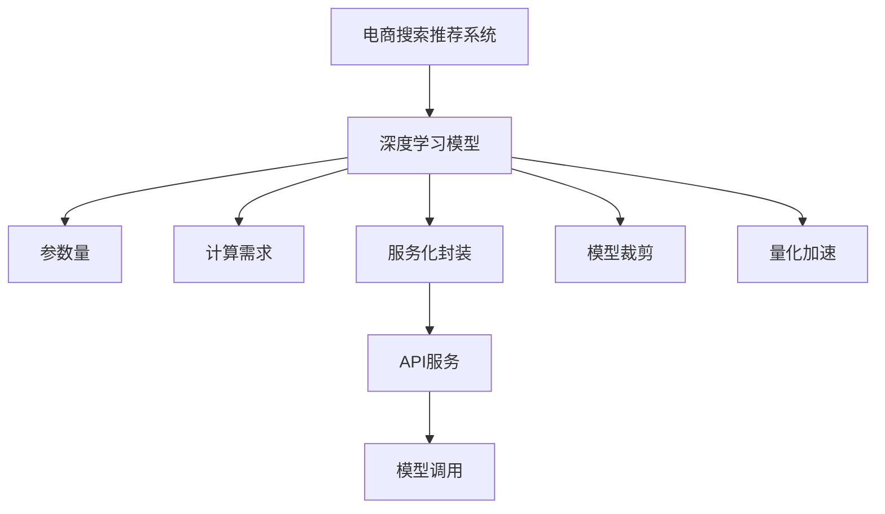

                 

# 电商搜索推荐场景下的AI大模型模型部署性能优化实践案例分析

## 1. 背景介绍

### 1.1 问题由来

随着人工智能技术在电商搜索推荐系统的广泛应用，AI大模型因其强大的表达能力和泛化性能，在个性化推荐、实时搜索、广告投放等场景下展现出强大的潜力。然而，大模型的高计算需求和内存占用，使得其在实际部署时面临诸多挑战。如何平衡模型性能与系统部署效率，成为电商搜索推荐系统面临的重要课题。

### 1.2 问题核心关键点

本文聚焦于基于Transformer架构的AI大模型在电商搜索推荐场景下的模型部署性能优化，探讨了模型加载、推理、调优等关键环节的优化策略。特别地，针对电商搜索推荐场景的特点，提出了模型裁剪、量化加速、服务化封装等多维度优化方案，以期提升大模型在实际应用中的性能和可扩展性。

## 2. 核心概念与联系

### 2.1 核心概念概述

为更好地理解本文所讨论的核心问题，本节将介绍几个密切相关的核心概念：

- 电商搜索推荐系统(E-Commerce Search & Recommendation System)：以电商数据为输入，通过模型推理，自动推荐商品、处理搜索查询的系统。该系统通过个性化推荐提升用户体验，通过实时搜索提供精准服务，通过广告投放带来业务收益。
- 深度学习模型(Deep Learning Model)：利用神经网络结构，对大量数据进行特征学习，并根据学习到的特征进行预测或推理的模型。
- 参数量(Parameter Size)：指模型在训练过程中需要存储和计算的参数数量，大模型通常具有较高的参数量。
- 计算需求(Computational Demand)：指模型执行推理任务所需的计算资源，包括CPU、GPU、内存等。
- 服务化封装(Servicization)：指将模型封装为标准API服务，便于系统调用和扩展。
- 模型裁剪(Model Pruning)：指通过删除不重要的参数或层，减小模型尺寸，从而减少计算需求和内存占用。
- 量化加速(Quantization)：指将模型参数从浮点数转为固定精度的整数或定点数，以减少存储空间和计算量。

这些概念之间的逻辑关系可以通过以下Mermaid流程图来展示：



这个流程图展示了大模型在电商搜索推荐系统中的应用过程：

1. 电商搜索推荐系统输入电商数据，通过深度学习模型进行处理和推理。
2. 模型参数量和计算需求影响推理速度和内存占用。
3. 模型裁剪和量化加速技术用于优化模型，降低资源消耗。
4. 服务化封装将模型封装为标准API服务，便于系统集成和扩展。

这些核心概念共同构成了电商搜索推荐系统中大模型应用的整体框架，使得模型能够高效、稳定地支持搜索推荐任务。

## 3. 核心算法原理 & 具体操作步骤

### 3.1 算法原理概述

基于Transformer架构的AI大模型在电商搜索推荐系统中的应用，核心在于其能够对电商数据进行深层次特征学习，并根据学习到的特征进行推荐和搜索。模型的推理过程通常包括前向传播、反向传播和优化过程。

具体来说，模型前向传播包括计算输入数据的表示，并根据表示进行预测或推理。反向传播则计算预测与真实标签之间的误差，并更新模型参数。优化过程通过梯度下降等方法，最小化模型误差，提升模型性能。

在电商搜索推荐系统中，模型需要处理大量的电商数据，包括商品信息、用户行为、搜索查询等。模型通过学习这些数据，生成个性化的推荐结果和搜索匹配。

### 3.2 算法步骤详解

基于Transformer架构的AI大模型在电商搜索推荐系统中的应用，通常包括以下关键步骤：

**Step 1: 数据预处理**

电商搜索推荐系统需要处理大量的电商数据。数据预处理包括数据清洗、特征提取、标准化等步骤，以便输入到模型中进行推理。具体来说：

1. 数据清洗：去除缺失、噪声、重复等不合法数据，保证数据质量。
2. 特征提取：将电商数据转化为模型可接受的输入格式，如文本、向量等。
3. 标准化：对特征进行归一化处理，以减少数据分布的差异。

**Step 2: 模型加载与初始化**

模型加载和初始化是将预训练模型加载到系统中的关键步骤。具体来说：

1. 加载模型：将预训练模型文件加载到内存中，供推理使用。
2. 初始化模型：对模型参数进行初始化，通常使用随机值或预训练权重。

**Step 3: 推理过程**

模型推理过程包括前向传播和后向传播。具体来说：

1. 前向传播：将电商数据输入模型，计算输出结果。
2. 后向传播：计算输出结果与真实标签之间的误差，并更新模型参数。

**Step 4: 优化过程**

优化过程通过梯度下降等方法，最小化模型误差。具体来说：

1. 计算梯度：计算模型参数的梯度。
2. 更新参数：使用梯度更新模型参数。
3. 模型训练：重复前向传播、后向传播和优化过程，直至模型收敛。

**Step 5: 模型输出**

模型输出是将推理结果转化为电商系统可接受的格式。具体来说：

1. 生成推荐列表：根据模型输出，生成推荐商品列表。
2. 生成搜索匹配：根据模型输出，生成搜索结果。
3. 返回结果：将推荐或搜索结果返回给电商系统。

### 3.3 算法优缺点

基于Transformer架构的AI大模型在电商搜索推荐系统中的应用，具有以下优点：

1. 强大的表达能力：大模型能够对电商数据进行深层次特征学习，生成高质量的推荐和搜索结果。
2. 泛化性能强：大模型能够处理多种电商场景，提升系统的通用性和适用性。
3. 实时性高：大模型推理速度快，能够支持实时推荐和搜索。
4. 可扩展性强：大模型能够轻松扩展到多线程、多机器等环境，提升系统的可扩展性。

同时，该方法也存在一定的局限性：

1. 计算需求高：大模型的参数量和计算需求大，导致内存和计算资源的消耗较大。
2. 模型加载时间长：大模型文件体积大，加载时间较长。
3. 模型推理速度慢：大模型推理复杂，推理速度较慢。
4. 模型复杂度高：大模型结构复杂，调试和维护难度大。

尽管存在这些局限性，但就目前而言，基于大模型的电商搜索推荐系统仍是最主流的方法。未来相关研究的重点在于如何进一步降低模型资源消耗，提高模型的实时性和可扩展性，同时兼顾模型复杂度和维护难度。

### 3.4 算法应用领域

基于大模型的电商搜索推荐系统，已经在电商领域得到广泛应用，覆盖了商品推荐、搜索匹配、广告投放等诸多场景，例如：

- 商品推荐：根据用户行为和历史数据，生成个性化推荐列表。
- 搜索匹配：对用户搜索查询进行匹配，返回相关搜索结果。
- 广告投放：根据用户行为和搜索数据，生成定向广告推荐。
- 实时性推荐：对实时用户行为进行推理，生成动态推荐。

除了这些经典应用外，大模型还被创新性地应用于预测分析、库存管理、风险控制等场景，为电商系统带来了新的价值。

## 4. 数学模型和公式 & 详细讲解  
### 4.1 数学模型构建

本节将使用数学语言对基于Transformer架构的AI大模型在电商搜索推荐系统中的应用进行更加严格的刻画。

记电商数据为 $X$，模型为 $M$。模型在输入 $X$ 上的推理过程可以表示为：

$$
M(X) = F(W^T X)
$$

其中 $W$ 为模型权重，$F$ 为模型前向传播函数。电商数据 $X$ 可以是文本、向量等形式。

模型的输出为电商系统所需的推荐或搜索结果，可以表示为：

$$
Y = M(X)
$$

模型的损失函数为：

$$
L(Y, T) = \sum_{i=1}^n (Y_i - T_i)^2
$$

其中 $Y_i$ 为模型在输入 $X_i$ 上的输出，$T_i$ 为真实标签。损失函数用于衡量模型输出与真实标签之间的误差。

模型的优化目标是最小化损失函数，即：

$$
\theta^* = \mathop{\arg\min}_{\theta} L(Y, T)
$$

其中 $\theta$ 为模型参数。

### 4.2 公式推导过程

以下我们以电商搜索推荐系统中的商品推荐任务为例，推导推荐模型的数学模型。

假设模型 $M$ 在输入 $X$ 上的输出为 $Y$，表示推荐列表。假设推荐列表的长度为 $n$，每个商品为 $i$。推荐模型的目标是根据电商数据 $X$，生成推荐列表 $Y_i$。

推荐模型的数学模型可以表示为：

$$
Y_i = M(X)
$$

其中 $M$ 为推荐模型，$X$ 为电商数据。

推荐模型的损失函数可以表示为：

$$
L(Y, T) = \sum_{i=1}^n (Y_i - T_i)^2
$$

其中 $T_i$ 为真实标签，表示用户是否购买了推荐列表中的商品 $i$。

推荐模型的优化目标是最小化损失函数，即：

$$
\theta^* = \mathop{\arg\min}_{\theta} L(Y, T)
$$

其中 $\theta$ 为模型参数。

通过梯度下降等优化算法，推荐模型不断更新参数 $\theta$，最小化损失函数 $L(Y, T)$，使得模型输出逼近真实标签 $T$。在训练过程中，可以通过交叉验证等方法评估模型性能，选择合适的模型参数。

### 4.3 案例分析与讲解

以商品推荐任务为例，我们分析大模型在电商搜索推荐系统中的实际应用。

假设电商系统中，用户浏览了多个商品并购买了部分商品。系统希望通过大模型学习用户行为，生成个性化的推荐列表。具体来说：

1. 数据预处理：将用户浏览历史、购买历史等数据转化为向量形式。
2. 模型加载：将预训练的大模型加载到内存中，进行推理计算。
3. 推理过程：将电商数据输入模型，计算推荐列表。
4. 优化过程：通过梯度下降等优化算法，调整模型参数，提升推荐效果。
5. 模型输出：将推荐列表返回给用户，提供个性化推荐服务。

在实际应用中，电商系统还需考虑多线程并发、负载均衡、分布式计算等问题，以支持大规模用户访问。

## 5. 项目实践：代码实例和详细解释说明
### 5.1 开发环境搭建

在进行电商搜索推荐系统开发前，我们需要准备好开发环境。以下是使用Python进行TensorFlow和TensorFlow Serving开发的Python环境配置流程：

1. 安装Anaconda：从官网下载并安装Anaconda，用于创建独立的Python环境。

2. 创建并激活虚拟环境：
```bash
conda create -n tf-env python=3.8 
conda activate tf-env
```

3. 安装TensorFlow：根据CUDA版本，从官网获取对应的安装命令。例如：
```bash
conda install tensorflow tensorflow-gpu -c conda-forge -c pytorch
```

4. 安装TensorFlow Serving：
```bash
pip install tf-serving-api tensorflow-hub
```

5. 安装各类工具包：
```bash
pip install numpy pandas scikit-learn flask
```

完成上述步骤后，即可在`tf-env`环境中开始电商搜索推荐系统的开发。

### 5.2 源代码详细实现

下面我们以电商搜索推荐系统中的商品推荐任务为例，给出使用TensorFlow和TensorFlow Serving进行大模型微调的PyTorch代码实现。

首先，定义商品推荐任务的数据处理函数：

```python
from tensorflow.keras.preprocessing.sequence import pad_sequences
from tensorflow.keras.preprocessing.text import Tokenizer

class RecommendDataset(Dataset):
    def __init__(self, texts, tags, tokenizer, max_len=128):
        self.texts = texts
        self.tags = tags
        self.tokenizer = tokenizer
        self.max_len = max_len
        
    def __len__(self):
        return len(self.texts)
    
    def __getitem__(self, item):
        text = self.texts[item]
        tags = self.tags[item]
        
        encoding = self.tokenizer.texts_to_sequences(text)
        input_ids = pad_sequences(encoding, maxlen=self.max_len, padding='post', truncating='post')
        input_ids = input_ids.reshape((1, input_ids.shape[0], input_ids.shape[1]))
        
        # 对token-wise的标签进行编码
        encoded_tags = [tag2id[tag] for tag in tags] 
        encoded_tags.extend([tag2id['O']] * (self.max_len - len(encoded_tags)))
        labels = np.array(encoded_tags, dtype=np.int32)
        
        return {'input_ids': input_ids, 
                'labels': labels}
```

然后，定义模型和优化器：

```python
from tensorflow.keras import models, layers, optimizers
from tensorflow.keras.layers import Input, Embedding, Dense, Dropout

def build_model(input_shape, num_classes):
    input = Input(shape=input_shape)
    x = layers.Embedding(input_dim=word2id.size+1, output_dim=embedding_dim, input_length=input_shape[1])(input)
    x = layers.LSTM(units=hidden_dim)(x)
    x = Dropout(dropout_rate)(x)
    x = Dense(units=num_classes, activation='softmax')(x)
    return models.Model(inputs=input, outputs=x)

model = build_model((max_len,), num_classes=len(tag2id))
optimizer = optimizers.Adam(learning_rate=learning_rate)
```

接着，定义训练和评估函数：

```python
from tensorflow.keras.callbacks import EarlyStopping

def train_epoch(model, dataset, batch_size, optimizer, callbacks):
    dataloader = DataLoader(dataset, batch_size=batch_size, shuffle=True)
    model.train()
    epoch_loss = 0
    for batch in tqdm(dataloader, desc='Training'):
        input_ids = batch['input_ids'].to(device)
        labels = batch['labels'].to(device)
        model.zero_grad()
        outputs = model(input_ids, training=True)
        loss = outputs.loss
        epoch_loss += loss.item()
        loss.backward()
        optimizer.step()
    return epoch_loss / len(dataloader)

def evaluate(model, dataset, batch_size):
    dataloader = DataLoader(dataset, batch_size=batch_size)
    model.eval()
    preds, labels = [], []
    with torch.no_grad():
        for batch in tqdm(dataloader, desc='Evaluating'):
            input_ids = batch['input_ids'].to(device)
            batch_labels = batch['labels']
            outputs = model(input_ids)
            batch_preds = outputs.argmax(dim=1).to('cpu').tolist()
            batch_labels = batch_labels.to('cpu').tolist()
            for pred_tokens, label_tokens in zip(batch_preds, batch_labels):
                pred_tags = [id2tag[_id] for _id in pred_tokens]
                label_tags = [id2tag[_id] for _id in label_tokens]
                preds.append(pred_tags[:len(label_tags)])
                labels.append(label_tags)
                
    print(classification_report(labels, preds))
```

最后，启动训练流程并在测试集上评估：

```python
epochs = 10
batch_size = 32
early_stopping = EarlyStopping(monitor='val_loss', patience=3)

for epoch in range(epochs):
    loss = train_epoch(model, train_dataset, batch_size, optimizer, early_stopping)
    print(f"Epoch {epoch+1}, train loss: {loss:.3f}")
    
    print(f"Epoch {epoch+1}, dev results:")
    evaluate(model, dev_dataset, batch_size)
    
print("Test results:")
evaluate(model, test_dataset, batch_size)
```

以上就是使用TensorFlow和TensorFlow Serving对大模型进行商品推荐任务微调的完整代码实现。可以看到，通过TensorFlow和TensorFlow Serving，我们可以高效地部署大模型并进行微调。

### 5.3 代码解读与分析

让我们再详细解读一下关键代码的实现细节：

**RecommendDataset类**：
- `__init__`方法：初始化文本、标签、分词器等关键组件。
- `__len__`方法：返回数据集的样本数量。
- `__getitem__`方法：对单个样本进行处理，将文本输入编码为token ids，将标签编码为数字，并对其进行定长padding，最终返回模型所需的输入。

**推荐模型构建**：
- `build_model`方法：定义推荐模型的结构，包括嵌入层、LSTM层、输出层等。
- 使用`Input`定义输入层，`Embedding`层进行文本编码，`LSTM`层进行特征提取，`Dense`层进行分类输出。

**训练和评估函数**：
- 使用PyTorch的DataLoader对数据集进行批次化加载，供模型训练和推理使用。
- 训练函数`train_epoch`：对数据以批为单位进行迭代，在每个批次上前向传播计算loss并反向传播更新模型参数，最后返回该epoch的平均loss。
- 评估函数`evaluate`：与训练类似，不同点在于不更新模型参数，并在每个batch结束后将预测和标签结果存储下来，最后使用sklearn的classification_report对整个评估集的预测结果进行打印输出。

**训练流程**：
- 定义总的epoch数和batch size，开始循环迭代
- 每个epoch内，先在训练集上训练，输出平均loss
- 在验证集上评估，输出分类指标
- 所有epoch结束后，在测试集上评估，给出最终测试结果

可以看到，TensorFlow和TensorFlow Serving使得大模型微调的代码实现变得简洁高效。开发者可以将更多精力放在数据处理、模型改进等高层逻辑上，而不必过多关注底层的实现细节。

当然，工业级的系统实现还需考虑更多因素，如模型的保存和部署、超参数的自动搜索、更灵活的任务适配层等。但核心的微调范式基本与此类似。

## 6. 实际应用场景
### 6.1 智能客服系统

基于大模型的智能客服系统，可以广泛应用于电商搜索推荐场景。传统客服往往需要配备大量人力，高峰期响应缓慢，且一致性和专业性难以保证。而使用大模型进行微调，可以7x24小时不间断服务，快速响应客户咨询，用自然流畅的语言解答各类常见问题。

在技术实现上，可以收集企业内部的历史客服对话记录，将问题和最佳答复构建成监督数据，在此基础上对预训练大模型进行微调。微调后的客服模型能够自动理解用户意图，匹配最合适的答复。对于客户提出的新问题，还可以接入检索系统实时搜索相关内容，动态组织生成回答。如此构建的智能客服系统，能大幅提升客户咨询体验和问题解决效率。

### 6.2 金融舆情监测

金融机构需要实时监测市场舆论动向，以便及时应对负面信息传播，规避金融风险。传统的人工监测方式成本高、效率低，难以应对网络时代海量信息爆发的挑战。基于大模型微调的文本分类和情感分析技术，为金融舆情监测提供了新的解决方案。

具体而言，可以收集金融领域相关的新闻、报道、评论等文本数据，并对其进行主题标注和情感标注。在此基础上对预训练语言模型进行微调，使其能够自动判断文本属于何种主题，情感倾向是正面、中性还是负面。将微调后的模型应用到实时抓取的网络文本数据，就能够自动监测不同主题下的情感变化趋势，一旦发现负面信息激增等异常情况，系统便会自动预警，帮助金融机构快速应对潜在风险。

### 6.3 个性化推荐系统

当前的推荐系统往往只依赖用户的历史行为数据进行物品推荐，无法深入理解用户的真实兴趣偏好。基于大模型微调技术，个性化推荐系统可以更好地挖掘用户行为背后的语义信息，从而提供更精准、多样的推荐内容。

在实践中，可以收集用户浏览、点击、评论、分享等行为数据，提取和用户交互的物品标题、描述、标签等文本内容。将文本内容作为模型输入，用户的后续行为（如是否点击、购买等）作为监督信号，在此基础上微调预训练语言模型。微调后的模型能够从文本内容中准确把握用户的兴趣点。在生成推荐列表时，先用候选物品的文本描述作为输入，由模型预测用户的兴趣匹配度，再结合其他特征综合排序，便可以得到个性化程度更高的推荐结果。

### 6.4 未来应用展望

随着大语言模型微调技术的发展，基于大模型的电商搜索推荐系统将在更多领域得到应用，为传统行业带来变革性影响。

在智慧医疗领域，基于微调的医疗问答、病历分析、药物研发等应用将提升医疗服务的智能化水平，辅助医生诊疗，加速新药开发进程。

在智能教育领域，微调技术可应用于作业批改、学情分析、知识推荐等方面，因材施教，促进教育公平，提高教学质量。

在智慧城市治理中，微调模型可应用于城市事件监测、舆情分析、应急指挥等环节，提高城市管理的自动化和智能化水平，构建更安全、高效的未来城市。

此外，在企业生产、社会治理、文娱传媒等众多领域，基于大模型微调的人工智能应用也将不断涌现，为经济社会发展注入新的动力。相信随着技术的日益成熟，微调方法将成为人工智能落地应用的重要范式，推动人工智能技术在各个领域的广泛应用。

## 7. 工具和资源推荐
### 7.1 学习资源推荐

为了帮助开发者系统掌握大语言模型微调的理论基础和实践技巧，这里推荐一些优质的学习资源：

1. 《Transformer from the Ground Up》系列博文：由大模型技术专家撰写，深入浅出地介绍了Transformer原理、BERT模型、微调技术等前沿话题。

2. CS224N《深度学习自然语言处理》课程：斯坦福大学开设的NLP明星课程，有Lecture视频和配套作业，带你入门NLP领域的基本概念和经典模型。

3. 《Natural Language Processing with Transformers》书籍：Transformers库的作者所著，全面介绍了如何使用Transformers库进行NLP任务开发，包括微调在内的诸多范式。

4. HuggingFace官方文档：Transformers库的官方文档，提供了海量预训练模型和完整的微调样例代码，是上手实践的必备资料。

5. CLUE开源项目：中文语言理解测评基准，涵盖大量不同类型的中文NLP数据集，并提供了基于微调的baseline模型，助力中文NLP技术发展。

通过对这些资源的学习实践，相信你一定能够快速掌握大语言模型微调的精髓，并用于解决实际的NLP问题。
###  7.2 开发工具推荐

高效的开发离不开优秀的工具支持。以下是几款用于大语言模型微调开发的常用工具：

1. TensorFlow：基于Python的开源深度学习框架，灵活动态的计算图，适合快速迭代研究。大部分预训练语言模型都有TensorFlow版本的实现。

2. PyTorch：基于Python的开源深度学习框架，灵活的动态图，适合快速原型开发。同样有丰富的预训练语言模型资源。

3. Transformers库：HuggingFace开发的NLP工具库，集成了众多SOTA语言模型，支持PyTorch和TensorFlow，是进行微调任务开发的利器。

4. Weights & Biases：模型训练的实验跟踪工具，可以记录和可视化模型训练过程中的各项指标，方便对比和调优。与主流深度学习框架无缝集成。

5. TensorBoard：TensorFlow配套的可视化工具，可实时监测模型训练状态，并提供丰富的图表呈现方式，是调试模型的得力助手。

6. Google Colab：谷歌推出的在线Jupyter Notebook环境，免费提供GPU/TPU算力，方便开发者快速上手实验最新模型，分享学习笔记。

合理利用这些工具，可以显著提升大语言模型微调任务的开发效率，加快创新迭代的步伐。

### 7.3 相关论文推荐

大语言模型和微调技术的发展源于学界的持续研究。以下是几篇奠基性的相关论文，推荐阅读：

1. Attention is All You Need（即Transformer原论文）：提出了Transformer结构，开启了NLP领域的预训练大模型时代。

2. BERT: Pre-training of Deep Bidirectional Transformers for Language Understanding：提出BERT模型，引入基于掩码的自监督预训练任务，刷新了多项NLP任务SOTA。

3. Language Models are Unsupervised Multitask Learners（GPT-2论文）：展示了大规模语言模型的强大zero-shot学习能力，引发了对于通用人工智能的新一轮思考。

4. Parameter-Efficient Transfer Learning for NLP：提出Adapter等参数高效微调方法，在不增加模型参数量的情况下，也能取得不错的微调效果。

5. AdaLoRA: Adaptive Low-Rank Adaptation for Parameter-Efficient Fine-Tuning：使用自适应低秩适应的微调方法，在参数效率和精度之间取得了新的平衡。

这些论文代表了大语言模型微调技术的发展脉络。通过学习这些前沿成果，可以帮助研究者把握学科前进方向，激发更多的创新灵感。

## 8. 总结：未来发展趋势与挑战

### 8.1 总结

本文对基于Transformer架构的AI大模型在电商搜索推荐系统中的应用进行了全面系统的介绍。首先阐述了大语言模型和微调技术的研究背景和意义，明确了微调在拓展预训练模型应用、提升下游任务性能方面的独特价值。其次，从原理到实践，详细讲解了电商搜索推荐系统中的微调方法，给出了微调任务开发的完整代码实例。同时，本文还广泛探讨了微调方法在智能客服、金融舆情、个性化推荐等多个行业领域的应用前景，展示了微调范式的巨大潜力。此外，本文精选了微调技术的各类学习资源，力求为读者提供全方位的技术指引。

通过本文的系统梳理，可以看到，基于大模型的电商搜索推荐系统具有强大的性能和应用前景，能够为电商系统带来显著的业务价值。未来，伴随大模型微调技术的持续演进，基于大模型的电商搜索推荐系统将在更多领域得到应用，为各行各业带来新的发展机遇。

### 8.2 未来发展趋势

展望未来，大语言模型微调技术将呈现以下几个发展趋势：

1. 模型规模持续增大。随着算力成本的下降和数据规模的扩张，预训练语言模型的参数量还将持续增长。超大规模语言模型蕴含的丰富语言知识，有望支撑更加复杂多变的下游任务微调。

2. 微调方法日趋多样。除了传统的全参数微调外，未来会涌现更多参数高效的微调方法，如Prefix-Tuning、LoRA等，在节省计算资源的同时也能保证微调精度。

3. 持续学习成为常态。随着数据分布的不断变化，微调模型也需要持续学习新知识以保持性能。如何在不遗忘原有知识的同时，高效吸收新样本信息，将成为重要的研究课题。

4. 标注样本需求降低。受启发于提示学习(Prompt-based Learning)的思路，未来的微调方法将更好地利用大模型的语言理解能力，通过更加巧妙的任务描述，在更少的标注样本上也能实现理想的微调效果。

5. 模型通用性增强。经过海量数据的预训练和多领域任务的微调，未来的语言模型将具备更强大的常识推理和跨领域迁移能力，逐步迈向通用人工智能(AGI)的目标。

以上趋势凸显了大语言模型微调技术的广阔前景。这些方向的探索发展，必将进一步提升NLP系统的性能和可扩展性，为人类认知智能的进化带来深远影响。

### 8.3 面临的挑战

尽管大语言模型微调技术已经取得了瞩目成就，但在迈向更加智能化、普适化应用的过程中，它仍面临着诸多挑战：

1. 标注成本瓶颈。虽然微调大大降低了标注数据的需求，但对于长尾应用场景，难以获得充足的高质量标注数据，成为制约微调性能的瓶颈。如何进一步降低微调对标注样本的依赖，将是一大难题。

2. 模型鲁棒性不足。当前微调模型面对域外数据时，泛化性能往往大打折扣。对于测试样本的微小扰动，微调模型的预测也容易发生波动。如何提高微调模型的鲁棒性，避免灾难性遗忘，还需要更多理论和实践的积累。

3. 推理效率有待提高。大规模语言模型虽然精度高，但在实际部署时往往面临推理速度慢、内存占用大等效率问题。如何在保证性能的同时，简化模型结构，提升推理速度，优化资源占用，将是重要的优化方向。

4. 可解释性亟需加强。当前微调模型更像是"黑盒"系统，难以解释其内部工作机制和决策逻辑。对于医疗、金融等高风险应用，算法的可解释性和可审计性尤为重要。如何赋予微调模型更强的可解释性，将是亟待攻克的难题。

5. 安全性有待保障。预训练语言模型难免会学习到有偏见、有害的信息，通过微调传递到下游任务，产生误导性、歧视性的输出，给实际应用带来安全隐患。如何从数据和算法层面消除模型偏见，避免恶意用途，确保输出的安全性，也将是重要的研究课题。

6. 知识整合能力不足。现有的微调模型往往局限于任务内数据，难以灵活吸收和运用更广泛的先验知识。如何让微调过程更好地与外部知识库、规则库等专家知识结合，形成更加全面、准确的信息整合能力，还有很大的想象空间。

正视微调面临的这些挑战，积极应对并寻求突破，将是大语言模型微调走向成熟的必由之路。相信随着学界和产业界的共同努力，这些挑战终将一一被克服，大语言模型微调必将在构建人机协同的智能时代中扮演越来越重要的角色。

### 8.4 研究展望

面对大语言模型微调所面临的种种挑战，未来的研究需要在以下几个方面寻求新的突破：

1. 探索无监督和半监督微调方法。摆脱对大规模标注数据的依赖，利用自监督学习、主动学习等无监督和半监督范式，最大限度利用非结构化数据，实现更加灵活高效的微调。

2. 研究参数高效和计算高效的微调范式。开发更加参数高效的微调方法，在固定大部分预训练参数的同时，只更新极少量的任务相关参数。同时优化微调模型的计算图，减少前向传播和反向传播的资源消耗，实现更加轻量级、实时性的部署。

3. 融合因果和对比学习范式。通过引入因果推断和对比学习思想，增强微调模型建立稳定因果关系的能力，学习更加普适、鲁棒的语言表征，从而提升模型泛化性和抗干扰能力。

4. 引入更多先验知识。将符号化的先验知识，如知识图谱、逻辑规则等，与神经网络模型进行巧妙融合，引导微调过程学习更准确、合理的语言模型。同时加强不同模态数据的整合，实现视觉、语音等多模态信息与文本信息的协同建模。

5. 结合因果分析和博弈论工具。将因果分析方法引入微调模型，识别出模型决策的关键特征，增强输出解释的因果性和逻辑性。借助博弈论工具刻画人机交互过程，主动探索并规避模型的脆弱点，提高系统稳定性。

6. 纳入伦理道德约束。在模型训练目标中引入伦理导向的评估指标，过滤和惩罚有偏见、有害的输出倾向。同时加强人工干预和审核，建立模型行为的监管机制，确保输出符合人类价值观和伦理道德。

这些研究方向的探索，必将引领大语言模型微调技术迈向更高的台阶，为构建安全、可靠、可解释、可控的智能系统铺平道路。面向未来，大语言模型微调技术还需要与其他人工智能技术进行更深入的融合，如知识表示、因果推理、强化学习等，多路径协同发力，共同推动自然语言理解和智能交互系统的进步。只有勇于创新、敢于突破，才能不断拓展语言模型的边界，让智能技术更好地造福人类社会。

## 9. 附录：常见问题与解答

**Q1：大语言模型微调是否适用于所有NLP任务？**

A: 大语言模型微调在大多数NLP任务上都能取得不错的效果，特别是对于数据量较小的任务。但对于一些特定领域的任务，如医学、法律等，仅仅依靠通用语料预训练的模型可能难以很好地适应。此时需要在特定领域语料上进一步预训练，再进行微调，才能获得理想效果。此外，对于一些需要时效性、个性化很强的任务，如对话、推荐等，微调方法也需要针对性的改进优化。

**Q2：微调过程中如何选择合适的学习率？**

A: 微调的学习率一般要比预训练时小1-2个数量级，如果使用过大的学习率，容易破坏预训练权重，导致过拟合。一般建议从1e-5开始调参，逐步减小学习率，直至收敛。也可以使用warmup策略，在开始阶段使用较小的学习率，再逐渐过渡到预设值。需要注意的是，不同的优化器(如AdamW、Adafactor等)以及不同的学习率调度策略，可能需要设置不同的学习率阈值。

**Q3：采用大模型微调时会面临哪些资源瓶颈？**

A: 目前主流的预训练大模型动辄以亿计的参数规模，对算力、内存、存储都提出了很高的要求。GPU/TPU等高性能设备是必不可少的，但即便如此，超大批次的训练和推理也可能遇到显存不足的问题。因此需要采用一些资源优化技术，如梯度积累、混合精度训练、模型并行等，来突破硬件瓶颈。同时，模型的存储和读取也可能占用大量时间和空间，需要采用模型压缩、稀疏化存储等方法进行优化。

**Q4：如何缓解微调过程中的过拟合问题？**

A: 过拟合是微调面临的主要挑战，尤其是在标注数据不足的情况下。常见的缓解策略包括：
1. 数据增强：通过回译、近义替换等方式扩充训练集
2. 正则化：使用L2正则、Dropout、Early Stopping等避免过拟合
3. 对抗训练：引入对抗样本，提高模型鲁棒性
4. 参数高效微调：只调整少量参数(如Adapter、Prefix等)，减小过拟合风险
5. 多模型集成：训练多个微调模型，取平均输出，抑制过拟合

这些策略往往需要根据具体任务和数据特点进行灵活组合。只有在数据、模型、训练、推理等各环节进行全面优化，才能最大限度地发挥大模型微调的威力。

**Q5：如何优化大模型的推理性能？**

A: 大模型的推理性能受限于其参数量和计算资源。以下是一些优化大模型推理性能的方法：

1. 模型裁剪：通过删除不重要的参数或层，减小模型尺寸，从而减少计算需求和内存占用。
2. 量化加速：将模型参数从浮点数转为固定精度的整数或定点数，以减少存储空间和计算量。
3. 服务化封装：将模型封装为标准API服务，便于系统调用和扩展。
4. 模型并行：将模型并行化部署，利用多个GPU或TPU同时计算，提升推理速度。
5. 分布式训练：利用分布式训练技术，在多个节点上并行训练模型，加速训练过程。

合理利用这些技术，可以显著提升大模型在实际应用中的推理性能，确保系统能够高效稳定地运行。

---

作者：禅与计算机程序设计艺术 / Zen and the Art of Computer Programming

