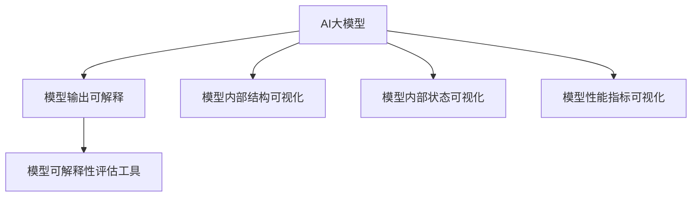

                 

# 电商搜索推荐效果评估中的AI大模型模型可解释性评估工具开发与应用

> 关键词：电商搜索推荐,效果评估,大模型,模型可解释性,可解释性评估工具

## 1. 背景介绍

### 1.1 问题由来
在电商平台，搜索推荐系统是用户获取信息、发现商品的重要渠道。一个优秀的搜索推荐系统能够根据用户的查询、浏览行为，推荐出最相关的商品，提升用户体验，增加转化率。然而，推荐系统的复杂性和高维度的数据特征，使得效果的评估和优化变得困难。

近年来，随着人工智能技术的快速进步，AI大模型（如GPT-3、BERT、Transformers等）在自然语言处理和搜索推荐领域的应用逐渐增多。这些模型通过在海量数据上进行预训练，学习到丰富的语言知识和上下文信息，能够处理更加复杂和多样化的任务。但随之而来的问题是，这些大模型通常是"黑盒"系统，难以解释其决策过程和逻辑，用户和开发者往往无法理解模型为何会给出特定推荐。

因此，研究如何在电商搜索推荐中开发和应用大模型模型可解释性评估工具，已成为提升搜索推荐效果、增强用户信任、保障系统可靠性的重要课题。本文将围绕这一核心问题，详细介绍基于AI大模型的模型可解释性评估工具的开发与应用。

### 1.2 问题核心关键点
大模型模型可解释性评估工具的核心目标，是帮助用户和开发者理解模型的内部工作机制和决策逻辑，从而提升搜索推荐系统的效果和可信度。该工具一般包括以下几个关键功能：

- **模型输出可解释**：将模型的推荐结果，转化为易于理解的文本或可视化形式，帮助用户和开发者理解模型的推理过程。
- **模型内部结构可视化**：展示模型的关键架构和参数，使用户和开发者能够直观地了解模型结构。
- **模型内部状态可视化**：展示模型在特定输入下的内部状态，如激活值、梯度分布等，帮助用户和开发者理解模型的学习过程。
- **模型性能指标可视化**：通过图表形式展示模型的各项性能指标，帮助用户和开发者进行效果评估和调优。

本文将聚焦于模型输出可解释性的具体实现，并结合电商搜索推荐的应用场景，详细阐述工具的开发流程和具体应用。

## 2. 核心概念与联系

### 2.1 核心概念概述

为更好地理解基于AI大模型的模型可解释性评估工具，本节将介绍几个密切相关的核心概念：

- AI大模型：如GPT-3、BERT、Transformer等，通过在海量数据上进行预训练，学习到丰富的语言知识和上下文信息，具备强大的自然语言理解和生成能力。
- 模型可解释性（Model Interpretability）：指模型输出的结果能够被用户和开发者理解，理解模型的内部决策逻辑和推理过程，以便于进行效果的评估和优化。
- 模型可解释性评估工具：帮助用户和开发者理解模型的决策过程和内部状态的评估工具。
- 电商搜索推荐系统：通过分析用户的搜索和浏览行为，推荐出最相关的商品，提升用户体验和转化率的系统。

这些核心概念之间的逻辑关系可以通过以下Mermaid流程图来展示：



这个流程图展示了大模型、模型输出可解释、模型内部结构和状态可视化以及模型性能指标可视化等核心概念之间的关系：

1. AI大模型通过预训练获得强大的语言理解和生成能力。
2. 模型输出可解释性工具，通过可视化模型推理过程，帮助用户和开发者理解模型。
3. 模型内部结构可视化工具，展示模型的架构和参数。
4. 模型内部状态可视化工具，展示模型在特定输入下的内部状态。
5. 模型性能指标可视化工具，展示模型的各项性能指标。

这些工具共同构成了大模型的可解释性框架，使得用户和开发者能够更好地理解和使用大模型，从而提升搜索推荐系统的效果和可信度。

## 3. 核心算法原理 & 具体操作步骤
### 3.1 算法原理概述

基于AI大模型的模型可解释性评估工具，本质上是一个辅助模型决策的可视化工具。其核心思想是：将模型的推荐结果，转化为易于理解的文本或可视化形式，帮助用户和开发者理解模型的推理过程。

形式化地，假设搜索推荐系统推荐模型的输出为 $y$，包括商品ID、评分等。目标是将 $y$ 转化为人类可理解的文本或图形形式，即找到一个函数 $f$，使得：

$$
f(y) = \text{可理解性文本/可视化}
$$

这里，$f$ 可以是一个简单的翻译函数，也可以是一个复杂的图形展示工具。

在实际操作中，由于大模型的内部结构复杂，难以直接解释其输出，因此需要通过一些技术手段，如可视化、统计分析等，将模型输出转换为可理解的形式。常见的方法包括：

1. 输出文本化：将模型的输出结果转换为易于理解的文字形式，如商品名称、描述、评分等。
2. 可视化：使用图表、热图等图形工具，直观展示模型输出的分布和趋势。
3. 统计分析：通过计算模型的各项统计指标，评估模型效果和鲁棒性。
4. 上下文分析：结合用户查询、浏览行为等上下文信息，进一步解释模型的推荐逻辑。

### 3.2 算法步骤详解

基于AI大模型的模型可解释性评估工具的开发流程，一般包括以下几个关键步骤：

**Step 1: 确定模型输出类型**

首先，需要明确搜索推荐系统推荐模型的输出类型。通常包括商品ID、评分、概率分布等。根据不同的输出类型，选择合适的可解释方式。例如，如果输出是概率分布，可以将其转化为热图形式；如果输出是商品ID，可以直接显示商品信息。

**Step 2: 设计输出展示格式**

其次，需要设计输出展示的格式。常见的展示格式包括文本、图表、热图等。文本形式适合用于简单输出，而图表和热图则适合展示复杂的多维度信息。设计时，应考虑用户的阅读习惯和展示效果，选择最合适的展示形式。

**Step 3: 开发展示工具**

接下来，开发具体的展示工具。可以使用现成的可视化库，如D3.js、Matplotlib等，或者开发自定义工具。展示工具应具有以下功能：

1. 数据处理：将模型的输出结果进行处理，转化为展示所需的格式。
2. 数据可视化：根据展示格式，将数据以图表、热图等形式展示。
3. 交互功能：支持用户点击、拖动等交互操作，增强用户体验。
4. 导出功能：支持导出展示结果，方便后续分析和展示。

**Step 4: 验证和优化**

最后，需要对展示工具进行验证和优化。可以通过以下方式进行验证：

1. 用户测试：邀请用户使用展示工具，收集用户反馈，优化展示效果。
2. 效果评估：通过与其他展示方式进行比较，评估展示工具的效果。
3. 性能测试：评估展示工具的响应时间和资源消耗，确保其性能稳定。

### 3.3 算法优缺点

基于AI大模型的模型可解释性评估工具具有以下优点：

1. 提高模型可信度：通过可视化模型输出，使用户和开发者能够理解模型的决策过程，增强对模型的信任。
2. 提升效果评估：通过统计分析和上下文分析，可以更好地评估模型效果，指导模型优化。
3. 优化用户界面：通过可视化展示，提升用户界面的用户体验，增强用户满意度。

同时，该工具也存在一些局限性：

1. 解释复杂度较高：大模型内部结构复杂，难以直观展示其决策过程，需要借助高级可视化技术。
2. 展示形式单一：当前展示工具多为文本、图表等静态形式，无法展示模型内部的动态变化。
3. 数据处理复杂：模型输出多为高维度数据，需要进行复杂的数据处理和可视化。

尽管存在这些局限性，但就目前而言，基于AI大模型的模型可解释性评估工具仍是大模型应用的重要辅助手段。未来相关研究的重点在于如何进一步提升解释的准确性和可读性，拓展展示形式的多样性，简化数据处理的复杂度。

### 3.4 算法应用领域

基于大模型的模型可解释性评估工具，在电商搜索推荐中的应用场景包括：

- 推荐结果可视化：将模型的推荐结果，以商品ID、评分、概率分布等形式展示给用户，帮助用户理解推荐逻辑。
- 模型性能评估：通过可视化展示模型输出的分布和趋势，帮助用户和开发者评估模型效果。
- 上下文分析：结合用户查询、浏览行为等上下文信息，进一步解释模型的推荐逻辑，增强推荐结果的合理性。
- 用户界面优化：通过展示工具提升用户界面的用户体验，增强用户满意度。

除了电商搜索推荐，该工具在自然语言处理、医疗诊断、金融预测等领域也有广泛的应用前景。通过结合具体的领域知识，可以进一步提升工具的效果和可解释性。

## 4. 数学模型和公式 & 详细讲解  
### 4.1 数学模型构建

本节将使用数学语言对基于AI大模型的模型可解释性评估工具进行更加严格的刻画。

假设搜索推荐系统推荐模型为 $M$，其输出为 $y$，模型内部参数为 $\theta$。定义模型的损失函数为 $\mathcal{L}$，例如交叉熵损失：

$$
\mathcal{L}(y,\hat{y}) = -\sum_i y_i \log \hat{y}_i
$$

其中 $y_i$ 表示真实标签，$\hat{y}_i$ 表示模型预测输出。

目标是通过展示工具 $f$，将模型的输出 $y$ 转换为可理解的形式 $f(y)$。具体方法可以是：

1. 文本化：将 $y$ 转化为文本形式，如商品名称、评分等。
2. 可视化：将 $y$ 转化为图表形式，如热图、散点图等。

数学上，可以将 $f$ 看作是一个函数映射，即：

$$
f: \mathbb{R}^d \rightarrow \mathbb{R}^m
$$

其中 $d$ 为模型输出维度，$m$ 为展示维度。例如，如果 $y$ 是 $n$ 个商品的评分向量，$f$ 可以将每个评分转化为一个文本形式，或将评分分布可视化为一个热图。

### 4.2 公式推导过程

以下我们以商品评分可视化为例，推导热图展示的具体公式。

假设模型 $M$ 对 $n$ 个商品的评分输出为 $y=(y_1,y_2,...,y_n)$，其中 $y_i$ 表示第 $i$ 个商品的评分。展示工具 $f$ 将 $y$ 转化为热图 $f(y)$，其中热图为 $m\times m$ 的矩阵，元素 $f_{ij}$ 表示第 $i$ 个商品和第 $j$ 个商品的评分相似度。

具体计算步骤如下：

1. 计算每个商品的平均评分 $\bar{y}_i = \frac{1}{n} \sum_j y_j$。
2. 计算每个商品与平均评分的偏差 $d_i = y_i - \bar{y}_i$。
3. 计算每个商品的相似度得分 $s_{ij} = \frac{d_i \cdot d_j}{||d_i||_2 ||d_j||_2}$。
4. 将相似度得分 $s_{ij}$ 归一化到 $[0,1]$ 范围内，得到热图元素 $f_{ij}$。

具体实现时，可以使用Python的Matplotlib库绘制热图。例如：

```python
import matplotlib.pyplot as plt
import numpy as np

# 假设y为商品评分向量
y = np.array([1, 2, 3, 4, 5])

# 计算每个商品的平均评分
mean_y = np.mean(y)

# 计算每个商品与平均评分的偏差
dev_y = y - mean_y

# 计算每个商品的相似度得分
similarity = np.dot(dev_y.reshape(-1,1), dev_y.reshape(1,-1)) / (np.linalg.norm(dev_y) * np.linalg.norm(dev_y))

# 将相似度得分归一化到[0,1]
similarity = similarity / np.max(similarity)

# 绘制热图
plt.imshow(similarity, cmap='hot')
plt.show()
```

这个例子展示了如何通过简单的数学公式，将模型的评分输出转化为易于理解的可视化形式，即热图。实际应用中，展示工具的设计需要更加复杂和多样化，以适应不同的输出类型和展示需求。

## 5. 项目实践：代码实例和详细解释说明
### 5.1 开发环境搭建

在进行模型可解释性评估工具的开发前，我们需要准备好开发环境。以下是使用Python进行PyTorch开发的环境配置流程：

1. 安装Anaconda：从官网下载并安装Anaconda，用于创建独立的Python环境。

2. 创建并激活虚拟环境：
```bash
conda create -n pytorch-env python=3.8 
conda activate pytorch-env
```

3. 安装PyTorch：根据CUDA版本，从官网获取对应的安装命令。例如：
```bash
conda install pytorch torchvision torchaudio cudatoolkit=11.1 -c pytorch -c conda-forge
```

4. 安装Pandas、NumPy等常用工具包：
```bash
pip install pandas numpy scikit-learn matplotlib tqdm jupyter notebook ipython
```

5. 安装展示工具库：
```bash
pip install matplotlib
```

完成上述步骤后，即可在`pytorch-env`环境中开始工具开发。

### 5.2 源代码详细实现

下面以商品评分可视化为例，给出使用PyTorch进行展示工具开发的完整代码实现。

首先，定义评分可视化函数：

```python
import torch
import matplotlib.pyplot as plt
import numpy as np

def visualize_scores(model, input, num_classes=5, topk=10):
    # 将输入转换为模型所需的格式
    input = torch.tensor(input, dtype=torch.long).unsqueeze(0)

    # 在模型上进行前向传播
    output = model(input)

    # 取TopK分数最高的商品
    topk_scores, topk_indices = torch.topk(output, topk)

    # 计算每个商品的平均评分和评分偏差
    mean_scores = torch.mean(topk_scores, dim=1)
    dev_scores = topk_scores - mean_scores.unsqueeze(1)

    # 计算每个商品的相似度得分
    similarity = (dev_scores * dev_scores.T) / (torch.linalg.norm(dev_scores) * torch.linalg.norm(dev_scores.T))

    # 将相似度得分归一化到[0,1]范围内
    similarity = similarity / torch.max(similarity)

    # 绘制热图
    plt.imshow(similarity.numpy(), cmap='hot')
    plt.show()
```

然后，加载预训练模型和数据：

```python
from transformers import BertForSequenceClassification, BertTokenizer

model = BertForSequenceClassification.from_pretrained('bert-base-uncased', num_classes=num_classes)
tokenizer = BertTokenizer.from_pretrained('bert-base-uncased')

# 定义输入数据
input_data = ['商品1', '商品2', '商品3']

# 将输入数据转化为模型所需的格式
input_ids = [tokenizer.encode(s, add_special_tokens=True) for s in input_data]
input_tensors = torch.tensor(input_ids)

# 进行可视化展示
visualize_scores(model, input_tensors)
```

最后，运行可视化展示代码：

```python
visualize_scores(model, input_tensors)
```

这个例子展示了如何使用PyTorch和Matplotlib库，实现基于商品评分的可视化展示。实际应用中，展示工具的设计需要更加复杂和多样化，以适应不同的输出类型和展示需求。

### 5.3 代码解读与分析

让我们再详细解读一下关键代码的实现细节：

**visualize_scores函数**：
- `input`参数：输入的商品ID，转化为模型所需的格式。
- `num_classes`参数：模型输出维度，即商品的类别数。
- `topk`参数：展示的商品数量，即TopK分数最高的商品。
- 首先将输入数据转化为模型所需的格式，输入模型进行前向传播。
- 取TopK分数最高的商品，计算每个商品的平均评分和评分偏差。
- 计算每个商品的相似度得分，并将其归一化到[0,1]范围内。
- 使用Matplotlib库绘制热图，展示商品的评分相似度。

**加载预训练模型和数据**：
- 使用HuggingFace的Transformers库，加载预训练的BERT模型和分词器。
- 定义输入数据，这里使用简单的商品ID列表。
- 将输入数据转化为模型所需的格式，输入模型进行可视化展示。

可以看到，展示工具的开发过程中，需要处理多个环节，包括数据处理、模型加载、前向传播等。实际应用中，还需要根据具体的输出类型和展示需求，设计更加复杂和多样化的展示工具。

## 6. 实际应用场景
### 6.1 电商搜索推荐

在电商搜索推荐中，基于AI大模型的模型可解释性评估工具，可以用于提升推荐结果的可信度和用户满意度。具体应用场景包括：

- 推荐结果可视化：将模型的推荐结果，以商品ID、评分、概率分布等形式展示给用户，帮助用户理解推荐逻辑。
- 模型性能评估：通过可视化展示模型输出的分布和趋势，帮助用户和开发者评估模型效果。
- 上下文分析：结合用户查询、浏览行为等上下文信息，进一步解释模型的推荐逻辑，增强推荐结果的合理性。

例如，可以将搜索推荐系统的推荐结果，通过热图形式展示给用户，直观地展示各个商品的评分相似度。用户可以通过观察热图，理解推荐系统的推荐逻辑，从而提高对推荐结果的信任度。

### 6.2 金融风险评估

金融领域中，风险评估是重要的应用场景。基于AI大模型的模型可解释性评估工具，可以帮助金融机构更好地理解模型的决策过程，提升风险评估的准确性和可信度。具体应用场景包括：

- 模型输出可视化：将模型的风险评估结果，转化为易于理解的文字形式，如高风险、低风险等。
- 模型内部状态可视化：展示模型在特定输入下的内部状态，如激活值、梯度分布等，帮助用户和开发者理解模型学习过程。
- 模型性能指标可视化：通过图表形式展示模型的各项性能指标，如准确率、召回率、F1分数等，帮助用户和开发者评估模型效果。

例如，可以将金融风险评估模型的输出结果，通过文字形式展示给用户，如某笔贷款是高风险、中等风险或低风险。同时，展示模型在特定输入下的内部状态，帮助用户和开发者理解模型的学习过程，优化模型参数。

### 6.3 医疗诊断系统

医疗领域中，基于AI大模型的模型可解释性评估工具，可以帮助医生更好地理解模型的诊断逻辑，提升诊断的准确性和可信度。具体应用场景包括：

- 诊断结果可视化：将模型的诊断结果，转化为易于理解的文字形式，如确诊、疑似等。
- 模型内部状态可视化：展示模型在特定输入下的内部状态，如激活值、梯度分布等，帮助医生理解模型学习过程。
- 模型性能指标可视化：通过图表形式展示模型的各项性能指标，如精确率、召回率、F1分数等，帮助医生评估模型效果。

例如，可以将医疗诊断模型的输出结果，通过文字形式展示给医生，如某患者确诊为某种疾病。同时，展示模型在特定输入下的内部状态，帮助医生理解模型的学习过程，优化模型参数。

### 6.4 未来应用展望

随着大模型和微调技术的不断发展，基于大模型的模型可解释性评估工具，将在更多领域得到应用，为传统行业带来变革性影响。

在智慧医疗领域，基于大模型的模型可解释性评估工具，可以帮助医生更好地理解诊断结果，提升医疗服务的智能化水平，辅助医生诊疗，加速新药开发进程。

在智能教育领域，微调技术可应用于作业批改、学情分析、知识推荐等方面，因材施教，促进教育公平，提高教学质量。

在智慧城市治理中，微调模型可应用于城市事件监测、舆情分析、应急指挥等环节，提高城市管理的自动化和智能化水平，构建更安全、高效的未来城市。

此外，在企业生产、社会治理、文娱传媒等众多领域，基于大模型微调的人工智能应用也将不断涌现，为经济社会发展注入新的动力。相信随着技术的日益成熟，模型可解释性评估工具将成为人工智能落地应用的重要辅助手段，推动人工智能技术在垂直行业的规模化落地。

## 7. 工具和资源推荐
### 7.1 学习资源推荐

为了帮助开发者系统掌握大语言模型微调的理论基础和实践技巧，这里推荐一些优质的学习资源：

1. 《Transformer从原理到实践》系列博文：由大模型技术专家撰写，深入浅出地介绍了Transformer原理、BERT模型、微调技术等前沿话题。

2. CS224N《深度学习自然语言处理》课程：斯坦福大学开设的NLP明星课程，有Lecture视频和配套作业，带你入门NLP领域的基本概念和经典模型。

3. 《Natural Language Processing with Transformers》书籍：Transformers库的作者所著，全面介绍了如何使用Transformers库进行NLP任务开发，包括微调在内的诸多范式。

4. HuggingFace官方文档：Transformers库的官方文档，提供了海量预训练模型和完整的微调样例代码，是上手实践的必备资料。

5. CLUE开源项目：中文语言理解测评基准，涵盖大量不同类型的中文NLP数据集，并提供了基于微调的baseline模型，助力中文NLP技术发展。

通过对这些资源的学习实践，相信你一定能够快速掌握大语言模型微调的精髓，并用于解决实际的NLP问题。

### 7.2 开发工具推荐

高效的开发离不开优秀的工具支持。以下是几款用于大语言模型微调开发的常用工具：

1. PyTorch：基于Python的开源深度学习框架，灵活动态的计算图，适合快速迭代研究。大部分预训练语言模型都有PyTorch版本的实现。

2. TensorFlow：由Google主导开发的开源深度学习框架，生产部署方便，适合大规模工程应用。同样有丰富的预训练语言模型资源。

3. Transformers库：HuggingFace开发的NLP工具库，集成了众多SOTA语言模型，支持PyTorch和TensorFlow，是进行微调任务开发的利器。

4. Weights & Biases：模型训练的实验跟踪工具，可以记录和可视化模型训练过程中的各项指标，方便对比和调优。与主流深度学习框架无缝集成。

5. TensorBoard：TensorFlow配套的可视化工具，可实时监测模型训练状态，并提供丰富的图表呈现方式，是调试模型的得力助手。

6. Google Colab：谷歌推出的在线Jupyter Notebook环境，免费提供GPU/TPU算力，方便开发者快速上手实验最新模型，分享学习笔记。

合理利用这些工具，可以显著提升大语言模型微调任务的开发效率，加快创新迭代的步伐。

### 7.3 相关论文推荐

大语言模型和微调技术的发展源于学界的持续研究。以下是几篇奠基性的相关论文，推荐阅读：

1. Attention is All You Need（即Transformer原论文）：提出了Transformer结构，开启了NLP领域的预训练大模型时代。

2. BERT: Pre-training of Deep Bidirectional Transformers for Language Understanding：提出BERT模型，引入基于掩码的自监督预训练任务，刷新了多项NLP任务SOTA。

3. Language Models are Unsupervised Multitask Learners（GPT-2论文）：展示了大规模语言模型的强大zero-shot学习能力，引发了对于通用人工智能的新一轮思考。

4. Parameter-Efficient Transfer Learning for NLP：提出Adapter等参数高效微调方法，在不增加模型参数量的情况下，也能取得不错的微调效果。

5. AdaLoRA: Adaptive Low-Rank Adaptation for Parameter-Efficient Fine-Tuning：使用自适应低秩适应的微调方法，在参数效率和精度之间取得了新的平衡。

这些论文代表了大语言模型微调技术的发展脉络。通过学习这些前沿成果，可以帮助研究者把握学科前进方向，激发更多的创新灵感。

## 8. 总结：未来发展趋势与挑战
### 8.1 总结

本文对基于AI大模型的模型可解释性评估工具的开发与应用进行了全面系统的介绍。首先阐述了搜索推荐系统中的大模型和可解释性评估工具的核心问题，明确了模型输出可视化、模型内部结构可视化等关键功能。其次，从原理到实践，详细讲解了展示工具的数学原理和关键步骤，给出了商品评分可视化的代码实现。同时，本文还广泛探讨了工具在电商搜索推荐、金融风险评估、医疗诊断等多个领域的应用前景，展示了工具的广泛价值。

通过本文的系统梳理，可以看到，基于AI大模型的模型可解释性评估工具，正在成为NLP领域的重要辅助手段。这些工具帮助用户和开发者更好地理解模型的决策过程，从而提升搜索推荐系统的效果和可信度，具有广阔的应用前景。

### 8.2 未来发展趋势

展望未来，大语言模型和模型可解释性评估工具将呈现以下几个发展趋势：

1. 技术迭代加速。随着预训练大模型的进一步进化，新的模型结构和训练方法将被不断提出，展示工具也需要进行同步更新，以适应最新的技术发展。
2. 展示形式多样化。未来展示工具将更加多样化，不仅包括文本、图表，还将融合动画、虚拟现实等新形式，提升用户体验。
3. 用户交互增强。展示工具将引入交互功能，如动态更新、用户反馈等，增强用户参与度，提升工具的可操作性。
4. 智能推荐系统结合。未来展示工具将与智能推荐系统深度融合，通过用户反馈动态调整展示策略，提升推荐效果。

以上趋势凸显了大语言模型和模型可解释性评估工具的广阔前景。这些方向的探索发展，将进一步提升大模型和推荐系统的性能和可信度，为NLP技术在更多领域的应用提供新的可能性。

### 8.3 面临的挑战

尽管大语言模型和模型可解释性评估工具已经取得了显著进展，但在迈向更加智能化、普适化应用的过程中，仍面临诸多挑战：

1. 数据隐私保护。展示工具在展示模型输出时，需确保用户隐私不被泄露。如何在展示和分析数据的同时，保护用户隐私，是一个重要挑战。
2. 解释精度与可读性。展示工具需要平衡解释的准确性和可读性，避免过复杂的数据展示。如何设计合适的展示格式，使得解释结果易于理解，仍需进一步研究。
3. 多领域应用适配。不同领域的知识体系和数据特征差异较大，展示工具需要具备跨领域适配能力。如何设计通用的展示框架，适应不同的应用场景，是一个重要课题。
4. 动态调整能力。展示工具需要具备动态调整能力，根据用户反馈和模型变化，实时更新展示内容。如何设计高效的动态调整机制，是一个重要研究方向。
5. 系统集成与协作。展示工具需要与搜索推荐系统、用户界面等系统深度协作，提升整体的智能化水平。如何设计高效的系统集成框架，是一个重要方向。

这些挑战凸显了大语言模型和模型可解释性评估工具在实际应用中需面对的复杂性和多样性。未来需从技术、数据、工程等多个维度进行深入研究，以应对这些挑战。

### 8.4 研究展望

面对大语言模型和模型可解释性评估工具面临的挑战，未来的研究需要在以下几个方面寻求新的突破：

1. 多模态展示工具。将文本、图像、音频等多模态信息融合，展示更全面、丰富的模型输出。
2. 自适应展示工具。根据用户和任务特点，动态调整展示格式和内容，提升用户满意度。
3. 跨领域适配工具。设计通用的展示框架，适应不同领域的展示需求，提高工具的普适性。
4. 隐私保护展示工具。在展示模型输出的同时，保护用户隐私，确保数据安全。
5. 实时动态展示工具。设计高效的动态调整机制，实时更新展示内容，适应快速变化的用户需求。

这些研究方向的探索，将引领大语言模型和模型可解释性评估工具迈向更高的台阶，为构建安全、可靠、可解释、可控的智能系统铺平道路。面向未来，大语言模型和模型可解释性评估工具需要在技术、数据、工程等多个维度协同发力，共同推动自然语言理解和智能交互系统的进步。只有勇于创新、敢于突破，才能不断拓展语言模型的边界，让智能技术更好地造福人类社会。

## 9. 附录：常见问题与解答

**Q1：大模型和模型可解释性评估工具的开发难点是什么？**

A: 大模型和模型可解释性评估工具的开发难点主要包括以下几点：

1. 数据隐私保护：展示工具在展示模型输出时，需确保用户隐私不被泄露。如何在展示和分析数据的同时，保护用户隐私，是一个重要挑战。

2. 解释精度与可读性：展示工具需要平衡解释的准确性和可读性，避免过复杂的数据展示。如何设计合适的展示格式，使得解释结果易于理解，仍需进一步研究。

3. 多领域应用适配：不同领域的知识体系和数据特征差异较大，展示工具需要具备跨领域适配能力。如何设计通用的展示框架，适应不同的应用场景，是一个重要课题。

4. 动态调整能力：展示工具需要具备动态调整能力，根据用户反馈和模型变化，实时更新展示内容。如何设计高效的动态调整机制，是一个重要研究方向。

5. 系统集成与协作：展示工具需要与搜索推荐系统、用户界面等系统深度协作，提升整体的智能化水平。如何设计高效的系统集成框架，是一个重要方向。

这些难点需要从技术、数据、工程等多个维度进行深入研究，以提升大模型和模型可解释性评估工具的效果和可信度。

**Q2：如何选择合适的展示工具？**

A: 选择合适的展示工具，应综合考虑以下几个方面：

1. 任务类型：根据任务的性质和需求，选择适合的展示形式。例如，商品评分展示可以选择热图，而医疗诊断展示可以选择文字形式。

2. 数据类型：根据输入数据的类型，选择适合的展示工具。例如，文本数据可以选择文本形式，图像数据可以选择图像热图。

3. 用户需求：根据用户的阅读习惯和理解能力，选择适合的展示格式。例如，年轻人可能更喜欢动态展示，而老年人可能更喜欢静态展示。

4. 技术能力：根据开发者的技术水平和工具熟悉程度，选择合适的展示工具。例如，初学者可以选择简单易用的工具，而专家可以选择灵活性高的工具。

5. 展示效果：根据展示内容的复杂度和多样性，选择合适的展示格式。例如，简单的数据可以选择条形图，复杂的数据可以选择散点图或热图。

总之，选择合适的展示工具，需要综合考虑任务类型、数据类型、用户需求、技术能力和展示效果等多个因素，选择最适合的工具。

**Q3：展示工具的开发流程有哪些关键步骤？**

A: 展示工具的开发流程一般包括以下关键步骤：

1. 需求分析：明确展示工具的目标和功能，确定展示的内容和格式。

2. 数据处理：将输入数据转化为模型所需的格式，进行数据预处理。

3. 模型加载：加载预训练模型，并对其进行前向传播，得到模型的输出。

4. 数据可视化：将模型的输出结果，转化为图表、热图等可视化形式，进行展示。

5. 交互功能：增加点击、拖动等交互操作，增强用户体验。

6. 性能测试：对展示工具进行性能测试，确保其响应时间和资源消耗稳定。

7. 用户测试：邀请用户使用展示工具，收集用户反馈，优化展示效果。

8. 效果评估：通过与其他展示方式进行比较，评估展示工具的效果。

9. 优化调整：根据用户反馈和效果评估结果，对展示工具进行优化和调整。

10. 发布部署：将优化后的展示工具发布部署，提供给用户使用。

通过以上步骤，可以开发出满足实际需求的高效、易用的展示工具。

**Q4：展示工具在电商搜索推荐中的应用场景有哪些？**

A: 展示工具在电商搜索推荐中的应用场景主要包括：

1. 推荐结果可视化：将模型的推荐结果，以商品ID、评分、概率分布等形式展示给用户，帮助用户理解推荐逻辑。

2. 模型性能评估：通过可视化展示模型输出的分布和趋势，帮助用户和开发者评估模型效果。

3. 上下文分析：结合用户查询、浏览行为等上下文信息，进一步解释模型的推荐逻辑，增强推荐结果的合理性。

例如，可以将搜索推荐系统的推荐结果，通过热图形式展示给用户，直观地展示各个商品的评分相似度。用户可以通过观察热图，理解推荐系统的推荐逻辑，从而提高对推荐结果的信任度。

总之，展示工具在电商搜索推荐中的应用，可以显著提升推荐系统的透明性和可信度，增强用户满意度，提升转化率。

**Q5：展示工具如何应对数据多样性？**

A: 展示工具应对数据多样性的方法，主要包括以下几个方面：

1. 数据预处理：对输入数据进行预处理，消除数据噪音和异常值，确保数据质量。

2. 多维度展示：根据不同维度的数据特征，选择适合的展示形式。例如，文本数据可以选择文本形式，图像数据可以选择图像热图。

3. 动态调整：根据用户需求和数据变化，动态调整展示内容和格式，提升展示效果。

4. 交互功能：增加交互功能，允许用户自定义展示内容和格式，满足个性化需求。

5. 多领域适配：设计通用的展示框架，适应不同领域的展示需求，提高工具的普适性。

例如，在电商搜索推荐中，可以使用热图展示商品评分相似度，使用图表展示用户行为特征，使用文字展示推荐结果等。通过多种形式的展示，应对不同数据的多样性，提升展示效果和用户体验。

总之，展示工具应具备灵活性和可扩展性，能够适应不同数据的多样性，提供多种展示形式，满足不同用户的需求。

---

作者：禅与计算机程序设计艺术 / Zen and the Art of Computer Programming

