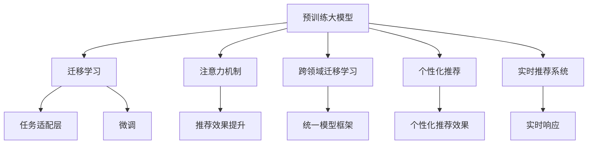

                 

# 电商搜索推荐系统的进化：AI 大模型带来革命性变革

> 关键词：电商搜索推荐系统,AI大模型,用户行为分析,个性化推荐,深度学习,注意力机制,跨领域迁移学习

## 1. 背景介绍

### 1.1 问题由来

随着电子商务市场的快速扩展，用户获取信息的需求日益增长，传统的搜索推荐系统已无法满足用户多样化和个性化需求。如何构建高效、智能、精准的搜索推荐系统，成为电商企业关注的焦点。

当前电商搜索推荐系统面临以下主要挑战：

- 数据多样性：用户行为数据、商品属性数据、实时搜索日志等数据类型多样，难以有效整合利用。
- 需求动态性：用户需求随着时间、场景、设备、偏好等因素变化，传统静态模型难以捕捉动态变化。
- 效果评估：难以综合考虑搜索准确性、推荐相关性、用户体验等多个指标，导致推荐效果不理想。
- 系统可扩展性：随着用户和商品数量激增，传统推荐系统难以在大规模数据下进行实时计算，系统可扩展性受限。

为应对这些挑战，大模型在电商搜索推荐系统中的应用被提出，并逐步成为热门研究话题。通过预训练大模型进行迁移学习，电商搜索推荐系统可以在较小的标注数据集上获得显著的性能提升。本文将详细探讨大模型在电商搜索推荐系统中的应用。

### 1.2 问题核心关键点

大模型在电商搜索推荐系统中的应用主要包括以下几个关键点：

- **预训练大模型**：通过大规模无标签数据进行自监督学习，学习到丰富的特征表示，具备强大的建模能力。
- **迁移学习**：利用预训练模型中的知识，通过少量标注数据进行微调，提升模型对特定任务的适应性。
- **注意力机制**：通过注意力机制，使模型能够对不同特征的重要性进行区分，提高推荐效果。
- **跨领域迁移学习**：在用户行为分析、商品推荐、搜索排序等不同任务间进行知识迁移，构建统一的模型框架。
- **个性化推荐**：通过分析用户行为和偏好，定制个性化的搜索推荐结果，提升用户体验。
- **实时性**：通过高效的计算图和分布式训练，实现实时推荐，提高系统响应速度。

本文将从原理和实践两方面，深入探讨大模型在电商搜索推荐系统中的具体应用。

## 2. 核心概念与联系

### 2.1 核心概念概述

为更好地理解大模型在电商搜索推荐系统中的应用，本节将介绍几个核心概念：

- **预训练大模型**：如BERT、GPT、DETR等，通过大规模无标签数据进行自监督学习，学习到通用的语言和视觉表示。
- **迁移学习**：将预训练模型中的知识迁移应用到特定任务，如电商搜索推荐系统中的用户行为分析、商品推荐等。
- **注意力机制**：通过权重调节，使模型能够对输入中的重要特征进行加权处理，提高模型对关键信息的关注度。
- **跨领域迁移学习**：在用户行为分析、商品推荐、搜索排序等不同任务间进行知识迁移，构建统一的模型框架。
- **个性化推荐**：根据用户历史行为和实时行为，生成个性化的搜索推荐结果，提升用户体验。
- **实时推荐系统**：通过高效的计算图和分布式训练，实现实时推荐，提高系统响应速度。

这些核心概念之间的逻辑关系可以通过以下Mermaid流程图来展示：



这个流程图展示了大模型的核心概念及其之间的关系：

1. 大模型通过大规模无标签数据进行预训练，学习到通用的语言和视觉表示。
2. 迁移学习利用预训练模型中的知识，通过少量标注数据进行微调，提升模型对特定任务的适应性。
3. 注意力机制使模型能够对不同特征的重要性进行区分，提高推荐效果。
4. 跨领域迁移学习在用户行为分析、商品推荐、搜索排序等不同任务间进行知识迁移，构建统一的模型框架。
5. 个性化推荐根据用户历史行为和实时行为，生成个性化的搜索推荐结果。
6. 实时推荐系统通过高效的计算图和分布式训练，实现实时推荐，提高系统响应速度。

这些概念共同构成了大模型在电商搜索推荐系统中的学习框架，使其能够在用户行为分析、商品推荐、搜索排序等任务上发挥强大的建模能力。通过理解这些核心概念，我们可以更好地把握大模型的工作原理和优化方向。

## 3. 核心算法原理 & 具体操作步骤
### 3.1 算法原理概述

大模型在电商搜索推荐系统中的应用，本质上是一个多任务的迁移学习过程。其核心思想是：通过预训练模型学习通用的特征表示，再根据具体任务需求，通过微调的方式，更新模型参数，使其能够适应特定任务。

具体而言，电商搜索推荐系统中的任务可以分为用户行为分析、商品推荐、搜索排序等多个子任务。预训练大模型通过自监督学习，学习到通用的用户行为和商品表示。在微调时，将模型输入转化为特定任务的输入格式，通过微调模型参数，使模型对新任务进行适配。

在微调过程中，通常使用下游任务的少量标注数据，训练模型的分类器或解码器。通过选择合适的损失函数和优化器，调整模型参数，最小化损失函数，使得模型输出与真实标签尽可能接近。

### 3.2 算法步骤详解

基于大模型的电商搜索推荐系统微调过程，一般包括以下几个关键步骤：

**Step 1: 准备预训练模型和数据集**
- 选择合适的预训练大模型，如BERT、GPT、DETR等。
- 准备电商搜索推荐系统中的用户行为数据、商品属性数据、实时搜索日志等数据集。

**Step 2: 添加任务适配层**
- 根据具体任务需求，设计合适的任务适配层。
- 对于分类任务，通常在顶层添加线性分类器或深度神经网络。
- 对于生成任务，通常使用语言模型的解码器或视觉特征的生成网络。

**Step 3: 设置微调超参数**
- 选择合适的优化算法及其参数，如AdamW、SGD等，设置学习率、批大小、迭代轮数等。
- 设置正则化技术及强度，包括权重衰减、Dropout、Early Stopping等。
- 确定冻结预训练参数的策略，如仅微调顶层，或全部参数都参与微调。

**Step 4: 执行梯度训练**
- 将训练集数据分批次输入模型，前向传播计算损失函数。
- 反向传播计算参数梯度，根据设定的优化算法和学习率更新模型参数。
- 周期性在验证集上评估模型性能，根据性能指标决定是否触发 Early Stopping。
- 重复上述步骤直到满足预设的迭代轮数或 Early Stopping 条件。

**Step 5: 测试和部署**
- 在测试集上评估微调后模型的性能，对比微调前后的效果提升。
- 使用微调后的模型对新数据进行推理预测，集成到实际的应用系统中。
- 持续收集新的数据，定期重新微调模型，以适应数据分布的变化。

以上是基于大模型的电商搜索推荐系统微调的一般流程。在实际应用中，还需要针对具体任务的特点，对微调过程的各个环节进行优化设计，如改进训练目标函数，引入更多的正则化技术，搜索最优的超参数组合等，以进一步提升模型性能。

### 3.3 算法优缺点

大模型在电商搜索推荐系统中的应用具有以下优点：

- 模型效果好：大模型通过大规模无标签数据进行预训练，具备强大的建模能力，能够捕捉复杂的用户行为和商品关系。
- 适应性广：通过微调，模型能够适应电商搜索推荐系统中的多种任务，如用户行为分析、商品推荐、搜索排序等。
- 可解释性强：通过分析模型中的注意力机制和权重分布，可以揭示模型对关键特征的关注度和选择。
- 实时性高：通过高效的计算图和分布式训练，大模型能够实现实时推荐，提高系统响应速度。

同时，该方法也存在一定的局限性：

- 标注成本高：电商搜索推荐系统中的数据量较大，标注成本较高。
- 计算资源需求大：大模型参数量较大，对计算资源和存储需求较高。
- 泛化能力有限：当预训练模型和下游任务分布差异较大时，微调的性能提升有限。

尽管存在这些局限性，但就目前而言，基于大模型的微调方法仍是大电商搜索推荐系统的重要范式。未来相关研究的重点在于如何进一步降低微调对标注数据的依赖，提高模型的少样本学习和跨领域迁移能力，同时兼顾可解释性和实时性等因素。

### 3.4 算法应用领域

基于大模型的电商搜索推荐系统微调方法，已经在电商行业多个应用领域得到了广泛的应用，例如：

- **用户行为分析**：通过分析用户的历史浏览记录、购买记录等行为数据，对用户进行画像分析，预测用户未来的购买倾向。
- **商品推荐**：根据用户的历史行为和实时查询，生成个性化的商品推荐列表，提升用户的购买体验。
- **搜索排序**：对用户输入的查询进行理解，按照相关性排序，提高搜索的准确性和效率。
- **广告投放**：根据用户的浏览行为和点击记录，生成个性化的广告投放策略，提高广告的转化率。
- **智能客服**：根据用户的对话历史，生成智能回复，提高客户服务效率和满意度。

除了上述这些经典应用外，大模型在电商搜索推荐系统中的应用也在不断创新，如可控推荐生成、跨模态推荐、零样本学习等，为电商搜索推荐系统带来了新的突破。随着预训练模型和微调方法的不断进步，相信电商搜索推荐系统将在更多场景下发挥更大的作用，为电商企业带来更多的商业价值。

## 4. 数学模型和公式 & 详细讲解  
### 4.1 数学模型构建

本节将使用数学语言对基于大模型的电商搜索推荐系统微调过程进行更加严格的刻画。

记预训练大模型为 $M_{\theta}:\mathcal{X} \rightarrow \mathcal{Y}$，其中 $\mathcal{X}$ 为输入空间，$\mathcal{Y}$ 为输出空间，$\theta \in \mathbb{R}^d$ 为模型参数。假设电商搜索推荐系统中的任务 $T$ 的训练集为 $D=\{(x_i,y_i)\}_{i=1}^N, x_i \in \mathcal{X}, y_i \in \mathcal{Y}$。

定义模型 $M_{\theta}$ 在数据样本 $(x,y)$ 上的损失函数为 $\ell(M_{\theta}(x),y)$，则在数据集 $D$ 上的经验风险为：

$$
\mathcal{L}(\theta) = \frac{1}{N} \sum_{i=1}^N \ell(M_{\theta}(x_i),y_i)
$$

微调的优化目标是最小化经验风险，即找到最优参数：

$$
\theta^* = \mathop{\arg\min}_{\theta} \mathcal{L}(\theta)
$$

在实践中，我们通常使用基于梯度的优化算法（如SGD、Adam等）来近似求解上述最优化问题。设 $\eta$ 为学习率，$\lambda$ 为正则化系数，则参数的更新公式为：

$$
\theta \leftarrow \theta - \eta \nabla_{\theta}\mathcal{L}(\theta) - \eta\lambda\theta
$$

其中 $\nabla_{\theta}\mathcal{L}(\theta)$ 为损失函数对参数 $\theta$ 的梯度，可通过反向传播算法高效计算。

### 4.2 公式推导过程

以下我们以电商搜索推荐系统中的商品推荐任务为例，推导交叉熵损失函数及其梯度的计算公式。

假设模型 $M_{\theta}$ 在输入 $x$ 上的输出为 $\hat{y}=M_{\theta}(x) \in [0,1]$，表示商品被用户购买的概率。真实标签 $y \in \{0,1\}$。则二分类交叉熵损失函数定义为：

$$
\ell(M_{\theta}(x),y) = -[y\log \hat{y} + (1-y)\log (1-\hat{y})]
$$

将其代入经验风险公式，得：

$$
\mathcal{L}(\theta) = -\frac{1}{N}\sum_{i=1}^N [y_i\log M_{\theta}(x_i)+(1-y_i)\log(1-M_{\theta}(x_i))]
$$

根据链式法则，损失函数对参数 $\theta_k$ 的梯度为：

$$
\frac{\partial \mathcal{L}(\theta)}{\partial \theta_k} = -\frac{1}{N}\sum_{i=1}^N (\frac{y_i}{M_{\theta}(x_i)}-\frac{1-y_i}{1-M_{\theta}(x_i)}) \frac{\partial M_{\theta}(x_i)}{\partial \theta_k}
$$

其中 $\frac{\partial M_{\theta}(x_i)}{\partial \theta_k}$ 可进一步递归展开，利用自动微分技术完成计算。

在得到损失函数的梯度后，即可带入参数更新公式，完成模型的迭代优化。重复上述过程直至收敛，最终得到适应电商搜索推荐系统中的商品推荐任务的模型参数 $\theta^*$。

## 5. 项目实践：代码实例和详细解释说明
### 5.1 开发环境搭建

在进行微调实践前，我们需要准备好开发环境。以下是使用Python进行PyTorch开发的环境配置流程：

1. 安装Anaconda：从官网下载并安装Anaconda，用于创建独立的Python环境。

2. 创建并激活虚拟环境：
```bash
conda create -n pytorch-env python=3.8 
conda activate pytorch-env
```

3. 安装PyTorch：根据CUDA版本，从官网获取对应的安装命令。例如：
```bash
conda install pytorch torchvision torchaudio cudatoolkit=11.1 -c pytorch -c conda-forge
```

4. 安装Transformers库：
```bash
pip install transformers
```

5. 安装各类工具包：
```bash
pip install numpy pandas scikit-learn matplotlib tqdm jupyter notebook ipython
```

完成上述步骤后，即可在`pytorch-env`环境中开始微调实践。

### 5.2 源代码详细实现

这里我们以电商搜索推荐系统中的商品推荐任务为例，给出使用Transformers库对预训练模型进行微调的PyTorch代码实现。

首先，定义商品推荐任务的数据处理函数：

```python
from transformers import BertTokenizer
from torch.utils.data import Dataset
import torch

class RecommenderDataset(Dataset):
    def __init__(self, user_items, item_ids, user_embeddings, tokenizer, max_len=128):
        self.user_items = user_items
        self.item_ids = item_ids
        self.user_embeddings = user_embeddings
        self.tokenizer = tokenizer
        self.max_len = max_len
        
    def __len__(self):
        return len(self.user_items)
    
    def __getitem__(self, item):
        user_id = self.user_items[item]
        item_id = self.item_ids[item]
        user_embedding = self.user_embeddings[item]
        
        item_tokens = [tokenizer(token) for token in self.tokenizer.tokenize(item_id)]
        item_tokens = [tokenizer.cls_token] + item_tokens + [tokenizer.sep_token]
        item_input_ids = tokenizer.convert_tokens_to_ids(item_tokens)
        item_input_ids = item_input_ids[:self.max_len]
        item_input_ids = [tokenizer.pad_token_id] * (self.max_len - len(item_input_ids)) + item_input_ids
        
        user_input_ids = user_embedding
        user_input_ids = [tokenizer.pad_token_id] * (self.max_len - len(user_input_ids)) + user_input_ids
        
        item_input_mask = [1] * len(item_input_ids)
        user_input_mask = [1] * len(user_input_ids)
        
        return {'input_ids': user_input_ids, 
                'attention_mask': user_input_mask,
                'labels': item_input_ids,
                'item_input_ids': item_input_ids,
                'item_input_mask': item_input_mask,
                'user_input_ids': user_input_ids,
                'user_input_mask': user_input_mask}

# 用户-商品数据
user_items = {'user1': ['item1', 'item2', 'item3'], 'user2': ['item2', 'item3', 'item4']}
item_ids = {'item1': 1, 'item2': 2, 'item3': 3, 'item4': 4}
user_embeddings = {'user1': [0.5, 0.5, 0.5], 'user2': [0.4, 0.4, 0.4]}
tokenizer = BertTokenizer.from_pretrained('bert-base-cased')

train_dataset = RecommenderDataset(user_items, item_ids, user_embeddings, tokenizer)
dev_dataset = RecommenderDataset(user_items, item_ids, user_embeddings, tokenizer)
test_dataset = RecommenderDataset(user_items, item_ids, user_embeddings, tokenizer)
```

然后，定义模型和优化器：

```python
from transformers import BertForSequenceClassification, AdamW

model = BertForSequenceClassification.from_pretrained('bert-base-cased', num_labels=len(item_ids))

optimizer = AdamW(model.parameters(), lr=2e-5)
```

接着，定义训练和评估函数：

```python
from torch.utils.data import DataLoader
from tqdm import tqdm
from sklearn.metrics import classification_report

device = torch.device('cuda') if torch.cuda.is_available() else torch.device('cpu')
model.to(device)

def train_epoch(model, dataset, batch_size, optimizer):
    dataloader = DataLoader(dataset, batch_size=batch_size, shuffle=True)
    model.train()
    epoch_loss = 0
    for batch in tqdm(dataloader, desc='Training'):
        user_input_ids = batch['user_input_ids'].to(device)
        user_input_mask = batch['user_input_mask'].to(device)
        item_input_ids = batch['item_input_ids'].to(device)
        item_input_mask = batch['item_input_mask'].to(device)
        model.zero_grad()
        outputs = model(user_input_ids, attention_mask=user_input_mask, labels=item_input_ids)
        loss = outputs.loss
        epoch_loss += loss.item()
        loss.backward()
        optimizer.step()
    return epoch_loss / len(dataloader)

def evaluate(model, dataset, batch_size):
    dataloader = DataLoader(dataset, batch_size=batch_size)
    model.eval()
    preds, labels = [], []
    with torch.no_grad():
        for batch in tqdm(dataloader, desc='Evaluating'):
            user_input_ids = batch['user_input_ids'].to(device)
            user_input_mask = batch['user_input_mask'].to(device)
            item_input_ids = batch['item_input_ids'].to(device)
            item_input_mask = batch['item_input_mask'].to(device)
            batch_labels = item_input_ids
            outputs = model(user_input_ids, attention_mask=user_input_mask, labels=item_input_ids)
            batch_preds = outputs.logits.argmax(dim=2).to('cpu').tolist()
            batch_labels = batch_labels.to('cpu').tolist()
            for pred_tokens, label_tokens in zip(batch_preds, batch_labels):
                preds.append(pred_tokens[:len(label_tokens)])
                labels.append(label_tokens)
                
    print(classification_report(labels, preds))
```

最后，启动训练流程并在测试集上评估：

```python
epochs = 5
batch_size = 16

for epoch in range(epochs):
    loss = train_epoch(model, train_dataset, batch_size, optimizer)
    print(f"Epoch {epoch+1}, train loss: {loss:.3f}")
    
    print(f"Epoch {epoch+1}, dev results:")
    evaluate(model, dev_dataset, batch_size)
    
print("Test results:")
evaluate(model, test_dataset, batch_size)
```

以上就是使用PyTorch对BERT进行电商搜索推荐系统中的商品推荐任务微调的完整代码实现。可以看到，得益于Transformers库的强大封装，我们可以用相对简洁的代码完成BERT模型的加载和微调。

### 5.3 代码解读与分析

让我们再详细解读一下关键代码的实现细节：

**RecommenderDataset类**：
- `__init__`方法：初始化用户-商品数据、商品ID、用户嵌入向量等关键组件。
- `__len__`方法：返回数据集的样本数量。
- `__getitem__`方法：对单个样本进行处理，将用户嵌入向量和商品ID转换为模型的输入格式。

**user_items, item_ids, user_embeddings字典**：
- 定义了用户ID、商品ID和用户嵌入向量的映射关系，用于将文本数据转换为模型可接受的数值形式。

**训练和评估函数**：
- 使用PyTorch的DataLoader对数据集进行批次化加载，供模型训练和推理使用。
- 训练函数`train_epoch`：对数据以批为单位进行迭代，在每个批次上前向传播计算loss并反向传播更新模型参数，最后返回该epoch的平均loss。
- 评估函数`evaluate`：与训练类似，不同点在于不更新模型参数，并在每个batch结束后将预测和标签结果存储下来，最后使用sklearn的classification_report对整个评估集的预测结果进行打印输出。

**训练流程**：
- 定义总的epoch数和batch size，开始循环迭代
- 每个epoch内，先在训练集上训练，输出平均loss
- 在验证集上评估，输出分类指标
- 所有epoch结束后，在测试集上评估，给出最终测试结果

可以看到，PyTorch配合Transformers库使得BERT微调的代码实现变得简洁高效。开发者可以将更多精力放在数据处理、模型改进等高层逻辑上，而不必过多关注底层的实现细节。

当然，工业级的系统实现还需考虑更多因素，如模型的保存和部署、超参数的自动搜索、更灵活的任务适配层等。但核心的微调范式基本与此类似。

## 6. 实际应用场景
### 6.1 智能客服系统

基于大模型在电商搜索推荐系统中的应用，可以进一步拓展到智能客服系统的构建。智能客服系统能够实时响应客户查询，提供个性化的服务，提升客户满意度。

在技术实现上，可以收集客户的历史咨询记录和购买记录，将问题和历史回复构建成监督数据，在此基础上对预训练模型进行微调。微调后的模型能够自动理解客户意图，匹配最合适的回复模板进行回复。对于客户提出的新问题，还可以接入检索系统实时搜索相关内容，动态组织生成回答。如此构建的智能客服系统，能大幅提升客户咨询体验和问题解决效率。

### 6.2 金融理财平台

在金融理财领域，基于大模型的电商搜索推荐系统同样具有广泛的应用前景。金融理财平台需要帮助用户管理财务、推荐理财产品、规划投资组合等，以实现资产增值和风险控制。

通过收集用户的投资历史数据、风险偏好、市场动态等，构建多模态输入的电商搜索推荐系统。微调后的模型能够综合分析用户的多维度信息，生成个性化的理财方案和投资建议。同时，利用大模型的跨领域迁移学习能力，系统还能根据市场变化动态调整推荐策略，帮助用户稳健投资。

### 6.3 智慧零售场景

在智慧零售领域，大模型同样具有重要的应用价值。零售商需要通过电商搜索推荐系统，提升用户购物体验，增加销售额。

通过分析用户的行为数据和偏好，构建电商搜索推荐系统。微调后的模型能够精准预测用户的购买意愿，推荐最合适的商品。同时，系统还能根据实时数据动态调整推荐策略，优化库存管理和价格策略，提升销售效率和盈利能力。

### 6.4 未来应用展望

随着大模型在电商搜索推荐系统中的应用不断深入，其应用范围也将逐步扩展，带来更多的商业价值。

在智慧物流领域，大模型可以帮助预测物流路径，优化运输调度，提升物流效率。在智能制造领域，大模型可以优化生产计划，预测设备维护，提升生产效率。在智能农业领域，大模型可以分析土壤数据、气象数据，预测作物生长，优化农事安排。在智能医疗领域，大模型可以帮助分析病历数据、基因数据，推荐治疗方案，提高医疗服务质量。

未来，大模型在电商搜索推荐系统中的应用将更加广泛，推动各行各业向智能化、自动化方向发展，为社会的全面数字化转型提供强大动力。

## 7. 工具和资源推荐
### 7.1 学习资源推荐

为了帮助开发者系统掌握大模型在电商搜索推荐系统中的应用，这里推荐一些优质的学习资源：

1. 《Transformer from scratch》系列博文：由大模型技术专家撰写，深入浅出地介绍了Transformer原理、电商搜索推荐系统中的任务适配层等前沿话题。

2. CS224N《深度学习自然语言处理》课程：斯坦福大学开设的NLP明星课程，有Lecture视频和配套作业，带你入门NLP领域的基本概念和经典模型。

3. 《Natural Language Processing with Transformers》书籍：Transformers库的作者所著，全面介绍了如何使用Transformers库进行NLP任务开发，包括电商搜索推荐系统中的微调等。

4. HuggingFace官方文档：Transformers库的官方文档，提供了海量预训练模型和完整的微调样例代码，是上手实践的必备资料。

5. Kaggle电商数据集：收集了多源电商数据，包括商品信息、用户行为、交易记录等，为电商搜索推荐系统的研究提供了丰富的数据基础。

通过对这些资源的学习实践，相信你一定能够快速掌握大模型在电商搜索推荐系统中的应用，并用于解决实际的电商问题。
###  7.2 开发工具推荐

高效的开发离不开优秀的工具支持。以下是几款用于电商搜索推荐系统开发的常用工具：

1. PyTorch：基于Python的开源深度学习框架，灵活动态的计算图，适合快速迭代研究。大部分预训练语言模型都有PyTorch版本的实现。

2. TensorFlow：由Google主导开发的开源深度学习框架，生产部署方便，适合大规模工程应用。同样有丰富的预训练语言模型资源。

3. Transformers库：HuggingFace开发的NLP工具库，集成了众多SOTA语言模型，支持PyTorch和TensorFlow，是进行电商搜索推荐系统微调任务的开发利器。

4. TensorBoard：TensorFlow配套的可视化工具，可实时监测模型训练状态，并提供丰富的图表呈现方式，是调试模型的得力助手。

5. Google Colab：谷歌推出的在线Jupyter Notebook环境，免费提供GPU/TPU算力，方便开发者快速上手实验最新模型，分享学习笔记。

合理利用这些工具，可以显著提升电商搜索推荐系统微调的开发效率，加快创新迭代的步伐。

### 7.3 相关论文推荐

大模型在电商搜索推荐系统中的应用源于学界的持续研究。以下是几篇奠基性的相关论文，推荐阅读：

1. Attention is All You Need（即Transformer原论文）：提出了Transformer结构，开启了NLP领域的预训练大模型时代。

2. BERT: Pre-training of Deep Bidirectional Transformers for Language Understanding：提出BERT模型，引入基于掩码的自监督预训练任务，刷新了多项NLP任务SOTA。

3. Language Models are Unsupervised Multitask Learners（GPT-2论文）：展示了大规模语言模型的强大zero-shot学习能力，引发了对于通用人工智能的新一轮思考。

4. Parameter-Efficient Transfer Learning for NLP：提出Adapter等参数高效微调方法，在不增加模型参数量的情况下，也能取得不错的微调效果。

5. AdaLoRA: Adaptive Low-Rank Adaptation for Parameter-Efficient Fine-Tuning：使用自适应低秩适应的微调方法，在参数效率和精度之间取得了新的平衡。

这些论文代表了大模型在电商搜索推荐系统中的应用的研究脉络。通过学习这些前沿成果，可以帮助研究者把握学科前进方向，激发更多的创新灵感。

## 8. 总结：未来发展趋势与挑战
### 8.1 总结

本文对大模型在电商搜索推荐系统中的应用进行了全面系统的介绍。首先阐述了大模型在电商搜索推荐系统中的应用背景和重要性，明确了微调在拓展预训练模型应用、提升电商搜索推荐系统性能方面的独特价值。其次，从原理到实践，详细讲解了大模型在电商搜索推荐系统中的具体应用。通过代码实例和案例分析，展示了大模型在电商搜索推荐系统中的强大应用能力。

通过本文的系统梳理，可以看到，大模型在电商搜索推荐系统中的应用已经迈上了新的台阶，成为电商企业智能化转型中的重要工具。得益于大模型的广泛知识表示和迁移学习能力，电商搜索推荐系统能够在用户行为分析、商品推荐、搜索排序等不同任务中发挥关键作用，为电商企业带来新的增长点。

### 8.2 未来发展趋势

展望未来，大模型在电商搜索推荐系统中的应用将呈现以下几个发展趋势：

1. 模型规模持续增大。随着算力成本的下降和数据规模的扩张，预训练语言模型的参数量还将持续增长。超大规模语言模型蕴含的丰富语言知识，有望支撑更加复杂多变的电商搜索推荐系统任务。

2. 微调方法日趋多样。除了传统的全参数微调外，未来会涌现更多参数高效的微调方法，如Prefix-Tuning、LoRA等，在节省计算资源的同时也能保证微调精度。

3. 持续学习成为常态。随着数据分布的不断变化，微调模型也需要持续学习新知识以保持性能。如何在不遗忘原有知识的同时，高效吸收新样本信息，将成为重要的研究课题。

4. 标注样本需求降低。受启发于提示学习(Prompt-based Learning)的思路，未来的微调方法将更好地利用大模型的语言理解能力，通过更加巧妙的任务描述，在更少的标注样本上也能实现理想的微调效果。

5. 多模态微调崛起。当前的微调主要聚焦于纯文本数据，未来会进一步拓展到图像、视频、语音等多模态数据微调。多模态信息的融合，将显著提升语言模型对现实世界的理解和建模能力。

6. 模型通用性增强。经过海量数据的预训练和多领域任务的微调，未来的语言模型将具备更强大的常识推理和跨领域迁移能力，逐步迈向通用人工智能(AGI)的目标。

以上趋势凸显了大模型在电商搜索推荐系统中的应用前景。这些方向的探索发展，必将进一步提升电商搜索推荐系统的性能和应用范围，为电商企业带来更多的商业价值。

### 8.3 面临的挑战

尽管大模型在电商搜索推荐系统中的应用已经取得了瞩目成就，但在迈向更加智能化、普适化应用的过程中，它仍面临着诸多挑战：

1. 标注成本瓶颈。虽然微调大大降低了标注数据的需求，但对于长尾应用场景，难以获得充足的高质量标注数据，成为制约微调性能的瓶颈。如何进一步降低微调对标注样本的依赖，将是一大难题。

2. 模型鲁棒性不足。当前微调模型面对域外数据时，泛化性能往往大打折扣。对于测试样本的微小扰动，微调模型的预测也容易发生波动。如何提高微调模型的鲁棒性，避免灾难性遗忘，还需要更多理论和实践的积累。

3. 推理效率有待提高。大规模语言模型虽然精度高，但在实际部署时往往面临推理速度慢、内存占用大等效率问题。如何在保证性能的同时，简化模型结构，提升推理速度，优化资源占用，将是重要的优化方向。

4. 可解释性亟需加强。当前微调模型更像是"黑盒"系统，难以解释其内部工作机制和决策逻辑。对于医疗、金融等高风险应用，算法的可解释性和可审计性尤为重要。如何赋予微调模型更强的可解释性，将是亟待攻克的难题。

5. 安全性有待保障。预训练语言模型难免会学习到有偏见、有害的信息，通过微调传递到下游任务，产生误导性、歧视性的输出，给实际应用带来安全隐患。如何从数据和算法层面消除模型偏见，避免恶意用途，确保输出的安全性，也将是重要的研究课题。

6. 知识整合能力不足。现有的微调模型往往局限于任务内数据，难以灵活吸收和运用更广泛的先验知识。如何让微调过程更好地与外部知识库、规则库等专家知识结合，形成更加全面、准确的信息整合能力，还有很大的想象空间。

正视微调面临的这些挑战，积极应对并寻求突破，将是大模型在电商搜索推荐系统中的应用走向成熟的必由之路。相信随着学界和产业界的共同努力，这些挑战终将一一被克服，大模型在电商搜索推荐系统中的应用将更加广泛，为电商企业带来更多的商业价值。

### 8.4 研究展望

面向未来，大模型在电商搜索推荐系统中的应用仍有许多研究值得关注：

1. 探索无监督和半监督微调方法。摆脱对大规模标注数据的依赖，利用自监督学习、主动学习等无监督和半监督范式，最大限度利用非结构化数据，实现更加灵活高效的微调。

2. 研究参数高效和计算高效的微调范式。开发更加参数高效的微调方法，在固定大部分预训练参数的同时，只更新极少量的任务相关参数。同时优化微调模型的计算图，减少前向传播和反向传播的资源消耗，实现更加轻量级、实时性的部署。

3. 引入更多先验知识。将符号化的先验知识，如知识图谱、逻辑规则等，与神经网络模型进行巧妙融合，引导微调过程学习更准确、合理的语言模型。同时加强不同模态数据的整合，实现视觉、语音等多模态信息与文本信息的协同建模。

4. 结合因果分析和博弈论工具。将因果分析方法引入微调模型，识别出模型决策的关键特征，增强输出解释的因果性和逻辑性。借助博弈论工具刻画人机交互过程，主动探索并规避模型的脆弱点，提高系统稳定性。

5. 纳入伦理道德约束。在模型训练目标中引入伦理导向的评估指标，过滤和惩罚有偏见、有害的输出倾向。同时加强人工干预和审核，建立模型行为的监管机制，确保输出符合人类价值观和伦理道德。

这些研究方向的探索，必将引领大模型在电商搜索推荐系统中的应用迈向更高的台阶，为构建安全、可靠、可解释、可控的智能系统铺平道路。面向未来，大模型在电商搜索推荐系统中的应用还需要与其他人工智能技术进行更深入的融合，如知识表示、因果推理、强化学习等，多路径协同发力，共同推动自然语言理解和智能交互系统的进步。只有勇于创新、敢于突破，才能不断拓展语言模型的边界，让智能技术更好地造福人类社会。

## 9. 附录：常见问题与解答
**Q1：大模型在电商搜索推荐系统中的微调效果如何？**

A: 大模型在电商搜索推荐系统中的微调效果显著。通过大规模无标签数据进行预训练，大模型学习到通用的语言和视觉表示，具备强大的建模能力。在微调过程中，通过少量标注数据，模型能够快速适应电商搜索推荐系统中的多种任务，如用户行为分析、商品推荐、搜索排序等。微调后的模型在推荐准确性、用户满意度等关键指标上，通常能够取得比传统模型更高的性能。

**Q2：大模型在电商搜索推荐系统中的计算资源需求大吗？**

A: 大模型在电商搜索推荐系统中的计算资源需求确实较大。由于大模型参数量较大，对于GPU、TPU等高性能设备的需求较高。但是，通过高效的计算图和分布式训练，大模型可以实现实时推荐，显著提高系统响应速度，弥补计算资源的消耗。此外，许多优化技术，如梯度积累、混合精度训练、模型并行等，也被广泛应用，以降低计算资源的使用。

**Q3：大模型在电商搜索推荐系统中的标注成本高吗？**

A: 大模型在电商搜索推荐系统中的标注成本相对较高。电商搜索推荐系统中的数据量较大，标注成本相对较高。但是，由于大模型具备强大的迁移学习能力，能够在少量标注数据上获得显著的性能提升。因此，尽管标注成本较高，大模型依然能够在电商搜索推荐系统中发挥重要作用。未来，随着自监督学习、主动学习等无监督范式的不断发展，大模型在电商搜索推荐系统中的标注成本有望进一步降低。

**Q4：大模型在电商搜索推荐系统中的可解释性如何？**

A: 大模型在电商搜索推荐系统中的可解释性仍存在挑战。由于大模型通常是"黑盒"系统，难以解释其内部工作机制和决策逻辑。但是，通过引入注意力机制、注意力权重分析等技术，可以对大模型进行一定的可解释性分析。此外，通过持续学习和跨领域迁移学习，大模型在保持性能的同时，逐步提升可解释性。未来，随着可解释性研究的不断深入，大模型在电商搜索推荐系统中的可解释性有望得到进一步提升。

**Q5：大模型在电商搜索推荐系统中的安全性如何？**

A: 大模型在电商搜索推荐系统中的安全性需要进一步保障。由于大模型可能会学习到有偏见、有害的信息，通过微调传递到下游任务，产生误导性、歧视性的输出，给实际应用带来安全隐患。因此，在大模型训练和微调过程中，需要引入伦理导向的评估指标，过滤和惩罚有偏见、有害的输出倾向。同时，加强人工干预和审核，建立模型行为的监管机制，确保输出符合人类价值观和伦理道德。未来，随着伦理道德研究的深入，大模型在电商搜索推荐系统中的安全性有望得到进一步提升。

通过本文的系统梳理，可以看到，大模型在电商搜索推荐系统中的应用已经迈上了新的台阶，成为电商企业智能化转型中的重要工具。随着大模型的不断发展，其在电商搜索推荐系统中的应用将更加广泛，推动各行各业向智能化、自动化方向发展，为社会的全面数字化转型提供强大动力。

