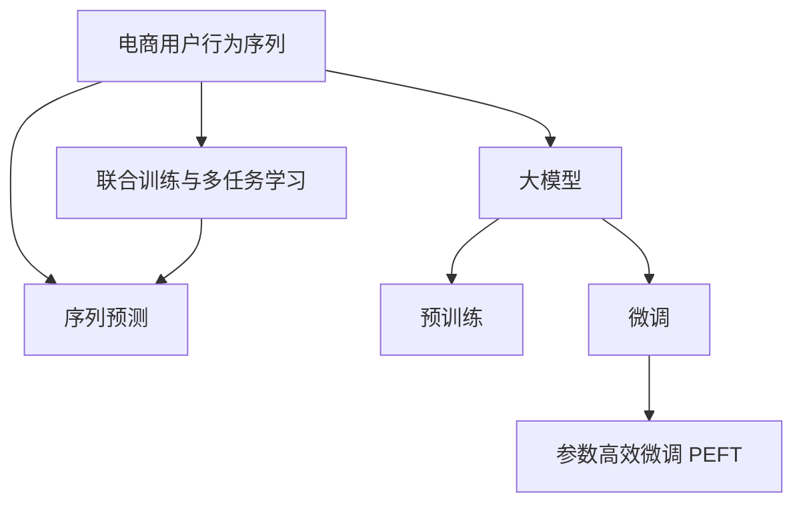

                 

# 电商用户行为序列预测：AI大模型方案

> 关键词：电商、用户行为、序列预测、大模型、NLP

## 1. 背景介绍

### 1.1 问题由来

在电商行业中，用户行为数据是企业洞察用户需求、优化营销策略、提升用户体验的关键资产。通过对用户行为序列的预测，电商平台可以更精准地推荐商品，进行个性化营销，从而提升转化率和用户满意度。然而，随着用户数量和行为复杂性的不断增加，传统机器学习模型的预测效果面临严峻挑战。

近年来，基于大模型（Large Model）的深度学习技术在自然语言处理（NLP）领域取得了巨大的突破。通过在大规模无标签文本语料上进行预训练，大模型具备强大的语言理解和生成能力。将这些大模型应用于电商用户行为序列预测，可以显著提升预测的精度和泛化能力。

### 1.2 问题核心关键点

大模型在电商用户行为序列预测中的应用主要涉及以下几个关键点：

- **大模型预训练**：使用大规模无标签文本数据对大模型进行预训练，学习通用的语言表示。
- **用户行为序列建模**：将电商用户行为序列作为输入，预测其后续行为，如购买、浏览、收藏等。
- **参数高效微调**：在固定大部分预训练参数的情况下，只微调少量的任务相关参数，以提升模型的适应性和计算效率。
- **序列特征抽取**：从用户行为序列中提取关键特征，增强模型的预测能力。
- **联合训练与多任务学习**：将用户行为序列预测与其他相关任务联合训练，如推荐系统、客户细分等，提升整体模型性能。

本文将系统性地介绍大模型在电商用户行为序列预测中的应用方法，并给出详细的技术实现和案例分析。

## 2. 核心概念与联系

### 2.1 核心概念概述

为更好地理解大模型在电商用户行为序列预测中的应用，本节将介绍几个密切相关的核心概念：

- **电商用户行为序列**：指用户在电商平台上的浏览、点击、购买等行为序列，可用于预测用户未来行为。
- **序列预测（Sequence Prediction）**：指通过模型预测给定序列的下一个元素或一段元素。
- **大模型（Large Model）**：指参数量较大的深度学习模型，如BERT、GPT-3等，通过在大量无标签数据上进行预训练，学习到通用的语言表示。
- **预训练（Pre-training）**：指在大规模无标签文本数据上，通过自监督学习任务训练大模型的过程。
- **微调（Fine-tuning）**：指在大模型的基础上，使用电商用户行为序列数据进行有监督学习，优化模型在特定任务上的性能。
- **参数高效微调（Parameter-Efficient Fine-tuning, PEFT）**：指在微调过程中，只更新少量的模型参数，而固定大部分预训练权重不变，以提高微调效率。
- **联合训练与多任务学习**：指将多个相关任务联合训练，通过共享参数和知识，提升整体模型性能。

这些核心概念之间的逻辑关系可以通过以下Mermaid流程图来展示：



这个流程图展示了大模型在电商用户行为序列预测中的应用流程：

1. 电商用户行为序列作为模型输入。
2. 使用大模型进行预训练，学习通用的语言表示。
3. 在电商用户行为序列数据上进行微调，优化模型在序列预测任务上的性能。
4. 通过参数高效微调提升模型效率。
5. 将多个相关任务联合训练，进一步提升模型性能。

## 3. 核心算法原理 & 具体操作步骤
### 3.1 算法原理概述

大模型在电商用户行为序列预测中的应用，本质上是一个序列预测任务。其核心思想是：将大模型视为强大的特征提取器，通过电商用户行为序列进行有监督的微调，使得模型能够预测用户未来的行为。

形式化地，假设预训练大模型为 $M_{\theta}$，其中 $\theta$ 为预训练得到的模型参数。给定电商用户行为序列 $X=\{x_1, x_2, \ldots, x_t\}$，其中 $x_t$ 表示用户第 $t$ 个行为。序列预测任务的目标是预测用户未来的 $k$ 个行为，即 $\hat{Y}=\{y_{t+1}, y_{t+2}, \ldots, y_{t+k}\}$。

微调的目标是最小化预测误差，即找到新的模型参数 $\hat{\theta}$，使得：

$$
\hat{\theta}=\mathop{\arg\min}_{\theta} \mathcal{L}(M_{\theta}, X)
$$

其中 $\mathcal{L}$ 为针对序列预测任务设计的损失函数，用于衡量模型预测输出与真实标签之间的差异。常见的损失函数包括交叉熵损失、均方误差损失等。

通过梯度下降等优化算法，微调过程不断更新模型参数 $\theta$，最小化损失函数 $\mathcal{L}$，使得模型输出逼近真实标签。由于 $\theta$ 已经通过预训练获得了较好的初始化，因此即便在规模较小数据集上进行微调，也能较快收敛到理想的模型参数 $\hat{\theta}$。

### 3.2 算法步骤详解

大模型在电商用户行为序列预测中的应用步骤包括：

**Step 1: 准备电商数据和预训练模型**
- 收集电商用户行为序列数据，划分为训练集、验证集和测试集。
- 选择合适的预训练语言模型 $M_{\theta}$ 作为初始化参数，如 BERT、GPT等。

**Step 2: 添加任务适配层**
- 根据任务类型，在预训练模型顶层设计合适的输出层和损失函数。
- 对于序列预测任务，通常在顶层添加时序分类器或解码器，并以交叉熵损失函数为损失。

**Step 3: 设置微调超参数**
- 选择合适的优化算法及其参数，如 AdamW、SGD 等，设置学习率、批大小、迭代轮数等。
- 设置正则化技术及强度，包括权重衰减、Dropout、Early Stopping 等。
- 确定冻结预训练参数的策略，如仅微调顶层，或全部参数都参与微调。

**Step 4: 执行梯度训练**
- 将训练集数据分批次输入模型，前向传播计算损失函数。
- 反向传播计算参数梯度，根据设定的优化算法和学习率更新模型参数。
- 周期性在验证集上评估模型性能，根据性能指标决定是否触发 Early Stopping。
- 重复上述步骤直到满足预设的迭代轮数或 Early Stopping 条件。

**Step 5: 测试和部署**
- 在测试集上评估微调后模型 $M_{\hat{\theta}}$ 的性能，对比微调前后的精度提升。
- 使用微调后的模型对新用户行为序列进行预测，集成到实际的应用系统中。
- 持续收集新的用户行为数据，定期重新微调模型，以适应数据分布的变化。

以上是使用大模型进行电商用户行为序列预测的一般流程。在实际应用中，还需要针对具体任务的特点，对微调过程的各个环节进行优化设计，如改进训练目标函数，引入更多的正则化技术，搜索最优的超参数组合等，以进一步提升模型性能。

### 3.3 算法优缺点

大模型在电商用户行为序列预测中的应用具有以下优点：
1. 精度高：通过在大规模数据上进行预训练，大模型具备强大的语言表示能力，能够在电商用户行为序列预测中取得高精度。
2. 泛化能力强：大模型通过预训练学习到通用的语言表示，对新数据的泛化能力较强。
3. 参数高效：通过参数高效微调，在固定大部分预训练参数的情况下，仍可取得不错的提升，提高模型效率。
4. 可解释性强：大模型的黑盒特性使其难以解释，但电商应用场景中用户行为数据易于解释，有助于模型的调试和优化。

同时，该方法也存在一定的局限性：
1. 标注数据需求高：微调过程需要标注数据，而标注电商用户行为数据成本较高。
2. 预训练资源消耗大：大模型通常需要消耗大量计算资源进行预训练，对算力要求较高。
3. 模型复杂度高：大模型结构复杂，推理计算资源消耗大，对部署环境要求较高。
4. 解释性差：大模型通过深度学习得到，难以解释其内部机制和决策逻辑，难以调试和优化。

尽管存在这些局限性，但就目前而言，大模型在电商用户行为序列预测中的应用仍是最主流范式。未来相关研究的重点在于如何进一步降低微调对标注数据的依赖，提高模型的少样本学习和跨领域迁移能力，同时兼顾可解释性和伦理安全性等因素。

### 3.4 算法应用领域

大模型在电商用户行为序列预测中的应用已涵盖了电商行业的多个领域，包括但不限于以下方面：

- **个性化推荐**：通过分析用户行为序列，预测用户可能感兴趣的商品，进行个性化推荐。
- **客户细分**：根据用户行为序列，将用户分为不同的细分群体，以便进行差异化营销。
- **销售预测**：预测用户未来的购买行为，提升库存管理效率和销售预测准确性。
- **流失预警**：通过监测用户行为序列的变化，预测潜在流失用户，提前采取挽回措施。
- **价格优化**：通过分析用户对价格敏感度的行为序列，优化商品定价策略，提升收益。

除了上述这些经典应用外，大模型在电商领域的创新应用还在不断涌现，如智能客服、智能搜索、需求预测等，为电商行业带来了新的机遇和挑战。

## 4. 数学模型和公式 & 详细讲解  
### 4.1 数学模型构建

本节将使用数学语言对大模型在电商用户行为序列预测中的应用进行更加严格的刻画。

记预训练大模型为 $M_{\theta}$，其中 $\theta$ 为模型参数。假设电商用户行为序列数据集为 $D=\{(x_i, y_i)\}_{i=1}^N, x_i \in X, y_i \in Y$，其中 $x_i$ 表示用户行为序列，$y_i$ 表示用户未来行为标签。

定义模型 $M_{\theta}$ 在数据样本 $(x,y)$ 上的损失函数为 $\ell(M_{\theta}(x),y)$，则在数据集 $D$ 上的经验风险为：

$$
\mathcal{L}(\theta) = \frac{1}{N} \sum_{i=1}^N \ell(M_{\theta}(x_i),y_i)
$$

微调的目标是最小化经验风险，即找到最优参数：

$$
\theta^* = \mathop{\arg\min}_{\theta} \mathcal{L}(\theta)
$$

在实践中，我们通常使用基于梯度的优化算法（如SGD、Adam等）来近似求解上述最优化问题。设 $\eta$ 为学习率，$\lambda$ 为正则化系数，则参数的更新公式为：

$$
\theta \leftarrow \theta - \eta \nabla_{\theta}\mathcal{L}(\theta) - \eta\lambda\theta
$$

其中 $\nabla_{\theta}\mathcal{L}(\theta)$ 为损失函数对参数 $\theta$ 的梯度，可通过反向传播算法高效计算。

### 4.2 公式推导过程

以下我们以序列分类任务为例，推导交叉熵损失函数及其梯度的计算公式。

假设模型 $M_{\theta}$ 在输入 $x$ 上的输出为 $\hat{y}=M_{\theta}(x) \in [0,1]$，表示用户行为标签预测概率。真实标签 $y \in \{0,1\}$。则二分类交叉熵损失函数定义为：

$$
\ell(M_{\theta}(x),y) = -[y\log \hat{y} + (1-y)\log (1-\hat{y})]
$$

将其代入经验风险公式，得：

$$
\mathcal{L}(\theta) = -\frac{1}{N}\sum_{i=1}^N [y_i\log M_{\theta}(x_i)+(1-y_i)\log(1-M_{\theta}(x_i))]
$$

根据链式法则，损失函数对参数 $\theta_k$ 的梯度为：

$$
\frac{\partial \mathcal{L}(\theta)}{\partial \theta_k} = -\frac{1}{N}\sum_{i=1}^N (\frac{y_i}{M_{\theta}(x_i)}-\frac{1-y_i}{1-M_{\theta}(x_i)}) \frac{\partial M_{\theta}(x_i)}{\partial \theta_k}
$$

其中 $\frac{\partial M_{\theta}(x_i)}{\partial \theta_k}$ 可进一步递归展开，利用自动微分技术完成计算。

在得到损失函数的梯度后，即可带入参数更新公式，完成模型的迭代优化。重复上述过程直至收敛，最终得到适应电商用户行为序列预测任务的最优模型参数 $\theta^*$。

## 5. 项目实践：代码实例和详细解释说明
### 5.1 开发环境搭建

在进行电商用户行为序列预测实践前，我们需要准备好开发环境。以下是使用Python进行PyTorch开发的环境配置流程：

1. 安装Anaconda：从官网下载并安装Anaconda，用于创建独立的Python环境。

2. 创建并激活虚拟环境：
```bash
conda create -n pytorch-env python=3.8 
conda activate pytorch-env
```

3. 安装PyTorch：根据CUDA版本，从官网获取对应的安装命令。例如：
```bash
conda install pytorch torchvision torchaudio cudatoolkit=11.1 -c pytorch -c conda-forge
```

4. 安装Transformers库：
```bash
pip install transformers
```

5. 安装各类工具包：
```bash
pip install numpy pandas scikit-learn matplotlib tqdm jupyter notebook ipython
```

完成上述步骤后，即可在`pytorch-env`环境中开始电商用户行为序列预测的实践。

### 5.2 源代码详细实现

这里我们以电商用户行为序列分类任务为例，给出使用Transformers库对BERT模型进行电商用户行为序列分类的PyTorch代码实现。

首先，定义电商用户行为序列的预处理函数：

```python
from transformers import BertTokenizer
from torch.utils.data import Dataset
import torch

class SequenceDataset(Dataset):
    def __init__(self, sequences, labels, tokenizer, max_len=128):
        self.sequences = sequences
        self.labels = labels
        self.tokenizer = tokenizer
        self.max_len = max_len
        
    def __len__(self):
        return len(self.sequences)
    
    def __getitem__(self, item):
        sequence = self.sequences[item]
        label = self.labels[item]
        
        encoding = self.tokenizer(sequence, return_tensors='pt', max_length=self.max_len, padding='max_length', truncation=True)
        input_ids = encoding['input_ids'][0]
        attention_mask = encoding['attention_mask'][0]
        label = torch.tensor(label, dtype=torch.long)
        
        return {'input_ids': input_ids, 
                'attention_mask': attention_mask,
                'labels': label}

# 加载预训练BERT模型和分词器
tokenizer = BertTokenizer.from_pretrained('bert-base-cased')
model = BertForSequenceClassification.from_pretrained('bert-base-cased', num_labels=2)
```

然后，定义训练和评估函数：

```python
from torch.utils.data import DataLoader
from tqdm import tqdm
from sklearn.metrics import classification_report

device = torch.device('cuda') if torch.cuda.is_available() else torch.device('cpu')
model.to(device)

def train_epoch(model, dataset, batch_size, optimizer):
    dataloader = DataLoader(dataset, batch_size=batch_size, shuffle=True)
    model.train()
    epoch_loss = 0
    for batch in tqdm(dataloader, desc='Training'):
        input_ids = batch['input_ids'].to(device)
        attention_mask = batch['attention_mask'].to(device)
        labels = batch['labels'].to(device)
        model.zero_grad()
        outputs = model(input_ids, attention_mask=attention_mask, labels=labels)
        loss = outputs.loss
        epoch_loss += loss.item()
        loss.backward()
        optimizer.step()
    return epoch_loss / len(dataloader)

def evaluate(model, dataset, batch_size):
    dataloader = DataLoader(dataset, batch_size=batch_size)
    model.eval()
    preds, labels = [], []
    with torch.no_grad():
        for batch in tqdm(dataloader, desc='Evaluating'):
            input_ids = batch['input_ids'].to(device)
            attention_mask = batch['attention_mask'].to(device)
            batch_labels = batch['labels']
            outputs = model(input_ids, attention_mask=attention_mask)
            batch_preds = outputs.logits.argmax(dim=2).to('cpu').tolist()
            batch_labels = batch_labels.to('cpu').tolist()
            for pred, label in zip(batch_preds, batch_labels):
                preds.append(pred)
                labels.append(label)
                
    print(classification_report(labels, preds))
```

最后，启动训练流程并在测试集上评估：

```python
epochs = 5
batch_size = 16

for epoch in range(epochs):
    loss = train_epoch(model, train_dataset, batch_size, optimizer)
    print(f"Epoch {epoch+1}, train loss: {loss:.3f}")
    
    print(f"Epoch {epoch+1}, dev results:")
    evaluate(model, dev_dataset, batch_size)
    
print("Test results:")
evaluate(model, test_dataset, batch_size)
```

以上就是使用PyTorch对BERT进行电商用户行为序列分类的完整代码实现。可以看到，得益于Transformers库的强大封装，我们可以用相对简洁的代码完成BERT模型的加载和微调。

### 5.3 代码解读与分析

让我们再详细解读一下关键代码的实现细节：

**SequenceDataset类**：
- `__init__`方法：初始化用户行为序列、标签、分词器等关键组件。
- `__len__`方法：返回数据集的样本数量。
- `__getitem__`方法：对单个样本进行处理，将序列输入编码为token ids，将标签编码为数字，并对其进行定长padding，最终返回模型所需的输入。

**tokenizer和model对象**：
- 使用预训练的BERT模型和分词器进行电商用户行为序列的特征提取。

**训练和评估函数**：
- 使用PyTorch的DataLoader对数据集进行批次化加载，供模型训练和推理使用。
- 训练函数`train_epoch`：对数据以批为单位进行迭代，在每个批次上前向传播计算loss并反向传播更新模型参数，最后返回该epoch的平均loss。
- 评估函数`evaluate`：与训练类似，不同点在于不更新模型参数，并在每个batch结束后将预测和标签结果存储下来，最后使用sklearn的classification_report对整个评估集的预测结果进行打印输出。

**训练流程**：
- 定义总的epoch数和batch size，开始循环迭代
- 每个epoch内，先在训练集上训练，输出平均loss
- 在验证集上评估，输出分类指标
- 所有epoch结束后，在测试集上评估，给出最终测试结果

可以看到，PyTorch配合Transformers库使得BERT微调的代码实现变得简洁高效。开发者可以将更多精力放在数据处理、模型改进等高层逻辑上，而不必过多关注底层的实现细节。

当然，工业级的系统实现还需考虑更多因素，如模型的保存和部署、超参数的自动搜索、更灵活的任务适配层等。但核心的微调范式基本与此类似。

## 6. 实际应用场景
### 6.1 智能推荐系统

基于大模型的电商用户行为序列预测技术，可以广泛应用于智能推荐系统的构建。传统推荐系统往往只依赖用户历史行为数据进行推荐，难以捕捉用户潜在的兴趣变化。而使用电商用户行为序列预测模型，可以更全面地了解用户兴趣和行为变化趋势，从而提升推荐效果。

在技术实现上，可以收集用户历史行为数据，包括浏览、点击、购买等记录，将这些数据转换为用户行为序列。通过微调预训练大模型，学习到用户行为序列的通用表示，预测用户未来的行为。在推荐系统中，利用预测结果对用户进行个性化推荐，可以显著提升用户满意度。

### 6.2 个性化广告投放

电商广告投放是一个重要的收入来源，通过个性化广告投放，可以最大化广告的转化率和点击率。传统的广告投放往往依赖于人工经验，成本高且效果有限。使用电商用户行为序列预测技术，可以实现更加精准的广告投放策略。

具体而言，可以收集用户的历史广告点击、购买行为数据，构建电商用户行为序列。通过微调预训练大模型，预测用户对不同广告的兴趣，进行精准的广告投放。在广告投放过程中，实时收集用户反馈数据，不断优化广告策略，提升广告效果。

### 6.3 库存管理与需求预测

库存管理是电商企业的重要环节，如何准确预测库存需求，避免库存积压或短缺，是一个关键问题。传统的库存管理往往依赖于人工经验，缺乏科学依据。使用电商用户行为序列预测技术，可以更准确地预测库存需求，优化库存管理。

具体而言，可以收集用户的历史购买行为数据，构建电商用户行为序列。通过微调预训练大模型，预测用户未来的购买行为，优化库存管理策略。在需求预测过程中，实时收集用户反馈数据，不断优化预测模型，提升预测精度。

### 6.4 未来应用展望

随着大模型和电商用户行为序列预测技术的发展，未来的应用场景将更加广泛，可能包括但不限于以下方面：

- **实时推荐**：利用电商用户行为序列预测技术，实时生成个性化推荐内容，提升用户体验。
- **智能客服**：基于用户行为序列预测，智能客服系统可以更精准地解答用户问题，提升服务质量。
- **行为分析**：通过分析用户行为序列，了解用户行为模式和趋势，优化电商平台运营策略。
- **风险预警**：利用电商用户行为序列预测，提前预警潜在风险，如价格波动、供应链问题等。

未来，基于电商用户行为序列预测的大模型技术将在电商领域发挥更大的作用，带来更加智能化的电商体验和运营模式。

## 7. 工具和资源推荐
### 7.1 学习资源推荐

为了帮助开发者系统掌握大模型在电商用户行为序列预测中的应用，这里推荐一些优质的学习资源：

1. 《Transformer from scratch》系列博文：由大模型技术专家撰写，深入浅出地介绍了Transformer原理、BERT模型、电商应用等前沿话题。

2. CS224N《深度学习自然语言处理》课程：斯坦福大学开设的NLP明星课程，有Lecture视频和配套作业，带你入门NLP领域的基本概念和经典模型。

3. 《Natural Language Processing with Transformers》书籍：Transformers库的作者所著，全面介绍了如何使用Transformers库进行NLP任务开发，包括电商应用在内的诸多范式。

4. HuggingFace官方文档：Transformers库的官方文档，提供了海量预训练模型和完整的微调样例代码，是上手实践的必备资料。

5. Sequence Labeling论文：介绍了如何利用序列模型进行电商用户行为分类，提供了详细的模型架构和实验结果。

通过对这些资源的学习实践，相信你一定能够快速掌握大模型在电商用户行为序列预测中的应用精髓，并用于解决实际的电商问题。
###  7.2 开发工具推荐

高效的开发离不开优秀的工具支持。以下是几款用于电商用户行为序列预测开发的常用工具：

1. PyTorch：基于Python的开源深度学习框架，灵活动态的计算图，适合快速迭代研究。大部分预训练语言模型都有PyTorch版本的实现。

2. TensorFlow：由Google主导开发的开源深度学习框架，生产部署方便，适合大规模工程应用。同样有丰富的预训练语言模型资源。

3. Transformers库：HuggingFace开发的NLP工具库，集成了众多SOTA语言模型，支持PyTorch和TensorFlow，是进行电商用户行为序列预测开发的利器。

4. Weights & Biases：模型训练的实验跟踪工具，可以记录和可视化模型训练过程中的各项指标，方便对比和调优。与主流深度学习框架无缝集成。

5. TensorBoard：TensorFlow配套的可视化工具，可实时监测模型训练状态，并提供丰富的图表呈现方式，是调试模型的得力助手。

6. Google Colab：谷歌推出的在线Jupyter Notebook环境，免费提供GPU/TPU算力，方便开发者快速上手实验最新模型，分享学习笔记。

合理利用这些工具，可以显著提升电商用户行为序列预测任务的开发效率，加快创新迭代的步伐。

### 7.3 相关论文推荐

大模型在电商用户行为序列预测中的应用源于学界的持续研究。以下是几篇奠基性的相关论文，推荐阅读：

1. Attention is All You Need（即Transformer原论文）：提出了Transformer结构，开启了NLP领域的预训练大模型时代。

2. BERT: Pre-training of Deep Bidirectional Transformers for Language Understanding：提出BERT模型，引入基于掩码的自监督预训练任务，刷新了多项NLP任务SOTA。

3. Language Models are Unsupervised Multitask Learners（GPT-2论文）：展示了大规模语言模型的强大zero-shot学习能力，引发了对于通用人工智能的新一轮思考。

4. Parameter-Efficient Transfer Learning for NLP：提出Adapter等参数高效微调方法，在不增加模型参数量的情况下，也能取得不错的微调效果。

5. Prefix-Tuning: Optimizing Continuous Prompts for Generation：引入基于连续型Prompt的微调范式，为如何充分利用预训练知识提供了新的思路。

6. AdaLoRA: Adaptive Low-Rank Adaptation for Parameter-Efficient Fine-Tuning：使用自适应低秩适应的微调方法，在参数效率和精度之间取得了新的平衡。

这些论文代表了大模型在电商用户行为序列预测中的应用发展脉络。通过学习这些前沿成果，可以帮助研究者把握学科前进方向，激发更多的创新灵感。

## 8. 总结：未来发展趋势与挑战
### 8.1 总结

本文对大模型在电商用户行为序列预测中的应用进行了全面系统的介绍。首先阐述了电商用户行为序列预测的背景和意义，明确了大模型在这一领域的独特优势。其次，从原理到实践，详细讲解了大模型的微调过程和关键步骤，给出了电商用户行为序列分类的完整代码实现。同时，本文还广泛探讨了大模型在电商领域的应用场景，展示了其在智能推荐、个性化广告、库存管理等方面的巨大潜力。

通过本文的系统梳理，可以看到，大模型在电商用户行为序列预测中的应用已经成为一个热门话题，其高精度、泛化能力强、参数高效等优点使其在电商领域大放异彩。未来，随着大模型的不断进步和电商应用的深入发展，基于电商用户行为序列预测的大模型技术将有更广阔的发展空间。

### 8.2 未来发展趋势

展望未来，大模型在电商用户行为序列预测中的应用将呈现以下几个发展趋势：

1. **模型规模持续增大**：随着算力成本的下降和数据规模的扩张，预训练语言模型的参数量还将持续增长。超大规模语言模型蕴含的丰富语言知识，有望支撑更加复杂多变的电商用户行为预测任务。

2. **参数高效微调技术发展**：未来的微调方法将更加注重参数效率，通过引入参数高效微调技术，在固定大部分预训练参数的情况下，只微调少量的任务相关参数，提高微调效率。

3. **联合训练与多任务学习**：未来的电商应用将更加复杂，如何将电商用户行为序列预测与其他相关任务联合训练，如推荐系统、客户细分等，提升整体模型性能，是一个重要的研究方向。

4. **模型动态更新**：用户行为数据实时变化，如何设计动态更新机制，保证模型及时适应新的数据分布，是一个亟待解决的问题。

5. **模型解释性提升**：电商用户行为预测模型需要向用户解释其决策依据，提升模型解释性，增强用户信任度。

以上趋势凸显了大模型在电商用户行为序列预测中的广阔前景。这些方向的探索发展，必将进一步提升电商用户行为预测的精度和效率，推动电商业务的智能化转型。

### 8.3 面临的挑战

尽管大模型在电商用户行为序列预测中的应用已经取得了显著成就，但在迈向更加智能化、普适化应用的过程中，仍面临诸多挑战：

1. **标注数据成本高**：电商用户行为数据的标注成本较高，获取大量高质量标注数据难度大。如何降低标注成本，成为制约大模型应用的关键因素。

2. **模型资源消耗大**：大模型通常需要消耗大量计算资源进行预训练和微调，对算力要求较高。如何降低资源消耗，优化模型结构，是一个重要的问题。

3. **模型解释性不足**：电商用户行为预测模型难以解释其内部机制和决策逻辑，缺乏可解释性。如何在保证模型性能的前提下，提升模型解释性，是一个亟待解决的问题。

4. **模型泛化能力差**：模型在不同电商平台的泛化能力有限，无法适应不同的数据分布和用户行为模式。如何提高模型的泛化能力，是一个重要的研究方向。

5. **数据隐私和安全问题**：电商用户行为数据涉及用户隐私，如何保护用户数据安全，防止数据泄露，是一个重要的问题。

这些挑战是大模型在电商领域应用中面临的主要难题，需要学界和产业界共同努力，通过技术创新和政策规范，逐步克服这些难题，推动大模型在电商领域的深入应用。

### 8.4 研究展望

面向未来，大模型在电商用户行为序列预测领域的研究方向可以从以下几个方面进行探索：

1. **无监督和半监督学习**：探索利用无监督或半监督学习方式，减少对标注数据的依赖，提升模型的泛化能力。

2. **联合训练与多任务学习**：将电商用户行为序列预测与其他相关任务联合训练，提升整体模型性能。

3. **模型解释性增强**：通过引入符号化的先验知识，如知识图谱、逻辑规则等，与神经网络模型进行融合，增强模型的解释性。

4. **模型动态更新**：设计动态更新机制，使模型能够实时适应新的数据分布，提升预测精度。

5. **多模态融合**：将电商用户行为序列预测与视觉、语音等多模态信息进行融合，提升模型的预测能力。

6. **隐私保护技术**：采用数据脱敏、差分隐私等技术，保护用户隐私，增强数据安全。

这些研究方向将推动大模型在电商用户行为序列预测领域的发展，提升模型的性能和应用范围，推动电商业务的智能化转型。相信在学界和产业界的共同努力下，大模型技术将逐步走向成熟，为电商业务带来更高效、更智能、更安全的解决方案。

## 9. 附录：常见问题与解答

**Q1：电商用户行为序列预测中的标注数据需求高，如何降低标注成本？**

A: 降低标注成本可以从以下几个方面进行：

1. **半监督学习**：利用少量标注数据和大量未标注数据进行联合训练，提高模型泛化能力。

2. **主动学习**：通过主动选择最有价值的未标注数据进行标注，减少标注样本数量。

3. **无监督学习**：利用聚类、关联规则等方法对用户行为数据进行预处理，减少标注需求。

4. **自动化标注**：利用自然语言处理技术，自动标注用户行为数据，减少人工标注工作量。

5. **众包标注**：利用众包平台进行标注，降低标注成本，提高标注速度。

通过以上方法，可以在一定程度上降低标注成本，提高模型训练效率。

**Q2：电商用户行为序列预测中的模型资源消耗大，如何降低资源消耗？**

A: 降低模型资源消耗可以从以下几个方面进行：

1. **参数高效微调**：通过参数高效微调技术，在固定大部分预训练参数的情况下，只微调少量的任务相关参数，减小计算资源消耗。

2. **模型剪枝与压缩**：通过剪枝和压缩技术，减少模型参数量，提升推理效率。

3. **模型量化**：将浮点模型转为定点模型，压缩存储空间，提高计算效率。

4. **分布式训练**：利用分布式计算技术，提高训练效率，加速模型收敛。

5. **模型优化器**：选择合适的优化器，如AdamW、Adafactor等，优化训练过程，减少资源消耗。

通过以上方法，可以在一定程度上降低模型资源消耗，提高模型的计算效率。

**Q3：电商用户行为序列预测中的模型解释性不足，如何提升模型解释性？**

A: 提升模型解释性可以从以下几个方面进行：

1. **引入符号化的先验知识**：将符号化的先验知识，如知识图谱、逻辑规则等，与神经网络模型进行融合，增强模型的解释性。

2. **可解释的模型架构**：设计可解释的模型架构，如决策树、线性模型等，增强模型的透明性。

3. **模型可视化**：通过可视化技术，展示模型内部状态和决策过程，增强模型的可解释性。

4. **可解释的训练过程**：通过引入可解释的训练方法，如梯度解释、重要性采样等，增强模型的可解释性。

5. **模型调试与优化**：通过调试与优化技术，增强模型的可解释性，提升模型性能。

通过以上方法，可以在一定程度上提升模型的解释性，增强用户对模型的信任度。

**Q4：电商用户行为序列预测中的模型泛化能力差，如何提高模型泛化能力？**

A: 提高模型泛化能力可以从以下几个方面进行：

1. **数据增强**：通过数据增强技术，扩充训练集，提升模型的泛化能力。

2. **模型集成**：通过模型集成技术，融合多个模型的预测结果，提升模型的泛化能力。

3. **迁移学习**：利用迁移学习技术，将通用领域的知识迁移到特定领域，提升模型的泛化能力。

4. **对抗训练**：通过对抗训练技术，提高模型鲁棒性，增强泛化能力。

5. **联合训练**：将电商用户行为序列预测与其他相关任务联合训练，提升整体模型性能。

通过以上方法，可以在一定程度上提高模型的泛化能力，提升模型的预测精度和鲁棒性。

**Q5：电商用户行为序列预测中的数据隐私和安全问题，如何保护用户数据安全？**

A: 保护用户数据安全可以从以下几个方面进行：

1. **数据脱敏**：通过数据脱敏技术，保护用户隐私，防止数据泄露。

2. **差分隐私**：利用差分隐私技术，保护用户数据隐私，防止数据泄露。

3. **访问控制**：通过访问控制技术，限制对用户数据的访问权限，保护用户数据安全。

4. **加密技术**：采用加密技术，保护用户数据传输和存储安全。

5. **合规与规范**：遵守相关法律法规，保护用户数据隐私，防止数据滥用。

通过以上方法，可以在一定程度上保护用户数据安全，增强数据隐私保护。

---

作者：禅与计算机程序设计艺术 / Zen and the Art of Computer Programming

