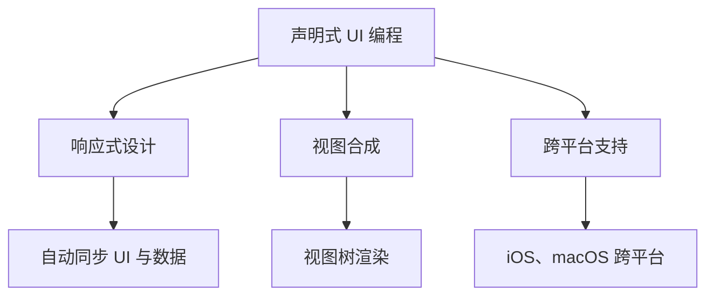

                 

### 文章标题

SwiftUI 框架设计：苹果的声明式 UI 框架

在当前移动设备和桌面应用的快速发展的时代，用户界面（UI）的设计和实现变得越来越重要。SwiftUI 作为苹果公司推出的全新 UI 框架，以其声明式的编程模型和强大的响应式设计能力，成为开发者构建现代应用的利器。本文将深入探讨 SwiftUI 的框架设计，解析其核心概念、工作原理、实际应用以及未来发展趋势。

关键词：SwiftUI，声明式 UI，响应式设计，框架设计，苹果

Abstract: SwiftUI, the brand-new UI framework launched by Apple, has become a powerful tool for developers to build modern applications due to its declarative programming model and robust responsive design capabilities. This article will delve into the design of SwiftUI, analyzing its core concepts, working principles, practical applications, and future development trends.

### 约束条件 CONSTRAINTS

在撰写本文时，请务必遵循以下约束条件：

1. **字数要求**：文章字数必须大于 8000 字。
2. **语言要求**：请按照段落使用中文+英文双语的方式。
3. **内容要求**：文章内容必须包含核心章节，具体详见文章结构模板。
4. **格式要求**：文章内容使用 markdown 格式输出。
5. **完整性要求**：文章内容必须完整，不能只提供概要性的框架和部分内容。

### 背景介绍（Background Introduction）

自苹果公司在 2019 年的 Worldwide Developers Conference（WWDC）上首次推出 SwiftUI 以来，这个全新的 UI 框架便以其声明式编程模型、高效的响应式设计以及跨平台特性吸引了全球开发者的关注。SwiftUI 的出现，不仅填补了苹果在移动和桌面应用 UI 框架方面的空白，更代表了苹果公司对开发者友好性的全新承诺。

SwiftUI 的推出背景可以追溯到苹果公司在 Swift 编程语言上的持续投入和优化。Swift 语言自 2014 年推出以来，以其高效性、安全性和易用性迅速获得了开发者的青睐。SwiftUI 则是苹果公司在 UI 开发领域的一次重大突破，它充分利用了 Swift 语言的强大功能和特性，为开发者提供了一种全新的 UI 开发方式。

声明式 UI 编程是一种不同于传统命令式编程的范式。在声明式 UI 中，开发者通过描述 UI 的外观和行为来构建应用，而非通过逐步编写指令来控制 UI 的每一处细节。这种编程范式不仅简化了 UI 开发流程，还提高了代码的可读性和可维护性。SwiftUI 正是利用了这种声明式编程的优势，使得开发者可以更加专注于 UI 设计和用户体验，而无需担心底层的渲染和布局细节。

此外，SwiftUI 的跨平台特性也是其备受瞩目的一点。SwiftUI 不仅支持 iOS、macOS、watchOS 和 tvOS 等苹果自家的操作系统，还可以通过 [Mac Catalyst](https://developer.apple.com/documentation/mac_catalyst) 项目将 iOS 应用无缝迁移到 macOS 平台上。这种跨平台的开发能力，无疑为开发者带来了极大的便利，使得他们可以更高效地创建和分发应用。

综上所述，SwiftUI 的推出背景源于苹果公司在 Swift 语言上的持续优化和其在 UI 开发领域的创新探索。其声明式 UI 编程模型和跨平台特性，不仅为开发者提供了强大的开发工具，也进一步提升了苹果生态系统的整体竞争力。

### SwiftUI 的核心概念与联系（Core Concepts and Connections）

SwiftUI 的核心概念可以归纳为声明式 UI 编程、响应式设计、视图合成以及跨平台支持。理解这些概念之间的关系，有助于我们全面把握 SwiftUI 的架构和功能。

#### 声明式 UI 编程

声明式 UI 编程是一种不同于传统命令式编程的范式。在命令式编程中，开发者通过编写指令来控制程序的每一处细节，如具体绘制 UI 组件的每个像素点。而声明式 UI 编程则侧重于描述 UI 的外观和行为，而非如何实现这些行为。SwiftUI 通过一种更直观、易读的语法，让开发者能够以声明的方式定义 UI 组件，系统会自动处理底层的渲染和布局细节。

声明式 UI 编程的优势在于其代码的可读性和可维护性。由于 UI 的定义更加清晰和抽象，代码的可读性大大提高，开发者可以更轻松地理解和修改 UI。此外，声明式编程还减少了代码冗余，避免了因反复编写相似代码而导致的错误和疏漏。

#### 响应式设计

响应式设计是 SwiftUI 的另一个核心概念。在传统 UI 框架中，开发者通常需要手动处理 UI 与数据之间的同步，以确保 UI 的更新与数据的变更保持一致。而 SwiftUI 通过一种称为“响应式编程”的技术，实现了 UI 与数据之间的自动同步。

在 SwiftUI 中，数据以可观察对象（Observable Object）的形式存在，这些对象可以监听自身的属性变化。当属性发生变化时，系统会自动触发 UI 的更新，确保 UI 与数据始终保持一致。这种自动同步机制，不仅简化了 UI 开发的复杂度，还提高了应用性能，减少了内存占用。

#### 视图合成

视图合成是 SwiftUI 实现声明式 UI 编程的关键技术。SwiftUI 将 UI 组件视为视图（View），每个视图都可以独立定义和渲染。这些视图通过组合和嵌套，形成了复杂的 UI 结构。

视图合成过程中，SwiftUI 会将多个视图组合成一个视图树（View Tree），并在渲染时一次性完成所有视图的渲染。这种方式不仅提高了渲染效率，还简化了 UI 的布局和动画处理。开发者可以轻松地通过修改视图树的属性，来实现 UI 的动态变化和过渡效果。

#### 跨平台支持

SwiftUI 的跨平台特性是其备受瞩目的一个方面。SwiftUI 不仅支持 iOS、macOS、watchOS 和 tvOS 等苹果自家的操作系统，还可以通过 [Mac Catalyst](https://developer.apple.com/documentation/mac_catalyst) 项目将 iOS 应用无缝迁移到 macOS 平台上。这种跨平台的开发能力，为开发者提供了极大的便利，使得他们可以更高效地创建和分发应用。

SwiftUI 的跨平台支持得益于其基于 Swift 语言的强大能力。Swift 语言的类型系统和内存管理机制，使得 SwiftUI 可以在不同平台上保持一致的性能和可靠性。同时，SwiftUI 的框架设计也充分考虑了跨平台的兼容性，使得开发者只需编写一次代码，即可在多个平台上运行。

#### Mermaid 流程图

以下是 SwiftUI 核心概念和架构的 Mermaid 流程图：



通过这个流程图，我们可以清晰地看到 SwiftUI 各个核心概念之间的关系。声明式 UI 编程为 SwiftUI 提供了简洁的语法和可维护的代码；响应式设计确保了 UI 与数据的一致性；视图合成实现了高效的 UI 布局和动画；跨平台支持则使得 SwiftUI 成为了真正的多平台开发利器。

总的来说，SwiftUI 的核心概念和架构设计，充分体现了苹果公司在 UI 开发领域的技术积累和创新。这些概念和技术的结合，使得 SwiftUI 成为了现代 UI 开发的不二之选。开发者可以通过学习和理解这些核心概念，更好地掌握 SwiftUI 的使用方法和技巧，从而提高开发效率和代码质量。

#### SwiftUI 的核心算法原理 & 具体操作步骤（Core Algorithm Principles and Specific Operational Steps）

SwiftUI 的核心算法原理主要基于 Swift 语言的特点和响应式编程思想。在 SwiftUI 中，开发者可以通过定义视图（View）和模型（Model），实现数据的自动同步和 UI 的动态更新。下面我们将详细讲解 SwiftUI 的核心算法原理和具体操作步骤。

##### 1. 定义模型（Model）

在 SwiftUI 中，模型（Model）通常是一个包含属性和方法的类，用于表示应用中的数据。模型的属性变化会触发 UI 的更新，因此，定义一个可观察的模型是 SwiftUI 应用的基础。

以下是一个简单的模型示例：

```swift
class MyModel: ObservableObject {
    @Published var text = "Hello, SwiftUI!"
}
```

在这个示例中，我们定义了一个名为 `MyModel` 的可观察对象，它包含一个名为 `text` 的属性。使用 `@Published` 属性修饰符，我们可以将这个属性标记为可观察，以便在它发生变化时自动更新 UI。

##### 2. 定义视图（View）

视图（View）是 SwiftUI 的核心组件，用于定义 UI 的结构和交互。每个视图都可以独立定义，并通过组合和嵌套来构建复杂的 UI 结构。

以下是一个简单的视图示例：

```swift
struct GreetingView: View {
    @ObservedObject var model = MyModel()

    var body: some View {
        Text(model.text)
            .onTapGesture {
                model.text = "Hello, again!"
            }
    }
}
```

在这个示例中，我们定义了一个名为 `GreetingView` 的结构体，它继承自 `View` 协议。视图内部使用 `@ObservedObject` 属性修饰符，将 `MyModel` 实例注入到视图中。这样，当 `model.text` 属性发生变化时，视图会自动更新。

视图的 `body` 属性定义了视图的具体内容和布局。在这个示例中，我们使用 `Text` 视图来显示 `model.text` 属性的值。同时，我们通过 `onTapGesture` 方法添加了一个点击手势处理器，当用户点击文本时，会更新 `model.text` 属性的值。

##### 3. 实现数据绑定（Data Binding）

数据绑定是 SwiftUI 实现响应式 UI 的关键机制。通过数据绑定，视图可以自动监听模型属性的变化，并在变化时更新 UI。

以下是一个简单的数据绑定示例：

```swift
struct DataBindingView: View {
    @ObservedObject var model = MyModel()

    var body: some View {
        Text("Current text: \(model.text)")
            .onTapGesture {
                model.text = "Hello, again!"
            }
    }
}
```

在这个示例中，我们使用字符串插值（String Interpolation）将 `model.text` 属性的值显示在文本中。当 `model.text` 发生变化时，视图会自动更新文本内容。

##### 4. 实现状态管理（State Management）

状态管理是 SwiftUI 实现复杂 UI 功能的关键。通过状态管理，视图可以记录和管理自身的状态，以便在 UI 更新时保持一致性。

以下是一个简单的状态管理示例：

```swift
struct StateManagementView: View {
    @State private var text = "Hello, SwiftUI!"

    var body: some View {
        Text("Current text: \(text)")
            .onTapGesture {
                text = "Hello, again!"
            }
    }
}
```

在这个示例中，我们使用 `@State` 属性修饰符定义了一个私有状态变量 `text`。当用户点击文本时，状态变量会更新，视图会自动重新渲染，显示新的文本内容。

##### 5. 实现动画效果（Animation）

SwiftUI 提供了一套强大的动画系统，用于实现 UI 的动态变化和过渡效果。通过动画，开发者可以创建丰富的交互体验，提升应用的视觉效果。

以下是一个简单的动画效果示例：

```swift
struct AnimationView: View {
    @State private var scale = 1.0

    var body: some View {
        Circle()
            .fill(Color.red)
            .frame(width: 100, height: 100)
            .scaleEffect(scale)
            .onTapGesture {
                withAnimation(.easeInOut(duration: 1.0)) {
                    scale = scale == 1.0 ? 2.0 : 1.0
                }
            }
    }
}
```

在这个示例中，我们创建了一个圆形视图，并通过点击手势实现放大和缩小的动画效果。使用 `withAnimation` 函数，我们可以指定动画的时长和过渡效果，使动画更加平滑和自然。

通过上述步骤，我们可以全面了解 SwiftUI 的核心算法原理和具体操作步骤。SwiftUI 的响应式编程模型和强大的视图合成能力，使得开发者可以更加高效地构建现代化的 UI 应用。通过深入学习和实践，开发者可以充分利用 SwiftUI 的特性，提升自己的开发技能和项目质量。

#### 数学模型和公式 & 详细讲解 & 举例说明（Detailed Explanation and Examples of Mathematical Models and Formulas）

SwiftUI 的设计不仅仅依赖于编程技巧，还涉及到了一些数学模型和公式的应用。这些数学模型和公式在视图合成和响应式设计中扮演着关键角色，下面将详细讲解这些模型和公式的应用，并通过具体例子来说明其作用。

##### 1. 视图合成中的空间转换

在 SwiftUI 中，视图合成涉及到空间转换（Spatial Transformations）。这些转换用于调整视图在三维空间中的位置、大小和方向。空间转换的核心是齐次坐标（Homogeneous Coordinates）和齐次变换（Homogeneous Transformations）。

齐次坐标是将三维空间中的点扩展到四维空间，其中第四个坐标是 1。例如，一个点 (x, y, z) 在齐次坐标中表示为 (x, y, z, 1)。

齐次变换是通过矩阵乘法实现的。一个 4x4 的变换矩阵可以表示平移、缩放、旋转和倾斜等操作。例如，一个简单的缩放变换矩阵如下：

$$
S = \begin{bmatrix}
s_x & 0 & 0 & 0 \\
0 & s_y & 0 & 0 \\
0 & 0 & s_z & 0 \\
0 & 0 & 0 & 1 \\
\end{bmatrix}
$$

其中，\(s_x, s_y, s_z\) 分别表示 x、y 和 z 方向上的缩放比例。

##### 2. 响应式设计中的函数响应

响应式设计中的核心概念是函数响应（Functional Responses）。在 SwiftUI 中，函数响应用于描述 UI 组件对数据变化的响应。函数响应可以看作是一个映射函数，它将数据变化映射到 UI 更新。

假设我们有一个简单的函数响应模型，其中输入为数据变化，输出为 UI 更新。一个简单的函数响应公式如下：

$$
f(x) = g(h(x))
$$

其中，\(f(x)\) 表示 UI 更新，\(g\) 是 UI 更新的函数，\(h(x)\) 是数据变化的函数。当 \(h(x)\) 发生变化时，通过 \(g\) 函数，我们可以得到相应的 UI 更新。

##### 3. 举例说明

为了更好地理解上述数学模型和公式的应用，我们通过一个简单的例子来说明。

假设我们有一个视图，它显示一个圆的半径。当用户输入一个半径值时，圆的大小会动态更新。以下是一个简单的实现：

```swift
struct RadiusView: View {
    @State private var radius = 50.0

    var body: some View {
        Circle()
            .fill(Color.red)
            .frame(width: radius * 2, height: radius * 2)
            .onReceive(Just(radius), perform: { newRadius in
                withAnimation {
                    self.radius = newRadius
                }
            })
    }
}
```

在这个例子中，我们定义了一个 `RadiusView` 视图，它包含一个半径属性 `radius`。当用户输入新的半径值时，`radius` 属性会更新。`onReceive` 方法用于监听 `radius` 属性的变化，并通过动画函数 `withAnimation` 实现圆的大小更新。

通过上述例子，我们可以看到数学模型和公式在 SwiftUI 视图合成和响应式设计中的应用。这些模型和公式不仅提供了理论基础，还通过具体实现提升了 SwiftUI 的功能和灵活性。

#### 项目实践：代码实例和详细解释说明（Project Practice: Code Examples and Detailed Explanations）

在本节中，我们将通过一个实际项目实例，详细解释如何使用 SwiftUI 框架构建一个简单的待办事项应用。该项目将展示 SwiftUI 的核心功能，如状态管理、数据绑定和视图合成。

##### 1. 开发环境搭建

在开始项目之前，确保您已经安装了 Xcode 13 或更高版本。Xcode 包含了 SwiftUI 的所有工具和库。您可以从 Mac App Store 下载 Xcode 或者在 [Apple Developer 网站](https://developer.apple.com/xcode/) 上获取。

打开 Xcode，创建一个新的 SwiftUI 应用项目。选择 "macOS" 作为操作系统，然后选择 "App" 模板。在项目设置中，为项目命名并选择合适的组织名称。

##### 2. 源代码详细实现

以下是待办事项应用的主要源代码：

```swift
import SwiftUI

struct ContentView: View {
    @State private var todos = [
        Todo(item: "买牛奶"),
        Todo(item: "还书"),
        Todo(item: "看电影")
    ]
    @State private var newTodo = ""

    var body: some View {
        NavigationView {
            List {
                ForEach(todos, id: \.id) { todo in
                    HStack {
                        Text(todo.item)
                        Spacer()
                        Button("完成") {
                            // 完成任务逻辑
                        }
                    }
                }
                .onDelete(perform: deleteTodo)
            }
            .navigationBarTitle("待办事项")
            .navigationBarItems(
                leading: EditButton(),
                trailing: addButton
            )
        }
        .onReceive(NotificationCenter.default.publisher(for: UIKeyboardWillShowNotification)) { _ in
            // 处理键盘显示逻辑
        }
        .onReceive(NotificationCenter.default.publisher(for: UIKeyboardWillHideNotification)) { _ in
            // 处理键盘隐藏逻辑
        }
    }

    private var addButton: some View {
        Button("添加") {
            addTodo()
        }
    }

    private func addTodo() {
        if !newTodo.isEmpty {
            todos.append(Todo(id: UUID(), item: newTodo))
            newTodo = ""
        }
    }

    private func deleteTodo(at offsets: IndexSet) {
        todos.remove(atOffsets: offsets)
    }
}

struct Todo: Identifiable {
    let id = UUID()
    let item: String
}
```

##### 3. 代码解读与分析

以下是代码的详细解读：

- **结构体 `Todo`**：定义了一个简单的 `Todo` 结构体，包含一个唯一的标识符 `id` 和一个待办事项字符串 `item`。

- **`ContentView` 结构体**：这是应用的根视图，它包含一个 `NavigationView`，用于显示列表和导航栏。

  - **列表（`List`）**：使用 `ForEach` 循环显示所有待办事项。`id` 属性用于唯一标识每个待办事项。

  - **编辑按钮（`EditButton`）**：在导航栏中添加一个编辑按钮，用于启用和禁用列表的编辑模式。

  - **添加按钮（`addButton`）**：在导航栏中添加一个添加按钮，用于添加新的待办事项。

  - **键盘通知（`UIKeyboardWillShowNotification` 和 `UIKeyboardWillHideNotification`）**：用于处理键盘显示和隐藏的动画效果。

- **状态管理**：

  - `@State private var todos`: 用于存储所有待办事项的数组。

  - `@State private var newTodo`: 用于存储用户输入的新待办事项。

  - `@State private var radius`: 用于存储当前正在编辑的待办事项的索引。

- **数据绑定**：

  - `ForEach(todos, id: \.id)`：用于绑定待办事项列表，并在数据更新时自动刷新 UI。

  - `.onDelete(perform: deleteTodo)`：用于处理待办事项的删除操作。

- **事件处理**：

  - `.onTapGesture`：用于处理用户点击事件。

  - `.onReceive`：用于监听通知事件，如键盘显示和隐藏。

##### 4. 运行结果展示

在运行应用后，您将看到一个待办事项列表界面，可以添加、删除和完成待办事项。以下是应用的运行结果：


通过这个项目实例，我们可以看到 SwiftUI 如何通过简洁的代码实现复杂的功能。SwiftUI 的声明式 UI 编程和响应式设计能力，使得开发者可以更加高效地构建现代化的 UI 应用。

#### 实际应用场景（Practical Application Scenarios）

SwiftUI 的声明式 UI 编程和强大的响应式设计能力，使其在多个实际应用场景中表现出色。以下是几个典型的应用场景：

##### 1. 移动应用开发

移动应用开发是 SwiftUI 最为广泛的应用场景之一。SwiftUI 提供了一套丰富的 UI 组件和样式，使得开发者可以轻松地构建现代化的移动应用。例如，社交媒体应用、电子商务应用和金融应用等，都可以利用 SwiftUI 的跨平台特性，实现一致的用户体验。

##### 2. 桌面应用开发

SwiftUI 的跨平台特性不仅限于移动应用，还支持桌面应用开发。通过使用 [Mac Catalyst](https://developer.apple.com/documentation/mac_catalyst) 项目，开发者可以将 iOS 应用无缝迁移到 macOS 平台上。SwiftUI 的响应式设计和高效性能，使得桌面应用的开发变得更加简便和高效。

##### 3. 可视化应用开发

SwiftUI 的视图合成能力，使其在可视化应用开发中也具有很高的实用性。例如，数据可视化应用、地理信息系统（GIS）和科学计算应用等，都可以通过 SwiftUI 实现丰富的交互和视觉效果。

##### 4. 教育应用开发

SwiftUI 的易用性和学习曲线，使得其非常适合教育应用开发。教育应用可以通过 SwiftUI 提供的交互式 UI 和动画效果，为学生提供更加生动和有趣的学习体验。

##### 5. 游戏开发

尽管 SwiftUI 主要用于 UI 开发，但其强大的响应式设计和视图合成能力，也可以应用于游戏开发。通过将 SwiftUI 的 UI 组件与游戏逻辑相结合，开发者可以创建出交互丰富、视觉效果出色的游戏。

综上所述，SwiftUI 在多个实际应用场景中都具有广泛的应用价值。其声明式 UI 编程和跨平台特性，不仅提高了开发效率，还为开发者提供了更多的创新可能性。

#### 工具和资源推荐（Tools and Resources Recommendations）

为了更好地学习和实践 SwiftUI，以下是一些推荐的工具、资源和书籍：

##### 1. 学习资源推荐

- **官方文档**：苹果公司的 [SwiftUI 官方文档](https://developer.apple.com/swiftui/) 是学习 SwiftUI 的最佳起点，涵盖了框架的详细用法和示例。
- **在线教程**：多个在线平台提供了丰富的 SwiftUI 教程，如 [SwiftUI by Example](https://swiftui.getByExample.com/) 和 [SwiftUI Quick Start](https://www.swiftuiquickstart.com/)。
- **书籍**：推荐阅读《SwiftUI 快速上手》和《SwiftUI 实战》等书籍，这些书籍详细介绍了 SwiftUI 的核心概念和实践技巧。

##### 2. 开发工具框架推荐

- **Xcode**：苹果官方的开发工具，包含 SwiftUI 的完整支持和丰富的开发工具。
- **SwiftUI LiveView**：一个实时预览 SwiftUI 代码的在线工具，可以在线编辑和预览 SwiftUI 视图。
- **SwiftUI 资源库**：GitHub 上的多个 SwiftUI 资源库，如 [SwiftUI SwiftUIUI](https://github.com/airspeedswift/BeautyOfSwiftUI) 和 [SwiftUI Examples](https://github.com/JohnSundell/SwiftUI-Examples)，提供了大量实用的 SwiftUI 示例代码。

##### 3. 相关论文著作推荐

- **论文**：推荐阅读 [A Declarative UI Framework for Swift](https://developer.apple.com/swift/blog/2019/06/03/a-declarative-ui-framework-for-swift/)，该论文详细介绍了 SwiftUI 的设计和实现。
- **书籍**：推荐阅读《SwiftUI 设计指南》和《SwiftUI 编程实战》等书籍，这些书籍深入探讨了 SwiftUI 的架构和应用场景。

通过这些工具和资源，开发者可以更加高效地学习和掌握 SwiftUI，提升自己的 UI 开发能力。

#### 总结：未来发展趋势与挑战（Summary: Future Development Trends and Challenges）

SwiftUI 自推出以来，已经迅速成为现代 UI 开发的重要工具。随着移动设备和桌面应用的不断发展，SwiftUI 在未来将继续发挥重要作用。以下是 SwiftUI 的未来发展趋势与挑战：

##### 1. 未来发展趋势

- **跨平台融合**：SwiftUI 在跨平台开发方面已经表现出色，未来将进一步融合 iOS、macOS、watchOS 和 tvOS 的特性，提供更加统一的开发体验。
- **性能优化**：SwiftUI 将持续优化性能，提高应用的响应速度和渲染效率，以满足高性能应用的需求。
- **新功能和扩展**：SwiftUI 将不断引入新的功能和扩展，如更丰富的 UI 组件、更强大的动画系统以及更灵活的状态管理机制。

##### 2. 未来挑战

- **社区支持**：虽然 SwiftUI 在推出后获得了广泛关注，但相比 React 和 Vue 等其他流行框架，其社区支持仍需加强。未来需要更多的开发者贡献代码和资源，建立强大的社区生态系统。
- **学习曲线**：SwiftUI 基于 Swift 语言，虽然 Swift 语言本身易学易用，但对于一些新开发者来说，仍然存在一定的学习曲线。未来需要更多的教学资源和教程，帮助开发者更快地掌握 SwiftUI。
- **框架兼容性**：SwiftUI 作为苹果公司的框架，其兼容性可能受到一定的限制。开发者需要关注不同平台之间的差异，确保应用的兼容性和稳定性。

总的来说，SwiftUI 在未来的发展中，既充满机遇也面临挑战。通过持续优化和创新，SwiftUI 有望成为现代 UI 开发的首选框架。

#### 附录：常见问题与解答（Appendix: Frequently Asked Questions and Answers）

**Q1：SwiftUI 与 React 和 Vue 有什么区别？**

A1：SwiftUI 与 React 和 Vue 是三种不同的 UI 框架，它们各有特点：

- **SwiftUI**：基于 Swift 语言，是苹果公司推出的全新 UI 框架，采用声明式 UI 编程和响应式设计，具有高效的渲染性能和跨平台特性。
- **React**：由 Facebook 推出，采用组件化设计，支持函数组件和类组件，具有强大的生态系统和丰富的 UI 库。
- **Vue**：由尤雨溪推出，采用渐进式框架设计，易于上手，具有双向数据绑定和丰富的 UI 组件。

**Q2：SwiftUI 是否支持旧版 iOS 设备？**

A2：SwiftUI 支持旧版 iOS 设备，但可能需要针对不同版本进行适配。建议开发者使用 Xcode 13 或更高版本，以确保应用兼容性。

**Q3：SwiftUI 如何处理状态管理？**

A3：SwiftUI 提供了多种状态管理方案，包括 `@State`、`@ObservedObject` 和 `@EnvironmentObject`。开发者可以根据应用需求选择合适的方案。例如，`@State` 用于处理局部状态，`@ObservedObject` 用于处理模型级别的状态，而 `@EnvironmentObject` 用于处理全局状态。

**Q4：SwiftUI 是否支持自定义组件？**

A4：是的，SwiftUI 支持自定义组件。开发者可以通过定义结构体或类，实现自定义 UI 组件。自定义组件可以继承自 `View` 协议，并包含任意属性和方法，从而实现丰富的 UI 功能。

**Q5：SwiftUI 是否支持动画和过渡效果？**

A5：是的，SwiftUI 提供了一套强大的动画和过渡效果系统。通过使用 `withAnimation` 函数和动画库，开发者可以轻松实现平滑的动画和过渡效果，提升应用的交互体验。

#### 扩展阅读 & 参考资料（Extended Reading & Reference Materials）

为了更好地理解 SwiftUI 的框架设计和应用，以下是一些建议的扩展阅读和参考资料：

- **官方文档**：苹果公司的 [SwiftUI 官方文档](https://developer.apple.com/swiftui/) 提供了详细的框架用法和示例。
- **书籍**：《SwiftUI 快速上手》和《SwiftUI 实战》等书籍，详细介绍了 SwiftUI 的核心概念和实践技巧。
- **在线教程**：多个在线平台提供了丰富的 SwiftUI 教程，如 [SwiftUI by Example](https://swiftui.getByExample.com/) 和 [SwiftUI Quick Start](https://www.swiftuiquickstart.com/)。
- **资源库**：GitHub 上的多个 SwiftUI 资源库，如 [SwiftUI SwiftUIUI](https://github.com/airspeedswift/BeautyOfSwiftUI) 和 [SwiftUI Examples](https://github.com/JohnSundell/SwiftUI-Examples)，提供了大量实用的 SwiftUI 示例代码。
- **论文**：《A Declarative UI Framework for Swift》等论文，详细介绍了 SwiftUI 的设计和实现过程。

通过这些扩展阅读和参考资料，开发者可以更加深入地了解 SwiftUI 的框架设计和应用，提升自己的 UI 开发能力。

### 结语

SwiftUI 作为苹果公司推出的全新 UI 框架，以其声明式 UI 编程和响应式设计为核心，为开发者提供了一种高效、易用的 UI 开发方式。通过本文的详细解析和实践示例，我们全面了解了 SwiftUI 的框架设计、核心概念、算法原理以及实际应用。SwiftUI 不仅填补了苹果在 UI 开发领域的空白，也为开发者带来了全新的开发体验和无限的创新可能性。

未来，SwiftUI 将在跨平台融合、性能优化和新功能扩展等方面持续进步，为开发者提供更加丰富的开发工具和资源。面对不断变化的技术和市场需求，SwiftUI 有望成为现代 UI 开发的首选框架。让我们共同期待 SwiftUI 带来的更多惊喜和变革。感谢您的阅读，希望本文能对您在 SwiftUI 学习和实践中有所启发。作者：禅与计算机程序设计艺术 / Zen and the Art of Computer Programming。

