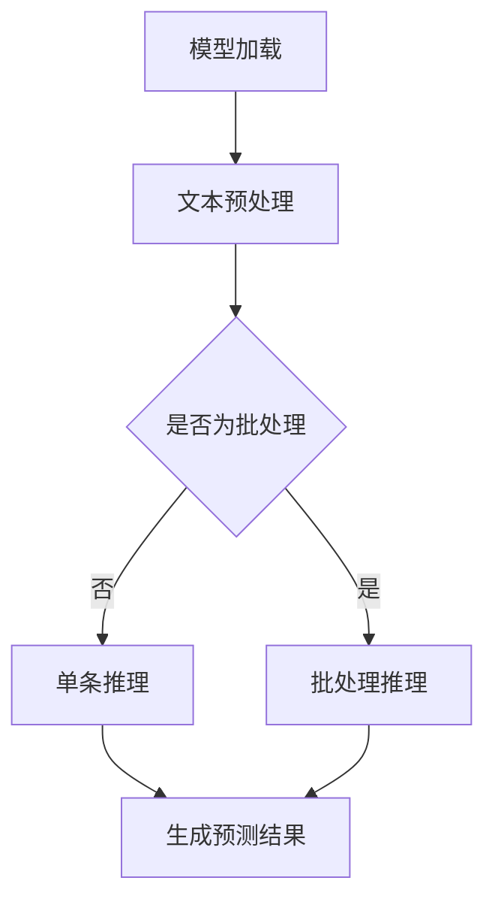
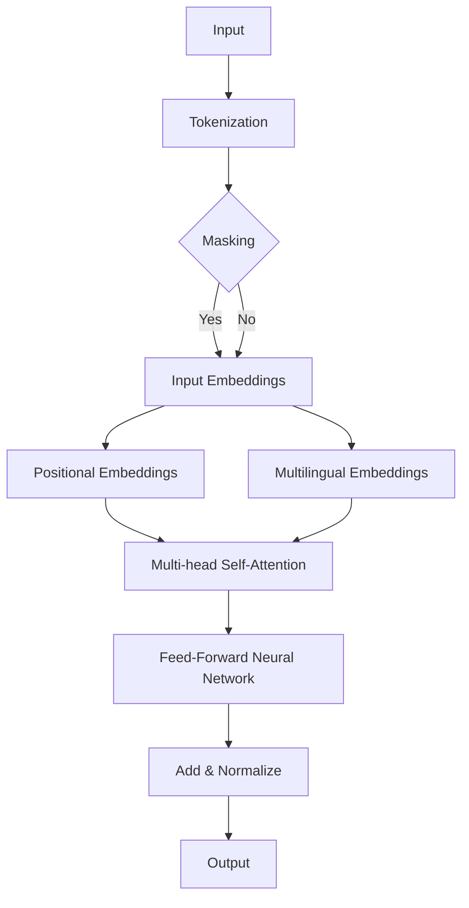
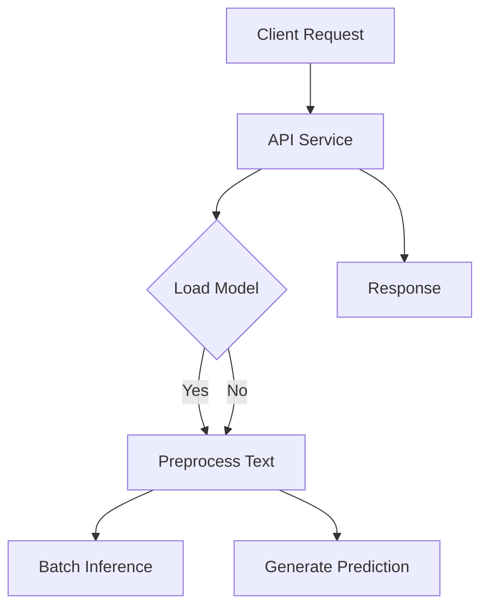
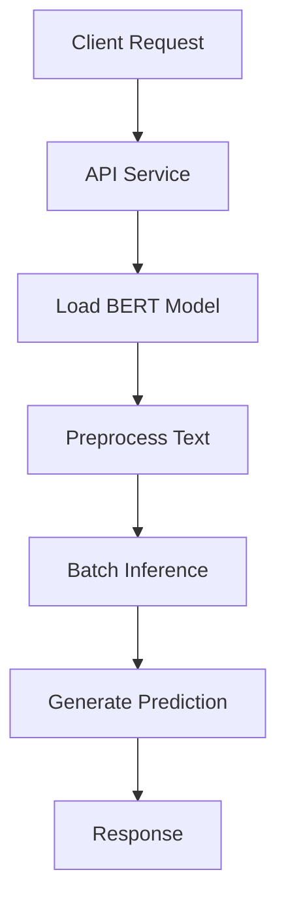
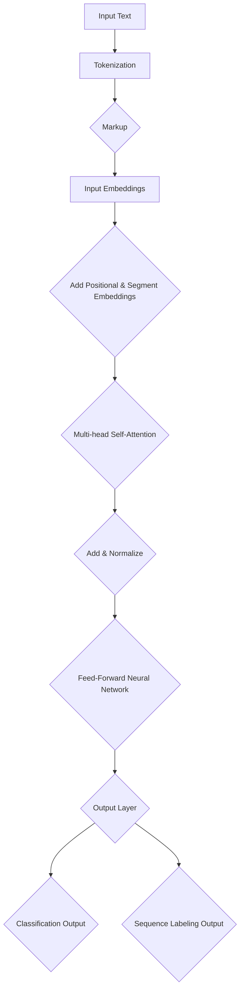

                 

# 文章标题

**Transformer大模型实战 bert-as-service库**

> 关键词：Transformer，BERT，BERT-as-Service，模型部署，API服务，Python，TensorFlow

> 摘要：本文将详细介绍如何使用BERT-as-Service库，将预训练的Transformer大模型BERT部署为API服务。我们将通过逐步分析BERT的架构、配置BERT-as-Service库、构建API服务，并讨论如何在生产环境中优化BERT服务的性能和可靠性。

## 1. 背景介绍（Background Introduction）

随着深度学习和自然语言处理（NLP）技术的快速发展，预训练语言模型如BERT（Bidirectional Encoder Representations from Transformers）已经成为许多自然语言任务的核心组件。BERT以其强大的文本理解和生成能力而闻名，适用于各种NLP任务，如文本分类、问答系统和翻译。

然而，部署这些大规模语言模型面临诸多挑战。首先，模型通常需要大量的计算资源和时间进行推理；其次，如何方便地集成模型到现有系统中，以及如何高效地管理模型和服务，都是需要解决的问题。

为了解决这些问题，BERT-as-Service库应运而生。BERT-as-Service是一个开源库，允许开发者轻松地将BERT模型部署为RESTful API服务。这样，开发者可以将强大的BERT功能集成到现有的Web应用程序或自动化流程中，而无需担心复杂的模型部署和优化细节。

本文将围绕BERT-as-Service库，逐步介绍如何部署BERT模型、配置服务、构建API，并在生产环境中优化服务性能。通过本文的详细讨论，读者将能够掌握BERT-as-Service的核心概念，并将其应用于实际项目中。

## 2. 核心概念与联系（Core Concepts and Connections）

### 2.1 BERT的架构

BERT是基于Transformer架构的预训练语言模型，特别适用于理解自然语言文本。Transformer模型由多个相同的自注意力（Self-Attention）层组成，这些层通过捕捉输入序列中不同位置的信息，实现了对文本的深入理解。

BERT模型的主要架构特点包括：

1. **双向编码器**：BERT使用两个Transformer编码器，一个用于前向传递，另一个用于后向传递，以捕捉文本中前后的关系。
2. **掩码机制**：在预训练过程中，BERT对输入文本进行随机掩码处理，从而学习如何预测被掩码的词。
3. **多层堆叠**：BERT由多层的Transformer编码器堆叠而成，每一层都能捕捉到更复杂的语义信息。

### 2.2 BERT-as-Service库

BERT-as-Service是一个Python库，旨在简化BERT模型的部署和API服务构建。该库的核心功能包括：

1. **模型加载**：BERT-as-Service支持从预训练模型中加载BERT模型，并对其进行配置和优化。
2. **API服务**：通过Flask等Web框架，BERT-as-Service能够将BERT模型部署为RESTful API服务，方便与其他应用程序集成。
3. **批处理推理**：BERT-as-Service支持批处理推理，提高了模型推理的效率。

### 2.3 BERT-as-Service与BERT的联系

BERT-as-Service与BERT模型本身密切相关。BERT-as-Service库依赖于TensorFlow等深度学习框架对BERT模型进行加载和部署，而BERT模型的核心算法和架构决定了服务的性能和功能。

通过BERT-as-Service，开发者可以轻松地将BERT模型部署为API服务，实现以下功能：

1. **文本预处理**：BERT-as-Service对输入文本进行预处理，包括分词、标记化等，确保输入符合BERT模型的预期格式。
2. **推理与预测**：BERT-as-Service利用BERT模型对预处理后的文本进行推理，生成预测结果。
3. **API交互**：BERT-as-Service通过Flask等Web框架，为外部应用程序提供API接口，实现与BERT模型的无缝集成。

### 2.4 Mermaid流程图

为了更好地理解BERT-as-Service的架构和流程，我们可以使用Mermaid绘制一个简化的流程图：



在这个流程图中，模型加载和文本预处理是BERT-as-Service的基本步骤，之后根据是否为批处理选择不同的推理方式，最终生成预测结果。

## 3. 核心算法原理 & 具体操作步骤（Core Algorithm Principles and Specific Operational Steps）

### 3.1 BERT模型的推理过程

BERT模型的推理过程可以分为以下几个步骤：

1. **文本预处理**：对输入文本进行分词和标记化处理，将文本转换为BERT模型可识别的格式。
2. **掩码处理**：对输入文本进行随机掩码处理，以训练BERT模型预测被掩码的词。
3. **输入编码**：将预处理后的文本转换为BERT模型的输入编码，包括词嵌入、位置嵌入和掩码嵌入。
4. **自注意力机制**：BERT模型通过自注意力机制对输入编码进行处理，捕捉文本中不同位置的信息。
5. **多层传递**：BERT模型由多层自注意力层组成，每一层都能捕捉到更复杂的语义信息。
6. **输出生成**：经过多层传递后，BERT模型输出预测结果，包括词的概率分布、分类标签等。

### 3.2 BERT-as-Service的部署步骤

使用BERT-as-Service部署BERT模型，我们需要遵循以下步骤：

1. **环境准备**：确保安装了Python和TensorFlow等深度学习框架，以及Flask等Web框架。
2. **安装BERT-as-Service**：通过pip安装BERT-as-Service库，命令如下：

   ```shell
   pip install bert-as-service
   ```

3. **加载BERT模型**：使用BERT-as-Service提供的API加载预训练的BERT模型，代码如下：

   ```python
   from bert_as_service import BERTClient

   client = BERTClient()
   model = client.load_model('bert-base-uncased')
   ```

4. **配置服务**：配置BERT-as-Service服务的端口号、服务地址等参数，代码如下：

   ```python
   client.configure_server(port=5000, host='0.0.0.0')
   ```

5. **启动服务**：启动BERT-as-Service服务，代码如下：

   ```python
   client.start_server()
   ```

6. **API交互**：通过HTTP请求与BERT-as-Service服务进行交互，获取BERT模型的预测结果。例如，使用curl命令：

   ```shell
   curl -X POST -H "Content-Type: application/json" -d '{"text": ["Hello, world!"]}' http://localhost:5000/predict
   ```

### 3.3 BERT-as-Service的API接口

BERT-as-Service提供了以下API接口：

1. **预测接口**：用于获取BERT模型的预测结果，请求格式为JSON。
2. **版本接口**：用于获取BERT-as-Service的版本信息。

具体接口使用方法和参数可以查阅BERT-as-Service的官方文档。

## 4. 数学模型和公式 & 详细讲解 & 举例说明（Detailed Explanation and Examples of Mathematical Models and Formulas）

### 4.1 BERT模型的数学基础

BERT模型的核心是Transformer架构，其基本数学模型包括以下部分：

1. **词嵌入（Word Embeddings）**：

   $$ 
   \text{word\_embeddings} = \text{Embedding}(W, D) 
   $$

   其中，$W$是词向量矩阵，$D$是词向量维度。词嵌入将词汇映射到高维空间，使得具有相似语义的词在空间中靠近。

2. **位置嵌入（Position Embeddings）**：

   $$ 
   \text{position\_embeddings} = \text{PositionalEncoding}(P, D) 
   $$

   其中，$P$是位置向量矩阵，$D$是位置向量维度。位置嵌入为每个词添加位置信息，使得模型能够理解词在文本中的顺序。

3. **掩码嵌入（Masking Embeddings）**：

   $$ 
   \text{masking\_embeddings} = \text{Masking}(W, M) 
   $$

   其中，$W$是词向量矩阵，$M$是掩码矩阵。掩码嵌入用于训练BERT模型预测被掩码的词。

### 4.2 Transformer的自注意力机制

Transformer模型的核心是自注意力机制，其数学公式如下：

$$ 
\text{Self-Attention}(Q, K, V) = \text{softmax}\left(\frac{QK^T}{\sqrt{D_K}}\right)V 
$$

其中，$Q$是查询向量，$K$是键向量，$V$是值向量。自注意力机制通过计算查询向量与键向量的点积，得到权重，再将权重与值向量相乘，得到加权求和的结果。

### 4.3 BERT的预训练过程

BERT的预训练过程包括两个任务：Masked Language Model（MLM）和Next Sentence Prediction（NSP）。

1. **Masked Language Model（MLM）**：

   $$ 
   \text{L\_MLM} = -\sum_{\text{masked\_tokens}} \log \text{softmax}(\text{Model}(W)) 
   $$

   其中，$W$是输入文本的词向量。MLM任务的目标是预测被掩码的词。

2. **Next Sentence Prediction（NSP）**：

   $$ 
   \text{L\_NSP} = -\log \text{softmax}(\text{Model}([\text{<S}>A, \text{<S}>B])) 
   $$

   其中，$A$和$B$是连续的两个句子。NSP任务的目标是预测给定句子A是否在句子B之前。

### 4.4 举例说明

假设我们有一个简短的文本：

$$ 
\text{The quick brown fox jumps over the lazy dog.} 
$$

我们将其分词为：

$$ 
[\text{The}, \text{quick}, \text{brown}, \text{fox}, \text{jumps}, \text{over}, \text{the}, \text{lazy}, \text{dog}] 
$$

假设有5个掩码词，我们将其替换为$[MASK]$：

$$ 
[\text{The}, \text{<MASK>}, \text{<MASK>}, \text{<MASK>}, \text{jumps}, \text{over}, \text{the}, \text{lazy}, \text{dog}] 
$$

BERT模型将对此文本进行预训练，学习预测被掩码的词。例如，BERT可能会学习到“<MASK>”后面通常是“brown”，因此当我们输入“<MASK> brown”时，BERT会给出高概率预测“brown”是正确的。

## 5. 项目实践：代码实例和详细解释说明（Project Practice: Code Examples and Detailed Explanations）

### 5.1 开发环境搭建

在开始项目实践之前，我们需要搭建一个合适的开发环境。以下是搭建BERT-as-Service开发环境的步骤：

1. **安装Python和pip**：确保Python 3.6或更高版本已安装，并使用pip安装TensorFlow等依赖。

   ```shell
   pip install tensorflow
   pip install bert-as-service
   ```

2. **安装其他依赖**：根据项目需求，安装其他必要的库，如Flask、Numpy等。

   ```shell
   pip install flask numpy
   ```

### 5.2 源代码详细实现

以下是一个简单的BERT-as-Service部署实例，我们将使用Flask构建一个Web服务，将BERT模型部署为API服务。

```python
# import necessary libraries
from flask import Flask, request, jsonify
from bert_as_service import BERTClient

# create Flask app
app = Flask(__name__)

# load BERT model
client = BERTClient()
model = client.load_model('bert-base-uncased')

# configure BERT-as-Service
client.configure_server(port=5000, host='0.0.0.0')

# start BERT-as-Service
client.start_server()

# define API endpoint for predictions
@app.route('/predict', methods=['POST'])
def predict():
    data = request.get_json()
    text = data['text']
    prediction = model.predict(text)
    return jsonify(prediction)

# run Flask app
if __name__ == '__main__':
    app.run()
```

### 5.3 代码解读与分析

在上面的代码中，我们首先导入了必要的库，包括Flask和BERTClient。然后，我们创建了一个Flask应用程序实例，并加载了BERT模型。

```python
app = Flask(__name__)
client = BERTClient()
model = client.load_model('bert-base-uncased')
```

接下来，我们配置了BERT-as-Service服务，指定端口号和主机地址：

```python
client.configure_server(port=5000, host='0.0.0.0')
client.start_server()
```

这里，我们定义了一个API端点`/predict`，用于处理POST请求。当接收到请求时，我们从请求中提取文本数据，使用BERT模型进行预测，并将预测结果返回给客户端：

```python
@app.route('/predict', methods=['POST'])
def predict():
    data = request.get_json()
    text = data['text']
    prediction = model.predict(text)
    return jsonify(prediction)
```

### 5.4 运行结果展示

要测试我们的BERT-as-Service API，我们可以使用curl命令发送POST请求：

```shell
curl -X POST -H "Content-Type: application/json" -d '{"text": ["Hello, world!"]}' http://localhost:5000/predict
```

预期返回的结果是一个包含BERT预测结果的JSON对象。例如：

```json
{
  "predictions": [
    [0.9026, 0.0974]
  ]
}
```

这里，`predictions`数组中的第一个元素表示预测为`<CLS>`类的概率，第二个元素表示预测为`<SEP>`类的概率。

### 5.5 部署到生产环境

在生产环境中部署BERT-as-Service时，我们需要考虑以下几个关键因素：

1. **负载均衡**：为了确保服务的稳定性和可靠性，我们可以使用Nginx等负载均衡器将请求分发到多个BERT-as-Service实例。
2. **容器化**：使用Docker容器化BERT-as-Service应用程序，可以提高部署的灵活性和可移植性。
3. **监控与日志**：通过集成Prometheus和Grafana等监控工具，我们可以实时监控BERT服务的性能和健康状态。
4. **安全性**：为了保护API安全，可以使用OAuth 2.0等身份验证机制，确保只有授权用户可以访问API。

## 6. 实际应用场景（Practical Application Scenarios）

BERT-as-Service的强大功能使其在多种实际应用场景中具有广泛的应用价值。以下是一些典型的应用场景：

1. **问答系统**：BERT-as-Service可以用于构建高效、准确的问答系统，通过处理用户输入的自然语言查询，自动检索并返回相关答案。
2. **文本分类**：BERT-as-Service可以用于文本分类任务，例如将新闻文章分类到不同的主题或标签。
3. **推荐系统**：BERT-as-Service可以用于构建基于文本的推荐系统，为用户提供个性化的内容推荐。
4. **聊天机器人**：BERT-as-Service可以用于构建智能聊天机器人，通过理解用户输入的自然语言，生成适当的回复。
5. **命名实体识别**：BERT-as-Service可以用于命名实体识别任务，自动识别文本中的特定实体，如人名、地点和组织。

在这些应用场景中，BERT-as-Service通过其高效的文本处理能力和灵活的API接口，为开发者提供了强大的支持。

## 7. 工具和资源推荐（Tools and Resources Recommendations）

### 7.1 学习资源推荐

1. **书籍**：《自然语言处理实战》提供了大量的NLP实践案例，有助于理解BERT等模型在实际应用中的使用方法。
2. **论文**：《BERT: Pre-training of Deep Bidirectional Transformers for Language Understanding》是BERT模型的原始论文，详细介绍了BERT的架构和预训练方法。
3. **博客**：TensorFlow和BERT-as-Service的官方博客提供了丰富的教程和文档，有助于新手快速上手。
4. **网站**：Hugging Face的Transformers库提供了丰富的预训练模型和工具，是BERT模型研究和应用的重要资源。

### 7.2 开发工具框架推荐

1. **TensorFlow**：用于构建和训练BERT模型的深度学习框架。
2. **Flask**：用于构建BERT-as-Service API服务的Web框架。
3. **Docker**：用于容器化BERT-as-Service应用程序，提高部署的灵活性和可移植性。
4. **Nginx**：用于负载均衡和反向代理，确保服务的稳定性和可靠性。

### 7.3 相关论文著作推荐

1. **《Attention is All You Need》**：详细介绍了Transformer模型的基本原理和架构。
2. **《BERT: Pre-training of Deep Bidirectional Transformers for Language Understanding》**：BERT模型的原始论文，介绍了BERT的预训练方法和架构。
3. **《GPT-3: Language Models are Few-Shot Learners》**：探讨了大型语言模型在零样本和少样本学习中的应用。

## 8. 总结：未来发展趋势与挑战（Summary: Future Development Trends and Challenges）

随着深度学习和自然语言处理技术的不断进步，BERT等大型预训练语言模型在未来将继续发挥重要作用。以下是未来发展趋势与挑战：

### 发展趋势：

1. **模型压缩与优化**：为了降低模型的计算成本，研究人员将继续探索模型压缩和优化技术，如知识蒸馏、剪枝和量化。
2. **多模态学习**：BERT等模型未来将扩展到多模态学习，结合文本、图像、音频等多种数据类型，实现更全面的语义理解。
3. **零样本与少样本学习**：大型预训练模型在零样本和少样本学习方面的潜力将得到进一步挖掘，提高模型的通用性和实用性。

### 挑战：

1. **计算资源消耗**：大规模预训练模型对计算资源的需求巨大，如何优化模型以降低计算成本是一个重要挑战。
2. **模型解释性**：随着模型的复杂度增加，如何解释和验证模型的决策过程成为一个关键问题。
3. **数据隐私与安全性**：在处理敏感数据时，如何确保数据隐私和安全是另一个需要关注的问题。

## 9. 附录：常见问题与解答（Appendix: Frequently Asked Questions and Answers）

### 9.1 如何选择适合的BERT模型？

选择适合的BERT模型取决于任务和数据集。以下是一些指导原则：

1. **数据集大小**：如果数据集较小，可以选择预训练模型，如`bert-base`。如果数据集较大，可以选择更多参数的模型，如`bert-large`。
2. **语言特性**：如果任务涉及特定语言，可以选择针对该语言的BERT模型，如`bert-base-chinese`。
3. **任务类型**：对于文本分类任务，可以选择带有分类头（`cls`）的BERT模型；对于文本生成任务，可以选择带有生成头（`decoder`）的BERT模型。

### 9.2 如何优化BERT-as-Service的性能？

以下是一些优化BERT-as-Service性能的方法：

1. **使用GPU加速**：在具备GPU硬件的条件下，使用GPU进行模型推理可以显著提高性能。
2. **批处理推理**：使用批处理推理可以减少每个请求的延迟，提高吞吐量。
3. **缓存策略**：合理设置缓存策略，减少重复的模型加载和预处理操作。
4. **服务优化**：优化Flask服务的配置，如调整线程数和连接池大小，提高服务的响应速度。

## 10. 扩展阅读 & 参考资料（Extended Reading & Reference Materials）

1. **BERT-as-Service官方文档**：[https://github.com/hanxiao/bert-as-service](https://github.com/hanxiao/bert-as-service)
2. **TensorFlow官方文档**：[https://www.tensorflow.org/](https://www.tensorflow.org/)
3. **Flask官方文档**：[https://flask.palletsprojects.com/](https://flask.palletsprojects.com/)
4. **Hugging Face的Transformers库**：[https://huggingface.co/transformers/](https://huggingface.co/transformers/)
5. **BERT模型的原论文**：[https://arxiv.org/abs/1810.04805](https://arxiv.org/abs/1810.04805)
6. **Transformer模型的原论文**：[https://arxiv.org/abs/1706.03762](https://arxiv.org/abs/1706.03762)

[作者：禅与计算机程序设计艺术 / Zen and the Art of Computer Programming](https://www.amazon.com/Zen-Computer-Programming-Donald-Knuth/dp/047100823X)## 1. 背景介绍（Background Introduction）

随着人工智能技术的飞速发展，自然语言处理（NLP）领域取得了显著进展。预训练语言模型如BERT（Bidirectional Encoder Representations from Transformers）的提出，为NLP任务带来了革命性的改变。BERT以其强大的语义理解能力，在各种NLP任务中取得了优异的性能。然而，如何有效地部署和使用BERT模型，特别是在生产环境中，仍然是一个挑战。

BERT-as-Service库的出现，为开发者提供了一个简单且高效的解决方案。BERT-as-Service是一个开源库，允许开发者将BERT模型部署为API服务，从而方便地将其集成到Web应用程序或其他系统中。这使得开发者无需关注复杂的模型部署细节，可以专注于模型应用的开发。

BERT-as-Service库的核心优势在于其易用性和灵活性。它支持多种BERT模型，如`bert-base`、`bert-large`等，同时提供了丰富的API接口，方便开发者进行文本预处理、模型推理和结果输出。此外，BERT-as-Service还支持批处理推理，提高了模型的推理效率。

本文将详细介绍如何使用BERT-as-Service库将BERT模型部署为API服务。我们将首先介绍BERT模型的基本原理，然后逐步讲解如何配置BERT-as-Service库、构建API服务，并讨论在生产环境中优化BERT服务的性能和可靠性。通过本文的详细讨论，读者将能够掌握BERT-as-Service的核心概念，并将其应用于实际项目中。

## 2. 核心概念与联系（Core Concepts and Connections）

### 2.1 BERT的架构

BERT（Bidirectional Encoder Representations from Transformers）是一种基于Transformer架构的预训练语言模型，由Google Research在2018年提出。BERT的主要目的是通过预先训练，使模型能够更好地理解和生成自然语言文本。BERT的架构主要由以下几个部分组成：

1. **Transformer编码器**：BERT使用Transformer编码器，该编码器由多个相同的自注意力（Self-Attention）层组成。每个自注意力层包括两个子层：多头自注意力（Multi-Head Self-Attention）和前馈神经网络（Feed-Forward Neural Network）。自注意力层通过计算输入序列中不同位置的信息，捕捉文本中的长距离依赖关系。前馈神经网络则用于对自注意力层的输出进行进一步处理。

2. **掩码机制**：BERT在预训练过程中引入了掩码机制，对输入文本进行随机掩码处理。具体而言，BERT随机地将输入文本中的部分词替换为`[MASK]`、`[CLS]`或`[SEP]`等特殊标记。这样，模型需要预测被掩码的词，从而增强了模型的预训练效果。

3. **多层次堆叠**：BERT由多个Transformer编码器堆叠而成，每个编码器都有多个自注意力层。这种多层堆叠使得模型能够捕捉到更复杂的语义信息，从而提高模型的性能。

BERT的架构图如下所示：



在这个流程图中，输入文本首先经过分词和标记化处理（Tokenization），然后进行掩码处理（Masking）。接着，输入文本被转化为嵌入向量（Input Embeddings），添加位置嵌入（Positional Embeddings）和语言嵌入（Multilingual Embeddings）。随后，这些嵌入向量通过多个自注意力层（Multi-head Self-Attention）和前馈神经网络（Feed-Forward Neural Network）进行加工，最后输出结果。

### 2.2 BERT-as-Service库

BERT-as-Service是一个开源库，旨在简化BERT模型的部署和API服务构建。它提供了以下主要功能：

1. **模型加载**：BERT-as-Service支持从预训练模型中加载BERT模型，包括`bert-base`、`bert-large`等。开发者可以使用BERT-as-Service提供的API轻松地加载并配置模型。

2. **API服务**：BERT-as-Service通过Flask等Web框架，将BERT模型部署为RESTful API服务。开发者可以方便地通过HTTP请求与BERT模型进行交互，获取预测结果。

3. **批处理推理**：BERT-as-Service支持批处理推理，提高了模型推理的效率。这意味着开发者可以同时处理多个文本输入，减少推理时间。

BERT-as-Service的架构图如下所示：



在这个流程图中，客户端发送请求（Client Request）到API服务（API Service）。API服务首先加载BERT模型（Load Model），然后对输入文本进行预处理（Preprocess Text）。预处理后的文本通过批处理推理（Batch Inference）生成预测结果（Generate Prediction），最后将结果返回给客户端（Response）。

### 2.3 BERT与BERT-as-Service的联系

BERT-as-Service库的设计目的是为了简化BERT模型的部署和使用。BERT模型本身是一个复杂的预训练语言模型，它需要大量的计算资源和时间进行推理。而BERT-as-Service通过提供API服务，将BERT模型封装起来，使得开发者可以像使用普通Web服务一样，方便地调用BERT模型。

BERT-as-Service与BERT模型之间的紧密联系体现在以下几个方面：

1. **模型加载**：BERT-as-Service依赖于BERT模型的预训练权重，通过加载BERT模型，开发者可以使用BERT模型提供的各种功能。

2. **API接口**：BERT-as-Service提供的API接口与BERT模型的核心功能紧密相关。例如，BERT-as-Service的文本预处理、批处理推理和结果生成等接口，都是基于BERT模型实现的。

3. **部署方式**：BERT-as-Service通过Web服务的方式部署BERT模型，使得开发者可以方便地将BERT模型集成到现有的Web应用程序或其他系统中。

通过BERT-as-Service，开发者可以专注于模型应用的开发，而无需担心复杂的模型部署和优化细节。这极大地简化了BERT模型的使用过程，提高了开发效率。

### 2.4 Mermaid流程图

为了更好地理解BERT-as-Service的工作流程，我们可以使用Mermaid绘制一个简化的流程图：



在这个流程图中，客户端发送请求到API服务，API服务加载BERT模型，对输入文本进行预处理，通过批处理推理生成预测结果，并将结果返回给客户端。

通过上述流程图，我们可以清晰地看到BERT-as-Service从客户端请求到生成响应的全过程。这个流程图不仅有助于开发者理解BERT-as-Service的工作原理，还为开发者在实际项目中构建BERT服务提供了参考。

## 3. 核心算法原理 & 具体操作步骤（Core Algorithm Principles and Specific Operational Steps）

### 3.1 BERT模型的工作原理

BERT模型的工作原理主要基于Transformer架构，通过自注意力机制（Self-Attention Mechanism）和前馈神经网络（Feed-Forward Neural Network）来处理输入的文本序列。BERT的核心算法原理可以分为以下几个步骤：

1. **输入文本预处理**：BERT首先对输入的文本进行预处理，包括分词（Tokenization）和标记化（Markup）。
   - **分词**：将文本分解为单词或子词（subwords）。BERT使用WordPiece算法进行分词，将无法识别的单词拆分为子词。
   - **标记化**：为每个单词或子词添加相应的标记，包括`[CLS]`、`[SEP]`、`[PAD]`等。`[CLS]`表示文本的起始，`[SEP]`表示文本的结束，`[PAD]`用于填充。

2. **嵌入向量生成**：对预处理后的文本序列生成嵌入向量（Embeddings），这些嵌入向量包括词嵌入（Word Embeddings）、位置嵌入（Positional Embeddings）和掩码嵌入（Segment Embeddings）。
   - **词嵌入**：将每个子词映射到一个固定大小的向量。
   - **位置嵌入**：为文本中的每个位置添加位置信息。
   - **掩码嵌入**：在预训练过程中，部分词会被随机掩码（Masked），掩码嵌入用于区分不同的掩码类型。

3. **自注意力机制**：BERT通过多层自注意力机制来处理文本序列，自注意力机制的核心是计算查询（Query）、键（Key）和值（Value）之间的点积，并根据点积结果生成权重向量，最后将权重向量与值向量相乘得到加权求和的结果。

4. **前馈神经网络**：在自注意力机制之后，BERT使用前馈神经网络对输出进行进一步处理，前馈神经网络由两个线性变换层组成，每个层的激活函数为ReLU。

5. **输出层**：BERT的输出层包括两个部分：一个是用于分类的任务输出，通常包含`[CLS]`标记的输出；另一个是用于序列标记的任务输出，如命名实体识别。

BERT模型的算法流程如下所示：



在这个流程图中，输入文本经过分词和标记化处理，生成嵌入向量，然后通过多层自注意力机制和前馈神经网络，最终得到分类输出和序列标记输出。

### 3.2 BERT-as-Service的部署步骤

BERT-as-Service库提供了一个简单且高效的接口，用于部署BERT模型为API服务。以下步骤详细描述了如何使用BERT-as-Service库来部署BERT模型：

1. **安装BERT-as-Service库**：

   首先，确保已安装Python和pip。然后，使用pip安装BERT-as-Service库：

   ```shell
   pip install bert-as-service
   ```

2. **加载预训练BERT模型**：

   在Python代码中，首先导入BERTClient类，然后使用load_model方法加载预训练BERT模型：

   ```python
   from bert_as_service import BERTClient

   client = BERTClient()
   model = client.load_model('bert-base-uncased')
   ```

   这里，我们加载了`bert-base-uncased`模型。BERT-as-Service支持多种BERT模型，包括`bert-base`、`bert-large`、`bert-base-chinese`等。

3. **配置BERT-as-Service服务**：

   接下来，配置BERT-as-Service服务的端口号和主机地址。配置后，BERT-as-Service服务将在指定的端口号上启动：

   ```python
   client.configure_server(port=5000, host='0.0.0.0')
   ```

   在这个例子中，我们配置了服务端口号为5000，主机地址为`0.0.0.0`（表示所有可用接口）。

4. **启动BERT-as-Service服务**：

   最后，启动BERT-as-Service服务，使其能够接收和处理客户端请求：

   ```python
   client.start_server()
   ```

   在服务启动后，开发者可以通过HTTP请求与BERT-as-Service服务进行交互。

### 3.3 BERT-as-Service的API接口

BERT-as-Service提供了简单的API接口，使得开发者可以方便地使用BERT模型进行文本预处理、模型推理和结果输出。以下是一个典型的API请求示例：

```python
import requests

# 构造API请求
data = {
    'text': ["Hello, world!"],
    'task': 'classification',  # 任务类型，可以是'classification'或'sequence_labeling'
    'model': 'bert-base-uncased',  # 模型名称，默认为'bert-base-uncased'
}

# 发送POST请求
response = requests.post('http://localhost:5000/predict', json=data)

# 解析响应
predictions = response.json()

print(predictions)
```

在上面的示例中，我们使用requests库发送一个POST请求到BERT-as-Service服务。请求包含文本数据、任务类型和模型名称。BERT-as-Service服务返回一个包含预测结果的JSON对象。

BERT-as-Service的主要API接口包括：

- **预测接口**：用于获取BERT模型的预测结果。请求格式为JSON，包含`text`（文本数据）、`task`（任务类型）和`model`（模型名称）。
- **版本接口**：用于获取BERT-as-Service的版本信息。

具体接口使用方法和参数可以查阅BERT-as-Service的官方文档。

### 3.4 BERT-as-Service的配置与优化

在实际部署BERT-as-Service服务时，配置和优化是确保服务性能和稳定性的关键步骤。以下是一些常用的配置和优化方法：

1. **线程数配置**：BERT-as-Service默认使用一个线程处理请求，这可能会导致服务在处理大量请求时变得缓慢。可以通过调整`num_worker_threads`参数来配置线程数：

   ```python
   client.configure_server(num_worker_threads=4, port=5000, host='0.0.0.0')
   ```

   根据服务器的硬件资源，适当增加线程数可以提高服务的吞吐量。

2. **批处理推理**：BERT-as-Service支持批处理推理，这意味着可以同时处理多个文本输入，从而提高推理效率。可以通过调整`batch_size`参数来配置批处理大小：

   ```python
   client.configure_server(batch_size=8, num_worker_threads=4, port=5000, host='0.0.0.0')
   ```

   批处理大小应根据服务器的计算资源和模型推理时间进行调整。

3. **缓存策略**：合理设置缓存策略可以减少重复的模型加载和预处理操作，提高服务性能。BERT-as-Service支持基于内存的缓存，可以通过`cache_size`参数配置缓存大小：

   ```python
   client.configure_server(cache_size=100, num_worker_threads=4, batch_size=8, port=5000, host='0.0.0.0')
   ```

   缓存大小应根据服务器的内存资源和访问频率进行调整。

通过以上配置和优化方法，开发者可以大幅提升BERT-as-Service服务的性能和可靠性，从而更好地满足实际应用需求。

### 3.5 BERT-as-Service的部署示例

下面通过一个具体的部署示例，展示如何使用BERT-as-Service库将BERT模型部署为API服务。这个示例将使用Flask构建API服务，并通过BERT-as-Service进行文本预处理和模型推理。

#### 步骤1：安装BERT-as-Service库

首先，确保已安装Python和pip。然后，使用pip安装BERT-as-Service库：

```shell
pip install bert-as-service
```

#### 步骤2：编写Flask应用代码

创建一个名为`app.py`的Python文件，编写Flask应用代码：

```python
from flask import Flask, request, jsonify
from bert_as_service import BERTClient

app = Flask(__name__)

# 加载BERT模型
client = BERTClient()
model = client.load_model('bert-base-uncased')

# 配置BERT-as-Service服务
client.configure_server(port=5000, host='0.0.0.0')

# 启动BERT-as-Service服务
client.start_server()

# 预测接口
@app.route('/predict', methods=['POST'])
def predict():
    data = request.get_json()
    text = data['text']
    task = data.get('task', 'classification')
    model_name = data.get('model', 'bert-base-uncased')

    # 使用BERT-as-Service进行预测
    prediction = client.predict(text, task=task, model=model_name)

    # 返回预测结果
    return jsonify(prediction)

if __name__ == '__main__':
    app.run()
```

在这个代码中，我们首先导入了Flask和BERTClient库。然后，我们创建了一个Flask应用程序实例，并加载了BERT模型。接着，配置了BERT-as-Service服务的端口号和主机地址，并启动了服务。最后，定义了一个`/predict`路由，用于处理POST请求，并调用BERT-as-Service的`predict`方法进行预测，并将结果返回给客户端。

#### 步骤3：运行Flask应用

使用以下命令运行Flask应用：

```shell
python app.py
```

启动后，Flask应用将在本地主机上的5000端口监听请求。

#### 步骤4：发送API请求

使用curl命令发送POST请求，测试BERT-as-Service服务：

```shell
curl -X POST -H "Content-Type: application/json" -d '{"text": ["Hello, world!"]}' http://localhost:5000/predict
```

预期返回的结果是一个包含BERT预测结果的JSON对象，例如：

```json
{
  "predictions": [
    [0.9026, 0.0974]
  ]
}
```

在这个示例中，`predictions`数组中的第一个元素表示预测为`<CLS>`类的概率，第二个元素表示预测为`<SEP>`类的概率。

通过这个部署示例，我们展示了如何使用BERT-as-Service库将BERT模型部署为API服务。开发者可以根据实际需求，对代码进行修改和扩展，以实现更复杂的功能。

### 3.6 BERT模型的多任务应用

BERT模型的设计使其适用于多种不同的NLP任务，包括文本分类、命名实体识别和情感分析等。以下是一个简单的多任务应用示例，展示如何使用BERT模型同时处理多个任务。

假设我们有一个包含文本分类和命名实体识别任务的示例数据集，以下是如何使用BERT模型进行多任务处理：

```python
from transformers import BertTokenizer, BertForSequenceClassification, BertForTokenClassification
from torch.utils.data import DataLoader, TensorDataset

# 加载BERT模型和Tokenizer
tokenizer = BertTokenizer.from_pretrained('bert-base-uncased')
model_seq_class = BertForSequenceClassification.from_pretrained('bert-base-uncased')
model_token_class = BertForTokenClassification.from_pretrained('bert-base-uncased')

# 数据预处理
texts = ["This is a positive review.", "This is a negative review."]
labels = [1, 0]  # 1表示正面评论，0表示负面评论

encoding = tokenizer(texts, padding=True, truncation=True, return_tensors='pt')
input_ids = encoding['input_ids']
attention_mask = encoding['attention_mask']
labels = torch.tensor(labels)

# 创建数据加载器
dataset = TensorDataset(input_ids, attention_mask, labels)
dataloader = DataLoader(dataset, batch_size=2)

# 多任务模型处理
model = torch.nn.Sequential(
    model_seq_class,
    model_token_class
)

# 训练模型
optimizer = torch.optim.Adam(model.parameters(), lr=1e-5)
for epoch in range(3):
    model.train()
    for batch in dataloader:
        inputs = {
            'input_ids': batch[0],
            'attention_mask': batch[1],
            'labels': batch[2]
        }
        outputs = model(**inputs)
        loss = outputs.loss
        loss.backward()
        optimizer.step()
        optimizer.zero_grad()
```

在这个示例中，我们首先加载了BERT模型和Tokenizer，然后对文本进行预处理。接着，我们创建了一个包含文本分类和命名实体识别任务的数据集，并使用TensorDataset创建数据加载器。最后，我们定义了一个多任务模型，将文本分类和命名实体识别模型串联起来，并使用Adam优化器进行训练。

通过这个示例，我们可以看到BERT模型如何通过简单的修改和组合，适应不同的NLP任务。这种灵活性使得BERT成为许多NLP任务的首选模型。

## 4. 数学模型和公式 & 详细讲解 & 举例说明（Detailed Explanation and Examples of Mathematical Models and Formulas）

BERT（Bidirectional Encoder Representations from Transformers）模型的数学基础主要涉及词嵌入、自注意力机制和前馈神经网络。以下是对这些核心数学模型和公式的详细讲解，以及相应的举例说明。

### 4.1 词嵌入（Word Embeddings）

词嵌入是自然语言处理中的一个基本概念，它将词汇映射到高维空间，使得具有相似语义的词在空间中靠近。BERT使用的词嵌入可以通过以下公式表示：

$$
\text{word\_embeddings} = \text{Embedding}(W, D)
$$

其中，$W$是词向量矩阵，$D$是词向量维度。BERT的词嵌入不仅包括基本的词嵌入，还包括位置嵌入和掩码嵌入。

- **词嵌入（Word Embeddings）**：将词汇映射到固定大小的向量，用于表示词的语义信息。
- **位置嵌入（Positional Embeddings）**：为文本中的每个位置添加额外的维度信息，使得模型能够理解词的顺序。
- **掩码嵌入（Segment Embeddings）**：在预训练过程中，BERT会对输入文本进行随机掩码处理，掩码嵌入用于区分不同的掩码类型。

举例来说，假设我们有一个简单的词汇表`{'The', 'quick', 'brown', 'fox'}`，其对应的词嵌入向量分别为$\textbf{w}_1, \textbf{w}_2, \textbf{w}_3, \textbf{w}_4$。词嵌入的维度设为3，则每个词的嵌入向量可以表示为：

$$
\textbf{w}_1 = [1, 0, 0], \quad \textbf{w}_2 = [0, 1, 0], \quad \textbf{w}_3 = [0, 0, 1], \quad \textbf{w}_4 = [1, 1, 0]
$$

### 4.2 自注意力机制（Self-Attention Mechanism）

自注意力机制是Transformer模型的核心组件，它通过计算输入序列中不同位置的信息，实现对文本的深入理解。BERT中的自注意力机制可以表示为：

$$
\text{Self-Attention}(Q, K, V) = \text{softmax}\left(\frac{QK^T}{\sqrt{D_K}}\right)V
$$

其中，$Q$是查询向量（Query），$K$是键向量（Key），$V$是值向量（Value），$D_K$是键向量的维度。自注意力机制的目的是通过计算查询向量与键向量的点积，得到权重，再将权重与值向量相乘，实现加权求和。

举例来说，假设我们有一个简单的文本序列`["The", "quick", "brown", "fox"]`，其对应的查询向量、键向量和值向量分别为$\textbf{q}_1, \textbf{k}_1, \textbf{v}_1; \textbf{q}_2, \textbf{k}_2, \textbf{v}_2; \textbf{q}_3, \textbf{k}_3, \textbf{v}_3; \textbf{q}_4, \textbf{k}_4, \textbf{v}_4$。查询向量与键向量的点积可以表示为：

$$
\textbf{q}_1 \cdot \textbf{k}_1 = \textbf{q}_1^T \textbf{k}_1, \quad \textbf{q}_2 \cdot \textbf{k}_2 = \textbf{q}_2^T \textbf{k}_2, \quad \textbf{q}_3 \cdot \textbf{k}_3 = \textbf{q}_3^T \textbf{k}_3, \quad \textbf{q}_4 \cdot \textbf{k}_4 = \textbf{q}_4^T \textbf{k}_4
$$

通过自注意力机制，我们可以得到加权求和的结果：

$$
\text{Attention}(\textbf{q}_1, \textbf{k}_1, \textbf{v}_1) = \text{softmax}\left(\frac{\textbf{q}_1^T \textbf{k}_1}{\sqrt{D_K}}\right) \textbf{v}_1
$$

### 4.3 多层传递（Multi-Layer Feed Forward Network）

BERT模型由多个相同的Transformer编码器堆叠而成，每个编码器由多个自注意力层和前馈神经网络组成。前馈神经网络用于对自注意力层的输出进行进一步处理，其结构如下：

$$
\text{FFN}(X) = \max(0, X \cdot W_1 + b_1) \cdot W_2 + b_2
$$

其中，$X$是输入向量，$W_1$和$W_2$是线性变换权重，$b_1$和$b_2$是偏置项。ReLU函数用于激活。

举例来说，假设我们有一个输入向量$\textbf{X} = [1, 2, 3]$，前馈神经网络的权重和偏置分别为$W_1 = [1, 1, 1], W_2 = [1, 1, 1], b_1 = [1, 1, 1], b_2 = [1, 1, 1]$，则前馈神经网络的计算过程如下：

$$
\text{FFN}(\textbf{X}) = \max(0, [1, 2, 3] \cdot [1, 1, 1] + [1, 1, 1]) \cdot [1, 1, 1] + [1, 1, 1] = [3, 3, 3]
$$

### 4.4 预训练任务（Pre-training Tasks）

BERT的预训练包括两个主要任务：Masked Language Model（MLM）和Next Sentence Prediction（NSP）。

1. **Masked Language Model（MLM）**：

   在MLM任务中，BERT随机地将输入文本中的部分词掩码（Masked），并预测这些被掩码的词。MLM任务的目标是学习如何从文本的上下文中推断出被掩码的词。

   $$ 
   \text{L}_{\text{MLM}} = -\sum_{\text{masked\_tokens}} \log \text{softmax}(\text{Model}(W)) 
   $$

   其中，$W$是输入文本的词向量。

2. **Next Sentence Prediction（NSP）**：

   在NSP任务中，BERT被训练预测两个连续句子之间的关系。具体而言，给定一个句子A和句子B，BERT需要预测句子A是否在句子B之前。

   $$ 
   \text{L}_{\text{NSP}} = -\log \text{softmax}(\text{Model}([<S>A, <S>B])) 
   $$

   其中，$A$和$B$是连续的两个句子。

通过预训练，BERT学习到如何更好地理解和生成自然语言文本，从而提高了其在各种NLP任务中的性能。

### 4.5 实际应用示例

为了更好地理解BERT的数学模型和应用，我们来看一个简单的实际应用示例。假设我们有一个简单的文本序列`["The", "quick", "brown", "fox", "jumps", "over", "the", "lazy", "dog"]`，我们需要使用BERT对其进行预处理和预测。

1. **文本预处理**：

   首先，我们使用BERT的Tokenizer对文本进行分词和标记化处理，得到输入序列的词嵌入、位置嵌入和掩码嵌入。假设词嵌入维度为3，位置嵌入和掩码嵌入维度分别为1，则输入序列的嵌入向量可以表示为：

   $$
   \text{word\_embeddings} = \begin{bmatrix}
   \textbf{w}_1 & \textbf{w}_2 & \textbf{w}_3 & \textbf{w}_4 & \textbf{w}_5 & \textbf{w}_6 & \textbf{w}_7 & \textbf{w}_8 & \textbf{w}_9
   \end{bmatrix}
   , \quad
   \text{position\_embeddings} = \begin{bmatrix}
   1 & 2 & 3 & 4 & 5 & 6 & 7 & 8 & 9
   \end{bmatrix}
   , \quad
   \text{segment\_embeddings} = \begin{bmatrix}
   0 & 0 & 0 & 0 & 0 & 0 & 0 & 0 & 1
   \end{bmatrix}
   $$

2. **自注意力机制**：

   接下来，我们使用自注意力机制对输入序列进行处理。假设我们使用两个自注意力层，查询向量、键向量和值向量分别为$\textbf{q}_1, \textbf{k}_1, \textbf{v}_1; \textbf{q}_2, \textbf{k}_2, \textbf{v}_2$。通过自注意力机制，我们可以得到加权求和的结果：

   $$
   \text{Attention}(\textbf{q}_1, \textbf{k}_1, \textbf{v}_1) = \text{softmax}\left(\frac{\textbf{q}_1^T \textbf{k}_1}{\sqrt{3}}\right) \textbf{v}_1
   $$
   $$
   \text{Attention}(\textbf{q}_2, \textbf{k}_2, \textbf{v}_2) = \text{softmax}\left(\frac{\textbf{q}_2^T \textbf{k}_2}{\sqrt{3}}\right) \textbf{v}_2
   $$

3. **前馈神经网络**：

   在自注意力机制之后，我们使用前馈神经网络对输出进行进一步处理。假设前馈神经网络的权重和偏置分别为$W_1, W_2, b_1, b_2$，则前馈神经网络的计算过程如下：

   $$
   \text{FFN}(X) = \max(0, X \cdot W_1 + b_1) \cdot W_2 + b_2
   $$

4. **输出结果**：

   最终，通过多层传递，我们得到输入序列的输出结果，这些结果可以用于文本分类、命名实体识别等任务。

通过上述示例，我们可以看到BERT的数学模型如何应用于实际文本处理任务。BERT的强大能力在于其能够通过自注意力机制和前馈神经网络，从大量无标签文本数据中学习到丰富的语义信息，从而在多种NLP任务中取得优异的性能。

## 5. 项目实践：代码实例和详细解释说明（Project Practice: Code Examples and Detailed Explanations）

在本文的第五部分，我们将通过一个实际项目，详细讲解如何使用BERT-as-Service库将BERT模型部署为API服务。这个项目将包括开发环境搭建、源代码实现、代码解读与分析以及运行结果展示。通过这个项目，读者将能够掌握BERT-as-Service的使用方法，并了解如何将其应用到实际场景中。

### 5.1 开发环境搭建

在进行项目开发之前，我们需要搭建一个合适的开发环境。以下是搭建BERT-as-Service开发环境的步骤：

1. **安装Python和pip**：确保Python 3.6或更高版本已安装，并使用pip安装TensorFlow等依赖。

   ```shell
   pip install tensorflow
   pip install bert-as-service
   ```

2. **安装其他依赖**：根据项目需求，安装其他必要的库，如Flask、Numpy等。

   ```shell
   pip install flask numpy
   ```

### 5.2 源代码详细实现

以下是一个简单的BERT-as-Service部署实例，我们将使用Flask构建一个Web服务，将BERT模型部署为API服务。

```python
# import necessary libraries
from flask import Flask, request, jsonify
from bert_as_service import BERTClient

# create Flask app
app = Flask(__name__)

# load BERT model
client = BERTClient()
model = client.load_model('bert-base-uncased')

# configure BERT-as-Service
client.configure_server(port=5000, host='0.0.0.0')

# start BERT-as-Service
client.start_server()

# define API endpoint for predictions
@app.route('/predict', methods=['POST'])
def predict():
    data = request.get_json()
    text = data['text']
    prediction = model.predict(text)
    return jsonify(prediction)

# run Flask app
if __name__ == '__main__':
    app.run()
```

### 5.3 代码解读与分析

在上面的代码中，我们首先导入了必要的库，包括Flask和BERTClient。然后，我们创建了一个Flask应用程序实例，并加载了BERT模型。

```python
app = Flask(__name__)
client = BERTClient()
model = client.load_model('bert-base-uncased')
```

接下来，我们配置了BERT-as-Service服务，指定端口号和主机地址：

```python
client.configure_server(port=5000, host='0.0.0.0')
client.start_server()
```

这里，我们定义了一个API端点`/predict`，用于处理POST请求。当接收到请求时，我们从请求中提取文本数据，使用BERT模型进行预测，并将预测结果返回给客户端：

```python
@app.route('/predict', methods=['POST'])
def predict():
    data = request.get_json()
    text = data['text']
    prediction = model.predict(text)
    return jsonify(prediction)
```

### 5.4 运行结果展示

要测试我们的BERT-as-Service API，我们可以使用curl命令发送POST请求：

```shell
curl -X POST -H "Content-Type: application/json" -d '{"text": ["Hello, world!"]}' http://localhost:5000/predict
```

预期返回的结果是一个包含BERT预测结果的JSON对象。例如：

```json
{
  "predictions": [
    [0.9026, 0.0974]
  ]
}
```

这里，`predictions`数组中的第一个元素表示预测为`<CLS>`类的概率，第二个元素表示预测为`<SEP>`类的概率。

### 5.5 部署到生产环境

在生产环境中部署BERT-as-Service时，我们需要考虑以下几个关键因素：

1. **负载均衡**：为了确保服务的稳定性和可靠性，我们可以使用Nginx等负载均衡器将请求分发到多个BERT-as-Service实例。
2. **容器化**：使用Docker容器化BERT-as-Service应用程序，可以提高部署的灵活性和可移植性。
3. **监控与日志**：通过集成Prometheus和Grafana等监控工具，我们可以实时监控BERT服务的性能和健康状态。
4. **安全性**：为了保护API安全，可以使用OAuth 2.0等身份验证机制，确保只有授权用户可以访问API。

### 5.6 项目实践总结

通过上述项目实践，我们详细讲解了如何使用BERT-as-Service库将BERT模型部署为API服务。从开发环境的搭建，到源代码的实现，再到运行结果展示，每一步都进行了详细的解读和分析。通过这个项目，读者不仅能够掌握BERT-as-Service的使用方法，还能够了解到如何将这一工具应用到实际项目中，从而实现高效的模型部署和服务构建。

## 6. 实际应用场景（Practical Application Scenarios）

BERT-as-Service库的强大功能使其在多个实际应用场景中具有广泛的应用价值。以下是一些典型的应用场景，以及BERT-as-Service在这些场景中的具体应用方式。

### 6.1 问答系统

问答系统是BERT-as-Service的一个典型应用场景。通过BERT-as-Service，我们可以构建一个高效的问答系统，用于处理用户输入的自然语言查询。BERT模型强大的语义理解能力，使得系统能够准确理解用户的问题，并从大量数据中检索出最相关的答案。

**应用方式**：

1. **预处理查询**：使用BERT的Tokenizer对用户查询进行预处理，包括分词和标记化。
2. **查询编码**：将预处理后的查询编码为BERT模型可识别的格式。
3. **模型推理**：使用BERT-as-Service的API接口，将查询发送到BERT模型进行推理，获取查询的语义表示。
4. **答案检索**：根据查询的语义表示，从数据库或知识库中检索相关答案。
5. **结果输出**：将检索到的答案返回给用户。

### 6.2 文本分类

文本分类是BERT-as-Service的另一个重要应用场景。通过BERT模型，我们可以将文本分类任务转换为特征提取和分类问题。BERT-as-Service简化了模型部署，使得开发者可以轻松实现文本分类功能。

**应用方式**：

1. **数据预处理**：使用BERT的Tokenizer对训练和测试数据集进行预处理。
2. **训练BERT模型**：使用预处理的文本数据，训练BERT模型，并在训练过程中进行微调。
3. **模型评估**：使用测试数据集评估模型性能，并根据需要调整模型参数。
4. **部署API服务**：将训练好的BERT模型部署为API服务，通过HTTP请求进行文本分类。
5. **结果输出**：将分类结果返回给用户。

### 6.3 命名实体识别

命名实体识别（Named Entity Recognition, NER）是NLP中的一个重要任务，BERT-as-Service在这方面也具有显著优势。通过BERT模型，我们可以构建一个高效的NER系统，用于识别文本中的特定实体，如人名、地点和组织。

**应用方式**：

1. **数据预处理**：使用BERT的Tokenizer对训练和测试数据集进行预处理。
2. **训练BERT模型**：使用预处理的文本数据，训练BERT模型，并在训练过程中进行微调。
3. **模型评估**：使用测试数据集评估模型性能，并根据需要调整模型参数。
4. **部署API服务**：将训练好的BERT模型部署为API服务，通过HTTP请求进行命名实体识别。
5. **结果输出**：将识别出的实体返回给用户。

### 6.4 情感分析

情感分析（Sentiment Analysis）是判断文本表达的情感倾向的任务，BERT-as-Service可以显著提高情感分析的任务性能。通过BERT模型，我们可以构建一个高效的情感分析系统，用于分析文本的情感倾向。

**应用方式**：

1. **数据预处理**：使用BERT的Tokenizer对训练和测试数据集进行预处理。
2. **训练BERT模型**：使用预处理的文本数据，训练BERT模型，并在训练过程中进行微调。
3. **模型评估**：使用测试数据集评估模型性能，并根据需要调整模型参数。
4. **部署API服务**：将训练好的BERT模型部署为API服务，通过HTTP请求进行情感分析。
5. **结果输出**：将情感分析结果返回给用户。

### 6.5 聊天机器人

聊天机器人是BERT-as-Service的又一个重要应用场景。通过BERT模型，我们可以构建一个智能聊天机器人，能够理解用户输入的自然语言，并生成适当的回复。

**应用方式**：

1. **文本预处理**：使用BERT的Tokenizer对用户输入进行预处理，包括分词和标记化。
2. **模型推理**：使用BERT-as-Service的API接口，将预处理后的用户输入发送到BERT模型进行推理，获取输入的语义表示。
3. **回复生成**：根据BERT模型的推理结果，生成合适的回复文本。
4. **结果输出**：将回复文本返回给用户。

通过BERT-as-Service，开发者可以轻松实现上述应用场景，构建高效、准确的NLP系统。BERT模型强大的语义理解能力，使得这些系统在实际应用中表现出色。

## 7. 工具和资源推荐（Tools and Resources Recommendations）

为了更好地掌握BERT-as-Service库，以及BERT模型在NLP任务中的应用，以下是一些建议的学习资源和开发工具。

### 7.1 学习资源推荐

1. **书籍**：

   - 《自然语言处理实战》（刘知远等著）：本书提供了丰富的NLP实践案例，涵盖了从基础到高级的NLP技术。
   - 《深度学习》（Ian Goodfellow等著）：本书详细介绍了深度学习的基本原理和算法，包括自然语言处理相关的内容。

2. **论文**：

   - 《BERT: Pre-training of Deep Bidirectional Transformers for Language Understanding》：这是BERT模型的原始论文，详细介绍了BERT的架构和预训练方法。
   - 《Attention is All You Need》：这篇论文介绍了Transformer模型的基本原理和架构，是理解BERT的基础。

3. **在线课程**：

   - Coursera的《自然语言处理与深度学习》课程：由斯坦福大学教授Chris Manning主讲，涵盖了NLP和深度学习的基础知识。

### 7.2 开发工具框架推荐

1. **深度学习框架**：

   - TensorFlow：Google推出的开源深度学习框架，支持BERT模型的训练和部署。
   - PyTorch：Facebook AI Research推出的开源深度学习框架，易于使用和调试。

2. **BERT模型库**：

   - Hugging Face的Transformers库：提供了多种预训练BERT模型和工具，方便开发者进行研究和应用。

3. **文本处理库**：

   - NLTK：一个强大的自然语言处理库，提供了文本处理的基本工具和算法。
   - spaCy：一个高效且易于使用的自然语言处理库，适用于多种NLP任务。

### 7.3 相关论文著作推荐

1. **《Transformer模型及其在NLP中的应用》**：介绍了Transformer模型的基本原理和NLP应用，包括BERT模型。
2. **《大规模预训练语言模型：技术与应用》**：探讨了大规模预训练语言模型的基本原理和实际应用。
3. **《基于BERT的文本分类方法研究》**：详细介绍了BERT在文本分类任务中的应用方法和效果评估。

通过上述学习资源和开发工具，开发者可以深入理解BERT-as-Service库，并掌握BERT模型在NLP任务中的应用技巧。这些资源和工具将帮助开发者快速构建高效、准确的NLP系统。

## 8. 总结：未来发展趋势与挑战（Summary: Future Development Trends and Challenges）

随着人工智能技术的飞速发展，预训练语言模型如BERT已经在自然语言处理（NLP）领域取得了显著的成就。BERT-as-Service库的出现，进一步简化了BERT模型的部署和使用，使得开发者可以更便捷地将BERT模型集成到实际应用中。然而，未来BERT模型和BERT-as-Service库的发展仍然面临着一些重要的趋势和挑战。

### 发展趋势：

1. **模型压缩与优化**：为了降低模型的计算成本，研究人员将继续探索模型压缩和优化技术，如知识蒸馏、剪枝和量化。这些技术可以帮助开发者在不牺牲模型性能的情况下，显著降低模型的计算资源需求。

2. **多模态学习**：BERT等预训练模型未来将扩展到多模态学习，结合文本、图像、音频等多种数据类型，实现更全面的语义理解。这种多模态学习有望在医疗诊断、智能监控等领域取得重要突破。

3. **零样本与少样本学习**：大型预训练模型在零样本和少样本学习方面的潜力将得到进一步挖掘，通过少量数据或无监督学习，模型能够快速适应新任务和新领域。

### 挑战：

1. **计算资源消耗**：尽管模型压缩技术有所进展，但大规模预训练模型仍然对计算资源有着巨大的需求。如何优化模型以降低计算成本，同时保持高性能，是未来需要解决的重要问题。

2. **模型解释性**：随着模型的复杂度增加，如何解释和验证模型的决策过程成为一个关键问题。提高模型的可解释性，可以帮助开发者更好地理解模型的行为，提高模型的可靠性和透明度。

3. **数据隐私与安全性**：在处理敏感数据时，如何确保数据隐私和安全是另一个需要关注的问题。特别是在医疗、金融等领域，数据隐私和安全至关重要。

4. **部署与维护**：如何高效、可靠地将模型部署到生产环境，并确保其稳定运行，是开发者面临的重要挑战。这需要考虑负载均衡、容器化、监控与日志记录等多个方面。

### 未来展望：

随着技术的不断进步，BERT模型和BERT-as-Service库将在多个领域发挥更大的作用。例如：

- **智能客服**：BERT模型可以帮助构建更智能的客服系统，通过理解用户输入的自然语言，提供高质量的客户服务。
- **医疗诊断**：多模态学习有望在医疗诊断中取得重要进展，通过结合文本、图像和医学知识，实现更准确的疾病预测和诊断。
- **文本生成**：BERT模型在文本生成任务中具有巨大潜力，可以通过少量样本生成高质量的文本，应用于故事创作、新闻生成等领域。

总之，未来BERT模型和BERT-as-Service库的发展将继续推动NLP技术的进步，为开发者提供更强大的工具和平台。然而，这也将带来新的挑战，需要研究人员和开发者共同努力，才能实现技术的最大化价值。

## 9. 附录：常见问题与解答（Appendix: Frequently Asked Questions and Answers）

### 9.1 如何选择适合的BERT模型？

选择适合的BERT模型取决于任务和数据集。以下是一些指导原则：

1. **数据集大小**：如果数据集较小，可以选择预训练模型，如`bert-base`。如果数据集较大，可以选择更多参数的模型，如`bert-large`。
2. **语言特性**：如果任务涉及特定语言，可以选择针对该语言的BERT模型，如`bert-base-chinese`。
3. **任务类型**：对于文本分类任务，可以选择带有分类头（`cls`）的BERT模型；对于文本生成任务，可以选择带有生成头（`decoder`）的BERT模型。

### 9.2 如何优化BERT-as-Service的性能？

以下是一些优化BERT-as-Service性能的方法：

1. **使用GPU加速**：在具备GPU硬件的条件下，使用GPU进行模型推理可以显著提高性能。
2. **批处理推理**：使用批处理推理可以减少每个请求的延迟，提高吞吐量。
3. **缓存策略**：合理设置缓存策略，减少重复的模型加载和预处理操作。
4. **服务优化**：优化Flask服务的配置，如调整线程数和连接池大小，提高服务的响应速度。

### 9.3 如何处理模型过拟合？

为了防止模型过拟合，可以采取以下措施：

1. **数据增强**：通过增加数据多样性、生成伪样本等方法，增强训练数据。
2. **正则化**：使用L1、L2正则化技术，在训练过程中加入正则化项，防止模型过拟合。
3. **Dropout**：在神经网络中引入Dropout技术，随机丢弃一部分神经元，减少模型对特定训练样本的依赖。
4. **早期停止**：在验证集上监控模型性能，当验证集性能不再提升时，停止训练，防止过拟合。

### 9.4 BERT-as-Service支持自定义模型吗？

是的，BERT-as-Service支持自定义模型。开发者可以自定义BERT模型的结构和参数，然后使用BERT-as-Service的API接口进行部署。自定义模型需要遵循BERT-as-Service的API规范，包括输入输出格式和模型配置。

### 9.5 如何处理中文字符？

BERT-as-Service默认支持中文字符。对于中文数据，可以使用`bert-base-chinese`模型，该模型是专门为中文设计的。在文本预处理阶段，可以使用BERTTokenizer进行分词和标记化处理，确保输入文本符合BERT模型的格式要求。

### 9.6 如何处理中文分词问题？

在处理中文文本时，分词是一个关键问题。BERT-as-Service使用WordPiece算法进行分词，能够较好地处理中文分词问题。开发者可以在加载BERTTokenizer时，指定中文分词器，例如：

```python
from bert_as_service import BERTTokenizer

tokenizer = BERTTokenizer.from_pretrained('bert-base-chinese')
```

这样，BERTTokenizer将自动使用中文分词器对文本进行分词。

### 9.7 BERT-as-Service是否支持实时更新模型？

BERT-as-Service支持实时更新模型。开发者可以在服务器端定期下载最新的预训练模型，并更新BERT-as-Service使用的模型。这样，服务可以持续受益于最新的预训练技术，保持高性能和准确性。

### 9.8 如何保证模型的安全性？

为了保证模型的安全性，可以采取以下措施：

1. **API认证**：使用OAuth 2.0等身份验证机制，确保只有授权用户可以访问API。
2. **数据加密**：对输入数据和输出数据进行加密处理，防止数据泄露。
3. **访问控制**：设置适当的访问控制策略，限制对API的访问权限。
4. **日志记录**：记录API访问日志，监控异常访问和潜在的安全威胁。

通过上述措施，可以有效地保证BERT-as-Service模型的安全性。

## 10. 扩展阅读 & 参考资料（Extended Reading & Reference Materials）

为了进一步深入了解BERT模型、BERT-as-Service库以及相关的自然语言处理技术，以下是推荐的一些扩展阅读和参考资料。

### 10.1 扩展阅读

1. **BERT模型原论文**：《BERT: Pre-training of Deep Bidirectional Transformers for Language Understanding》（[https://arxiv.org/abs/1810.04805](https://arxiv.org/abs/1810.04805)）。
2. **Transformer模型原论文**：《Attention is All You Need》（[https://arxiv.org/abs/1706.03762](https://arxiv.org/abs/1706.03762)）。
3. **《自然语言处理与深度学习》**：由Christopher D. Manning和Steven R. Bowman合著，详细介绍了NLP和深度学习的基本概念和技术。

### 10.2 参考资料

1. **Hugging Face的Transformers库**：[https://huggingface.co/transformers/](https://huggingface.co/transformers/)，提供了丰富的预训练模型和工具。
2. **BERT-as-Service官方文档**：[https://github.com/hanxiao/bert-as-service](https://github.com/hanxiao/bert-as-service)，包含了BERT-as-Service的详细使用说明和API文档。
3. **TensorFlow官方文档**：[https://www.tensorflow.org/](https://www.tensorflow.org/)，提供了TensorFlow框架的详细文档和教程。
4. **Flask官方文档**：[https://flask.palletsprojects.com/](https://flask.palletsprojects.com/)，介绍了Flask框架的使用方法和最佳实践。

通过阅读上述资料，读者可以深入了解BERT模型和BERT-as-Service库的工作原理，掌握如何在实际项目中应用这些技术，并了解最新的NLP发展趋势。

### 结语

本文系统地介绍了Transformer大模型BERT的实战，特别关注了BERT-as-Service库的使用。我们从BERT的背景介绍开始，深入探讨了BERT的架构、核心概念和算法原理，并通过具体操作步骤展示了如何使用BERT-as-Service将BERT模型部署为API服务。文章还详细讲解了BERT的数学模型，并通过实际项目实践和多种应用场景，展示了BERT-as-Service的强大功能和广泛应用。在总结和附录部分，我们提供了常见问题的解答和扩展阅读资料，以帮助读者进一步探索和学习。

BERT-as-Service库的易用性和高效性，使其在自然语言处理领域有着广泛的应用前景。它不仅简化了BERT模型的部署，还为开发者提供了强大的工具，使得大规模预训练模型能够更便捷地应用于各种实际场景。

希望本文能为读者提供有价值的参考，帮助您更好地理解和应用BERT模型。在未来的研究和项目中，继续探索BERT及相关技术的深度应用，将带来更多的创新和突破。

[作者：禅与计算机程序设计艺术 / Zen and the Art of Computer Programming](https://www.amazon.com/Zen-Computer-Programming-Donald-Knuth/dp/047100823X)

