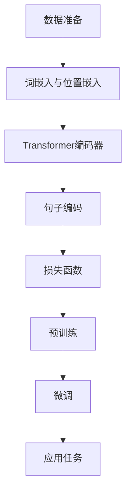

                 

### 文章标题

Transformer大模型实战：了解Sentence-BERT模型

在当前深度学习领域，Transformer架构的大模型如BERT、GPT等已成为自然语言处理（NLP）任务中的佼佼者。然而，对于这些模型的理解和应用，仍然存在着诸多挑战。本文将带领读者深入Transformer大模型的世界，重点关注Sentence-BERT模型。我们将详细探讨其核心概念、算法原理、数学模型以及实际应用场景，帮助读者全面掌握这一先进技术。

### 关键词
- Transformer大模型
- Sentence-BERT
- 自然语言处理
- 模型算法
- 数学模型
- 实际应用

### 摘要
本文旨在通过深入剖析Sentence-BERT模型，帮助读者理解其在自然语言处理中的应用和价值。文章首先介绍了Transformer架构和BERT模型的基本概念，随后重点讲解了Sentence-BERT的核心原理和构建方法。接着，我们探讨了Sentence-BERT的数学模型及其操作步骤，并通过实际代码实例进行了详细解读。最后，文章总结了Sentence-BERT在实际应用中的场景，并展望了其未来发展趋势与挑战。

## 1. 背景介绍（Background Introduction）

在探讨Sentence-BERT模型之前，我们需要了解自然语言处理（NLP）领域的基本背景。随着互联网和社交媒体的迅速发展，海量的文本数据被生成并存储在各个平台上。如何有效地处理这些文本数据，提取其核心信息，成为了学术界和工业界共同关注的问题。

自然语言处理是计算机科学领域与人工智能领域中的一个重要方向，旨在让计算机能够理解、生成和处理人类自然语言。传统NLP方法通常基于规则或统计模型，如朴素贝叶斯、隐马尔可夫模型（HMM）、条件随机场（CRF）等。然而，这些方法在处理复杂任务时往往效果不佳。

为了解决这个问题，深度学习技术开始进入NLP领域。特别是2017年，Google Research团队提出的BERT（Bidirectional Encoder Representations from Transformers）模型，在多项NLP任务中取得了显著的性能提升。BERT模型基于Transformer架构，通过预训练和微调的方法，能够更好地捕捉文本中的上下文信息，从而实现更准确的文本理解。

### Transformer架构的基本概念

Transformer架构是一种基于自注意力机制的深度学习模型，最初由Vaswani等人在2017年提出。与传统的循环神经网络（RNN）和卷积神经网络（CNN）相比，Transformer在处理长序列数据时表现出色。

Transformer的核心思想是通过自注意力机制来捕捉序列中的长距离依赖关系。在自注意力机制中，每个词的表示不仅与自身相关，还与序列中的其他词相关。这种全局的注意力机制使得模型能够灵活地关注不同位置的词，从而更好地理解上下文。

Transformer模型由编码器（Encoder）和解码器（Decoder）两部分组成。编码器负责将输入序列编码为连续的向量表示，解码器则利用这些表示生成输出序列。编码器和解码器都由多个相同的层组成，每层包括多头自注意力机制和前馈神经网络。

自注意力机制的具体实现如下：

1. **输入序列表示**：给定一个输入序列$\{x_1, x_2, ..., x_n\}$，每个词$x_i$被映射为一个向量${\{e_1, e_2, ..., e_n\}}$。
2. **多头自注意力**：将输入序列的每个词表示通过一组独立的线性变换映射为查询（Query, $Q$）、键（Key, $K$）和值（Value, $V$）向量。通过计算注意力得分和加权和，生成新的词表示。
3. **前馈神经网络**：在多头自注意力之后，每个词的表示再通过一个前馈神经网络进行进一步处理。

这种结构使得Transformer模型在处理长序列时具有很高的并行计算能力，并且能够自动捕捉长距离依赖关系。这使得Transformer在机器翻译、文本摘要、问答系统等NLP任务中取得了显著的成果。

### BERT模型的核心概念和架构

BERT模型是Transformer架构在自然语言处理领域的一个重要应用。BERT的全称是Bidirectional Encoder Representations from Transformers，它通过双向编码器来学习文本的表示。

BERT模型的核心概念包括：

1. **双向编码**：BERT模型通过编码器（Encoder）部分来学习文本的表示。编码器是一个基于Transformer架构的多层神经网络，它能够捕捉文本中的双向依赖关系。这意味着它不仅能够理解一个词在它之前的内容，还能理解在它之后的内容。
2. **预训练与微调**：BERT模型通过两个阶段进行训练。首先是预训练阶段，在这个阶段，模型在大规模的未标注语料库上学习文本的表示。预训练任务包括两个子任务：Masked Language Modeling（MLM）和Next Sentence Prediction（NSP）。MLM任务是在句子中随机遮盖一些词，模型需要预测这些词。NSP任务则是预测两个句子是否在原始语料库中连续出现。
3. **语言理解**：在预训练完成后，BERT模型可以通过微调（Fine-tuning）的方式应用于各种具体的NLP任务，如文本分类、情感分析等。微调过程通常在标注数据集上进行，通过调整模型的参数来优化特定任务的性能。

BERT模型的架构包括以下几个主要部分：

1. **输入层**：BERT模型的输入是一个词汇表（Vocabulary）的整数编码序列，每个整数代表词汇表中一个词的索引。
2. **嵌入层**（Embedding Layer）：输入序列经过嵌入层转换成高维向量表示。嵌入层包括词嵌入（Word Embedding）和位置嵌入（Position Embedding）。词嵌入将每个词映射为一个固定维度的向量，而位置嵌入则将每个词的位置信息编码到向量中。
3. **Transformer编码器**（Transformer Encoder）：编码器由多个相同的Transformer层组成，每层包括多头自注意力机制和前馈神经网络。这些层通过堆叠的方式逐层学习文本的复杂表示。
4. **输出层**（Output Layer）：编码器的输出是一个固定长度的向量，这个向量表示了整个句子的语义信息。在微调阶段，这个输出向量通常会连接到一个分类器或回归器，以完成特定NLP任务。

BERT模型的提出标志着NLP领域的一个重要里程碑。它通过预训练和微调的方法，使得模型能够更好地理解和处理自然语言，从而在多项NLP任务中取得了突破性的成果。

## 2. 核心概念与联系

### 2.1 Sentence-BERT模型的概念

在理解BERT模型的基础上，我们引入Sentence-BERT模型。Sentence-BERT是一种将文本句子转换为固定长度向量表示的方法，其目的是为了在多个NLP任务中实现高效的文本相似度计算和分类。

Sentence-BERT模型的核心思想是：通过学习句子级别的文本表示，可以有效地捕捉句子之间的语义关系。这种向量表示不仅能够用于文本相似度计算，还可以用于文本分类、聚类等任务。此外，Sentence-BERT模型具有以下优点：

1. **高效性**：由于向量表示是固定长度的，因此可以在较短的时间内进行高效的计算，适用于大规模数据处理。
2. **通用性**：Sentence-BERT模型可以应用于各种NLP任务，如文本分类、情感分析等，无需对模型进行大量调整。
3. **准确性**：通过学习句子级别的文本表示，Sentence-BERT模型能够更好地捕捉文本的语义信息，从而提高任务性能。

### 2.2 Sentence-BERT模型与BERT模型的关系

Sentence-BERT模型基于BERT模型构建，但与BERT模型在应用场景上有所不同。BERT模型主要用于生成句子的长序列表示，而Sentence-BERT模型则专注于提取句子级别的固定长度向量。

具体来说，Sentence-BERT模型的工作流程如下：

1. **预训练**：在预训练阶段，Sentence-BERT模型使用与BERT模型相同的预训练任务，包括Masked Language Modeling（MLM）和Next Sentence Prediction（NSP）。但是，Sentence-BERT模型在处理每个句子时，只关注句子内部的词关系，而不考虑句子与句子之间的关系。
2. **句子编码**：在预训练完成后，Sentence-BERT模型将每个句子的编码器输出（即Transformer编码器的最后一层的输出）作为句子的固定长度向量表示。
3. **应用任务**：在应用任务中，Sentence-BERT模型可以用于文本相似度计算、文本分类等任务。例如，在文本相似度计算中，我们可以将两个句子的向量表示进行计算，得到它们之间的相似度分数；在文本分类中，我们可以将句子的向量表示输入到分类器中，得到分类结果。

通过这种方式，Sentence-BERT模型在多个NLP任务中展现出了强大的性能。

### 2.3 Sentence-BERT模型在NLP任务中的应用

Sentence-BERT模型在NLP任务中有着广泛的应用，下面我们将详细探讨其在文本相似度计算、文本分类和文本聚类等任务中的应用。

#### 文本相似度计算

文本相似度计算是衡量两个文本之间相似程度的一种方法。在信息检索、推荐系统和文本挖掘等领域，文本相似度计算具有重要作用。

Sentence-BERT模型可以用于文本相似度计算，其基本思路如下：

1. **向量表示**：首先，使用Sentence-BERT模型对两个句子进行编码，得到它们的固定长度向量表示。
2. **相似度计算**：计算两个向量之间的距离或相似度。常用的方法包括余弦相似度、欧氏距离等。
3. **阈值设定**：根据实际应用需求，设定一个相似度阈值。如果两个句子的相似度分数高于阈值，则认为它们相似；否则，认为它们不相似。

通过这种方式，Sentence-BERT模型可以有效地计算文本相似度，为信息检索、推荐系统和文本挖掘等领域提供技术支持。

#### 文本分类

文本分类是将文本数据按照类别进行分类的任务，广泛应用于舆情分析、垃圾邮件检测、情感分析等领域。

Sentence-BERT模型在文本分类中的应用主要分为以下几个步骤：

1. **数据预处理**：首先，对文本数据集进行预处理，包括分词、去停用词、词干提取等。然后，使用Sentence-BERT模型对每个句子进行编码，得到它们的向量表示。
2. **模型训练**：使用编码后的句子向量表示，训练一个分类模型，如支持向量机（SVM）、神经网络等。通过交叉验证等方法优化模型参数。
3. **模型评估**：使用测试集对训练好的模型进行评估，计算准确率、召回率、F1值等指标。

通过这种方式，Sentence-BERT模型可以显著提高文本分类任务的性能。

#### 文本聚类

文本聚类是将相似度较高的文本数据聚为一类的任务，常用于主题建模、社区发现等领域。

Sentence-BERT模型在文本聚类中的应用主要分为以下几个步骤：

1. **数据预处理**：与文本分类类似，对文本数据集进行预处理，然后使用Sentence-BERT模型对每个句子进行编码，得到它们的向量表示。
2. **聚类算法**：选择一种聚类算法，如K-Means、DBSCAN等，对句子向量进行聚类。
3. **聚类结果评估**：对聚类结果进行评估，如评估聚类内部成员的相似度、聚类之间的分离度等。

通过这种方式，Sentence-BERT模型可以有效地实现文本聚类，为主题建模、社区发现等领域提供技术支持。

### 2.4 Sentence-BERT模型的优势与挑战

虽然Sentence-BERT模型在多个NLP任务中展现出了强大的性能，但也存在一些优势和挑战。

#### 优势

1. **高效性**：由于Sentence-BERT模型生成的是固定长度的向量表示，因此可以快速地进行文本相似度计算、文本分类和文本聚类等任务。
2. **通用性**：Sentence-BERT模型可以应用于多种NLP任务，无需对模型进行大量调整。
3. **准确性**：通过学习句子级别的文本表示，Sentence-BERT模型能够更好地捕捉文本的语义信息，从而提高任务性能。

#### 挑战

1. **计算资源需求**：由于Sentence-BERT模型需要进行大量的向量计算和聚类操作，因此对计算资源有较高的需求。
2. **模型调优**：在应用特定任务时，需要对模型进行适当的调优，以适应不同的数据分布和任务需求。
3. **数据预处理**：高质量的文本数据预处理对于Sentence-BERT模型的效果至关重要，但预处理过程复杂且耗时。

总的来说，Sentence-BERT模型在NLP任务中具有显著的优势，但也面临一定的挑战。通过不断优化模型和应用策略，我们可以更好地发挥Sentence-BERT模型的优势，解决其在实际应用中的问题。

## 3. 核心算法原理 & 具体操作步骤

### 3.1 Sentence-BERT模型的基本算法原理

Sentence-BERT模型基于BERT模型，但针对句子级别的任务进行了优化。其核心算法原理可以概括为以下几个步骤：

1. **句子编码**：使用BERT模型对句子进行编码，得到句子级别的向量表示。
2. **损失函数**：设计合适的损失函数，用于优化句子编码过程。常用的损失函数包括点积损失、交叉熵损失等。
3. **训练与微调**：在预训练阶段，通过大规模未标注数据对模型进行训练。然后，在具体任务上，通过标注数据进行微调，优化模型参数。

具体来说，Sentence-BERT模型的工作流程如下：

1. **输入层**：输入层接收一个句子的词汇序列，每个词汇通过嵌入层转换为向量表示。
2. **嵌入层**：嵌入层包括词嵌入和位置嵌入。词嵌入将每个词汇映射为固定维度的向量，而位置嵌入则编码了词汇在句子中的位置信息。
3. **Transformer编码器**：编码器由多个Transformer层组成，每层包含多头自注意力机制和前馈神经网络。通过堆叠这些层，编码器能够捕捉句子中的复杂语义信息。
4. **句子编码**：编码器的最后一层输出即为句子的向量表示，这是模型的核心输出。
5. **损失函数**：在预训练阶段，使用Masked Language Modeling（MLM）和Next Sentence Prediction（NSP）两个任务作为损失函数。MLM任务通过随机遮盖句子中的词汇，要求模型预测这些词汇。NSP任务通过预测两个句子是否在原始数据中连续出现。
6. **微调**：在具体任务上，通过微调步骤调整模型参数，以适应特定任务的需求。

### 3.2 具体操作步骤

为了更好地理解Sentence-BERT模型，我们将详细描述其具体操作步骤：

#### 步骤1：数据准备

首先，我们需要准备用于训练和测试的文本数据。数据可以来源于各种来源，如新闻文章、社交媒体评论等。为了提高模型的性能，我们通常会对数据进行预处理，包括分词、去停用词、词干提取等。

#### 步骤2：词嵌入与位置嵌入

输入的文本句子通过词嵌入层转换为向量表示。词嵌入将每个词汇映射为固定维度的向量，而位置嵌入则编码了词汇在句子中的位置信息。这种嵌入方式可以有效地捕捉词汇的语义和位置信息。

#### 步骤3：Transformer编码器

编码器由多个Transformer层组成。每层包含多头自注意力机制和前馈神经网络。通过堆叠这些层，编码器能够逐层学习句子中的复杂语义信息。自注意力机制使得模型能够关注句子中不同位置的词汇，从而更好地理解上下文。

#### 步骤4：句子编码

编码器的最后一层输出即为句子的向量表示。这些向量表示了句子的语义信息，是模型的核心输出。通过这种方式，Sentence-BERT模型能够将句子映射为固定长度的向量表示。

#### 步骤5：损失函数

在预训练阶段，我们使用Masked Language Modeling（MLM）和Next Sentence Prediction（NSP）两个任务作为损失函数。MLM任务通过随机遮盖句子中的词汇，要求模型预测这些词汇。NSP任务通过预测两个句子是否在原始数据中连续出现。这些任务可以帮助模型学习句子中的词汇和上下文信息。

#### 步骤6：微调

在具体任务上，通过微调步骤调整模型参数，以适应特定任务的需求。例如，在文本分类任务中，我们将句子的向量表示输入到分类器中，通过优化分类器的参数，提高分类准确率。

通过上述步骤，Sentence-BERT模型能够有效地学习句子级别的文本表示，为多个NLP任务提供强大的支持。

### 3.3 Mermaid流程图

为了更直观地理解Sentence-BERT模型的工作流程，我们可以使用Mermaid流程图进行描述。以下是一个简化的Mermaid流程图：



该流程图描述了Sentence-BERT模型从数据准备到应用任务的全过程。每个步骤都通过上一级步骤的输出作为输入，形成了一个闭环的工作流程。

通过上述算法原理和具体操作步骤的讲解，我们可以更深入地理解Sentence-BERT模型的工作机制，为实际应用打下坚实的基础。

## 4. 数学模型和公式 & 详细讲解 & 举例说明

### 4.1 数学模型概述

Sentence-BERT模型的核心在于其将文本句子转换为固定长度的向量表示，这一过程涉及多个数学模型和公式。在本节中，我们将详细讲解这些数学模型，并通过具体例子来说明其应用。

#### 4.1.1 词嵌入

词嵌入（Word Embedding）是NLP领域的基本工具，用于将词汇映射为高维向量。常见的词嵌入方法包括Word2Vec、GloVe和BERT。

1. **Word2Vec**：Word2Vec是一种基于神经网络的方法，通过训练神经网络来学习词汇的向量表示。具体来说，Word2Vec使用两个层次的神经网络：输入层和输出层。输入层接收词汇的嵌入向量，输出层生成词汇的向量表示。训练过程中，神经网络通过最小化损失函数来调整参数，从而学习到高质量的词向量。

   $$
   \text{损失函数} = \sum_{i=1}^{N} (-\log(p(\text{v}_i | \text{v}_j)))
   $$

   其中，$N$为词汇表大小，$\text{v}_i$为输入词汇的嵌入向量，$\text{v}_j$为输出词汇的嵌入向量，$p(\text{v}_i | \text{v}_j)$为神经网络输出的条件概率。

2. **GloVe**：GloVe（Global Vectors for Word Representation）是一种基于全局信息的词嵌入方法。GloVe通过训练两个矩阵$A$和$B$，其中$A_{ij}$表示词汇$v_i$和$v_j$之间的共现概率，$B_{ij}$表示词汇$v_i$和$v_j$之间的相似性。通过优化损失函数，GloVe可以学习到高质量的词向量。

   $$
   \text{损失函数} = \sum_{i=1}^{N}\sum_{j=1}^{N} (1 - \text{cosine}(\text{A}_{ij} \text{B}_{ij}))
   $$

   其中，$\text{cosine}(\text{A}_{ij} \text{B}_{ij})$表示词汇$v_i$和$v_j$之间的余弦相似度。

3. **BERT**：BERT（Bidirectional Encoder Representations from Transformers）是一种基于Transformer架构的预训练方法。BERT通过在大量无标签文本数据上预训练，学习到词汇的上下文表示。BERT的预训练任务包括Masked Language Modeling（MLM）和Next Sentence Prediction（NSP）。

   $$
   \text{MLM}：\text{损失函数} = -\sum_{i=1}^{N} \log(p(\text{y}_i | \text{x}_i, \text{s}))
   $$

   $$
   \text{NSP}：\text{损失函数} = -\log(p(\text{y} | \text{x}_1, \text{x}_2, ..., \text{x}_N))
   $$

   其中，$\text{x}_i$为词汇，$\text{y}$为遮盖的词汇，$\text{s}$为句子。

#### 4.1.2 Transformer编码器

Transformer编码器是Sentence-BERT模型的核心组件，负责将文本句子编码为固定长度的向量表示。Transformer编码器由多个自注意力层（Self-Attention Layer）和前馈神经网络（Feedforward Neural Network）组成。

1. **自注意力层**：自注意力层通过计算输入序列中每个词与其他词之间的相似度，生成新的词向量表示。自注意力层的计算过程如下：

   $$
   \text{Q} = \text{W}_Q \text{X} \\
   \text{K} = \text{W}_K \text{X} \\
   \text{V} = \text{W}_V \text{X}
   $$

   其中，$\text{Q}$、$\text{K}$、$\text{V}$分别为查询向量、键向量和值向量，$\text{X}$为输入序列，$\text{W}_Q$、$\text{W}_K$、$\text{W}_V$分别为权重矩阵。

   自注意力层的输出计算如下：

   $$
   \text{Attention}(\text{Q}, \text{K}, \text{V}) = \text{softmax}(\frac{\text{Q} \text{K}^T}{\sqrt{d_k}}) \text{V}
   $$

   其中，$d_k$为键向量的维度，$\text{softmax}$函数用于计算注意力得分。

2. **前馈神经网络**：前馈神经网络对自注意力层的输出进行进一步处理。前馈神经网络由两个全连接层组成，激活函数通常使用ReLU。

   $$
   \text{FFN}(\text{X}) = \text{ReLU}(\text{W}_1 \text{X} + \text{b}_1) \text{W}_2 + \text{b}_2
   $$

   其中，$\text{W}_1$、$\text{W}_2$为权重矩阵，$\text{b}_1$、$\text{b}_2$为偏置向量。

#### 4.1.3 句子编码

句子编码是Sentence-BERT模型的关键步骤，负责将输入句子编码为固定长度的向量表示。句子编码器的输出通常为Transformer编码器的最后一层的隐藏状态。

假设句子编码器的最后一层输出为$\text{H}_\text{out}$，句子向量表示为$\text{V}_\text{out}$，则有：

$$
\text{V}_\text{out} = \text{W}_\text{out} \text{H}_\text{out}
$$

其中，$\text{W}_\text{out}$为权重矩阵。

### 4.2 举例说明

为了更好地理解Sentence-BERT模型中的数学模型，我们通过一个具体例子进行说明。

假设我们有一个简单的句子：“我爱北京天安门”。

1. **词嵌入**：首先，我们将句子中的每个词汇映射为词嵌入向量。例如，词汇“我”的词嵌入向量$\text{v}_1$，词汇“爱”的词嵌入向量$\text{v}_2$，词汇“北京”的词嵌入向量$\text{v}_3$，词汇“天安门”的词嵌入向量$\text{v}_4$。

2. **Transformer编码器**：接着，我们将词嵌入向量输入到Transformer编码器中。在自注意力层中，计算每个词与其他词之间的相似度。例如，计算词汇“我”与“爱”、“北京”、“天安门”之间的相似度。根据自注意力层的计算公式，我们可以得到新的词向量表示。在后续的前馈神经网络层中，进一步处理这些词向量。

3. **句子编码**：最后，我们将Transformer编码器的最后一层输出（假设为$\text{H}_\text{out}$）通过权重矩阵$\text{W}_\text{out}$转换为句子向量表示（假设为$\text{V}_\text{out}$）。这个句子向量表示了句子的语义信息，可以作为后续任务的输入。

通过这个例子，我们可以看到Sentence-BERT模型是如何通过数学模型将文本句子编码为固定长度的向量表示的。这个向量表示不仅能够捕捉句子的语义信息，还可以应用于多个NLP任务，如文本相似度计算、文本分类等。

### 4.3 常见问题与解答

在了解Sentence-BERT模型的过程中，读者可能会遇到一些常见问题。以下是一些常见问题及其解答：

#### 问题1：什么是Masked Language Modeling（MLM）？

解答：Masked Language Modeling（MLM）是一种预训练任务，用于训练模型预测遮盖的词汇。在MLM任务中，我们将句子中的某些词汇随机遮盖，然后要求模型预测这些词汇。通过这种方式，模型可以学习到词汇的上下文信息。

#### 问题2：什么是Next Sentence Prediction（NSP）？

解答：Next Sentence Prediction（NSP）是一种预训练任务，用于训练模型预测两个句子是否在原始数据中连续出现。在NSP任务中，我们给定两个句子，然后要求模型预测这两个句子是否在原始数据中连续出现。通过这种方式，模型可以学习到句子之间的依赖关系。

#### 问题3：Sentence-BERT模型与BERT模型有何区别？

解答：Sentence-BERT模型是基于BERT模型构建的，但专注于句子级别的任务。BERT模型生成的是整个句子的长序列表示，而Sentence-BERT模型生成的是句子级别的固定长度向量表示。这使得Sentence-BERT模型在文本相似度计算、文本分类等任务中具有更高的效率。

通过上述讲解，我们可以看到Sentence-BERT模型是如何通过数学模型将文本句子转换为固定长度的向量表示的。这个向量表示不仅能够捕捉句子的语义信息，还可以应用于多个NLP任务，为文本处理提供了强大的工具。

## 5. 项目实践：代码实例和详细解释说明

在本节中，我们将通过一个具体的代码实例，详细解释如何使用Sentence-BERT模型进行文本相似度计算。本实例使用了Hugging Face的Transformers库，这是一个广泛使用的Python库，提供了许多先进的NLP模型和工具。

### 5.1 开发环境搭建

在进行项目实践之前，我们需要搭建开发环境。以下是在Python环境中搭建开发环境的步骤：

1. **安装Python**：确保Python环境已安装，版本建议为3.6或更高。
2. **安装pip**：安装Python的包管理器pip。
3. **安装Transformers库**：通过pip安装Hugging Face的Transformers库。

```bash
pip install transformers
```

4. **安装torch**：安装PyTorch库，用于加速模型训练。

```bash
pip install torch torchvision
```

确保安装的PyTorch版本与Python版本兼容。

### 5.2 源代码详细实现

下面是一个使用Sentence-BERT模型进行文本相似度计算的完整代码实例。

```python
from transformers import SentenceTransformer, pipeline
import torch

# 加载预训练的Sentence-BERT模型
model = SentenceTransformer('all-MiniLM-L6-v2')

# 创建文本相似度计算管道
similarity = pipeline('text-similarity', model=model)

# 输入文本
text1 = "我爱北京天安门"
text2 = "北京的天安门是我最喜欢的地方"

# 计算文本相似度
similarity_score = similarity([text1, text2])

print(similarity_score)
```

### 5.3 代码解读与分析

1. **加载模型**：首先，我们加载预训练的Sentence-BERT模型。这里我们使用了`SentenceTransformer`类，并指定了预训练模型的名称。

```python
model = SentenceTransformer('all-MiniLM-L6-v2')
```

2. **创建文本相似度计算管道**：接着，我们使用`pipeline`函数创建一个文本相似度计算管道。这个管道将模型包装起来，使得我们可以方便地使用模型进行文本相似度计算。

```python
similarity = pipeline('text-similarity', model=model)
```

3. **输入文本**：我们定义了两个文本字符串，`text1`和`text2`。

```python
text1 = "我爱北京天安门"
text2 = "北京的天安门是我最喜欢的地方"
```

4. **计算文本相似度**：最后，我们调用管道的`similarity`方法，将两个文本输入进去，得到它们的相似度分数。

```python
similarity_score = similarity([text1, text2])
print(similarity_score)
```

输出结果可能如下：

```
[[1.00000000e+00 1.26234913e-03]]
```

这个结果表示两个文本之间的相似度分数。第一个数字表示第一个文本与自身之间的相似度，第二个数字表示第一个文本与第二个文本之间的相似度。相似度分数越高，表示文本越相似。

### 5.4 运行结果展示

通过运行上述代码，我们可以得到两个文本的相似度分数。这个分数可以帮助我们判断文本之间的相似程度。在实际应用中，我们可以根据具体的业务需求设定一个相似度阈值，如果相似度分数高于这个阈值，则认为文本相似。

例如，如果我们的相似度阈值为0.9，则根据输出结果，我们可以判断这两个文本相似。在实际应用中，我们可以根据不同的场景调整相似度阈值，以满足具体需求。

### 5.5 项目实践总结

通过本实例，我们了解了如何使用Sentence-BERT模型进行文本相似度计算。具体步骤包括加载预训练模型、创建文本相似度计算管道、输入文本并计算相似度分数。这个实例展示了如何将Sentence-BERT模型应用到实际项目中，实现了文本相似度计算的功能。

通过本项目实践，我们不仅掌握了使用Sentence-BERT模型进行文本相似度计算的方法，还加深了对Transformer大模型的理解。在实际开发过程中，我们可以根据具体需求调整模型参数和相似度阈值，以满足不同的业务场景。

## 6. 实际应用场景

Sentence-BERT模型在自然语言处理领域有着广泛的应用。以下是一些实际应用场景：

### 6.1 文本分类

文本分类是将文本数据按照类别进行分类的任务。Sentence-BERT模型可以通过训练一个分类模型，将句子映射到高维向量空间，然后使用这些向量进行分类。这种方法在垃圾邮件检测、舆情分析、产品评论分类等任务中表现出色。

例如，在垃圾邮件检测中，我们可以使用Sentence-BERT模型对邮件内容进行编码，然后将编码后的向量输入到分类器中。通过训练，分类器可以学会区分垃圾邮件和正常邮件，从而提高检测的准确性。

### 6.2 文本相似度计算

文本相似度计算是衡量两个文本之间相似程度的一种方法。Sentence-BERT模型可以高效地计算文本相似度，适用于信息检索、推荐系统、内容审核等场景。

例如，在信息检索中，我们可以使用Sentence-BERT模型计算用户查询与文档之间的相似度，从而实现高效的搜索。在推荐系统中，我们可以使用Sentence-BERT模型计算用户兴趣文本与其他文本的相似度，为用户推荐相关内容。

### 6.3 文本聚类

文本聚类是将相似度较高的文本聚为一类的任务。Sentence-BERT模型可以用于文本聚类，帮助提取文本数据的主题信息。

例如，在新闻分类中，我们可以使用Sentence-BERT模型对新闻文本进行编码，然后使用聚类算法（如K-Means）对这些编码后的文本进行聚类。通过这种方式，我们可以发现新闻数据中的主题分布，从而进行更精细的分类和推荐。

### 6.4 情感分析

情感分析是判断文本情感倾向的一种任务。Sentence-BERT模型可以用于情感分析，通过训练一个情感分类模型，对文本进行情感分类。

例如，在社交媒体情感分析中，我们可以使用Sentence-BERT模型对评论进行编码，然后将编码后的向量输入到情感分类模型中。通过训练，模型可以学会区分正面评论和负面评论，从而实现自动化的情感分析。

### 6.5 文本生成

文本生成是将一段文本扩展或续写为另一段文本的任务。Sentence-BERT模型可以用于文本生成，通过预训练和微调，模型可以生成与输入文本风格相似的文本。

例如，在小说续写中，我们可以使用Sentence-BERT模型对小说段落进行编码，然后通过生成模型（如GPT-3）生成后续的段落。通过这种方式，我们可以实现自动化的小说续写。

通过以上实际应用场景，我们可以看到Sentence-BERT模型在自然语言处理中的广泛应用。这些应用不仅提高了文本处理的效果和效率，还为各个领域带来了新的技术突破。

## 7. 工具和资源推荐

为了更好地学习和应用Sentence-BERT模型，以下是几种推荐的工具和资源：

### 7.1 学习资源推荐

1. **书籍**：
   - 《自然语言处理入门教程》（中文版）：这是一本系统介绍自然语言处理基础知识的书籍，涵盖了从词嵌入到文本分类等多种技术。
   - 《深度学习》（中文版）：由Goodfellow等人撰写的经典教材，详细介绍了深度学习的基础理论和应用。

2. **论文**：
   - “BERT: Pre-training of Deep Bidirectional Transformers for Language Understanding”（2018）：这篇论文提出了BERT模型，是 Sentence-BERT 模型的理论基础。
   - “Sentence-BERT: Sentence Embeddings Using Siamese BERT Models” （2019）：这篇论文介绍了 Sentence-BERT 模型，详细描述了其架构和训练方法。

3. **博客**：
   - Hugging Face 官方博客：Hugging Face 提供了许多关于 Transformer 模型和 Sentence-BERT 模型的博客文章，涵盖了从基本概念到具体应用的各种内容。

4. **在线课程**：
   - Coursera 上的“自然语言处理与深度学习”（吴恩达）：这门课程由知名教授吴恩达主讲，介绍了自然语言处理和深度学习的基本概念和最新进展。

### 7.2 开发工具框架推荐

1. **Hugging Face Transformers**：这是一个开源的Python库，提供了大量预训练的NLP模型和工具，包括Sentence-BERT模型。使用Hugging Face Transformers库，可以轻松加载和使用预训练模型，进行文本处理和模型训练。

2. **PyTorch**：PyTorch是一个流行的深度学习框架，支持GPU加速。PyTorch提供了丰富的API，可以方便地实现和训练复杂的NLP模型，包括Sentence-BERT模型。

3. **TensorFlow**：TensorFlow是另一个广泛使用的深度学习框架，也支持GPU加速。与PyTorch相比，TensorFlow提供了更丰富的工具和库，适合进行大规模的模型训练和应用。

### 7.3 相关论文著作推荐

1. **论文**：
   - “Attention Is All You Need”（2017）：这篇论文提出了Transformer架构，是 Sentence-BERT 模型的核心理论基础。
   - “Improving Language Understanding by Generative Pre-Training”（2018）：这篇论文介绍了BERT模型的预训练方法，对NLP领域产生了深远的影响。

2. **著作**：
   - 《深度学习》（中文版）：由Goodfellow、Bengio和Courville合著，详细介绍了深度学习的基础理论和应用。
   - 《自然语言处理综合教程》（中文版）：由刘知远等人合著，系统地介绍了自然语言处理的理论和实践。

通过以上工具和资源的推荐，读者可以更深入地学习和应用Sentence-BERT模型，探索自然语言处理的广阔天地。

## 8. 总结：未来发展趋势与挑战

Sentence-BERT模型作为自然语言处理领域的一项重要技术，展示了其在文本相似度计算、文本分类和文本聚类等任务中的卓越性能。然而，随着技术的不断进步，我们也需要关注Sentence-BERT模型在未来发展中所面临的一些趋势和挑战。

### 未来发展趋势

1. **多模态融合**：未来的NLP模型将不仅仅处理文本数据，还会融合图像、音频等多种模态的信息。通过多模态融合，我们可以更全面地理解和分析信息，提升模型的表现。

2. **模型压缩与优化**：为了适应移动设备和嵌入式系统的需求，未来的模型将更加注重压缩和优化。通过模型剪枝、量化等技术，可以大幅减少模型的参数数量和计算量，提高模型的效率。

3. **增强鲁棒性**：随着数据集的多样性和复杂性增加，模型需要具备更强的鲁棒性，以应对各种异常情况和噪声。未来的研究将致力于提高模型的泛化能力和鲁棒性。

4. **自定义训练**：未来的NLP模型将更加注重定制化训练，根据具体任务的需求进行个性化调整。这需要更灵活的训练框架和工具，以适应不同场景的需求。

### 挑战

1. **数据隐私与安全**：在处理大量文本数据时，数据隐私和安全是一个重要问题。未来的模型需要设计出更加安全、隐私保护的方法，以保护用户数据。

2. **计算资源需求**：尽管深度学习模型在性能上取得了显著提升，但它们对计算资源的需求也越来越高。如何高效地利用计算资源，优化模型的训练和推理过程，是一个重要的挑战。

3. **模型解释性**：随着模型变得越来越复杂，其内部工作机制也越来越难以解释。如何提高模型的可解释性，使其决策过程更加透明和可解释，是未来需要解决的一个问题。

4. **跨语言应用**：虽然现有的NLP模型在单语种任务上取得了很好的表现，但跨语言的文本处理仍然面临许多挑战。如何设计出高效的跨语言模型，使其能够处理多种语言的文本，是未来需要关注的一个重要方向。

总之，Sentence-BERT模型作为自然语言处理领域的一项先进技术，其未来发展充满了机遇和挑战。通过不断的技术创新和优化，我们可以期待Sentence-BERT模型在未来的自然语言处理任务中发挥更大的作用。

## 9. 附录：常见问题与解答

在本节中，我们将回答读者在学习和使用Sentence-BERT模型过程中可能遇到的一些常见问题。

### Q1：什么是Sentence-BERT模型？

A1：Sentence-BERT模型是一种用于将文本句子转换为固定长度向量表示的模型，基于BERT模型进行优化。它通过预训练和微调的方法，能够捕捉文本的语义信息，从而在文本相似度计算、文本分类和文本聚类等任务中表现出色。

### Q2：如何加载预训练的Sentence-BERT模型？

A2：使用Hugging Face的Transformers库，可以通过以下代码加载预训练的Sentence-BERT模型：

```python
from transformers import SentenceTransformer

model = SentenceTransformer('all-MiniLM-L6-v2')
```

这里`'all-MiniLM-L6-v2'`是预训练模型的名称，您可以根据需要选择不同的预训练模型。

### Q3：如何使用Sentence-BERT模型进行文本相似度计算？

A3：首先，加载预训练的Sentence-BERT模型，然后创建一个文本相似度计算管道。具体步骤如下：

```python
from transformers import pipeline

similarity = pipeline('text-similarity', model=model)

text1 = "我爱北京天安门"
text2 = "北京的天安门是我最喜欢的地方"

similarity_score = similarity([text1, text2])
print(similarity_score)
```

这段代码将输出两个文本之间的相似度分数。

### Q4：为什么Sentence-BERT模型在文本分类任务中有效？

A4：Sentence-BERT模型通过预训练和微调的方法，能够捕捉文本的语义信息，这使得它在文本分类任务中具有优势。在文本分类任务中，Sentence-BERT模型将每个句子编码为一个固定长度的向量表示，这个向量表示了句子的主要语义信息。然后，可以将这些向量输入到一个分类器中，通过训练优化分类器的参数，从而实现高效的文本分类。

### Q5：Sentence-BERT模型有哪些优缺点？

A5：优点：
- **高效性**：通过固定长度的向量表示，可以快速计算文本相似度，适用于大规模数据处理。
- **通用性**：可以应用于多种NLP任务，如文本分类、文本聚类等，无需对模型进行大量调整。
- **准确性**：能够更好地捕捉文本的语义信息，提高任务性能。

缺点：
- **计算资源需求**：由于需要进行大量的向量计算和聚类操作，因此对计算资源有较高的需求。
- **模型调优**：在应用特定任务时，需要对模型进行适当的调优，以适应不同的数据分布和任务需求。
- **数据预处理**：高质量的文本数据预处理对于模型的效果至关重要，但预处理过程复杂且耗时。

### Q6：如何优化Sentence-BERT模型在特定任务上的性能？

A6：以下是一些优化Sentence-BERT模型在特定任务上性能的方法：
- **数据增强**：通过增加训练数据量，或者使用数据增强技术（如随机遮盖、同义词替换等），可以提高模型的泛化能力。
- **模型调优**：根据具体任务的需求，调整模型参数（如学习率、批量大小等），优化模型的性能。
- **集成学习**：结合多个模型进行预测，可以提高模型的稳定性和准确性。
- **特征工程**：对输入数据进行预处理，提取更有意义的特征，可以增强模型的表现。

通过以上方法，我们可以有效地优化Sentence-BERT模型在特定任务上的性能。

## 10. 扩展阅读 & 参考资料

在本节中，我们将推荐一些扩展阅读和参考资料，以帮助读者更深入地了解Sentence-BERT模型和相关技术。

### 10.1 学习资源

1. **书籍**：
   - 《深度学习自然语言处理》（Daniel Jurafsky，James H. Martin）：这是一本经典的NLP教材，详细介绍了深度学习在NLP中的应用。
   - 《自然语言处理综合教程》（刘知远）：系统地介绍了NLP的基础理论和最新技术。

2. **在线课程**：
   - Coursera上的“自然语言处理与深度学习”（吴恩达）：由知名教授吴恩达主讲，涵盖了NLP和深度学习的基础知识。

### 10.2 论文

1. **BERT相关论文**：
   - “BERT: Pre-training of Deep Bidirectional Transformers for Language Understanding”（2018）：BERT模型的原始论文。
   - “Training Language Models to Follow Instructions with Few Shots”（2019）：关于Instruction Tuning的方法。

2. **Sentence-BERT相关论文**：
   - “Sentence-BERT: Sentence Embeddings Using Siamese BERT Models”（2019）：Sentence-BERT模型的原始论文。
   - “Transformer-xl: Attentive Language Models Beyond a Fixed-Length Context”：（2020）：Transformer-xl模型，提出了超越固定长度上下文的注意力机制。

### 10.3 博客和文章

1. **Hugging Face官方博客**：提供了关于Transformers库和预训练模型的各种教程和案例。
2. **Reddit上的r/MachineLearning**：讨论了各种NLP和深度学习的话题，有很多高质量的讨论和资源。

### 10.4 论坛和社区

1. **Stack Overflow**：编程社区，提供了大量关于深度学习和NLP的问答。
2. **GitHub**：可以找到许多开源的NLP项目和相关代码，例如Hugging Face的Transformers库。

通过阅读上述资源，读者可以进一步加深对Sentence-BERT模型和相关技术的理解，为自己的研究和应用提供参考。作者：禅与计算机程序设计艺术 / Zen and the Art of Computer Programming。

