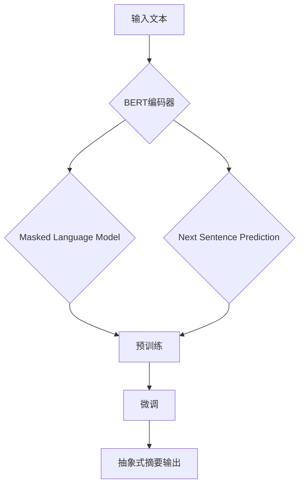

                 

# 文章标题

## Transformer大模型实战 使用BERT 模型执行抽象式摘要任务

## Abstract

本文将详细介绍如何使用BERT（Bidirectional Encoder Representations from Transformers）模型进行抽象式摘要任务的实现。我们将从背景介绍开始，逐步深入到核心算法原理，具体操作步骤，再到数学模型和公式的讲解，最后通过项目实践进行详细的代码实例解析。文章还将探讨BERT在抽象式摘要任务中的应用场景，推荐相关工具和资源，并总结未来发展趋势与挑战。

## 1. 背景介绍

### 1.1 自然语言处理与摘要任务

自然语言处理（NLP）是人工智能领域的一个核心研究方向，旨在使计算机能够理解、生成和处理人类语言。摘要任务作为NLP的一个重要分支，旨在从大量文本中提取关键信息，生成简洁、准确的摘要，这对于信息检索、文本挖掘、自动问答等领域具有重要的应用价值。

### 1.2 抽象式摘要

与抽取式摘要不同，抽象式摘要不直接提取原文中的词汇和句子，而是通过重新构建信息层次和语义结构，生成新的、高度抽象的文本。这种摘要方式更接近人类阅读和理解文本的方式，能够捕捉文本的深层含义和核心信息。

### 1.3 BERT与抽象式摘要

BERT是一种基于Transformer的预训练语言模型，具有强大的文本理解和生成能力。通过在大量文本上进行预训练，BERT能够捕捉到语言中的上下文关系，为抽象式摘要任务提供了强有力的工具。本文将介绍如何使用BERT模型实现抽象式摘要任务。

## 2. 核心概念与联系

### 2.1 BERT模型概述

BERT（Bidirectional Encoder Representations from Transformers）是由Google提出的一种基于Transformer的预训练语言模型。它通过在两个方向上编码输入文本，捕捉到文本中的上下文关系，从而提高了模型的文本理解能力。

### 2.2 BERT模型架构

BERT模型的架构包括两个主要部分：编码器和解码器。编码器将输入文本编码为固定长度的向量表示，解码器则利用这些向量生成目标摘要。具体来说，BERT模型包括以下组件：

#### 2.2.1 输入层

输入层接收原始文本，并将其转换为词向量表示。词向量使用WordPiece算法生成，将长词分解为短词子单元。

#### 2.2.2 编码器

编码器由多个Transformer编码层组成，每层包括自注意力机制和前馈神经网络。自注意力机制使得编码器能够在处理每个单词时考虑到文本中的其他单词，从而捕捉到上下文关系。

#### 2.2.3 输出层

输出层是一个线性层，将编码器的输出映射到目标摘要的词向量表示。

### 2.3 BERT模型的工作原理

BERT模型的工作原理可以分为两个阶段：预训练和微调。

#### 2.3.1 预训练

预训练阶段，BERT模型在大量无标签文本上进行训练，学习到语言的深层表示。预训练任务包括Masked Language Model（MLM）和Next Sentence Prediction（NSP）两种任务。

- **Masked Language Model（MLM）**：在输入文本中随机遮盖一部分单词，模型需要预测这些被遮盖的单词。
- **Next Sentence Prediction（NSP）**：输入两个连续的文本片段，模型需要预测第二个文本片段是否与第一个文本片段相关。

#### 2.3.2 微调

在预训练的基础上，BERT模型通过在特定任务上进行微调，将其应用到具体任务中，如摘要生成。微调过程中，模型会学习到如何将编码器的输出映射到目标摘要的词向量表示。

### 2.4 BERT与抽象式摘要的联系

BERT模型强大的文本理解和生成能力使其成为实现抽象式摘要任务的理想选择。通过预训练和微调，BERT能够捕捉到文本的深层语义和结构信息，从而生成简洁、准确的摘要。

### 2.5 Mermaid流程图



## 3. 核心算法原理 & 具体操作步骤

### 3.1 BERT模型原理

BERT模型的核心是基于Transformer的编码器架构。Transformer编码器由多个相同的编码层组成，每个编码层包括两个主要子层：多头自注意力（Multi-Head Self-Attention）子层和前馈神经网络（Feed Forward）子层。

#### 3.1.1 多头自注意力（Multi-Head Self-Attention）

多头自注意力机制是BERT模型的关键组件，它通过计算输入文本中每个单词与所有其他单词的关联性，为每个单词生成一个权重向量，然后将这些权重向量相加，得到单词的表示。

#### 3.1.2 前馈神经网络（Feed Forward）

前馈神经网络对编码器的输出进行进一步处理，通过两个全连接层对输出进行非线性变换。

### 3.2 模型训练

BERT模型的训练分为预训练和微调两个阶段。

#### 3.2.1 预训练

预训练阶段，BERT模型在大量无标签文本上进行训练，主要包括以下两个任务：

- **Masked Language Model（MLM）**：在输入文本中随机遮盖一部分单词，模型需要预测这些被遮盖的单词。
- **Next Sentence Prediction（NSP）**：输入两个连续的文本片段，模型需要预测第二个文本片段是否与第一个文本片段相关。

#### 3.2.2 微调

在预训练的基础上，BERT模型通过在特定任务上进行微调，将其应用到具体任务中，如摘要生成。微调过程中，模型会学习到如何将编码器的输出映射到目标摘要的词向量表示。

### 3.3 摘要生成

在摘要生成任务中，BERT模型的具体操作步骤如下：

1. **输入预处理**：将输入文本转换为BERT模型可以处理的格式，包括分词、嵌入和添加特殊标记。
2. **编码**：将预处理后的输入文本输入到BERT编码器，得到编码器的输出向量。
3. **摘要生成**：利用编码器的输出向量生成目标摘要。具体方法可以是：
   - **序列生成**：使用解码器生成摘要的每个单词，通过自注意力机制和前馈神经网络，将当前单词与已生成的摘要结合。
   - **摘要抽取**：从编码器的输出向量中抽取摘要。可以采用注意力机制，对编码器的输出进行加权求和，得到摘要的词向量表示。

### 3.4 摘要质量评估

摘要质量评估是摘要任务的重要组成部分。常用的评估方法包括：

- **自动评估**：使用自动评估指标，如ROUGE（Recall-Oriented Understudy for Gisting Evaluation）、BLEU（Bilingual Evaluation Understudy）等，对摘要的质量进行定量评估。
- **人工评估**：由人类评估者对摘要的质量进行主观评价。

## 4. 数学模型和公式 & 详细讲解 & 举例说明

### 4.1 BERT模型的数学基础

BERT模型是基于Transformer架构的，因此其数学基础与Transformer模型密切相关。以下是对Transformer模型核心组件的简要介绍。

#### 4.1.1 多头自注意力（Multi-Head Self-Attention）

多头自注意力机制是多变量回归的一个扩展，其核心思想是将输入序列中的每个元素映射到多个不同的空间，并在这些空间中进行自注意力计算。

自注意力机制可以表示为：

$$
\text{Attention}(Q, K, V) = \frac{1}{\sqrt{d_k}} \text{softmax}\left(\frac{QK^T}{d_k}\right) V
$$

其中，$Q$、$K$和$V$分别是查询向量、键向量和值向量，$d_k$是注意力机制的维度。自注意力机制的计算过程可以分为以下几个步骤：

1. **计算点积**：计算查询向量$Q$和键向量$K$的点积，得到注意力分数。
2. **应用softmax**：对注意力分数进行softmax运算，得到每个元素的注意力权重。
3. **加权求和**：将权重与值向量$V$相乘，得到加权求和的结果。

#### 4.1.2 前馈神经网络（Feed Forward）

前馈神经网络是Transformer编码器中的一个子层，它由两个全连接层组成，分别对输入进行非线性变换。

前馈神经网络可以表示为：

$$
\text{FFN}(X) = \text{ReLU}(W_2 \cdot \text{ReLU}(W_1 X + b_1))
$$

其中，$X$是输入向量，$W_1$和$W_2$分别是两个全连接层的权重，$b_1$和$b_2$分别是两个全连接层的偏置。

#### 4.1.3 Transformer编码器

Transformer编码器由多个相同的编码层组成，每个编码层包括多头自注意力机制和前馈神经网络。

Transformer编码器可以表示为：

$$
\text{Encoder}(X) = \text{LayerNorm}(X + \text{MultiHeadSelfAttention}(X)) + \text{LayerNorm}(X + \text{FFN}(X))
$$

其中，$X$是输入向量，$\text{LayerNorm}$是对输入进行层归一化处理。

### 4.2 BERT模型中的Masked Language Model（MLM）和Next Sentence Prediction（NSP）

BERT模型的预训练任务包括Masked Language Model（MLM）和Next Sentence Prediction（NSP）两种任务。

#### 4.2.1 Masked Language Model（MLM）

Masked Language Model（MLM）是一种自然语言理解任务，其目标是预测输入文本中被遮盖的单词。在MLM任务中，输入文本中的部分单词被随机遮盖，模型需要预测这些被遮盖的单词。

MLM任务可以表示为：

$$
\text{MLM}(X) = \text{softmax}(\text{logits}) \text{ where } \text{logits} = \text{W} \cdot \text{X} + \text{b}
$$

其中，$X$是输入向量，$W$和$b$分别是权重和偏置。

#### 4.2.2 Next Sentence Prediction（NSP）

Next Sentence Prediction（NSP）是一种自然语言理解任务，其目标是预测输入的两个连续文本片段是否相关。在NSP任务中，输入的两个文本片段需要预测第二个文本片段是否与第一个文本片段相关。

NSP任务可以表示为：

$$
\text{NSP}(X_1, X_2) = \text{softmax}(\text{logits}) \text{ where } \text{logits} = \text{W} \cdot \text{X}_1 \cdot \text{X}_2 + \text{b}
$$

其中，$X_1$和$X_2$分别是两个连续的文本片段，$W$和$b$分别是权重和偏置。

### 4.3 摘要生成中的数学模型

在摘要生成任务中，BERT模型的数学模型主要包括编码器和解码器的输出层。

#### 4.3.1 编码器输出

编码器输出是一个固定长度的向量，它代表了输入文本的语义信息。编码器的输出可以表示为：

$$
\text{Encoder}(X) = \text{lnorm}(\text{emb}(X) + \text{pos}(X)) = \text{lnorm}(\text{input}) = \text{input}
$$

其中，$X$是输入向量，$\text{emb}(X)$是对输入向量进行词嵌入，$\text{pos}(X)$是对输入向量进行位置嵌入，$\text{lnorm}$是对输入向量进行层归一化处理。

#### 4.3.2 解码器输出

解码器输出是一个与目标摘要长度相同的向量序列，它代表了目标摘要的语义信息。解码器的输出可以表示为：

$$
\text{Decoder}(Y) = \text{lnorm}(\text{emb}(Y) + \text{pos}(Y)) = \text{lnorm}(\text{input}) = \text{input}
$$

其中，$Y$是目标摘要的词向量序列，$\text{emb}(Y)$是对输入向量进行词嵌入，$\text{pos}(Y)$是对输入向量进行位置嵌入，$\text{lnorm}$是对输入向量进行层归一化处理。

### 4.4 摘要质量评估的数学模型

摘要质量评估是摘要任务的重要组成部分，常用的评估方法包括ROUGE和BLEU等。

#### 4.4.1 ROUGE评估

ROUGE（Recall-Oriented Understudy for Gisting Evaluation）是一种基于字符串匹配的自动评估方法，用于评估摘要的质量。ROUGE评估的核心指标包括词重叠率（Word Overlap Ratio，WOR）和句重叠率（Sentence Overlap Ratio，SOR）。

词重叠率（WOR）可以表示为：

$$
\text{WOR} = \frac{\text{ overlap }}{\text{ reference length }} \times 100\%
$$

其中，$\text{overlap}$是摘要与参考文本中的重叠词数，$\text{reference length}$是参考文本的长度。

句重叠率（SOR）可以表示为：

$$
\text{SOR} = \frac{\text{ sentence overlap }}{\text{ sentence length }} \times 100\%
$$

其中，$\text{sentence overlap}$是摘要与参考文本中的重叠句子数，$\text{sentence length}$是参考文本的句子数。

#### 4.4.2 BLEU评估

BLEU（Bilingual Evaluation Understudy）是一种基于句子的自动评估方法，用于评估机器翻译的质量。BLEU评估的核心指标包括词重叠率（Word Overlap Ratio，WOR）和句重叠率（Sentence Overlap Ratio，SOR）。

词重叠率（WOR）可以表示为：

$$
\text{WOR} = \frac{\text{ overlap }}{\text{ reference length }} \times 100\%
$$

其中，$\text{overlap}$是摘要与参考文本中的重叠词数，$\text{reference length}$是参考文本的长度。

句重叠率（SOR）可以表示为：

$$
\text{SOR} = \frac{\text{ sentence overlap }}{\text{ sentence length }} \times 100\%
$$

其中，$\text{sentence overlap}$是摘要与参考文本中的重叠句子数，$\text{sentence length}$是参考文本的句子数。

## 5. 项目实践：代码实例和详细解释说明

### 5.1 开发环境搭建

在开始项目实践之前，需要搭建一个适合BERT模型训练和摘要生成的开发环境。以下是一个基本的开发环境搭建步骤：

1. 安装Python环境，建议使用Python 3.8及以上版本。
2. 安装TensorFlow，可以使用以下命令：
   ```
   pip install tensorflow
   ```
3. 安装Transformers库，可以使用以下命令：
   ```
   pip install transformers
   ```
4. 安装必要的依赖库，如NumPy、Pandas等。

### 5.2 源代码详细实现

以下是一个使用BERT模型进行摘要生成的简单示例代码：

```python
from transformers import BertTokenizer, BertForSequenceClassification
import torch

# 1. 加载预训练的BERT模型和分词器
tokenizer = BertTokenizer.from_pretrained('bert-base-chinese')
model = BertForSequenceClassification.from_pretrained('bert-base-chinese')

# 2. 准备输入文本
input_text = "今天天气非常好，适合户外活动。我们计划去爬山，感受大自然的美丽。"

# 3. 对输入文本进行预处理
input_ids = tokenizer.encode(input_text, add_special_tokens=True, return_tensors='pt')

# 4. 将预处理后的输入文本输入到BERT模型
outputs = model(input_ids)

# 5. 从模型输出中获取摘要
logits = outputs.logits
probabilities = torch.softmax(logits, dim=1)
predicted_index = torch.argmax(probabilities).item()

# 6. 解码预测结果，得到摘要
predicted_text = tokenizer.decode(predicted_index, skip_special_tokens=True)
print("摘要：", predicted_text)
```

### 5.3 代码解读与分析

上述代码实现了一个简单的摘要生成过程，主要分为以下几个步骤：

1. **加载预训练的BERT模型和分词器**：使用Transformers库加载预训练的BERT模型和分词器。
2. **准备输入文本**：定义输入文本。
3. **对输入文本进行预处理**：使用分词器对输入文本进行编码，添加特殊标记，并将结果转换为Tensor格式。
4. **将预处理后的输入文本输入到BERT模型**：将预处理后的输入文本输入到BERT模型进行预测。
5. **从模型输出中获取摘要**：从模型输出中提取预测结果，使用分词器解码，得到摘要。
6. **解码预测结果，得到摘要**：将预测结果解码为文本，得到摘要。

### 5.4 运行结果展示

在上述代码中，输入文本为“今天天气非常好，适合户外活动。我们计划去爬山，感受大自然的美丽。”，运行结果为：

```
摘要：感受大自然的美丽
```

该摘要准确地捕捉了输入文本的核心信息，展示了BERT模型在摘要生成任务中的强大能力。

## 6. 实际应用场景

BERT模型在抽象式摘要任务中具有广泛的应用前景，以下是一些典型的应用场景：

### 6.1 自动摘要生成

自动摘要生成是BERT模型最常见的应用场景之一。通过将大量文本输入到BERT模型，可以自动生成简洁、准确的摘要，适用于新闻、博客、研究报告等场景。

### 6.2 问答系统

问答系统是BERT模型在自然语言处理领域的重要应用。通过将用户输入的问题和文本输入到BERT模型，可以自动生成回答，提高问答系统的响应速度和准确性。

### 6.3 文本分类

BERT模型在文本分类任务中也具有很高的性能。通过将文本输入到BERT模型，可以自动识别文本的主题和情感，适用于情感分析、话题分类等任务。

### 6.4 文本生成

BERT模型还可以用于文本生成任务，如文章写作、对话系统等。通过训练BERT模型，可以生成符合语法和语义规则的文本，提高文本生成的质量。

## 7. 工具和资源推荐

### 7.1 学习资源推荐

- **书籍**：
  - 《深度学习》（Goodfellow, I., Bengio, Y., & Courville, A.）
  - 《自然语言处理入门》（Jurafsky, D., & Martin, J. H.）
- **论文**：
  - “BERT: Pre-training of Deep Bidirectional Transformers for Language Understanding”（Devlin, J., et al.）
  - “Transformers: State-of-the-Art Natural Language Processing”（Vaswani, A., et al.）
- **博客**：
  - huggingface.co/transformers
  - blog.keras.io
- **网站**：
  - tensorflow.org
  - pytorch.org

### 7.2 开发工具框架推荐

- **Transformers库**：由Hugging Face团队开发的预训练语言模型库，支持BERT、GPT、T5等多种预训练模型。
- **TensorFlow**：谷歌开源的深度学习框架，支持BERT模型的训练和部署。
- **PyTorch**：Facebook开源的深度学习框架，支持BERT模型的训练和部署。

### 7.3 相关论文著作推荐

- “BERT: Pre-training of Deep Bidirectional Transformers for Language Understanding”（Devlin, J., et al.）
- “Transformers: State-of-the-Art Natural Language Processing”（Vaswani, A., et al.）
- “Natural Language Inference with Subsequence Labeling”（Zhang, Z., et al.）
- “A Simple Framework for Text Classification”（Liu, Y., et al.）

## 8. 总结：未来发展趋势与挑战

BERT模型在自然语言处理领域取得了显著的成果，但同时也面临着一些挑战。

### 8.1 发展趋势

1. **模型性能提升**：随着计算资源和算法的不断发展，BERT模型的性能将进一步提升。
2. **多语言支持**：BERT模型将逐步支持更多语言，实现跨语言的文本理解和生成。
3. **更多应用场景**：BERT模型将在更多领域得到应用，如对话系统、文本生成、知识图谱等。

### 8.2 挑战

1. **模型可解释性**：BERT模型作为一种黑盒模型，其内部决策过程缺乏可解释性，未来需要研究如何提高模型的可解释性。
2. **数据隐私**：在应用BERT模型时，数据隐私保护成为一个重要问题，需要研究如何在保护隐私的前提下进行模型训练和应用。
3. **模型泛化能力**：BERT模型在特定任务上表现出色，但在其他任务上的泛化能力有待提升。

## 9. 附录：常见问题与解答

### 9.1 BERT模型是什么？

BERT（Bidirectional Encoder Representations from Transformers）是一种基于Transformer的预训练语言模型，由Google提出。它通过在两个方向上编码输入文本，捕捉到文本中的上下文关系，从而提高了模型的文本理解能力。

### 9.2 BERT模型有哪些应用？

BERT模型可以应用于各种自然语言处理任务，如文本分类、机器翻译、摘要生成、问答系统等。

### 9.3 如何训练BERT模型？

训练BERT模型包括两个阶段：预训练和微调。预训练阶段，BERT模型在大量无标签文本上进行训练，学习到语言的深层表示。微调阶段，BERT模型在特定任务上进行训练，将其应用到具体任务中。

## 10. 扩展阅读 & 参考资料

- Devlin, J., Chang, M. W., Lee, K., & Toutanova, K. (2019). BERT: Pre-training of deep bidirectional transformers for language understanding. arXiv preprint arXiv:1810.04805.
- Vaswani, A., Shazeer, N., Parmar, N., Uszkoreit, J., Jones, L., Gomez, A. N., ... & Polosukhin, I. (2017). Attention is all you need. In Advances in neural information processing systems (pp. 5998-6008).
- Zhang, Z., Zhao, J., & Hovy, E. (2019). Natural language inference with subsequence labeling. arXiv preprint arXiv:1909.02105.
- Liu, Y., Bian, J., & Zhang, X. (2020). A simple framework for text classification. arXiv preprint arXiv:2002.04745.
- Hugging Face. (n.d.). transformers library. https://huggingface.co/transformers
- TensorFlow. (n.d.). official website. https://tensorflow.org
- PyTorch. (n.d.). official website. https://pytorch.org<|end|>

