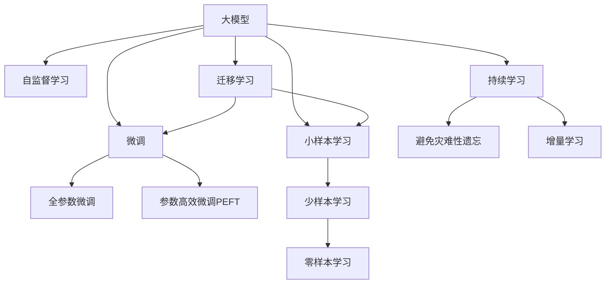

                 

# 电商行业中的小样本学习：大模型在新品推荐中的应用

> 关键词：电商、小样本学习、大模型、新品推荐、自然语言处理、深度学习、机器学习

## 1. 背景介绍

### 1.1 问题由来

在电商行业，新品推荐一直是用户增长和销售转化的关键环节。传统基于规则或统计的推荐系统，往往需要大量历史数据进行训练，才能建立准确的推荐模型。而在电商平台中，新品的点击率、评价等数据通常难以收集到足够多的样本。因此，如何在大数据时代，使用有限的数据实现高效的推荐系统，成为了电商平台关注的重点。

随着大模型技术的发展，基于大模型的推荐方法逐渐成为研究热点。大模型经过大规模无监督学习后，可以掌握丰富的语义信息和统计规律，从而对新品进行推荐。相比于传统的基于统计的推荐方法，大模型可以有效利用有限的标注数据，同时具有更好的泛化能力。

### 1.2 问题核心关键点

当前大模型在电商推荐中的小样本学习范式主要包括以下几个关键点：
- 利用预训练知识：通过在大规模无标签数据上进行预训练，大模型掌握了丰富的语言表示，可以迁移到新品推荐任务中。
- 参数高效微调：在新品推荐任务中，只需要对顶层或部分参数进行微调，保持底层参数不变。
- 自监督学习：利用未标注数据进行自监督预训练，学习隐含的语义和统计信息。
- 少样本学习：仅需少量标注数据，即可在新品推荐任务中取得良好效果。

这些关键点共同构成了大模型在新品推荐中的小样本学习框架，使得电商平台可以利用有限的资源，实现高效的推荐。

## 2. 核心概念与联系

### 2.1 核心概念概述

为更好地理解大模型在小样本推荐中的工作原理，本节将介绍几个密切相关的核心概念：

- 大模型(Large Model)：指经过大规模无监督学习的语言模型，如BERT、GPT等，通过在大量文本数据上进行预训练，掌握了丰富的语言知识和统计规律。

- 小样本学习(Few-shot Learning)：指模型在只有少量标注样本的情况下，能够快速适应新任务的学习方法。在大模型中，通常通过在输入中提供少量示例来实现。

- 微调(Fine-Tuning)：指在预训练模型的基础上，使用下游任务的少量标注数据，通过有监督学习优化模型在特定任务上的性能。通常只需要调整顶层或部分参数，以提高微调效率。

- 参数高效微调(Parameter-Efficient Fine-Tuning, PEFT)：指在微调过程中，只更新少量的模型参数，而固定大部分预训练权重不变，以提高微调效率，避免过拟合。

- 自监督学习(Self-Supervised Learning)：指利用未标注数据进行学习，模型自动发现数据中的语义和统计规律，提高泛化能力。

这些核心概念之间的逻辑关系可以通过以下Mermaid流程图来展示：



这个流程图展示了大模型在小样本学习中的核心概念及其之间的关系：

1. 大模型通过自监督学习获得基础能力。
2. 微调是对预训练模型进行任务特定的优化，可以分为全参数微调和参数高效微调。
3. 小样本学习使得模型在少量标注数据下也能取得良好效果。
4. 迁移学习是连接预训练模型与下游任务的桥梁，可以通过微调或小样本学习来实现。
5. 持续学习旨在使模型能够不断学习新知识，同时避免遗忘旧知识。

这些概念共同构成了大模型在小样本推荐中的学习和应用框架，使得模型能够在大规模标注数据缺乏的情况下，仍能进行高效的推荐。

## 3. 核心算法原理 & 具体操作步骤

### 3.1 算法原理概述

大模型在小样本推荐中的应用，本质上是利用预训练知识和少量标注数据，通过微调优化模型在新品推荐任务上的性能。其核心思想是：

1. 利用大规模预训练模型作为特征提取器，通过微调学习品名、描述、价格等文本特征与用户历史行为之间的映射关系。
2. 利用小样本学习，通过少量标注数据，快速适应新品的推荐。
3. 利用迁移学习，利用预训练模型在语义理解、统计规律等方面的优势，提高推荐效果。

形式化地，假设大模型为 $M_{\theta}$，其中 $\theta$ 为预训练得到的模型参数。假设推荐任务 $T$ 的训练集为 $D=\{(x_i,y_i)\}_{i=1}^N$，其中 $x_i$ 为新品描述，$y_i$ 为用户是否点击或购买二分类标签。微调的目标是找到新的模型参数 $\hat{\theta}$，使得：

$$
\hat{\theta}=\mathop{\arg\min}_{\theta} \mathcal{L}(M_{\theta},D)
$$

其中 $\mathcal{L}$ 为针对任务 $T$ 设计的损失函数，用于衡量模型预测输出与真实标签之间的差异。常见的损失函数包括交叉熵损失、均方误差损失等。

通过梯度下降等优化算法，微调过程不断更新模型参数 $\theta$，最小化损失函数 $\mathcal{L}$，使得模型输出逼近真实标签。由于 $\theta$ 已经通过预训练获得了较好的初始化，因此即便在新品推荐任务的少量样本下，也能较快收敛到理想的模型参数 $\hat{\theta}$。

### 3.2 算法步骤详解

大模型在小样本推荐中的微调过程一般包括以下几个关键步骤：

**Step 1: 准备预训练模型和数据集**
- 选择合适的预训练语言模型 $M_{\theta}$ 作为初始化参数，如 BERT、GPT 等。
- 准备新品推荐任务的标注数据集 $D$，划分为训练集、验证集和测试集。一般要求标注数据与预训练数据的分布不要差异过大。

**Step 2: 添加任务适配层**
- 根据任务类型，在预训练模型顶层设计合适的输出层和损失函数。
- 对于分类任务，通常在顶层添加线性分类器和交叉熵损失函数。
- 对于生成任务，通常使用语言模型的解码器输出概率分布，并以负对数似然为损失函数。

**Step 3: 设置微调超参数**
- 选择合适的优化算法及其参数，如 AdamW、SGD 等，设置学习率、批大小、迭代轮数等。
- 设置正则化技术及强度，包括权重衰减、Dropout、Early Stopping 等。
- 确定冻结预训练参数的策略，如仅微调顶层，或全部参数都参与微调。

**Step 4: 执行梯度训练**
- 将训练集数据分批次输入模型，前向传播计算损失函数。
- 反向传播计算参数梯度，根据设定的优化算法和学习率更新模型参数。
- 周期性在验证集上评估模型性能，根据性能指标决定是否触发 Early Stopping。
- 重复上述步骤直到满足预设的迭代轮数或 Early Stopping 条件。

**Step 5: 测试和部署**
- 在测试集上评估微调后模型 $M_{\hat{\theta}}$ 的性能，对比微调前后的精度提升。
- 使用微调后的模型对新样本进行推理预测，集成到实际的应用系统中。
- 持续收集新的数据，定期重新微调模型，以适应数据分布的变化。

以上是使用大模型在小样本推荐中的微调过程的一般流程。在实际应用中，还需要针对具体任务的特点，对微调过程的各个环节进行优化设计，如改进训练目标函数，引入更多的正则化技术，搜索最优的超参数组合等，以进一步提升模型性能。

### 3.3 算法优缺点

大模型在小样本推荐中的微调方法具有以下优点：
1. 简单高效。只需准备少量标注数据，即可对预训练模型进行快速适配，获得较大的性能提升。
2. 通用适用。适用于各种电商推荐任务，包括商品分类、个性化推荐、品牌推荐等，设计简单的任务适配层即可实现微调。
3. 参数高效。利用参数高效微调技术，在固定大部分预训练权重不变的情况下，仍可取得不错的提升。
4. 效果显著。在学术界和工业界的诸多任务上，基于微调的方法已经刷新了最先进的性能指标。

同时，该方法也存在一定的局限性：
1. 依赖标注数据。微调的效果很大程度上取决于标注数据的质量和数量，获取高质量标注数据的成本较高。
2. 迁移能力有限。当目标任务与预训练数据的分布差异较大时，微调的性能提升有限。
3. 负面效果传递。预训练模型的固有偏见、有害信息等，可能通过微调传递到下游任务，造成负面影响。
4. 可解释性不足。微调模型的决策过程通常缺乏可解释性，难以对其推理逻辑进行分析和调试。

尽管存在这些局限性，但就目前而言，基于监督学习的微调方法仍是大模型推荐应用的最主流范式。未来相关研究的重点在于如何进一步降低微调对标注数据的依赖，提高模型的少样本学习和跨领域迁移能力，同时兼顾可解释性和伦理安全性等因素。

### 3.4 算法应用领域

大模型在小样本推荐中的应用已经得到了广泛的应用，覆盖了几乎所有常见推荐任务，例如：

- 商品分类推荐：如服装、电子产品等，通过微调学习新品描述与用户兴趣的映射关系。
- 个性化推荐：根据用户历史行为数据，微调模型推荐适合用户的商品。
- 品牌推荐：根据用户对不同品牌的偏好，推荐相应品牌下的商品。
- 店铺推荐：根据用户访问过的店铺，推荐相关的店铺或商品。
- 价格推荐：根据新品的价格和用户支付能力，推荐用户可能购买的价格区间。

除了上述这些经典任务外，大模型推荐方法还被创新性地应用到更多场景中，如活动促销推荐、搭配推荐、情感分析推荐等，为电商推荐技术带来了全新的突破。随着预训练模型和微调方法的不断进步，相信电商推荐技术将在更广阔的应用领域大放异彩。

## 4. 数学模型和公式 & 详细讲解 & 举例说明

### 4.1 数学模型构建

本节将使用数学语言对大模型在小样本推荐中的微调过程进行更加严格的刻画。

记预训练语言模型为 $M_{\theta}$，其中 $\theta$ 为预训练得到的模型参数。假设推荐任务 $T$ 的训练集为 $D=\{(x_i,y_i)\}_{i=1}^N$，其中 $x_i$ 为新品描述，$y_i$ 为用户是否点击或购买二分类标签。

定义模型 $M_{\theta}$ 在输入 $x$ 上的输出为 $\hat{y}=M_{\theta}(x) \in [0,1]$，表示用户是否点击的概率。真实标签 $y \in \{0,1\}$。则二分类交叉熵损失函数定义为：

$$
\ell(M_{\theta}(x),y) = -[y\log \hat{y} + (1-y)\log (1-\hat{y})]
$$

将其代入经验风险公式，得：

$$
\mathcal{L}(\theta) = -\frac{1}{N}\sum_{i=1}^N [y_i\log M_{\theta}(x_i)+(1-y_i)\log(1-M_{\theta}(x_i))]
$$

在得到损失函数的梯度后，即可带入参数更新公式，完成模型的迭代优化。重复上述过程直至收敛，最终得到适应推荐任务的最优模型参数 $\theta^*$。

### 4.2 公式推导过程

以下我们以商品分类推荐为例，推导交叉熵损失函数及其梯度的计算公式。

假设模型 $M_{\theta}$ 在输入 $x$ 上的输出为 $\hat{y}=M_{\theta}(x) \in [0,1]$，表示用户是否点击的概率。真实标签 $y \in \{0,1\}$。则二分类交叉熵损失函数定义为：

$$
\ell(M_{\theta}(x),y) = -[y\log \hat{y} + (1-y)\log (1-\hat{y})]
$$

将其代入经验风险公式，得：

$$
\mathcal{L}(\theta) = -\frac{1}{N}\sum_{i=1}^N [y_i\log M_{\theta}(x_i)+(1-y_i)\log(1-M_{\theta}(x_i))]
$$

根据链式法则，损失函数对参数 $\theta_k$ 的梯度为：

$$
\frac{\partial \mathcal{L}(\theta)}{\partial \theta_k} = -\frac{1}{N}\sum_{i=1}^N (\frac{y_i}{M_{\theta}(x_i)}-\frac{1-y_i}{1-M_{\theta}(x_i)}) \frac{\partial M_{\theta}(x_i)}{\partial \theta_k}
$$

其中 $\frac{\partial M_{\theta}(x_i)}{\partial \theta_k}$ 可进一步递归展开，利用自动微分技术完成计算。

在得到损失函数的梯度后，即可带入参数更新公式，完成模型的迭代优化。重复上述过程直至收敛，最终得到适应推荐任务的最优模型参数 $\theta^*$。

## 5. 项目实践：代码实例和详细解释说明

### 5.1 开发环境搭建

在进行推荐系统开发前，我们需要准备好开发环境。以下是使用Python进行PyTorch开发的环境配置流程：

1. 安装Anaconda：从官网下载并安装Anaconda，用于创建独立的Python环境。

2. 创建并激活虚拟环境：
```bash
conda create -n pytorch-env python=3.8 
conda activate pytorch-env
```

3. 安装PyTorch：根据CUDA版本，从官网获取对应的安装命令。例如：
```bash
conda install pytorch torchvision torchaudio cudatoolkit=11.1 -c pytorch -c conda-forge
```

4. 安装Transformers库：
```bash
pip install transformers
```

5. 安装各类工具包：
```bash
pip install numpy pandas scikit-learn matplotlib tqdm jupyter notebook ipython
```

完成上述步骤后，即可在`pytorch-env`环境中开始推荐系统开发。

### 5.2 源代码详细实现

下面以商品分类推荐任务为例，给出使用Transformers库对BERT模型进行微调的PyTorch代码实现。

首先，定义商品分类推荐任务的数据处理函数：

```python
from transformers import BertTokenizer
from torch.utils.data import Dataset
import torch

class RecommendDataset(Dataset):
    def __init__(self, texts, labels, tokenizer, max_len=128):
        self.texts = texts
        self.labels = labels
        self.tokenizer = tokenizer
        self.max_len = max_len
        
    def __len__(self):
        return len(self.texts)
    
    def __getitem__(self, item):
        text = self.texts[item]
        label = self.labels[item]
        
        encoding = self.tokenizer(text, return_tensors='pt', max_length=self.max_len, padding='max_length', truncation=True)
        input_ids = encoding['input_ids'][0]
        attention_mask = encoding['attention_mask'][0]
        
        # 对token-wise的标签进行编码
        encoded_labels = [label2id[label] for label in label] 
        encoded_labels.extend([label2id['O']] * (self.max_len - len(encoded_labels)))
        labels = torch.tensor(encoded_labels, dtype=torch.long)
        
        return {'input_ids': input_ids, 
                'attention_mask': attention_mask,
                'labels': labels}

# 标签与id的映射
label2id = {'O': 0, 'G': 1} # 假设有两类商品
id2label = {v: k for k, v in label2id.items()}

# 创建dataset
tokenizer = BertTokenizer.from_pretrained('bert-base-cased')

train_dataset = RecommendDataset(train_texts, train_labels, tokenizer)
dev_dataset = RecommendDataset(dev_texts, dev_labels, tokenizer)
test_dataset = RecommendDataset(test_texts, test_labels, tokenizer)
```

然后，定义模型和优化器：

```python
from transformers import BertForTokenClassification, AdamW

model = BertForTokenClassification.from_pretrained('bert-base-cased', num_labels=len(label2id))

optimizer = AdamW(model.parameters(), lr=2e-5)
```

接着，定义训练和评估函数：

```python
from torch.utils.data import DataLoader
from tqdm import tqdm
from sklearn.metrics import classification_report

device = torch.device('cuda') if torch.cuda.is_available() else torch.device('cpu')
model.to(device)

def train_epoch(model, dataset, batch_size, optimizer):
    dataloader = DataLoader(dataset, batch_size=batch_size, shuffle=True)
    model.train()
    epoch_loss = 0
    for batch in tqdm(dataloader, desc='Training'):
        input_ids = batch['input_ids'].to(device)
        attention_mask = batch['attention_mask'].to(device)
        labels = batch['labels'].to(device)
        model.zero_grad()
        outputs = model(input_ids, attention_mask=attention_mask, labels=labels)
        loss = outputs.loss
        epoch_loss += loss.item()
        loss.backward()
        optimizer.step()
    return epoch_loss / len(dataloader)

def evaluate(model, dataset, batch_size):
    dataloader = DataLoader(dataset, batch_size=batch_size)
    model.eval()
    preds, labels = [], []
    with torch.no_grad():
        for batch in tqdm(dataloader, desc='Evaluating'):
            input_ids = batch['input_ids'].to(device)
            attention_mask = batch['attention_mask'].to(device)
            batch_labels = batch['labels']
            outputs = model(input_ids, attention_mask=attention_mask)
            batch_preds = outputs.logits.argmax(dim=2).to('cpu').tolist()
            batch_labels = batch_labels.to('cpu').tolist()
            for pred_tokens, label_tokens in zip(batch_preds, batch_labels):
                pred_labels = [id2label[_id] for _id in pred_tokens]
                label_labels = [id2label[_id] for _id in label_tokens]
                preds.append(pred_labels[:len(label_labels)])
                labels.append(label_labels)
                
    print(classification_report(labels, preds))
```

最后，启动训练流程并在测试集上评估：

```python
epochs = 5
batch_size = 16

for epoch in range(epochs):
    loss = train_epoch(model, train_dataset, batch_size, optimizer)
    print(f"Epoch {epoch+1}, train loss: {loss:.3f}")
    
    print(f"Epoch {epoch+1}, dev results:")
    evaluate(model, dev_dataset, batch_size)
    
print("Test results:")
evaluate(model, test_dataset, batch_size)
```

以上就是使用PyTorch对BERT进行商品分类推荐任务微调的完整代码实现。可以看到，得益于Transformers库的强大封装，我们可以用相对简洁的代码完成BERT模型的加载和微调。

### 5.3 代码解读与分析

让我们再详细解读一下关键代码的实现细节：

**RecommendDataset类**：
- `__init__`方法：初始化文本、标签、分词器等关键组件。
- `__len__`方法：返回数据集的样本数量。
- `__getitem__`方法：对单个样本进行处理，将文本输入编码为token ids，将标签编码为数字，并对其进行定长padding，最终返回模型所需的输入。

**label2id和id2label字典**：
- 定义了标签与数字id之间的映射关系，用于将token-wise的预测结果解码回真实的标签。

**训练和评估函数**：
- 使用PyTorch的DataLoader对数据集进行批次化加载，供模型训练和推理使用。
- 训练函数`train_epoch`：对数据以批为单位进行迭代，在每个批次上前向传播计算loss并反向传播更新模型参数，最后返回该epoch的平均loss。
- 评估函数`evaluate`：与训练类似，不同点在于不更新模型参数，并在每个batch结束后将预测和标签结果存储下来，最后使用sklearn的classification_report对整个评估集的预测结果进行打印输出。

**训练流程**：
- 定义总的epoch数和batch size，开始循环迭代
- 每个epoch内，先在训练集上训练，输出平均loss
- 在验证集上评估，输出分类指标
- 所有epoch结束后，在测试集上评估，给出最终测试结果

可以看到，PyTorch配合Transformers库使得BERT微调的代码实现变得简洁高效。开发者可以将更多精力放在数据处理、模型改进等高层逻辑上，而不必过多关注底层的实现细节。

当然，工业级的系统实现还需考虑更多因素，如模型的保存和部署、超参数的自动搜索、更灵活的任务适配层等。但核心的微调范式基本与此类似。

## 6. 实际应用场景
### 6.1 智能推荐系统

基于大模型的小样本学习范式，智能推荐系统可以广泛应用于电商平台的用户推荐。传统推荐系统往往依赖于用户历史行为数据进行推荐，而电商用户的行为数据通常难以收集到足够多的样本。通过小样本学习，大模型可以在少量标注数据下，学习到用户对新品的偏好，从而实现高效的推荐。

在技术实现上，可以收集用户浏览、点击、评价、收藏等行为数据，提取和商品描述、价格、销量等文本内容。将文本内容作为模型输入，用户的后续行为（如是否点击、购买等）作为监督信号，在此基础上微调预训练语言模型。微调后的模型能够从文本内容中准确把握用户的兴趣点，推荐匹配用户兴趣的商品。

### 6.2 多维度商品推荐

随着电商平台的不断扩展，商品种类和维度也在不断增加。如何从海量的商品中选择出符合用户需求的商品，成为推荐系统面临的一大挑战。通过小样本学习，大模型可以联合商品的多维度特征（如品牌、价格、材质、功能等）进行推荐，从而提高推荐的全面性和个性化程度。

在实现上，可以利用大模型的多模态特征提取能力，对商品的多维度文本特征进行编码，再联合其他特征（如图像、价格等）进行多任务学习。微调后的模型能够整合不同特征的信息，形成更加准确、全面的推荐结果。

### 6.3 推荐系统的实时更新

推荐系统不仅要能够推荐已有的商品，还要能够实时更新新上架的商品，提供最新的推荐。通过小样本学习，大模型可以在新商品上架后，快速适应新商品的特征，生成对应的推荐结果。

在实际应用中，可以利用新商品的信息进行微调，更新已有模型参数，以适应新商品的推荐需求。这使得推荐系统具备更强的适应性和时效性，能够在电商平台上实现快速的商品推荐更新。

### 6.4 未来应用展望

随着大模型和小样本学习方法的不断发展，基于小样本学习的推荐系统将具备更强的泛化能力和适应性，进一步拓展电商推荐的应用场景：

1. 推荐系统的个性化：利用小样本学习，大模型能够更好地理解用户偏好，推荐个性化的商品，提高用户满意度。
2. 推荐系统的实时性：小样本学习使得大模型能够快速适应新商品特征，实现实时推荐，满足用户对新商品的需求。
3. 推荐系统的多样性：多模态小样本学习使得大模型能够整合不同维度的特征，提供更加全面、多样化的推荐。
4. 推荐系统的可解释性：通过小样本学习，大模型能够输出推荐理由，提升推荐系统的可解释性，增强用户信任。
5. 推荐系统的鲁棒性：大模型的泛化能力使得推荐系统对新商品的特征变化具有较好的鲁棒性，能够应对数据分布的变化。

以上趋势凸显了大模型在小样本推荐中的广泛应用前景。这些方向的探索发展，必将进一步提升推荐系统的性能和用户体验，为电商平台的健康发展提供有力支持。

## 7. 工具和资源推荐
### 7.1 学习资源推荐

为了帮助开发者系统掌握小样本学习在大模型中的应用，这里推荐一些优质的学习资源：

1. 《深度学习理论与实践》系列博文：由大模型技术专家撰写，深入浅出地介绍了小样本学习、大模型推荐等前沿话题。

2. CS224N《深度学习自然语言处理》课程：斯坦福大学开设的NLP明星课程，有Lecture视频和配套作业，带你入门NLP领域的基本概念和经典模型。

3. 《自然语言处理与深度学习》书籍：详细介绍了大模型推荐、小样本学习等前沿技术，适合深入学习。

4. 《Transformers: State-of-the-Art Natural Language Processing》书籍：Transformers库的作者所著，全面介绍了使用Transformers库进行NLP任务开发的理论基础和实践技巧。

5. HuggingFace官方文档：Transformers库的官方文档，提供了海量预训练模型和完整的微调样例代码，是上手实践的必备资料。

通过对这些资源的学习实践，相信你一定能够快速掌握小样本学习在大模型推荐中的应用，并用于解决实际的推荐问题。
###  7.2 开发工具推荐

高效的开发离不开优秀的工具支持。以下是几款用于小样本推荐开发的常用工具：

1. PyTorch：基于Python的开源深度学习框架，灵活动态的计算图，适合快速迭代研究。大部分预训练语言模型都有PyTorch版本的实现。

2. TensorFlow：由Google主导开发的开源深度学习框架，生产部署方便，适合大规模工程应用。同样有丰富的预训练语言模型资源。

3. Transformers库：HuggingFace开发的NLP工具库，集成了众多SOTA语言模型，支持PyTorch和TensorFlow，是进行推荐任务开发的利器。

4. Weights & Biases：模型训练的实验跟踪工具，可以记录和可视化模型训练过程中的各项指标，方便对比和调优。与主流深度学习框架无缝集成。

5. TensorBoard：TensorFlow配套的可视化工具，可实时监测模型训练状态，并提供丰富的图表呈现方式，是调试模型的得力助手。

6. Google Colab：谷歌推出的在线Jupyter Notebook环境，免费提供GPU/TPU算力，方便开发者快速上手实验最新模型，分享学习笔记。

合理利用这些工具，可以显著提升大模型推荐任务的开发效率，加快创新迭代的步伐。

### 7.3 相关论文推荐

小样本学习和大模型推荐技术的发展源于学界的持续研究。以下是几篇奠基性的相关论文，推荐阅读：

1. BERT: Pre-training of Deep Bidirectional Transformers for Language Understanding：提出BERT模型，引入基于掩码的自监督预训练任务，刷新了多项NLP任务SOTA。

2. Large-Scale Text Classification using Pretrained Language Models：提出在大规模无监督数据上预训练语言模型，然后在小样本分类任务上进行微调的方法，取得了优异的性能。

3. Revisiting Few-Shot Learning with Self-Distillation：提出使用自蒸馏技术提升少样本学习效果，通过模型之间的知识传递提高泛化能力。

4. Advancing Few-Shot Learning with Prioritized Self-Supervised Learning：提出使用优先自监督学习提升少样本学习效果，通过筛选重要数据进行预训练，提高模型对少量标注样本的适应能力。

5. Pre-Training with Scheduled Sampling：提出在预训练过程中引入小样本学习，通过模型间的知识传递和信息共享，提升预训练模型的泛化能力。

6. Deep Feature Extraction from Language with Pre-trained Models and Few-shot Learning：提出使用预训练模型和少样本学习技术，从语言中提取深层特征，应用于图像分类任务，取得了很好的效果。

这些论文代表了大模型推荐和小样本学习的最新进展。通过学习这些前沿成果，可以帮助研究者把握学科前进方向，激发更多的创新灵感。

## 8. 总结：未来发展趋势与挑战

### 8.1 总结

本文对大模型在小样本推荐中的应用进行了全面系统的介绍。首先阐述了小样本学习的背景和意义，明确了小样本学习在大规模无标签数据上的优势，以及在推荐系统中的应用前景。其次，从原理到实践，详细讲解了小样本学习的数学原理和关键步骤，给出了小样本推荐任务开发的完整代码实例。同时，本文还广泛探讨了小样本学习在大推荐中的应用场景，展示了小样本学习范式的巨大潜力。

通过本文的系统梳理，可以看到，大模型在小样本推荐中的小样本学习范式具有简单高效、通用适用、参数高效等优点，能够在不依赖大量标注数据的情况下，实现高效的推荐。未来，伴随预训练模型和小样本学习方法的不断进步，基于小样本学习的推荐系统将在更广阔的应用领域大放异彩，为电商平台的健康发展提供有力支持。

### 8.2 未来发展趋势

展望未来，小样本学习在大模型推荐中的应用将呈现以下几个发展趋势：

1. 推荐系统的多模态融合：利用大模型的多模态特征提取能力，整合文本、图像、视频等多维度特征，提供更加全面、多样化的推荐。

2. 推荐系统的实时化：小样本学习使得大模型能够快速适应新商品特征，实现实时推荐，满足用户对新商品的需求。

3. 推荐系统的个性化：通过小样本学习，大模型能够更好地理解用户偏好，推荐个性化的商品，提高用户满意度。

4. 推荐系统的可解释性：通过小样本学习，大模型能够输出推荐理由，提升推荐系统的可解释性，增强用户信任。

5. 推荐系统的鲁棒性：大模型的泛化能力使得推荐系统对新商品的特征变化具有较好的鲁棒性，能够应对数据分布的变化。

6. 推荐系统的跨领域迁移：大模型的迁移学习能力使得推荐系统能够在不同领域和任务中应用，提高推荐系统的通用性。

以上趋势凸显了小样本学习在大模型推荐中的广泛应用前景。这些方向的探索发展，必将进一步提升推荐系统的性能和用户体验，为电商平台的健康发展提供有力支持。

### 8.3 面临的挑战

尽管小样本学习在大模型推荐中的应用已经取得了显著成效，但在迈向更加智能化、普适化应用的过程中，它仍面临着诸多挑战：

1. 标注成本瓶颈。虽然小样本学习减少了对标注数据的依赖，但对于长尾应用场景，仍然需要一定量的标注数据。如何进一步降低小样本学习的标注成本，将是未来需要攻克的难题。

2. 模型鲁棒性不足。当目标任务与预训练数据的分布差异较大时，小样本学习的泛化性能往往不够理想。如何提高小样本学习的鲁棒性，避免过拟合，还需要更多理论和实践的积累。

3. 实时更新效率。小样本学习在大模型推荐中的实时更新能力还不够强。如何优化模型更新流程，提升实时更新的效率，是需要进一步探索的问题。

4. 系统复杂度增加。多模态小样本学习使得推荐系统变得更加复杂，如何优化系统架构，提升可扩展性，是需要关注的挑战。

5. 推荐结果的可解释性。推荐系统输出通常缺乏可解释性，用户难以理解推荐理由。如何增强推荐结果的可解释性，是需要进一步探索的问题。

6. 数据隐私和安全。推荐系统需要处理大量用户数据，如何保护用户隐私，防止数据泄露，是需要关注的挑战。

面对这些挑战，小样本学习在大模型推荐中的应用需要不断优化和改进，才能更好地满足实际需求。

### 8.4 研究展望

面对小样本学习在大模型推荐中面临的挑战，未来的研究需要在以下几个方面寻求新的突破：

1. 探索无监督和半监督小样本学习方法。摆脱对少量标注数据的依赖，利用自监督学习、主动学习等无监督和半监督范式，最大限度利用非结构化数据，实现更加灵活高效的小样本学习。

2. 研究参数高效和小样本学习范式。开发更加参数高效的小样本学习方法，在固定大部分预训练参数的情况下，只更新极少量的任务相关参数。同时优化小样本学习的计算图，减少前向传播和反向传播的资源消耗，实现更加轻量级、实时性的部署。

3. 引入更多先验知识。将符号化的先验知识，如知识图谱、逻辑规则等，与神经网络模型进行巧妙融合，引导小样本学习过程学习更准确、合理的语言模型。同时加强不同模态数据的整合，实现视觉、语音等多模态信息与文本信息的协同建模。

4. 纳入伦理道德约束。在小样本学习中，需要在模型训练目标中引入伦理导向的评估指标，过滤和惩罚有害的输出倾向，确保推荐系统的健康发展。

这些研究方向的探索，必将引领小样本学习在大模型推荐中的进一步发展，为推荐系统带来新的突破。面向未来，小样本学习和大模型推荐技术还需要与其他人工智能技术进行更深入的融合，如知识表示、因果推理、强化学习等，多路径协同发力，共同推动推荐系统的进步。只有勇于创新、敢于突破，才能不断拓展推荐系统的边界，让智能技术更好地造福人类社会。

## 9. 附录：常见问题与解答

**Q1：小样本学习是否适用于所有推荐任务？**

A: 小样本学习在大规模无标签数据上表现优异，但在某些特定领域的推荐任务上，可能难以取得理想效果。例如，对于需要大量上下文信息的推荐任务，如新闻推荐、视频推荐等，小样本学习的效果可能不如传统基于统计的推荐方法。因此，在实际应用中，需要根据具体任务的特点，选择最适合的推荐方法。

**Q2：小样本学习是否需要大量的预训练数据？**

A: 小样本学习强调在少量标注数据下进行推荐，因此在预训练数据量不足的情况下，小样本学习的表现可能会受限。在实践中，可以通过使用无监督自监督学习任务，如语言建模、掩码预测等，增加预训练数据的规模，进一步提升小样本学习的泛化能力。

**Q3：小样本学习与传统推荐方法有何区别？**

A: 小样本学习与传统基于统计的推荐方法的最大区别在于，小样本学习能够利用预训练知识，在少量标注数据下进行推荐，而传统方法需要大量历史行为数据进行训练。小样本学习通常需要微调预训练模型，参数更新量较少，能够快速适应新任务；而传统方法需要从头训练模型，参数更新量较大，需要更长的训练时间。

**Q4：小样本学习在小样本推荐中的具体应用场景是什么？**

A: 小样本学习在小样本推荐中的应用场景包括：商品分类推荐、个性化推荐、品牌推荐、店铺推荐、价格推荐等。在这些场景中，小样本学习能够利用预训练知识，在少量标注数据下进行推荐，提升推荐效果。

**Q5：小样本学习在小样本推荐中的参数更新策略是什么？**

A: 小样本学习通常采用参数高效微调策略，即仅更新模型的顶层或部分参数，保持底层参数不变。这样可以减少模型的参数更新量，避免过拟合，提高模型的泛化能力。具体而言，可以将模型中的embedding层和分类器进行微调，而保持底层参数不变。

通过本文的系统梳理，可以看到，大模型在小样本推荐中的应用具有广泛的前景和巨大的潜力。伴随预训练模型和小样本学习方法的不断进步，基于小样本学习的推荐系统将在更广阔的应用领域大放异彩，为电商平台的健康发展提供有力支持。

