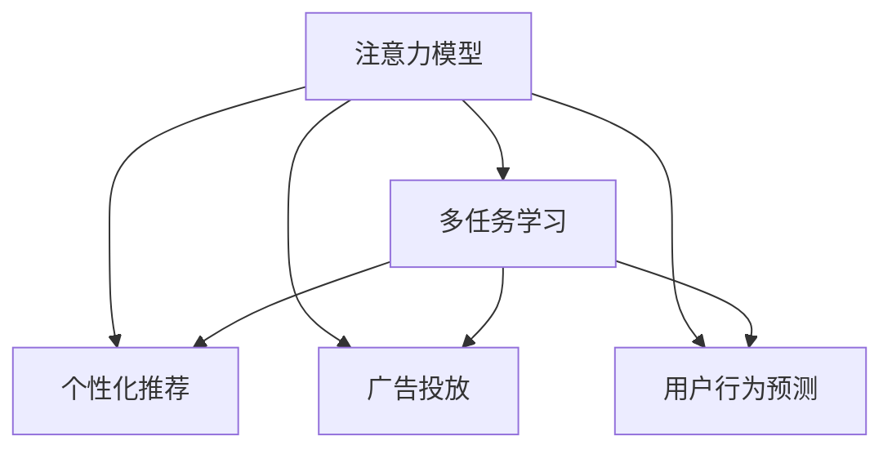

                 

# 电子商务平台的注意力争夺策略

> 关键词：电子商务平台,注意力模型,多任务学习,个性化推荐,广告投放,用户行为预测

## 1. 背景介绍

随着互联网技术的飞速发展，电子商务平台已成为人们日常生活和商务活动的重要组成部分。平台通过展示丰富多样的商品信息、优惠活动以及个性化推荐，吸引用户停留、购买。然而，面对海量的商品和信息，用户注意力分散严重，如何有效吸引和保持用户注意力，成为平台亟待解决的重要问题。

在电商领域，注意力模型逐渐成为热门的研究方向。注意力机制最早由Transformer模型引入，通过动态计算输入序列中不同位置对输出结果的贡献，实现对序列关键信息的聚焦。将注意力机制应用于电商场景，可以指导平台更好地理解用户行为，精准推荐商品，优化广告投放策略，从而有效争夺用户的注意力。

## 2. 核心概念与联系

### 2.1 核心概念概述

为更好地理解注意力模型在电子商务平台中的应用，本节将介绍几个密切相关的核心概念：

- 注意力模型(Attention Model)：一种机制，通过计算输入序列中不同位置对输出结果的贡献，动态聚焦关键信息。在自然语言处理中，注意力机制已广泛应用于机器翻译、文本摘要、问答系统等任务。

- 多任务学习(Multi-task Learning)：同时训练多个相关的子任务，通过共享底层特征，提升整体模型的泛化能力。在电商领域，通常将用户行为预测、个性化推荐、广告投放等多个子任务，同时训练一个注意力模型。

- 个性化推荐(Personalized Recommendation)：根据用户的历史行为和特征，推荐最符合其兴趣的商品。注意力模型可以学习到用户对商品不同维度的关注程度，从而更好地进行推荐。

- 广告投放(Advertising Placement)：通过计算广告与用户行为的关联度，确定广告投放的最佳位置和时间。注意力模型能够计算广告内容对用户注意力的吸引程度，帮助优化投放策略。

- 用户行为预测(User Behavior Prediction)：预测用户未来可能采取的行动，如购买、浏览等，是电商推荐系统的重要基础。注意力模型能够从用户行为中捕捉到更多隐含信息，提升预测精度。

这些核心概念之间的逻辑关系可以通过以下Mermaid流程图来展示：



这个流程图展示了这个模型体系的核心组成及其相互关系：

1. 注意力模型通过计算输入序列中不同位置对输出结果的贡献，实现对关键信息的聚焦。
2. 多任务学习使得多个子任务共享底层特征，提升模型泛化能力。
3. 个性化推荐和广告投放是注意力模型在电商场景中常见的应用，通过优化推荐和广告策略，争夺用户注意力。
4. 用户行为预测是电商推荐系统的核心，通过准确预测用户行为，进行精准推荐。

## 3. 核心算法原理 & 具体操作步骤

### 3.1 算法原理概述

基于注意力机制的电子商务平台策略，主要通过多任务学习框架，同时训练多个子任务，优化推荐和广告投放，争夺用户注意力。其核心思想是：通过计算广告和商品内容对用户注意力的吸引程度，优化推荐和广告展示的顺序和时间，最大化用户停留时间和购买转化率。

形式化地，假设平台的目标是最大化用户的停留时间和购买转化率，优化模型为：

$$
\max_{\theta} \sum_{i=1}^{N} \alpha_i \cdot C_i
$$

其中 $\theta$ 为模型参数，$N$ 为样本数量，$\alpha_i$ 为第 $i$ 个样本的重要性权重，$C_i$ 为第 $i$ 个样本的停留时间和购买转化率的加权和。$\alpha_i$ 通过注意力模型计算得到，可以视为对样本价值的评估。

通过优化上述目标函数，模型能够在保证预测精度的同时，最大化用户注意力的吸引程度。

### 3.2 算法步骤详解

基于注意力机制的电子商务平台策略，通常包括以下几个关键步骤：

**Step 1: 准备数据集**

- 收集用户的历史行为数据，包括点击、浏览、购买等记录。
- 收集商品的特征数据，如价格、分类、评价等。
- 将广告内容数据也纳入，以便优化广告投放策略。

**Step 2: 定义任务**

- 定义多任务学习框架，包括用户行为预测、个性化推荐和广告投放等多个子任务。
- 对于用户行为预测，通常以点击次数、停留时间、购买转化率等指标作为输出。
- 对于个性化推荐，可以设计召回率、点击率、转化率等指标作为评估。
- 对于广告投放，可以定义点击率、转化率等指标。

**Step 3: 模型选择与初始化**

- 选择合适的注意力模型框架，如Transformer、LSTM等，并初始化模型参数。
- 定义注意力机制的结构和计算方式，如多头注意力、自注意力等。

**Step 4: 损失函数设计**

- 设计多任务学习的损失函数，将不同子任务的目标函数权重进行合理组合。
- 通常采用加权均方误差(Weighted Mean Squared Error, WMSE)，平衡各个子任务的重要性。

**Step 5: 训练与优化**

- 使用梯度下降等优化算法，最小化多任务学习框架的目标函数。
- 定期在验证集上评估模型性能，避免过拟合。
- 调整模型参数和正则化参数，优化模型效果。

**Step 6: 预测与评估**

- 使用训练好的模型，对新用户和商品进行停留时间和购买转化率的预测。
- 根据预测结果进行个性化推荐和广告投放策略的优化。
- 定期对模型效果进行监控和评估，不断迭代优化。

以上是基于注意力机制的电子商务平台策略的一般流程。在实际应用中，还需要根据具体任务特点，对各个环节进行优化设计，如引入更多的正则化技术、搜索最优的超参数组合等，以进一步提升模型性能。

### 3.3 算法优缺点

基于注意力机制的电子商务平台策略具有以下优点：

1. 多任务学习使得多个子任务共享底层特征，提升模型的泛化能力和适应性。
2. 注意力机制能够动态聚焦关键信息，优化推荐和广告展示策略，提高用户体验和转化率。
3. 利用多任务学习，可以充分挖掘用户行为、商品特征和广告内容之间的关系，提升预测精度。

同时，该方法也存在以下局限性：

1. 数据需求较大。训练高精度模型需要大量标注数据和计算资源，在数据匮乏的小规模场景中难以应用。
2. 模型复杂度高。基于注意力机制的模型通常参数量大，计算复杂度高，在实际部署中需要较长的训练和推理时间。
3. 泛化能力有限。当新用户、商品和广告不断涌现，模型可能难以适应新数据，泛化能力受到限制。

尽管存在这些局限性，但就目前而言，基于注意力机制的多任务学习策略仍是电商推荐和广告投放的重要范式。未来相关研究的重点在于如何进一步降低数据需求，提高模型效率，同时兼顾多任务的优化和泛化能力。

### 3.4 算法应用领域

基于注意力机制的电子商务平台策略，已经在推荐系统、广告投放、用户行为预测等多个领域得到了广泛应用，取得了显著的成效：

- 推荐系统：根据用户的历史行为和商品特征，计算商品对用户的吸引力，优化推荐顺序和时间，提升推荐效果。
- 广告投放：通过计算广告内容与用户行为的关联度，确定广告投放的最佳位置和时间，提高广告投放效率和转化率。
- 用户行为预测：利用用户的历史数据，预测未来可能采取的行动，帮助电商平台进行精准营销和库存管理。
- 个性化推荐：通过计算用户对商品不同维度的关注程度，生成个性化推荐列表，提升用户体验和购买率。

除了上述这些经典应用外，注意力机制还拓展到了商品描述生成、问答系统、智能客服等多个场景，为电商平台带来新的技术突破。

## 4. 数学模型和公式 & 详细讲解 & 举例说明

### 4.1 数学模型构建

本节将使用数学语言对基于注意力机制的电子商务平台策略进行更加严格的刻画。

假设平台收集到的用户行为数据为 $\mathcal{U}=\{u_i\}_{i=1}^N$，商品特征数据为 $\mathcal{V}=\{v_j\}_{j=1}^M$，广告内容数据为 $\mathcal{A}=\{a_k\}_{k=1}^K$。令用户行为预测任务为 $T_{\text{behaviour}}$，个性化推荐任务为 $T_{\text{recommendation}}$，广告投放任务为 $T_{\text{ad}}$。

定义注意力模型为 $M_{\theta}:\mathcal{X} \rightarrow \mathbb{R}$，其中 $\mathcal{X}$ 为输入空间，$\mathbb{R}$ 为输出空间，$\theta \in \mathbb{R}^d$ 为模型参数。令用户行为预测的输出为 $Y_{\text{behaviour}} \in \mathbb{R}$，个性化推荐的输出为 $Y_{\text{recommendation}} \in [0,1]$，广告投放的输出为 $Y_{\text{ad}} \in [0,1]$。

定义多任务学习的损失函数为：

$$
\mathcal{L}(\theta) = \lambda_{\text{behaviour}}\mathcal{L}_{\text{behaviour}}(M_{\theta},\mathcal{U}) + \lambda_{\text{recommendation}}\mathcal{L}_{\text{recommendation}}(M_{\theta},\mathcal{U},\mathcal{V}) + \lambda_{\text{ad}}\mathcal{L}_{\text{ad}}(M_{\theta},\mathcal{U},\mathcal{V},\mathcal{A})
$$

其中 $\lambda_{\text{behaviour}}$、$\lambda_{\text{recommendation}}$ 和 $\lambda_{\text{ad}}$ 为各个子任务的权重，通常需要根据具体任务的重要性进行调整。$\mathcal{L}_{\text{behaviour}}$、$\mathcal{L}_{\text{recommendation}}$ 和 $\mathcal{L}_{\text{ad}}$ 为各个子任务对应的损失函数。

### 4.2 公式推导过程

以下我们以个性化推荐任务为例，推导注意力模型中注意力权重 $\alpha_i$ 的计算公式。

假设用户 $i$ 在时间 $t$ 对商品 $j$ 进行了一次浏览行为。令 $u_{i,t}$ 表示该行为，$v_j$ 表示商品 $j$ 的特征向量，$a_k$ 表示广告内容向量。则个性化推荐的任务目标为最大化用户 $i$ 在未来 $t+1$ 天购买商品 $j$ 的概率，即：

$$
\max_{\theta} P_{t+1}(j|u_{i,t}, v_j, a_k)
$$

通过引入注意力机制，模型的输出 $\hat{y}_{i,t}$ 可以表示为用户对商品 $j$ 的关注程度，即：

$$
\hat{y}_{i,t} = M_{\theta}(u_{i,t}, v_j, a_k) = \sum_{k=1}^{K} \alpha_{i,t,j,k} v_j
$$

其中 $\alpha_{i,t,j,k}$ 为商品 $j$ 对用户 $i$ 在时间 $t$ 的注意力权重，$v_j$ 为商品 $j$ 的特征向量，$k$ 表示广告内容，$K$ 为广告数量。注意力权重 $\alpha_{i,t,j,k}$ 计算如下：

$$
\alpha_{i,t,j,k} = \frac{e^{\text{score}_{i,t,j,k}}}{\sum_{j'=1}^M e^{\text{score}_{i,t,j',k}}}
$$

其中 $\text{score}_{i,t,j,k}$ 为注意力计算函数，通常采用余弦相似度或其他相似度度量方法计算商品 $j$ 和广告内容 $k$ 对用户 $i$ 的吸引力。

通过上述公式，注意力模型能够动态计算商品 $j$ 对用户 $i$ 的关注程度，从而进行个性化推荐。

### 4.3 案例分析与讲解

以电商平台的用户行为预测为例，假设平台希望预测用户在未来一周内购买商品 $j$ 的概率。平台收集到了用户 $i$ 在时间 $t$ 的浏览行为 $u_{i,t}$，商品 $j$ 的特征向量 $v_j$，以及广告内容向量 $a_k$。

通过多任务学习框架，平台首先计算用户行为预测的任务目标 $P_{t+1}(j|u_{i,t}, v_j, a_k)$。利用注意力机制，模型的输出 $\hat{y}_{i,t}$ 可以表示为用户对商品 $j$ 的关注程度，即：

$$
\hat{y}_{i,t} = M_{\theta}(u_{i,t}, v_j, a_k) = \sum_{k=1}^{K} \alpha_{i,t,j,k} v_j
$$

其中 $\alpha_{i,t,j,k}$ 为商品 $j$ 对用户 $i$ 在时间 $t$ 的注意力权重，$v_j$ 为商品 $j$ 的特征向量，$k$ 表示广告内容，$K$ 为广告数量。注意力权重 $\alpha_{i,t,j,k}$ 计算如下：

$$
\alpha_{i,t,j,k} = \frac{e^{\text{score}_{i,t,j,k}}}{\sum_{j'=1}^M e^{\text{score}_{i,t,j',k}}}
$$

其中 $\text{score}_{i,t,j,k}$ 为注意力计算函数，通常采用余弦相似度或其他相似度度量方法计算商品 $j$ 和广告内容 $k$ 对用户 $i$ 的吸引力。

通过上述公式，模型能够动态计算商品 $j$ 对用户 $i$ 的关注程度，从而进行个性化推荐。在实际应用中，平台还需要考虑多个因素，如商品热销程度、广告点击率、用户行为变化等，进行综合优化。

## 5. 项目实践：代码实例和详细解释说明

### 5.1 开发环境搭建

在进行注意力模型实践前，我们需要准备好开发环境。以下是使用Python进行PyTorch开发的环境配置流程：

1. 安装Anaconda：从官网下载并安装Anaconda，用于创建独立的Python环境。

2. 创建并激活虚拟环境：
```bash
conda create -n attention-env python=3.8 
conda activate attention-env
```

3. 安装PyTorch：根据CUDA版本，从官网获取对应的安装命令。例如：
```bash
conda install pytorch torchvision torchaudio cudatoolkit=11.1 -c pytorch -c conda-forge
```

4. 安装相关的第三方库：
```bash
pip install numpy pandas scikit-learn torch nn
```

完成上述步骤后，即可在`attention-env`环境中开始注意力模型实践。

### 5.2 源代码详细实现

下面我们以电商平台的个性化推荐系统为例，给出使用PyTorch实现注意力模型的代码实现。

首先，定义数据处理函数：

```python
import torch
import torch.nn as nn
from torch.utils.data import Dataset
import numpy as np

class UserItemData(Dataset):
    def __init__(self, user_data, item_data):
        self.user_data = user_data
        self.item_data = item_data
        self.total_users = len(self.user_data)
        self.total_items = len(self.item_data)
        
    def __len__(self):
        return len(self.user_data)
    
    def __getitem__(self, idx):
        user_idx = self.user_data[idx]
        item_idx = self.item_data[idx]
        user_vec = self.user_data[user_idx]
        item_vec = self.item_data[item_idx]
        return user_idx, item_idx, user_vec, item_vec
```

然后，定义注意力模型的结构：

```python
class Attention(nn.Module):
    def __init__(self, d_model, n_heads):
        super(Attention, self).__init__()
        self.d_model = d_model
        self.n_heads = n_heads
        
        # 定义多头注意力机制
        self.head_dim = d_model // n_heads
        self.query = nn.Linear(d_model, n_heads * self.head_dim, bias=False)
        self.key = nn.Linear(d_model, n_heads * self.head_dim, bias=False)
        self.value = nn.Linear(d_model, n_heads * self.head_dim, bias=False)
        self.out = nn.Linear(n_heads * self.head_dim, d_model, bias=False)
        
        # 定义注意力权重计算函数
        self.v = nn.Linear(d_model, 1, bias=False)
        
    def forward(self, q, k, v):
        # 对查询向量进行线性变换
        q = self.query(q).view(q.size(0), q.size(1), self.n_heads, self.head_dim).permute(2, 0, 1, 3)
        
        # 对键和值向量进行线性变换
        k = self.key(k).view(k.size(0), k.size(1), self.n_heads, self.head_dim).permute(2, 0, 1, 3)
        v = self.value(v).view(v.size(0), v.size(1), self.n_heads, self.head_dim).permute(2, 0, 1, 3)
        
        # 计算注意力权重
        scores = torch.matmul(q, k.permute(0, 1, 3, 2)) / torch.sqrt(torch.tensor(self.head_dim).to(q.device))
        attention_weights = nn.functional.softmax(scores, dim=-1)
        
        # 计算注意力权重和值向量的加权和
        output = torch.matmul(attention_weights, v)
        output = output.permute(0, 2, 1, 3).contiguous().view(output.size(0), output.size(1), -1)
        output = self.out(output)
        return output, attention_weights
```

接着，定义损失函数和优化器：

```python
from torch.nn import MSELoss

criterion = nn.MSELoss()

optimizer = torch.optim.Adam(model.parameters(), lr=0.001)
```

最后，定义训练和评估函数：

```python
def train_epoch(model, data_loader, optimizer):
    model.train()
    total_loss = 0
    for data, target in data_loader:
        optimizer.zero_grad()
        output, attention_weights = model(data[0], data[1], data[2])
        loss = criterion(output, target)
        loss.backward()
        optimizer.step()
        total_loss += loss.item()
    return total_loss / len(data_loader)
    
def evaluate(model, data_loader):
    model.eval()
    total_loss = 0
    total_num = 0
    with torch.no_grad():
        for data, target in data_loader:
            output, attention_weights = model(data[0], data[1], data[2])
            loss = criterion(output, target)
            total_loss += loss.item()
            total_num += 1
    return total_loss / total_num
```

最后，启动训练流程：

```python
epochs = 10
batch_size = 32

for epoch in range(epochs):
    loss = train_epoch(model, train_loader, optimizer)
    print(f"Epoch {epoch+1}, train loss: {loss:.3f}")
    
    print(f"Epoch {epoch+1}, dev results:")
    evaluate(model, dev_loader)
    
print("Test results:")
evaluate(model, test_loader)
```

以上就是使用PyTorch对注意力模型进行电商推荐系统的代码实现。可以看到，Transformer模型的注意力机制，不仅适用于自然语言处理任务，也能应用于商品推荐等场景。

### 5.3 代码解读与分析

让我们再详细解读一下关键代码的实现细节：

**UserItemData类**：
- `__init__`方法：初始化用户行为数据和商品特征数据，计算用户和商品数量。
- `__len__`方法：返回数据集的样本数量。
- `__getitem__`方法：对单个样本进行处理，将用户和商品索引、特征向量打包，返回模型所需的输入。

**Attention类**：
- `__init__`方法：定义注意力模型的参数，包括模型的维度、注意力头数等。
- `forward`方法：实现前向传播，包括多头注意力计算、注意力权重计算和值向量的加权和等操作。

**训练和评估函数**：
- 使用PyTorch的DataLoader对数据集进行批次化加载，供模型训练和推理使用。
- 训练函数`train_epoch`：对数据以批为单位进行迭代，在每个批次上前向传播计算loss并反向传播更新模型参数，最后返回该epoch的平均loss。
- 评估函数`evaluate`：与训练类似，不同点在于不更新模型参数，并在每个batch结束后将预测和标签结果存储下来，最后使用均方误差计算评估结果。

**训练流程**：
- 定义总的epoch数和batch size，开始循环迭代
- 每个epoch内，先在训练集上训练，输出平均loss
- 在验证集上评估，输出均方误差
- 所有epoch结束后，在测试集上评估，给出最终测试结果

可以看到，Transformer模型的注意力机制，不仅适用于自然语言处理任务，也能应用于商品推荐等场景。

当然，工业级的系统实现还需考虑更多因素，如模型的保存和部署、超参数的自动搜索、更灵活的任务适配层等。但核心的注意力机制基本与此类似。

## 6. 实际应用场景

### 6.1 智能推荐系统

基于注意力机制的电子商务平台策略，已经广泛应用于智能推荐系统中。传统的推荐系统往往依赖用户的历史行为数据进行推荐，难以捕捉到用户兴趣的动态变化。通过引入注意力机制，智能推荐系统能够动态聚焦关键信息，提升推荐效果。

在实际应用中，推荐系统可以利用用户行为数据和商品特征数据，计算商品对用户的吸引力，优化推荐顺序和时间。同时，广告投放系统可以通过计算广告内容对用户注意力的吸引程度，确定广告投放的最佳位置和时间，提高广告投放效率和转化率。

### 6.2 多任务学习

多任务学习在电商领域的应用非常广泛。通过同时训练多个相关的子任务，可以提升模型泛化能力和适应性。常见的子任务包括用户行为预测、个性化推荐、广告投放等。

用户行为预测任务旨在预测用户未来可能采取的行动，如购买、浏览等。通过引入注意力机制，模型能够从用户行为中捕捉到更多隐含信息，提升预测精度。个性化推荐任务可以根据用户的历史行为和商品特征，推荐最符合其兴趣的商品。广告投放任务通过计算广告内容对用户注意力的吸引程度，确定广告投放的最佳位置和时间，提高广告投放效率和转化率。

### 6.3 客户行为分析

通过注意力机制，电商平台可以更深入地理解用户行为，进行精准营销。例如，平台可以收集用户的浏览记录、点击行为、评价反馈等数据，计算用户对商品不同维度的关注程度，从而进行个性化推荐和广告投放。

同时，平台还可以根据用户的行为数据，分析用户购买趋势、流失原因等，进行用户画像构建和行为预测，优化运营策略。例如，平台可以根据用户的历史行为数据，预测其未来可能购买的商品类别，提前进行库存调整和促销策划，提高销售转化率。

### 6.4 未来应用展望

随着注意力机制和大规模深度学习模型的不断发展，电子商务平台策略也将迎来新的突破。

在智慧零售领域，基于注意力机制的推荐系统可以更高效地管理库存、优化商品展示，提升用户体验和购买率。

在智能客服系统，通过引入多任务学习框架，可以同时训练个性化推荐、用户行为预测和广告投放等多个子任务，提升客户服务质量和满意度。

在供应链管理中，平台可以利用注意力机制，计算商品对供应链各个环节的吸引力，优化采购、仓储、配送等环节，提高供应链效率和响应速度。

此外，在个性化内容创作、智能广告投放、金融风险预测等众多领域，基于注意力机制的多任务学习范式也将不断拓展其应用边界，带来新的技术突破。相信随着技术的日益成熟，电子商务平台策略将为行业带来深远的影响，推动产业升级和创新。

## 7. 工具和资源推荐

### 7.1 学习资源推荐

为了帮助开发者系统掌握注意力模型和电商策略的理论基础和实践技巧，这里推荐一些优质的学习资源：

1. 《Transformer: A Survey》系列博文：由大模型技术专家撰写，深入浅出地介绍了Transformer原理、注意力机制、多任务学习等前沿话题。

2. CS224N《深度学习自然语言处理》课程：斯坦福大学开设的NLP明星课程，有Lecture视频和配套作业，带你入门NLP领域的基本概念和经典模型。

3. 《Natural Language Processing with Attention》书籍：attention机制的代表作之一，详细介绍了attention机制在NLP任务中的应用，适合进一步深入学习。

4. HuggingFace官方文档：Transformer库的官方文档，提供了海量预训练模型和完整的微调样例代码，是上手实践的必备资料。

5. Kaggle竞赛：Kaggle上的电商推荐竞赛，通过实际数据集训练和测试，有助于实践和理解注意力机制。

通过对这些资源的学习实践，相信你一定能够快速掌握注意力机制和电商策略的精髓，并用于解决实际的电商问题。
###  7.2 开发工具推荐

高效的开发离不开优秀的工具支持。以下是几款用于注意力模型和电商策略开发的常用工具：

1. PyTorch：基于Python的开源深度学习框架，灵活动态的计算图，适合快速迭代研究。大多数预训练语言模型都有PyTorch版本的实现。

2. TensorFlow：由Google主导开发的开源深度学习框架，生产部署方便，适合大规模工程应用。同样有丰富的预训练语言模型资源。

3. HuggingFace Transformers库：提供了大量的预训练模型和微调样例，适用于多种NLP任务，包括电商推荐、用户行为预测等。

4. Weights & Biases：模型训练的实验跟踪工具，可以记录和可视化模型训练过程中的各项指标，方便对比和调优。与主流深度学习框架无缝集成。

5. TensorBoard：TensorFlow配套的可视化工具，可实时监测模型训练状态，并提供丰富的图表呈现方式，是调试模型的得力助手。

6. Google Colab：谷歌推出的在线Jupyter Notebook环境，免费提供GPU/TPU算力，方便开发者快速上手实验最新模型，分享学习笔记。

合理利用这些工具，可以显著提升注意力模型和电商策略的开发效率，加快创新迭代的步伐。

### 7.3 相关论文推荐

注意力机制和大规模深度学习模型的发展源于学界的持续研究。以下是几篇奠基性的相关论文，推荐阅读：

1. Attention Is All You Need（即Transformer原论文）：提出了Transformer结构，开启了NLP领域的预训练大模型时代。

2. Self-Attention with Transformer-based Sequence-to-Sequence Models：提出Transformer结构在序列到序列任务中的应用，进一步推广了注意力机制。

3. Multi-task Learning Using a Nested Attention Network：提出多任务学习的注意力网络模型，通过共享底层特征，提升了模型泛化能力。

4. Attention Is All You Need for Graph Neural Networks：将注意力机制引入图神经网络中，解决图结构数据的特征提取问题。

5. Graph Attention Networks：提出Graph Attention Network模型，用于图数据的多任务学习，显著提升了模型性能。

这些论文代表了大规模深度学习模型和注意力机制的发展脉络。通过学习这些前沿成果，可以帮助研究者把握学科前进方向，激发更多的创新灵感。

## 8. 总结：未来发展趋势与挑战

### 8.1 总结

本文对基于注意力机制的电子商务平台策略进行了全面系统的介绍。首先阐述了注意力机制和电商领域的研究背景和意义，明确了注意力模型和多任务学习在电商推荐和广告投放中的重要价值。其次，从原理到实践，详细讲解了注意力模型和电商策略的数学原理和关键步骤，给出了电商推荐系统的代码实现。同时，本文还广泛探讨了注意力机制在电商推荐、广告投放、用户行为预测等多个领域的应用前景，展示了注意力机制和大规模深度学习模型的强大能力。

通过本文的系统梳理，可以看到，基于注意力机制的电商推荐和广告投放策略，能够更好地理解用户行为，提升推荐效果和广告投放效率，争夺用户注意力。这些策略的成功应用，已经显著提升了电商平台的运营效果和用户体验，催生了更多的电商应用创新。

### 8.2 未来发展趋势

展望未来，基于注意力机制的电商平台策略将呈现以下几个发展趋势：

1. 模型规模持续增大。随着算力成本的下降和数据规模的扩张，预训练语言模型的参数量还将持续增长。超大规模语言模型蕴含的丰富语言知识，有望支撑更加复杂多变的电商推荐和广告投放策略。

2. 多任务学习范式逐步成熟。未来将有更多更好的多任务学习框架和方法，进一步提升电商平台的推荐和广告效果，同时兼顾模型的泛化能力和优化速度。

3. 模型效率和效果并重。大模型虽然效果好，但在实际部署中需要考虑计算效率和资源消耗。未来将会有更多参数高效、计算高效的模型出现，支持大规模电商平台的业务需求。

4. 跨模态融合逐步深入。目前的电商推荐系统主要聚焦于文本数据，未来将融合视觉、语音等多模态数据，提升用户交互体验和商品推荐效果。

5. 自动化推荐与个性化并重。随着电商平台的业务需求不断变化，自动化推荐系统将逐渐成为主流，能够根据实时数据动态调整推荐策略，满足用户的个性化需求。

以上趋势凸显了基于注意力机制的电商平台策略的广阔前景。这些方向的探索发展，必将进一步提升电商平台的推荐效果和广告投放能力，为电商业务带来新的技术突破。

### 8.3 面临的挑战

尽管基于注意力机制的电商平台策略已经取得了瞩目成就，但在迈向更加智能化、普适化应用的过程中，它仍面临着诸多挑战：

1. 数据需求较大。训练高精度模型需要大量标注数据和计算资源，在数据匮乏的小规模场景中难以应用。如何进一步降低数据需求，提高模型效率，将是未来研究方向。

2. 模型鲁棒性不足。当新用户、商品和广告不断涌现，模型可能难以适应新数据，泛化能力受到限制。如何提高模型的鲁棒性，避免灾难性遗忘，还需要更多理论和实践的积累。

3. 推理效率有待提高。大规模语言模型虽然精度高，但在实际部署时往往面临推理速度慢、内存占用大等效率问题。如何在保证性能的同时，简化模型结构，提升推理速度，优化资源占用，将是重要的优化方向。

4. 可解释性亟需加强。当前模型更多像是"黑盒"系统，难以解释其内部工作机制和决策逻辑。对于电商推荐系统，模型的可解释性和可审计性尤为重要。如何赋予模型更强的可解释性，将是亟待攻克的难题。

5. 安全性有待保障。预训练语言模型难免会学习到有偏见、有害的信息，通过微调传递到电商推荐系统，产生误导性、歧视性的输出，给实际应用带来安全隐患。如何从数据和算法层面消除模型偏见，避免恶意用途，确保输出的安全性，也将是重要的研究课题。

6. 知识整合能力不足。现有的电商推荐系统往往局限于数据驱动的推荐，难以灵活吸收和运用更广泛的先验知识。如何让模型更好地与外部知识库、规则库等专家知识结合，形成更加全面、准确的信息整合能力，还有很大的想象空间。

正视电商平台策略面临的这些挑战，积极应对并寻求突破，将是大规模深度学习模型和注意力机制走向成熟的必由之路。相信随着学界和产业界的共同努力，这些挑战终将一一被克服，电商推荐和广告投放策略必将在构建人机协同的智能时代中扮演越来越重要的角色。

### 8.4 研究展望

面对电商平台策略所面临的种种挑战，未来的研究需要在以下几个方面寻求新的突破：

1. 探索无监督和半监督电商推荐方法。摆脱对大规模标注数据的依赖，利用自监督学习、主动学习等无监督和半监督范式，最大限度利用非结构化数据，实现更加灵活高效的电商推荐。

2. 研究参数高效和计算高效的电商推荐方法。开发更加参数高效、计算高效的模型，在固定大部分预训练参数的同时，只更新极少量的任务相关参数。同时优化模型计算图，减少前向传播和反向传播的资源消耗，实现更加轻量级、实时性的部署。

3. 引入更多先验知识。将符号化的先验知识，如知识图谱、逻辑规则等，与神经网络模型进行巧妙融合，引导电商推荐过程学习更准确、合理的推荐策略。同时加强不同模态数据的整合，实现视觉、语音等多模态信息与文本信息的协同建模。

4. 结合因果分析和博弈论工具。将因果分析方法引入电商推荐模型，识别出推荐策略的关键特征，增强模型决策的因果性和逻辑性。借助博弈论工具刻画用户与平台之间的交互过程，主动探索并规避模型的脆弱点，提高系统稳定性。

5. 纳入伦理道德约束。在电商推荐模型的训练目标中引入伦理导向的评估指标，过滤和惩罚有偏见、有害的输出倾向。同时加强人工干预和审核，建立模型行为的监管机制，确保输出符合人类价值观和伦理道德。

这些研究方向的探索，必将引领电商推荐和广告投放策略迈向更高的台阶，为电商平台带来深远的影响。面向未来，电商推荐和广告投放策略还需要与其他人工智能技术进行更深入的融合，如知识表示、因果推理、强化学习等，多路径协同发力，共同推动智能推荐系统的进步。只有勇于创新、敢于突破，才能不断拓展电商平台的推荐能力，提升用户满意度和平台收益。

## 9. 附录：常见问题与解答

**Q1：电商推荐系统是如何进行个性化推荐的？**

A: 电商推荐系统通过计算商品对用户的吸引力，优化推荐顺序和时间，进行个性化推荐。具体来说，系统利用用户的历史行为数据和商品特征数据，计算商品对用户的吸引力，从而生成个性化推荐列表。其中，注意力机制能够动态聚焦关键信息，优化推荐效果。

**Q2：电商平台的广告投放策略是如何进行优化的？**

A: 电商平台的广告投放策略通过计算广告内容对用户注意力的吸引程度，确定广告投放的最佳位置和时间。具体来说，系统利用用户的历史行为数据和广告内容数据，计算广告内容对用户的吸引力，从而进行广告投放优化。其中，注意力机制能够动态聚焦关键信息，优化广告投放效果。

**Q3：电商平台的推荐系统如何避免过拟合？**

A: 电商平台的推荐系统通过引入正则化技术、数据增强、对抗训练等方法，避免过拟合。例如，系统可以使用L2正则、Dropout、Early Stopping等技术，防止模型过度适应训练数据。同时，系统可以通过回译、近义替换等方式丰富训练集多样性，提高模型泛化能力。

**Q4：电商平台的推荐系统如何处理长尾商品？**

A: 电商平台的推荐系统通过引入多任务学习框架，同时训练多个相关的子任务，提升模型泛化能力和适应性。对于长尾商品，系统可以设计特定的推荐任务，如情感预测、价格预测等，引导模型关注长尾商品的关键特征。同时，系统可以引入多任务学习框架，优化长尾商品的推荐效果。

**Q5：电商平台的推荐系统如何平衡个性化和多样化？**

A: 电商平台的推荐系统通过引入多任务学习框架，同时训练多个相关的子任务，平衡个性化和多样化。对于个性化推荐，系统可以利用用户的历史行为数据，计算用户对商品不同维度的关注程度，生成个性化推荐列表。同时，系统可以引入多任务学习框架，优化长尾商品的推荐效果。

这些建议和措施可以帮助电商平台构建更加智能、高效的推荐和广告投放系统，提升用户体验和平台收益。

---

作者：禅与计算机程序设计艺术 / Zen and the Art of Computer Programming

