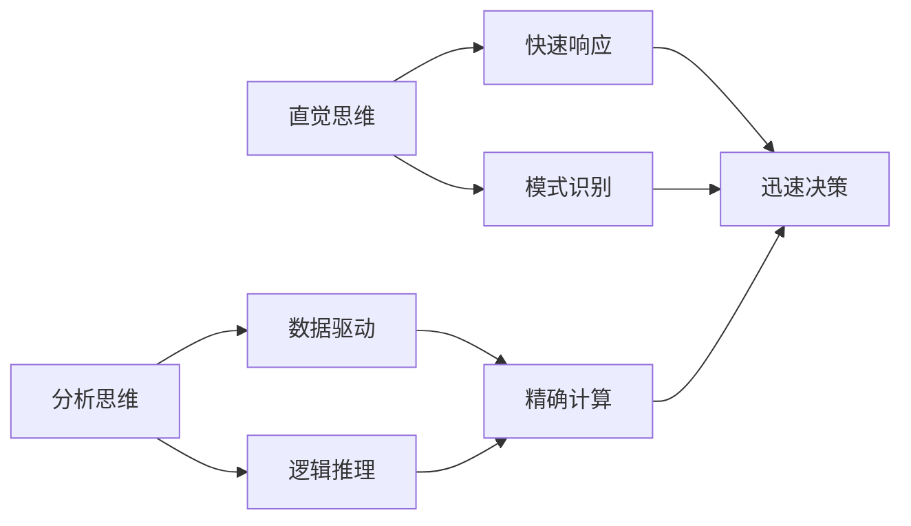

                 

# 直觉vs分析：两种思维模式的博弈

> 关键词：直觉思维,分析思维,决策制定,创新,技术实施,案例分析

## 1. 背景介绍

### 1.1 问题由来

在当今快速变化和信息爆炸的时代，如何高效、准确地做出决策变得尤为重要。然而，面对复杂多变的问题，人们往往面临两个极端的决策模式：直觉思维和分析思维。这两种思维模式在决策过程中各有优劣，本文将详细探讨二者的利弊，并探讨如何合理应用它们，以在实际工作中获得最佳决策效果。

### 1.2 问题核心关键点

- **直觉思维**：依赖于潜意识和经验，快速做出决策。
- **分析思维**：依赖于数据和逻辑推理，经过系统分析后进行决策。

直觉思维和分析思维在实际工作中的应用各有优缺点。理解这两种思维模式，并找到最佳结合点，是本文的核心目标。

### 1.3 问题研究意义

了解和应用直觉思维和分析思维，有助于提升决策的效率和准确性，特别是在技术实施、创新和项目管理等领域。掌握如何结合二者的优势，可以帮助个人和企业更快地响应市场变化，抓住机遇，从而在竞争中脱颖而出。

## 2. 核心概念与联系

### 2.1 核心概念概述

- **直觉思维**：基于经验和感觉，快速做出决策。它依赖于潜意识和模式识别，能够在复杂情况下迅速做出反应。
- **分析思维**：基于逻辑和数据，经过系统分析后进行决策。它依赖于结构和证据，适用于需要精确计算和验证的情况。

以下是一个Mermaid流程图，展示了直觉思维和分析思维之间的关系：



从流程图可以看出，直觉思维和分析思维在决策过程中互相补充。直觉思维提供快速反应和初步判断，而分析思维则通过精确计算和数据验证，进一步优化决策。

## 3. 核心算法原理 & 具体操作步骤

### 3.1 算法原理概述

决策过程中，直觉思维和分析思维的结合需要遵循一定的算法原理。这些原理包括：

- **信息获取与处理**：收集相关信息，通过直觉思维进行初步判断，然后通过分析思维验证和优化。
- **决策模型**：建立决策模型，结合直觉和分析思维，做出最优决策。
- **风险评估**：评估决策风险，通过直觉和分析思维综合考虑不确定性和风险。

### 3.2 算法步骤详解

#### 3.2.1 信息获取与处理

1. **数据收集**：根据决策目标，收集相关的数据和信息。这些信息可能来源于历史数据、市场调研、专家意见等。
2. **直觉判断**：通过直觉思维，对收集的信息进行初步分析，形成初步判断。这一步骤需要依赖决策者的经验和专业知识。
3. **数据验证**：将初步判断与数据进行对比验证，通过分析思维进一步分析，修正初步判断。

#### 3.2.2 决策模型建立

1. **模型选择**：根据决策问题的特点，选择合适的决策模型，如树形决策模型、多属性决策模型等。
2. **参数设置**：根据直觉和分析思维，设定模型的参数，如决策树节点的划分标准、权重系数等。
3. **模型训练**：通过分析思维，训练模型，使其能够根据输入数据做出最优决策。
4. **模型验证**：在验证集上评估模型性能，通过分析思维调整模型参数，提升模型效果。

#### 3.2.3 风险评估

1. **风险识别**：识别潜在的决策风险，包括市场变化、技术挑战、法律风险等。
2. **风险评估**：通过分析思维，评估风险的概率和影响程度，结合直觉思维进行综合判断。
3. **风险应对**：制定风险应对策略，结合直觉和分析思维，选择合适的风险缓解措施。

### 3.3 算法优缺点

#### 3.3.1 优点

- **决策效率高**：直觉思维能够快速做出决策，适用于需要快速反应的场景。
- **灵活性强**：直觉思维依赖于经验和模式识别，能够灵活应对未知情况。
- **系统性分析**：分析思维通过数据和逻辑推理，提供系统性分析和精确计算。
- **可重复性**：分析思维能够形成标准化的决策模型，提高决策的可重复性和可控性。

#### 3.3.2 缺点

- **主观性强**：直觉思维依赖于决策者的经验，可能导致主观性强，影响决策客观性。
- **数据依赖**：分析思维需要大量的数据和计算资源，可能导致决策时间较长。
- **灵活性受限**：分析思维依赖于模型和算法，可能无法灵活应对复杂多变的情况。
- **风险评估不足**：分析思维可能过于关注数据和逻辑，忽略直觉思维中的风险感知。

### 3.4 算法应用领域

直觉思维和分析思维在多个领域都有广泛应用，包括但不限于：

- **项目管理**：在项目规划和执行中，结合直觉思维和分析思维，快速响应变化，优化资源配置。
- **技术实施**：在技术创新和实施中，利用直觉思维快速响应市场需求，通过分析思维验证和优化技术方案。
- **市场决策**：在市场调研和决策中，结合直觉和分析思维，快速评估市场机会，制定战略规划。
- **风险管理**：在风险评估和管理中，结合直觉和分析思维，全面识别和评估风险，制定应对措施。

## 4. 数学模型和公式 & 详细讲解 & 举例说明

### 4.1 数学模型构建

在决策过程中，可以通过数学模型将直觉思维和分析思维结合起来。以下是一个简单的决策树模型：

$$
\text{决策树} = (T, A, R)
$$

- $T$：树形结构，表示决策路径。
- $A$：属性，表示决策节点。
- $R$：结果，表示最终决策。

### 4.2 公式推导过程

假设我们要决策是否投入新项目，可以使用以下决策树模型：

1. **数据收集**：收集项目的成本、收益、风险等相关数据。
2. **直觉判断**：根据直觉思维，初步判断新项目的可行性。
3. **数据验证**：通过分析思维，评估项目的成本和收益，验证直觉判断。

假设成本为 $C$，收益为 $R$，风险为 $S$，根据直觉思维和分析思维，可以构建以下决策树：

```
如果 $C < R$ 且 $S < \alpha$
    投入项目
    |
    决策结果：Yes
```

其中 $\alpha$ 是风险阈值，需要根据决策者的经验和市场情况设定。

### 4.3 案例分析与讲解

假设某公司面临是否投资新市场的决策。根据市场调研和分析，公司收集了市场规模、竞争状况、市场趋势等数据。通过直觉思维，决策者初步判断市场潜力较大，但风险较高。接着，通过分析思维，进一步分析市场趋势、竞争态势和市场潜力，验证直觉判断，并综合考虑风险，做出最终决策。

## 5. 项目实践：代码实例和详细解释说明

### 5.1 开发环境搭建

为了进行决策树模型的实践，需要搭建Python开发环境。具体步骤如下：

1. 安装Python：从官网下载并安装Python，确保版本为3.8及以上。
2. 安装相关库：通过pip安装numpy、pandas、matplotlib等库，用于数据处理和可视化。
3. 搭建环境：使用虚拟环境（如conda）搭建Python开发环境。

### 5.2 源代码详细实现

以下是一个简单的决策树实现，用于帮助公司决策是否投资新市场：

```python
import pandas as pd
import numpy as np
from sklearn.tree import DecisionTreeClassifier
from sklearn.model_selection import train_test_split

# 数据准备
data = pd.read_csv('market_data.csv')
X = data[['市场规模', '竞争状况', '市场趋势']]
y = data['投资决策']
X_train, X_test, y_train, y_test = train_test_split(X, y, test_size=0.2, random_state=42)

# 建立决策树模型
clf = DecisionTreeClassifier(max_depth=3)
clf.fit(X_train, y_train)

# 模型评估
accuracy = clf.score(X_test, y_test)
print('模型准确率：', accuracy)

# 数据可视化
from sklearn.tree import plot_tree
import matplotlib.pyplot as plt

plt.figure(figsize=(10, 8))
plot_tree(clf, filled=True)
plt.show()
```

### 5.3 代码解读与分析

**数据准备**：
- 使用pandas库读取市场数据。
- 将数据分为特征和标签，并进行划分训练集和测试集。

**模型建立**：
- 使用sklearn的DecisionTreeClassifier建立决策树模型。
- 设置决策树的最大深度为3，以避免过拟合。

**模型评估**：
- 使用模型在测试集上评估准确率。

**数据可视化**：
- 使用sklearn的plot_tree函数绘制决策树，并使用matplotlib库进行可视化展示。

### 5.4 运行结果展示

运行上述代码，输出决策树模型在测试集上的准确率，并可视化决策树结构。

## 6. 实际应用场景

### 6.1 项目管理

在项目管理中，结合直觉思维和分析思维，可以更好地规划和执行项目。例如，项目经理根据以往的经验和直觉，初步判断项目的可行性，然后通过分析市场调研和专家意见，进一步验证和优化判断，制定详细项目计划。

### 6.2 技术实施

在技术实施过程中，结合直觉思维和分析思维，可以快速响应市场需求，并通过数据和逻辑推理验证和优化技术方案。例如，在开发新产品时，根据市场调研和直觉思维，快速定位市场需求，然后通过数据分析和模型验证，选择最优方案。

### 6.3 市场决策

在市场决策中，结合直觉思维和分析思维，可以快速评估市场机会，制定战略规划。例如，在制定市场进入策略时，根据直觉思维，初步判断市场潜力，然后通过分析市场调研和数据分析，验证和优化判断，制定进入计划。

### 6.4 风险管理

在风险管理中，结合直觉思维和分析思维，全面识别和评估风险，制定应对措施。例如，在金融投资中，根据直觉思维，初步判断投资机会，然后通过分析市场数据和风险模型，验证和优化判断，制定投资策略。

## 7. 工具和资源推荐

### 7.1 学习资源推荐

为了深入了解直觉思维和分析思维，以下是一些优质的学习资源：

1. **《直觉思维的艺术》**：一本介绍直觉思维的书籍，帮助理解直觉思维的基本原理和应用。
2. **《数据分析思维》**：一本介绍数据分析思维的书籍，帮助理解数据分析的基本原理和应用。
3. **Coursera《数据科学基础》课程**：由斯坦福大学开设的在线课程，涵盖数据收集、处理和分析等基本概念。
4. **Kaggle**：一个数据科学竞赛平台，提供大量数据集和模型案例，帮助实践和提升数据分析能力。

### 7.2 开发工具推荐

为了进行决策树的实践，以下是一些推荐的开发工具：

1. **Python**：作为数据分析和模型开发的主流语言，Python的numpy、pandas和scikit-learn等库提供了丰富的数据处理和模型实现工具。
2. **Jupyter Notebook**：一个交互式的编程环境，适合进行数据分析和模型验证。
3. **Tableau**：一个数据可视化工具，适合进行数据可视化和报表展示。

### 7.3 相关论文推荐

以下是一些关于直觉思维和分析思维的经典论文：

1. **《直觉思维与创造性思维》**：一篇讨论直觉思维和创造性思维的论文，介绍了两种思维模式在创新中的作用。
2. **《基于数据分析的决策模型》**：一篇介绍数据分析和决策模型的论文，介绍了如何使用数据分析辅助决策。
3. **《直觉与分析的结合：一种新型决策方法》**：一篇讨论直觉与分析结合的论文，介绍了如何在实际决策中结合两种思维模式。

## 8. 总结：未来发展趋势与挑战

### 8.1 总结

本文详细探讨了直觉思维和分析思维在决策过程中的应用，通过数学模型和实际案例分析，展示了二者的互补性和结合方式。直觉思维和分析思维的结合，可以在多个领域提升决策效率和效果，帮助企业和个人更好地应对复杂多变的环境。

### 8.2 未来发展趋势

展望未来，直觉思维和分析思维的结合将进一步深化，出现更多创新应用：

1. **智能化决策系统**：结合人工智能和大数据，构建智能化决策系统，自动进行数据分析和决策。
2. **实时决策支持**：通过实时数据流处理技术，提供实时决策支持，帮助企业快速响应市场变化。
3. **跨领域应用**：将直觉思维和分析思维应用到更多领域，如医疗、金融、教育等，提升各行业的决策效率和效果。
4. **多模态融合**：结合直觉思维和分析思维，整合多种模态数据，提升决策的全面性和准确性。

### 8.3 面临的挑战

尽管直觉思维和分析思维的结合带来了诸多优势，但仍面临一些挑战：

1. **数据质量和获取**：高质量的数据是分析思维的基础，但在一些领域获取高质量数据较为困难。
2. **模型复杂性**：分析思维依赖于复杂的决策模型，模型设计和参数调整较为复杂。
3. **主观性强**：直觉思维依赖于决策者的经验和判断，可能导致主观性强，影响决策客观性。
4. **风险评估不足**：分析思维可能过于关注数据和逻辑，忽略直觉思维中的风险感知。

### 8.4 研究展望

未来的研究需要关注以下几个方面：

1. **数据获取和处理**：探索更高效的数据获取和处理技术，提升数据分析的质量和效率。
2. **模型自动化**：开发自动化决策模型，提升模型的可重复性和可控性。
3. **风险管理**：结合直觉思维和分析思维，构建更全面、更准确的风险评估体系。
4. **跨学科融合**：将直觉思维和分析思维与心理学、社会学等学科相结合，提升决策模型的全面性和准确性。

通过持续探索和研究，直觉思维和分析思维的结合将进一步深化，推动决策科学的发展和应用。

## 9. 附录：常见问题与解答

**Q1: 直觉思维和分析思维有什么区别？**

A: 直觉思维依赖于潜意识和经验，快速做出决策，而分析思维依赖于数据和逻辑推理，经过系统分析后进行决策。

**Q2: 在实际决策中，如何平衡直觉思维和分析思维？**

A: 结合直觉和分析思维，先通过直觉思维做出初步判断，再通过分析思维进行验证和优化。同时，根据实际情况灵活调整二者的权重。

**Q3: 如何评估直觉思维和分析思维的效果？**

A: 可以通过历史数据和实际结果来评估直觉思维和分析思维的效果。如果决策效果符合预期，说明二者的结合是有效的；反之，则需要重新评估和调整。

**Q4: 直觉思维和分析思维在不同领域的适用性有哪些不同？**

A: 不同领域的决策问题特点不同，直觉思维和分析思维的适用性也不同。例如，在市场决策中，直觉思维和分析思维的结合更有效；而在技术实施中，分析思维更为重要。

**Q5: 如何在决策过程中避免直觉思维和分析思维的冲突？**

A: 在决策过程中，保持开放心态，综合考虑多种信息来源，尊重不同的观点和意见，可以避免直觉思维和分析思维的冲突。同时，定期回顾和评估决策过程，及时调整决策策略。

---

作者：禅与计算机程序设计艺术 / Zen and the Art of Computer Programming

