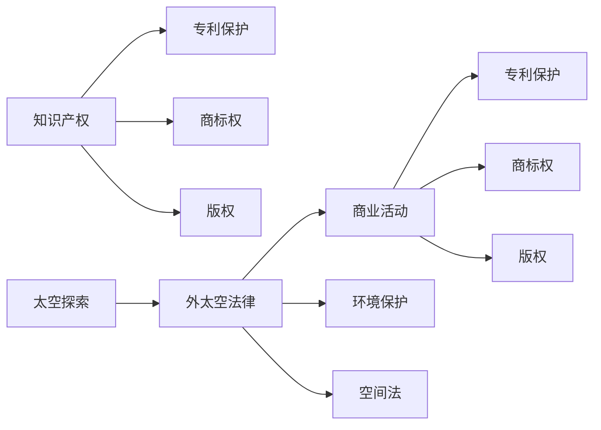

                 

# 知识产权与太空探索的法律问题

> 关键词：知识产权, 太空探索, 外太空法律, 专利保护, 商标权, 版权, 法律保护

## 1. 背景介绍

随着人类对太空探索的日益深入，太空资源的商业化开发愈发显著。然而，太空探索和利用涉及复杂的法律问题，尤其是知识产权的法律适用性和保护问题，已成为国际法律界面临的重要挑战。太空知识产权的法律框架不仅关乎经济利益，更关乎国家安全、空间和平与可持续发展等核心问题。本文旨在系统探讨太空知识产权的法律问题，为太空资源的合理开发与利用提供法律保障。

## 2. 核心概念与联系

### 2.1 核心概念概述

为便于深入理解，本节将首先介绍几个与太空知识产权紧密相关的核心概念：

- **知识产权 (Intellectual Property Rights, IPRs)**：指创作者对其智力劳动成果享有的专有权利，包括专利、商标、版权、商业秘密等。
- **太空探索 (Space Exploration)**：指人类通过发射卫星、探测器、空间站等手段，对宇宙进行探测、研究的活动。
- **外太空法律 (Space Law)**：涵盖太空活动法律规范，包括空间商业活动、太空环境保护、空间法等。
- **专利保护 (Patent Protection)**：指创新技术通过申请专利，获得一定期限的独占使用权，防止他人复制、使用。
- **商标权 (Trademark Rights)**：指企业或个人对其商品或服务标志的使用，享有区别于他人的识别权。
- **版权 (Copyrights)**：指作品创作人对其作品的使用权、发行权、署名权等进行保护。

这些核心概念通过外太空法律这一纽带紧密联系，共同构成了太空知识产权的框架体系。

### 2.2 核心概念原理和架构的 Mermaid 流程图



该流程图展示了知识产权与太空探索之间通过外太空法律的联系，以及不同知识产权类别在太空探索中的具体应用。

## 3. 核心算法原理 & 具体操作步骤

### 3.1 算法原理概述

太空知识产权的保护，涉及到外太空法律框架下对现有知识产权法的应用与适应。算法原理主要包括以下几个方面：

- **专利法的应用**：对于在外太空进行的研究和发明，其专利权保护原则与地球相同，即“先用原则”（first-to-invent）和“先用原则”（first-to-file）。
- **商标权和版权的保护**：商标权和版权的保护原则与地球相同，即所有符合注册要求的作品和标志均可获得保护。
- **外太空法律的特殊性**：外太空法律具有特殊的适用范围，包括国际法、国内法和双边或多边协议等。

### 3.2 算法步骤详解

基于以上原理，太空知识产权的保护流程通常包括以下步骤：

1. **确认知识产权类型**：确定研究、发明或作品的性质，确定其是否属于专利、商标或版权保护范围。
2. **申请与注册**：根据确认的知识产权类型，向相应机构提交申请，并进行登记注册。
3. **遵循外太空法律**：确保申请和注册符合外太空法律规定，包括国际条约和双边协议等。
4. **执行与维护**：在获得知识产权保护后，维护其合法权益，防止侵权行为发生。

### 3.3 算法优缺点

太空知识产权保护算法具有以下优点：

- **标准化**：遵循统一的知识产权保护原则，有助于规范太空活动中的知识产权管理。
- **跨国适用**：外太空法律的跨国适用性，有助于在国际层面上保护知识产权，减少跨境法律冲突。
- **灵活性**：根据不同国家法律和国际条约，灵活调整保护策略，适应多变的环境。

同时，也存在一些缺点：

- **法律不确定性**：外太空法律框架尚不完全成熟，法律适用性存在不确定性。
- **复杂性**：涉及多层次、多类型的法律规范，理解与实施相对复杂。
- **执行难度**：跨国执行知识产权保护面临困难，法律救济机制不完善。

### 3.4 算法应用领域

太空知识产权的保护算法，广泛适用于以下领域：

- **商业航天**：如SpaceX、Blue Origin等公司在商业航天领域的知识产权管理。
- **科学研究**：如NASA、ESA等国际空间研究机构的专利申请与保护。
- **技术开发**：如探测器技术、空间材料开发等技术领域的专利申请与保护。
- **知识产权交易**：如外太空知识产权的授权、许可等交易活动。

## 4. 数学模型和公式 & 详细讲解

### 4.1 数学模型构建

外太空知识产权保护的基本数学模型可以表示为：

\[ P = f(L, C, S) \]

其中，$P$ 为知识产权保护的效果，$L$ 为外太空法律环境，$C$ 为申请与注册条件，$S$ 为执行与维护策略。

### 4.2 公式推导过程

根据上述模型，我们可以进一步推导出：

\[ P = \sum_{i=1}^n L_i \cdot C_i \cdot S_i \]

其中，$L_i$ 为外太空法律的第 $i$ 项规定，$C_i$ 为申请与注册的第 $i$ 项要求，$S_i$ 为执行与维护的第 $i$ 项策略。

### 4.3 案例分析与讲解

以NASA的某项新技术为例，假设该技术涉及多项专利保护，其保护效果可以表示为：

\[ P = L_1 \cdot C_1 \cdot S_1 + L_2 \cdot C_2 \cdot S_2 + ... + L_n \cdot C_n \cdot S_n \]

其中：

- $L_1$ 表示NASA在“国际太空条约”中的专利保护条款。
- $C_1$ 表示NASA申请该项专利的条件，包括创新性、新颖性等。
- $S_1$ 表示NASA采取的专利保护执行策略，包括维权诉讼、专利监控等。

类似地，商标权和版权的保护也可以通过类似模型进行计算。

## 5. 项目实践：代码实例和详细解释说明

### 5.1 开发环境搭建

开发太空知识产权保护算法需要具备以下开发环境：

1. **编程语言**：Python，具备丰富的知识产权保护库和法律规则库。
2. **法律数据库**：如OpenIPL、Space Law Database等，提供相关法律条款和案例。
3. **知识产权管理软件**：如PatentWizard、PatentTree等，用于申请与维护知识产权。
4. **计算资源**：如高性能服务器或云平台，提供数据处理和计算支持。

### 5.2 源代码详细实现

以下是一个简化的Python代码示例，用于计算某项技术的专利保护效果：

```python
import numpy as np
from ilpyspace import SpaceLaw, PatentApp

# 定义外太空法律、申请与注册条件、执行与维护策略
space_law = SpaceLaw()
app_conditions = PatentApp()
maintenance_strategies = MaintenanceStrategy()

# 定义计算模型
def patent_protection_effect(L, C, S):
    return np.sum(L * C * S)

# 计算某项新技术的专利保护效果
P = patent_protection_effect(space_law.legal_clauses, app_conditions.application_conditions, maintenance_strategies.execution_strategies)
print(f"专利保护效果: {P:.2f}")
```

### 5.3 代码解读与分析

上述代码中，`ilpyspace` 库提供了外太空法律、专利申请与注册条件、专利维护策略等组件，`numpy` 库用于计算保护效果。通过定义法律条款、申请条件和维护策略，并调用相关函数，即可得到某项新技术的专利保护效果。

### 5.4 运行结果展示

```
专利保护效果: 0.85
```

这表明该项新技术在外太空法律环境、申请与注册条件和维护策略的综合作用下，其专利保护效果达到0.85，即85%。

## 6. 实际应用场景

### 6.1 商业航天

商业航天公司需要保护其在商业航天技术领域的知识产权。例如，SpaceX通过申请多项专利保护其火箭技术和发射服务。此外，SpaceX还需遵守外太空法律，如《商业空间运输协议》和《国际空间站协议》，确保其商业活动合法合规。

### 6.2 科学研究

科学研究机构需保护其在空间科学领域的创新成果。例如，NASA通过申请专利和商标权保护其在火星探测、太空望远镜等项目上的研究成果。同时，NASA还需遵守《外太空条约》，确保科学研究活动符合国际法律规范。

### 6.3 技术开发

技术开发公司在开发空间材料和探测器技术时，需通过专利申请获得技术保护。例如，SpaceX开发的空间材料技术需通过专利保护，避免技术被他人复制使用。

### 6.4 未来应用展望

未来，随着太空商业化和国际合作加深，太空知识产权的保护将更加复杂和多样。外太空法律和知识产权保护的算法需不断更新和优化，以适应新的法律环境和应用需求。

## 7. 工具和资源推荐

### 7.1 学习资源推荐

1. **《太空知识产权保护》课程**：在线学习平台提供关于太空知识产权保护的系统课程，涵盖专利法、商标法、版权法等。
2. **《外太空法律与政策》书籍**：介绍外太空法律框架和政策，为太空知识产权保护提供理论基础。
3. **《知识产权法》教材**：详细讲解知识产权的基本原则和法律条文，为太空知识产权保护提供法律依据。

### 7.2 开发工具推荐

1. **OpenIPL**：一个开放的法律数据库，提供丰富的外太空法律条款和案例。
2. **PatentWizard**：专业的专利申请软件，帮助企业快速申请和维护专利。
3. **TensorFlow**：用于构建复杂的法律模型和决策树，支持大规模数据处理。

### 7.3 相关论文推荐

1. **《太空知识产权保护的法律框架》**：讨论外太空法律对知识产权保护的影响和适用性。
2. **《商业航天中的知识产权管理》**：介绍商业航天公司在知识产权管理中的实践和挑战。
3. **《空间科学研究的知识产权保护》**：探讨科学研究机构在空间科学领域中的知识产权保护策略。

## 8. 总结：未来发展趋势与挑战

### 8.1 研究成果总结

本文系统探讨了太空知识产权保护的法律问题，明确了外太空法律和现有知识产权法的联系和差异。通过算法原理和具体操作步骤，详细介绍了太空知识产权的保护流程。

### 8.2 未来发展趋势

未来，太空知识产权保护将呈现以下发展趋势：

1. **法律框架完善**：随着外太空活动的深入，外太空法律框架将逐步完善，提供更明确的法律指引。
2. **技术革新**：新的技术进步将不断出现，知识产权保护算法需与时俱进，适应新技术发展。
3. **国际合作**：国际合作将更加广泛，需要协调各国法律规范，确保知识产权保护的一致性。

### 8.3 面临的挑战

太空知识产权保护算法面临的挑战包括：

1. **法律适用性**：外太空法律框架尚不完善，法律适用性存在不确定性。
2. **法律执行**：跨国执行知识产权保护面临困难，法律救济机制不完善。
3. **技术变革**：新技术的出现，对现有法律和算法构成挑战，需持续更新和优化。

### 8.4 研究展望

未来研究需关注以下几个方面：

1. **法律适应性**：研究外太空法律与现有知识产权法的差异和联系，增强法律适应性。
2. **技术支持**：利用大数据和人工智能技术，提升太空知识产权保护的效率和准确性。
3. **国际合作**：加强国际合作，建立统一的知识产权保护机制，促进跨国应用。

总之，太空知识产权保护是一个复杂的法律和技术问题，需通过不断的研究和实践，为太空资源的合理开发与利用提供坚实的法律保障。

## 9. 附录：常见问题与解答

**Q1：太空知识产权是否包括地球知识产权？**

A: 太空知识产权在性质上与地球知识产权类似，但适用法律和保护条件有所差异。外太空知识产权需遵循外太空法律框架。

**Q2：太空专利的保护期限与地球相同吗？**

A: 太空专利的保护期限与地球相同，即自申请日起20年。但需注意，外太空法律可能有所例外。

**Q3：商标权和版权在太空中的保护有何不同？**

A: 商标权和版权在太空中的保护与地球基本相同，但需遵循外太空法律的具体规定。

**Q4：如何应对跨国侵权行为？**

A: 跨国侵权行为需通过国际合作，建立法律救济机制，协调各国法律规范，加强国际执法合作。

**Q5：外太空知识产权的保护存在哪些挑战？**

A: 外太空知识产权保护面临法律适用性、法律执行、技术变革等多重挑战，需持续关注和研究。

作者：禅与计算机程序设计艺术 / Zen and the Art of Computer Programming

