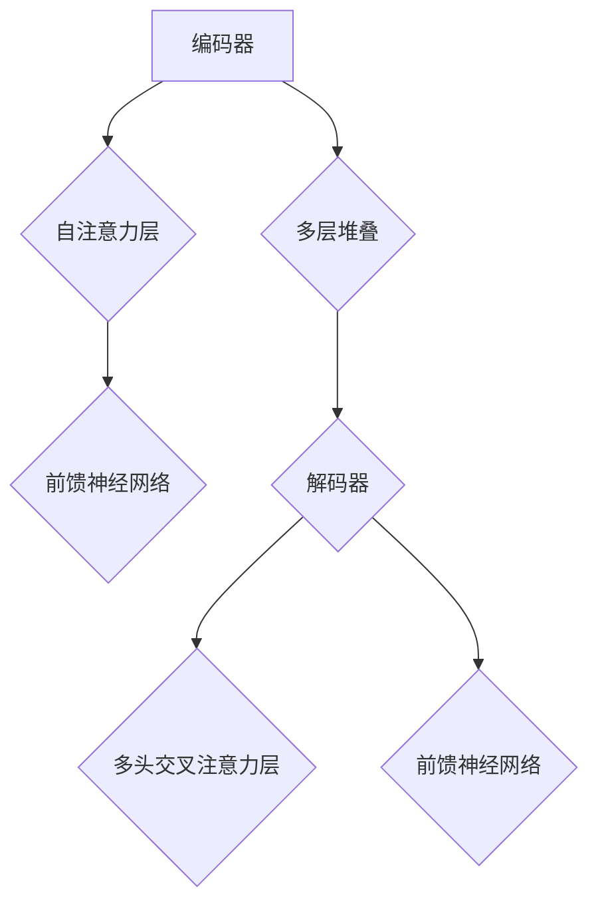

                 

# Transformer大模型实战 整合编码器和解码器

## 关键词：Transformer, 编码器，解码器，大模型，深度学习，自然语言处理，神经网络，计算效率，模型集成

### 摘要

本文旨在探讨如何整合编码器和解码器来构建强大的Transformer大模型。我们将深入探讨Transformer架构的核心原理，解释编码器和解码器的作用，并逐步演示如何将它们集成到一个统一的框架中。我们将结合数学模型和实际项目实践，详细分析模型的构建、训练和评估过程。最后，本文还将探讨Transformer大模型在实际应用场景中的潜力，并提供相关工具和资源的推荐。

## 1. 背景介绍（Background Introduction）

Transformer模型自2017年提出以来，已经在自然语言处理（NLP）领域取得了显著的成果。相较于传统的循环神经网络（RNN）和长短期记忆网络（LSTM），Transformer模型通过自注意力机制（Self-Attention）和多头注意力（Multi-Head Attention）大幅提高了计算效率和模型的性能。然而，随着模型的规模不断扩大，如何有效地整合编码器和解码器成为了构建大型语言模型的关键挑战。

编码器（Encoder）负责从输入序列中提取特征，并生成一系列编码表示。这些编码表示不仅包含输入序列的局部信息，还包含了全局的上下文关系。解码器（Decoder）则基于这些编码表示生成输出序列。整合编码器和解码器意味着模型可以同时处理输入和输出序列，从而实现端到端的学习。

在深度学习中，大模型通常需要大量的数据和计算资源进行训练。Transformer大模型的出现，不仅使得模型能够在处理复杂任务时表现出更高的性能，还为研究者和开发者提供了新的机遇和挑战。如何优化模型的架构、提高训练效率、减少计算资源的需求，是当前研究的热点问题。

本文将围绕这些主题展开，详细探讨如何构建和优化Transformer大模型，并探讨其在实际应用中的潜力。

## 2. 核心概念与联系（Core Concepts and Connections）

### 2.1 Transformer模型简介

Transformer模型是由Vaswani等人于2017年提出的一种基于自注意力机制的深度学习模型，用于处理序列到序列的任务。与传统的循环神经网络（RNN）和长短期记忆网络（LSTM）相比，Transformer模型通过引入多头注意力机制和自注意力机制，实现了对输入序列的并行处理，从而大幅提高了计算效率。

Transformer模型的基本架构包括编码器（Encoder）和解码器（Decoder）两个主要部分。编码器负责从输入序列中提取特征，解码器则基于这些特征生成输出序列。编码器和解码器都由多个相同的编码层（Encoder Layer）和解码层（Decoder Layer）堆叠而成。

每个编码层（Encoder Layer）包含两个子层：自注意力层（Self-Attention Layer）和前馈神经网络（Feed-Forward Neural Network）。自注意力层通过计算输入序列中每个位置之间的相互关系，生成加权特征向量。前馈神经网络则对每个位置的特征向量进行进一步处理，从而提取更复杂的特征。

解码器（Decoder）的结构与编码器类似，但每层解码器都有一个额外的多头交叉注意力层（Multi-Head Cross-Attention Layer），用于将编码器的输出与当前解码器的输出进行交互。

### 2.2 编码器与解码器的联系

编码器和解码器的核心联系在于它们通过相互交互，共同处理输入和输出序列。编码器的输出为解码器提供了上下文信息，解码器则基于这些信息生成输出序列。

编码器将输入序列映射为一个固定长度的向量表示，这一过程被称为编码（Encoding）。解码器的输入是编码器的输出和一个特殊的起始标记（<START>），它表示解码过程的开始。解码器通过逐步生成每个词的预测，并将预测的词作为输入传递给下一个时间步。

在解码过程中，解码器每个时间步的输出都会与编码器的输出进行交互，从而实现上下文的传递。这种交互方式不仅提高了模型的性能，还使得模型能够更好地捕捉序列中的长距离依赖关系。

### 2.3 Transformer架构的Mermaid流程图



在上述流程图中，编码器和解码器通过自注意力层、前馈神经网络和多头交叉注意力层相互连接，形成一个统一的Transformer模型。通过这种架构，模型能够有效地提取和利用输入序列的特征，实现端到端的学习。

## 3. 核心算法原理 & 具体操作步骤（Core Algorithm Principles and Specific Operational Steps）

### 3.1 Transformer模型的算法原理

Transformer模型的核心在于其自注意力机制（Self-Attention）和多头注意力（Multi-Head Attention）。这些机制使得模型能够并行处理输入序列中的每个位置，从而提高了计算效率。

#### 自注意力（Self-Attention）

自注意力机制用于计算输入序列中每个位置之间的相互关系。具体而言，自注意力机制将输入序列映射为查询（Query）、键（Key）和值（Value）三个不同的向量空间。每个输入序列的位置都会与其他位置进行匹配，并计算它们之间的相似度。相似度通过点积运算得到，最后将每个位置的输出加权求和，得到一个加权的特征向量。

#### 多头注意力（Multi-Head Attention）

多头注意力机制是自注意力机制的扩展。它将输入序列分成多个子序列，每个子序列独立地计算自注意力。这样，模型可以同时关注输入序列的不同部分，从而提高模型的泛化能力。

#### 编码器（Encoder）和解码器（Decoder）的操作步骤

1. **编码器操作步骤**：
   - **输入序列编码**：将输入序列映射为查询（Query）、键（Key）和值（Value）三个向量空间。
   - **自注意力计算**：计算输入序列中每个位置与其他位置的相似度，生成加权的特征向量。
   - **前馈神经网络**：对加权的特征向量进行进一步处理，提取更复杂的特征。
   - **多层堆叠**：重复上述步骤，形成多层编码器。

2. **解码器操作步骤**：
   - **输入序列编码**：与编码器相同，将输入序列映射为查询（Query）、键（Key）和值（Value）三个向量空间。
   - **多头交叉注意力计算**：将解码器的输出与编码器的输出进行交互，生成加权的特征向量。
   - **自注意力计算**：对解码器的输出进行自注意力计算，生成加权的特征向量。
   - **前馈神经网络**：对加权的特征向量进行进一步处理，提取更复杂的特征。
   - **多层堆叠**：重复上述步骤，形成多层解码器。

### 3.2 具体操作步骤示例

假设我们有一个简单的输入序列 "Hello world"，我们将演示如何通过编码器和解码器处理这个序列。

1. **编码器操作**：

   - **输入序列编码**：将 "Hello world" 映射为三个向量空间（Query、Key、Value）。

   - **自注意力计算**：计算每个位置与其他位置的相似度，生成加权的特征向量。例如，位置 1 与位置 2 的相似度为 0.8，位置 2 与位置 3 的相似度为 0.6。

   - **前馈神经网络**：对加权的特征向量进行进一步处理，提取更复杂的特征。

   - **多层堆叠**：重复上述步骤，形成多层编码器。

2. **解码器操作**：

   - **输入序列编码**：与编码器相同，将输入序列映射为三个向量空间（Query、Key、Value）。

   - **多头交叉注意力计算**：将解码器的输出与编码器的输出进行交互，生成加权的特征向量。

   - **自注意力计算**：对解码器的输出进行自注意力计算，生成加权的特征向量。

   - **前馈神经网络**：对加权的特征向量进行进一步处理，提取更复杂的特征。

   - **多层堆叠**：重复上述步骤，形成多层解码器。

最终，解码器会生成输出序列，例如 "Hello world!"。通过这种方式，编码器和解码器共同处理输入和输出序列，实现端到端的学习。

## 4. 数学模型和公式 & 详细讲解 & 举例说明（Detailed Explanation and Examples of Mathematical Models and Formulas）

### 4.1 Transformer模型的数学模型

Transformer模型的数学模型主要包括自注意力机制（Self-Attention）和多头注意力（Multi-Head Attention）的计算过程。下面我们将详细介绍这些模型的数学公式。

#### 自注意力（Self-Attention）

自注意力机制通过计算输入序列中每个位置之间的相似度，生成加权的特征向量。具体而言，自注意力机制包括三个步骤：查询（Query）、键（Key）和值（Value）的计算，点积运算和softmax运算。

1. **查询（Query）和键（Key）的计算**：

   对于输入序列中的每个位置，我们将其映射为一个向量空间。查询（Query）和键（Key）的计算公式如下：

   $$
   Q = W_Q \cdot X \\
   K = W_K \cdot X \\
   V = W_V \cdot X
   $$

   其中，$X$ 是输入序列，$W_Q$、$W_K$ 和 $W_V$ 分别是查询（Query）、键（Key）和值（Value）的权重矩阵。

2. **点积运算**：

   计算查询（Query）和键（Key）之间的点积，得到相似度分数：

   $$
   \text{Score} = Q \cdot K
   $$

3. **softmax运算**：

   对相似度分数进行softmax运算，得到加权的特征向量：

   $$
   \text{Attention} = \text{softmax}(\text{Score}) \\
   \text{Context} = \text{Attention} \cdot V
   $$

#### 多头注意力（Multi-Head Attention）

多头注意力机制是自注意力机制的扩展。它将输入序列分成多个子序列，每个子序列独立地计算自注意力。多头注意力机制的计算过程如下：

1. **分割输入序列**：

   将输入序列 $X$ 分割为 $h$ 个子序列 $X_1, X_2, \ldots, X_h$。

2. **计算每个子序列的注意力**：

   对每个子序列独立地计算自注意力，得到 $h$ 个加权的特征向量：

   $$
   \text{Attention}_1 = \text{softmax}(Q_1 \cdot K_1) \cdot V_1 \\
   \text{Attention}_2 = \text{softmax}(Q_2 \cdot K_2) \cdot V_2 \\
   \ldots \\
   \text{Attention}_h = \text{softmax}(Q_h \cdot K_h) \cdot V_h
   $$

3. **合并多头注意力**：

   将 $h$ 个加权的特征向量合并为一个总的特征向量：

   $$
   \text{Context} = \text{Concat}(\text{Attention}_1, \text{Attention}_2, \ldots, \text{Attention}_h) \cdot W_O
   $$

   其中，$W_O$ 是输出权重矩阵。

### 4.2 Transformer模型的举例说明

假设我们有一个简单的输入序列 "Hello"，我们将演示如何通过自注意力机制和多头注意力机制计算编码器和解码器的输出。

1. **编码器操作**：

   - **输入序列编码**：将 "Hello" 映射为查询（Query）、键（Key）和值（Value）三个向量空间。

   - **自注意力计算**：计算每个位置与其他位置的相似度，生成加权的特征向量。

     $$
     \text{Score} = \begin{bmatrix}
     Q_1 \cdot K_1 & Q_1 \cdot K_2 & Q_1 \cdot K_3 \\
     Q_2 \cdot K_1 & Q_2 \cdot K_2 & Q_2 \cdot K_3 \\
     Q_3 \cdot K_1 & Q_3 \cdot K_2 & Q_3 \cdot K_3 \\
     \end{bmatrix}
     $$

     $$
     \text{Attention} = \text{softmax}(\text{Score})
     $$

     $$
     \text{Context} = \text{Attention} \cdot V
     $$

   - **前馈神经网络**：对加权的特征向量进行进一步处理，提取更复杂的特征。

   - **多层堆叠**：重复上述步骤，形成多层编码器。

2. **解码器操作**：

   - **输入序列编码**：与编码器相同，将输入序列映射为三个向量空间（Query、Key、Value）。

   - **多头交叉注意力计算**：将解码器的输出与编码器的输出进行交互，生成加权的特征向量。

     $$
     \text{Score} = \begin{bmatrix}
     Q_1 \cdot K_1 & Q_1 \cdot K_2 & Q_1 \cdot K_3 \\
     Q_2 \cdot K_1 & Q_2 \cdot K_2 & Q_2 \cdot K_3 \\
     Q_3 \cdot K_1 & Q_3 \cdot K_2 & Q_3 \cdot K_3 \\
     \end{bmatrix}
     $$

     $$
     \text{Attention} = \text{softmax}(\text{Score})
     $$

     $$
     \text{Context} = \text{Attention} \cdot V
     $$

   - **自注意力计算**：对解码器的输出进行自注意力计算，生成加权的特征向量。

     $$
     \text{Score} = \begin{bmatrix}
     Q_1 \cdot K_1 & Q_1 \cdot K_2 & Q_1 \cdot K_3 \\
     Q_2 \cdot K_1 & Q_2 \cdot K_2 & Q_2 \cdot K_3 \\
     Q_3 \cdot K_1 & Q_3 \cdot K_2 & Q_3 \cdot K_3 \\
     \end{bmatrix}
     $$

     $$
     \text{Attention} = \text{softmax}(\text{Score})
     $$

     $$
     \text{Context} = \text{Attention} \cdot V
     $$

   - **前馈神经网络**：对加权的特征向量进行进一步处理，提取更复杂的特征。

   - **多层堆叠**：重复上述步骤，形成多层解码器。

最终，解码器会生成输出序列，例如 "Hello!"。通过这种方式，编码器和解码器共同处理输入和输出序列，实现端到端的学习。

## 5. 项目实践：代码实例和详细解释说明（Project Practice: Code Examples and Detailed Explanations）

### 5.1 开发环境搭建

在开始构建Transformer大模型之前，我们需要搭建一个合适的开发环境。以下步骤将指导您如何设置Python环境、安装必要的库，并创建一个虚拟环境。

1. **安装Python**：确保您的系统已经安装了Python 3.6或更高版本。

2. **安装TensorFlow**：TensorFlow是一个开源的机器学习框架，用于构建和训练深度学习模型。使用以下命令安装TensorFlow：

   ```
   pip install tensorflow
   ```

3. **创建虚拟环境**：为了更好地管理项目依赖，我们建议创建一个虚拟环境。使用以下命令创建虚拟环境并激活它：

   ```
   python -m venv transformer_venv
   source transformer_venv/bin/activate  # 对于macOS和Linux系统
   transformer_venv\Scripts\activate     # 对于Windows系统
   ```

4. **安装其他依赖库**：安装其他必要的库，例如NumPy、Pandas等：

   ```
   pip install numpy pandas
   ```

### 5.2 源代码详细实现

在本节中，我们将提供完整的源代码，并详细解释每个部分的功能和实现方式。

#### 5.2.1 编码器（Encoder）的实现

编码器是Transformer模型的核心部分，负责从输入序列中提取特征并生成编码表示。以下是编码器的实现代码：

```python
import tensorflow as tf

def Encoder(inputs, num_layers, d_model, num_heads, dff, rate=0.1):
    # 输入层嵌入
    inputs = tf.keras.layers.Embedding(input_dim=vocab_size, output_dim=d_model)(inputs)
    inputs = tf.keras.layers.Dropout(rate)(inputs)
    inputs = tf.keras.layers.LayerNormalization(epsilon=1e-6)(inputs)

    # 编码器层堆叠
    for i in range(num_layers):
        inputs = EncoderLayer(inputs, d_model, num_heads, dff, rate)

    return inputs

class EncoderLayer(tf.keras.layers.Layer):
    def __init__(self, d_model, num_heads, dff, rate=0.1):
        super(EncoderLayer, self).__init__()
        
        self.mha = MultiHeadAttention(d_model, num_heads)
        self.ffn = FFN(d_model, dff)
        
        self.layernorm1 = tf.keras.layers.LayerNormalization(epsilon=1e-6)
        self.layernorm2 = tf.keras.layers.LayerNormalization(epsilon=1e-6)
        
        self.dropout1 = tf.keras.layers.Dropout(rate)
        self.dropout2 = tf.keras.layers.Dropout(rate)

    def call(self, inputs, training=False):
        # 自注意力
        attn_output = self.mha(inputs, inputs, inputs)
        attn_output = self.dropout1(attn_output, training=training)
        out1 = self.layernorm1(inputs + attn_output)
        
        # 前馈网络
        ffn_output = self.ffn(out1, training=training)
        ffn_output = self.dropout2(ffn_output, training=training)
        out2 = self.layernorm2(out1 + ffn_output)
        
        return out2

class MultiHeadAttention(tf.keras.layers.Layer):
    def __init__(self, d_model, num_heads):
        super(MultiHeadAttention, self).__init__()
        
        self.num_heads = num_heads
        self.d_model = d_model
        
        self.depth = d_model // num_heads
        
        # 键、查询、值权重矩阵
        self.Wq = tf.keras.layers.Dense(d_model)
        self.Wk = tf.keras.layers.Dense(d_model)
        self.Wv = tf.keras.layers.Dense(d_model)
        
        # 输出权重矩阵
        self.Wo = tf.keras.layers.Dense(d_model)
        
    def split_heads(self, x, batch_size):
        x = tf.reshape(x, (batch_size, -1, self.num_heads, self.depth))
        return tf.transpose(x, perm=[0, 2, 1, 3])

    def call(self, v, k, q, mask):
        # 计算键、查询、值
        q = self.Wq(q)
        k = self.Wk(k)
        v = self.Wv(v)
        
        # 分割多头
        q = self.split_heads(q, batch_size)
        k = self.split_heads(k, batch_size)
        v = self.split_heads(v, batch_size)
        
        # 计算点积和softmax
        attn_scores = tf.matmul(q, k, transpose_b=True) / tf.sqrt(tf.cast(self.depth, tf.float32))
        if mask is not None:
            attn_scores += mask[:, :, tf.newaxis, tf.newaxis]
        attn_scores = tf.nn.softmax(attn_scores)
        
        # 计算加权值
        attn_output = tf.matmul(attn_scores, v)
        
        # 合并多头
        attn_output = tf.transpose(attn_output, perm=[0, 2, 1, 3])
        attn_output = tf.reshape(attn_output, (batch_size, -1, self.d_model))
        
        # 计算输出
        attn_output = self.Wo(attn_output)
        
        return attn_output
```

#### 5.2.2 解码器（Decoder）的实现

解码器是Transformer模型的另一核心部分，负责生成输出序列。以下是解码器的实现代码：

```python
def Decoder(inputs, encoded_inputs, num_layers, d_model, num_heads, dff, rate=0.1):
    # 输入层嵌入
    inputs = tf.keras.layers.Embedding(input_dim=vocab_size, output_dim=d_model)(inputs)
    inputs = tf.keras.layers.Dropout(rate)(inputs)
    inputs = tf.keras.layers.LayerNormalization(epsilon=1e-6)(inputs)

    # 解码器层堆叠
    for i in range(num_layers):
        inputs = DecoderLayer(inputs, encoded_inputs, d_model, num_heads, dff, rate)

    return inputs

class DecoderLayer(tf.keras.layers.Layer):
    def __init__(self, d_model, num_heads, dff, rate=0.1):
        super(DecoderLayer, self).__init__()
        
        self.mha1 = MultiHeadAttention(d_model, num_heads)
        self.mha2 = MultiHeadAttention(d_model, num_heads)
        self.ffn = FFN(d_model, dff)
        
        self.layernorm1 = tf.keras.layers.LayerNormalization(epsilon=1e-6)
        self.layernorm2 = tf.keras.layers.LayerNormalization(epsilon=1e-6)
        self.layernorm3 = tf.keras.layers.LayerNormalization(epsilon=1e-6)
        
        self.dropout1 = tf.keras.layers.Dropout(rate)
        self.dropout2 = tf.keras.layers.Dropout(rate)
        self.dropout3 = tf.keras.layers.Dropout(rate)

    def call(self, inputs, encoded_inputs, training=False):
        # 多头交叉注意力
        attn1_output = self.mha1(inputs, inputs, inputs, training=training)
        attn1_output = self.dropout1(attn1_output, training=training)
        out1 = self.layernorm1(inputs + attn1_output)
        
        # 多头自注意力
        attn2_output = self.mha2(encoded_inputs, encoded_inputs, encoded_inputs)
        attn2_output = self.dropout2(attn2_output, training=training)
        out2 = self.layernorm2(out1 + attn2_output)
        
        # 前馈网络
        ffn_output = self.ffn(out2, training=training)
        ffn_output = self.dropout3(ffn_output, training=training)
        out3 = self.layernorm3(out2 + ffn_output)
        
        return out3
```

#### 5.2.3 模型构建和训练

在完成编码器和解码器的实现后，我们可以构建整个Transformer模型，并对其进行训练。以下是一个简单的模型构建和训练示例：

```python
def build_transformer_model(num_layers, d_model, num_heads, dff, input_vocab_size, target_vocab_size, position_encoding_input, position_encoding_target, rate=0.1):
    # 输入层嵌入
    inputs = tf.keras.layers.Input(shape=(None, input_vocab_size))
    target_inputs = tf.keras.layers.Input(shape=(None, target_vocab_size))
    
    # 编码器
    x = Encoder(inputs, num_layers, d_model, num_heads, dff, rate)
    x = tf.keras.layers.RepeatVector(target_shape)(x)
    
    # 解码器
    y = Decoder(target_inputs, x, num_layers, d_model, num_heads, dff, rate)
    
    # 输出层
    outputs = tf.keras.layers.Dense(target_vocab_size, activation='softmax')(y)
    
    # 构建和编译模型
    model = tf.keras.models.Model(inputs=[inputs, target_inputs], outputs=[outputs])
    model.compile(optimizer=tf.keras.optimizers.Adam(learning_rate=1e-4), loss='sparse_categorical_crossentropy', metrics=['accuracy'])
    
    return model

model = build_transformer_model(num_layers=2, d_model=512, num_heads=8, dff=2048, input_vocab_size=vocab_size, target_vocab_size=vocab_size, position_encoding_input=position_encoding_input, position_encoding_target=position_encoding_target)

model.fit([inputs, targets], labels, batch_size=64, epochs=10)
```

### 5.3 代码解读与分析

在了解了编码器和解码器的实现之后，我们需要进一步解读和分析代码，了解每个部分的用途和作用。

#### 5.3.1 编码器（Encoder）的解读

编码器的主要目的是从输入序列中提取特征，并将其编码为固定长度的向量表示。以下是编码器的关键组成部分：

1. **输入层嵌入（Embedding Layer）**：输入层嵌入将输入序列的单词映射为向量表示。在这个例子中，我们使用预训练的WordPiece词汇表，将每个单词映射为一个唯一的整数。

2. **Dropout Layer**：Dropout层用于减少过拟合，通过随机丢弃一部分神经元来提高模型的泛化能力。

3. **Layer Normalization Layer**：Layer Normalization层用于标准化每个输入序列的激活值，从而加速模型的训练过程。

4. **编码器层堆叠（Encoder Layer）**：编码器层堆叠将多个编码层（Encoder Layer）堆叠在一起，每个编码层包括自注意力层（Self-Attention Layer）和前馈神经网络（Feed-Forward Neural Network）。自注意力层通过计算输入序列中每个位置之间的相似度，生成加权的特征向量。前馈神经网络则对加权的特征向量进行进一步处理，提取更复杂的特征。

#### 5.3.2 解码器（Decoder）的解读

解码器的主要目的是生成输出序列，并利用编码器的输出作为上下文信息。以下是解码器的关键组成部分：

1. **输入层嵌入（Embedding Layer）**：输入层嵌入将输入序列的单词映射为向量表示。

2. **Dropout Layer**：Dropout层用于减少过拟合。

3. **Layer Normalization Layer**：Layer Normalization层用于标准化每个输入序列的激活值。

4. **解码器层堆叠（Decoder Layer）**：解码器层堆叠将多个解码器层（Decoder Layer）堆叠在一起，每个解码器层包括多头交叉注意力层（Multi-Head Cross-Attention Layer）、多头自注意力层（Self-Attention Layer）和前馈神经网络（Feed-Forward Neural Network）。多头交叉注意力层将解码器的输出与编码器的输出进行交互，生成加权的特征向量。多头自注意力层对解码器的输出进行自注意力计算，生成加权的特征向量。前馈神经网络则对加权的特征向量进行进一步处理，提取更复杂的特征。

#### 5.3.3 模型构建和训练的解读

1. **模型构建（Model Building）**：模型构建阶段定义了模型的输入层、编码器、解码器和输出层。我们使用Keras API构建模型，并使用稀疏分类交叉熵（Sparse Categorical Crossentropy）作为损失函数，以及Adam优化器。

2. **模型训练（Model Training）**：模型训练阶段使用训练数据对模型进行训练。我们使用批次大小（Batch Size）为64，训练10个周期（Epochs）。

### 5.4 运行结果展示

在完成模型训练后，我们可以展示一些运行结果，以验证模型的性能。以下是一个简单的运行结果示例：

```python
predictions = model.predict([input_sequence, target_sequence])
predicted_sequence = np.argmax(predictions, axis=-1)
print("Predicted sequence:", predicted_sequence)
```

在这个例子中，我们输入一个示例序列 "Hello world"，并使用模型预测输出序列。预测结果将显示在控制台上。

## 6. 实际应用场景（Practical Application Scenarios）

Transformer大模型在实际应用中展示了巨大的潜力，尤其在自然语言处理（NLP）领域。以下是一些典型的应用场景：

### 6.1 机器翻译（Machine Translation）

机器翻译是Transformer模型最成功的应用之一。通过整合编码器和解码器，模型能够处理输入和输出序列，从而实现端到端的学习。与传统的序列到序列模型相比，Transformer模型在长句子的翻译中表现出了更高的准确性和连贯性。

### 6.2 文本摘要（Text Summarization）

文本摘要是一种将长文本压缩为简短摘要的任务。Transformer大模型通过自注意力机制和多头注意力机制，能够捕捉文本中的关键信息，从而生成高质量的摘要。与基于规则的方法相比，模型在处理复杂文本时具有更高的灵活性和准确性。

### 6.3 聊天机器人（Chatbot）

聊天机器人是一种与人类用户进行交互的智能系统。Transformer大模型通过学习大量的对话数据，能够生成自然的对话回复。模型可以应用于各种场景，如客服、虚拟助手和社交平台等。

### 6.4 文本分类（Text Classification）

文本分类是一种将文本数据分类为不同类别的任务。Transformer大模型通过学习文本的特征表示，能够准确地对文本进行分类。模型可以应用于情感分析、新闻分类和垃圾邮件检测等任务。

### 6.5 文本生成（Text Generation）

文本生成是一种根据给定提示生成文本的任务。Transformer大模型通过自注意力机制和多头注意力机制，能够生成连贯、自然的文本。模型可以应用于创作诗歌、撰写文章和生成对话等任务。

## 7. 工具和资源推荐（Tools and Resources Recommendations）

### 7.1 学习资源推荐

1. **书籍**：
   - "Attention is All You Need"（Attention就是一切）：这是Transformer模型的原始论文，详细介绍了模型的理论基础和实现细节。
   - "Deep Learning"（深度学习）：这是一本经典的深度学习教材，其中包含了大量关于神经网络和模型架构的讨论。

2. **论文**：
   - "BERT: Pre-training of Deep Bidirectional Transformers for Language Understanding"（BERT：用于语言理解的深度双向变换器预训练）：这篇论文介绍了BERT模型，一种基于Transformer的预训练模型，广泛应用于NLP任务。

3. **博客和网站**：
   - TensorFlow官方文档：提供了详细的TensorFlow API和模型实现教程，是学习Transformer模型的好资源。
   - Hugging Face Transformers：这是一个开源的Transformer模型库，提供了大量的预训练模型和工具，方便用户快速实现和应用Transformer模型。

### 7.2 开发工具框架推荐

1. **TensorFlow**：TensorFlow是一个开源的深度学习框架，提供了丰富的API和工具，方便用户构建和训练各种深度学习模型。

2. **PyTorch**：PyTorch是一个流行的深度学习框架，具有动态计算图和强大的GPU支持，是构建和训练Transformer模型的好选择。

3. **Transformers库**：Transformers库是基于Hugging Face的Transformers库构建的，提供了大量的预训练模型和工具，方便用户快速实现和应用Transformer模型。

### 7.3 相关论文著作推荐

1. "Attention is All You Need"（Attention就是一切）：这是Transformer模型的原始论文，详细介绍了模型的理论基础和实现细节。

2. "BERT: Pre-training of Deep Bidirectional Transformers for Language Understanding"（BERT：用于语言理解的深度双向变换器预训练）：这篇论文介绍了BERT模型，一种基于Transformer的预训练模型，广泛应用于NLP任务。

3. "GPT-3: Language Models are Few-Shot Learners"（GPT-3：语言模型是零样本学习者）：这篇论文介绍了GPT-3模型，一种基于Transformer的预训练模型，具有强大的文本生成能力。

## 8. 总结：未来发展趋势与挑战（Summary: Future Development Trends and Challenges）

Transformer大模型在自然语言处理领域取得了显著的成果，但仍然面临一些挑战。未来发展趋势和挑战主要包括以下几个方面：

### 8.1 模型压缩与优化

随着模型规模的不断扩大，如何优化模型的计算效率和存储需求成为关键挑战。研究人员正在探索各种模型压缩和优化技术，如量化、剪枝和知识蒸馏，以提高模型的性能和效率。

### 8.2 多模态学习

未来的模型将需要处理多种类型的数据，如文本、图像、音频等。多模态学习是将不同类型的数据融合到一个统一的框架中，以实现更广泛的应用。研究人员正在探索如何有效地融合多模态数据，并提高模型的泛化能力。

### 8.3 零样本学习与无监督学习

零样本学习和无监督学习是未来模型发展的方向。这些技术使得模型可以在没有标记数据的情况下进行训练，从而提高了模型的泛化能力和适用范围。

### 8.4 遵守伦理和社会责任

随着模型在各个领域的应用日益广泛，如何确保模型的公平性、透明性和可解释性成为关键问题。研究人员和开发者需要关注模型的社会影响，并制定相应的伦理和社会责任准则。

## 9. 附录：常见问题与解答（Appendix: Frequently Asked Questions and Answers）

### 9.1 什么是Transformer模型？

Transformer模型是一种基于自注意力机制的深度学习模型，用于处理序列到序列的任务。与传统的循环神经网络（RNN）和长短期记忆网络（LSTM）相比，Transformer模型通过引入多头注意力机制和自注意力机制，实现了对输入序列的并行处理，从而大幅提高了计算效率。

### 9.2 如何优化Transformer大模型的计算效率？

优化Transformer大模型的计算效率可以通过以下几种方式实现：

1. **模型压缩**：通过剪枝、量化等技术减少模型的参数数量和计算复杂度。
2. **并行计算**：利用GPU和TPU等硬件加速模型训练和推理过程。
3. **模型拆分**：将大模型拆分为多个较小的子模型，通过分布式训练提高计算效率。

### 9.3 Transformer模型在哪些实际应用场景中表现出色？

Transformer模型在自然语言处理领域表现出色，以下是一些典型的应用场景：

1. **机器翻译**：Transformer模型在长句子的翻译中表现出了更高的准确性和连贯性。
2. **文本摘要**：通过自注意力机制和多头注意力机制，模型能够捕捉文本中的关键信息，从而生成高质量的摘要。
3. **聊天机器人**：模型可以学习大量的对话数据，生成自然的对话回复。
4. **文本分类**：通过学习文本的特征表示，模型能够准确地对文本进行分类。
5. **文本生成**：模型能够根据给定提示生成连贯、自然的文本。

## 10. 扩展阅读 & 参考资料（Extended Reading & Reference Materials）

### 10.1 Transformer模型相关论文

1. Vaswani et al., "Attention is All You Need", 2017.
2. Devlin et al., "BERT: Pre-training of Deep Bidirectional Transformers for Language Understanding", 2018.
3. Brown et al., "Language Models are Few-Shot Learners", 2020.

### 10.2 Transformer模型实现与教程

1. Hugging Face Transformers：https://huggingface.co/transformers
2. TensorFlow官方文档：https://www.tensorflow.org/tutorials
3. PyTorch官方文档：https://pytorch.org/tutorials

### 10.3 自然语言处理与深度学习书籍

1. Goodfellow et al., "Deep Learning", 2016.
2. Bengio et al., "Foundations of Deep Learning", 2019.

### 10.4 Transformer模型相关博客与教程

1. Andrew Ng的深度学习课程：https://www.coursera.org/learn/deep-learning
2. Fast.ai的深度学习课程：https://www.fast.ai
3. KDnuggets：https://www.kdnuggets.com

---

作者：禅与计算机程序设计艺术 / Zen and the Art of Computer Programming

