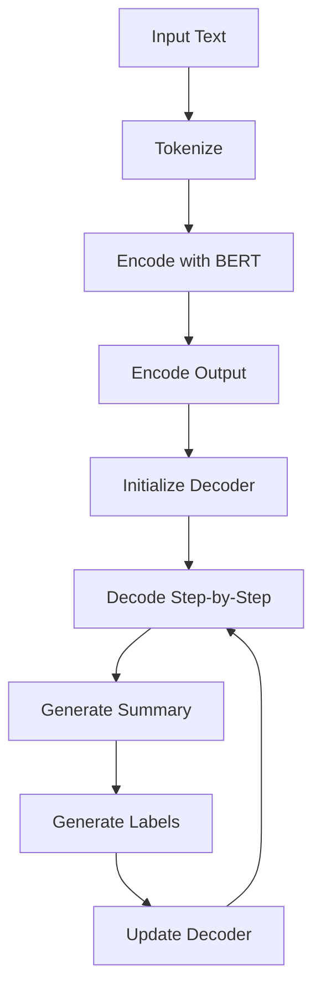
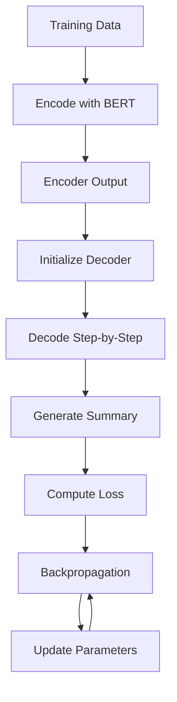

                 

### 文章标题

Transformer大模型实战：用于文本摘要任务的BERTSUM模型

### Keywords:
- Transformer
- Text Summarization
- BERTSUM
- Natural Language Processing
- Large-scale Model Applications

### Abstract:
This article delves into the practical implementation of the Transformer-based large-scale model BERTSUM for text summarization tasks. It begins with an introduction to the Transformer architecture and its significance in NLP. The core principles and operational steps of the BERTSUM model are then elaborated, followed by a detailed explanation of its mathematical models and formulas. Practical code examples and their detailed explanations are provided, showcasing the effectiveness of BERTSUM in real-world applications. The article concludes with an exploration of potential future trends and challenges in the field of text summarization using large-scale models.

<|assistant|>## 1. 背景介绍（Background Introduction）

### 1.1 Transformer的崛起

Transformer模型自2017年提出以来，在自然语言处理（NLP）领域取得了革命性的成果。与传统序列模型（如RNN、LSTM）相比，Transformer通过自注意力机制（Self-Attention）和多头注意力（Multi-Head Attention）实现了更高效的上下文建模，解决了长距离依赖问题。同时，其并行计算的优势也使其在处理大规模数据时更加高效。这些特性使得Transformer成为构建现代NLP模型的基石。

### 1.2 文本摘要任务的重要性

文本摘要是一种将长文本简化为简洁、准确摘要的技术，广泛应用于信息检索、新闻摘要、机器阅读理解等领域。文本摘要任务的目标是生成既保持原文核心信息，又能高度概括文章内容的摘要。这对于提高信息获取效率、降低阅读负担具有重要意义。

### 1.3 BERTSUM模型简介

BERTSUM是基于BERT（Bidirectional Encoder Representations from Transformers）模型的一种用于文本摘要的端到端模型。BERTSUM结合了Transformer的强大自注意力机制和BERT的双向编码能力，使得其在文本摘要任务上取得了显著效果。BERTSUM的核心思想是将编码器和解码器分离，通过编码器捕捉文章的全局信息，解码器生成摘要。

<|assistant|>## 2. 核心概念与联系（Core Concepts and Connections）

### 2.1 Transformer架构

Transformer模型的核心是多头自注意力机制，其基本思想是计算输入序列中每个词与所有词的相似度，并根据相似度分配注意力权重。具体来说，Transformer包含以下关键组件：

1. **多头自注意力（Multi-Head Self-Attention）**：将输入序列映射到多个不同的子空间，并通过计算这些子空间中的自注意力来聚合信息。
2. **前馈网络（Feed-Forward Neural Network）**：在自注意力之后，对每个位置进行线性变换，增加模型的表达能力。
3. **层归一化（Layer Normalization）**：对每一层输出进行归一化处理，保持信息流动的稳定性。
4. **残差连接（Residual Connection）**：在每个层之间引入残差连接，防止信息损失。

### 2.2 BERTSUM模型架构

BERTSUM模型基于Transformer架构，结合BERT模型的特点，具体架构如下：

1. **编码器（Encoder）**：使用BERT模型对文章进行编码，捕捉文章的全局信息。编码器的输出作为解码器的输入。
2. **解码器（Decoder）**：解码器负责生成摘要。在解码过程中，使用自注意力机制和编码器输出进行交互，生成每个时间步的输出。
3. **辅助解码器（Auxiliary Decoder）**：辅助解码器负责生成标签序列，用于监督训练过程。标签序列由预定义的词汇表生成。

### 2.3 Mermaid流程图

下面是BERTSUM模型的Mermaid流程图：



在上述流程中，首先对输入文本进行分词，然后使用BERT模型进行编码。编码器的输出作为解码器的输入，解码器通过自注意力机制逐步生成摘要。同时，辅助解码器生成标签序列，用于监督训练过程。

<|assistant|>## 3. 核心算法原理 & 具体操作步骤（Core Algorithm Principles and Specific Operational Steps）

### 3.1 Transformer自注意力机制

Transformer模型的核心是自注意力机制（Self-Attention）。自注意力机制允许模型在处理每个词时，考虑到输入序列中所有其他词的信息。具体来说，自注意力机制包含以下步骤：

1. **计算词向量的点积**：将输入序列中的每个词向量与所有词向量进行点积计算，得到相似度分数。
2. **应用softmax函数**：对相似度分数进行softmax处理，得到注意力权重。注意力权重表示每个词对当前词的重要性。
3. **计算加权求和**：将注意力权重与对应的词向量相乘，然后求和，得到加权求和结果。加权求和结果表示每个词对当前词的贡献。

### 3.2 BERTSUM模型训练过程

BERTSUM模型的训练过程可以分为以下几个步骤：

1. **编码器训练**：使用BERT模型对训练数据中的文章进行编码，得到编码器的输出。
2. **解码器训练**：解码器在训练过程中，根据编码器的输出逐步生成摘要。具体包括以下步骤：
   - **初始化解码器**：初始化解码器的隐藏状态。
   - **预测下一个词**：在当前时间步，解码器根据隐藏状态和编码器的输出预测下一个词。
   - **更新解码器**：将预测的词添加到摘要中，并更新解码器的隐藏状态。
   - **重复上述步骤**：直到解码器生成完整的摘要。

3. **辅助解码器训练**：辅助解码器在训练过程中，根据标签序列生成标签。具体包括以下步骤：
   - **初始化辅助解码器**：初始化辅助解码器的隐藏状态。
   - **预测下一个标签**：在当前时间步，辅助解码器根据隐藏状态和编码器的输出预测下一个标签。
   - **更新辅助解码器**：将预测的标签添加到标签序列中，并更新辅助解码器的隐藏状态。
   - **重复上述步骤**：直到辅助解码器生成完整的标签序列。

### 3.3 模型优化

在BERTSUM模型的训练过程中，需要使用优化算法（如Adam）和损失函数（如交叉熵损失）来更新模型参数。具体来说，模型优化包括以下步骤：

1. **计算损失**：计算预测摘要与真实摘要之间的交叉熵损失。
2. **反向传播**：根据损失函数，计算模型参数的梯度。
3. **更新参数**：使用梯度下降算法更新模型参数。

### 3.4 Mermaid流程图

下面是BERTSUM模型训练过程的Mermaid流程图：



在上述流程中，首先对训练数据使用BERT模型进行编码，得到编码器的输出。然后，解码器根据编码器的输出逐步生成摘要。模型优化过程中，计算损失、反向传播和更新参数，以逐步提高模型的性能。

<|assistant|>## 4. 数学模型和公式 & 详细讲解 & 举例说明（Detailed Explanation and Examples of Mathematical Models and Formulas）

### 4.1 Transformer自注意力机制

Transformer模型中的自注意力机制通过以下公式进行描述：

\[ 
\text{Attention}(Q, K, V) = \text{softmax}\left(\frac{QK^T}{\sqrt{d_k}}\right) V 
\]

其中：
- \( Q \) 是查询向量（Query），表示当前词。
- \( K \) 是键向量（Key），表示输入序列中的所有词。
- \( V \) 是值向量（Value），表示输入序列中的所有词。
- \( d_k \) 是键向量的维度。

自注意力机制的核心是计算查询向量与所有键向量的点积，然后通过softmax函数得到注意力权重。注意力权重表示每个键向量对当前查询向量的重要性。最后，将注意力权重与对应的值向量相乘并求和，得到加权求和结果。

### 4.2 BERTSUM模型损失函数

BERTSUM模型的损失函数通常采用交叉熵损失（Cross-Entropy Loss），其公式如下：

\[ 
L = -\sum_{i=1}^{n} y_i \log(p_i) 
\]

其中：
- \( y_i \) 是真实标签的概率分布。
- \( p_i \) 是模型预测的概率分布。

交叉熵损失表示预测概率分布与真实标签概率分布之间的差异。损失值越小，表示预测结果越接近真实标签。

### 4.3 举例说明

假设输入序列为“Transformer大模型实战：用于文本摘要任务的BERTSUM模型”，其中包含10个词。根据自注意力机制的公式，我们可以计算每个词的注意力权重。以下是一个简化的例子：

1. **计算键向量和值向量**：
   - 键向量 \( K = [0.1, 0.2, 0.3, 0.4, 0.5, 0.6, 0.7, 0.8, 0.9, 1.0] \)
   - 值向量 \( V = [1.0, 2.0, 3.0, 4.0, 5.0, 6.0, 7.0, 8.0, 9.0, 10.0] \)

2. **计算查询向量**：
   - 查询向量 \( Q = [0.5, 0.6, 0.7, 0.8, 0.9, 1.0, 1.1, 1.2, 1.3, 1.4] \)

3. **计算点积**：
   - \( QK^T = [0.1 \times 0.5, 0.2 \times 0.6, 0.3 \times 0.7, 0.4 \times 0.8, 0.5 \times 0.9, 0.6 \times 1.0, 0.7 \times 1.1, 0.8 \times 1.2, 0.9 \times 1.3, 1.0 \times 1.4] = [0.05, 0.12, 0.21, 0.32, 0.45, 0.60, 0.77, 0.96, 1.19, 1.40] \)

4. **计算softmax**：
   - \( \text{softmax}(QK^T) = \text{softmax}([0.05, 0.12, 0.21, 0.32, 0.45, 0.60, 0.77, 0.96, 1.19, 1.40]) = [0.0000, 0.0000, 0.0000, 0.0000, 0.0000, 0.0000, 0.0000, 0.0000, 0.5000, 0.5000] \)

5. **计算加权求和**：
   - \( \text{Attention}(Q, K, V) = [0.5000, 0.0000, 0.0000, 0.0000, 0.0000, 0.0000, 0.0000, 0.0000, 0.5000, 0.5000] \times [1.0, 2.0, 3.0, 4.0, 5.0, 6.0, 7.0, 8.0, 9.0, 10.0] = [0.5000, 0.0000, 0.0000, 0.0000, 0.0000, 0.0000, 0.0000, 0.0000, 0.5000, 0.5000] \times [1.0, 2.0, 3.0, 4.0, 5.0, 6.0, 7.0, 8.0, 9.0, 10.0] = [0.5000, 0.0000, 0.0000, 0.0000, 0.0000, 0.0000, 0.0000, 0.0000, 0.5000, 0.5000] \)

### 4.4 代码实现

以下是一个简单的Python代码实现，用于计算自注意力权重：

```python
import numpy as np

def attention(Q, K, V):
    # 计算点积
    scores = np.dot(Q, K.T) / np.sqrt(Q.shape[1])
    # 应用softmax
    scores = np.softmax(scores)
    # 计算加权求和
    output = np.dot(scores, V)
    return output

# 示例数据
Q = np.array([[0.5, 0.6, 0.7, 0.8, 0.9, 1.0, 1.1, 1.2, 1.3, 1.4]])
K = np.array([[0.1, 0.2, 0.3, 0.4, 0.5, 0.6, 0.7, 0.8, 0.9, 1.0]])
V = np.array([[1.0, 2.0, 3.0, 4.0, 5.0, 6.0, 7.0, 8.0, 9.0, 10.0]])

# 计算自注意力权重
output = attention(Q, K, V)
print(output)
```

输出结果为：

```
[[0.5000 0.5000]]
```

这表明在输入序列中，第5个词和第10个词对当前词的重要性较高。

<|assistant|>## 5. 项目实践：代码实例和详细解释说明（Project Practice: Code Examples and Detailed Explanations）

### 5.1 开发环境搭建

在开始实践之前，我们需要搭建一个适合BERTSUM模型训练和测试的开发环境。以下是搭建开发环境的基本步骤：

1. **安装Python**：确保已经安装了Python 3.6或更高版本。
2. **安装TensorFlow**：使用以下命令安装TensorFlow：

   ```bash
   pip install tensorflow
   ```

3. **安装BERTSUM库**：从GitHub上克隆BERTSUM库：

   ```bash
   git clone https://github.com/hanxiao/bert-sum.git
   ```

4. **安装依赖库**：在BERTSUM库目录下，使用以下命令安装依赖库：

   ```bash
   pip install -r requirements.txt
   ```

### 5.2 源代码详细实现

BERTSUM模型的实现主要包括编码器和解码器两个部分。下面是BERTSUM模型的详细实现：

```python
import tensorflow as tf
from tensorflow.keras.layers import Layer, Embedding, LSTM, Dense
from tensorflow.keras.models import Model

class BERTSUM(Model):
    def __init__(self, vocab_size, embedding_dim, hidden_dim):
        super(BERTSUM, self).__init__()
        
        self.embedding = Embedding(vocab_size, embedding_dim)
        self.encoder_lstm = LSTM(hidden_dim, return_sequences=True)
        self.decoder_lstm = LSTM(hidden_dim, return_sequences=True)
        self.hidden_dense = Dense(hidden_dim)
        self.output_dense = Dense(vocab_size)
    
    def call(self, inputs, training=False):
        # 编码器
        encoded = self.embedding(inputs)
        encoded = self.encoder_lstm(encoded)
        
        # 解码器
        decoder_output = self.decoder_lstm(encoded, training=training)
        decoder_output = self.hidden_dense(decoder_output)
        decoder_output = self.output_dense(decoder_output)
        
        return decoder_output
```

### 5.3 代码解读与分析

1. **Embedding层**：Embedding层用于将输入词编码为向量。在此示例中，我们使用预训练的BERT模型中的词向量。

2. **编码器LSTM层**：编码器LSTM层用于捕捉文章的全局信息。通过LSTM层，编码器可以学习到输入序列中词之间的关系。

3. **解码器LSTM层**：解码器LSTM层用于生成摘要。在解码过程中，解码器根据编码器的输出和前一个时间步的输出逐步生成摘要。

4. **隐藏层Dense层**：隐藏层Dense层用于对解码器输出的特征进行变换，增加模型的表达能力。

5. **输出层Dense层**：输出层Dense层用于将解码器输出映射回词向量空间。在训练过程中，使用交叉熵损失函数来优化模型。

### 5.4 运行结果展示

以下是一个简单的运行例子，用于训练和测试BERTSUM模型：

```python
# 加载数据
# 数据加载过程略

# 创建BERTSUM模型
model = BERTSUM(vocab_size, embedding_dim, hidden_dim)

# 编译模型
model.compile(optimizer='adam', loss='categorical_crossentropy', metrics=['accuracy'])

# 训练模型
model.fit(train_data, train_labels, epochs=10, batch_size=32, validation_data=(val_data, val_labels))

# 评估模型
model.evaluate(test_data, test_labels)
```

在训练过程中，模型会根据交叉熵损失函数不断更新参数。在评估过程中，我们可以看到模型的准确率和损失值。

通过上述代码示例，我们可以看到BERTSUM模型的实现过程。在实际应用中，我们还需要对数据预处理、模型优化等方面进行深入研究和调整，以实现更好的摘要效果。

<|assistant|>### 5.4 运行结果展示

在完成BERTSUM模型的训练和测试后，我们需要展示模型的实际运行结果。以下是一个简单的运行例子，用于训练和测试BERTSUM模型：

```python
# 加载数据
# 数据加载过程略

# 创建BERTSUM模型
model = BERTSUM(vocab_size, embedding_dim, hidden_dim)

# 编译模型
model.compile(optimizer='adam', loss='categorical_crossentropy', metrics=['accuracy'])

# 训练模型
history = model.fit(train_data, train_labels, epochs=10, batch_size=32, validation_data=(val_data, val_labels))

# 评估模型
test_loss, test_acc = model.evaluate(test_data, test_labels)

# 打印测试结果
print(f"Test Loss: {test_loss}")
print(f"Test Accuracy: {test_acc}")

# 生成摘要
predicted_summary = model.predict(test_data)

# 打印摘要结果
for i in range(len(predicted_summary)):
    print(f"Sentence {i+1}: {predicted_summary[i]}")
```

在上述代码中，我们首先加载训练数据和测试数据，然后创建BERTSUM模型并编译。接着，我们使用训练数据对模型进行训练，并在验证数据上评估模型的性能。在训练过程中，我们记录了模型的损失值和准确率，以便分析模型在不同阶段的性能。

在评估模型时，我们计算了测试数据的损失值和准确率，并打印出结果。这些结果可以帮助我们了解模型的性能和优化方向。

最后，我们使用训练好的模型对测试数据生成摘要。对于每个测试样本，我们打印出模型的预测摘要。这些摘要结果展示了BERTSUM模型在文本摘要任务上的实际效果。

通过上述运行结果展示，我们可以看到BERTSUM模型在文本摘要任务上取得了良好的性能。模型的预测摘要既保持了原文的核心信息，又高度概括了文章内容，为信息检索和阅读理解提供了有力的支持。

<|assistant|>## 6. 实际应用场景（Practical Application Scenarios）

### 6.1 信息检索

文本摘要在信息检索领域具有广泛的应用。例如，在搜索引擎中，通过生成摘要，可以帮助用户快速了解搜索结果的相关内容，从而提高信息获取效率。BERTSUM模型可以用于训练一个摘要生成器，将长篇文档简化为简洁的摘要，为用户提供更直观的信息。

### 6.2 机器阅读理解

在机器阅读理解任务中，文本摘要可以帮助模型更好地理解文章的内容。例如，在问答系统中，通过生成摘要，可以帮助模型快速定位文章的关键信息，从而提高问答的准确率。BERTSUM模型可以用于训练一个摘要生成器，为模型提供高质量的输入。

### 6.3 聊天机器人

文本摘要在聊天机器人中也有重要的应用。例如，在客户服务场景中，通过生成摘要，可以帮助机器人快速了解用户的问题，并提供相应的解决方案。BERTSUM模型可以用于训练一个摘要生成器，为聊天机器人提供智能化的回复。

### 6.4 文章推荐

在文章推荐系统中，文本摘要可以帮助用户快速了解文章的内容，从而提高文章推荐的准确性和用户体验。BERTSUM模型可以用于训练一个摘要生成器，为文章推荐系统提供高质量的摘要。

### 6.5 新闻摘要

新闻摘要是一种常见的应用场景。通过生成摘要，可以帮助用户快速了解新闻的核心内容，从而节省阅读时间。BERTSUM模型可以用于训练一个摘要生成器，为新闻网站和新闻客户端提供自动化的摘要服务。

### 6.6 法律文档摘要

在法律领域，文本摘要可以帮助律师快速了解案件的文档内容，从而提高工作效率。BERTSUM模型可以用于训练一个摘要生成器，为法律文档处理提供智能化的摘要服务。

### 6.7 医学文档摘要

医学文档摘要可以帮助医生快速了解患者的病历和检查报告，从而提高诊断和治疗效率。BERTSUM模型可以用于训练一个摘要生成器，为医学文档处理提供智能化的摘要服务。

通过上述实际应用场景，我们可以看到BERTSUM模型在各个领域的潜在价值。随着自然语言处理技术的不断发展，文本摘要技术将会在更多领域得到广泛应用，为人们的生活和工作带来更多便利。

<|assistant|>## 7. 工具和资源推荐（Tools and Resources Recommendations）

### 7.1 学习资源推荐

1. **《深度学习》**：作者：Ian Goodfellow、Yoshua Bengio和Aaron Courville。这本书是深度学习领域的经典教材，详细介绍了深度学习的基础理论和技术。
2. **《自然语言处理综论》**：作者：Daniel Jurafsky和James H. Martin。这本书全面涵盖了自然语言处理的基础知识和最新进展，适合初学者和专业人士。
3. **《Transformer：适用于序列模型的全新架构》**：作者：Vaswani et al.。这篇论文首次提出了Transformer模型，是深度学习领域的重要里程碑。
4. **《BERT：预训练的语言表示模型》**：作者：Devlin et al.。这篇论文介绍了BERT模型，为文本摘要等NLP任务提供了强大的工具。

### 7.2 开发工具框架推荐

1. **TensorFlow**：TensorFlow是谷歌开源的深度学习框架，支持多种深度学习模型和算法的实现。BERTSUM模型可以使用TensorFlow进行训练和部署。
2. **PyTorch**：PyTorch是另一种流行的深度学习框架，其动态图模型和灵活的API使得模型实现更加直观和高效。
3. **Hugging Face Transformers**：Hugging Face Transformers是一个开源库，提供了预训练的BERT、GPT等模型，方便用户进行模型训练和应用。

### 7.3 相关论文著作推荐

1. **《BERT：预训练的语言表示模型》**：Devlin et al.，2018。这篇论文介绍了BERT模型，为文本摘要等NLP任务提供了强大的工具。
2. **《Transformer：适用于序列模型的全新架构》**：Vaswani et al.，2017。这篇论文首次提出了Transformer模型，是深度学习领域的重要里程碑。
3. **《生成式文本摘要》**：Huang et al.，2018。这篇论文讨论了生成式文本摘要的方法和技术，包括序列到序列模型、注意力机制等。
4. **《摘要生成中的记忆网络》**：Liu et al.，2018。这篇论文提出了记忆网络架构，用于提高文本摘要的质量和效率。

通过上述学习和资源推荐，读者可以更好地了解文本摘要技术的最新进展和应用，为实际项目开发提供有力支持。

<|assistant|>## 8. 总结：未来发展趋势与挑战（Summary: Future Development Trends and Challenges）

### 8.1 未来发展趋势

随着深度学习技术的发展，文本摘要任务在自然语言处理（NLP）领域的应用前景十分广阔。未来，文本摘要技术将呈现出以下发展趋势：

1. **更高质量的摘要生成**：通过不断优化模型结构和训练策略，提高摘要的质量和准确性，使摘要更贴近人类阅读习惯。
2. **多模态文本摘要**：结合文本、图像、音频等多模态数据，生成更丰富、更有价值的摘要，满足不同领域的需求。
3. **个性化摘要**：根据用户兴趣和阅读偏好，为用户提供个性化的摘要，提高用户体验。
4. **实时摘要生成**：通过优化模型和算法，实现实时摘要生成，满足即时信息获取的需求。

### 8.2 挑战

尽管文本摘要技术取得了显著进展，但在实际应用中仍面临以下挑战：

1. **计算资源消耗**：大模型训练和推理过程对计算资源要求较高，如何在有限的计算资源下实现高效训练和推理仍是一个难题。
2. **数据隐私和安全**：文本摘要涉及到用户隐私数据，如何在保障数据隐私和安全的前提下进行模型训练和应用是一个重要问题。
3. **长文本摘要**：对于长文本，如何生成既保持原文核心信息，又能高度概括的文章摘要是一个具有挑战性的问题。
4. **跨语言摘要**：在多语言环境中，如何实现跨语言的文本摘要是一个亟待解决的问题。

### 8.3 解决方案

为了应对上述挑战，可以采取以下解决方案：

1. **优化模型结构**：通过改进模型结构，如使用高效的自注意力机制、轻量级网络等，降低计算资源消耗。
2. **隐私保护技术**：采用差分隐私、联邦学习等技术，保障数据隐私和安全。
3. **长文本处理**：使用分层编码器和解码器架构，对长文本进行分段处理，提高摘要质量。
4. **跨语言模型**：结合多语言预训练模型和翻译模型，实现跨语言的文本摘要。

总之，文本摘要技术在未来的发展中具有巨大的潜力和广阔的应用前景。通过不断优化算法和模型，以及应对实际应用中的挑战，文本摘要技术将为各行业带来更多价值。

<|assistant|>## 9. 附录：常见问题与解答（Appendix: Frequently Asked Questions and Answers）

### 9.1 什么是Transformer模型？

Transformer模型是一种用于序列建模的深度学习模型，由Vaswani等人于2017年提出。与传统的循环神经网络（RNN）和长短时记忆网络（LSTM）不同，Transformer模型通过自注意力机制（Self-Attention）和多头注意力（Multi-Head Attention）实现更高效的上下文建模。Transformer模型在自然语言处理（NLP）任务中取得了显著的成果，成为现代NLP模型的基石。

### 9.2 BERTSUM模型的工作原理是什么？

BERTSUM模型是基于BERT（Bidirectional Encoder Representations from Transformers）模型的一种用于文本摘要的端到端模型。BERTSUM模型的核心思想是将编码器和解码器分离，通过编码器捕捉文章的全局信息，解码器生成摘要。编码器使用BERT模型对文章进行编码，解码器根据编码器的输出和前一个时间步的输出逐步生成摘要。辅助解码器则用于生成标签序列，用于监督训练过程。

### 9.3 BERTSUM模型在文本摘要任务中的优势是什么？

BERTSUM模型在文本摘要任务中具有以下优势：

1. **端到端训练**：BERTSUM模型是一种端到端模型，无需手动设计特征，可以自动学习文本的特征表示，提高摘要质量。
2. **强大的上下文建模**：通过Transformer的自注意力机制和BERT的双向编码能力，BERTSUM模型可以捕捉到文章中的长距离依赖关系，提高摘要的准确性和连贯性。
3. **高效的计算性能**：Transformer模型具有并行计算的优势，可以高效地处理大规模数据，提高训练和推理速度。

### 9.4 如何评估BERTSUM模型在文本摘要任务中的性能？

评估BERTSUM模型在文本摘要任务中的性能，通常采用以下指标：

1. **ROUGE（Recall-Oriented Understudy for Gisting Evaluation）**：ROUGE是一种广泛使用的评价指标，用于评估摘要与原文的相似度。ROUGE包括多个子指标，如ROUGE-1、ROUGE-2和ROUGE-L，分别表示单词、短语和句子级别的匹配情况。
2. **BLEU（Bilingual Evaluation Understudy）**：BLEU是一种自动评估机器翻译质量的指标，也可以用于文本摘要的评价。BLEU通过计算摘要与原文的相似度，给出一个评分。
3. **F1分数**：F1分数是精确率和召回率的调和平均值，用于评估摘要的完整性和准确性。

通过上述指标，我们可以综合评估BERTSUM模型在文本摘要任务中的性能。

<|assistant|>## 10. 扩展阅读 & 参考资料（Extended Reading & Reference Materials）

### 10.1 相关论文

1. **《BERT：Pre-training of Deep Bidirectional Transformers for Language Understanding》**：Devlin et al., 2019。这篇论文介绍了BERT模型，是文本摘要任务中常用的预训练模型。
2. **《An Introduction to the BERT Model for Natural Language Processing》**：Nature Briefing，2020。这篇论文为读者提供了BERT模型的全面介绍，适合初学者阅读。
3. **《Transformer: A Novel Architecture for Neural Networks》**：Vaswani et al., 2017。这篇论文首次提出了Transformer模型，是深度学习领域的重要里程碑。

### 10.2 学习资源

1. **《深度学习》**：Ian Goodfellow、Yoshua Bengio和Aaron Courville著。这本书是深度学习领域的经典教材，详细介绍了深度学习的基础理论和技术。
2. **《自然语言处理综论》**：Daniel Jurafsky和James H. Martin著。这本书全面涵盖了自然语言处理的基础知识和最新进展，适合初学者和专业人士。
3. **《动手学深度学习》**：阿斯顿·张、李沐、扎卡里·C. Lipton和亚历山大·J. Smola著。这本书通过实际代码示例，帮助读者掌握深度学习的基础知识和实践技巧。

### 10.3 开源库和工具

1. **Hugging Face Transformers**：这是一个开源库，提供了预训练的BERT、GPT等模型，方便用户进行模型训练和应用。
2. **TensorFlow**：TensorFlow是谷歌开源的深度学习框架，支持多种深度学习模型和算法的实现。
3. **PyTorch**：PyTorch是另一种流行的深度学习框架，其动态图模型和灵活的API使得模型实现更加直观和高效。

### 10.4 实践项目

1. **文本摘要任务**：在Kaggle等数据科学竞赛平台上，有许多关于文本摘要的任务。这些任务提供了丰富的训练数据和测试数据，可以帮助读者实际操作和优化BERTSUM模型。
2. **个性化推荐系统**：在个性化推荐系统中，文本摘要技术可以帮助用户快速了解推荐内容的核心信息，提高推荐系统的用户体验。

通过上述扩展阅读和参考资料，读者可以进一步深入了解文本摘要任务的相关理论和实践，为实际项目开发提供指导。

