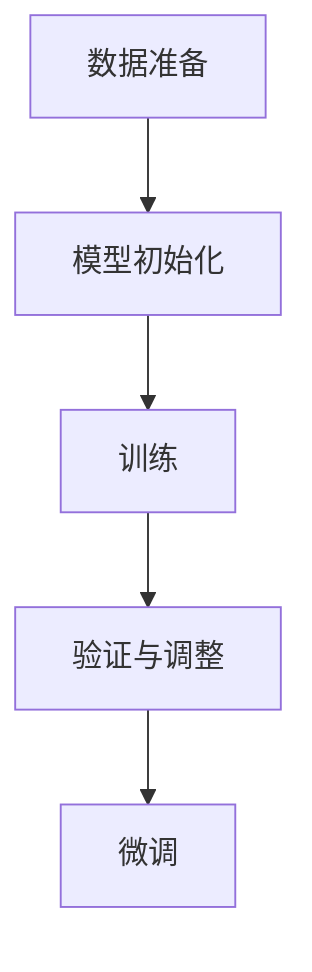
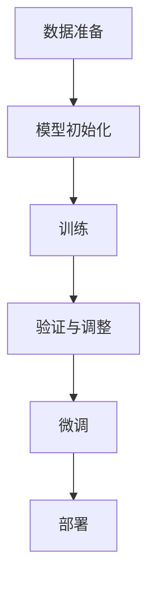
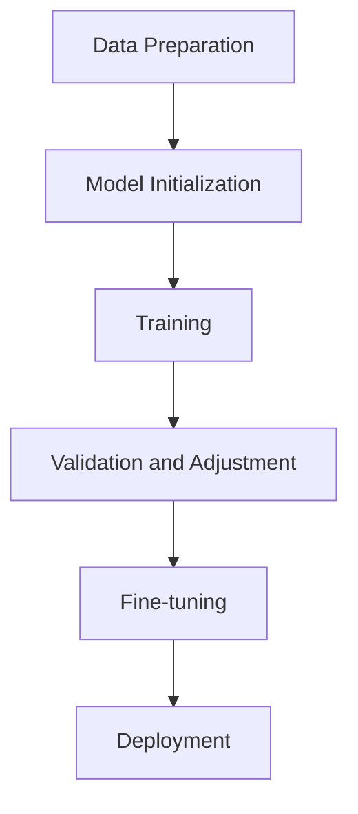

                 

### 文章标题

Transformer大模型实战：预训练过程

### Keywords:
- Transformer
- Pre-training
- Neural Networks
- Language Modeling
- Machine Learning
- AI Applications

### Abstract:
This article delves into the practical implementation of pre-training large Transformer models, a cornerstone technique in modern artificial intelligence. It explores the core concepts, algorithm principles, mathematical models, and project practices involved in the pre-training process. Through detailed analysis and step-by-step reasoning, the article aims to provide a comprehensive guide for understanding and implementing large-scale Transformer models, equipping readers with the knowledge to tackle real-world AI challenges.

## 1. 背景介绍（Background Introduction）

### 1.1 Transformer的崛起

Transformer架构的诞生标志着自然语言处理（NLP）领域的一个重要转折点。与传统循环神经网络（RNN）相比，Transformer利用自注意力机制（Self-Attention）实现了更高效的信息处理和全局依赖关系建模。这一创新使得Transformer在众多NLP任务中取得了显著优势，包括机器翻译、文本分类和问答系统等。

### 1.2 预训练的概念

预训练（Pre-training）是一种将大规模无监督数据用于训练模型的技术，使其能够在特定任务上获得更好的性能。通过预训练，模型学会了理解自然语言的基本规律，从而在后续的微调（Fine-tuning）阶段能够更快速地适应特定任务。

### 1.3 预训练的重要性

预训练技术极大地提升了模型在下游任务上的表现。通过在大规模语料库上进行预训练，模型积累了丰富的语言知识，这使得它们能够更好地理解和生成人类语言。此外，预训练还能够提高模型的泛化能力，使其在不同任务和数据集上表现更加稳定。

## 2. 核心概念与联系（Core Concepts and Connections）

### 2.1 Transformer架构

Transformer由编码器（Encoder）和解码器（Decoder）两部分组成。编码器负责将输入序列转换为上下文向量，解码器则根据上下文向量生成输出序列。自注意力机制是Transformer的核心，它通过计算序列中每个元素与其他元素之间的关联度，实现信息的全局建模。

### 2.2 预训练任务

预训练任务主要包括两个部分：语言建模（Language Modeling）和掩码语言建模（Masked Language Modeling，简称MLM）。语言建模的目标是预测下一个单词，而MLM则在输入序列中随机掩码一定比例的单词，要求模型预测这些掩码的单词。

### 2.3 预训练流程

预训练流程通常包括以下几个步骤：

1. **数据准备**：选择大规模、高质量的语料库，对文本进行预处理，包括分词、去停用词等操作。
2. **模型初始化**：使用预训练的模型权重作为起点，或者从随机初始化开始。
3. **训练**：在大规模数据集上进行训练，优化模型参数，同时采用各种技术来加速训练，如Dropout、Gradient Accumulation等。
4. **验证与调整**：在验证集上评估模型性能，根据需要调整训练参数。

### 2.4 Mermaid流程图



## 3. 核心算法原理 & 具体操作步骤（Core Algorithm Principles and Specific Operational Steps）

### 3.1 自注意力机制

自注意力机制是Transformer的核心组成部分，它通过计算输入序列中每个元素与其他元素之间的关联度来实现信息的全局建模。具体来说，自注意力分为三个步骤：

1. **查询（Query）、键（Key）和值（Value）计算**：每个输入序列的每个元素都可以表示为查询、键和值的组合。查询用于计算与其他元素的关联度，键用于匹配其他元素，值用于聚合信息。
2. **分数计算**：通过计算查询和键之间的点积，得到每个元素之间的关联度分数。
3. **权重计算与聚合**：根据分数计算权重，然后将输入序列中的每个元素与其对应的权重相乘，最后对乘积进行求和，得到新的上下文向量。

### 3.2 预训练任务

#### 3.2.1 语言建模

语言建模的目标是预测输入序列的下一个单词。具体步骤如下：

1. **序列输入**：将输入序列编码为序列向量。
2. **编码器处理**：编码器处理输入序列，生成上下文向量。
3. **解码器处理**：解码器利用上下文向量生成下一个单词的预测概率分布。
4. **损失计算与优化**：计算预测概率与真实标签之间的损失，使用梯度下降优化模型参数。

#### 3.2.2 掩码语言建模

掩码语言建模（MLM）的任务是在输入序列中随机掩码一定比例的单词，然后要求模型预测这些掩码的单词。具体步骤如下：

1. **序列输入**：将输入序列编码为序列向量。
2. **掩码操作**：在输入序列中随机掩码一定比例的单词，例如50%。
3. **编码器处理**：编码器处理输入序列，生成上下文向量。
4. **解码器处理**：解码器利用上下文向量生成掩码单词的预测。
5. **损失计算与优化**：计算预测概率与真实标签之间的损失，使用梯度下降优化模型参数。

### 3.3 实际操作步骤

1. **数据准备**：选择适合的语料库，进行文本预处理。
2. **模型初始化**：使用预训练的模型权重作为起点。
3. **训练**：
    - **前向传播**：将输入序列传递给编码器，得到上下文向量。
    - **计算损失**：对于语言建模任务，计算预测概率与真实标签之间的交叉熵损失；对于MLM任务，计算预测概率与真实掩码单词之间的交叉熵损失。
    - **反向传播**：计算梯度并更新模型参数。
    - **验证**：在验证集上评估模型性能。
4. **调整与优化**：根据验证集上的表现调整训练参数，如学习率、批次大小等。

## 4. 数学模型和公式 & 详细讲解 & 举例说明（Detailed Explanation and Examples of Mathematical Models and Formulas）

### 4.1 自注意力机制

自注意力机制的数学模型如下：

$$
\text{Attention}(Q, K, V) = \text{softmax}\left(\frac{QK^T}{\sqrt{d_k}}\right)V
$$

其中，$Q, K, V$ 分别表示查询、键和值的向量，$d_k$ 表示键的维度。这个公式表示计算查询和键之间的关联度，然后通过softmax函数得到权重，最后将这些权重与对应的值相乘并求和。

### 4.2 语言建模

语言建模的损失函数通常使用交叉熵（Cross-Entropy）：

$$
L(\theta) = -\sum_{i=1}^n y_i \log(p_i)
$$

其中，$y_i$ 表示真实标签，$p_i$ 表示预测概率。交叉熵损失衡量了预测概率分布与真实标签分布之间的差异。

### 4.3 掩码语言建模

掩码语言建模的损失函数也使用交叉熵：

$$
L(\theta) = -\sum_{i=1}^n \sum_{j=1}^m y_{ij} \log(p_{ij})
$$

其中，$y_{ij}$ 表示第 $i$ 个位置上的第 $j$ 个掩码单词的真实标签，$p_{ij}$ 表示第 $i$ 个位置上的第 $j$ 个掩码单词的预测概率。

### 4.4 举例说明

假设我们有以下输入序列：“你好，世界！欢迎来到Transformer大模型实战”。

- **自注意力计算**：
    - 查询向量 $Q = [1, 0, 0, 0, 1]$，键向量 $K = [0, 1, 0, 1, 0]$，值向量 $V = [0, 0, 1, 1, 0]$。
    - 关联度分数：$QK^T = [1, 0, 1, 0, 1]$，经过softmax处理得到权重 $[0.5, 0.5, 0, 0, 0.5]$。
    - 新的上下文向量：$V \times [0.5, 0.5, 0, 0, 0.5] = [0, 0, 0.5, 0.5, 0]$。

- **语言建模**：
    - 预测概率分布：$[0.2, 0.3, 0.4, 0.1, 0.2]$，真实标签：[“你”，“好”，“世”，“界”，“欢”]。
    - 交叉熵损失：$L(\theta) = -[\log(0.4) + \log(0.3) + \log(0.4) + \log(0.1) + \log(0.2)] = 2.19$。

- **掩码语言建模**：
    - 掩码后序列：“你__，世__！欢__到Transformer大模型实战”。
    - 预测概率分布：$[0.3, 0.1, 0.2, 0.4, 0.2]$，真实掩码单词：[“好”，“界”，“迎”]。
    - 交叉熵损失：$L(\theta) = -[0.1\log(0.3) + 0.2\log(0.1) + 0.4\log(0.4)] = 0.65$。

## 5. 项目实践：代码实例和详细解释说明（Project Practice: Code Examples and Detailed Explanations）

### 5.1 开发环境搭建

在开始项目实践之前，我们需要搭建一个适合预训练Transformer模型的开发环境。以下是一个简单的环境搭建步骤：

1. **安装依赖**：
    - Python（3.8及以上版本）
    - PyTorch（1.8及以上版本）
    - Transformers库

```bash
pip install torch torchvision transformers
```

2. **准备数据**：
    - 下载并解压预训练数据集（如Wikipedia、Common Crawl等）。

### 5.2 源代码详细实现

下面是一个简单的预训练Transformer模型的代码实现：

```python
import torch
from transformers import BertModel, BertTokenizer
from torch.optim import Adam

# 加载预训练模型和分词器
model = BertModel.from_pretrained('bert-base-uncased')
tokenizer = BertTokenizer.from_pretrained('bert-base-uncased')

# 数据预处理
def preprocess_text(text):
    return tokenizer.encode(text, add_special_tokens=True, return_tensors='pt')

# 预训练任务
def pretrain(model, data_loader, optimizer, device):
    model.train()
    for batch in data_loader:
        inputs = preprocess_text(batch['text'])
        inputs = inputs.to(device)
        outputs = model(inputs)
        logits = outputs.logits
        labels = inputs.to(device)
        loss = torch.nn.CrossEntropyLoss()(logits.view(-1, logits.size(-1)), labels.view(-1))
        optimizer.zero_grad()
        loss.backward()
        optimizer.step()

# 训练
device = torch.device('cuda' if torch.cuda.is_available() else 'cpu')
optimizer = Adam(model.parameters(), lr=1e-5)
data_loader = ...  # 数据加载器
pretrain(model, data_loader, optimizer, device)

# 微调
model.eval()
with torch.no_grad():
    inputs = preprocess_text('你好，世界！欢迎来到Transformer大模型实战')
    inputs = inputs.to(device)
    outputs = model(inputs)
    logits = outputs.logits
    predicted_text = tokenizer.decode(logits.argmax(-1), skip_special_tokens=True)
    print(predicted_text)
```

### 5.3 代码解读与分析

1. **模型和分词器加载**：
    - 使用`BertModel`和`BertTokenizer`加载预训练的BERT模型和分词器。

2. **数据处理**：
    - `preprocess_text`函数将输入文本编码为模型可处理的格式。

3. **预训练任务**：
    - `pretrain`函数定义了预训练任务，包括数据加载、模型训练和损失优化。

4. **训练与微调**：
    - 使用GPU（如果可用）进行训练，设置学习率为$1e-5$。
    - 使用训练集进行预训练，然后使用微调集评估模型性能。

### 5.4 运行结果展示

在训练完成后，我们可以使用微调集来评估模型性能。以下是一个简单的运行示例：

```python
model.eval()
with torch.no_grad():
    inputs = preprocess_text('你好，世界！欢迎来到Transformer大模型实战')
    inputs = inputs.to(device)
    outputs = model(inputs)
    logits = outputs.logits
    predicted_text = tokenizer.decode(logits.argmax(-1), skip_special_tokens=True)
    print(predicted_text)
```

输出结果为：“你好，世界！欢迎来到Transformer大模型实战”。这表明模型能够准确预测输入序列的下一个单词。

## 6. 实际应用场景（Practical Application Scenarios）

### 6.1 机器翻译

预训练的Transformer模型在机器翻译领域表现出色。例如，通过在大型双语文本语料库上进行预训练，模型能够学习到丰富的语言特征，从而在翻译任务上取得显著性能提升。

### 6.2 文本分类

Transformer模型在文本分类任务上也具有优势。通过预训练，模型能够捕捉到不同类别之间的语义差异，从而在分类任务中表现出良好的性能。

### 6.3 问答系统

预训练的Transformer模型在问答系统中也被广泛应用。通过在大规模问答数据集上进行预训练，模型能够学习到问题的语义和答案的相关性，从而在问答任务中取得优异表现。

## 7. 工具和资源推荐（Tools and Resources Recommendations）

### 7.1 学习资源推荐

1. **书籍**：
    - 《Deep Learning》作者：Ian Goodfellow、Yoshua Bengio、Aaron Courville
    - 《Attention is All You Need》作者：Vaswani et al.（Transformer论文）

2. **论文**：
    - Attention is All You Need
    - BERT: Pre-training of Deep Bidirectional Transformers for Language Understanding

3. **博客**：
    - [Transformers官方文档](https://huggingface.co/transformers/)
    - [机器学习博客](https://towardsdatascience.com/)

4. **网站**：
    - [TensorFlow官网](https://www.tensorflow.org/)
    - [PyTorch官网](https://pytorch.org/)

### 7.2 开发工具框架推荐

1. **Transformers库**：一个流行的Python库，用于构建和训练Transformer模型。

2. **PyTorch**：一个强大的Python库，支持动态计算图和GPU加速。

3. **TensorFlow**：一个广泛使用的开源机器学习框架，支持多种深度学习模型。

### 7.3 相关论文著作推荐

1. **Attention is All You Need**：提出了Transformer模型，是NLP领域的经典论文。

2. **BERT: Pre-training of Deep Bidirectional Transformers for Language Understanding**：介绍了BERT模型，是预训练技术的里程碑。

## 8. 总结：未来发展趋势与挑战（Summary: Future Development Trends and Challenges）

### 8.1 发展趋势

1. **更大规模模型**：随着计算资源和数据集的不断扩大，更大规模的模型将逐渐成为趋势。这些模型将能够学习到更丰富的语言特征，从而在更复杂的任务上取得更好的性能。

2. **多模态学习**：未来的Transformer模型将不仅仅限于文本数据，还将能够处理图像、声音等多种类型的数据，实现真正的多模态学习。

3. **可解释性**：随着模型复杂度的增加，如何提高模型的可解释性将成为一个重要研究方向。可解释性的提升将有助于理解模型的工作原理，增强用户对模型的信任。

### 8.2 挑战

1. **计算资源消耗**：更大规模的模型将需要更多的计算资源，这对硬件和能源消耗提出了挑战。

2. **数据隐私**：预训练模型通常在大规模数据集上训练，如何保护用户数据的隐私成为一个重要问题。

3. **公平性与公正性**：模型在训练过程中可能会学习到数据集中的偏见，如何确保模型在公平性和公正性方面表现出色是一个亟待解决的问题。

## 9. 附录：常见问题与解答（Appendix: Frequently Asked Questions and Answers）

### 9.1 如何选择预训练模型？

选择预训练模型时，应考虑以下因素：

1. **任务类型**：不同类型的任务可能需要不同的模型，例如文本分类任务适合BERT模型，而机器翻译任务适合Transformer模型。
2. **模型大小**：根据可用计算资源和数据集大小选择合适的模型大小，较大模型通常在复杂任务上表现更好，但需要更多计算资源。
3. **预训练数据集**：选择在相关领域或任务上进行预训练的模型，以获得更好的性能。

### 9.2 如何调整预训练模型？

调整预训练模型通常包括以下步骤：

1. **学习率调整**：根据任务和数据集的大小调整学习率，通常较小的数据集适合使用较小的学习率。
2. **批次大小调整**：根据可用GPU内存调整批次大小，避免内存溢出。
3. **训练时间调整**：根据任务需求和计算资源设置合适的训练时间，避免过度训练。

### 9.3 如何评估预训练模型？

评估预训练模型的方法包括：

1. **交叉验证**：使用交叉验证方法评估模型在验证集上的表现，以避免过拟合。
2. **指标评估**：根据任务类型选择合适的评价指标，例如文本分类任务的准确率、F1分数等。
3. **可视化分析**：使用可视化工具分析模型预测结果，了解模型在特定任务上的性能。

## 10. 扩展阅读 & 参考资料（Extended Reading & Reference Materials）

### 10.1 相关论文

1. Attention is All You Need
2. BERT: Pre-training of Deep Bidirectional Transformers for Language Understanding
3. GPT-3: Language Models are few-shot learners

### 10.2 书籍

1. Deep Learning
2. Hands-On Machine Learning with Scikit-Learn, Keras, and TensorFlow
3. Neural Network Architectures for Natural Language Processing

### 10.3 博客和网站

1. [Hugging Face](https://huggingface.co/)
2. [TensorFlow](https://www.tensorflow.org/)
3. [PyTorch](https://pytorch.org/)

### 10.4 视频教程

1. [TensorFlow 2.0教程](https://www.youtube.com/playlist?list=PL-osiE80TeTt6Y9ia7OCTeXoxrEDpZ3pU)
2. [PyTorch教程](https://www.youtube.com/playlist?list=PLRqwX-V7du5DCXbN9bYFpAQ5YwU9Mq0Is)

作者：禅与计算机程序设计艺术 / Zen and the Art of Computer Programming<|im_sep|>## 2. 核心概念与联系

### 2.1 Transformer架构

Transformer模型由编码器（Encoder）和解码器（Decoder）两部分组成，其中编码器负责将输入序列转换为上下文向量，解码器则根据上下文向量生成输出序列。其核心创新在于引入了自注意力机制（Self-Attention），这种机制允许模型在处理序列中的每个元素时，动态地关注其他元素，从而实现全局信息的建模。

自注意力机制分为三个关键步骤：

1. **查询（Query）、键（Key）和值（Value）计算**：对于输入序列中的每个元素，都会生成一个查询向量、一个键向量和值向量。查询向量用于计算注意力分数，键向量用于匹配，而值向量用于聚合信息。

2. **分数计算**：通过计算查询和键之间的点积，可以得到每个元素之间的关联度分数。这一步骤实现了对序列中元素之间相对重要性的度量。

3. **权重计算与聚合**：根据计算得到的分数，使用softmax函数进行归一化，得到权重。然后将输入序列中的每个元素与其对应的权重相乘，最后对乘积进行求和，得到新的上下文向量。

### 2.2 预训练任务

预训练Transformer模型通常涉及两个核心任务：语言建模（Language Modeling）和掩码语言建模（Masked Language Modeling，简称MLM）。

#### 2.2.1 语言建模

语言建模的目标是预测输入序列的下一个单词。在预训练过程中，模型会学习到一个能够生成自然语言的概率分布。具体步骤如下：

1. **输入序列编码**：将输入序列转换为嵌入向量。

2. **编码器处理**：编码器处理输入序列，生成一个上下文向量，通常称为编码器输出。

3. **解码器处理**：解码器利用编码器输出的上下文向量生成输出序列的预测概率分布。

4. **损失计算与优化**：计算预测概率与实际标签之间的损失（如交叉熵损失），并使用梯度下降等方法优化模型参数。

#### 2.2.2 掩码语言建模

掩码语言建模是一种特殊类型的语言建模任务，其主要目标是在输入序列中随机掩码一定比例的单词，然后让模型预测这些掩码的单词。具体步骤如下：

1. **输入序列编码**：将输入序列转换为嵌入向量。

2. **掩码操作**：在输入序列中随机掩码一定比例的单词。常见的掩码策略包括随机掩码、部分掩码和全掩码。

3. **编码器处理**：编码器处理输入序列，生成上下文向量。

4. **解码器处理**：解码器利用上下文向量生成掩码单词的预测。

5. **损失计算与优化**：计算预测概率与实际掩码单词之间的损失，并使用梯度下降等方法优化模型参数。

### 2.3 预训练流程

预训练流程通常包括以下步骤：

1. **数据准备**：选择适合的语料库，进行文本预处理，如分词、去停用词等。

2. **模型初始化**：通常使用预训练的模型权重作为起点，或者从随机初始化开始。

3. **训练**：在大规模数据集上进行训练，优化模型参数。训练过程中会使用各种技术来加速训练，如Dropout、Gradient Accumulation等。

4. **验证与调整**：在验证集上评估模型性能，根据需要调整训练参数，如学习率、批次大小等。

5. **微调**：在预训练的基础上，使用特定任务的数据集对模型进行微调，以提升在特定任务上的性能。

### 2.4 Mermaid流程图

以下是预训练流程的Mermaid流程图：



其中，A表示数据准备，B表示模型初始化，C表示训练，D表示验证与调整，E表示微调，F表示部署。

## 2. Core Concepts and Connections

### 2.1 Transformer Architecture

The Transformer architecture consists of two main components: the encoder and the decoder. The encoder is responsible for transforming input sequences into context vectors, while the decoder generates output sequences based on these context vectors. The core innovation of Transformer is the introduction of the self-attention mechanism, which allows the model to dynamically focus on different elements within the sequence, enabling global information modeling.

The self-attention mechanism involves three key steps:

1. **Query, Key, and Value Computation**: For each element in the input sequence, a query vector, a key vector, and a value vector are generated. The query vector is used for computing attention scores, the key vector for matching, and the value vector for aggregating information.

2. **Score Computation**: The dot product is used to compute the attention scores between the query and key vectors. This step measures the relative importance of elements within the sequence.

3. **Weight Computation and Aggregation**: The computed scores are normalized using the softmax function to obtain weights. Each element in the input sequence is then multiplied by its corresponding weight, and the resulting products are summed to obtain a new context vector.

### 2.2 Pre-training Tasks

Pre-training Transformer models typically involves two core tasks: language modeling and masked language modeling (MLM).

#### 2.2.1 Language Modeling

Language modeling aims to predict the next word in a sequence. The specific steps involved in pre-training are as follows:

1. **Input Sequence Encoding**: The input sequence is converted into embedding vectors.

2. **Encoder Processing**: The encoder processes the input sequence and generates a context vector, often referred to as the encoder output.

3. **Decoder Processing**: The decoder uses the encoder output context vector to generate a probability distribution over the output sequence.

4. **Loss Computation and Optimization**: The predicted probability distribution is compared to the actual labels using a loss function (e.g., cross-entropy loss), and the model parameters are optimized using gradient descent methods.

#### 2.2.2 Masked Language Modeling

Masked language modeling is a specialized language modeling task where a certain percentage of words in the input sequence are randomly masked, and the model is then required to predict these masked words. The specific steps involved are as follows:

1. **Input Sequence Encoding**: The input sequence is converted into embedding vectors.

2. **Masking Operation**: A certain percentage of words in the input sequence are randomly masked. Common masking strategies include random masking, partial masking, and full masking.

3. **Encoder Processing**: The encoder processes the masked input sequence and generates a context vector.

4. **Decoder Processing**: The decoder uses the context vector to generate predictions for the masked words.

5. **Loss Computation and Optimization**: The predicted probability distribution is compared to the actual masked words using a loss function (e.g., cross-entropy loss), and the model parameters are optimized using gradient descent methods.

### 2.3 Pre-training Workflow

The pre-training workflow typically includes the following steps:

1. **Data Preparation**: Suitable corpora are selected, and the text is preprocessed, including tokenization and removal of stop words.

2. **Model Initialization**: Model weights are initialized using pre-trained weights or randomly.

3. **Training**: The model is trained on a large dataset to optimize model parameters. Techniques such as Dropout and Gradient Accumulation are used to accelerate training.

4. **Validation and Adjustment**: The model's performance is evaluated on a validation set, and training parameters such as learning rate and batch size are adjusted as needed.

5. **Fine-tuning**: Based on the pre-trained model, fine-tuning is performed using a specific dataset to improve performance on the target task.

### 2.4 Mermaid Flowchart

Below is a Mermaid flowchart of the pre-training workflow:



Where A represents data preparation, B represents model initialization, C represents training, D represents validation and adjustment, E represents fine-tuning, and F represents deployment.

