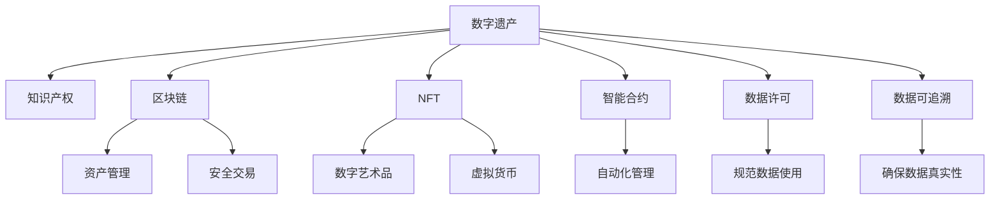

                 

# 知识产权与数字遗产的继承

> 关键词：知识产权, 数字遗产, 继承, 法律保护, 区块链, NFT, 智能合约, 数据许可, 数据可追溯

## 1. 背景介绍

### 1.1 问题由来
随着数字化和互联网技术的发展，数字资产、虚拟财产和数字知识产权正逐渐成为现代社会的重要组成部分。与此同时，人们对于数字遗产的继承、保护和利用也日益关注。传统财产继承方式难以适应数字资产的特性，传统的知识产权法律体系也需要更新以应对新问题。

近年来，随着区块链、NFT（Non-Fungible Tokens）、智能合约等技术的兴起，使得数字资产和数字知识产权的继承和保护变得更为可行。然而，这些技术的应用还面临诸如法律定位、继承权界定、隐私保护等诸多挑战。本文旨在梳理和分析知识产权与数字遗产的继承问题，探讨区块链和NFT在其中的应用，并提出相应的法律建议和技术解决方案。

### 1.2 问题核心关键点
1. **数字资产的界定与保护**：
   - 数字资产包括但不限于知识产权、数字内容、虚拟货币等，其所有权、使用权和继承权界定复杂。

2. **数字遗产的继承方式**：
   - 传统遗产继承方式不适用于数字遗产，需要创新方法确保数字资产的有效传递。

3. **知识产权的法律保护**：
   - 知识产权的归属、保护期限和许可问题需要明确。

4. **区块链和NFT的适用性**：
   - 区块链和NFT技术在数字遗产管理和继承中的作用和局限性。

5. **智能合约的运用**：
   - 利用智能合约进行数字资产的自动化管理和继承。

6. **隐私与数据安全**：
   - 在数字遗产继承过程中保护用户隐私和数据安全。

### 1.3 问题研究意义
研究数字遗产与知识产权的继承问题，对促进数字化时代的法律体系完善、数字资产的合法合规流通、保护数字权益者利益具有重要意义。通过探索区块链、NFT和智能合约等技术在数字遗产继承中的应用，可以为数字经济的健康发展提供保障，同时为未来立法和政策制定提供参考。

## 2. 核心概念与联系

### 2.1 核心概念概述

为更好地理解数字遗产和知识产权继承的技术框架，本节将介绍几个密切相关的核心概念：

- **数字遗产(Digital Estate)**：指个人或企业在数字世界的财产和权益，包括但不限于数字内容、网站、社交媒体账户、加密货币等。

- **知识产权(Intellectual Property, IP)**：指创作者对其作品所享有的专有权，包括版权、专利权、商标权等。

- **区块链(Blockchain)**：一种分布式账本技术，通过加密手段保证数据的不可篡改性和透明性，常用于数字资产管理和交易。

- **NFT(Non-Fungible Tokens)**：一种基于区块链的数字资产，具有不可分割、独一无二的特性，广泛应用于数字艺术品、音乐、游戏等领域。

- **智能合约(Smart Contracts)**：一种自动执行的合约，通过代码逻辑保证合约条款的执行，常用于自动化资产管理和交易。

- **数据许可(Data Licensing)**：指数据使用权、授权和许可协议，用于规范数据的使用和管理。

- **数据可追溯(Data Traceability)**：指确保数据来源、传输和使用过程可追溯的技术手段。

这些核心概念之间的逻辑关系可以通过以下Mermaid流程图来展示：



这个流程图展示了一些关键概念之间的关系：

1. 数字遗产包含知识产权，区块链和NFT用于资产管理和交易，智能合约用于自动化管理，数据许可和可追溯用于规范数据使用。
2. 区块链和智能合约技术可以增强数字遗产的管理和交易安全性。

## 3. 核心算法原理 & 具体操作步骤

### 3.1 算法原理概述

数字遗产和知识产权的继承涉及多个层面的问题，包括数字资产的界定、所有权转移、许可协议的执行、数据可追溯性等。本文将从法律和技术两个维度出发，探讨如何通过区块链、NFT和智能合约等技术手段，确保数字资产和知识产权的有效继承和保护。

### 3.2 算法步骤详解

**Step 1: 数字资产的界定与记录**
- 使用区块链技术，对数字资产进行去中心化的记录和验证，确保资产归属清晰可追溯。
- 将数字资产的相关信息（如创建时间、版权信息等）记录在区块链上，形成不可篡改的记录。

**Step 2: 智能合约的创建与执行**
- 根据数字遗产继承需求，编写智能合约，定义继承规则、条件和期限等。
- 通过智能合约自动执行继承过程，减少人为干预和潜在的争议。

**Step 3: NFT的生成与转让**
- 将数字资产封装成NFT，利用NFT的唯一性和不可转让性特性，确保继承权的独占性和安全性。
- 通过区块链平台进行NFT的生成、转让和验证，保证转让过程透明、安全。

**Step 4: 数据许可的设定与管理**
- 制定数据许可协议，明确数据的使用范围、期限和限制。
- 利用智能合约和区块链技术，自动执行数据许可协议，保障数据使用的合规性。

**Step 5: 继承权确认与纠纷解决**
- 通过智能合约验证继承权的合法性，确保继承过程的透明公正。
- 引入区块链上的公证机制，解决可能出现的继承纠纷。

### 3.3 算法优缺点

数字遗产和知识产权的继承使用区块链、NFT和智能合约等技术，具有以下优点：

1. **透明性和不可篡改性**：区块链技术保证了资产和交易记录的透明性和不可篡改性，减少了争议和纠纷。
2. **自动化与高效性**：智能合约实现了自动化管理，提高了继承和交易的效率。
3. **安全性与隐私保护**：NFT和智能合约通过加密手段保护资产和数据的安全性，同时确保用户隐私。

同时，这些技术也存在一些局限性：

1. **技术复杂性**：区块链和智能合约技术门槛较高，需要专业的技术支持和维护。
2. **法律和合规性**：现有法律体系对数字遗产和知识产权的继承问题尚未完全明确，相关法规和标准仍需完善。
3. **成本问题**：区块链和智能合约的部署和运行成本较高，可能对小型用户不适用。

### 3.4 算法应用领域

数字遗产和知识产权的继承技术可以在以下领域得到广泛应用：

1. **数字内容与媒体产业**：包括音乐、影视、文学等数字内容的版权管理和许可。
2. **数字艺术品与收藏**：如数字绘画、雕塑等艺术品的创作、转让和继承。
3. **虚拟货币与加密资产**：比特币、以太坊等虚拟货币的继承和管理。
4. **游戏与虚拟世界**：虚拟角色的所有权、装备和资产的继承和转让。
5. **科学研究与数据管理**：科研数据、实验结果的记录、共享和继承。

## 4. 数学模型和公式 & 详细讲解

### 4.1 数学模型构建

数字遗产和知识产权的继承问题可以通过以下数学模型进行抽象描述：

设数字资产 $A_i$ 的归属为 $P_i$，版权期限为 $T_i$，许可协议为 $L_i$，数据许可协议为 $D_i$。则数字遗产继承问题可以表示为以下优化问题：

$$
\min_{P_i, T_i, L_i, D_i} \sum_{i} C_i(P_i, T_i, L_i, D_i)
$$

其中 $C_i$ 为损失函数，包括时间成本、管理成本和法律风险等。

### 4.2 公式推导过程

以智能合约为例，智能合约的执行过程可以通过以下步骤进行：

1. **合约编写**：根据继承规则编写智能合约，定义继承条件、时间点等。
2. **合约部署**：将智能合约部署到区块链上，生成智能合约地址。
3. **合约调用**：触发智能合约的执行过程，验证继承条件是否满足。
4. **资产转移**：根据合约规则自动完成数字资产的继承和转让。

### 4.3 案例分析与讲解

以音乐版权为例，其智能合约的执行过程如下：

1. **合约编写**：设定版权期限为50年，继承条件为版权持有者去世后自动转让给指定继承人。
2. **合约部署**：将智能合约部署到以太坊区块链上，生成合约地址。
3. **合约调用**：当版权持有者去世后，智能合约自动验证继承条件是否满足，并执行转让操作。
4. **资产转移**：智能合约将版权记录转移到指定继承人，完成继承过程。

## 5. 项目实践：代码实例和详细解释说明

### 5.1 开发环境搭建

在进行数字遗产和知识产权继承的技术实践前，我们需要准备好开发环境。以下是使用Python和Solidity进行区块链开发的环境配置流程：

1. 安装Node.js：
   ```bash
   curl -fsSL https://deb.nodesource.com/setup_16.x | sudo -E bash -
   sudo apt-get install -y nodejs
   ```

2. 安装Truffle和Ganache：
   ```bash
   npm install -g truffle ganache-cli
   ```

3. 安装OpenSSL和Web3.js：
   ```bash
   apt-get install openssl
   npm install web3
   ```

完成上述步骤后，即可在本地搭建起基本的区块链开发环境。

### 5.2 源代码详细实现

以下是一个简单的智能合约示例，用于数字版权的继承管理：

```solidity
// SPDX-License-Identifier: MIT
pragma solidity ^0.8.0;

contract DigitalCopyright {
    address private owner;
    address[] private inheritors;
    uint256 private copyrightTerm;
    bool private isInherited = false;

    event OwnershipTransferred(
        address indexed previousOwner,
        address indexed newOwner
    );

    constructor(address[] memory _inheritors, uint256 _copyrightTerm) {
        inheritors = _inheritors;
        copyrightTerm = _copyrightTerm;
        owner = msg.sender;
    }

    function addInheritor(address _inheritor) public {
        inheritors.push(_inheritor);
    }

    function verifyCondition(uint256 now) public view returns (bool) {
        return !isInherited && now >= copyrightTerm;
    }

    function executeInheritance(uint256 now) public onlyOwner {
        require(verifyCondition(now), "Inheritance condition not satisfied");
        isInherited = true;
        emit OwnershipTransferred(owner, inheritors[0]);
    }
}
```

该合约定义了数字版权的持有者、继承者、版权期限和继承条件，通过智能合约的自动化执行，实现了数字版权的继承管理。

### 5.3 代码解读与分析

让我们再详细解读一下关键代码的实现细节：

**DigitalCopyright合约**：
- `constructor`方法：初始化持有者、继承者列表和版权期限。
- `addInheritor`方法：向继承者列表中添加新的继承人。
- `verifyCondition`方法：验证继承条件是否满足，返回布尔值。
- `executeInheritance`方法：执行继承操作，转移版权记录。

**智能合约部署**：
- 使用Truffle框架编译合约代码，并部署到Ganache等本地测试网络中。
- 在以太坊区块链上验证智能合约的执行过程。

**数据许可协议**：
- 定义数据许可协议的规范，使用智能合约和区块链技术自动执行数据许可协议，保障数据使用的合规性。

## 6. 实际应用场景

### 6.1 数字内容的版权管理

在数字内容的版权管理中，智能合约和NFT技术可以发挥重要作用。例如，音乐、影视作品的版权可以封装成NFT，通过智能合约进行版权的自动管理。创作者可以设置版权期限、许可范围等条件，智能合约根据这些条件自动执行版权转让。

### 6.2 数字艺术品的转让与继承

数字艺术品如数字绘画、雕塑等，可以通过NFT技术进行唯一的标记和转让。创作者可以在NFT中记录艺术品的详细信息，通过智能合约确保艺术品的合法继承和转让。

### 6.3 虚拟货币与加密资产的继承

虚拟货币如比特币、以太坊等，可以通过区块链技术进行安全的继承和管理。通过智能合约设定继承规则，确保虚拟货币的合法继承和转让。

### 6.4 游戏与虚拟世界的资产管理

游戏中的虚拟资产如装备、角色等，可以通过NFT和智能合约进行管理和继承。玩家可以将虚拟资产封装成NFT，设定继承规则，通过智能合约确保资产的合法继承。

### 6.5 科学研究与数据管理

科学研究中的数据、实验结果可以通过区块链和智能合约进行记录、共享和继承。研究人员可以设定数据的使用范围、期限等条件，确保数据的合规使用。

## 7. 工具和资源推荐

### 7.1 学习资源推荐

为了帮助开发者系统掌握区块链和NFT技术，以下推荐一些优质的学习资源：

1. **《Mastering Blockchain with Solidity》**：一本详细介绍Solidity编程的书籍，适合初学者和高级开发者。
2. **Ethereum官方网站**：提供丰富的以太坊开发文档和资源。
3. **OpenSea和Rarible**：NFT交易平台，提供丰富的NFT创建和交易资源。
4. **Blockchain.org**：提供区块链技术的入门教程和资源。
5. **CryptoZombies**：一款通过游戏形式学习Solidity编程的交互式教程。

### 7.2 开发工具推荐

高效的区块链和NFT开发离不开优秀的工具支持。以下是几款常用的工具：

1. **Truffle**：Ethereum开发框架，提供智能合约的开发、测试和部署功能。
2. **Remix**：Ethereum开发环境，支持Solidity代码的编写和测试。
3. **Metamask**：以太坊钱包，支持智能合约的调用和管理。
4. **OpenSea**：NFT交易平台，支持NFT的创建、交易和管理。
5. **Infura**：Ethereum节点服务，提供免费的以太坊节点访问。

合理利用这些工具，可以显著提升区块链和NFT的开发效率，加快创新迭代的步伐。

### 7.3 相关论文推荐

区块链和NFT技术的发展源于学界的持续研究。以下是几篇奠基性的相关论文，推荐阅读：

1. **Blockchain Technology and its Adoption for Intellectual Property Rights**：探讨区块链技术在知识产权管理中的应用。
2. **Smart Contracts in Property Law**：研究智能合约在财产管理和继承中的应用。
3. **The Economics of NFTs: Insights from the Art Market**：分析NFT在数字艺术品和收藏中的经济价值。
4. **Intellectual Property and Digital Rights Management**：讨论数字知识产权管理和保护的法律和政策问题。
5. **Blockchain-Based Digital Rights Management System**：提出基于区块链的数字版权管理系统，实现版权的自动化管理和保护。

这些论文代表了大规模区块链和NFT技术的研究方向。通过学习这些前沿成果，可以帮助研究者把握学科前进方向，激发更多的创新灵感。

## 8. 总结：未来发展趋势与挑战

### 8.1 研究成果总结

本文对数字遗产和知识产权的继承问题进行了全面系统的介绍。首先阐述了数字资产和数字遗产的界定、保护和继承方式，明确了法律和技术层面的挑战。其次，通过区块链、NFT和智能合约等技术手段，探讨了数字遗产和知识产权的继承和管理方法。最后，提出了相应的法律建议和技术解决方案。

通过本文的系统梳理，可以看到，数字遗产和知识产权的继承问题涉及多个学科，需要跨学科的合作和研究。区块链、NFT和智能合约等技术为数字遗产和知识产权的继承提供了新的解决方案，但仍面临法律、技术、成本等诸多挑战。

### 8.2 未来发展趋势

展望未来，数字遗产和知识产权的继承技术将呈现以下几个发展趋势：

1. **技术生态的完善**：区块链、NFT和智能合约技术将进一步发展，形成更完善的生态系统，支持更多类型的数字资产管理。
2. **跨链互操作性**：不同区块链平台之间的互操作性将提升，数字资产可以在多平台之间无缝转移和继承。
3. **隐私保护与合规性**：隐私保护技术将进一步完善，同时相关法规和标准也将逐步明确，确保数字遗产和知识产权的合法合规使用。
4. **自动化与智能化**：智能合约和自动化工具将更广泛应用，提高数字遗产管理的自动化和智能化水平。
5. **用户体验优化**：用户体验设计将得到重视，通过友好的界面和操作方式，降低数字遗产管理的复杂度。

这些趋势将推动数字遗产和知识产权的继承技术进一步成熟，为数字经济的健康发展提供保障。

### 8.3 面临的挑战

尽管数字遗产和知识产权的继承技术已经取得了初步成果，但在迈向更加智能化、普适化应用的过程中，仍面临诸多挑战：

1. **技术复杂性与普及性**：区块链、NFT和智能合约技术门槛较高，需要专业的技术支持和用户教育。
2. **法律和合规性**：现有法律体系对数字遗产和知识产权的继承问题尚未完全明确，相关法规和标准仍需完善。
3. **成本问题**：区块链和智能合约的部署和运行成本较高，可能对小型用户不适用。
4. **隐私保护**：如何在确保数字遗产安全性的同时，保护用户隐私，是一个需要解决的重要问题。
5. **安全性与可信赖性**：如何确保区块链和智能合约系统的安全性，建立用户和市场的信任，是一个关键挑战。

### 8.4 研究展望

面向未来，数字遗产和知识产权的继承技术需要在以下几个方面寻求新的突破：

1. **简化技术与降低门槛**：通过优化区块链和智能合约的部署和运行方式，降低技术复杂性，提升用户体验。
2. **完善法规与标准**：推动相关法律法规的完善，明确数字遗产和知识产权的归属、许可等问题。
3. **跨平台互操作性**：促进不同区块链平台之间的互操作性，实现数字资产的跨平台继承和管理。
4. **隐私保护与数据安全**：引入隐私保护技术，确保用户数据的安全性和隐私性。
5. **可信赖与透明度**：建立可信的数字资产管理系统，提高系统的透明度和可信赖度。

这些研究方向的探索，将推动数字遗产和知识产权继承技术进一步发展，为数字化时代的法律和市场体系提供保障。

## 9. 附录：常见问题与解答

**Q1：数字遗产和知识产权的继承与传统继承方式有何不同？**

A: 数字遗产和知识产权的继承涉及数字资产的界定、记录和转移，而传统继承方式主要针对物理财产。数字遗产和知识产权的继承具有复杂性，需要借助区块链、NFT和智能合约等技术手段进行管理和保护。

**Q2：数字遗产继承的智能合约如何设计？**

A: 智能合约的设计应包括数字资产的界定、所有权转移、继承条件和纠纷解决等关键要素。需要明确继承条件、时间点、继承规则等，确保继承过程的透明和公正。

**Q3：区块链和NFT在数字遗产继承中的作用是什么？**

A: 区块链提供了去中心化的记录和验证机制，保证了数字资产归属和交易的透明性和不可篡改性。NFT通过唯一性和不可转让性特性，确保数字资产的合法继承和转让。

**Q4：如何确保数字遗产继承过程中的安全性？**

A: 利用区块链和智能合约技术，确保数字资产和交易记录的安全性。通过加密手段保护资产和数据的安全性，同时确保用户隐私。

**Q5：数字遗产继承面临哪些法律和合规性问题？**

A: 数字遗产和知识产权的继承涉及多个法律领域，如版权法、隐私法、合同法等。相关法规和标准尚未完全明确，需要进一步研究和制定。

总之，数字遗产和知识产权的继承问题是一个复杂的跨学科研究课题。区块链、NFT和智能合约等技术为解决这些问题提供了新的方法和思路，但还需要进一步的探索和实践。希望本文能为相关研究和应用提供有价值的参考和指导。

---

作者：禅与计算机程序设计艺术 / Zen and the Art of Computer Programming

