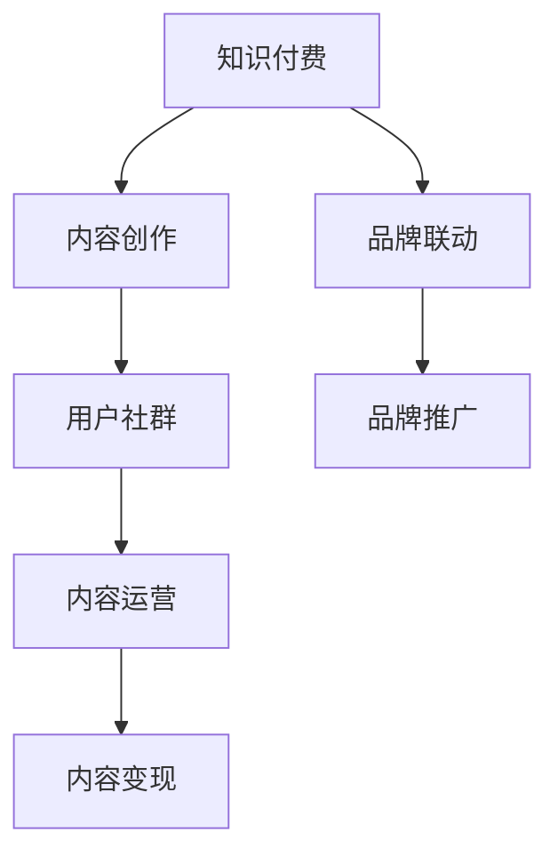

                 

# 知识付费与个人品牌塑造的协同效应

> 关键词：知识付费,个人品牌,内容创作,用户社群,内容运营

## 1. 背景介绍

### 1.1 问题由来
随着互联网的普及和数字化转型，知识付费市场正迅速崛起。越来越多的个人和机构开始在线提供高质量的知识内容，通过订阅模式或按需购买获取收益。与此同时，个人品牌塑造也成为了网络时代的热门话题。在社交媒体、自媒体等平台，个人通过分享自己的专业知识、经验见解，不断提升知名度和影响力，逐渐形成个人品牌。

知识付费和个人品牌塑造的结合，为内容创作者提供了新的商业机会，也为受众带来了更丰富的知识和体验。但同时也带来了一系列新的挑战和问题，如内容质量如何保证、如何有效运营用户社群、如何实现内容变现等。本文旨在探讨知识付费与个人品牌塑造的协同效应，以及如何利用这一协同效应提升内容质量和品牌价值。

### 1.2 问题核心关键点
知识付费和个人品牌塑造的协同效应主要体现在以下几个方面：

1. **内容质量与品牌价值**：高质量的内容是知识付费平台的核心竞争力，也是个人品牌塑造的基础。创作者通过精心设计、持续迭代的内容，吸引用户订阅，提升品牌影响力。
2. **用户互动与社群建设**：知识付费平台为创作者与用户提供了互动空间，创作者可以通过回答用户问题、定期更新内容等方式，增强与用户的粘性，构建忠实的粉丝社群。
3. **内容变现与品牌推广**：高质量的内容吸引用户付费订阅，同时品牌知名度和影响力的提升，又可以帮助创作者吸引更多用户，形成良性循环。
4. **跨界合作与品牌联动**：个人品牌可以通过与行业内外的品牌合作，扩大影响力，同时也可以借助其他品牌的影响力，提升自身品牌的知名度。

## 2. 核心概念与联系

### 2.1 核心概念概述

为更好地理解知识付费与个人品牌塑造的协同效应，本节将介绍几个密切相关的核心概念：

- **知识付费**：指用户为获取高质量知识内容而支付费用的商业模式，包括订阅、按需购买等多种形式。知识付费平台如得到、喜马拉雅、网易云课堂等，为创作者提供了内容分发和变现的渠道。

- **个人品牌**：指个人在特定领域内建立的品牌形象，通过持续的内容输出和互动，形成独特的品牌标识和影响力。个人品牌包括知识型、技术型、创意型等多种类型。

- **内容创作**：指个人或机构生产、制作和发布知识内容的过程，包括文字、音频、视频等多种形式。内容创作者需要具备专业知识、创意设计和媒体传播能力。

- **用户社群**：指围绕特定品牌或内容创作者构建的社交群体，用户通过订阅、评论、分享等方式参与到内容互动中，形成虚拟社区。

- **内容运营**：指对内容创作和用户互动的策略规划和执行过程，包括内容策划、用户互动管理、社群建设等，目的是提升内容质量和用户满意度。

- **内容变现**：指通过内容产出获取商业收入的过程，包括广告、付费订阅、会员增值服务等多种方式。

- **品牌联动**：指不同品牌之间通过合作，共同推广品牌形象和产品，提升品牌影响力和市场覆盖面。

这些核心概念之间的逻辑关系可以通过以下Mermaid流程图来展示：



这个流程图展示的知识付费和个人品牌塑造的核心概念及其之间的关系：

1. 知识付费平台为内容创作者提供了分发和变现的渠道。
2. 内容创作者通过持续的内容创作，吸引用户订阅，形成社群互动。
3. 内容运营对内容创作和用户互动进行策略规划和执行。
4. 内容变现通过广告、付费订阅等方式实现商业收入。
5. 品牌联动通过合作提升品牌知名度和市场覆盖面。

## 3. 核心算法原理 & 具体操作步骤
### 3.1 算法原理概述

知识付费与个人品牌塑造的协同效应，本质上是一个通过高质量内容吸引用户，同时通过品牌推广提升内容影响力的过程。其核心思想是：

1. **内容质量为王**：高质量的内容是知识付费的核心竞争力，也是个人品牌的基础。创作者需要不断提升内容质量，满足用户需求，吸引订阅和付费。
2. **互动与社群建设**：积极与用户互动，通过社群建设增强用户粘性，提升品牌影响力和忠诚度。
3. **内容运营与变现**：通过有效的运营策略，实现内容的持续生产和变现，形成良性循环。
4. **品牌推广与联动**：通过品牌联动扩大影响力，借助其他品牌的影响力提升自身品牌知名度。

### 3.2 算法步骤详解

知识付费与个人品牌塑造的协同效应，主要包括以下几个关键步骤：

**Step 1: 内容创作与发布**
- 确定内容主题和定位，制作高质量的原创内容。
- 选择合适的知识付费平台进行内容发布，如喜马拉雅、得到等。

**Step 2: 用户互动与社群建设**
- 在平台上积极与用户互动，回复评论和私信，解答用户疑问。
- 定期更新内容，保持内容新鲜度。
- 组织线上线下活动，如直播、线下见面会等，增强用户粘性。
- 建立用户社群，如微信群、QQ群等，形成粉丝群体。

**Step 3: 内容运营与变现**
- 制定内容运营策略，包括内容策划、选题、编辑等，确保内容质量和持续性。
- 通过付费订阅、广告、会员增值服务等方式实现内容变现。
- 定期评估内容效果，根据用户反馈调整内容策略。

**Step 4: 品牌联动与推广**
- 寻找合适的品牌进行联动，如与行业内的其他品牌合作，提升自身品牌影响力。
- 通过社交媒体、自媒体等渠道，积极推广品牌和内容。
- 与品牌方共同制作内容，如联合直播、联合推出书籍等，扩大品牌曝光。

### 3.3 算法优缺点

知识付费与个人品牌塑造的协同效应具有以下优点：

1. **高效变现**：通过高质量内容吸引用户订阅和付费，实现高效变现。
2. **用户粘性高**：通过互动和社群建设，增强用户粘性，形成稳定的用户群体。
3. **品牌影响力提升**：通过内容运营和品牌联动，提升品牌知名度和市场覆盖面。

同时，这一方法也存在一些局限性：

1. **内容创作压力大**：创作者需要持续产出高质量内容，压力较大。
2. **用户需求多样化**：用户需求多样，创作者需要不断调整内容策略。
3. **品牌联动风险**：品牌联动可能存在风险，需要慎重选择合作对象。

尽管存在这些局限性，但就目前而言，知识付费与个人品牌塑造的协同效应仍是最为主流的商业模式。未来相关研究的重点在于如何进一步提升内容质量，降低创作压力，优化品牌联动策略，以实现更好的协同效应。

### 3.4 算法应用领域

知识付费与个人品牌塑造的协同效应，在多个领域得到了广泛应用，例如：

1. **教育培训**：如在线教育平台上的名师课程，通过高质量的教学内容吸引学生订阅，提升品牌知名度。
2. **医疗健康**：医生或专家通过发布健康知识，吸引用户关注，通过付费咨询等方式实现变现。
3. **科技创业**：技术创业者通过分享行业洞察、技术教程等内容，吸引粉丝关注，实现品牌推广和内容变现。
4. **文艺创作**：作家、画家等通过发布作品集、创作心得等内容，吸引粉丝订阅，提升品牌影响力。
5. **生活服务**：如美食博主通过发布食谱、美食点评等内容，吸引用户订阅，实现内容变现。

除了上述这些经典应用外，知识付费与个人品牌塑造的协同效应也被创新性地应用到更多场景中，如智能家居、智能穿戴设备、智能办公等，为不同领域的内容创作和品牌塑造提供新的思路。

## 4. 数学模型和公式 & 详细讲解 & 举例说明（备注：数学公式请使用latex格式，latex嵌入文中独立段落使用 $$，段落内使用 $)
### 4.1 数学模型构建

本节将使用数学语言对知识付费与个人品牌塑造的协同效应进行更加严格的刻画。

假设内容创作平台上有 $N$ 个创作者，每个创作者拥有 $C_i$ 个粉丝，粉丝互动率为 $p_i$，内容质量得分为 $q_i$，品牌知名度得分为 $b_i$。每个创作者每月内容运营成本为 $c_i$，平台补贴为 $s_i$，广告收入为 $a_i$，付费订阅收入为 $p_i$，会员增值服务收入为 $m_i$。

设创作者 $i$ 的总收入为 $R_i$，则有：

$$
R_i = a_i + p_i + m_i - c_i + s_i
$$

### 4.2 公式推导过程

以下我们推导创作者总收入 $R_i$ 的数学表达式：

1. 内容质量得分 $q_i$：
$$
q_i = \frac{1}{N} \sum_{j=1}^N \frac{p_j \cdot C_j \cdot q_j}{\sqrt{p_j \cdot C_j} + \sqrt{p_j \cdot C_j}}
$$

2. 品牌知名度得分 $b_i$：
$$
b_i = \frac{1}{N} \sum_{j=1}^N \frac{p_j \cdot C_j \cdot b_j}{\sqrt{p_j \cdot C_j} + \sqrt{p_j \cdot C_j}}
$$

3. 内容运营成本 $c_i$：
$$
c_i = k_1 \cdot \frac{C_i}{p_i} + k_2 \cdot \sqrt{C_i} + k_3 \cdot \frac{q_i}{p_i}
$$

4. 平台补贴 $s_i$：
$$
s_i = s_0 \cdot C_i \cdot b_i
$$

5. 广告收入 $a_i$：
$$
a_i = \alpha \cdot R_i
$$

6. 付费订阅收入 $p_i$：
$$
p_i = \beta \cdot C_i \cdot q_i
$$

7. 会员增值服务收入 $m_i$：
$$
m_i = \gamma \cdot C_i \cdot b_i
$$

其中 $k_1, k_2, k_3, s_0, \alpha, \beta, \gamma$ 为常数，分别代表内容运营、平台补贴、广告收入、付费订阅、会员增值服务的系数和比例。

将这些表达式代入总收入公式 $R_i = a_i + p_i + m_i - c_i + s_i$，得到创作者总收入 $R_i$ 的数学表达式：

$$
R_i = \alpha \cdot R_i + \beta \cdot C_i \cdot q_i + \gamma \cdot C_i \cdot b_i - (k_1 \cdot \frac{C_i}{p_i} + k_2 \cdot \sqrt{C_i} + k_3 \cdot \frac{q_i}{p_i}) + s_0 \cdot C_i \cdot b_i
$$

通过这个数学模型，可以更清晰地理解创作者总收入与内容质量、粉丝互动、品牌知名度、运营成本等因素之间的关系。

### 4.3 案例分析与讲解

假设内容创作平台上有两个创作者 $A$ 和 $B$，他们每月的内容运营成本分别为 $c_A=5000$ 元和 $c_B=10000$，平台补贴分别为 $s_A=2000$ 元和 $s_B=5000$，内容质量得分分别为 $q_A=0.9$ 和 $q_B=0.8$，品牌知名度得分为 $b_A=0.8$ 和 $b_B=0.9$。广告收入系数为 $\alpha=0.1$，付费订阅收入系数为 $\beta=0.2$，会员增值服务收入系数为 $\gamma=0.3$。创作者 $A$ 和 $B$ 的粉丝互动率分别为 $p_A=0.2$ 和 $p_B=0.3$，粉丝数量分别为 $C_A=1000$ 和 $C_B=2000$。

将上述数据代入创作者总收入公式 $R_i = a_i + p_i + m_i - c_i + s_i$，可以计算出创作者 $A$ 和 $B$ 的总收入分别为：

$$
R_A = \alpha \cdot R_A + \beta \cdot C_A \cdot q_A + \gamma \cdot C_A \cdot b_A - (k_1 \cdot \frac{C_A}{p_A} + k_2 \cdot \sqrt{C_A} + k_3 \cdot \frac{q_A}{p_A}) + s_0 \cdot C_A \cdot b_A
$$

$$
R_B = \alpha \cdot R_B + \beta \cdot C_B \cdot q_B + \gamma \cdot C_B \cdot b_B - (k_1 \cdot \frac{C_B}{p_B} + k_2 \cdot \sqrt{C_B} + k_3 \cdot \frac{q_B}{p_B}) + s_0 \cdot C_B \cdot b_B
$$

通过这个案例分析，可以更直观地理解创作者总收入与各个因素之间的关系，以及如何通过调整内容质量、粉丝互动、品牌知名度、运营成本等策略，实现更高的总收入。

## 5. 项目实践：代码实例和详细解释说明
### 5.1 开发环境搭建

在进行知识付费与个人品牌塑造的协同效应实践前，我们需要准备好开发环境。以下是使用Python进行Flask框架开发的环境配置流程：

1. 安装Anaconda：从官网下载并安装Anaconda，用于创建独立的Python环境。

2. 创建并激活虚拟环境：
```bash
conda create -n flask-env python=3.8 
conda activate flask-env
```

3. 安装Flask：
```bash
pip install flask
```

4. 安装Flask插件：
```bash
pip install flask-login flask-cors flask-wtf flask-migrate
```

5. 安装SQLAlchemy：
```bash
pip install sqlalchemy
```

6. 安装Flask-SQLAlchemy：
```bash
pip install flask-sqlalchemy
```

完成上述步骤后，即可在`flask-env`环境中开始实践。

### 5.2 源代码详细实现

下面我们以知识付费平台用户互动与社群建设为例，给出使用Flask框架开发的Python代码实现。

首先，定义用户模型：

```python
from flask_sqlalchemy import SQLAlchemy

db = SQLAlchemy()

class User(db.Model):
    id = db.Column(db.Integer, primary_key=True)
    name = db.Column(db.String(50), nullable=False)
    email = db.Column(db.String(120), unique=True, nullable=False)
    password_hash = db.Column(db.String(60), nullable=False)
    subscribed = db.Column(db.Boolean, default=False)

    def __repr__(self):
        return f'<User {self.name}>'
```

然后，定义用户数据：

```python
users = [
    User(name='Alice', email='alice@example.com', password_hash='password'),
    User(name='Bob', email='bob@example.com', password_hash='password'),
    User(name='Charlie', email='charlie@example.com', password_hash='password')
]
```

接着，定义用户注册、登录、评论等功能：

```python
from flask import Flask, render_template, redirect, url_for, request, flash
from flask_login import LoginManager, login_user, logout_user, login_required, current_user
from flask_cors import CORS
from werkzeug.security import generate_password_hash, check_password_hash

app = Flask(__name__)
CORS(app)
login_manager = LoginManager(app)
login_manager.login_view = 'login'
login_manager.login_message_category = 'info'

@app.route('/')
@login_required
def home():
    return render_template('home.html')

@app.route('/login', methods=['GET', 'POST'])
def login():
    if request.method == 'POST':
        email = request.form.get('email')
        password = request.form.get('password')
        user = User.query.filter_by(email=email).first()
        if user and check_password_hash(user.password_hash, password):
            login_user(user, remember=True)
            flash('You are now logged in.', 'success')
            return redirect(url_for('home'))
        else:
            flash('Invalid email or password.', 'danger')
    return render_template('login.html')

@app.route('/logout')
@login_required
def logout():
    logout_user()
    return redirect(url_for('home'))

@app.route('/comment', methods=['POST'])
@login_required
def comment():
    content = request.form.get('content')
    user = User.query.get(current_user.id)
    user.comments.append(Comment(content=content))
    db.session.commit()
    flash('Comment added successfully.', 'success')
    return redirect(url_for('home'))

@app.route('/subscribe')
@login_required
def subscribe():
    current_user.subscribed = True
    db.session.commit()
    flash('You are now subscribed.', 'success')
    return redirect(url_for('home'))

@app.route('/unsubscribe')
@login_required
def unsubscribe():
    current_user.subscribed = False
    db.session.commit()
    flash('You are now unsubscribed.', 'success')
    return redirect(url_for('home'))

@login_manager.user_loader
def load_user(user_id):
    return User.query.get(int(user_id))
```

最后，启动应用程序并测试功能：

```python
if __name__ == '__main__':
    app.run(debug=True)
```

以上就是使用Flask框架对知识付费平台用户互动与社群建设功能的Python代码实现。可以看到，通过Flask-SQLAlchemy的封装，我们可以方便地进行数据库操作和用户管理。

### 5.3 代码解读与分析

让我们再详细解读一下关键代码的实现细节：

**User类**：
- `__init__`方法：定义用户的基本属性，包括ID、姓名、邮箱、密码等。
- `__repr__`方法：定义打印用户对象时显示的字符串形式。

**用户数据**：
- `users`列表：包含三个用户对象，用于模拟数据库中的数据。

**登录、注册、评论、订阅等功能**：
- `home`路由：用户登录后的首页。
- `login`路由：用户登录页面，包括邮箱和密码输入框，提交后进行登录验证。
- `logout`路由：用户登出页面。
- `comment`路由：用户在文章下留言，提交后添加到数据库中。
- `subscribe`路由：用户订阅内容，将`subscribed`属性设置为True。
- `unsubscribe`路由：用户取消订阅，将`subscribed`属性设置为False。
- `load_user`函数：Flask-Login模块的回调函数，用于获取用户对象。

以上代码实现了基本的用户管理功能和互动机制，通过Flask-SQLAlchemy对数据库进行封装，可以方便地进行用户数据的增删改查操作。

## 6. 实际应用场景
### 6.1 教育培训

在教育培训领域，知识付费与个人品牌塑造的协同效应已经得到了广泛应用。教育培训机构通过线上课程、直播讲座等形式，提供高质量的教育内容，吸引学生付费订阅，同时通过品牌推广提升知名度，实现商业变现。

具体而言，教育培训机构可以选择知名教师作为品牌代言人，通过课程推广、视频直播等方式吸引学生，提升品牌影响力。通过知识付费平台的分发和变现机制，教育机构可以获取稳定的收益，同时教师也可以借助平台提升个人知名度和品牌价值。

### 6.2 医疗健康

在医疗健康领域，医生和专家通过发布健康知识、医疗咨询等内容，吸引用户订阅和付费。通过知识付费平台，医生可以获取稳定的收入来源，同时通过品牌推广，提升自身在医疗行业的影响力。

例如，某位知名医生可以在平台上发布健康讲座、病案分析等内容，吸引患者订阅。通过知识付费的收入，医生可以提供更优质的医疗服务，同时借助平台提升个人品牌和知名度。

### 6.3 科技创业

科技创业者通过发布技术博客、产品演示等内容，吸引粉丝关注，实现品牌推广和内容变现。通过知识付费平台，创业者可以获取稳定的收益，同时通过品牌推广，提升自身在科技行业的影响力。

例如，某位科技创业者可以在平台上发布产品开发日志、技术分享等内容，吸引用户订阅。通过知识付费的收入，创业者可以支持产品开发，同时借助平台提升个人品牌和知名度。

### 6.4 文艺创作

文艺创作者通过发布作品集、创作心得等内容，吸引粉丝订阅，实现品牌推广和内容变现。通过知识付费平台，文艺创作者可以获取稳定的收益，同时通过品牌推广，提升自身在文艺行业的影响力。

例如，某位作家可以在平台上发布小说节选、写作心得等内容，吸引读者订阅。通过知识付费的收入，作家可以支持作品创作，同时借助平台提升个人品牌和知名度。

## 7. 工具和资源推荐
### 7.1 学习资源推荐

为了帮助开发者系统掌握知识付费与个人品牌塑造的协同效应，这里推荐一些优质的学习资源：

1. **知识付费与个人品牌塑造**：多平台专栏和视频课程，涵盖内容创作、用户互动、品牌运营等多个方面。

2. **知识付费平台运营**：技术博客、论坛、社群，分享平台运营经验和技术细节，包括内容管理、用户互动、数据分析等。

3. **品牌建设与推广**：营销书籍、培训课程、品牌咨询，帮助创作者提升品牌知名度和影响力。

4. **内容创作工具**：如Scrivener、Trello、Notion等，帮助创作者进行内容规划、项目管理。

5. **数据分析工具**：如Google Analytics、Mixpanel等，帮助创作者进行用户行为分析和数据驱动决策。

通过对这些资源的学习实践，相信你一定能够系统掌握知识付费与个人品牌塑造的协同效应，并用于解决实际的商业问题。

### 7.2 开发工具推荐

高效的开发离不开优秀的工具支持。以下是几款用于知识付费平台开发的常用工具：

1. **Flask**：轻量级Web框架，简单易用，适合快速开发。

2. **Django**：全栈Web框架，功能强大，适合大型项目开发。

3. **React**：前端框架，用于构建动态Web应用，与Flask等后端框架配合使用。

4. **SQLAlchemy**：ORM工具，用于进行数据库操作和数据管理。

5. **Flask-Login**：用户认证工具，用于实现用户登录、登出等功能。

6. **Flask-CORS**：跨域资源共享工具，解决跨域访问问题。

7. **Mixpanel**：用户行为分析工具，帮助创作者进行数据驱动决策。

8. **Google Analytics**：网站流量分析工具，帮助创作者了解用户行为和流量来源。

合理利用这些工具，可以显著提升知识付费平台的开发效率，加快创新迭代的步伐。

### 7.3 相关论文推荐

知识付费与个人品牌塑造的协同效应，涉及内容创作、用户互动、品牌运营等多个领域。以下是几篇奠基性的相关论文，推荐阅读：

1. **知识付费的商业化之路**：探讨知识付费平台的商业模式和用户行为，提出相关运营策略和改进建议。

2. **内容创作与用户互动**：分析内容创作与用户互动之间的关系，提出内容优化策略和互动机制设计。

3. **品牌建设与推广**：探讨品牌建设与推广的策略和方法，帮助创作者提升品牌知名度和影响力。

4. **知识付费平台的创新应用**：研究知识付费平台在教育培训、医疗健康、科技创业等领域的创新应用，提出相关建议和改进方案。

这些论文代表了大语言模型微调技术的发展脉络。通过学习这些前沿成果，可以帮助研究者把握学科前进方向，激发更多的创新灵感。

## 8. 总结：未来发展趋势与挑战

### 8.1 总结

本文对知识付费与个人品牌塑造的协同效应进行了全面系统的介绍。首先阐述了知识付费与个人品牌塑造的背景和意义，明确了协同效应的核心思想和关键步骤。其次，从原理到实践，详细讲解了协同效应的数学模型和操作步骤，给出了知识付费平台用户互动与社群建设功能的Python代码实现。同时，本文还探讨了知识付费与个人品牌塑造在教育培训、医疗健康、科技创业等多个领域的应用场景，展示了协同效应的广泛影响。

通过对本文的系统梳理，可以看到，知识付费与个人品牌塑造的协同效应正在成为内容创作者和平台运营者的重要手段，极大地提升了内容质量和品牌价值。未来，伴随技术不断进步和市场需求的日益增长，协同效应的应用将更加广泛和深入，为内容创作者提供更多的商业机会和发展空间。

### 8.2 未来发展趋势

展望未来，知识付费与个人品牌塑造的协同效应将呈现以下几个发展趋势：

1. **内容多样性**：随着技术进步，内容形式将更加多样，如视频、直播、音频等，进一步提升用户体验。
2. **互动深度**：通过AI技术，如NLP、图像识别等，实现更深入的用户互动，提升用户满意度和忠诚度。
3. **品牌联动**：不同品牌之间将形成更多的联动合作，扩大影响力，提升品牌知名度。
4. **个性化推荐**：通过数据分析和推荐算法，为每个用户推荐个性化的内容，提升用户粘性和付费意愿。
5. **多元化变现**：通过广告、付费订阅、会员增值服务等多种方式实现多元化变现，提升平台收益。

以上趋势凸显了知识付费与个人品牌塑造协同效应的广阔前景。这些方向的探索发展，必将进一步提升内容质量和品牌价值，为创作者和平台提供更多的商业机会。

### 8.3 面临的挑战

尽管知识付费与个人品牌塑造的协同效应已经取得了显著成果，但在迈向更加智能化、普适化应用的过程中，仍面临以下挑战：

1. **内容质量不稳定**：创作者难以保证内容质量的一致性，尤其是在大规模内容生产过程中。
2. **用户需求多样化**：用户需求千差万别，创作者需要不断调整内容策略，以满足用户多样化需求。
3. **品牌联动风险**：品牌联动可能存在品牌价值观不一致的风险，需要慎重选择合作对象。
4. **用户忠诚度低**：用户忠诚度受多种因素影响，如何增强用户粘性是一个长期难题。
5. **商业模式复杂**：知识付费平台涉及多个利益相关方，商业模式复杂，需要多方协作和优化。

尽管存在这些挑战，但通过不断优化内容创作、用户互动、品牌运营等环节，知识付费与个人品牌塑造的协同效应将不断提升，为创作者和平台提供更大的发展空间。

### 8.4 研究展望

面向未来，知识付费与个人品牌塑造的协同效应需要在以下几个方面寻求新的突破：

1. **内容自动化创作**：利用AI技术，实现内容自动化生成和优化，提升内容创作效率和质量。
2. **用户行为预测**：通过数据分析和机器学习，预测用户行为和需求，提升内容推荐和互动效果。
3. **品牌协同管理**：开发品牌协同管理工具，帮助创作者和平台进行品牌联动和协同管理。
4. **多模态内容创作**：结合视频、音频、图像等多种模态，提升内容形式的多样性和丰富度。
5. **数据驱动决策**：通过数据分析和用户行为研究，进行数据驱动的决策和策略优化。

这些研究方向将进一步提升知识付费与个人品牌塑造的协同效应，为创作者和平台提供更大的发展空间。相信通过多方共同努力，知识付费与个人品牌塑造的协同效应将迎来更加广阔的发展前景。

## 9. 附录：常见问题与解答

**Q1：知识付费与个人品牌塑造的协同效应是否适用于所有内容创作者？**

A: 知识付费与个人品牌塑造的协同效应在很大程度上取决于内容类型和目标受众。对于教育、医疗、科技等专业领域，创作者通过高质量的内容吸引用户订阅，同时通过品牌推广提升知名度和影响力。对于文艺、生活服务等更多元化内容，创作者可以通过多样化内容形式和互动方式，提升用户粘性和品牌价值。

**Q2：如何选择合适的知识付费平台？**

A: 选择合适的知识付费平台需要考虑多个因素，包括平台的用户规模、市场定位、运营能力、技术支持等。建议选择有稳定用户基础、良好用户体验和成熟运营机制的平台。同时，平台的技术实力也很重要，能够支持大规模内容生产和高效变现。

**Q3：如何提升个人品牌影响力？**

A: 提升个人品牌影响力需要多方面的努力，包括持续产出高质量内容、积极互动用户、品牌联动、跨界合作等。通过内容创作和互动，提升用户满意度，增强用户粘性。通过品牌联动和跨界合作，扩大品牌知名度和影响力。

**Q4：如何实现内容自动化创作？**

A: 实现内容自动化创作需要利用AI技术，如NLP、图像识别等，结合自动化工具，如Scrivener、Trello、Notion等，提升内容创作效率和质量。同时，可以通过机器学习技术，分析用户需求和反馈，进行内容优化和改进。

**Q5：如何增强用户粘性？**

A: 增强用户粘性需要通过多种方式，包括提供高质量内容、积极互动用户、定期更新内容、优化用户体验等。通过内容创新和互动，提升用户满意度和忠诚度。同时，可以通过数据分析和机器学习，进行个性化推荐和用户行为预测，提升用户粘性。

以上问题解答可以帮助你更好地理解知识付费与个人品牌塑造的协同效应，并应用于实际商业问题中。

---

作者：禅与计算机程序设计艺术 / Zen and the Art of Computer Programming

