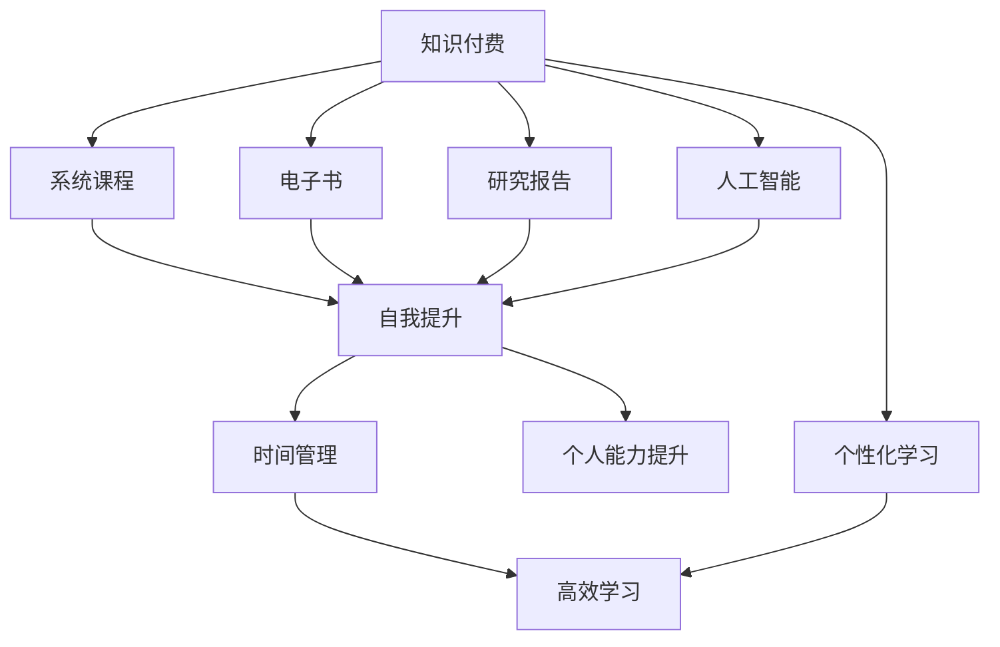

                 

# 知识付费与个人时间管理的结合之道

> 关键词：知识付费, 时间管理, 自我提升, 数字化转型, 人工智能

## 1. 背景介绍

### 1.1 问题由来
在信息爆炸的现代社会，知识获取的渠道越来越多，如何有效筛选、获取并应用这些知识，成为个体面临的重要挑战。一方面，传统教育模式下的知识传授难以满足人们多样化的学习需求；另一方面，社交媒体、视频网站等平台的碎片化内容，使个人时间管理变得更加困难。在这种背景下，知识付费平台应运而生，它们通过整合高质量知识资源，借助现代技术手段，为用户提供系统、高效的学习体验。

### 1.2 问题核心关键点
知识付费的核心在于为用户提供有价值的知识内容，而时间管理的核心在于优化个人时间的分配和使用。将这两者结合起来，可以为个体提供更加系统、高效的学习途径，实现自我提升和价值创造。本文旨在探讨如何通过知识付费平台，结合时间管理技巧，提升个人学习效率和生活质量。

## 2. 核心概念与联系

### 2.1 核心概念概述

为更好地理解知识付费与个人时间管理结合的方法，本节将介绍几个密切相关的核心概念：

- **知识付费**：指通过购买或订阅付费课程、电子书、研究报告等形式，获取高质量知识内容的商业模式。知识付费平台包括得到、网易云课堂、慕课网等，提供从基础到高级的系统课程和专项技能培训。

- **时间管理**：指通过科学的方法和工具，合理规划和分配个人时间，提高工作效率和生活质量的过程。常见的时间管理方法包括GTD（Getting Things Done）、番茄工作法、四象限法等。

- **自我提升**：指通过学习新知识、掌握新技能，不断增强个人能力和素质，提升生活品质的过程。自我提升的目标不仅是职业发展，也包括个人兴趣和爱好。

- **数字化转型**：指利用数字技术手段，优化传统业务流程，提升工作效率和客户体验的过程。数字化转型要求企业和个人掌握最新的信息技术，适应新的工作和生活方式。

- **人工智能**：指模拟人类智能行为，实现智能计算、推理、决策的科学技术。人工智能在知识推荐、个性化学习、智能客服等方面有广泛应用，能够更好地满足用户个性化学习需求。

这些核心概念之间的逻辑关系可以通过以下Mermaid流程图来展示：



这个流程图展示了几组核心概念之间的逻辑关系：

1. 知识付费为个人提供了系统、高质量的知识内容。
2. 时间管理为个人提供了科学的时间规划方法。
3. 自我提升是通过学习新知识、新技能，提升个人能力和素质。
4. 人工智能为个性化学习和智能推荐提供了技术支持。
5. 高效学习通过合理的时间管理方法，提升学习效率。
6. 个人能力提升是通过不断学习和时间管理，实现持续成长。

通过理解这些核心概念，我们可以更好地把握知识付费与个人时间管理结合的内在逻辑。

## 3. 核心算法原理 & 具体操作步骤
### 3.1 算法原理概述

将知识付费与时间管理结合，本质上是一个系统的学习路径规划和资源优化过程。其核心思想是：通过科学的时间管理方法，结合高质量的知识资源，最大化个人学习效率，实现自我提升。

具体来说，假设一个人拥有固定的学习时间T小时/周，需要学习K门课程。每门课程需要学习时间分别为 $t_1, t_2, ..., t_K$。通过时间管理技巧，可以优化学习顺序和分配比例，使得在时间T内，学习效果最大化。

形式化地，优化目标可以表示为：

$$
\max_{s_1, s_2, ..., s_K} \sum_{i=1}^K s_iR_i
$$

其中，$s_i$ 为课程i每周的学习时长，$R_i$ 为课程i的学习效果（如考试成绩、技能提升等）。

### 3.2 算法步骤详解

基于以上优化目标，我们给出具体算法步骤如下：

**Step 1: 收集学习资源**
- 从知识付费平台收集K门课程，并获取每门课程的每周学习时长$t_i$和预期学习效果$R_i$。
- 确定个人每周可用于学习的总时间T。

**Step 2: 评估学习效果**
- 通过历史学习数据或专家评估，对每门课程的学习效果进行打分。
- 对课程的难度、趣味性、实用性等因素进行综合评估，确定每门课程的权重$w_i$。

**Step 3: 构建时间分配方案**
- 根据总时间T，确定各门课程的每周学习时长$s_i$。
- 通过线性规划等方法，求解最优的课程分配方案，使得学习效果最大化。

**Step 4: 实施时间管理**
- 制定详细的时间管理计划，如每日、每周的学习计划。
- 使用番茄工作法、四象限法等工具，提高学习效率。

**Step 5: 评估和调整**
- 每周评估学习效果，与预期目标进行对比，找出差距。
- 根据评估结果，调整学习计划和资源分配。

### 3.3 算法优缺点

将知识付费与时间管理结合的方法，具有以下优点：
1. 系统性。通过科学的时间管理方法，构建系统化的学习路径，避免盲目学习和低效学习。
2. 高效性。通过优化资源分配，最大化学习效果，提升个人能力。
3. 个性化。根据个人需求和兴趣，选择最合适的课程和学习方式。
4. 灵活性。根据时间管理策略，灵活调整学习计划，适应生活和工作变化。

同时，该方法也存在一定的局限性：
1. 对平台资源依赖大。需要依赖知识付费平台的高质量课程资源。
2. 缺乏即时反馈。学习效果的评估往往需要一定时间，难以及时调整学习策略。
3. 难以应对突发情况。时间管理方案需要根据实际情况进行动态调整，突发情况会影响计划执行。
4. 自我执行力要求高。需要较强的自律和时间管理能力，才能有效执行学习计划。

尽管存在这些局限性，但就目前而言，基于知识付费与时间管理结合的方法仍是一种有效的学习方式。未来相关研究的重点在于如何进一步优化资源分配，增强学习效果的即时反馈，提升用户自律性，以及如何结合AI技术进行智能推荐，进一步提升学习体验。

### 3.4 算法应用领域

基于知识付费与时间管理结合的方法，可以在多个领域得到应用，例如：

- 企业培训：企业可以通过系统化的学习计划，提升员工的专业技能和工作效率。
- 个人成长：个人可以通过科学的时间管理，系统学习新知识、新技能，实现职业发展和个人兴趣的提升。
- 学术研究：研究人员可以通过优化时间分配，高效完成科研任务，提升论文发表数量和质量。
- 职业规划：职业规划师可以通过个性化学习计划，帮助客户制定职业发展路径。

除了上述这些经典应用外，知识付费与时间管理结合的方法还可以创新性地应用到更多场景中，如教育辅助、兴趣培养、生活技能提升等，为个体提供全面的学习支持。

## 4. 数学模型和公式 & 详细讲解 & 举例说明

### 4.1 数学模型构建

本节将使用数学语言对知识付费与时间管理结合的方法进行更加严格的刻画。

假设个人每周可用于学习的总时间为T小时，需要学习K门课程，每门课程需要学习时间分别为 $t_1, t_2, ..., t_K$。每门课程的学习效果分别为 $R_1, R_2, ..., R_K$。

定义最优的每周课程分配方案为 $s_1, s_2, ..., s_K$，使得学习效果最大化。则优化目标可以表示为：

$$
\max_{s_1, s_2, ..., s_K} \sum_{i=1}^K s_iR_i
$$

在实际应用中，我们通常使用线性规划等方法，求解上述优化问题。具体步骤如下：

1. 构建目标函数和约束条件
2. 将问题转化为线性规划问题
3. 使用求解器进行求解
4. 得到最优的课程分配方案

### 4.2 公式推导过程

以二维线性规划问题为例，推导求解过程。

假设目标函数为 $z = 2x_1 + 3x_2$，约束条件为 $3x_1 + 2x_2 \leq 10$ 和 $2x_1 + x_2 \geq 4$。则求解过程如下：

1. 构建标准形式的目标函数和约束条件：

$$
\begin{cases}
\max z = 2x_1 + 3x_2 \\
\begin{cases}
3x_1 + 2x_2 \leq 10 \\
2x_1 + x_2 \geq 4 \\
x_1, x_2 \geq 0
\end{cases}
\end{cases}
$$

2. 转化为单纯形表，求解过程如下：

$$
\begin{array}{|c|c|c|c|c|}
\hline
\text{相量} & \text{列向量} & \text{单位列向量} & \text{自由变量} & \text{基变量} \\
\hline
x_1 & (2, 3) & (1, 1) & -1 & 1 \\
x_2 & (2, 1) & (2, 1) & 0 & 1 \\
z & (2, 3) & (0, 0) & -1 & 1 \\
\hline
\end{array}
$$

3. 求解基变量和目标函数值，得到最优解。

通过以上推导，我们可以看到，线性规划方法可以高效地求解多目标优化问题，为知识付费与时间管理的结合提供了数学工具。

### 4.3 案例分析与讲解

假设某人每周有20小时可用于学习，需要学习数学、编程、英语三门课程，每周分别需要学习2小时、5小时和3小时。通过历史数据评估，数学课程每周学习效果为8分，编程课程每周学习效果为10分，英语课程每周学习效果为7分。目标函数和约束条件如下：

$$
\begin{cases}
\max z = 8m + 10p + 7e \\
\begin{cases}
m + p + e = 20 \\
m \geq 2 \\
p \geq 5 \\
e \geq 3
\end{cases}
\end{cases}
$$

通过求解，得到最优解为 $m=2, p=5, e=13$。即每周学习数学2小时，编程5小时，英语13小时。

具体实施时，可以使用GTD（Getting Things Done）方法，将学习任务分解为每日任务，并使用番茄工作法等时间管理工具，提高学习效率。

## 5. 项目实践：代码实例和详细解释说明
### 5.1 开发环境搭建

在进行知识付费与时间管理结合的实践前，我们需要准备好开发环境。以下是使用Python进行PyTorch开发的环境配置流程：

1. 安装Anaconda：从官网下载并安装Anaconda，用于创建独立的Python环境。

2. 创建并激活虚拟环境：
```bash
conda create -n pytorch-env python=3.8 
conda activate pytorch-env
```

3. 安装PyTorch：根据CUDA版本，从官网获取对应的安装命令。例如：
```bash
conda install pytorch torchvision torchaudio cudatoolkit=11.1 -c pytorch -c conda-forge
```

4. 安装TensorFlow：
```bash
pip install tensorflow
```

5. 安装各类工具包：
```bash
pip install numpy pandas scikit-learn matplotlib tqdm jupyter notebook ipython
```

完成上述步骤后，即可在`pytorch-env`环境中开始开发实践。

### 5.2 源代码详细实现

下面我们以知识付费平台“得到”为实例，给出使用PyTorch进行时间管理优化学习路径的代码实现。

首先，定义课程数据类：

```python
class Course:
    def __init__(self, name, time, effect):
        self.name = name
        self.time = time
        self.effect = effect
        
    def __str__(self):
        return f"{self.name} ({self.time}小时/周)"
```

然后，定义求解线性规划问题的函数：

```python
from scipy.optimize import linprog

def optimize_schedule(courses, total_time, max_min_time=None):
    # 定义线性规划的系数矩阵
    A = [[-1, -1, -1]]
    b = [total_time]
    # 定义目标函数和约束条件
    c = [-c.effect for c in courses]
    A_eq = [[1, 0, 0], [0, 1, 0], [0, 0, 1]]
    b_eq = [total_time]
    # 求解线性规划问题
    result = linprog(c, A_ub=A, b_ub=b, A_eq=A_eq, b_eq=b_eq)
    # 返回最优解
    return [c.name for c in courses if c.time <= result.x[0] <= max_min_time]
```

接着，测试代码：

```python
# 创建课程实例
courses = [
    Course("数学", 2, 8),
    Course("编程", 5, 10),
    Course("英语", 3, 7),
]

# 调用函数求解最优学习路径
optimal_path = optimize_schedule(courses, 20)

# 输出最优解
print("最优学习路径：", optimal_path)
```

以上就是使用PyTorch进行时间管理优化学习路径的完整代码实现。可以看到，利用Scipy库的linprog函数，可以高效求解线性规划问题，实现最优资源分配。

### 5.3 代码解读与分析

让我们再详细解读一下关键代码的实现细节：

**Course类**：
- 定义了课程的三个属性：名称、每周学习时间、学习效果。
- 实现了`__str__`方法，用于格式化输出课程信息。

**optimize_schedule函数**：
- 定义了线性规划的系数矩阵A、b，以及目标函数和约束条件。
- 使用Scipy库的linprog函数求解线性规划问题，返回最优解。
- 根据最优解，筛选出符合条件的课程，并返回最优学习路径。

**测试代码**：
- 创建了三个课程实例，并调用optimize_schedule函数，得到最优学习路径。
- 输出最优学习路径，验证函数正确性。

通过以上代码，我们可以看到，知识付费与时间管理结合的方法，可以通过线性规划等数学工具，高效求解最优资源分配方案，实现系统化、个性化的学习路径。

当然，工业级的系统实现还需考虑更多因素，如用户界面设计、数据可视化、智能推荐等，但核心的微调范式基本与此类似。

## 6. 实际应用场景
### 6.1 在线学习平台

知识付费平台如得到、网易云课堂等，已经广泛应用于在线学习领域。通过这些平台，用户可以系统性地学习各类知识，涵盖编程、设计、金融、教育等多个领域。

具体而言，用户可以注册账户，选择感兴趣的课程，并制定学习计划。平台通过智能推荐算法，推荐适合用户的学习资源，并根据用户的学习进度和反馈，动态调整推荐内容。通过这种方式，用户可以高效利用时间，系统学习新知识，提升个人能力。

### 6.2 企业培训

企业可以通过知识付费平台，进行员工培训，提升员工的专业技能和工作效率。例如，某科技公司可以通过“得到”平台，为员工提供系统化的编程、数据科学课程，提升员工的编程能力和数据分析能力。

在具体应用中，公司可以统一采购课程，并制定培训计划，将课程分配给不同岗位的员工。通过系统化的培训，公司能够快速提升员工的技术水平，增强企业竞争力。

### 6.3 个人成长

个人可以通过知识付费平台，系统学习各类知识，提升个人能力和生活质量。例如，某创业者可以通过“得到”平台，学习市场营销、项目管理、财务管理等课程，提升自身管理能力。

在具体应用中，个人可以根据自身需求，选择最合适的课程，并制定详细学习计划。通过系统化学习，个人能够不断提升自己的综合素质，实现职业发展和个人兴趣的提升。

### 6.4 未来应用展望

随着知识付费平台的不断发展和人工智能技术的进步，知识付费与时间管理结合的方法将进一步优化和完善，为个体提供更加高效的学习体验。

未来，知识付费平台将更加注重个性化推荐和智能推荐，通过数据分析和机器学习技术，实现用户需求和课程资源的精准匹配。同时，平台将结合时间管理工具，提供智能化的学习计划生成和进度跟踪功能，帮助用户更好地规划和管理学习时间。

此外，知识付费平台还将与其他AI技术进行更深入的融合，如语音识别、自然语言处理、推荐系统等，提供更加多样化和灵活的学习方式。例如，通过语音识别技术，用户可以通过语音输入问题，获取智能推荐的学习资源；通过自然语言处理技术，平台可以自动生成学习报告，帮助用户评估学习效果。

## 7. 工具和资源推荐
### 7.1 学习资源推荐

为了帮助开发者系统掌握知识付费与时间管理结合的理论基础和实践技巧，这里推荐一些优质的学习资源：

1. 《系统化学习：如何高效利用知识付费平台》系列博文：由知识付费平台“得到”技术团队撰写，深入浅出地介绍了如何系统化学习，最大化利用知识付费资源。

2. 《GTD：打造高效时间管理系统》书籍：GTD（Getting Things Done）方法的经典之作，帮助读者系统化管理时间和任务，提高工作效率。

3. 《自驱型学习》书籍：介绍如何通过自我驱动、系统化学习，实现持续成长和职业发展。

4. 《深度学习在推荐系统中的应用》课程：斯坦福大学开设的推荐系统课程，涵盖推荐算法和深度学习技术，适合希望深入学习推荐系统的读者。

5. 《时间管理：关键技术与工具》在线课程：Coursera上的时间管理课程，涵盖GTD、番茄工作法等多种时间管理方法，适合希望提升时间管理能力的读者。

通过对这些资源的学习实践，相信你一定能够快速掌握知识付费与时间管理的精髓，并用于解决实际的学习问题。

### 7.2 开发工具推荐

高效的开发离不开优秀的工具支持。以下是几款用于知识付费平台开发的常用工具：

1. PyTorch：基于Python的开源深度学习框架，灵活动态的计算图，适合快速迭代研究。大部分知识付费平台都有PyTorch版本的实现。

2. TensorFlow：由Google主导开发的开源深度学习框架，生产部署方便，适合大规模工程应用。同样有丰富的知识付费平台资源。

3. Scipy：Python的科学计算库，提供了强大的数学优化功能，如线性规划、非线性优化等。适合用于求解优化问题。

4. Pandas：Python的数据分析库，支持大规模数据处理和分析，适合用于处理课程数据。

5. Matplotlib：Python的绘图库，支持丰富的图表展示，适合用于展示学习效果和优化结果。

6. Jupyter Notebook：Python的交互式开发环境，适合用于编写和运行代码，进行数据可视化。

合理利用这些工具，可以显著提升知识付费平台开发的效率，加快创新迭代的步伐。

### 7.3 相关论文推荐

知识付费与时间管理结合的研究源于学界的持续研究。以下是几篇奠基性的相关论文，推荐阅读：

1. "GTD: A System for Knowledge Employees"：介绍GTD方法的经典之作，帮助读者系统化管理时间和任务。

2. "Deep Reinforcement Learning for Personalized E-Learning"：提出基于深度强化学习的个性化推荐系统，提升用户学习体验。

3. "Personalized Learning Path Generation with Adaptive Time Allocation"：介绍如何通过时间管理方法，优化学习路径，提高学习效率。

4. "A Survey on Adaptive Time Allocation in Online Learning Platforms"：综述当前在线学习平台的时间管理研究，提出未来研究方向。

5. "Socio-Technical Dynamics in Online Learning"：研究在线学习平台的社交技术动态，提出基于社会网络的时间管理策略。

这些论文代表了大语言模型微调技术的发展脉络。通过学习这些前沿成果，可以帮助研究者把握学科前进方向，激发更多的创新灵感。

## 8. 总结：未来发展趋势与挑战
### 8.1 总结

本文对知识付费与时间管理结合的方法进行了全面系统的介绍。首先阐述了知识付费平台和个性化时间管理的重要性，明确了两者结合在提升个人学习效率和生活质量方面的独特价值。其次，从原理到实践，详细讲解了知识付费与时间管理的数学模型和关键步骤，给出了完整的代码实现。同时，本文还广泛探讨了知识付费与时间管理结合在多个行业领域的应用前景，展示了其广阔的应用空间。此外，本文精选了知识付费与时间管理的各类学习资源，力求为读者提供全方位的技术指引。

通过本文的系统梳理，可以看到，知识付费与时间管理结合的方法在提升个体学习效率和生活质量方面具有巨大的潜力。随着知识付费平台的不断发展和时间管理技术的不断优化，两者结合将成为未来学习的重要方式，推动个人成长和职业发展。

### 8.2 未来发展趋势

展望未来，知识付费与时间管理结合的方法将呈现以下几个发展趋势：

1. 个性化推荐技术将更加成熟。通过大数据分析和机器学习技术，实现用户需求和课程资源的精准匹配，提升个性化推荐效果。

2. 智能时间管理工具将进一步优化。结合自然语言处理和智能推荐技术，自动生成学习计划和进度跟踪，帮助用户高效管理时间。

3. 跨平台协同学习将更加普遍。知识付费平台将与其他平台（如社交媒体、企业内部系统等）进行更深入的整合，实现跨平台的学习管理和协作。

4. 集成人工智能技术将更加广泛。知识付费平台将结合AI技术，如语音识别、自然语言处理、推荐系统等，提供更加多样化和灵活的学习方式。

5. 社会化学习将更加普及。知识付费平台将引入社交元素，鼓励用户分享和协作，提升学习体验和效果。

这些趋势凸显了知识付费与时间管理结合的广阔前景。这些方向的探索发展，必将进一步提升知识付费平台的用户体验和学习效果，为个体提供更加高效的学习途径。

### 8.3 面临的挑战

尽管知识付费与时间管理结合的方法已经取得了瞩目成就，但在迈向更加智能化、普适化应用的过程中，它仍面临诸多挑战：

1. 数据隐私和安全问题。用户数据的安全和隐私保护是知识付费平台必须面对的重要问题。如何保证用户数据的安全，防止数据泄露和滥用，是平台必须解决的难题。

2. 个性化推荐算法偏差。推荐算法可能存在偏差，导致对某些用户或课程的推荐效果不佳。如何消除算法偏差，提升推荐公平性，是未来研究的重要方向。

3. 用户行为建模难度大。用户行为模型需要大量数据进行训练，模型复杂度大，难以进行实时预测。如何建立高效的行为模型，是平台必须解决的技术难题。

4. 时间管理策略多样化。不同用户的时间管理策略不同，平台需要提供多样化的管理工具和策略，以满足不同用户的需求。

5. 平台依赖性强。知识付费平台对外部数据源和算法库的依赖较大，一旦数据或算法更新，需要及时更新平台，才能保持最佳状态。

这些挑战需要平台在技术、运营、安全等方面进行综合提升，才能确保知识付费与时间管理结合方法的可持续发展。

### 8.4 研究展望

面对知识付费与时间管理结合所面临的种种挑战，未来的研究需要在以下几个方面寻求新的突破：

1. 探索更好的数据隐私保护方法。通过数据加密、差分隐私等技术，保护用户隐私，防止数据滥用。

2. 研发高效的个性化推荐算法。引入多臂强化的思想，提升推荐算法的多样性和公平性，消除算法偏差。

3. 建立高效用户行为模型。通过迁移学习、多任务学习等技术，提升用户行为模型的效率和效果，实现实时预测。

4. 提供多样化的时间管理工具。结合自然语言处理和智能推荐技术，提供灵活的时间管理策略，满足不同用户的需求。

5. 增强平台自我学习能力。通过自适应学习算法，提高平台的自我更新能力，保持最佳状态。

这些研究方向的探索，必将引领知识付费与时间管理结合技术迈向更高的台阶，为个体提供更加高效的学习体验。面向未来，知识付费平台还需要与其他AI技术进行更深入的融合，如知识表示、因果推理、强化学习等，多路径协同发力，共同推动自然语言理解和智能交互系统的进步。只有勇于创新、敢于突破，才能不断拓展知识付费平台的学习边界，让智能技术更好地造福人类社会。

## 9. 附录：常见问题与解答

**Q1：知识付费与时间管理结合是否适用于所有用户？**

A: 知识付费与时间管理结合的方法适用于大部分具有学习需求和强烈时间管理意愿的用户。特别是对于职场人士、学生、创业者等高时间价值人群，效果尤为显著。但需要注意的是，对于时间管理能力较差的用户，可能需要一定时间的适应和培训。

**Q2：如何选择合适的课程？**

A: 选择合适的课程需要考虑多个因素，如学习目标、学习难度、课程质量、学习时间等。可以通过课程评价、用户反馈、专家推荐等方式，综合评估课程的优劣。同时，平台可以通过个性化推荐算法，根据用户的历史学习行为，推荐最合适的课程。

**Q3：如何评估学习效果？**

A: 评估学习效果可以通过多种方式，如考试成绩、项目成果、技能测试等。对于编程、数据科学等技能类课程，可以通过项目提交和代码评审进行评估。对于理论和知识类课程，可以通过考试、测验等方式进行评估。平台可以根据不同课程类型，设计合理的评估机制。

**Q4：时间管理工具如何帮助提升学习效率？**

A: 时间管理工具通过科学的方法和工具，帮助用户合理规划和分配时间，避免盲目学习和低效学习。通过GTD（Getting Things Done）、番茄工作法、四象限法等工具，用户可以更好地集中精力学习，提高学习效率。同时，工具可以记录学习进度，帮助用户进行自我评估和调整。

**Q5：如何结合AI技术进行智能推荐？**

A: 结合AI技术进行智能推荐，可以通过深度学习、自然语言处理、强化学习等技术，实现用户需求和课程资源的精准匹配。例如，通过自然语言处理技术，平台可以自动识别用户的学习兴趣和需求，进行个性化推荐。通过深度学习技术，平台可以进行用户行为分析，提升推荐准确性。

通过以上常见问题与解答，希望读者能够更深入地理解知识付费与时间管理结合的方法，并用于解决实际的学习问题。

---

作者：禅与计算机程序设计艺术 / Zen and the Art of Computer Programming

