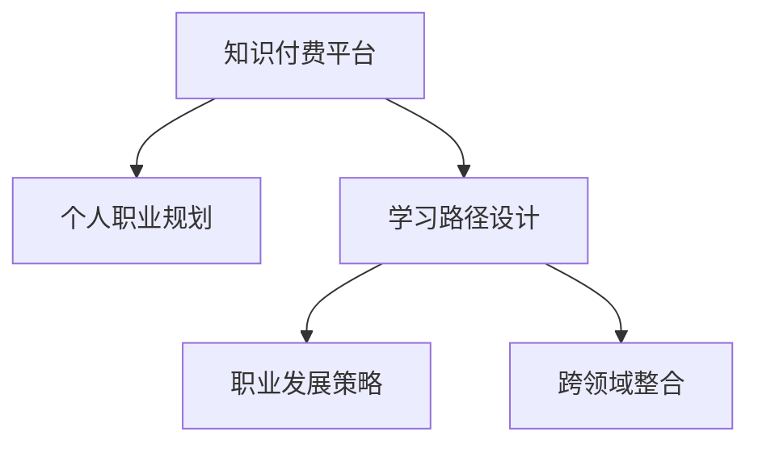

                 

# 知识付费与个人职业规划的整合

> 关键词：知识付费, 个人职业规划, 整合, 学习路径, 职业发展, 高效学习, 人工智能, 大数据, 职业转型, 技能提升

## 1. 背景介绍

### 1.1 问题由来
随着互联网技术的飞速发展，知识付费成为了个人获取专业知识和技能的重要方式之一。知识付费平台如得到、腾讯课堂、Coursera等，提供了海量的在线课程和精品内容，吸引了大量学习者。与此同时，职业规划的重要性日益凸显，越来越多的人意识到，终身学习是职业发展的关键。因此，将知识付费与个人职业规划整合，成为当前社会的一大趋势。

### 1.2 问题核心关键点
知识付费与个人职业规划的整合，主要涉及到以下几个核心关键点：

1. **知识获取的效率和效果**：如何高效地从知识付费平台获取所需知识，并将其转化为个人的职业能力。
2. **学习路径的设计**：如何根据个人职业目标，设计合理的学习路径，确保学以致用。
3. **职业发展策略**：如何通过知识付费平台，结合个人职业规划，制定科学的职业发展策略，实现职业跃迁。
4. **跨领域整合**：如何跨领域整合知识，提升综合竞争力，适应多变的职业环境。

这些关键点共同构成了知识付费与个人职业规划整合的基础，决定了其成功的关键因素。

### 1.3 问题研究意义
通过整合知识付费与个人职业规划，可以有效地提升个人学习和职业发展的效率，帮助学习者更快地达到职业目标，提升其职业竞争力。具体而言，研究该问题具有以下几方面的意义：

1. **提升学习效率**：通过整合知识付费平台与个人职业规划，可以快速找到所需知识，避免盲目学习和重复学习，提升学习效率。
2. **优化职业路径**：结合职业目标设计合理的学习路径，有助于学习者避免走弯路，更快达到职业目标。
3. **科学职业规划**：通过整合知识付费平台，结合个人职业规划，制定科学的职业发展策略，实现职业跃迁。
4. **跨领域整合**：跨领域整合知识，提升综合竞争力，适应多变的职业环境。

这些意义共同推动了知识付费与个人职业规划整合的实践和理论研究，为个体职业发展提供了新的可能性。

## 2. 核心概念与联系

### 2.1 核心概念概述

为更好地理解知识付费与个人职业规划的整合，本节将介绍几个密切相关的核心概念：

- **知识付费平台**：如得到、腾讯课堂、Coursera等，提供各种在线课程和付费内容，涵盖多领域、多层次的知识。
- **个人职业规划**：指根据自身兴趣、能力和市场需求，制定和实施的职业目标和行动计划。
- **学习路径设计**：根据职业目标，设计合理的学习路径，确保知识获取的针对性和有效性。
- **职业发展策略**：结合职业目标和市场需求，制定科学的职业发展策略，实现职业跃迁。
- **跨领域整合**：将不同领域的专业知识和技能整合起来，提升综合竞争力。

这些核心概念之间的逻辑关系可以通过以下Mermaid流程图来展示：



这个流程图展示了这个整合框架的核心概念及其之间的关系：

1. 知识付费平台提供丰富的课程资源，为个人职业规划和技能提升提供支持。
2. 个人职业规划指导学习路径设计，确保学习内容针对性强。
3. 职业发展策略结合市场需求和个人兴趣，制定科学的发展路径。
4. 跨领域整合提升综合竞争力，适应多变的职业环境。

这些概念共同构成了知识付费与个人职业规划整合的基础，使其能够在各种场景下发挥作用。通过理解这些核心概念，我们可以更好地把握知识付费与职业规划整合的精髓，为个人职业发展提供更全面的指导。

## 3. 核心算法原理 & 具体操作步骤
### 3.1 算法原理概述

知识付费与个人职业规划的整合，本质上是一个跨学科的学习优化和职业规划优化过程。其核心思想是：通过知识付费平台提供的课程资源，结合个人职业规划的目标，设计合理的学习路径和职业发展策略，最大化地提升学习效率和职业竞争力。

形式化地，假设个人初始职业状态为 $S_0$，目标职业状态为 $S_T$，则整合过程可以描述为一个优化问题，即在课程资源和职业目标约束下，找到最优的学习路径 $P$ 和职业发展策略 $C$，使得：

$$
\mathop{\arg\min}_{P,C} \bigg(\sum_{i=0}^{T-1} \text{cost}(P_i,C_i)\bigg)
$$

其中 $\text{cost}(P_i,C_i)$ 为第 $i$ 个时间点上的学习成本和职业发展成本之和。目标是最小化总成本，即最优化地实现从 $S_0$ 到 $S_T$ 的职业跃迁。

### 3.2 算法步骤详解

知识付费与个人职业规划的整合，一般包括以下几个关键步骤：

**Step 1: 确定职业目标**
- 明确个人职业目标，如晋升、转行、创业等。
- 根据职业目标，确定所需的技能和知识。

**Step 2: 选择课程资源**
- 在知识付费平台上，根据职业目标和所需技能，选择相关课程。
- 综合考虑课程质量、讲师资历、课程难度等因素。

**Step 3: 设计学习路径**
- 根据职业目标和课程资源，设计合理的学习路径。
- 考虑课程的难度、关联性、时序性等因素。

**Step 4: 制定职业发展策略**
- 结合市场需求和个人兴趣，制定科学的职业发展策略。
- 包括提升现有技能、获取新技能、跨领域整合等方面。

**Step 5: 实施与评估**
- 根据学习路径和职业发展策略，实施学习计划。
- 定期评估学习效果和职业发展进度，及时调整策略。

**Step 6: 跨领域整合**
- 将不同领域的知识和技能进行整合，提升综合竞争力。
- 注重跨学科思维的培养，拓宽知识面。

以上是知识付费与个人职业规划整合的一般流程。在实际应用中，还需要根据具体任务的特点，对整合过程的各个环节进行优化设计，如改进课程推荐算法、设计更灵活的学习路径、搜索最优的职业发展策略等，以进一步提升整合效果。

### 3.3 算法优缺点

知识付费与个人职业规划的整合，具有以下优点：

1. **资源丰富**：知识付费平台提供了丰富的课程资源，有助于快速获取所需知识和技能。
2. **个性化设计**：结合个人职业目标，设计合理的学习路径和职业发展策略，提升学习效率。
3. **跨领域整合**：通过跨领域整合知识，提升综合竞争力，适应多变的职业环境。

同时，该方法也存在一定的局限性：

1. **依赖课程质量**：课程资源的筛选和质量评估需要花费一定的时间和精力，且可能存在课程推荐偏差。
2. **成本较高**：知识付费平台往往收费较高，可能增加学习者的经济负担。
3. **缺乏实践机会**：在线课程缺乏实践机会，难以获得实际工作经验。
4. **效果因人而异**：不同人的学习能力和职业目标不同，整合效果可能存在差异。

尽管存在这些局限性，但就目前而言，知识付费与个人职业规划的整合方法仍然是一种较为有效和实用的职业发展策略，尤其在知识付费平台资源丰富、个人职业目标明确的情况下。

### 3.4 算法应用领域

知识付费与个人职业规划的整合，已经在多个领域得到了广泛的应用，例如：

- **技术行业**：如软件开发、数据分析、人工智能等。通过整合知识付费平台提供的课程，结合个人职业规划，学习者可以快速掌握新技能，提升职业竞争力。
- **金融行业**：如金融分析、风险管理、金融工程等。通过整合知识付费平台提供的课程，学习者可以获取最新的金融知识，提升职业水平。
- **教育行业**：如K12教育、职业培训、在线教育等。通过整合知识付费平台提供的课程，教育机构和培训师可以提供更加个性化和专业的教育服务。
- **医疗行业**：如医学研究、临床实践、医疗管理等。通过整合知识付费平台提供的课程，医疗从业者可以获取最新的医学知识，提升职业素养。

除了上述这些经典领域外，知识付费与个人职业规划的整合还在不断拓展到更多领域，如市场营销、人力资源管理、艺术设计等，为各行各业提供了新的职业发展路径。

## 4. 数学模型和公式 & 详细讲解 & 举例说明（备注：数学公式请使用latex格式，latex嵌入文中独立段落使用 $$，段落内使用 $)
### 4.1 数学模型构建

本节将使用数学语言对知识付费与个人职业规划的整合过程进行更加严格的刻画。

假设个人初始职业状态为 $S_0$，目标职业状态为 $S_T$，每个时间点的职业状态 $S_i$ 由学习路径 $P_i$ 和职业发展策略 $C_i$ 决定。则整合问题可以表示为：

$$
\begin{aligned}
\mathop{\arg\min}_{P,C} & \quad \sum_{i=0}^{T-1} \text{cost}(P_i,C_i) \\
\text{s.t.} & \quad S_i = f(P_i, C_i, S_{i-1})
\end{aligned}
$$

其中 $f$ 为职业状态转移函数，$P_i$ 和 $C_i$ 分别为第 $i$ 个时间点的学习路径和职业发展策略，$\text{cost}(P_i,C_i)$ 为第 $i$ 个时间点上的学习成本和职业发展成本之和。

### 4.2 公式推导过程

以下我们以软件开发职业路径为例，推导学习路径的设计和优化方法。

假设软件开发领域的技能集合为 $\mathcal{S} = \{S_1, S_2, \ldots, S_n\}$，每个技能的学习成本和职业发展成本分别为 $c_1, c_2, \ldots, c_n$。则学习路径的设计可以表示为：

$$
P = \{P_1, P_2, \ldots, P_{T-1}\}
$$

其中 $P_i$ 为第 $i$ 个时间点的学习路径，$P_i$ 由以下步骤构成：

1. 选择学习资源 $R_{i-1}$，其成本为 $c_{R_{i-1}}$。
2. 完成学习任务 $T_i$，其成本为 $c_{T_i}$。
3. 评估学习效果，调整学习路径。

职业发展策略 $C$ 可以表示为：

$$
C = \{C_1, C_2, \ldots, C_{T-1}\}
$$

其中 $C_i$ 为第 $i$ 个时间点的职业发展策略，$C_i$ 由以下步骤构成：

1. 获取新技能 $S_j$，其成本为 $c_j$。
2. 应用新技能于实际项目，其成本为 $c_j'$。
3. 评估职业发展效果，调整职业发展策略。

通过上述模型，可以优化学习路径和职业发展策略，最小化总成本，实现职业目标。

### 4.3 案例分析与讲解

假设某学习者希望从初级开发人员晋升为高级开发人员。其职业目标为 $S_T = \text{高级开发人员}$，初始状态为 $S_0 = \text{初级开发人员}$。已知软件开发领域的技能集合为 $\mathcal{S} = \{S_1, S_2, S_3, S_4\}$，每个技能的学习成本和职业发展成本分别为 $c_1 = 1000$，$c_2 = 2000$，$c_3 = 3000$，$c_4 = 4000$。

根据上述模型，可以设计如下学习路径和职业发展策略：

**学习路径设计**：

1. 选择学习资源 $R_0$，其成本为 $c_{R_0} = 500$。
2. 完成学习任务 $T_1$，其成本为 $c_{T_1} = 1500$。
3. 评估学习效果，调整学习路径。

**职业发展策略设计**：

1. 获取新技能 $S_2$，其成本为 $c_2 = 2000$。
2. 应用新技能于实际项目，其成本为 $c_2' = 3000$。
3. 评估职业发展效果，调整职业发展策略。

通过优化上述路径，最小化总成本，学习者可以实现职业跃迁。

## 5. 项目实践：代码实例和详细解释说明
### 5.1 开发环境搭建

在进行整合实践前，我们需要准备好开发环境。以下是使用Python进行相关实践的环境配置流程：

1. 安装Anaconda：从官网下载并安装Anaconda，用于创建独立的Python环境。

2. 创建并激活虚拟环境：
```bash
conda create -n pytorch-env python=3.8 
conda activate pytorch-env
```

3. 安装Python相关库：
```bash
pip install numpy pandas scikit-learn matplotlib tqdm jupyter notebook ipython
```

完成上述步骤后，即可在`pytorch-env`环境中开始整合实践。

### 5.2 源代码详细实现

这里我们以软件开发领域为例，给出使用Python进行职业路径设计的基本代码实现。

```python
import numpy as np

# 定义技能集合和成本
skills = ['S1', 'S2', 'S3', 'S4']
costs = {'S1': 1000, 'S2': 2000, 'S3': 3000, 'S4': 4000}

# 定义学习路径和职业发展策略
learning_path = []
career_strategy = []

# 学习路径设计
learning_path.append({'resource': 'R0', 'cost': 500})
learning_path.append({'task': 'T1', 'cost': 1500})

# 职业发展策略设计
career_strategy.append({'skill': 'S2', 'cost': 2000})
career_strategy.append({'skill': 'S3', 'cost': 3000})

# 计算总成本
total_cost = sum(costs.get(s, 0) for s in learning_path + career_strategy)

print(f"Total cost: {total_cost}")
```

### 5.3 代码解读与分析

让我们再详细解读一下关键代码的实现细节：

- 我们首先定义了技能集合和对应的成本。
- 接着，我们设计了学习路径和职业发展策略。学习路径包括选择学习资源和完成学习任务，职业发展策略包括获取新技能和应用新技能。
- 最后，我们计算了总成本，即学习路径和职业发展策略的总和。

通过上述代码实现，可以初步构建一个基本的职业路径设计系统，为个人职业规划提供初步的指导。

## 6. 实际应用场景
### 6.1 软件开发职业规划

软件开发是一个高度动态的领域，技术日新月异，技能更新速度极快。通过知识付费与个人职业规划的整合，软件开发人员可以及时获取最新的技术知识，保持竞争力。

具体而言，可以收集当前开发人员的技术需求和职业发展目标，将其转化为具体的技能需求。在知识付费平台上，选择相关的课程资源进行学习。根据学习效果和职业发展策略，动态调整学习路径和职业规划，确保技术能力不断提升。

### 6.2 金融分析师职业规划

金融分析师需要掌握复杂的金融模型和分析工具，通过知识付费与个人职业规划的整合，可以快速提升其金融知识和分析能力。

具体而言，可以收集当前金融分析师的技能需求和职业发展目标，将其转化为具体的金融知识需求。在知识付费平台上，选择相关的课程资源进行学习。根据学习效果和职业发展策略，动态调整学习路径和职业规划，确保金融分析能力不断提升。

### 6.3 数据科学职业规划

数据科学领域需要掌握统计学、机器学习、大数据等复杂技能。通过知识付费与个人职业规划的整合，数据科学家可以系统地学习相关知识，提升职业素养。

具体而言，可以收集当前数据科学家的技能需求和职业发展目标，将其转化为具体的知识需求。在知识付费平台上，选择相关的课程资源进行学习。根据学习效果和职业发展策略，动态调整学习路径和职业规划，确保数据科学能力不断提升。

### 6.4 未来应用展望

随着知识付费平台的日益普及和个人职业规划意识的提高，基于知识付费与个人职业规划的整合将成为一个重要的职业发展工具。未来的应用场景将更加广泛，涵盖更多行业和岗位，为个体职业发展提供更加全面和精准的指导。

## 7. 工具和资源推荐
### 7.1 学习资源推荐

为了帮助开发者系统掌握知识付费与个人职业规划的理论基础和实践技巧，这里推荐一些优质的学习资源：

1. **《深度学习：理论与实践》**：深度学习领域的经典教材，介绍了深度学习的基本原理和应用。
2. **Coursera**：全球知名的在线教育平台，提供丰富的课程资源，涵盖多个领域。
3. **Udacity**：以项目导向的在线教育平台，提供实战性强的技能培训。
4. **Kaggle**：数据科学竞赛平台，提供大量真实世界的竞赛题目和数据集。
5. **GitHub**：代码托管平台，提供丰富的开源项目和代码库。

通过对这些资源的学习实践，相信你一定能够快速掌握知识付费与个人职业规划的精髓，并用于解决实际的职业问题。

### 7.2 开发工具推荐

高效的开发离不开优秀的工具支持。以下是几款用于知识付费与个人职业规划开发的常用工具：

1. **Jupyter Notebook**：开源的交互式笔记本环境，支持Python代码的编写和执行。
2. **PyTorch**：基于Python的开源深度学习框架，灵活动态的计算图，适合快速迭代研究。
3. **TensorFlow**：由Google主导开发的开源深度学习框架，生产部署方便，适合大规模工程应用。
4. **Weights & Biases**：模型训练的实验跟踪工具，可以记录和可视化模型训练过程中的各项指标，方便对比和调优。
5. **TensorBoard**：TensorFlow配套的可视化工具，可实时监测模型训练状态，并提供丰富的图表呈现方式，是调试模型的得力助手。

合理利用这些工具，可以显著提升知识付费与个人职业规划的开发效率，加快创新迭代的步伐。

### 7.3 相关论文推荐

知识付费与个人职业规划的发展源于学界的持续研究。以下是几篇奠基性的相关论文，推荐阅读：

1. **《终身学习：未来职业的基石》**：探讨终身学习对未来职业发展的重要性。
2. **《知识付费与在线学习：理论和实践》**：研究知识付费平台与在线学习的理论基础和应用策略。
3. **《基于知识图谱的职业规划系统》**：通过知识图谱技术，为个体职业发展提供系统化的指导。
4. **《个性化职业规划系统》**：基于机器学习，实现个性化职业路径推荐。
5. **《跨领域技能整合：理论和方法》**：研究跨领域技能整合的理论基础和实践方法。

这些论文代表了大数据和人工智能在职业规划中的应用方向，为知识付费与个人职业规划的实践提供了理论支持。

## 8. 总结：未来发展趋势与挑战
### 8.1 总结

本文对知识付费与个人职业规划的整合进行了全面系统的介绍。首先阐述了知识付费平台和职业规划的重要性，明确了整合在提升学习效率和职业发展中的关键作用。其次，从原理到实践，详细讲解了整合的数学模型和操作步骤，给出了整合任务开发的完整代码实例。同时，本文还广泛探讨了整合方法在软件开发、金融分析、数据科学等多个行业领域的应用前景，展示了整合范式的巨大潜力。此外，本文精选了整合技术的各类学习资源，力求为读者提供全方位的技术指引。

通过本文的系统梳理，可以看到，知识付费与个人职业规划的整合正在成为职业发展的重要工具，极大地提升了学习效率和职业竞争力。未来，伴随知识付费平台的不断发展和职业规划意识的提高，基于知识付费与个人职业规划的整合必将在更广泛的场景下发挥作用，为个体职业发展提供更多的可能性。

### 8.2 未来发展趋势

展望未来，知识付费与个人职业规划的整合将呈现以下几个发展趋势：

1. **智能化整合**：通过人工智能技术，如机器学习、深度学习等，实现更加智能化的职业路径推荐和优化。
2. **动态调整**：根据市场需求和个人反馈，实时调整学习路径和职业发展策略，确保职业发展的时效性和灵活性。
3. **跨领域融合**：打破不同领域之间的壁垒，实现跨领域知识和技能的整合，提升综合竞争力。
4. **社会化学习**：利用社交网络平台，构建学习社区，促进知识分享和经验交流，提升学习效果。
5. **虚拟职业体验**：通过虚拟现实技术，提供虚拟职业体验，增强学习者的职业认知和实践能力。

这些趋势凸显了知识付费与个人职业规划整合技术的广阔前景。这些方向的探索发展，必将进一步提升职业发展的智能化水平，为个体职业发展提供更加全面和精准的指导。

### 8.3 面临的挑战

尽管知识付费与个人职业规划的整合技术已经取得了不小的进展，但在迈向更加智能化、普适化应用的过程中，它仍面临着诸多挑战：

1. **数据隐私问题**：知识付费平台涉及大量用户数据，如何保障用户隐私和数据安全是一个重要问题。
2. **课程质量参差不齐**：知识付费平台上的课程质量参差不齐，难以保证所有课程的实用性和有效性。
3. **学习动机管理**：如何激发和保持学习者的学习动机，避免半途而废，是一个关键挑战。
4. **职业路径多样性**：不同人的职业路径选择差异较大，难以制定统一的整合方案。
5. **跨领域知识整合**：不同领域的知识和技能差异较大，跨领域整合难度较高。

这些挑战需要结合技术、管理和教育等多方面的努力，才能逐步克服。只有从数据隐私、课程质量、学习动机、职业路径、跨领域整合等多个维度协同发力，才能真正实现知识付费与个人职业规划的整合目标。

### 8.4 研究展望

面对知识付费与个人职业规划整合所面临的种种挑战，未来的研究需要在以下几个方面寻求新的突破：

1. **个性化学习路径**：通过数据分析和机器学习，实现更加个性化的学习路径推荐。
2. **动态调整机制**：研究动态调整学习路径和职业发展策略的方法，确保职业发展的时效性和灵活性。
3. **跨领域技能整合**：探索跨领域技能整合的理论与方法，提升综合竞争力。
4. **社会化学习平台**：构建社会化学习平台，促进知识分享和经验交流，提升学习效果。
5. **虚拟职业体验**：研究虚拟现实技术在职业体验中的应用，增强学习者的职业认知和实践能力。

这些研究方向的探索，必将引领知识付费与个人职业规划整合技术迈向更高的台阶，为个体职业发展提供更加全面和精准的指导。面向未来，知识付费与个人职业规划的整合技术还需要与其他人工智能技术进行更深入的融合，如知识表示、因果推理、强化学习等，多路径协同发力，共同推动职业规划系统的进步。只有勇于创新、敢于突破，才能不断拓展知识付费与个人职业规划的边界，让个体职业发展更加高效和全面。

## 9. 附录：常见问题与解答

**Q1：如何选择合适的知识付费平台？**

A: 选择合适的知识付费平台，需要考虑以下几个因素：

1. **平台声誉**：选择知名、可靠的平台，避免受到低质量课程的误导。
2. **课程质量**：选择课程评价高、讲师资历强的课程，确保学习效果。
3. **课程资源**：选择课程资源丰富、涵盖领域广泛的平台，满足不同需求。
4. **用户体验**：选择界面友好、操作便捷的平台，提高学习效率。

通过对这些因素的综合考虑，可以选择适合自己的知识付费平台，最大化学习效果。

**Q2：如何选择适合自己的课程？**

A: 选择适合自己的课程，需要考虑以下几个因素：

1. **课程目标**：选择与职业目标相关的课程，确保学有所用。
2. **课程难度**：选择难度适中、适合自己的课程，避免过难或过易。
3. **课程评价**：参考其他学习者的评价和反馈，选择评价高的课程。
4. **讲师资历**：选择有丰富经验和良好口碑的讲师，确保课程质量。

通过对这些因素的综合考虑，可以选择适合自己的课程，提升学习效果。

**Q3：如何设计合理的学习路径？**

A: 设计合理的学习路径，需要考虑以下几个因素：

1. **技能需求**：根据职业目标，确定所需的技能和知识。
2. **课程资源**：在知识付费平台上，选择相关的课程资源进行学习。
3. **时间规划**：制定合理的时间规划，确保学习进度和效果。
4. **评估反馈**：定期评估学习效果，及时调整学习路径。

通过综合考虑这些因素，可以设计出合理的学习路径，实现职业目标。

**Q4：如何制定科学的职业发展策略？**

A: 制定科学的职业发展策略，需要考虑以下几个因素：

1. **市场需求**：了解当前市场的需求和趋势，制定相应的职业发展策略。
2. **个人兴趣**：结合个人的兴趣和特长，制定合理的职业发展方向。
3. **技能提升**：不断提升现有技能，学习新技能，适应市场变化。
4. **实践应用**：通过实际项目和案例，验证和优化职业发展策略。

通过综合考虑这些因素，可以制定出科学的职业发展策略，实现职业跃迁。

**Q5：如何实现跨领域整合？**

A: 实现跨领域整合，需要考虑以下几个因素：

1. **多领域知识**：掌握不同领域的基础知识和技能，建立跨领域的知识体系。
2. **跨学科思维**：培养跨学科思维，具备跨领域的思维方式和解决能力。
3. **实际应用**：通过实际项目和案例，应用跨领域知识，提升综合竞争力。
4. **持续学习**：不断学习新知识，适应多变的职业环境。

通过综合考虑这些因素，可以实现跨领域整合，提升综合竞争力。

**Q6：如何应对学习过程中的挑战？**

A: 应对学习过程中的挑战，需要考虑以下几个因素：

1. **时间管理**：合理规划学习时间，避免时间浪费。
2. **学习动机**：激发和保持学习动机，避免半途而废。
3. **学习策略**：选择适合自己的学习策略，提高学习效率。
4. **社交支持**：加入学习社区，寻求同伴支持和帮助。

通过综合考虑这些因素，可以应对学习过程中的挑战，提升学习效果。

---

作者：禅与计算机程序设计艺术 / Zen and the Art of Computer Programming

