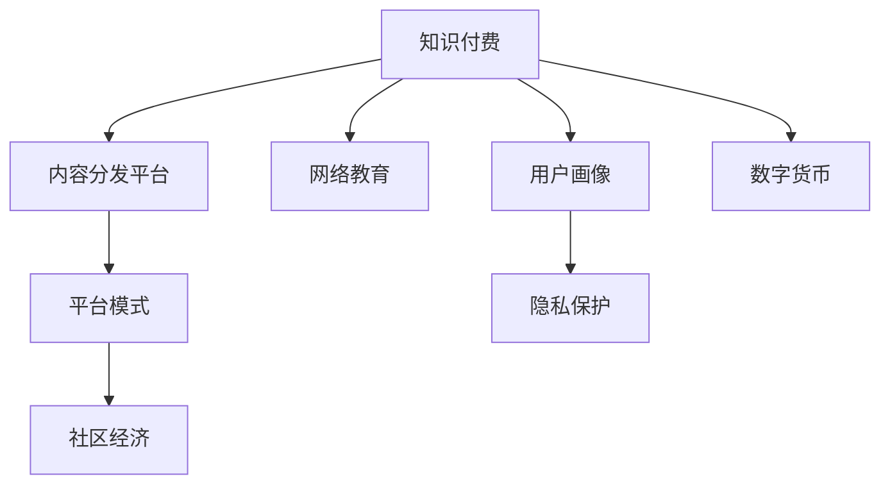

                 

# 知识付费与技术创新的双向促进

> 关键词：知识付费, 技术创新, 内容分发, 网络教育, 平台模式, 社区经济, 用户画像, 隐私保护, 数字货币

## 1. 背景介绍

### 1.1 问题由来

随着互联网技术的飞速发展，人们获取知识和信息的方式越来越多样化。传统的教育模式受到挑战，学习不再受限于时间和地点，任何人、任何时间、任何地点都可以通过互联网获取知识。然而，知识的商业化运营方式也在逐步发生变化，传统的付费模式已不再适用。在知识付费的趋势下，如何通过技术创新提升内容分发效率、增强用户体验、保护用户隐私，成为业内亟待解决的问题。

### 1.2 问题核心关键点

知识付费与技术创新的双向促进，主要包括以下几个关键点：

1. **内容分发效率**：如何高效、准确地将知识内容分发至用户，是知识付费平台的核心任务。
2. **用户体验优化**：如何提升用户体验，增强用户在平台上的粘性，是知识付费平台的重要目标。
3. **隐私保护措施**：如何保护用户的隐私数据，防止数据泄露和滥用，是知识付费平台必须遵守的底线。
4. **技术基础设施建设**：如何构建高效、可靠、安全的技术基础设施，支持知识付费平台的稳定运行，是知识付费平台的技术基础。
5. **用户画像构建**：如何精准描绘用户画像，实现个性化推荐，提高用户满意度，是知识付费平台的数据驱动策略。
6. **内容创作者激励**：如何通过技术手段激励内容创作者，保证内容质量，是知识付费平台的长期发展战略。
7. **支付和数字货币应用**：如何在平台中实现便捷支付，以及探索数字货币在知识付费中的应用，是知识付费平台的创新方向。

## 2. 核心概念与联系

### 2.1 核心概念概述

为更好地理解知识付费与技术创新的双向促进，本节将介绍几个密切相关的核心概念：

- **知识付费**：指通过支付一定费用获取知识内容的付费模式，其核心是知识的可获取性和有偿性。
- **内容分发平台**：指提供知识内容分发的在线平台，包括文章、视频、音频、课程等多种形式。
- **网络教育**：指利用互联网进行教学和学习的方式，打破了传统教育的时空限制。
- **平台模式**：指通过网络平台集中整合内容和服务，提供给用户的一种商业模式。
- **社区经济**：指通过知识社区的集体智慧和贡献，实现知识和经济的共赢。
- **用户画像**：指对用户进行画像描述，包括用户兴趣、行为、偏好等特征，用于个性化推荐和精准营销。
- **隐私保护**：指保护用户数据和隐私，防止数据泄露和滥用，包括数据加密、匿名化、去标识化等技术手段。
- **数字货币**：指基于区块链技术实现的数字资产，如比特币、以太坊等，具有去中心化、匿名性、不可篡改等特点。

这些核心概念之间的逻辑关系可以通过以下Mermaid流程图来展示：



这个流程图展示了一个完整的知识付费生态系统，各概念之间的相互关系和依赖关系。

## 3. 核心算法原理 & 具体操作步骤

### 3.1 算法原理概述

知识付费与技术创新的双向促进，本质上是将技术手段应用于知识付费平台，通过技术创新提升内容分发效率、增强用户体验、保护用户隐私。其核心算法原理主要包括以下几个方面：

1. **推荐算法**：通过分析用户行为数据，构建用户画像，实现个性化推荐。
2. **内容推荐系统**：通过机器学习算法，对海量内容进行特征提取和推荐。
3. **搜索算法**：通过自然语言处理技术，实现高效的内容搜索和匹配。
4. **广告推荐系统**：通过分析用户行为和兴趣，实现精准的广告推荐。
5. **用户行为分析**：通过数据挖掘和统计分析，理解用户行为，优化平台策略。
6. **隐私保护算法**：通过数据加密、匿名化、去标识化等技术，保护用户隐私。

### 3.2 算法步骤详解

以下是知识付费平台的核心算法步骤：

**Step 1: 数据收集与预处理**
- 收集用户行为数据、内容数据、交易数据等。
- 对数据进行清洗、去重、标准化处理。

**Step 2: 特征提取**
- 通过文本挖掘、图像识别等技术，提取用户兴趣、内容特征等。
- 使用TF-IDF、词向量、图像特征向量等技术，将非结构化数据转化为结构化特征。

**Step 3: 用户画像构建**
- 基于用户行为数据，构建用户画像，包括兴趣、行为、偏好等。
- 使用聚类、分类等算法，对用户画像进行标签化。

**Step 4: 推荐算法应用**
- 使用协同过滤、基于内容的推荐、深度学习推荐等算法，对用户进行个性化推荐。
- 实时更新推荐模型，提升推荐效果。

**Step 5: 搜索算法优化**
- 使用倒排索引、向量空间模型等技术，优化内容搜索算法。
- 实时索引更新，提高搜索效率。

**Step 6: 广告推荐系统设计**
- 基于用户画像，设计广告推荐算法。
- 使用CTR预测、深度学习等技术，实现精准广告投放。

**Step 7: 用户行为分析**
- 通过数据挖掘和统计分析，理解用户行为。
- 实时监控用户行为，优化平台策略。

**Step 8: 隐私保护技术实施**
- 对用户数据进行加密、匿名化、去标识化处理。
- 设计隐私保护协议，确保数据安全。

**Step 9: 技术基础设施建设**
- 构建高效、可靠、安全的技术基础设施，支持平台稳定运行。
- 使用云服务、容器化技术等，提升平台扩展性和可靠性。

### 3.3 算法优缺点

知识付费与技术创新的双向促进算法具有以下优点：

1. **个性化推荐**：通过分析用户行为数据，实现个性化推荐，提升用户满意度。
2. **高效分发**：通过推荐算法和搜索算法，实现高效的内容分发，降低运营成本。
3. **精准广告**：通过用户画像和广告推荐系统，实现精准的广告投放，提高广告效果。
4. **用户行为分析**：通过用户行为分析，优化平台策略，提升用户粘性和满意度。
5. **隐私保护**：通过隐私保护技术，确保用户数据安全，保护用户隐私。

同时，该算法也存在一定的局限性：

1. **数据隐私风险**：用户数据量大，存在数据泄露和滥用的风险。
2. **算法复杂性**：推荐算法、搜索算法等技术复杂，需要专业人才支持。
3. **平台依赖性强**：高度依赖平台的数据和基础设施，对技术要求高。
4. **市场竞争激烈**：知识付费市场竞争激烈，需要不断创新和优化。
5. **用户习惯培养**：用户付费习惯尚未完全养成，需要持续推广和引导。

尽管存在这些局限性，但就目前而言，知识付费与技术创新的双向促进算法仍是大数据时代知识付费平台的核心技术手段。未来相关研究的重点在于如何进一步降低数据隐私风险，提高算法效率和精度，同时兼顾用户体验和平台安全性等因素。

### 3.4 算法应用领域

知识付费与技术创新的双向促进算法，在知识付费领域得到了广泛的应用，主要包括以下几个方面：

- **内容推荐系统**：通过推荐算法，实现个性化内容推荐，提高用户粘性。
- **搜索系统**：通过搜索算法，实现高效内容搜索，提升用户体验。
- **广告投放系统**：通过广告推荐系统，实现精准广告投放，提高广告效果。
- **用户行为分析系统**：通过用户行为分析，优化平台策略，提升用户满意度。
- **隐私保护系统**：通过隐私保护技术，确保用户数据安全，保护用户隐私。
- **技术基础设施系统**：通过技术基础设施建设，支持平台稳定运行，提高扩展性。

除了这些核心应用外，知识付费与技术创新的双向促进算法还在内容分发、社区互动、用户运营等各个环节发挥作用，推动知识付费平台的创新发展。

## 4. 数学模型和公式 & 详细讲解  
### 4.1 数学模型构建

本节将使用数学语言对知识付费平台的核心算法进行更加严格的刻画。

设知识付费平台有 $N$ 个用户，每个用户有 $M$ 个行为数据 $x_i \in \mathbb{R}^d$，其中 $d$ 为特征维度。设用户行为数据与内容数据的相似度矩阵为 $S_{ij}=\mathbf{u}_i \cdot \mathbf{v}_j$，其中 $\mathbf{u}_i$ 和 $\mathbf{v}_j$ 分别为用户行为数据和内容数据的向量表示。

设推荐算法为 $\mathbf{R}(\mathbf{u}, \mathbf{v})=\mathbf{u} \cdot \mathbf{v}$，其中 $\mathbf{u}$ 为用户行为数据向量，$\mathbf{v}$ 为内容数据向量。

### 4.2 公式推导过程

以下我们以推荐算法为例，推导推荐模型的计算公式。

设推荐算法为 $\mathbf{R}(\mathbf{u}, \mathbf{v})=\mathbf{u} \cdot \mathbf{v}$，其中 $\mathbf{u}$ 为用户行为数据向量，$\mathbf{v}$ 为内容数据向量。

推荐算法具体计算过程如下：

$$
\mathbf{R}(\mathbf{u}, \mathbf{v}) = \mathbf{u} \cdot \mathbf{v} = \sum_{i=1}^d u_i v_i
$$

在实际应用中，为了提升推荐效果，可以引入深度学习等算法，对 $\mathbf{u}$ 和 $\mathbf{v}$ 进行特征提取和映射，例如：

$$
\mathbf{u} \leftarrow f_1(\mathbf{u})
$$

$$
\mathbf{v} \leftarrow f_2(\mathbf{v})
$$

其中 $f_1$ 和 $f_2$ 分别为用户行为数据和内容数据的特征提取函数，通常使用神经网络等深度学习算法。

### 4.3 案例分析与讲解

以电商平台的商品推荐系统为例，分析推荐算法的应用：

1. **数据收集**：收集用户浏览、点击、购买等行为数据，以及商品描述、图片等特征数据。
2. **特征提取**：使用自然语言处理技术，提取商品标题、描述等文本特征；使用图像处理技术，提取商品图片特征。
3. **用户画像构建**：基于用户行为数据，构建用户画像，包括兴趣、行为、偏好等。
4. **推荐算法应用**：使用协同过滤、基于内容的推荐等算法，对用户进行个性化推荐。
5. **搜索算法优化**：使用倒排索引、向量空间模型等技术，优化商品搜索算法。
6. **广告推荐系统设计**：基于用户画像，设计广告推荐算法，实现精准广告投放。
7. **用户行为分析**：通过数据挖掘和统计分析，理解用户行为，优化平台策略。
8. **隐私保护技术实施**：对用户数据进行加密、匿名化、去标识化处理，设计隐私保护协议。
9. **技术基础设施建设**：构建高效、可靠、安全的技术基础设施，支持平台稳定运行。

通过电商平台的商品推荐系统案例，可以看出，知识付费与技术创新的双向促进算法在实际应用中的具体实现过程。

## 5. 项目实践：代码实例和详细解释说明
### 5.1 开发环境搭建

在进行知识付费平台开发前，我们需要准备好开发环境。以下是使用Python进行PyTorch开发的环境配置流程：

1. 安装Anaconda：从官网下载并安装Anaconda，用于创建独立的Python环境。

2. 创建并激活虚拟环境：
```bash
conda create -n pytorch-env python=3.8 
conda activate pytorch-env
```

3. 安装PyTorch：根据CUDA版本，从官网获取对应的安装命令。例如：
```bash
conda install pytorch torchvision torchaudio cudatoolkit=11.1 -c pytorch -c conda-forge
```

4. 安装TensorFlow：从官网下载并安装TensorFlow，支持Python 3.8版本。

5. 安装各类工具包：
```bash
pip install numpy pandas scikit-learn matplotlib tqdm jupyter notebook ipython
```

完成上述步骤后，即可在`pytorch-env`环境中开始开发实践。

### 5.2 源代码详细实现

下面我们以电商平台的商品推荐系统为例，给出使用PyTorch和TensorFlow进行推荐算法开发的PyTorch代码实现。

首先，定义商品推荐系统的数据处理函数：

```python
from torch.utils.data import Dataset
from torch.utils.data import DataLoader
import torch
import numpy as np
import tensorflow as tf

class RecommendationDataset(Dataset):
    def __init__(self, users, items, ratings, num_users, num_items):
        self.users = users
        self.items = items
        self.ratings = ratings
        self.num_users = num_users
        self.num_items = num_items
        
    def __len__(self):
        return len(self.users)
    
    def __getitem__(self, index):
        user = self.users[index]
        item = self.items[index]
        rating = self.ratings[index]
        
        user_vector = np.zeros(self.num_users)
        user_vector[user] = 1.0
        item_vector = np.zeros(self.num_items)
        item_vector[item] = 1.0
        
        return user_vector, item_vector, rating

# 用户数据、商品数据和评分数据
users = [1, 2, 3, 4, 5]
items = [1, 2, 3, 4, 5]
ratings = [5, 4, 3, 2, 1]

# 定义数据集
dataset = RecommendationDataset(users, items, ratings, num_users=5, num_items=5)

# 定义数据加载器
dataloader = DataLoader(dataset, batch_size=4, shuffle=True)
```

然后，定义推荐模型的结构和优化器：

```python
from torch import nn
from torch.nn import functional as F
from torch.optim import Adam

# 定义用户特征向量
user_vector = nn.Parameter(torch.zeros(5))

# 定义商品特征向量
item_vector = nn.Parameter(torch.zeros(5))

# 定义评分预测模型
class RecommendationModel(nn.Module):
    def __init__(self):
        super(RecommendationModel, self).__init__()
        self.fc1 = nn.Linear(5, 64)
        self.fc2 = nn.Linear(64, 1)
        
    def forward(self, user_vector, item_vector):
        x = F.relu(self.fc1(user_vector))
        x = self.fc2(x).squeeze()
        return x
        
# 初始化模型
model = RecommendationModel()

# 定义优化器
optimizer = Adam(model.parameters(), lr=0.001)
```

接着，定义训练和评估函数：

```python
def train_epoch(model, dataloader, optimizer):
    model.train()
    epoch_loss = 0
    for user_vector, item_vector, rating in dataloader:
        output = model(user_vector, item_vector)
        loss = F.mse_loss(output, rating)
        epoch_loss += loss.item()
        optimizer.zero_grad()
        loss.backward()
        optimizer.step()
    return epoch_loss / len(dataloader)

def evaluate(model, dataloader):
    model.eval()
    mse_loss = 0
    for user_vector, item_vector, rating in dataloader:
        output = model(user_vector, item_vector)
        loss = F.mse_loss(output, rating)
        mse_loss += loss.item()
    return mse_loss / len(dataloader)
```

最后，启动训练流程并在测试集上评估：

```python
epochs = 100

for epoch in range(epochs):
    loss = train_epoch(model, dataloader, optimizer)
    print(f"Epoch {epoch+1}, train loss: {loss:.3f}")
    
    print(f"Epoch {epoch+1}, test mse loss: {evaluate(model, dataloader):.3f}")
```

以上就是使用PyTorch和TensorFlow对电商平台商品推荐系统进行开发的完整代码实现。可以看到，得益于PyTorch和TensorFlow的强大封装，我们可以用相对简洁的代码完成推荐算法的实现。

### 5.3 代码解读与分析

让我们再详细解读一下关键代码的实现细节：

**RecommendationDataset类**：
- `__init__`方法：初始化用户、商品、评分等关键组件。
- `__len__`方法：返回数据集的样本数量。
- `__getitem__`方法：对单个样本进行处理，将用户和商品编码成向量，并返回评分。

**用户数据、商品数据和评分数据**：
- 定义了用户、商品和评分数据，用于训练和测试。

**训练和评估函数**：
- 使用PyTorch的DataLoader对数据集进行批次化加载，供模型训练和推理使用。
- 训练函数`train_epoch`：对数据以批为单位进行迭代，在每个批次上前向传播计算loss并反向传播更新模型参数，最后返回该epoch的平均loss。
- 评估函数`evaluate`：与训练类似，不同点在于不更新模型参数，并在每个batch结束后将预测和标签结果存储下来，最后使用均方误差计算测试集上的mse损失。

**训练流程**：
- 定义总的epoch数和batch size，开始循环迭代
- 每个epoch内，先在训练集上训练，输出平均loss
- 在测试集上评估，输出测试集上的mse损失

可以看到，PyTorch和TensorFlow使得推荐算法的代码实现变得简洁高效。开发者可以将更多精力放在数据处理、模型改进等高层逻辑上，而不必过多关注底层的实现细节。

当然，工业级的系统实现还需考虑更多因素，如模型的保存和部署、超参数的自动搜索、更灵活的任务适配层等。但核心的推荐算法基本与此类似。

## 6. 实际应用场景
### 6.1 智能推荐系统

智能推荐系统已经在电商、新闻、社交媒体等多个领域得到了广泛应用。通过分析用户行为数据，构建用户画像，实现个性化推荐，提升用户粘性，增加用户满意度，提高销售额。

在技术实现上，可以收集用户浏览、点击、购买等行为数据，提取商品标题、描述、图片等特征，构建用户画像，使用协同过滤、基于内容的推荐等算法，对用户进行个性化推荐。对于新的商品，还可以使用文本相似度、标签相似度等技术，进行多维度推荐。

### 6.2 内容分发平台

内容分发平台如视频网站、音乐平台、阅读应用等，通过推荐算法，实现内容的高效分发。基于用户画像和行为分析，对用户进行个性化推荐，提升用户满意度和平台粘性。

在技术实现上，可以收集用户观看、点赞、评论等行为数据，提取视频、音频、文章等特征，构建用户画像，使用协同过滤、基于内容的推荐等算法，对用户进行个性化推荐。对于新内容，还可以使用内容生成模型、自然语言处理技术，进行多维度推荐。

### 6.3 广告推荐系统

广告推荐系统通过分析用户行为和兴趣，实现精准的广告投放，提高广告效果。基于用户画像和行为分析，对用户进行个性化推荐，提升广告点击率和转化率。

在技术实现上，可以收集用户浏览、点击、购买等行为数据，提取广告内容和用户画像特征，构建用户画像，使用CTR预测、深度学习等算法，实现精准广告投放。

### 6.4 未来应用展望

随着知识付费和人工智能技术的不断发展，智能推荐系统将迎来新的变革。未来的推荐系统将更加智能、高效、个性化。

1. **多模态推荐**：引入多模态数据，如视频、音频、文本等，实现多维度推荐，提升推荐效果。
2. **实时推荐**：实时分析和更新用户行为数据，实现实时推荐，提高用户体验。
3. **个性化推荐模型**：引入深度学习等技术，构建更复杂的推荐模型，提升推荐效果。
4. **用户行为预测**：通过时间序列分析等技术，预测用户行为，实现提前推荐，提升推荐效果。
5. **隐私保护技术**：通过数据加密、匿名化等技术，保护用户隐私，提升用户信任度。

以上趋势凸显了智能推荐系统的广阔前景。这些方向的探索发展，必将进一步提升推荐系统的性能和应用范围，为知识付费平台的创新发展提供新的动力。

## 7. 工具和资源推荐
### 7.1 学习资源推荐

为了帮助开发者系统掌握知识付费与技术创新的双向促进技术，这里推荐一些优质的学习资源：

1. **《推荐系统实践》**：吴恩达教授推荐系统课程，详细介绍了推荐算法的原理和实现。
2. **《深度学习入门》**：斋藤康毅深度学习入门书籍，适合初学者快速上手深度学习。
3. **《TensorFlow实战Google深度学习框架》**：张志华、张剑深度学习实践书籍，适合TensorFlow学习者。
4. **《Python数据科学手册》**：Jake VanderPlas Python数据科学手册，适合数据科学和机器学习爱好者。
5. **《深度学习与TensorFlow》**：Yoshua Bengio深度学习与TensorFlow书籍，适合深度学习研究者。

通过对这些资源的学习实践，相信你一定能够快速掌握知识付费与技术创新的双向促进技术，并用于解决实际的推荐系统问题。
### 7.2 开发工具推荐

高效的开发离不开优秀的工具支持。以下是几款用于知识付费平台开发的常用工具：

1. **PyTorch**：基于Python的开源深度学习框架，灵活动态的计算图，适合快速迭代研究。
2. **TensorFlow**：由Google主导开发的开源深度学习框架，生产部署方便，适合大规模工程应用。
3. **Scikit-learn**：Python数据科学库，适合机器学习算法实现。
4. **Pandas**：Python数据分析库，适合数据处理和分析。
5. **Numpy**：Python数值计算库，适合数值计算和矩阵运算。
6. **SciPy**：Python科学计算库，适合科学计算和数据分析。
7. **Jupyter Notebook**：Python交互式笔记本，适合数据分析和模型调试。

合理利用这些工具，可以显著提升知识付费平台开发的效率，加快创新迭代的步伐。

### 7.3 相关论文推荐

知识付费与技术创新的双向促进技术的研究源于学界的持续研究。以下是几篇奠基性的相关论文，推荐阅读：

1. **《推荐系统》**：Sunny Lazebnik推荐系统综述论文，系统介绍了推荐算法的发展历程和最新进展。
2. **《深度学习与协同过滤》**：Yoshua Bengio深度学习与协同过滤论文，介绍了深度学习在推荐系统中的应用。
3. **《基于内容的推荐系统》**：Martín Abadi基于内容的推荐系统论文，介绍了基于内容的推荐算法。
4. **《实时推荐系统》**：Alberto Fernández实时推荐系统综述论文，系统介绍了实时推荐系统的设计理念和实现方法。
5. **《多模态推荐系统》**：Chen Liu多模态推荐系统论文，介绍了多模态推荐系统的设计和实现。

这些论文代表了大数据时代知识付费平台推荐系统的发展脉络。通过学习这些前沿成果，可以帮助研究者把握学科前进方向，激发更多的创新灵感。

## 8. 总结：未来发展趋势与挑战

### 8.1 总结

本文对知识付费与技术创新的双向促进技术进行了全面系统的介绍。首先阐述了知识付费平台的核心技术手段，包括推荐算法、内容分发、搜索算法、广告推荐、用户行为分析、隐私保护等。其次，从原理到实践，详细讲解了知识付费平台的核心算法步骤，给出了微调、优化等具体实现方法。同时，本文还广泛探讨了知识付费平台在电商、新闻、社交媒体等多个领域的应用前景，展示了其广阔的应用空间。最后，本文精选了知识付费平台的学习资源、开发工具和相关论文，力求为读者提供全方位的技术指引。

通过本文的系统梳理，可以看出，知识付费平台的核心技术手段在推动智能推荐系统发展方面发挥了重要作用。无论是电商平台的商品推荐系统，还是内容分发平台的个性化推荐，知识付费平台的技术手段都为智能推荐系统提供了丰富的实践经验和理论支持。知识付费平台与技术创新的双向促进，必将推动智能推荐系统迈向更高的台阶，为知识付费领域的创新发展提供新的动力。

### 8.2 未来发展趋势

展望未来，知识付费与技术创新的双向促进技术将呈现以下几个发展趋势：

1. **推荐算法不断优化**：推荐算法将不断发展，引入更多复杂模型，如深度神经网络、图神经网络等，提升推荐效果。
2. **实时推荐系统普及**：实时推荐系统将逐渐普及，实现实时分析和推荐，提升用户体验。
3. **多模态推荐系统兴起**：多模态推荐系统将逐渐兴起，引入多模态数据，提升推荐效果。
4. **隐私保护技术进步**：隐私保护技术将不断进步，通过数据加密、匿名化等手段，保护用户隐私。
5. **个性化推荐模型复杂化**：个性化推荐模型将逐渐复杂化，引入更多先进技术，提升推荐效果。
6. **用户行为预测准确性提高**：通过时间序列分析等技术，预测用户行为，实现提前推荐，提升推荐效果。

这些趋势凸显了知识付费与技术创新的双向促进技术的广阔前景。这些方向的探索发展，必将进一步提升智能推荐系统的性能和应用范围，为知识付费平台的创新发展提供新的动力。

### 8.3 面临的挑战

尽管知识付费与技术创新的双向促进技术已经取得了瞩目成就，但在迈向更加智能化、普适化应用的过程中，它仍面临诸多挑战：

1. **数据隐私风险**：用户数据量大，存在数据泄露和滥用的风险。
2. **算法复杂性**：推荐算法、搜索算法等技术复杂，需要专业人才支持。
3. **平台依赖性强**：高度依赖平台的数据和基础设施，对技术要求高。
4. **市场竞争激烈**：知识付费市场竞争激烈，需要不断创新和优化。
5. **用户习惯培养**：用户付费习惯尚未完全养成，需要持续推广和引导。
6. **技术基础设施成本高**：构建高效、可靠、安全的技术基础设施，需要大量投入。

尽管存在这些挑战，但随着学界和产业界的共同努力，相信知识付费与技术创新的双向促进技术必将不断进步，推动智能推荐系统的创新发展。未来，知识付费平台需要不断提升技术水平，优化用户体验，才能在激烈的市场竞争中脱颖而出。

### 8.4 研究展望

面向未来，知识付费与技术创新的双向促进技术需要在以下几个方面进行深入研究：

1. **推荐算法优化**：继续优化推荐算法，引入更多复杂模型，提升推荐效果。
2. **实时推荐系统设计**：设计高效的实时推荐系统，实现实时分析和推荐。
3. **多模态推荐系统实现**：实现多模态推荐系统，引入多模态数据，提升推荐效果。
4. **隐私保护技术改进**：改进隐私保护技术，保护用户隐私，提升用户信任度。
5. **个性化推荐模型研究**：研究更复杂的个性化推荐模型，提升推荐效果。
6. **用户行为预测技术**：研究用户行为预测技术，实现提前推荐，提升推荐效果。

这些研究方向的探索，必将引领知识付费与技术创新的双向促进技术迈向更高的台阶，为智能推荐系统的发展提供新的动力。

## 9. 附录：常见问题与解答

**Q1：知识付费平台的推荐算法如何选择？**

A: 知识付费平台的推荐算法主要分为基于协同过滤、基于内容的推荐、深度学习推荐等。
1. **基于协同过滤的推荐**：通过分析用户和物品的评分数据，寻找相似用户和物品，实现推荐。
2. **基于内容的推荐**：通过分析物品的特征，推荐相似的物品。
3. **深度学习推荐**：使用深度神经网络，构建更复杂的推荐模型。

选择推荐算法需要根据平台特点、数据特点等进行综合考虑。

**Q2：知识付费平台如何优化推荐算法？**

A: 优化推荐算法主要从以下几个方面入手：
1. **数据预处理**：对数据进行清洗、去重、标准化处理，提升数据质量。
2. **特征工程**：提取高质量的特征，提升推荐效果。
3. **算法优化**：使用高效的算法，提升推荐速度。
4. **模型训练**：使用高效的模型训练方法，如随机梯度下降、Adam等，提升模型效果。
5. **模型调优**：通过超参数调整、模型集成等方法，提升模型效果。

这些优化方法需要根据具体平台和数据特点进行灵活应用。

**Q3：知识付费平台的隐私保护技术如何实施？**

A: 隐私保护技术主要包括以下几个方面：
1. **数据加密**：对用户数据进行加密，防止数据泄露。
2. **数据匿名化**：对用户数据进行匿名化处理，防止用户身份被识别。
3. **去标识化**：对用户数据进行去标识化处理，防止用户隐私被泄露。
4. **隐私保护协议**：设计隐私保护协议，确保数据安全。
5. **隐私保护算法**：使用隐私保护算法，如差分隐私等，保护用户隐私。

这些隐私保护技术需要根据具体平台和数据特点进行灵活应用。

**Q4：知识付费平台如何实现实时推荐系统？**

A: 实现实时推荐系统主要包括以下几个步骤：
1. **实时数据采集**：实时采集用户行为数据，实现实时数据更新。
2. **实时数据处理**：实时处理用户行为数据，实现实时数据处理。
3. **实时推荐算法**：实时推荐算法，实现实时推荐。
4. **实时结果展示**：实时展示推荐结果，提升用户体验。

这些步骤需要根据具体平台和数据特点进行灵活应用。

**Q5：知识付费平台如何实现多模态推荐系统？**

A: 实现多模态推荐系统主要包括以下几个步骤：
1. **多模态数据采集**：采集多模态数据，如视频、音频、文本等。
2. **多模态特征提取**：提取多模态特征，如视频特征、音频特征、文本特征等。
3. **多模态特征融合**：将多模态特征进行融合，提升推荐效果。
4. **多模态推荐算法**：使用多模态推荐算法，实现多模态推荐。
5. **多模态推荐结果展示**：展示多模态推荐结果，提升用户体验。

这些步骤需要根据具体平台和数据特点进行灵活应用。

总之，知识付费与技术创新的双向促进技术在推动智能推荐系统发展方面发挥了重要作用。无论是电商平台的商品推荐系统，还是内容分发平台的个性化推荐，知识付费平台的技术手段都为智能推荐系统提供了丰富的实践经验和理论支持。面向未来，知识付费平台需要不断提升技术水平，优化用户体验，才能在激烈的市场竞争中脱颖而出。知识付费平台与技术创新的双向促进，必将推动智能推荐系统迈向更高的台阶，为知识付费领域的创新发展提供新的动力。

---

作者：禅与计算机程序设计艺术 / Zen and the Art of Computer Programming

