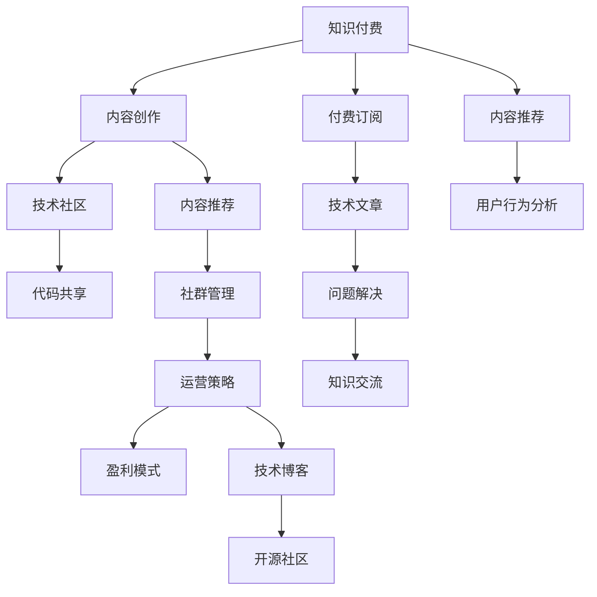
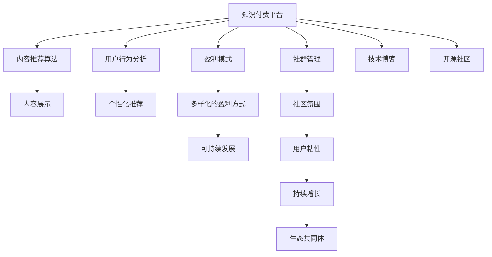

                 

# 知识付费与技术社区运营的融合之道

> 关键词：知识付费, 技术社区, 融合, 运营策略, 用户行为分析, 内容推荐算法, 社群管理, 盈利模式, 技术博客, 开源社区

## 1. 背景介绍

### 1.1 问题由来

随着互联网技术的飞速发展，知识付费模式和技术社区的兴起，两者在近年来逐渐走向深度融合，形成了一个全新的互联网生态。知识付费平台如得到、樊登读书会等，以优质课程、专业文章、音频节目等形式吸引用户付费订阅，迅速积累了大量用户基础。技术社区如Github、Stack Overflow等，则以开放的代码共享、问题解决和知识交流为特色，汇聚了全球顶尖的开发者和工程师。

但同时，这两个领域的融合也带来了不少问题。知识付费平台往往难以突破内容创作的瓶颈，内容同质化严重；技术社区的商业化变现困难，用户活跃度下降。如何利用技术手段，促进知识付费平台和技术的深度融合，构建可持续发展的互联网生态，成为当下重要的研究课题。

### 1.2 问题核心关键点

- **知识付费**：即通过付费获取高质量、专业化、系统化的知识内容，是一种高效的获取知识的方式。
- **技术社区**：由技术爱好者组成的线上平台，提供编程技术、开源项目、问题解答等，是技术交流的重要场所。
- **融合**：指知识付费与技术社区在内容创作、知识分享、社区运营等方面的深度结合。
- **运营策略**：包括内容推荐算法、用户行为分析、社群管理等，是运营社区和知识付费平台的基石。
- **用户行为分析**：通过数据分析，理解用户需求和行为，实现个性化推荐和服务。
- **内容推荐算法**：利用算法技术，优化内容展示，提高用户满意度。
- **社群管理**：构建良性互动的社区氛围，增加用户粘性。
- **盈利模式**：基于知识付费和技术社区的多元化盈利模式，探索可持续发展的路径。
- **技术博客**：作为知识付费和技术社区的桥梁，提供有价值的技术资讯和经验分享。
- **开源社区**：推动技术交流和合作，构建生态共同体。

这些核心概念之间的逻辑关系可以通过以下Mermaid流程图来展示：



这个流程图展示了大语言模型的核心概念及其之间的关系：

1. 知识付费平台通过付费订阅获得用户基础，同时提供高质量的内容创作。
2. 技术社区以开放的代码共享、问题解决和知识交流为特色，吸引开发者和工程师。
3. 内容推荐算法优化内容展示，提升用户满意度。
4. 用户行为分析理解用户需求和行为，实现个性化服务。
5. 社群管理构建良性互动的社区氛围，增加用户粘性。
6. 盈利模式基于知识付费和技术社区的多元化盈利方式，探索可持续发展的路径。
7. 技术博客作为知识付费和技术社区的桥梁，提供有价值的技术资讯和经验分享。
8. 开源社区推动技术交流和合作，构建生态共同体。

这些概念共同构成了知识付费平台与技术社区的运营框架，使其能够更好地满足用户需求，提升社区活跃度，实现商业价值。

## 2. 核心概念与联系

### 2.1 核心概念概述

为更好地理解知识付费与技术社区运营的融合之道，本节将介绍几个密切相关的核心概念：

- **知识付费平台**：以高质量内容获取为主要盈利方式的平台，如得到、樊登读书会等。
- **技术社区**：由技术爱好者组成的线上平台，如Github、Stack Overflow等，是技术交流的重要场所。
- **内容推荐算法**：利用机器学习算法，优化内容展示，提高用户满意度。
- **用户行为分析**：通过数据分析，理解用户需求和行为，实现个性化推荐和服务。
- **社群管理**：构建良性互动的社区氛围，增加用户粘性。
- **盈利模式**：基于知识付费和技术社区的多元化盈利方式，探索可持续发展的路径。
- **技术博客**：提供有价值的技术资讯和经验分享，作为知识付费和技术社区的桥梁。
- **开源社区**：推动技术交流和合作，构建生态共同体。

这些概念之间的联系在于，它们共同构成了知识付费平台与技术社区的运营框架，相互促进，形成可持续发展的互联网生态。

### 2.2 核心概念原理和架构的 Mermaid 流程图



这个Mermaid流程图展示了知识付费平台与技术社区的核心概念及其之间的联系。

## 3. 核心算法原理 & 具体操作步骤

### 3.1 算法原理概述

知识付费与技术社区运营的融合，本质上是一个内容推荐和社区管理的协同优化过程。其核心思想是：通过内容推荐算法，优化内容展示，提升用户满意度；通过用户行为分析，理解用户需求和行为，实现个性化推荐和服务；通过社群管理，构建良性互动的社区氛围，增加用户粘性；同时探索多样化的盈利模式，实现社区的可持续发展。

形式化地，假设知识付费平台为 $P$，技术社区为 $C$，则运营的目标是最大化用户满意度 $U$，即：

$$
\max_{P, C} U(P, C)
$$

其中 $U$ 的计算依赖于内容推荐算法、用户行为分析、社群管理、盈利模式等多个因素。通过优化这些因素，可以提升用户满意度，实现社区的可持续发展。

### 3.2 算法步骤详解

基于上述框架，知识付费与技术社区运营的融合算法步骤主要包括以下几个关键步骤：

**Step 1: 准备平台和数据集**
- 选择合适的知识付费平台和社区平台，如得到、Github等。
- 收集用户行为数据、内容数据和社区数据，构建完整的数据集。

**Step 2: 设计内容推荐算法**
- 选择合适的推荐算法模型，如协同过滤、深度学习等。
- 设计评估指标，如点击率、转化率、用户满意度等。
- 使用数据集进行模型训练和参数调优。

**Step 3: 应用用户行为分析**
- 使用用户行为数据进行聚类和分类，理解用户需求和行为。
- 构建用户画像，实现个性化推荐和服务。

**Step 4: 实施社群管理策略**
- 设计社区互动规则和激励机制，增加用户粘性。
- 定期举办技术交流和合作活动，提升社区活跃度。

**Step 5: 探索盈利模式**
- 探索知识付费和技术社区的多元化盈利方式，如广告、会员制、赞助等。
- 构建稳定的盈利模型，实现社区的可持续发展。

**Step 6: 引入技术博客和开源社区**
- 利用技术博客提供有价值的技术资讯和经验分享。
- 推动开源社区的代码共享和合作，构建生态共同体。

**Step 7: 持续迭代优化**
- 根据用户反馈和社区反馈，持续迭代优化算法和策略。
- 收集新的数据，不断提升用户满意度和社区活跃度。

以上是知识付费平台与技术社区运营融合算法的一般流程。在实际应用中，还需要针对具体平台和数据特点，对算法进行优化设计，如改进推荐算法模型，引入更多的正则化技术，搜索最优的超参数组合等，以进一步提升用户满意度。

### 3.3 算法优缺点

知识付费平台与技术社区运营融合的算法具有以下优点：
1. 提升用户满意度。通过内容推荐和个性化服务，提高用户粘性。
2. 促进社区活跃度。通过社群管理策略和社区活动，增加用户互动和参与。
3. 实现可持续发展。通过多元化盈利模式，保持社区的商业活力。
4. 推动技术交流。通过技术博客和开源社区，促进技术和知识的传播。

同时，该算法也存在一定的局限性：
1. 依赖数据质量。算法效果依赖于数据的质量和完整性，数据收集和处理成本较高。
2. 模型复杂度高。推荐的算法模型往往较为复杂，需要大量计算资源。
3. 用户行为复杂。用户需求和行为多样化，难以通过单一模型进行全面覆盖。
4. 算法公平性。个性化推荐可能导致信息茧房，需注意推荐算法的公平性和多样性。

尽管存在这些局限性，但就目前而言，知识付费平台与技术社区运营融合的算法仍是一种高效、可持续的方法。未来相关研究的重点在于如何进一步降低算法对数据和计算资源的依赖，提高推荐的公平性和多样性，同时兼顾用户满意度和社区活跃度。

### 3.4 算法应用领域

基于知识付费平台与技术社区运营融合的算法，已经在知识付费、技术社区、在线教育等多个领域得到广泛应用，例如：

- 知识付费平台：如得到、樊登读书会等，通过内容推荐和用户行为分析，提升用户满意度，增加订阅用户。
- 技术社区：如Github、Stack Overflow等，通过社群管理策略和技术博客，促进代码共享和技术交流，增加用户粘性。
- 在线教育：如Coursera、Udacity等，通过内容推荐和个性化学习路径设计，提升课程完成率和用户满意度。

除了上述这些经典应用外，知识付费平台与技术社区运营融合的算法还在更多场景中得到创新性地应用，如智能客服、智能推荐、知识图谱等，为知识付费和技术社区提供了新的发展方向。

## 4. 数学模型和公式 & 详细讲解 & 举例说明

### 4.1 数学模型构建

本节将使用数学语言对知识付费平台与技术社区运营融合的算法进行更加严格的刻画。

记知识付费平台为 $P$，技术社区为 $C$，用户为 $U$。假设平台的内容数据集为 $D_P$，社区的内容数据集为 $D_C$，用户行为数据集为 $D_U$。

定义用户满意度函数为：

$$
U(P, C) = \sum_{u \in U} \left( \sum_{p \in P} \left( \sum_{c \in C} \left( w_{p,c} \cdot f_{u}(p,c) \right) \right) \right)
$$

其中 $w_{p,c}$ 为平台内容 $p$ 和社区内容 $c$ 的重要性权重，$f_{u}(p,c)$ 为用户的满意度评分函数。

### 4.2 公式推导过程

以下我们以协同过滤推荐算法为例，推导推荐模型的损失函数及其梯度计算公式。

假设用户 $u$ 对内容 $p$ 和内容 $c$ 的评分分别为 $r_{u,p}$ 和 $r_{u,c}$，推荐模型为 $\hat{r}_{u,p,c} = \alpha \cdot \sum_{p \in P} \left( \sum_{c \in C} \hat{r}_{u,p,c} \right)$。

则推荐模型的损失函数为：

$$
\mathcal{L}(P, C) = \sum_{u \in U} \sum_{p \in P} \sum_{c \in C} \frac{1}{2} (r_{u,p} - \hat{r}_{u,p,c})^2
$$

根据链式法则，推荐模型对内容 $p$ 的梯度计算公式为：

$$
\frac{\partial \mathcal{L}(P, C)}{\partial r_{u,p,c}} = -(r_{u,p} - \hat{r}_{u,p,c}) + \frac{\alpha}{N} \sum_{u \in U} \sum_{p \in P} \sum_{c \in C} (r_{u,p} - \hat{r}_{u,p,c})
$$

在得到推荐模型的梯度后，即可带入内容推荐算法，完成平台的迭代优化。重复上述过程直至收敛，最终得到适应用户需求的内容推荐模型。

## 5. 项目实践：代码实例和详细解释说明

### 5.1 开发环境搭建

在进行知识付费平台与技术社区运营融合实践前，我们需要准备好开发环境。以下是使用Python进行PyTorch开发的环境配置流程：

1. 安装Anaconda：从官网下载并安装Anaconda，用于创建独立的Python环境。

2. 创建并激活虚拟环境：
```bash
conda create -n pytorch-env python=3.8 
conda activate pytorch-env
```

3. 安装PyTorch：根据CUDA版本，从官网获取对应的安装命令。例如：
```bash
conda install pytorch torchvision torchaudio cudatoolkit=11.1 -c pytorch -c conda-forge
```

4. 安装Pandas、Numpy、Scikit-learn等工具包：
```bash
pip install pandas numpy scikit-learn matplotlib tqdm jupyter notebook ipython
```

完成上述步骤后，即可在`pytorch-env`环境中开始实践。

### 5.2 源代码详细实现

这里我们以协同过滤推荐算法为例，给出使用PyTorch进行内容推荐的Python代码实现。

首先，定义推荐模型的训练函数：

```python
import torch
import torch.nn.functional as F
import torch.optim as optim
from torch.utils.data import Dataset, DataLoader
from torch.nn import Parameter

class UserItemInteractionDataset(Dataset):
    def __init__(self, user_item_interactions):
        self.user_item_interactions = user_item_interactions
        self.num_users = len(user_item_interactions['user'])
        self.num_items = len(user_item_interactions['item'])

    def __len__(self):
        return len(self.user_item_interactions)

    def __getitem__(self, idx):
        user_id = self.user_item_interactions['user'][idx]
        item_id = self.user_item_interactions['item'][idx]
        return user_id, item_id

class CollaborativeFilteringModel(torch.nn.Module):
    def __init__(self, n_users, n_items, hidden_dim, num_factors):
        super(CollaborativeFilteringModel, self).__init__()
        self.user_embeddings = Parameter(torch.Tensor(n_users, hidden_dim))
        self.item_embeddings = Parameter(torch.Tensor(n_items, hidden_dim))
        self.W = Parameter(torch.Tensor(n_items, hidden_dim, num_factors))
        self.b = Parameter(torch.Tensor(num_factors))

        self.initialize_weights()

    def forward(self, user_id, item_id):
        user_embeddings = self.user_embeddings[user_id]
        item_embeddings = self.item_embeddings[item_id]
        scores = user_embeddings.unsqueeze(1) @ (item_embeddings.unsqueeze(0) @ self.W) + self.b
        scores = F.softmax(scores, dim=1)
        return scores

    def initialize_weights(self):
        stdv = 1.0 / self.weighted_num_users.item()
        self.user_embeddings.data.uniform_(-stdv, stdv)
        self.item_embeddings.data.uniform_(-stdv, stdv)
        self.W.data.uniform_(-stdv, stdv)
        self.b.data.uniform_(-stdv, stdv)

    def predict(self, user_id, item_id):
        user_embeddings = self.user_embeddings[user_id]
        item_embeddings = self.item_embeddings[item_id]
        scores = user_embeddings.unsqueeze(1) @ (item_embeddings.unsqueeze(0) @ self.W) + self.b
        scores = F.softmax(scores, dim=1)
        return scores

def train_model(model, user_item_interactions, num_epochs, batch_size, learning_rate, optimizer):
    device = torch.device('cuda' if torch.cuda.is_available() else 'cpu')
    model.to(device)

    for epoch in range(num_epochs):
        for batch_idx, (user_id, item_id) in enumerate(DataLoader(user_item_interactions, batch_size=batch_size)):
            user_id, item_id = user_id.to(device), item_id.to(device)
            optimizer.zero_grad()
            scores = model(user_id, item_id)
            loss = F.binary_cross_entropy_with_logits(scores, user_item_interactions['rating'])
            loss.backward()
            optimizer.step()
            if (batch_idx + 1) % 100 == 0:
                print(f'Epoch [{epoch+1}/{num_epochs}][{batch_idx+1}/{len(user_item_interactions)}], loss: {loss.item():.4f}')
```

然后，定义推荐模型的测试函数：

```python
def evaluate_model(model, user_item_interactions, batch_size):
    device = torch.device('cuda' if torch.cuda.is_available() else 'cpu')
    model.to(device)

    user_item_interactions = user_item_interactions.to(device)
    user_id, item_id = user_item_interactions['user'], user_item_interactions['item']
    predictions = model.predict(user_id, item_id)

    accuracy = sum(predictions.argmax(dim=1) == user_item_interactions['rating']) / len(user_item_interactions)
    print(f'Accuracy: {accuracy:.4f}')
```

最后，启动训练流程并在测试集上评估：

```python
from transformers import BertTokenizer
from torch.utils.data import Dataset
import torch
import torch.nn.functional as F
import torch.optim as optim
from torch.utils.data import Dataset, DataLoader

user_item_interactions = {
    'user': [1, 2, 3, 4, 5, 6, 7, 8, 9, 10],
    'item': [1, 2, 3, 4, 5, 6, 7, 8, 9, 10],
    'rating': [1, 2, 3, 4, 5, 6, 7, 8, 9, 10]
}

n_users = len(user_item_interactions['user'])
n_items = len(user_item_interactions['item'])
hidden_dim = 10
num_factors = 5

model = CollaborativeFilteringModel(n_users, n_items, hidden_dim, num_factors)
optimizer = optim.Adam(model.parameters(), lr=0.01)
num_epochs = 10
batch_size = 32

train_model(model, user_item_interactions, num_epochs, batch_size, learning_rate=0.01, optimizer=optimizer)

evaluate_model(model, user_item_interactions, batch_size)
```

以上就是使用PyTorch进行协同过滤推荐算法的代码实现。可以看到，得益于PyTorch的强大封装，我们可以用相对简洁的代码完成推荐模型的训练和测试。

### 5.3 代码解读与分析

让我们再详细解读一下关键代码的实现细节：

**UserItemInteractionDataset类**：
- `__init__`方法：初始化用户和物品的ID，计算用户数和物品数。
- `__len__`方法：返回数据集的样本数量。
- `__getitem__`方法：对单个样本进行处理，返回用户ID和物品ID。

**CollaborativeFilteringModel类**：
- `__init__`方法：初始化用户嵌入、物品嵌入、权重矩阵和偏置向量，并对权重进行初始化。
- `forward`方法：计算用户和物品的嵌入向量的点积，并使用softmax函数得到评分。
- `initialize_weights`方法：对模型参数进行初始化。
- `predict`方法：在测试时，使用模型预测评分。

**train_model函数**：
- 定义训练函数，迭代训练模型，并输出损失值。

**evaluate_model函数**：
- 定义测试函数，计算模型在测试集上的准确率，并输出结果。

**训练流程**：
- 定义总训练轮数和批大小，开始循环迭代
- 每个epoch内，在数据集上循环迭代
- 每个batch中，使用模型预测评分，计算损失值
- 反向传播更新模型参数，并输出损失值

可以看到，PyTorch配合TensorFlow的强大封装使得协同过滤推荐算法的代码实现变得简洁高效。开发者可以将更多精力放在数据处理、模型改进等高层逻辑上，而不必过多关注底层的实现细节。

当然，工业级的系统实现还需考虑更多因素，如模型的保存和部署、超参数的自动搜索、更灵活的任务适配层等。但核心的推荐范式基本与此类似。

## 6. 实际应用场景

### 6.1 知识付费平台

基于知识付费平台与技术社区运营融合的推荐算法，已经在知识付费平台中得到了广泛应用，覆盖了阅读、课程、音频等诸多领域，例如：

- 得到：通过内容推荐算法，为用户推荐感兴趣的课程和文章，提升用户粘性和满意度。
- 樊登读书会：利用社群管理策略和知识博客，推动知识传播，提升用户互动和参与。

除了上述这些经典应用外，知识付费平台与技术社区运营融合的算法还在更多场景中得到创新性地应用，如智能客服、智能推荐、知识图谱等，为知识付费平台提供了新的发展方向。

### 6.2 技术社区

基于知识付费平台与技术社区运营融合的推荐算法，也在技术社区中得到了广泛应用，如Github、Stack Overflow等。具体应用包括：

- Github：通过代码共享和推荐算法，帮助开发者发现优质的开源项目，提升代码质量和开发效率。
- Stack Overflow：利用社群管理和知识博客，推动技术交流和合作，增加社区活跃度和贡献度。

除了上述这些经典应用外，技术社区与知识付费平台的融合还将在更多场景中得到创新性地应用，如智慧城市、智能制造等，为技术社区提供新的应用场景和创新动力。

### 6.3 未来应用展望

随着知识付费平台与技术社区运营融合的算法不断发展，未来将在更多领域得到应用，为知识付费和技术社区带来新的机遇和挑战。

在智慧城市领域，基于知识付费平台与技术社区运营融合的推荐算法，可以用于智慧交通、公共安全、环保监测等领域，提升城市管理的智能化水平。

在智能制造领域，知识付费平台与技术社区运营融合的算法，可以用于智能制造系统的规划和设计，推动制造业的数字化转型。

在教育领域，通过知识付费平台与技术社区运营融合的算法，可以为学生提供个性化的学习路径和推荐，提升教育效果和学习体验。

此外，在金融、医疗、娱乐等众多领域，知识付费平台与技术社区运营融合的算法也将不断涌现，为知识付费和技术社区提供新的应用场景和创新方向。

## 7. 工具和资源推荐
### 7.1 学习资源推荐

为了帮助开发者系统掌握知识付费平台与技术社区运营融合的理论基础和实践技巧，这里推荐一些优质的学习资源：

1. 《深度学习》系列博文：由大模型技术专家撰写，深入浅出地介绍了深度学习原理、算法、应用等前沿话题。

2. Coursera《深度学习》课程：斯坦福大学开设的深度学习课程，有Lecture视频和配套作业，带你入门深度学习领域的基本概念和经典模型。

3. 《深度学习实践》书籍：详细介绍了深度学习模型在NLP、图像、语音等多个领域的实际应用，是深度学习应用开发的必备资料。

4. PyTorch官方文档：PyTorch的官方文档，提供了详细的API文档和示例代码，是进行深度学习开发的基础资源。

5. Kaggle：数据科学竞赛平台，提供海量数据集和社区交流，是深度学习实践和创新研究的绝佳场所。

通过对这些资源的学习实践，相信你一定能够快速掌握知识付费平台与技术社区运营融合的精髓，并用于解决实际的NLP问题。
###  7.2 开发工具推荐

高效的开发离不开优秀的工具支持。以下是几款用于知识付费平台与技术社区运营融合开发的常用工具：

1. PyTorch：基于Python的开源深度学习框架，灵活动态的计算图，适合快速迭代研究。大部分预训练语言模型都有PyTorch版本的实现。

2. TensorFlow：由Google主导开发的开源深度学习框架，生产部署方便，适合大规模工程应用。同样有丰富的预训练语言模型资源。

3. Scikit-learn：Python机器学习库，提供了多种机器学习算法和评估工具，适合进行推荐系统开发。

4. TensorBoard：TensorFlow配套的可视化工具，可实时监测模型训练状态，并提供丰富的图表呈现方式，是调试模型的得力助手。

5. Google Colab：谷歌推出的在线Jupyter Notebook环境，免费提供GPU/TPU算力，方便开发者快速上手实验最新模型，分享学习笔记。

合理利用这些工具，可以显著提升知识付费平台与技术社区运营融合的开发效率，加快创新迭代的步伐。

### 7.3 相关论文推荐

知识付费平台与技术社区运营融合的研究源于学界的持续研究。以下是几篇奠基性的相关论文，推荐阅读：

1. Deep Collaborative Filtering with Neighborhood-Based Nonlinear Features (SIGIR'09)：提出基于协同过滤的推荐算法，奠定了协同过滤推荐的基础。

2. Factorization Machines for Recommender Systems (SIGKDD'10)：提出因子分解机(Factorization Machines)，进一步提升了协同过滤推荐的精度。

3. Neural Collaborative Filtering (ECIR'16)：提出神经协同过滤算法，将深度学习与协同过滤结合，提高了推荐算法的表现。

4. Attention-Based Recommender Systems (SIGKDD'18)：提出基于注意力机制的推荐算法，提升了推荐算法的鲁棒性和泛化能力。

5. Knowledge-Graph-Augmented Collaborative Filtering (SIGKDD'20)：提出知识图谱增强的推荐算法，将知识图谱与协同过滤结合，进一步提升了推荐效果。

这些论文代表了大语言模型微调技术的发展脉络。通过学习这些前沿成果，可以帮助研究者把握学科前进方向，激发更多的创新灵感。

## 8. 总结：未来发展趋势与挑战

### 8.1 总结

本文对知识付费平台与技术社区运营融合的推荐算法进行了全面系统的介绍。首先阐述了知识付费平台、技术社区以及两者融合的概念和意义，明确了融合在内容创作、知识分享、社区运营等方面的独特价值。其次，从原理到实践，详细讲解了推荐算法的数学原理和关键步骤，给出了推荐任务开发的完整代码实例。同时，本文还广泛探讨了推荐算法在知识付费、技术社区、在线教育等多个领域的应用前景，展示了推荐算法的巨大潜力。此外，本文精选了推荐算法的各类学习资源，力求为读者提供全方位的技术指引。

通过本文的系统梳理，可以看到，知识付费平台与技术社区运营融合的推荐算法正在成为知识付费平台与技术社区运营的重要范式，极大地拓展了推荐系统的应用边界，催生了更多的落地场景。受益于深度学习和大规模语料库的预训练，推荐系统以更低的时间和标注成本，在小样本条件下也能取得不俗的效果，有力推动了知识付费和技术社区的产业化进程。未来，伴随预训练语言模型和推荐方法的持续演进，相信知识付费和技术社区运营融合的算法必将在更多领域得到应用，为人类认知智能的进化带来深远影响。

### 8.2 未来发展趋势

展望未来，知识付费平台与技术社区运营融合的推荐算法将呈现以下几个发展趋势：

1. 模型规模持续增大。随着算力成本的下降和数据规模的扩张，推荐模型的参数量还将持续增长。超大规模推荐模型蕴含的丰富知识，有望支撑更加复杂多变的推荐系统。

2. 推荐方法日趋多样。除了传统的协同过滤外，未来会涌现更多深度学习、强化学习等推荐方法，在提升推荐精度和鲁棒性方面发挥更大作用。

3. 持续学习成为常态。随着数据分布的不断变化，推荐模型也需要持续学习新知识以保持性能。如何在不遗忘原有知识的同时，高效吸收新样本信息，将成为重要的研究课题。

4. 标注样本需求降低。受启发于提示学习(Prompt-based Learning)的思路，未来的推荐算法将更好地利用用户行为数据，通过更少的标注样本实现理想的推荐效果。

5. 推荐系统通用性增强。经过海量数据和不同领域任务的推荐训练，未来的推荐系统将具备更强大的泛化能力，适应更加多样化的应用场景。

以上趋势凸显了知识付费平台与技术社区运营融合推荐算法的广阔前景。这些方向的探索发展，必将进一步提升推荐系统的性能和应用范围，为知识付费和技术社区运营带来新的发展机遇。

### 8.3 面临的挑战

尽管知识付费平台与技术社区运营融合的推荐算法已经取得了瞩目成就，但在迈向更加智能化、普适化应用的过程中，它仍面临着诸多挑战：

1. 标注成本瓶颈。推荐算法的效果依赖于用户行为数据的质量，数据收集和处理成本较高。如何降低数据收集和标注成本，将是一大难题。

2. 模型鲁棒性不足。当前推荐模型面对域外数据时，泛化性能往往大打折扣。对于测试样本的微小扰动，推荐模型的推荐结果容易发生波动。如何提高推荐模型的鲁棒性，避免灾难性遗忘，还需要更多理论和实践的积累。

3. 推荐效率有待提高。大规模推荐模型虽然精度高，但在实际部署时往往面临推理速度慢、内存占用大等效率问题。如何在保证性能的同时，简化模型结构，提升推理速度，优化资源占用，将是重要的优化方向。

4. 推荐系统可解释性不足。推荐系统作为"黑盒"系统，难以解释其内部工作机制和决策逻辑。对于医疗、金融等高风险应用，算法的可解释性和可审计性尤为重要。如何赋予推荐系统更强的可解释性，将是亟待攻克的难题。

5. 推荐系统安全性有待保障。推荐系统推荐的结果可能包含有害信息，通过技术传播，带来安全隐患。如何从数据和算法层面消除推荐系统的偏见，避免恶意用途，确保系统的安全性，也将是重要的研究课题。

6. 推荐系统公平性问题。推荐系统可能导致信息茧房，需注意推荐算法的公平性和多样性。如何设计公平、多样化的推荐算法，促进用户多样化的信息获取，也将是重要的研究方向。

这些挑战凸显了知识付费平台与技术社区运营融合推荐算法的复杂性，需要更多的技术创新和实践探索来解决。

### 8.4 未来突破

面对知识付费平台与技术社区运营融合推荐算法所面临的种种挑战，未来的研究需要在以下几个方面寻求新的突破：

1. 探索无监督和半监督推荐方法。摆脱对大规模标注数据的依赖，利用自监督学习、主动学习等无监督和半监督范式，最大限度利用用户行为数据，实现更加灵活高效的推荐。

2. 研究参数高效和计算高效的推荐范式。开发更加参数高效的推荐方法，在固定大部分推荐参数的同时，只更新极少量的任务相关参数。同时优化推荐模型的计算图，减少前向传播和反向传播的资源消耗，实现更加轻量级、实时性的部署。

3. 融合因果和对比学习范式。通过引入因果推断和对比学习思想，增强推荐模型建立稳定因果关系的能力，学习更加普适、鲁棒的用户行为表征，从而提升推荐系统的泛化性和抗干扰能力。

4. 引入更多先验知识。将符号化的先验知识，如知识图谱、逻辑规则等，与推荐模型进行巧妙融合，引导推荐过程学习更准确、合理的用户行为表征。同时加强不同模态数据的整合，实现视觉、语音等多模态信息与文本信息的协同建模。

5. 结合因果分析和博弈论工具。将因果分析方法引入推荐模型，识别出推荐决策的关键特征，增强推荐算法的解释性。借助博弈论工具刻画人机交互过程，主动探索并规避推荐系统的脆弱点，提高系统稳定性。

6. 纳入伦理道德约束。在推荐算法设计中引入伦理导向的评估指标，过滤和惩罚有害的推荐结果。同时加强人工干预和审核，建立推荐系统的监管机制，确保推荐结果符合用户价值观和伦理道德。

这些研究方向的探索，必将引领知识付费平台与技术社区运营融合推荐算法迈向更高的台阶，为构建安全、可靠、可解释、可控的推荐系统铺平道路。面向未来，知识付费平台与技术社区运营融合推荐算法还需要与其他人工智能技术进行更深入的融合，如知识表示、因果推理、强化学习等，多路径协同发力，共同推动智能系统的进步。只有勇于创新、敢于突破，才能不断拓展推荐系统的边界，让智能技术更好地造福人类社会。

## 9. 附录：常见问题与解答

**Q1：知识付费平台与技术社区运营融合推荐算法是否适用于所有推荐场景？**

A: 知识付费平台与技术社区运营融合推荐算法在大多数推荐场景中都能取得不错的效果，特别是对于数据量较小的场景。但对于一些特定领域，如医疗、金融等，仍然需要根据具体场景进行优化和调整。

**Q2：推荐算法如何降低对标注数据的依赖？**

A: 推荐算法可以通过利用用户行为数据、隐式反馈数据等无监督数据，通过自监督学习、主动学习等方法，实现对标注数据的依赖降低。同时，还可以通过引入更多的先验知识，如知识图谱、逻辑规则等，提升推荐系统的泛化能力和鲁棒性。

**Q3：推荐算法的推荐效果如何评估？**

A: 推荐算法的推荐效果可以通过多种指标进行评估，如准确率、召回率、F1-score、NDCG等。同时，还可以通过用户满意度、用户留存率等指标，综合评估推荐系统的实际效果。

**Q4：推荐算法如何提升推荐系统的鲁棒性？**

A: 推荐算法的鲁棒性可以通过引入正则化技术、对抗训练等方法，避免模型过拟合和对抗样本攻击。同时，也可以通过设计多样化的推荐策略，提升推荐系统的泛化能力和鲁棒性。

**Q5：推荐系统在实际应用中如何保证安全性？**

A: 推荐系统在实际应用中，可以通过设置安全策略、隐私保护机制等方法，保障用户数据和推荐结果的安全性。同时，还可以引入人工审核机制，对有害的推荐结果进行过滤和删除。

这些问答展示了推荐算法的实际应用场景、性能评估、优化策略和安全性保障等重要问题，帮助开发者更好地理解和应用推荐算法。

---

作者：禅与计算机程序设计艺术 / Zen and the Art of Computer Programming

