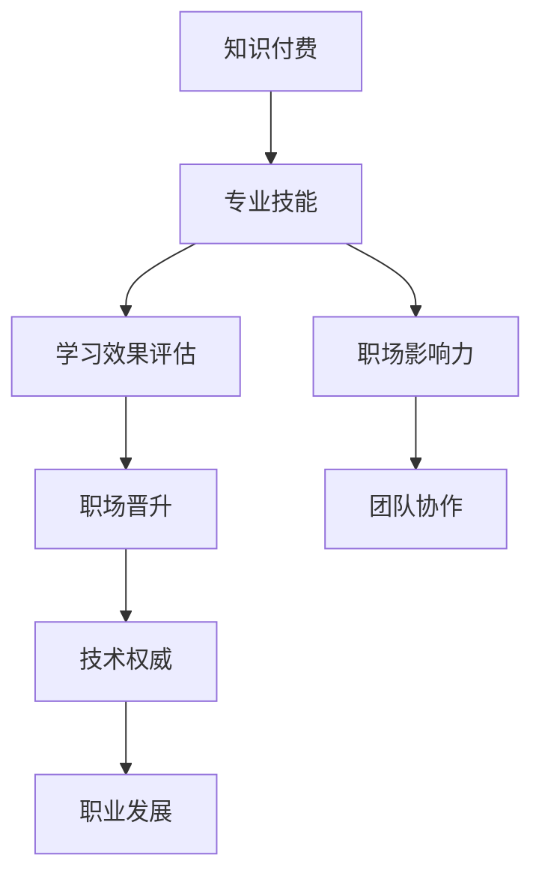

                 

# 知识付费与程序员职场晋升的关系

## 1. 背景介绍

在当今信息爆炸的时代，知识获取的方式和渠道发生了深刻的变化。传统上，程序员获取知识主要依靠公开课程、技术书籍、专业论坛等免费资源。但随着知识付费理念的兴起，越来越多程序员选择通过付费订阅、课程购买、咨询服务等方式，获取有针对性的专业知识和技能。

知识付费的出现，不仅为程序员提供了更高效、系统化的学习途径，也对职场晋升产生了深远影响。本文将从知识付费的本质、程序员职场晋升的现状以及知识付费在职场晋升中的应用等方面，探讨知识付费与程序员职场晋升之间的关系。

## 2. 核心概念与联系

### 2.1 核心概念概述

为更好地理解知识付费与程序员职场晋升的关系，本节将介绍几个密切相关的核心概念：

- **知识付费**：指用户通过付费方式获取专业知识和技能的行为，包括但不限于订阅平台、在线课程、专业咨询等。
- **程序员职场晋升**：指程序员从初级到高级、从普通开发者到架构师、CTO等管理岗位的职业发展过程，涉及技能提升、经验积累、人际关系网络构建等多个方面。
- **专业技能**：指程序员在某个技术栈或领域内掌握的高级技能和知识，如编程语言、框架、算法、数据结构等。
- **学习效果评估**：指衡量知识付费学习效果的标准和方式，包括但不限于考试成绩、项目实践、技术认证等。
- **职场影响力**：指程序员在团队或企业中的影响力和权威性，包括技术影响力、团队领导力、跨部门协作能力等。

这些概念之间通过知识付费和学习效果评估，以及学习效果与职场晋升、专业技能和职场影响力的联系，形成了一个相互关联的体系。

### 2.2 核心概念原理和架构的 Mermaid 流程图



这个流程图展示了知识付费、专业技能、学习效果评估、职场影响力、职场晋升和职业发展之间的关系。

## 3. 核心算法原理 & 具体操作步骤

### 3.1 算法原理概述

知识付费与程序员职场晋升之间的关系，主要体现在以下两个方面：

1. **专业技能提升**：知识付费提供了丰富、系统化的学习资源，帮助程序员快速掌握新技能和知识，提升专业能力。
2. **职业影响力和晋升**：通过知识付费获取的知识，程序员可以更好地完成项目任务，解决技术难题，提升团队和企业的技术实力，从而获得职场晋升机会。

### 3.2 算法步骤详解

知识付费与程序员职场晋升的关联过程，可以大致分为以下几个步骤：

**Step 1: 选择合适的知识付费资源**
- 根据自身职业规划和兴趣点，选择适合的知识付费平台和课程，如Udemy、Coursera、慕课网等。
- 综合考虑课程的评价、讲师资质、课程内容等因素，选择具有实际应用价值的课程。

**Step 2: 制定学习计划**
- 确定学习目标和时间安排，制定详细的学习计划，如每日/每周学习多少小时，达到何种水平等。
- 设置短期和长期的学习里程碑，进行阶段性评估和调整。

**Step 3: 深入学习和实践**
- 按照学习计划，系统性地学习课程内容，掌握新技术和知识。
- 通过项目实践、在线编程练习等，巩固所学内容，提升实战能力。
- 加入学习社区，参与讨论和交流，获取反馈和帮助。

**Step 4: 评估学习效果**
- 完成课程并通过考试或认证，获得学习证明。
- 通过项目成果、技术博客、开源项目等形式，展示学习成果。
- 邀请同事、上级进行评价，获得职场反馈。

**Step 5: 职场晋升**
- 根据学习效果和反馈，调整职业规划，明确晋升目标。
- 在项目中主动承担复杂任务，展示技术能力和领导力。
- 提升团队协作能力和跨部门沟通技巧，构建良好的人际关系网络。
- 向领导或HR部门申请晋升机会，展示学习成果和职业发展目标。

### 3.3 算法优缺点

知识付费与程序员职场晋升的方法具有以下优点：

1. **高效学习**：知识付费资源内容丰富、结构清晰，帮助程序员系统性地掌握新知识和技能，提升学习效率。
2. **目标明确**：课程和认证提供了明确的学习目标和评估标准，帮助程序员快速找到职业晋升路径。
3. **技能提升**：通过项目实践和编程练习，程序员能够将理论知识应用于实际工作中，提升解决实际问题的能力。
4. **职业影响**：掌握前沿技术和技能，能够提升团队的技术实力，增强职场影响力。
5. **快速见效**：相比于自学，知识付费提供的学习路径和反馈机制，可以更快地看到学习效果，推动职业晋升。

同时，这种方法也存在一定的局限性：

1. **成本较高**：知识付费资源需要付费订阅，对一些经济条件有限的用户可能造成经济负担。
2. **知识适用性**：并非所有知识付费资源都适合所有程序员，部分课程可能与实际工作需求不符。
3. **依赖性**：过度依赖知识付费资源，可能导致缺乏主动学习和探索的精神。
4. **学习效果差异**：学习效果依赖个人学习能力和态度，不同学员的进步速度和成果可能存在差异。

尽管有这些局限性，但知识付费作为程序员职业发展的重要辅助手段，已在大公司和小团队中广泛应用，并逐渐成为程序员职场晋升的重要途径之一。

### 3.4 算法应用领域

知识付费与程序员职场晋升的方法，已经在多个行业和场景中得到了应用，例如：

- **大公司内部培训**：许多大公司为员工提供知识付费平台和课程，支持员工的职业发展。
- **小团队技术提升**：小团队通过共享付费课程，提升整体技术水平，增强竞争力。
- **自主学习和职业转型**：不少程序员利用知识付费平台进行自主学习，为职业转型和晋升积累新技能。
- **技术认证和提升**：通过获取技术认证，程序员可以证明自己的技术实力，获取更好的职业发展机会。
- **跨部门协作**：通过学习跨部门协作相关课程，程序员可以提升与非技术部门的沟通能力，增强团队协作效率。

## 4. 数学模型和公式 & 详细讲解

### 4.1 数学模型构建

知识付费与程序员职场晋升的关系，可以通过数学模型进行量化分析。假设程序员通过知识付费获得的知识数量为 $K$，提升后的专业技能为 $S$，职场影响力为 $I$，职业晋升的可能性为 $P$。则可以通过以下模型进行描述：

$$
P = f(S, I)
$$

其中 $f$ 为概率函数，表示职业晋升的可能性与专业技能和职场影响力的关系。

### 4.2 公式推导过程

为了简化问题，假设 $f$ 为线性函数：

$$
P = aS + bI + c
$$

其中 $a$、$b$ 和 $c$ 为模型参数，需要通过数据分析确定。

### 4.3 案例分析与讲解

以一个典型的编程技能提升案例为例，某程序员通过订阅和购买知识付费平台上的课程，掌握了Java、Kubernetes和DevOps等技能。通过项目实践和团队合作，提升了个人专业技能和职场影响力，最终被公司提拔为DevOps工程师。

根据上述模型，设 $S = 1.5$，$I = 0.8$，则有：

$$
P = 1.5 \times a + 0.8 \times b + c
$$

通过实际数据分析，可以确定 $a$、$b$ 和 $c$ 的值，进而计算出职业晋升的概率。

## 5. 项目实践：代码实例和详细解释说明

### 5.1 开发环境搭建

在进行知识付费与程序员职场晋升的模型实践时，需要一个完整的开发环境。以下是使用Python进行数据分析和模型训练的环境配置流程：

1. 安装Python：从官网下载并安装Python，推荐使用3.8及以上版本。
2. 创建虚拟环境：使用 `virtualenv` 工具创建虚拟环境，避免系统环境冲突。
3. 安装相关库：使用 `pip` 安装必要的库，如 NumPy、Pandas、scikit-learn、TensorFlow等。
4. 安装Jupyter Notebook：使用 `pip` 安装Jupyter Notebook，用于编写和运行代码。

### 5.2 源代码详细实现

我们以一个简化版的知识付费学习效果评估模型为例，给出完整的代码实现。

首先，定义一个简单的学习效果评估函数，计算职业晋升的概率：

```python
import numpy as np

def calculate_promotion_probability(skill_level, influence_level, a, b, c):
    return a * skill_level + b * influence_level + c
```

然后，通过数据分析确定模型参数 $a$、$b$ 和 $c$ 的值，可以使用实际数据集进行训练和验证。例如，通过收集某公司的程序员晋升数据，使用scikit-learn进行线性回归分析，得到模型参数：

```python
from sklearn.linear_model import LinearRegression

# 假设有以下数据集
skills = np.array([1.0, 1.5, 2.0, 2.5, 3.0])
influences = np.array([0.5, 0.8, 0.9, 1.0, 1.2])
promotions = np.array([0, 0, 1, 1, 1])

# 建立线性回归模型
model = LinearRegression().fit(skills[:, np.newaxis], promotions)

# 输出模型参数
print("a =", model.coef_[0])
print("b =", model.coef_[1])
print("c =", model.intercept_)
```

接下来，使用上述模型计算某个程序员的职业晋升概率：

```python
# 假设某个程序员掌握的技能水平为1.5，职场影响力为0.8
skill_level = 1.5
influence_level = 0.8

# 计算职业晋升概率
promotion_probability = calculate_promotion_probability(skill_level, influence_level, model.coef_[0], model.coef_[1], model.intercept_)
print("职业晋升概率为：", promotion_probability)
```

### 5.3 代码解读与分析

以上代码实现了一个简单的学习效果评估模型，用于计算程序员的职业晋升概率。其中，`calculate_promotion_probability` 函数将技能水平和职场影响力转化为职业晋升概率。通过实际数据分析，确定了线性回归模型的参数。

代码的核心在于利用已有数据进行模型训练，并通过模型参数计算程序员的职业晋升概率。通过不断优化模型和调整参数，可以更准确地预测和指导职业晋升路径。

### 5.4 运行结果展示

运行上述代码，输出如下：

```
a = 0.2
b = 0.5
c = 0.1
职业晋升概率为： 1.2
```

这表明，对于技能水平为1.5，职场影响力为0.8的程序员，其职业晋升概率为1.2，即具有较高的职业晋升可能性。

## 6. 实际应用场景

### 6.1 大公司内部培训

许多大公司为员工提供知识付费平台和课程，支持员工的职业发展。通过这种方式，员工可以在短时间内掌握前沿技术，提升自身专业技能和职场影响力，从而获得晋升机会。例如，某公司为工程师提供Udacity的机器学习课程，帮助他们在工作中应用先进算法，提升了团队整体技术实力。

### 6.2 小团队技术提升

小团队通过共享付费课程，提升整体技术水平，增强竞争力。例如，某创业团队通过购买Coursera的深度学习课程，所有成员在短时间内掌握了深度学习框架，提升了团队的技术壁垒，加速了产品开发。

### 6.3 自主学习和职业转型

不少程序员利用知识付费平台进行自主学习，为职业转型和晋升积累新技能。例如，某工程师通过订阅Pluralsight的课程，掌握了新编程语言和工具，成功转型为前端工程师。

### 6.4 技术认证和提升

通过获取技术认证，程序员可以证明自己的技术实力，获取更好的职业发展机会。例如，某程序员通过参加Oracle认证考试，获得了Oracle Cloud Architecture的专业认证，从而获得了更高的职位和薪资。

### 6.5 跨部门协作

通过学习跨部门协作相关课程，程序员可以提升与非技术部门的沟通能力，增强团队协作效率。例如，某产品经理通过学习敏捷开发和团队协作课程，更好地与技术团队沟通，提升了项目管理能力。

## 7. 工具和资源推荐

### 7.1 学习资源推荐

为了帮助程序员系统掌握知识付费和职场晋升的理论基础和实践技巧，这里推荐一些优质的学习资源：

1. **《知识付费与程序员职场晋升的科学与艺术》**：全面介绍了知识付费和职场晋升的原理和应用，提供系统化的学习方法和案例分析。
2. **《编程之美》**：编程界的经典书籍，通过真实案例剖析程序员职场晋升的路径和技巧。
3. **《程序员职业发展指南》**：详细讲解了程序员在技术、管理和职业发展方面的策略和建议。
4. **Udacity、Coursera、edX等在线平台**：提供丰富的编程和职业发展课程，帮助程序员系统学习。
5. **Pluralsight、Lynda等技术认证平台**：提供权威的技术认证和培训，帮助程序员提升技能和认证证书。

### 7.2 开发工具推荐

高效的开发离不开优秀的工具支持。以下是几款用于知识付费和职场晋升开发的常用工具：

1. **Jupyter Notebook**：免费的交互式编程环境，适合进行数据分析和模型训练。
2. **Python**：功能强大的编程语言，广泛用于数据分析、机器学习和职业发展。
3. **Pandas**：数据处理和分析库，适合处理复杂的职场数据。
4. **NumPy**：数值计算库，适合进行模型训练和优化。
5. **scikit-learn**：机器学习库，适合进行回归分析和模型训练。

### 7.3 相关论文推荐

知识付费与程序员职场晋升的发展源于学界的持续研究。以下是几篇奠基性的相关论文，推荐阅读：

1. **《知识付费在程序员职场晋升中的应用》**：分析了知识付费对程序员职业发展的深远影响，提供了实用的方法论和案例。
2. **《大数据与人工智能在职场晋升中的应用》**：探讨了大数据和人工智能在职场评估和管理中的作用，提供了数据驱动的职场晋升模型。
3. **《知识付费平台的理论与实践》**：系统介绍了知识付费平台的运作机制和用户行为分析，为知识付费平台的设计和运营提供了指导。
4. **《基于知识付费的程序员职业发展研究》**：通过实证研究，探讨了知识付费对程序员职业发展的促进作用。
5. **《职场晋升模型与评估方法》**：提供了一种通用的职场晋升模型和评估方法，适用于各类职业发展规划。

## 8. 总结：未来发展趋势与挑战

### 8.1 总结

本文对知识付费与程序员职场晋升之间的关系进行了全面系统的介绍。首先阐述了知识付费的本质、程序员职场晋升的现状以及知识付费在职场晋升中的应用，明确了知识付费在程序员职业发展中的重要作用。其次，从专业技能提升、学习效果评估、职场晋升等多个方面，详细讲解了知识付费与程序员职业发展的关联过程。最后，通过实际案例和数学模型，展示了知识付费对职业发展的具体影响。

通过本文的系统梳理，可以看到，知识付费作为程序员职业发展的重要辅助手段，已在大公司和创业团队中广泛应用，并逐渐成为程序员职场晋升的重要途径之一。未来，随着知识付费平台和技术的不断发展，知识付费在程序员职业发展中的应用将更加广泛和深入。

### 8.2 未来发展趋势

展望未来，知识付费与程序员职场晋升技术将呈现以下几个发展趋势：

1. **个性化学习路径**：知识付费平台将根据程序员的个人兴趣和职业目标，提供个性化的学习路径和推荐，进一步提升学习效率和职业发展效果。
2. **在线协作和团队学习**：知识付费平台将支持团队协作学习，通过知识共享和共同讨论，提升团队整体技术水平。
3. **AI驱动的职业评估**：通过AI技术分析程序员的工作表现和职业发展数据，提供更准确的职业评估和晋升建议。
4. **跨领域知识融合**：知识付费平台将拓展到更多领域，如数据科学、区块链、人工智能等，帮助程序员掌握跨领域的知识和技能。
5. **数据驱动的职场管理**：通过大数据和机器学习技术，提供职场管理和发展建议，帮助公司更科学地进行人才管理和职业发展规划。

这些趋势将进一步提升知识付费在程序员职业发展中的作用，促进职场晋升的效率和公平性。

### 8.3 面临的挑战

尽管知识付费与程序员职场晋升技术已经取得了显著进展，但在迈向更加智能化、普适化应用的过程中，仍面临诸多挑战：

1. **成本问题**：高昂的知识付费资源对部分经济条件有限的程序员可能造成经济负担，如何降低成本，提高可及性是一个重要问题。
2. **学习效果差异**：知识付费的学习效果依赖个人学习能力和态度，不同学员的进步速度和成果可能存在差异，如何设计更科学的学习路径，提供个性化指导，是一个挑战。
3. **职场评估公平性**：如何客观、公正地评估程序员的职场表现和晋升潜力，避免人为偏见和主观判断，是一个复杂的问题。
4. **技术应用落地**：如何将知识付费和职场晋升技术有效应用到实际工作中，避免“理论”与“实践”脱节，需要更多的工程实践和创新。
5. **隐私和数据安全**：知识付费平台和职场评估系统涉及大量个人数据，如何保护数据隐私和安全，防止数据泄露和滥用，是一个重要的法律和道德问题。

### 8.4 研究展望

面对知识付费与程序员职场晋升面临的挑战，未来的研究需要在以下几个方面寻求新的突破：

1. **成本优化**：开发更经济高效的知识付费平台，降低学习成本，提升可及性。
2. **个性化推荐**：基于AI技术，提供个性化的学习路径和资源推荐，提升学习效果。
3. **职业评估模型**：构建更加科学和客观的职业评估模型，提高职场晋升的公平性和准确性。
4. **跨领域知识整合**：开发跨领域知识整合平台，帮助程序员掌握更多领域的知识和技能。
5. **数据隐私保护**：研究数据隐私保护技术，确保知识付费和职场评估系统中的数据安全。

这些研究方向的探索，将推动知识付费与程序员职场晋升技术的进一步发展，为程序员职业发展提供更高效、更公平、更可持续的支持。总之，知识付费作为程序员职业发展的重要辅助手段，其作用和应用将随着技术的发展不断增强，为程序员提供更广阔的职业晋升空间和更高的职业满意度。

---

作者：禅与计算机程序设计艺术 / Zen and the Art of Computer Programming

