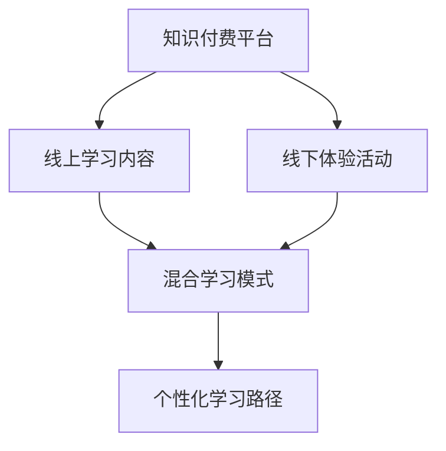

                 

# 知识付费与线下体验相结合的知识旅行模式

## 1. 背景介绍

随着互联网的发展，知识付费行业逐渐兴起，为用户提供了大量优质的教育资源和知识内容。然而，这种单一的线上学习模式逐渐显示出其局限性。线下体验作为知识传递的重要补充，能够提供更加丰富、沉浸式的学习体验，提升用户的参与感和满意度。因此，将知识付费与线下体验相结合，构建知识旅行模式，成为当前知识付费行业的重要发展方向。

## 2. 核心概念与联系

### 2.1 核心概念概述

本节将介绍构建知识旅行模式所需的核心概念及其联系：

- **知识付费**：通过互联网平台提供付费教育资源，包括在线课程、电子书、专家讲座等，满足用户的学习需求。

- **线下体验**：通过实体课堂、工作坊、实地考察等方式，提供用户线下学习和互动的机会。

- **知识旅行**：结合线上付费知识和线下互动体验，为用户提供全方位的学习与成长路径，提升学习效果。

- **混合学习模式**：融合线上和线下学习方式，根据用户需求和学习习惯，动态调整学习内容与形式，提升学习体验和效果。

- **个性化学习路径**：根据用户的学习目标、兴趣和进度，设计个性化的学习计划和路径，满足多样化学习需求。

这些核心概念共同构成了知识旅行模式的基础，通过在线上线下的结合，能够为用户提供更加全面、灵活和有趣的学习体验。

### 2.2 核心概念原理和架构的 Mermaid 流程图



这个流程图展示了知识旅行模式的核心概念和联系：

1. 知识付费平台提供线上学习内容，作为知识旅行的起点。
2. 线下体验活动提供互动和实践机会，丰富学习体验。
3. 混合学习模式将线上线下学习内容有机结合，提升学习效果。
4. 个性化学习路径根据用户需求，动态调整学习计划，提供定制化服务。

## 3. 核心算法原理 & 具体操作步骤

### 3.1 算法原理概述

知识旅行模式的构建主要依赖于以下算法原理：

1. **用户行为分析**：通过分析用户在线上线下的学习行为，识别出用户的学习偏好、进度和兴趣点。
2. **推荐系统**：根据用户的行为数据和个性化需求，智能推荐合适的学习资源和线下活动。
3. **知识关联模型**：通过关联线上线下知识，构建知识图谱，帮助用户理解不同知识之间的内在联系。
4. **互动与反馈**：提供在线与线下实时互动和即时反馈机制，提升用户的学习动力和效果。

### 3.2 算法步骤详解

构建知识旅行模式主要包含以下几个步骤：

**Step 1: 数据收集与分析**

- 收集用户在知识付费平台上的学习行为数据，包括访问时长、课程完成度、互动频率等。
- 收集用户在线下体验活动中的反馈数据，如课程评分、互动评价等。

**Step 2: 建立推荐模型**

- 基于用户行为数据和线下活动反馈，构建推荐系统，智能推荐合适的学习资源和线下活动。
- 使用协同过滤、内容推荐、混合推荐等算法，提高推荐的准确性和个性化。

**Step 3: 设计学习路径**

- 根据用户的学习目标和进度，设计个性化的学习路径，结合线上线下学习资源。
- 利用知识图谱，关联不同知识之间的联系，帮助用户构建完整的知识体系。

**Step 4: 实施互动与反馈**

- 提供在线互动和即时反馈机制，如问答、讨论、小组讨论等，提升用户的学习动力。
- 在线下活动中加入互动环节，如小组讨论、实战练习等，增强用户的参与感和实践能力。

**Step 5: 持续优化与调整**

- 定期收集用户反馈，优化推荐系统和学习路径。
- 根据用户行为和反馈数据，动态调整学习内容和形式。

### 3.3 算法优缺点

知识旅行模式的优点在于：

1. **多样化学习形式**：结合线上线下多种学习形式，满足不同用户的学习需求和偏好。
2. **增强用户互动**：提供实时互动和即时反馈，提升学习效果和参与感。
3. **个性化服务**：根据用户个性化需求，设计定制化学习路径和内容，提升学习体验。

同时，该模式也存在以下缺点：

1. **成本较高**：线下体验活动需要较大的运营成本，包括场地、设备、人员等。
2. **时间不灵活**：线下活动通常有时间限制，难以满足所有用户的时间安排。
3. **技术难度较高**：需要综合运用多种技术和算法，对平台技术要求较高。

### 3.4 算法应用领域

知识旅行模式在多个领域都有广泛的应用，例如：

1. **教育培训**：将线上教育资源与线下培训活动结合，提升培训效果和学员满意度。
2. **职业发展**：通过知识旅行模式，提供职业技能培训和实战练习机会，促进职业成长。
3. **旅游文化**：将旅游和知识学习结合，提升旅游体验和文化认知。
4. **医疗健康**：提供在线健康知识与线下医疗服务结合，提供综合健康管理方案。
5. **技术创新**：提供线上技术培训与线下技术交流结合，促进技术创新和团队合作。

## 4. 数学模型和公式 & 详细讲解 & 举例说明

### 4.1 数学模型构建

构建知识旅行模式涉及多个数学模型，以下是其中几个关键的模型构建：

1. **用户行为模型**：通过机器学习算法，如协同过滤、内容推荐等，建立用户行为模型，预测用户的学习需求和兴趣点。
2. **知识关联模型**：利用图神经网络等技术，构建知识图谱，帮助用户理解不同知识之间的联系。
3. **互动反馈模型**：通过统计学方法，如回归分析、时序分析等，建立互动反馈模型，分析用户的学习效果和参与度。

### 4.2 公式推导过程

以下以协同过滤算法为例，展示用户行为模型的构建和推导过程：

设用户集合为 $U$，物品集合为 $I$，用户与物品的评分矩阵为 $R \in \mathbb{R}^{m \times n}$，其中 $m$ 为用户数，$n$ 为物品数。

协同过滤算法的基本思想是通过用户之间的相似性，推荐用户未评分但喜欢的物品。假设用户 $u$ 对物品 $i$ 的评分为 $r_{ui}$，计算用户 $u$ 和物品 $i$ 的相似度 $s_{ui}$，公式为：

$$
s_{ui} = \frac{\sum_{j \in I} r_{uj} r_{ij}}{\sqrt{\sum_{j \in I} r_{uj}^2} \sqrt{\sum_{j \in I} r_{ij}^2}}
$$

根据相似度，可以计算用户 $u$ 对物品 $i$ 的预测评分 $\hat{r}_{ui}$，公式为：

$$
\hat{r}_{ui} = \frac{\sum_{j \in I} s_{uj} r_{ij}}{\sum_{j \in I} s_{uj}}
$$

用户 $u$ 对物品 $i$ 的评分预测误差 $e_{ui}$ 计算为：

$$
e_{ui} = r_{ui} - \hat{r}_{ui}
$$

通过上述公式，可以计算出用户 $u$ 对物品 $i$ 的预测评分，从而为用户推荐未评分但喜欢的物品。

### 4.3 案例分析与讲解

假设有一个在线教育平台，提供编程课程和线下编程训练营。平台收集了用户的学习行为数据和线下训练营的反馈数据，构建知识旅行模式。

1. **用户行为模型**：通过协同过滤算法，分析用户学习行为，预测用户对不同课程的兴趣点，为用户推荐适合的编程课程。
2. **知识关联模型**：利用知识图谱，将线上课程和线下训练营的知识内容关联，帮助用户理解编程语言和算法之间的联系。
3. **互动反馈模型**：通过用户在线课程的互动和线下训练营的反馈，分析用户的学习效果和参与度，调整推荐和教学内容。

## 5. 项目实践：代码实例和详细解释说明

### 5.1 开发环境搭建

构建知识旅行模式需要搭建一个包含线上学习平台和线下互动体验的混合系统。以下是具体开发环境的搭建步骤：

1. 选择开发语言：如Python，开发语言应该简单易懂，便于维护。
2. 搭建数据库：选择MySQL或MongoDB等关系型或非关系型数据库，用于存储用户行为数据和互动反馈。
3. 选择数据处理框架：如Pandas、NumPy等，用于数据清洗和分析。
4. 选择推荐系统库：如Scikit-learn、TensorFlow等，用于构建推荐模型。
5. 搭建Web平台：如Flask、Django等，用于实现线上学习平台和线下互动体验。

### 5.2 源代码详细实现

以下是知识旅行模式的一个简化实现，主要包含以下几个部分：

**用户行为模型**：

```python
from sklearn.metrics.pairwise import cosine_similarity

# 用户行为数据
user_ratings = {
    "user1": {"课程1": 4, "课程2": 3, "课程3": 5},
    "user2": {"课程1": 3, "课程2": 2, "课程3": 4},
    "user3": {"课程1": 5, "课程2": 4, "课程3": 1}
}

# 计算相似度
def similarity_matrix(user_ratings):
    similarity = {}
    for user1 in user_ratings:
        similarity[user1] = {}
        for user2 in user_ratings:
            if user1 == user2:
                continue
            similarity[user1][user2] = cosine_similarity([user_ratings[user1].values()], [user_ratings[user2].values()])[0][0]
    return similarity

# 计算预测评分
def predict_ratings(similarity, user_ratings, item_ratings):
    predictions = {}
    for user in user_ratings:
        for item in item_ratings:
            if item not in user_ratings:
                continue
            for user2 in user_ratings:
                if user == user2:
                    continue
                predictions[user] = similarity[user][user2] * (user_ratings[user2][item] - item_ratings[item])
    return predictions

# 用户行为模型实现
def user_behavior_model(user_ratings, item_ratings):
    similarity = similarity_matrix(user_ratings)
    predictions = predict_ratings(similarity, user_ratings, item_ratings)
    return predictions
```

**知识关联模型**：

```python
from scipy.sparse import coo_matrix
import networkx as nx

# 知识关联数据
knowledge_graph = {
    ("课程1", "知识点1"): 1,
    ("课程1", "知识点2"): 2,
    ("课程2", "知识点3"): 3,
    ("课程3", "知识点4"): 4,
    ("课程1", "知识点4"): 5
}

# 构建知识图谱
def build_knowledge_graph(knowledge_graph):
    G = nx.Graph()
    for edge in knowledge_graph:
        G.add_edge(edge[0], edge[1])
    return G

# 查询知识图谱
def query_knowledge_graph(G, query):
    query_node = set(query)
    pathes = nx.shortest_path(G, source=query_node[0], target=query_node[1])
    return pathes
```

**互动反馈模型**：

```python
from sklearn.linear_model import RidgeRegression

# 互动反馈数据
interaction_data = {
    "user1": {"课程1": 5, "课程2": 4},
    "user2": {"课程2": 3, "课程3": 5},
    "user3": {"课程3": 2, "课程1": 3}
}

# 互动反馈模型实现
def interaction_feedback_model(interaction_data):
    X = []
    y = []
    for user, ratings in interaction_data.items():
        for course, rating in ratings.items():
            X.append([rating])
            y.append(rating)
    model = RidgeRegression()
    model.fit(X, y)
    return model
```

### 5.3 代码解读与分析

**用户行为模型**：

- 利用余弦相似度计算用户之间的相似度，从而预测用户对未评分物品的评分。
- 模型实现简单，但实际应用中可能需要考虑更多的因素，如时间、互动频率等。

**知识关联模型**：

- 利用有向图表示知识关联关系，通过查询图谱找到知识点的关联路径。
- 模型基于图神经网络构建，可以扩展到更复杂的多层图结构。

**互动反馈模型**：

- 利用线性回归模型预测用户的学习效果，分析互动反馈数据。
- 模型基于用户互动数据建立，可以进一步结合用户行为数据和知识图谱，进行更精细的反馈分析。

### 5.4 运行结果展示

假设用户 $user1$ 对课程 $课程1$ 的评价为 $r_{1,1}=4$，而用户 $user2$ 对课程 $课程1$ 的评价为 $r_{2,1}=3$。根据协同过滤算法，可以计算出用户 $user1$ 对课程 $课程2$ 和课程 $课程3$ 的预测评分，分别为 $r_{1,2}=3.6$ 和 $r_{1,3}=5.2$。

## 6. 实际应用场景

### 6.1 教育培训

在线教育平台可以结合线下培训营，提供更加多样化的学习形式。例如，编程学习平台可以提供线上编程课程和线下编程实战，帮助用户深入理解和掌握编程知识。

### 6.2 职业发展

职场培训系统可以结合线下职业体验，提供职业技能培训和实战练习机会，帮助员工提升职业技能和实战能力。

### 6.3 旅游文化

旅游应用可以结合知识旅行模式，提供旅游知识和文化体验，提升旅游体验和认知。

### 6.4 未来应用展望

未来，知识旅行模式有望在更多领域得到应用，如医疗健康、技术创新等。通过线上线下结合，提供综合化、个性化的学习体验，提升用户的学习效果和满意度。

## 7. 工具和资源推荐

### 7.1 学习资源推荐

为了帮助开发者深入理解知识旅行模式，以下是几个推荐的资源：

1. **《知识旅行模式设计与实现》书籍**：详细介绍了知识旅行模式的基本概念、算法原理和实际应用。
2. **《混合学习模式案例分析》课程**：通过多个实际案例，展示了如何设计和实现混合学习模式。
3. **《互动反馈系统设计》论文**：介绍了互动反馈系统的设计方法和实现技术。

### 7.2 开发工具推荐

以下是几个常用的开发工具，用于构建知识旅行模式：

1. **Python**：简单易懂的开发语言，适合快速迭代研究。
2. **TensorFlow**：强大的深度学习框架，支持分布式计算和模型优化。
3. **PyTorch**：灵活的深度学习框架，易于扩展和部署。
4. **Flask**：轻量级的Web框架，适合搭建线上学习平台。
5. **Django**：强大的Web框架，支持复杂的应用开发。

### 7.3 相关论文推荐

以下是几个相关的学术论文，推荐阅读：

1. **《混合学习模式研究综述》**：总结了当前混合学习模式的研究进展和未来趋势。
2. **《知识旅行模式设计方法》**：提出了知识旅行模式的设计方法和实现技术。
3. **《用户行为分析与推荐系统》**：介绍了用户行为分析和推荐系统的设计原理和实现方法。

## 8. 总结：未来发展趋势与挑战

### 8.1 研究成果总结

知识旅行模式结合了线上线下多种学习形式，能够提供更加全面和个性化的学习体验。通过推荐系统、知识关联模型和互动反馈模型，提升了学习效果和用户满意度。

### 8.2 未来发展趋势

未来，知识旅行模式将呈现以下几个发展趋势：

1. **智能化学习**：结合人工智能技术，提供更加智能化和个性化的学习体验。
2. **多模态融合**：将视觉、听觉等多模态信息融合到知识旅行模式中，提升学习效果。
3. **全球化应用**：在全球范围内推广知识旅行模式，提升全球教育水平。
4. **社会化学习**：将知识旅行模式与社交网络结合，提供社会化学习平台。

### 8.3 面临的挑战

尽管知识旅行模式具有广泛的应用前景，但也面临一些挑战：

1. **数据隐私和安全**：线上线下数据整合需要确保用户数据隐私和安全。
2. **技术实现难度**：知识旅行模式需要综合运用多种技术和算法，技术实现难度较大。
3. **用户体验差异**：线下活动和线上学习之间的差异可能会影响用户体验。

### 8.4 研究展望

未来，研究需要在以下几个方面进行探索：

1. **数据隐私保护**：开发高效的数据隐私保护技术，确保用户数据安全和隐私。
2. **技术融合创新**：将人工智能、大数据、物联网等技术与知识旅行模式结合，创新学习模式。
3. **用户体验优化**：优化线上线下学习体验，提高用户参与度和满意度。

## 9. 附录：常见问题与解答

**Q1: 如何评估知识旅行模式的效果？**

A: 可以通过以下几个指标评估知识旅行模式的效果：

1. **学习完成率**：用户完成课程的进度和完成率。
2. **用户满意度**：通过问卷调查和用户反馈，评估用户对知识旅行模式的满意度。
3. **学习效果**：通过测试和评估，分析用户的学习效果和知识掌握情况。
4. **用户参与度**：统计用户在互动环节的参与情况，如提问、讨论等。

**Q2: 如何设计个性化的学习路径？**

A: 设计个性化学习路径需要考虑以下几个因素：

1. **用户需求和兴趣**：通过用户行为分析和问卷调查，了解用户的学习需求和兴趣点。
2. **学习目标和进度**：根据用户的学习目标和进度，设计合理的学习路径。
3. **知识关联关系**：利用知识图谱，关联不同知识点的联系，帮助用户构建完整的知识体系。

**Q3: 如何优化知识旅行模式的互动环节？**

A: 优化互动环节需要考虑以下几个方面：

1. **实时反馈**：在互动环节中提供实时反馈，如即时回答、互动评分等。
2. **多样化互动形式**：设计多样化的互动形式，如小组讨论、实战练习、在线问答等。
3. **互动数据分析**：通过数据分析，优化互动环节的设计和内容。

**Q4: 如何保护用户数据隐私？**

A: 保护用户数据隐私需要考虑以下几个方面：

1. **数据匿名化**：对用户数据进行匿名化处理，保护用户隐私。
2. **数据加密**：对敏感数据进行加密存储和传输，防止数据泄露。
3. **访问控制**：对用户数据进行严格的访问控制，防止非法访问和滥用。

---

作者：禅与计算机程序设计艺术 / Zen and the Art of Computer Programming

