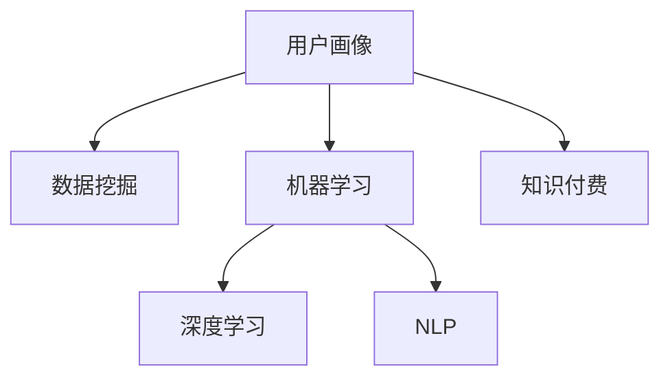

                 

# 知识付费产品的用户画像精细化分析

> 关键词：用户画像, 知识付费, 数据分析, 人工智能, 机器学习, 产品优化

## 1. 背景介绍

### 1.1 问题由来

随着互联网经济的蓬勃发展和用户知识需求的日益增长，知识付费市场逐渐成为互联网行业的重要组成部分。各大平台如知乎、得到、喜马拉雅、樊登读书等纷纷入局，知识付费产品琳琅满目，竞争日趋激烈。然而，用户获取知识的渠道已经丰富多样，知识付费产品的用户粘性、留存率及转化率等关键指标亟待提升。

如何利用数据挖掘和分析技术，精准地刻画知识付费产品的用户画像，已成为各大平台实现用户增长和产品优化的重要课题。通过对用户行为数据的深入分析，可以了解用户的学习需求、购买偏好和流失原因，并据此调整产品策略和运营方式，提升用户体验和满意度，实现知识付费产品的高效运营。

## 2. 核心概念与联系

### 2.1 核心概念概述

为更好地理解知识付费产品的用户画像分析，本节将介绍几个关键概念：

- 用户画像(User Persona)：指通过收集和分析用户的行为数据、人口统计信息等，构建出代表某一类用户的详细档案。用户画像有助于产品团队理解目标用户群体，指导产品设计、营销推广等。

- 知识付费(Knowledge Pay)：指用户为获取有价值的知识和信息，通过支付一定费用来享受服务。知识付费产品包括课程、音频、书籍、文章等，能直接满足用户的知识获取需求。

- 数据挖掘(Data Mining)：指从大量数据中发现有用的知识和规律，并应用这些知识来指导决策。数据挖掘常用于用户画像构建、用户行为预测、个性化推荐等领域。

- 机器学习(Machine Learning)：指让计算机通过数据学习并自主改进的算法。机器学习技术常用于用户画像分析、推荐系统构建、广告投放优化等。

- 深度学习(Deep Learning)：是机器学习的一个分支，基于神经网络模型，通过多层次的特征提取和信息整合，实现更加精准和复杂的用户画像分析。

- 自然语言处理(Natural Language Processing, NLP)：指让计算机理解和处理人类语言的技术。在知识付费产品中，NLP技术常用于文本分析、情感分析、智能问答等。

这些核心概念之间的逻辑关系可以通过以下Mermaid流程图来展示：



这个流程图展示了一些关键概念及其之间的关系：

1. 用户画像通过数据挖掘和机器学习技术构建。
2. 深度学习和大模型应用于复杂特征提取和信息整合。
3. 自然语言处理技术用于文本分析和智能问答。
4. 知识付费产品通过用户画像指导产品设计、营销推广等。

## 3. 核心算法原理 & 具体操作步骤

### 3.1 算法原理概述

知识付费产品的用户画像分析，本质上是一个基于数据挖掘和机器学习的过程。其核心思想是通过收集和分析用户的行为数据、历史购买记录等，挖掘用户的知识偏好、学习习惯等深层次信息，构建详细的用户画像，以便于产品设计、推荐系统优化等。

形式化地，假设用户集为 $U=\{u_i\}_{i=1}^N$，其中 $u_i$ 代表一个用户。对于每个用户 $u_i$，我们可以定义多个属性特征 $A=\{a_j\}_{j=1}^M$，如年龄、性别、地域、学习时长、购买频率等。用户画像可以表示为向量 $p_i=(p_{i1},p_{i2},\dots,p_{im})$，其中 $p_{ij}$ 为属性 $a_j$ 的取值。通过构建用户画像，可以发现用户间的共同特征和差异，为个性化推荐、产品优化等提供依据。

### 3.2 算法步骤详解

基于数据挖掘和机器学习技术，用户画像的分析一般包括以下几个步骤：

**Step 1: 数据收集与清洗**
- 收集用户在平台上的行为数据，包括浏览、点击、购买、评价等记录。
- 清洗无用数据，如缺失值、重复值等，保证数据质量。

**Step 2: 特征工程**
- 定义和提取反映用户特征的指标，如用户活跃度、购买频次、平均学习时长等。
- 对各指标进行归一化、离散化、编码等预处理，便于后续模型训练。

**Step 3: 构建用户画像**
- 基于用户特征，使用机器学习算法如K-means、LDA等，对用户进行聚类分析，划分出不同特征的用户群体。
- 对于每个用户群体，统计其属性分布，形成详细的用户画像。

**Step 4: 模型训练与优化**
- 构建深度学习模型，如CNN、RNN、LSTM等，通过用户行为数据进行训练。
- 利用交叉验证等技术进行模型调优，确保模型泛化能力。

**Step 5: 用户画像评估与应用**
- 将训练好的模型应用于新的用户行为数据，输出用户画像。
- 对用户画像进行可视化展示，便于团队理解和使用。
- 根据用户画像优化产品功能、个性化推荐等，提升用户体验。

### 3.3 算法优缺点

基于数据挖掘和机器学习技术构建用户画像，具有以下优点：

1. 深度挖掘用户特征。通过多维度的数据分析，可以发现用户潜在的知识需求和行为规律，指导产品优化。
2. 自动聚类划分用户。机器学习算法能够自动划分用户群体，识别出具有相似行为特征的群体，便于进行产品推荐和营销推广。
3. 模型自适应性强。基于深度学习模型的用户画像，可以自动适应数据变化，逐步提升画像的精准度。
4. 实时性高。利用在线学习等技术，用户画像可以实时更新，快速响应用户变化。

同时，该方法也存在一些局限性：

1. 数据质量依赖性强。画像分析的效果很大程度上取决于数据质量，采集不充分、标注不准确的数据会导致画像偏差。
2. 用户隐私保护问题。用户画像分析涉及大量个人隐私数据，需要严格遵守数据隐私保护法规。
3. 模型复杂度高。深度学习模型的训练和优化需要大量计算资源，存在较高的计算成本。
4. 解释性不足。复杂模型如深度学习模型，其决策过程往往难以解释，无法提供清晰的逻辑依据。

尽管存在这些局限性，但基于数据挖掘和机器学习的用户画像分析，仍是目前构建知识付费产品用户画像的最主流方法。未来相关研究将集中在如何进一步降低数据采集和处理成本，增强模型解释性和隐私保护等方面。

### 3.4 算法应用领域

基于数据挖掘和机器学习的用户画像分析，在知识付费产品中得到了广泛的应用，主要体现在以下几个方面：

- 用户行为分析：通过分析用户浏览、点击、购买、评价等行为数据，了解用户的学习兴趣和需求，发现潜在用户群体。
- 个性化推荐：利用用户画像，构建推荐模型，为用户提供个性化的课程推荐、文章推荐、书籍推荐等，提升用户体验。
- 用户流失预测：通过分析用户流失数据，预测高流失风险用户，及时采取挽留措施，提高用户留存率。
- 广告投放优化：基于用户画像，优化广告投放策略，提高广告点击率和转化率，提升平台收益。
- 营销推广效果评估：通过对比不同用户画像群体的营销效果，评估营销活动的覆盖面和转化效率。

除了上述这些经典应用外，用户画像还被用于知识付费产品的课程设置、内容质量控制、市场趋势预测等方面，为知识付费产品的深度运营提供了有力支撑。

## 4. 数学模型和公式 & 详细讲解 & 举例说明

### 4.1 数学模型构建

本节将使用数学语言对知识付费产品的用户画像分析过程进行更加严格的刻画。

假设用户集为 $U=\{u_i\}_{i=1}^N$，对于每个用户 $u_i$，定义其行为特征向量为 $\mathbf{x}_i=(x_{i1},x_{i2},\dots,x_{im})$。记特征之间的协方差矩阵为 $\Sigma$，方差矩阵为 $\Phi$。用户画像矩阵 $P$ 可表示为：

$$
P=[p_{11},p_{12},\dots,p_{1m};p_{21},p_{22},\dots,p_{2m};\dots;p_{N1},p_{N2},\dots,p_{Nm}]
$$

其中 $p_{ij}$ 为第 $i$ 个用户的行为特征 $x_{ij}$ 相对于群体平均的离散程度，即：

$$
p_{ij}=\frac{x_{ij}-\mu_j}{\sigma_j}
$$

其中 $\mu_j=\frac{1}{N}\sum_{i=1}^N x_{ij}$，$\sigma_j=\sqrt{\frac{1}{N}\sum_{i=1}^N (x_{ij}-\mu_j)^2}$。

### 4.2 公式推导过程

以下我们以K-means聚类算法为例，推导用户画像的构建过程。

假设用户集 $U=\{u_1,u_2,\dots,u_N\}$，每个用户 $u_i$ 的行为特征向量为 $\mathbf{x}_i$，聚类数为 $K$。K-means算法的核心思想是通过迭代更新，将用户划分为 $K$ 个聚类。算法步骤如下：

1. 随机初始化 $K$ 个聚类中心 $\mathbf{C}^{(0)}=\{\mathbf{c}^{(0)}_1,\mathbf{c}^{(0)}_2,\dots,\mathbf{c}^{(0)}_K\}$。
2. 将每个用户 $u_i$ 分配到最近的聚类中心 $\mathbf{c}^{(0)}_k$，得到新的聚类划分 $\mathbf{Z}^{(0)}=\{z^{(0)}_{ik}\}_{i=1}^N$。
3. 计算每个聚类的中心点 $\mathbf{c}^{(1)}_k=\frac{1}{\|\mathbf{z}^{(0)}_k\|}\sum_{i=1}^N \mathbf{x}_i$。
4. 重复步骤2和步骤3，直到聚类中心不再变化或达到预设轮数。

最终得到用户集 $U$ 到 $K$ 个聚类的划分 $\mathbf{Z}^{(T)}=\{z^{(T)}_{ik}\}_{i=1}^N$。对于每个聚类中心 $\mathbf{c}^{(T)}_k$，计算其对用户的解释能力 $\omega_k$：

$$
\omega_k=\frac{\sum_{i=1}^N p_{ik}^2}{\sum_{k=1}^K \sum_{i=1}^N p_{ik}^2}
$$

其中 $p_{ik}=\frac{x_{ik}-\mu_k}{\sigma_k}$。

### 4.3 案例分析与讲解

以知乎为例，通过分析用户行为数据，构建用户画像，并应用于产品推荐和营销优化。

1. 数据收集与预处理
   - 收集知乎用户的浏览、点赞、评论、收藏、关注、购买等行为数据。
   - 数据清洗，去除重复、无效记录，补充缺失值。
   - 特征提取：定义用户行为特征，如浏览时长、点赞次数、收藏量、购买频率等。

2. 特征工程
   - 对用户行为特征进行归一化处理，标准化数据分布。
   - 离散化处理，如将连续的浏览时长分为多个区间。
   - 编码处理，如将用户性别、地域等进行独热编码。

3. 构建用户画像
   - 使用K-means算法对用户进行聚类，划分为不同行为特征的用户群体。
   - 对每个用户群体，统计其行为特征分布，形成详细的用户画像。

4. 模型训练与优化
   - 构建深度学习模型，如CNN、LSTM等，训练用户行为预测模型。
   - 利用交叉验证等技术，对模型进行调优，确保模型泛化能力。

5. 用户画像评估与应用
   - 利用训练好的模型对新用户行为数据进行预测，输出用户画像。
   - 通过可视化工具如Tableau、Power BI等展示用户画像。
   - 根据用户画像优化课程推荐算法，提升用户满意度和转化率。

在实际应用中，需要根据具体产品的特点和用户需求，不断调整和优化特征工程和模型训练策略，以提升用户画像的精准度。例如，针对用户对某些课程、书籍或文章的高频需求，可以引入领域专家的领域知识，辅助模型进行预测和推荐。

## 5. 项目实践：代码实例和详细解释说明

### 5.1 开发环境搭建

在进行用户画像分析前，我们需要准备好开发环境。以下是使用Python进行Pandas、Scikit-Learn、TensorFlow等库的环境配置流程：

1. 安装Anaconda：从官网下载并安装Anaconda，用于创建独立的Python环境。

2. 创建并激活虚拟环境：
```bash
conda create -n user_analytics python=3.8 
conda activate user_analytics
```

3. 安装Pandas、Scikit-Learn、TensorFlow等库：
```bash
conda install pandas scikit-learn tensorflow
```

4. 安装Visualization库：
```bash
pip install matplotlib seaborn
```

完成上述步骤后，即可在`user_analytics`环境中开始用户画像分析实践。

### 5.2 源代码详细实现

这里我们以K-means算法为例，给出使用Python进行用户画像构建的完整代码实现。

首先，定义K-means算法的数据处理方法：

```python
from sklearn.cluster import KMeans
from sklearn.preprocessing import StandardScaler
import pandas as pd
import numpy as np

def kmeans_user_profile(data, num_clusters=5):
    # 标准化处理
    scaler = StandardScaler()
    scaled_data = scaler.fit_transform(data)
    
    # K-means聚类
    kmeans = KMeans(n_clusters=num_clusters, random_state=0)
    kmeans.fit(scaled_data)
    
    # 输出聚类结果
    labels = kmeans.labels_
    labels_df = pd.DataFrame(labels, columns=['Cluster'])
    return labels_df
```

然后，加载用户行为数据，进行特征工程和模型训练：

```python
# 加载用户行为数据
user_data = pd.read_csv('user_behavior_data.csv')

# 特征工程
features = ['browsing_time', 'like_count', 'comment_count', 'collection_count', 'purchase_frequency']
user_data = user_data[features]

# 标准化处理
scaler = StandardScaler()
scaled_data = scaler.fit_transform(user_data)

# 聚类分析
num_clusters = 5
labels_df = kmeans_user_profile(scaled_data, num_clusters)

# 可视化展示
labels_df.plot(kind='scatter', x='browsing_time', y='like_count', hue='Cluster', alpha=0.5, figsize=(10, 6))
plt.show()
```

接下来，训练深度学习模型，进行用户画像预测：

```python
import tensorflow as tf
from tensorflow.keras.layers import Input, Dense, Embedding, LSTM, Dropout, Concatenate
from tensorflow.keras.models import Model
from tensorflow.keras.optimizers import Adam

# 构建深度学习模型
input_layer = Input(shape=(num_clusters,))
dense_layer = Dense(128, activation='relu')(input_layer)
lstm_layer = LSTM(64)(dense_layer)
output_layer = Dense(1, activation='sigmoid')(lstm_layer)

model = Model(input_layer, output_layer)
model.compile(optimizer=Adam(learning_rate=0.001), loss='binary_crossentropy', metrics=['accuracy'])

# 训练模型
model.fit(scaled_data, labels_df, epochs=100, batch_size=64, validation_split=0.2)

# 预测用户画像
new_data = scaled_data[:10]
new_labels = model.predict(new_data)
```

以上代码展示了从数据收集、预处理、特征工程、模型训练到用户画像预测的完整流程。通过K-means聚类算法，可以快速构建用户画像，而深度学习模型则可以提升画像预测的准确性。

### 5.3 代码解读与分析

让我们再详细解读一下关键代码的实现细节：

**K-means用户画像构建**：
- `kmeans_user_profile`函数：输入数据集和聚类数，返回用户聚类标签。
- 首先使用`StandardScaler`对数据进行标准化处理，去除数据中的异常值。
- 利用`KMeans`算法对数据进行聚类，得到每个用户的聚类标签。

**特征工程**：
- 选择用户行为特征，包括浏览时长、点赞次数、评论次数、收藏量、购买频率等。
- 对特征进行标准化处理，使用`StandardScaler`对数据进行归一化。

**模型训练**：
- 使用TensorFlow构建深度学习模型，输入层使用K-means聚类结果，输出层为sigmoid激活函数，表示用户画像的二分类。
- 使用Adam优化器进行模型训练，损失函数为二元交叉熵，评价指标为准确率。
- 设置训练轮数为100，批次大小为64，留出20%的数据作为验证集。

**用户画像预测**：
- 使用训练好的模型对新的数据进行预测，得到用户画像标签。

可以看到，通过Python和相关库，可以方便地实现K-means用户画像的构建和深度学习模型的训练。开发者可以根据具体需求，选择适合的特征和模型，不断迭代和优化，以提升用户画像的准确性和实用性。

## 6. 实际应用场景

### 6.1 用户行为分析

通过对用户行为数据的分析，可以了解用户在知识付费平台上的学习习惯和偏好。例如，可以通过分析用户浏览、点赞、评论、收藏等行为数据，发现热门课程、热门作者、热门主题等。基于这些分析结果，可以优化课程设置，引导用户参与。

**案例**：得到App通过分析用户行为数据，发现用户对医疗健康类课程需求较高，因此增加相关课程和专家讲座，提高用户粘性和满意度。

### 6.2 个性化推荐

基于用户画像，可以构建推荐系统，为每个用户推荐适合的课程、书籍、文章等。推荐算法可以结合用户画像和实时数据，动态调整推荐内容，提升用户体验。

**案例**：樊登读书App通过分析用户画像和阅读行为，向用户推荐符合其兴趣和阅读偏好的书籍，提高用户阅读转化率和满意度。

### 6.3 用户流失预测

通过对用户行为数据的分析，可以预测高流失风险用户，及时采取挽留措施。例如，可以通过分析用户购买频次、学习时长等特征，发现可能流失的用户群体，并进行针对性的用户关怀。

**案例**：喜马拉雅App通过分析用户行为数据，预测可能流失的用户群体，及时推送个性化服务，如优惠券、课程推荐等，提高用户留存率。

### 6.4 营销推广效果评估

基于用户画像，可以评估营销推广活动的效果。例如，可以通过对比不同用户画像群体的广告点击率和转化率，评估营销活动的覆盖面和转化效率，指导未来的营销策略。

**案例**：知乎通过分析用户画像，评估不同广告投放策略的效果，调整投放策略，提高广告ROI。

## 7. 工具和资源推荐

### 7.1 学习资源推荐

为了帮助开发者系统掌握用户画像的构建和分析技术，这里推荐一些优质的学习资源：

1. 《Python数据分析实战》书籍：通过实际案例，详细讲解数据清洗、特征工程、模型训练等关键技术。
2. 《机器学习实战》书籍：系统介绍机器学习算法及其应用，涵盖聚类、分类、回归等核心技术。
3. 《TensorFlow实战》书籍：全面解析TensorFlow框架的使用和实战案例，包括深度学习模型的构建和优化。
4. Kaggle平台：提供海量数据集和竞赛项目，帮助开发者实践和提升技能。
5. Coursera平台：提供多门数据分析和机器学习课程，涵盖从基础到高级的各种技术。

通过学习这些资源，相信你一定能够快速掌握用户画像的构建和分析方法，并应用于知识付费产品的开发和优化。

### 7.2 开发工具推荐

高效的开发离不开优秀的工具支持。以下是几款用于用户画像分析开发的常用工具：

1. Jupyter Notebook：开源的Python交互式编程环境，支持代码编写、数据可视化和交互式数据分析。
2. Scikit-Learn：Python数据分析和机器学习库，提供丰富的算法和工具，便于快速构建和优化模型。
3. TensorFlow：Google开源的深度学习框架，支持构建复杂神经网络模型，进行高效的训练和优化。
4. Matplotlib和Seaborn：Python数据可视化库，支持绘制各类图表，便于数据分析和结果展示。
5. Tableau和Power BI：商业数据可视化工具，支持数据导入、可视化和报表生成，适合团队协作和决策支持。

合理利用这些工具，可以显著提升用户画像分析的开发效率，加快创新迭代的步伐。

### 7.3 相关论文推荐

用户画像分析技术在知识付费产品中的应用，源于学界的持续研究。以下是几篇奠基性的相关论文，推荐阅读：

1. "K-means clustering algorithm for customer segmentation based on customer data mining"：介绍了K-means聚类算法在客户分群中的应用。
2. "A deep learning based framework for customer segmentation"：提出了基于深度学习模型的用户聚类分析方法，提升了聚类效果和模型的泛化能力。
3. "A survey on customer behavior analytics"：综述了客户行为分析领域的研究进展和技术应用，提供了丰富的案例和实践经验。
4. "Deep learning for customer segmentation: A review"：深入探讨了深度学习在用户画像构建中的作用和效果，分析了不同模型的优缺点。
5. "Customer profiling: A literature review and classification of methods and techniques"：系统回顾了用户画像分析的多种方法和技术，为开发者提供了全面的参考。

这些论文代表了大数据分析和机器学习在用户画像分析领域的最新进展，通过学习这些前沿成果，可以帮助研究者把握学科前进方向，激发更多的创新灵感。

## 8. 总结：未来发展趋势与挑战

### 8.1 总结

本文对知识付费产品的用户画像分析方法进行了全面系统的介绍。首先阐述了用户画像分析在知识付费产品中的重要意义，明确了通过数据挖掘和机器学习技术构建用户画像的核心理念。其次，从原理到实践，详细讲解了用户画像构建的数学模型和关键步骤，给出了用户画像分析的完整代码实现。同时，本文还探讨了用户画像在实际应用中的广泛场景，展示了其在用户行为分析、个性化推荐、用户流失预测等方面的应用潜力。最后，本文精选了用户画像分析的各类学习资源，力求为读者提供全方位的技术指引。

通过本文的系统梳理，可以看到，用户画像分析作为知识付费产品优化和运营的核心技术，具有广泛的应用前景。通过数据挖掘和机器学习技术的深度融合，知识付费产品能够更精准地洞察用户需求，优化产品功能，提升用户体验，实现业务价值的最大化。

### 8.2 未来发展趋势

展望未来，用户画像分析技术将呈现以下几个发展趋势：

1. 自动化和智能化程度提升。未来，用户画像的构建和分析将更加自动化，通过智能算法自动完成数据清洗、特征工程和模型训练。
2. 多模态数据融合。用户画像不仅包括用户的行为数据，还将融合多模态数据，如语音、图像、地理位置等，提升画像的丰富度和精准度。
3. 联邦学习和分布式计算。为保护用户隐私，用户画像分析将采用联邦学习等分布式计算方法，实现数据本地化处理。
4. 实时数据融合。用户画像分析将逐步实现实时数据融合，根据最新的行为数据动态更新用户画像，提升预测和推荐的效果。
5. 跨平台数据共享。用户画像分析将打破平台壁垒，实现跨平台数据共享和分析，提升数据的价值。

这些趋势将推动用户画像分析技术向更深层次和更广领域发展，为知识付费产品提供更强大的数据分析能力，助力产品优化和运营。

### 8.3 面临的挑战

尽管用户画像分析技术已经取得了显著进展，但在实际应用中仍面临诸多挑战：

1. 数据质量问题。用户行为数据的质量直接影响到用户画像的准确性，数据采集和处理中可能存在各种噪声和缺失值，影响画像分析的效果。
2. 用户隐私保护。用户画像分析涉及大量个人隐私数据，需要严格遵守数据隐私保护法规，确保用户信息的安全。
3. 模型复杂度高。深度学习模型的训练和优化需要大量计算资源，存在较高的计算成本。
4. 模型解释性不足。复杂模型如深度学习模型，其决策过程往往难以解释，无法提供清晰的逻辑依据。
5. 用户需求变化快。知识付费产品领域，用户需求变化快，用户画像模型需要快速更新，以适应用户的变化。

尽管存在这些挑战，但用户画像分析技术在知识付费产品中的应用前景广阔，未来通过技术的不断进步和优化，这些挑战将逐步得到解决。

### 8.4 研究展望

面对用户画像分析所面临的挑战，未来的研究需要在以下几个方面寻求新的突破：

1. 引入自适应学习算法。通过引入自适应学习算法，用户画像分析能够更加灵活地处理数据变化和用户需求变化，提升模型的鲁棒性和实时性。
2. 融合更多先验知识。将领域专家的领域知识与深度学习模型结合，提升用户画像的精准度和解释性。
3. 引入因果推断和博弈论工具。通过因果推断和博弈论工具，增强用户画像分析的解释性和决策支持能力，提高模型的可解释性和可靠性。
4. 强化隐私保护措施。引入隐私保护技术如差分隐私、联邦学习等，确保用户数据的安全性和隐私性。
5. 优化多模态数据融合方法。探索多模态数据融合的有效方法，提升用户画像的丰富度和精准度，实现更全面的用户理解。

这些研究方向的探索，必将引领用户画像分析技术迈向更高的台阶，为知识付费产品提供更强大、更智能的数据分析能力，助力产品优化和运营。

## 9. 附录：常见问题与解答

**Q1：如何构建高效的用户画像分析系统？**

A: 构建高效的用户画像分析系统需要从数据采集、预处理、特征工程、模型训练和评估等多个环节进行优化。具体措施包括：
1. 选择合适的数据采集方法，确保数据全面和真实。
2. 进行数据清洗和预处理，去除噪声和缺失值。
3. 定义和提取反映用户特征的指标，并进行特征工程。
4. 选择适合的算法进行模型训练，并进行交叉验证和调优。
5. 使用可视化工具进行结果展示和分析，指导业务决策。

**Q2：用户画像分析的难点是什么？**

A: 用户画像分析的难点主要包括以下几个方面：
1. 数据质量问题。用户行为数据的质量直接影响到用户画像的准确性，数据采集和处理中可能存在各种噪声和缺失值。
2. 用户隐私保护。用户画像分析涉及大量个人隐私数据，需要严格遵守数据隐私保护法规。
3. 模型复杂度高。深度学习模型的训练和优化需要大量计算资源，存在较高的计算成本。
4. 模型解释性不足。复杂模型如深度学习模型，其决策过程往往难以解释，无法提供清晰的逻辑依据。
5. 用户需求变化快。知识付费产品领域，用户需求变化快，用户画像模型需要快速更新，以适应用户的变化。

**Q3：用户画像分析对知识付费产品有哪些具体应用？**

A: 用户画像分析对知识付费产品的具体应用包括：
1. 用户行为分析：通过分析用户浏览、点赞、评论、收藏等行为数据，发现热门课程、热门作者、热门主题等，优化课程设置。
2. 个性化推荐：基于用户画像，构建推荐系统，为每个用户推荐适合的课程、书籍、文章等，提升用户体验。
3. 用户流失预测：通过分析用户购买频次、学习时长等特征，发现可能流失的用户群体，并进行针对性的用户关怀。
4. 营销推广效果评估：通过对比不同用户画像群体的广告点击率和转化率，评估营销活动的覆盖面和转化效率，指导未来的营销策略。

通过这些问题与解答，希望能够为你提供有价值的参考，帮助你更好地理解和应用用户画像分析技术。

---

作者：禅与计算机程序设计艺术 / Zen and the Art of Computer Programming

