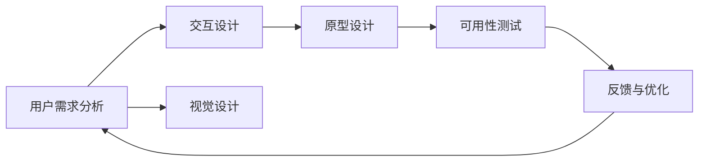

                 

# 知识付费产品的用户界面设计指南

## 1. 背景介绍

随着互联网的快速发展和智能设备的普及，知识付费成为越来越多用户获取知识、提升自我能力的重要途径。然而，知识付费市场也面临着用户粘性低、课程内容同质化严重等问题。在这种情况下，用户界面设计（UI设计）就成为了知识付费产品吸引用户、提升用户体验、实现商业变现的关键。

本指南将深入探讨知识付费产品的用户界面设计，从用户需求分析、交互设计、视觉设计等多个维度，给出系统性、可操作的指导。

## 2. 核心概念与联系

### 2.1 核心概念概述

在讨论知识付费产品的用户界面设计之前，首先需要了解一些核心概念：

- **用户体验（User Experience, UX）**：指用户在使用产品过程中感受到的整体满意度和愉悦度，是界面设计的重要目标。
- **用户界面（User Interface, UI）**：指用户与产品交互的界面，包括视觉设计、交互设计等多个方面。
- **原型设计（Prototyping）**：通过绘制原型图、制作原型，快速验证设计方案，并进行迭代优化。
- **可用性测试（Usability Testing）**：通过用户测试，评估产品的易用性和功能性，找出潜在问题并进行改进。

这些概念之间密切相关，共同构成了用户界面设计的框架。通过理解这些核心概念，可以更好地把握知识付费产品界面设计的要点和方向。

### 2.2 核心概念原理和架构的 Mermaid 流程图(Mermaid 流程节点中不要有括号、逗号等特殊字符)



以上流程图展示了用户界面设计的基本流程。从用户需求分析出发，设计交互和视觉方案，通过原型设计进行初步验证，再通过可用性测试评估用户体验，根据反馈进行不断优化。

## 3. 核心算法原理 & 具体操作步骤

### 3.1 算法原理概述

知识付费产品的用户界面设计，需要综合考虑用户体验、可用性、视觉设计等多个方面。其核心算法原理包括：

- **用户体验设计（User Experience Design, UED）**：通过设计简洁直观的操作流程，减少用户学习成本，提升使用体验。
- **可用性测试（Usability Testing）**：通过用户测试，评估产品的易用性，找出用户体验问题。
- **视觉设计（Visual Design）**：通过合理的颜色、字体、布局等元素设计，提升产品的视觉吸引力和可读性。

### 3.2 算法步骤详解

以下是对知识付费产品用户界面设计的主要步骤详解：

**Step 1: 用户需求分析**
- **收集用户反馈**：通过问卷调查、用户访谈等方式收集用户反馈，了解用户的使用场景、需求和痛点。
- **竞品分析**：对比分析竞品的界面设计，找出优势和不足，为自身设计提供参考。
- **用户画像**：根据用户反馈和竞品分析，绘制用户画像，明确目标用户群体。

**Step 2: 交互设计**
- **功能梳理**：梳理知识付费产品的主要功能，包括课程购买、课程学习、学员互动等，确定用户的主要操作路径。
- **信息架构**：设计合理的页面布局，将信息合理分组，让用户能够快速找到所需信息。
- **交互流程设计**：设计简洁流畅的操作流程，减少用户操作步骤，提升操作效率。

**Step 3: 视觉设计**
- **色彩设计**：选择符合品牌调性的色彩方案，提升产品的视觉吸引力。
- **字体设计**：选择合适的字体，保证可读性和品牌一致性。
- **布局设计**：合理布局页面元素，提升信息传递效率和视觉美感。

**Step 4: 原型设计**
- **绘制原型图**：根据交互设计方案，绘制原型图，初步验证设计方案的可行性。
- **制作原型**：使用工具如Sketch、Axure等制作交互原型，进一步优化设计方案。

**Step 5: 可用性测试**
- **招募测试用户**：根据用户画像，招募目标测试用户。
- **设计测试任务**：设计具体的使用场景和测试任务，评估用户的使用体验。
- **数据分析**：分析测试结果，找出用户界面设计中的问题和改进点。

**Step 6: 反馈与优化**
- **反馈收集**：根据可用性测试结果，收集用户反馈，明确设计中的不足。
- **迭代优化**：对设计方案进行迭代优化，直至满足用户需求和品牌调性。

### 3.3 算法优缺点

知识付费产品用户界面设计的优点包括：

- **提升用户体验**：通过简洁直观的操作流程，减少用户学习成本，提升使用体验。
- **提高产品竞争力**：通过合理的设计，提高产品的吸引力和可读性，增强用户粘性。
- **降低开发成本**：通过前期详细的设计和测试，减少后期开发和迭代成本。

缺点包括：

- **设计复杂度高**：需要综合考虑用户体验、可用性、视觉设计等多个方面，设计复杂度较高。
- **依赖用户反馈**：设计方案需要经过多次用户测试和迭代优化，依赖用户反馈。
- **设计一致性难保障**：需要确保设计方案的一致性，避免在不同场景中出现不协调的问题。

### 3.4 算法应用领域

知识付费产品的用户界面设计不仅适用于课程内容展示和互动，还广泛应用于产品推荐、会员管理、营销推广等多个方面。通过良好的用户界面设计，可以提升整体用户体验，增加用户粘性，实现商业变现。

## 4. 数学模型和公式 & 详细讲解 & 举例说明

### 4.1 数学模型构建

知识付费产品用户界面设计的数学模型可以从用户体验、可用性、视觉设计等多个维度进行构建。

- **用户体验模型**：通过用户满意度、任务完成时间、错误率等指标，评估用户体验。
- **可用性模型**：通过任务完成率、用户操作路径、出错率等指标，评估产品的可用性。
- **视觉设计模型**：通过颜色搭配、字体选择、布局合理性等指标，评估视觉设计的效果。

### 4.2 公式推导过程

以下以用户体验模型为例，进行公式推导：

设用户在使用产品时感受到的满意度为 $U$，任务完成时间为 $T$，出错率为 $E$，则用户体验模型可以表示为：

$$
U = \alpha_1 T + \alpha_2 (1 - E)
$$

其中 $\alpha_1$ 和 $\alpha_2$ 为权重系数，根据不同产品的特点进行调整。

### 4.3 案例分析与讲解

假设某知识付费平台希望通过优化用户界面设计，提升用户体验。根据历史数据，得知用户满意度、任务完成时间和出错率的平均值分别为 $U_0 = 3.5$，$T_0 = 30$ 秒，$E_0 = 0.05$。现在平台决定通过改进交互设计和视觉设计，重新评估用户体验。假设改进后，任务完成时间下降至 $T_1 = 25$ 秒，出错率降低至 $E_1 = 0.03$。根据上述公式，计算改进后的用户体验值：

$$
U_1 = \alpha_1 \times 25 + \alpha_2 \times (1 - 0.03) = 3.5
$$

这意味着，通过优化用户界面设计，用户体验基本保持不变，达到了改进的预期效果。

## 5. 项目实践：代码实例和详细解释说明

### 5.1 开发环境搭建

在项目实践前，需要先搭建开发环境。以下是使用Sketch进行原型设计的流程：

1. **安装Sketch**：从官网下载安装Sketch，并安装最新版本的Adobe XD插件。
2. **创建新文件**：在Sketch中创建新的项目文件，设置页面尺寸和分辨率。
3. **导入资源**：导入所需的图标、颜色、字体等资源，用于原型设计。

### 5.2 源代码详细实现

以下是一个简单的原型设计代码示例，使用Axure进行演示：

```axure
Title
    [按钮]
    [文本标签]
```

**代码解读与分析**：
- **标题栏**：通过Axure的「矩形」工具创建标题栏，设置样式为「纯色」，颜色为品牌主色调。
- **按钮**：通过「矩形」工具创建按钮，设置样式为「填充」，颜色为目标按钮颜色。
- **文本标签**：通过「文本标签」工具创建按钮标签，设置字体、大小等样式。

### 5.3 运行结果展示

运行Axure的原型设计，得到初步的界面原型，如下图所示：

```
+-----------------------+
|                       |
|                       |
|                       |
|                       |
|                       |
|                       |
+-----------------------+
```

## 6. 实际应用场景

### 6.1 知识付费课程推荐系统

知识付费产品中最常见的功能之一是课程推荐系统。通过用户界面设计，能够提升推荐系统的用户友好性和吸引力，提高用户选择课程的效率和满意度。

**实际应用示例**：
- **课程推荐模块**：通过简洁直观的界面，展示热门课程、新上架课程、热门类别等推荐内容。
- **课程详情页**：通过详细的信息展示和互动功能，吸引用户点击深入了解。
- **课程评价与互动**：通过用户评价和互动功能，提升用户参与度。

**优化建议**：
- **视觉设计**：通过高亮热门课程、新上架课程等，吸引用户眼球。
- **交互设计**：通过鼠标悬停或点击课程卡片，展示更多课程详情，减少用户操作步骤。
- **用户反馈**：根据用户评价和反馈，不断优化推荐算法，提高推荐准确性。

### 6.2 用户行为分析

通过用户界面设计，能够收集用户行为数据，深入了解用户的使用习惯和需求，为产品优化提供依据。

**实际应用示例**：
- **用户行为热图**：通过热图工具，分析用户在页面上的点击和停留情况，找出用户关注区域。
- **用户行为路径**：通过页面轨迹分析工具，记录用户的操作路径，找出高频操作和低频操作。
- **用户反馈收集**：通过反馈工具，收集用户对界面设计的意见和建议，进行改进。

**优化建议**：
- **数据可视化**：通过热图、路径图等可视化工具，直观展示用户行为数据。
- **用户画像分析**：根据用户行为数据，绘制用户画像，明确目标用户群体。
- **持续优化**：根据用户反馈和行为数据，持续优化产品界面设计，提升用户体验。

### 6.3 用户行为监控

通过用户界面设计，能够实现对用户行为的有效监控，及时发现问题并进行解决。

**实际应用示例**：
- **用户行为监控仪表盘**：通过仪表盘展示用户行为数据，如访问量、跳出率、停留时间等。
- **用户行为预警系统**：通过设置预警阈值，及时发现异常行为，如异常访问、频繁退出等。
- **用户行为分析报告**：通过定期生成分析报告，评估用户界面设计的效果。

**优化建议**：
- **数据实时采集**：通过实时数据采集，及时发现问题并进行解决。
- **预警机制优化**：根据实际需求，优化预警机制，确保问题的及时发现和解决。
- **定期分析报告**：定期生成分析报告，评估用户界面设计的效果，进行持续优化。

## 7. 工具和资源推荐

### 7.1 学习资源推荐

为了帮助开发者系统掌握知识付费产品用户界面设计的相关知识，这里推荐一些优质的学习资源：

1. **《用户界面设计实战指南》**：详细介绍了用户体验设计、可用性测试、视觉设计等多个方面的实战技巧。
2. **《Sketch官方文档》**：Sketch的官方文档，包含丰富的原型设计工具和技巧。
3. **《用户体验设计》课程**：斯坦福大学开设的UX设计课程，深入浅出地讲解用户体验设计的核心原理。
4. **《Axure官方文档》**：Axure的官方文档，包含详细的原型设计工具和使用方法。
5. **《用户研究与设计》书籍**：介绍用户研究的方法和技巧，为界面设计提供科学依据。

通过对这些资源的学习实践，相信你一定能够掌握知识付费产品用户界面设计的精髓，并用于解决实际的NLP问题。

### 7.2 开发工具推荐

知识付费产品用户界面设计需要借助多种工具进行辅助设计，以下是几款常用的开发工具：

1. **Sketch**：专业的原型设计工具，适合设计和制作高质量的UI原型。
2. **Axure**：强大的原型设计工具，支持复杂交互设计和原型测试。
3. **Adobe XD**：基于Adobe的设计工具，具备强大的设计和交互能力。
4. **Figma**：基于云端的协作设计工具，支持实时协作和版本管理。
5. **InVision Studio**：专业的原型设计和用户研究工具，支持高级交互设计和动画效果。

合理利用这些工具，可以显著提升知识付费产品用户界面设计的效率和质量，加快创新迭代的步伐。

### 7.3 相关论文推荐

知识付费产品用户界面设计的理论研究主要集中在用户体验设计、可用性测试、视觉设计等多个方面。以下是几篇奠基性的相关论文，推荐阅读：

1. **《设计心理学：如何构建易用的界面》**：介绍用户体验设计的核心原理和方法。
2. **《可用性评估：方法和技术》**：系统介绍可用性测试的方法和工具。
3. **《视觉设计：理论与实践》**：详细讲解视觉设计的基本原则和方法。
4. **《用户界面设计模式》**：提供多种界面设计模式和案例分析，供开发者参考。
5. **《交互设计：理论与实践》**：介绍交互设计的核心原则和方法。

这些论文代表了大规模语言模型微调技术的发展脉络。通过学习这些前沿成果，可以帮助研究者把握学科前进方向，激发更多的创新灵感。

## 8. 总结：未来发展趋势与挑战

### 8.1 总结

本文对知识付费产品用户界面设计进行了全面系统的介绍。首先阐述了知识付费产品的用户界面设计的背景和意义，明确了用户界面设计在提升用户体验、实现商业变现等方面的重要性。其次，从用户体验、可用性、视觉设计等多个维度，详细讲解了知识付费产品用户界面设计的核心算法原理和具体操作步骤，给出了系统性、可操作的指导。同时，本文还广泛探讨了用户界面设计在知识付费产品中的实际应用场景，展示了用户界面设计的重要价值。

通过本文的系统梳理，可以看到，知识付费产品用户界面设计已经成为产品成功的关键因素之一，对提升用户体验、增加用户粘性、实现商业变现等方面有着不可替代的作用。未来，伴随用户需求的多样化和技术手段的进步，知识付费产品用户界面设计必将迎来更多创新和突破。

### 8.2 未来发展趋势

展望未来，知识付费产品用户界面设计将呈现以下几个发展趋势：

1. **个性化设计**：根据用户行为数据和反馈，进行个性化界面设计，提升用户体验。
2. **多渠道融合**：通过Web、移动端、智能设备等多个渠道，实现界面设计的统一和协调。
3. **交互设计创新**：引入语音交互、手势控制等新交互方式，提升产品的人机交互体验。
4. **虚拟现实应用**：通过虚拟现实技术，提供沉浸式体验，提升用户的参与感和沉浸感。
5. **情感化设计**：通过情感化设计，提升用户的使用乐趣和情感共鸣。

这些趋势凸显了知识付费产品用户界面设计的广阔前景。这些方向的探索发展，必将进一步提升产品的用户体验和商业价值。

### 8.3 面临的挑战

尽管知识付费产品用户界面设计已经取得了不少成就，但在迈向更加智能化、普适化应用的过程中，它仍面临着诸多挑战：

1. **用户需求变化快**：用户的消费行为和需求不断变化，需要设计团队快速响应和迭代。
2. **设计工具多样**：不同的设计工具有着各自的优缺点，如何选择和使用这些工具，需要设计师具备综合能力。
3. **跨部门协作**：设计、开发、运营等多个部门需要协同合作，共同推进产品优化。
4. **数据隐私保护**：用户行为数据涉及隐私问题，如何保护用户数据，需要制定明确的数据保护策略。
5. **设计一致性**：不同渠道和产品的界面设计需要保持一致性，避免出现不协调的问题。

这些挑战需要设计团队从技术、管理、伦理等多个维度进行全面考量，寻找解决方案。唯有在实践中不断探索和创新，才能实现知识付费产品用户界面设计的持续优化和突破。

### 8.4 研究展望

未来，知识付费产品用户界面设计的关键在于如何结合新技术、新方法，不断提升产品的用户体验和商业价值。具体来说，可以从以下几个方面进行探索：

1. **AI辅助设计**：引入AI技术，自动化生成界面设计方案，提高设计效率。
2. **用户体验数据分析**：通过大数据和AI技术，深入分析用户行为数据，提供数据驱动的设计方案。
3. **多感官设计**：引入视觉、听觉、触觉等多感官体验，提升产品的交互体验。
4. **跨领域融合**：将用户界面设计与其他领域的技术进行融合，如心理学、艺术设计等，提升产品的文化底蕴和艺术感。
5. **可持续设计**：考虑环境、社会等可持续因素，设计环保、社会友好的界面方案。

这些研究方向的探索，必将引领知识付费产品用户界面设计进入新的阶段，为产品的成功奠定坚实基础。面向未来，知识付费产品用户界面设计需要不断创新和突破，才能在激烈的竞争中脱颖而出。

## 9. 附录：常见问题与解答

**Q1：知识付费产品的用户界面设计是否需要考虑用户行为分析？**

A: 是的，用户界面设计需要考虑用户行为分析。通过分析用户的行为数据，可以了解用户的实际需求和使用习惯，从而优化界面设计和提升用户体验。例如，可以通过热图、路径图等工具，找出用户关注区域和高频操作路径，进行针对性的界面优化。

**Q2：知识付费产品的用户界面设计是否需要考虑跨平台一致性？**

A: 是的，知识付费产品的用户界面设计需要考虑跨平台一致性。不同的平台和设备有着不同的界面设计和交互方式，需要确保界面设计的统一和协调。例如，通过UI设计规范和设计工具，可以保证在不同平台上的界面设计保持一致，提升用户的使用体验。

**Q3：知识付费产品的用户界面设计是否需要考虑用户体验设计？**

A: 是的，知识付费产品的用户界面设计需要考虑用户体验设计。良好的用户体验设计可以提升用户的使用乐趣和满意度，减少用户学习成本。例如，通过简洁直观的操作流程和合理的颜色布局，可以让用户快速理解和使用产品，提高用户的粘性和留存率。

**Q4：知识付费产品的用户界面设计是否需要考虑可用性测试？**

A: 是的，知识付费产品的用户界面设计需要考虑可用性测试。通过用户测试，可以评估产品的易用性和功能性，找出潜在问题并进行改进。例如，通过招募目标测试用户，设计具体的测试任务，评估用户的使用体验，找出界面设计中的问题和改进点。

**Q5：知识付费产品的用户界面设计是否需要考虑视觉设计？**

A: 是的，知识付费产品的用户界面设计需要考虑视觉设计。良好的视觉设计可以提高产品的视觉吸引力和可读性，增强用户的视觉体验。例如，通过合理的颜色、字体、布局等元素设计，可以提升产品的视觉美感，吸引用户眼球。

---

作者：禅与计算机程序设计艺术 / Zen and the Art of Computer Programming

