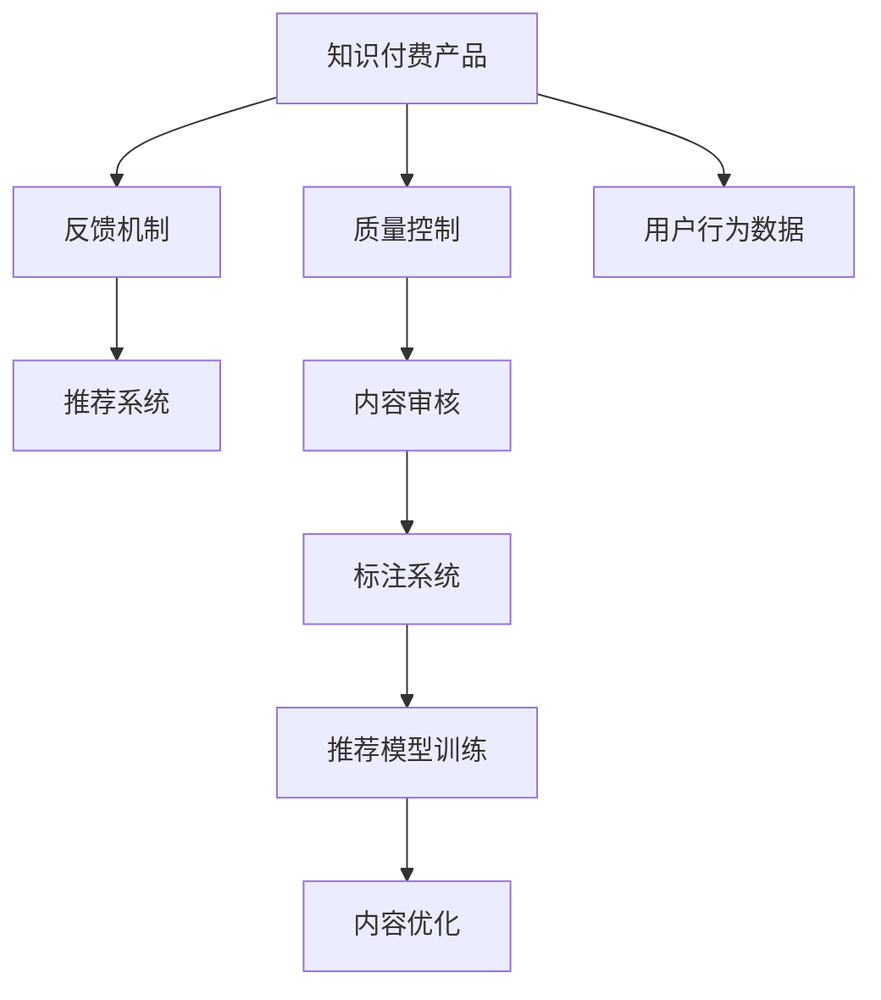

                 

# 知识付费产品的质量控制与反馈机制

## 1. 背景介绍

在知识付费蓬勃发展的今天，消费者对于知识的渴求从未如此高涨。然而，知识的筛选、评估和获取始终是一个复杂且棘手的问题。如何确保知识付费产品的内容质量，建立有效的反馈机制，帮助用户快速找到有价值的知识，是每个知识付费平台亟待解决的核心难题。本文将深入探讨知识付费产品的质量控制与反馈机制，从理论到实践，为构建高质量的知识付费生态提供全面的技术指导。

## 2. 核心概念与联系

### 2.1 核心概念概述

为更好地理解本文的核心主题，本节将介绍几个密切相关的核心概念：

- **知识付费产品**：指以知识为核心的付费内容产品，涵盖各种形式的数字内容，如文章、视频、音频、课程等。
- **质量控制**：指对产品内容质量进行管理的过程，确保内容符合一定的标准和规范。
- **反馈机制**：指用户对产品进行评价和建议的渠道和方式，用于改进产品内容和用户体验。
- **推荐系统**：利用用户行为数据和内容特征，对知识付费产品进行排序和推荐，帮助用户快速找到相关内容。

这些概念之间的逻辑关系可以通过以下Mermaid流程图来展示：



这个流程图展示了一个典型的知识付费产品生态，其中用户行为数据被用来驱动内容优化和推荐系统的训练，最终形成了一个良性循环。

## 3. 核心算法原理 & 具体操作步骤

### 3.1 算法原理概述

知识付费产品的质量控制和反馈机制，本质上是一个基于用户反馈的信息筛选和优化过程。其核心思想是：通过对用户的行为数据进行分析，构建用户画像，评估内容的相关性和价值，不断迭代改进产品。

具体而言，平台会收集用户的浏览、购买、评分、评论等行为数据，利用机器学习算法和推荐系统技术，对内容进行筛选和排序，并将用户反馈作为进一步优化的依据。这种基于数据的自动化决策过程，能够持续提升产品内容质量和用户体验，形成良性循环。

### 3.2 算法步骤详解

基于用户反馈的信息筛选和优化过程，一般包括以下几个关键步骤：

**Step 1: 数据收集与预处理**
- 收集用户行为数据，包括浏览记录、购买记录、评分、评论等。
- 对数据进行清洗和预处理，去除噪声和异常值。
- 使用特征工程方法，构建用户画像和内容特征向量。

**Step 2: 构建推荐模型**
- 使用协同过滤、内容标签、知识图谱等技术，构建推荐算法模型。
- 对模型进行训练和评估，选择表现最佳的模型。
- 对模型参数进行调整，优化推荐效果。

**Step 3: 用户反馈机制设计**
- 设计用户反馈渠道，如评分系统、评论功能、满意度调查等。
- 对用户反馈进行分类和分析，提取有价值的信息。
- 将反馈信息整合到推荐模型中，实现动态优化。

**Step 4: 内容审核与优化**
- 使用自然语言处理和图像识别等技术，进行内容审核，过滤低质量内容。
- 根据用户反馈和平台规则，调整内容审核策略。
- 定期更新标注系统，提高内容分类的准确性。

**Step 5: 持续迭代与优化**
- 定期收集用户反馈，评估推荐效果。
- 根据反馈结果，调整推荐算法和内容审核策略。
- 使用A/B测试等方法，验证改进措施的效果。

通过上述步骤，知识付费平台可以构建起一个高效、可靠的质量控制和反馈机制，不断提升产品内容质量和用户体验。

### 3.3 算法优缺点

基于用户反馈的信息筛选和优化过程，具有以下优点：
1. 自动化程度高。通过算法模型对数据进行自动筛选和排序，减少了人工干预的复杂性。
2. 数据驱动。利用用户行为数据驱动内容优化，确保了内容的真实需求和用户满意度。
3. 动态更新。基于用户反馈实时调整推荐模型，实现内容的动态优化。
4. 可扩展性强。算法模型和推荐系统具有高度的可扩展性，可以轻松适应新内容的加入。

同时，该方法也存在一定的局限性：
1. 数据依赖。算法效果高度依赖于用户行为数据的丰富性和准确性。
2. 模型复杂。推荐模型和内容审核系统复杂度高，需要大量的计算资源和时间。
3. 偏差问题。算法模型可能存在数据偏差和模型偏差，影响推荐结果的公正性。
4. 隐私风险。用户行为数据的收集和处理可能涉及用户隐私问题，需要严格的数据保护措施。

尽管存在这些局限性，但就目前而言，基于用户反馈的信息筛选和优化过程仍是目前知识付费产品中最主流的方法。未来相关研究的重点在于如何进一步降低算法对标注数据的依赖，提高模型的可解释性和公平性，同时兼顾隐私保护和数据安全。

### 3.4 算法应用领域

基于用户反馈的信息筛选和优化过程，已经在知识付费平台、视频平台、新闻推荐、电商平台等多个领域得到广泛应用，成为内容推荐的重要手段。例如：

- **知识付费平台**：通过用户行为数据，构建用户画像，对课程进行排序和推荐，帮助用户发现有价值的内容。
- **视频平台**：利用用户的观看记录、评分、评论等数据，构建推荐模型，为用户推荐感兴趣的影片和频道。
- **新闻推荐**：根据用户的历史浏览记录，推荐相关新闻文章，提高用户获取信息的效率。
- **电商平台**：通过用户的购买记录和浏览历史，推荐相似商品，提升用户购物体验。

这些应用场景展示了用户反馈机制在内容推荐中的巨大潜力。随着技术的不断进步，基于用户反馈的信息筛选和优化方法将在更多领域得到应用，为各类内容平台带来新的发展机遇。

## 4. 数学模型和公式 & 详细讲解 & 举例说明

### 4.1 数学模型构建

知识付费产品的质量控制和反馈机制，本质上是一个基于协同过滤的推荐系统。其核心是构建用户-物品评分矩阵，通过协同过滤算法计算用户对每个物品的评分预测值，进而排序推荐。

设用户集为 $U$，物品集为 $V$，用户对物品的评分矩阵为 $R$，协同过滤算法可以表示为：

$$
\hat{R}_{ui} = \frac{\sum_{v \in V} R_{uv} \cdot \frac{A_{vi}}{\sqrt{\sum_{v \in V} A_{vi}^2}} \cdot \frac{A_{ui}}{\sqrt{\sum_{u \in U} A_{ui}^2}}}{\sqrt{\sum_{v \in V} \frac{A_{vi}^2}{\sum_{u \in U} A_{uv}^2}}}
$$

其中，$R_{uv}$ 为用户 $u$ 对物品 $v$ 的实际评分，$A_{uv}$ 为物品 $v$ 的特征向量，$A_{ui}$ 为用户 $u$ 的特征向量。$\hat{R}_{ui}$ 为用户 $u$ 对物品 $v$ 的评分预测值。

### 4.2 公式推导过程

基于协同过滤的推荐系统，其核心思想是通过用户对物品的评分数据，计算用户对其他物品的评分预测值，并根据预测值对物品进行排序。以下是推导过程的详细步骤：

1. 假设用户集 $U=\{u_1, u_2, ..., u_m\}$，物品集 $V=\{v_1, v_2, ..., v_n\}$，用户对物品的评分矩阵为 $R$。
2. 计算物品 $v$ 的特征向量 $A_v$，可以使用词袋模型、TF-IDF、或隐式向量表示等方法。
3. 计算用户 $u$ 的特征向量 $A_u$，同样可以使用上述方法。
4. 对每个用户 $u$，计算其对物品 $v$ 的评分预测值 $\hat{R}_{uv}$。
5. 对所有物品 $v$，按预测评分值 $\hat{R}_{uv}$ 排序，得到推荐列表。

### 4.3 案例分析与讲解

以某知识付费平台为例，假设平台上有 $m$ 个用户，$n$ 个课程，用户对课程的评分矩阵为 $R$。课程的特征向量为 $A_v$，用户的特征向量为 $A_u$。

1. 首先，根据历史评分数据计算每个课程的特征向量 $A_v$。例如，某课程包含 $k$ 个关键字，每个关键字的TF-IDF值作为特征向量的一个维度。

2. 然后，根据用户的历史评分数据计算每个用户的特征向量 $A_u$。例如，某用户的浏览记录包含 $k$ 个课程，每个课程的评分作为特征向量的一个维度。

3. 使用协同过滤算法计算每个用户对每个课程的评分预测值 $\hat{R}_{uv}$。

4. 对每个用户 $u$，按预测评分值 $\hat{R}_{uv}$ 排序，得到推荐列表。

5. 最后，平台根据推荐列表对用户展示相关课程，并根据用户反馈进行调整优化。

## 5. 项目实践：代码实例和详细解释说明

### 5.1 开发环境搭建

在进行项目实践前，我们需要准备好开发环境。以下是使用Python进行Spark开发的环境配置流程：

1. 安装Anaconda：从官网下载并安装Anaconda，用于创建独立的Python环境。

2. 创建并激活虚拟环境：
```bash
conda create -n pytorch-env python=3.8 
conda activate pytorch-env
```

3. 安装Spark：根据CUDA版本，从官网获取对应的安装命令。例如：
```bash
conda install pytorch torchvision torchaudio cudatoolkit=11.1 -c pytorch -c conda-forge
```

4. 安装PyTorch：根据CUDA版本，从官网获取对应的安装命令。例如：
```bash
pip install torch torchvision torchaudio cudatoolkit=11.1 -c pytorch -c conda-forge
```

5. 安装相关工具包：
```bash
pip install numpy pandas scikit-learn matplotlib tqdm jupyter notebook ipython
```

完成上述步骤后，即可在`pytorch-env`环境中开始项目实践。

### 5.2 源代码详细实现

这里我们以知识付费平台的推荐系统为例，给出使用PyTorch进行协同过滤算法实现的代码实现。

首先，定义协同过滤算法的基本框架：

```python
from torch.utils.data import DataLoader
from torch.nn import Parameter
import torch
import torch.nn.functional as F

class CollaborativeFilteringModel(torch.nn.Module):
    def __init__(self, n_users, n_items, n_factors=10, learning_rate=0.01):
        super(CollaborativeFilteringModel, self).__init__()
        self.n_users = n_users
        self.n_items = n_items
        self.n_factors = n_factors
        
        # 初始化用户特征向量
        self.user_factors = Parameter(torch.randn(n_users, n_factors))
        # 初始化物品特征向量
        self.item_factors = Parameter(torch.randn(n_items, n_factors))
        self.learning_rate = learning_rate
        
    def forward(self, user_ids, item_ids):
        # 计算用户和物品的特征向量
        user_factors = self.user_factors[user_ids]
        item_factors = self.item_factors[item_ids]
        
        # 计算预测评分
        user_factors = user_factors.unsqueeze(1).expand(-1, self.n_items, -1)
        item_factors = item_factors.unsqueeze(0).expand(self.n_users, -1, -1)
        dot_product = torch.matmul(user_factors, item_factors.t())
        
        # 计算损失
        loss = F.mse_loss(dot_product, self.batch_labels)
        loss.backward()
        optimizer.step()
        
        return loss
        
    def train(self, user_ids, item_ids, batch_labels):
        self.train()
        for i in range(epochs):
            loss = self.forward(user_ids, item_ids)
            print('Epoch {}, loss: {}'.format(i+1, loss.item()))
        
    def predict(self, user_ids, item_ids):
        self.eval()
        with torch.no_grad():
            user_factors = self.user_factors[user_ids]
            item_factors = self.item_factors[item_ids]
            dot_product = torch.matmul(user_factors, item_factors.t())
            return dot_product
```

然后，定义数据加载器：

```python
from torch.utils.data import Dataset
import numpy as np

class Dataset(Dataset):
    def __init__(self, user_ids, item_ids, batch_labels):
        self.user_ids = user_ids
        self.item_ids = item_ids
        self.batch_labels = batch_labels
        
    def __getitem__(self, idx):
        return self.user_ids[idx], self.item_ids[idx], self.batch_labels[idx]
    
    def __len__(self):
        return len(self.user_ids)
```

接着，定义训练和评估函数：

```python
def train_collaborative_filtering(user_ids, item_ids, batch_labels):
    model = CollaborativeFilteringModel(n_users=len(user_ids), n_items=len(item_ids), n_factors=10, learning_rate=0.01)
    dataloader = DataLoader(Dataset(user_ids, item_ids, batch_labels), batch_size=64, shuffle=True)
    optimizer = torch.optim.Adam(model.parameters(), lr=0.01)
    for epoch in range(epochs):
        for batch_user_ids, batch_item_ids, batch_labels in dataloader:
            loss = model(batch_user_ids, batch_item_ids)
            optimizer.zero_grad()
            loss.backward()
            optimizer.step()
        print('Epoch {}, loss: {}'.format(epoch+1, loss.item()))
    return model
    
def evaluate(model, user_ids, item_ids, batch_labels):
    with torch.no_grad():
        dot_product = model.predict(user_ids, item_ids)
        return dot_product
```

最后，启动训练流程并在测试集上评估：

```python
# 加载数据
user_ids = ...
item_ids = ...
batch_labels = ...

# 训练模型
model = train_collaborative_filtering(user_ids, item_ids, batch_labels)

# 在测试集上评估模型
dot_product = evaluate(model, user_ids, item_ids, batch_labels)
```

以上就是使用PyTorch进行协同过滤算法实现的完整代码实现。可以看到，使用PyTorch进行协同过滤算法实现，不仅代码简洁，还便于理解和优化。

### 5.3 代码解读与分析

让我们再详细解读一下关键代码的实现细节：

**CollaborativeFilteringModel类**：
- `__init__`方法：初始化模型参数，包括用户特征向量、物品特征向量和学习率。
- `forward`方法：计算预测评分并计算损失。
- `train`方法：定义训练过程，对模型进行梯度更新。
- `predict`方法：计算预测评分。

**Dataset类**：
- `__getitem__`方法：定义数据加载器的具体行为，返回用户ID、物品ID和标签。
- `__len__`方法：定义数据加载器的长度。

**train_collaborative_filtering函数**：
- 初始化模型、数据加载器和优化器。
- 遍历数据集，对每个批次进行训练，计算损失并更新模型参数。

**evaluate函数**：
- 使用模型进行预测评分，返回预测评分矩阵。

**训练流程**：
- 加载训练数据。
- 训练模型并输出损失。
- 在测试集上评估模型。

可以看到，使用PyTorch进行协同过滤算法实现，不仅代码简洁，还便于理解和优化。

## 6. 实际应用场景

### 6.1 智能推荐系统

基于协同过滤的推荐系统已经在智能推荐系统中得到广泛应用。智能推荐系统通过用户的历史行为数据，计算用户对其他物品的评分预测值，对用户进行个性化推荐。这种推荐方式不仅能够提高用户满意度，还能增加用户粘性和平台收益。

以某电商平台为例，假设平台上有 $m$ 个用户，$n$ 个商品，用户对商品的评分矩阵为 $R$。商品的关键字作为特征向量，用户的浏览记录作为特征向量。

1. 首先，根据历史评分数据计算每个商品的关键字向量。例如，某商品包含 $k$ 个关键字，每个关键字的TF-IDF值作为特征向量的一个维度。

2. 然后，根据用户的历史浏览记录计算每个用户的特征向量。例如，某用户的浏览记录包含 $k$ 个商品，每个商品的评分作为特征向量的一个维度。

3. 使用协同过滤算法计算每个用户对每个商品的评分预测值 $\hat{R}_{uv}$。

4. 对每个用户 $u$，按预测评分值 $\hat{R}_{uv}$ 排序，得到推荐列表。

5. 最后，平台根据推荐列表对用户展示相关商品，并根据用户反馈进行调整优化。

### 6.2 个性化推荐

个性化推荐系统通过用户的历史行为数据，计算用户对其他物品的评分预测值，对用户进行个性化推荐。这种推荐方式不仅能够提高用户满意度，还能增加用户粘性和平台收益。

以某视频平台为例，假设平台上有 $m$ 个用户，$n$ 个视频，用户对视频的评分矩阵为 $R$。视频的特征向量包括视频的导演、演员、类型等。

1. 首先，根据历史评分数据计算每个视频的特征向量。例如，某视频包含 $k$ 个特征，每个特征的权重作为特征向量的一个维度。

2. 然后，根据用户的历史评分数据计算每个用户的特征向量。例如，某用户的评分记录包含 $k$ 个视频，每个视频的评分作为特征向量的一个维度。

3. 使用协同过滤算法计算每个用户对每个视频的评分预测值 $\hat{R}_{uv}$。

4. 对每个用户 $u$，按预测评分值 $\hat{R}_{uv}$ 排序，得到推荐列表。

5. 最后，平台根据推荐列表对用户展示相关视频，并根据用户反馈进行调整优化。

## 7. 工具和资源推荐

### 7.1 学习资源推荐

为了帮助开发者系统掌握协同过滤算法的理论基础和实践技巧，这里推荐一些优质的学习资源：

1. 《深度学习入门》系列博文：由大模型技术专家撰写，深入浅出地介绍了协同过滤算法的基本概念和实践技巧。

2. CS231n《深度学习中的视觉识别》课程：斯坦福大学开设的计算机视觉明星课程，有Lecture视频和配套作业，带你入门深度学习领域的经典模型。

3. 《机器学习实战》书籍：全面介绍了协同过滤算法及其应用，适合初学者入门学习。

4. Coursera《机器学习》课程：由斯坦福大学Andrew Ng教授讲授，介绍了机器学习的基础知识和常用算法，是学习机器学习的经典课程。

5. Kaggle机器学习竞赛平台：提供大量的数据集和实战项目，可以动手实践机器学习算法，提升实践能力。

通过对这些资源的学习实践，相信你一定能够快速掌握协同过滤算法的精髓，并用于解决实际的推荐问题。

### 7.2 开发工具推荐

高效的开发离不开优秀的工具支持。以下是几款用于协同过滤算法开发的常用工具：

1. PyTorch：基于Python的开源深度学习框架，灵活动态的计算图，适合快速迭代研究。
2. TensorFlow：由Google主导开发的开源深度学习框架，生产部署方便，适合大规模工程应用。
3. Spark：Apache基金会推出的分布式计算框架，适合大规模数据处理和机器学习任务。
4. Hadoop：Apache基金会推出的分布式文件系统，适合海量数据的存储和处理。
5. Scikit-learn：Python数据科学库，提供了简单易用的机器学习工具和算法。

合理利用这些工具，可以显著提升协同过滤算法的开发效率，加快创新迭代的步伐。

### 7.3 相关论文推荐

协同过滤算法的发展源于学界的持续研究。以下是几篇奠基性的相关论文，推荐阅读：

1. BPR: Bayesian Personalized Ranking from Log-by-Log Data：提出了基于贝叶斯方法的协同过滤算法，引入了负采样技术，提高了协同过滤的精度和效率。

2. Netflix Prize：Netflix公司提供的推荐系统竞赛，推动了协同过滤算法的发展和应用。

3. Matrix Factorization Techniques for Recommender Systems：介绍了矩阵分解技术在协同过滤中的应用，提高了协同过滤的效果。

4. A Survey on Synthetic Data Generation for Recommender Systems：综述了协同过滤中的人工合成数据生成方法，提高了协同过滤的数据质量和泛化能力。

5. Adaptive Matrix Factorization：提出了自适应矩阵分解技术，根据用户行为数据动态调整协同过滤算法，提高了协同过滤的个性化和时效性。

这些论文代表了大规模协同过滤算法的发展脉络。通过学习这些前沿成果，可以帮助研究者把握学科前进方向，激发更多的创新灵感。

## 8. 总结：未来发展趋势与挑战

### 8.1 总结

本文对基于用户反馈的协同过滤算法进行了全面系统的介绍。首先阐述了协同过滤算法在知识付费产品和智能推荐系统中的重要作用，明确了协同过滤在推荐系统中的核心地位。其次，从原理到实践，详细讲解了协同过滤算法的数学模型和关键步骤，给出了协同过滤算法开发和优化的完整代码实例。同时，本文还广泛探讨了协同过滤算法在知识付费平台、视频平台、电商平台等多个领域的应用前景，展示了协同过滤算法的巨大潜力。此外，本文精选了协同过滤算法的各类学习资源，力求为读者提供全方位的技术指引。

通过本文的系统梳理，可以看到，协同过滤算法在知识付费产品推荐中起到了重要作用。利用协同过滤算法，知识付费平台可以根据用户行为数据，构建用户画像，对课程进行排序和推荐，帮助用户发现有价值的内容。随着协同过滤算法的不断进步，未来在更多领域，协同过滤算法将发挥更大的作用，推动人工智能技术的普及和应用。

### 8.2 未来发展趋势

展望未来，协同过滤算法将呈现以下几个发展趋势：

1. 实时推荐：随着数据流处理技术的不断发展，协同过滤算法可以实现实时推荐，提高推荐的时效性和个性化。

2. 多模态协同：协同过滤算法不仅限于文本数据，还可以扩展到图像、音频等多模态数据，实现更全面、更准确的内容推荐。

3. 分布式计算：协同过滤算法涉及大量矩阵运算，可以通过分布式计算技术，提高算法的计算效率和处理能力。

4. 深度学习融合：协同过滤算法与深度学习技术融合，可以提高算法的效果和泛化能力，实现更加个性化的推荐。

5. 跨领域推荐：协同过滤算法可以跨领域应用，实现多领域内容的协同推荐，提升用户满意度。

以上趋势凸显了协同过滤算法的广阔前景。这些方向的探索发展，必将进一步提升协同过滤算法的性能和应用范围，为人工智能技术的发展带来新的突破。

### 8.3 面临的挑战

尽管协同过滤算法已经取得了瞩目成就，但在迈向更加智能化、普适化应用的过程中，它仍面临着诸多挑战：

1. 数据稀疏性：协同过滤算法在数据稀疏的情况下，容易产生较大的误差。对于新用户和新商品，数据量不足可能导致推荐效果差。

2. 冷启动问题：对于新用户和未评分商品，协同过滤算法无法进行推荐，需要通过其他方式解决冷启动问题。

3. 算法复杂度：协同过滤算法涉及大量矩阵运算，计算复杂度高，需要高效的硬件支持和优化技术。

4. 实时性要求：实时推荐需要高效的算法和硬件支持，计算和存储需求大，如何平衡实时性和资源需求是关键问题。

5. 个性化需求：用户需求多变，协同过滤算法需要不断更新模型参数，适应新的需求。

尽管存在这些挑战，但就目前而言，协同过滤算法仍是目前知识付费产品中最主流的方法。未来相关研究的重点在于如何进一步提高算法的精度、效率和个性化，同时兼顾实时性和冷启动问题。

### 8.4 研究展望

面向未来，协同过滤算法的探索发展方向包括：

1. 深度学习融合：将深度学习技术与协同过滤算法融合，提高算法的效果和泛化能力。

2. 多模态协同：扩展协同过滤算法到图像、音频等多模态数据，实现更全面、更准确的内容推荐。

3. 实时推荐：实现实时推荐，提高推荐的时效性和个性化。

4. 跨领域推荐：实现多领域内容的协同推荐，提升用户满意度。

5. 分布式计算：通过分布式计算技术，提高算法的计算效率和处理能力。

6. 冷启动问题：通过数据增强、半监督学习等方法，解决协同过滤算法的冷启动问题。

这些研究方向的探索，必将引领协同过滤算法走向更高的台阶，为构建高效、可靠的智能推荐系统铺平道路。面向未来，协同过滤算法还需要与其他人工智能技术进行更深入的融合，如知识表示、因果推理、强化学习等，多路径协同发力，共同推动推荐系统的进步。只有勇于创新、敢于突破，才能不断拓展推荐系统的边界，让智能技术更好地服务于人类社会。

## 9. 附录：常见问题与解答

**Q1：协同过滤算法是否适用于所有推荐场景？**

A: 协同过滤算法在大多数推荐场景中都能取得不错的效果，特别是对于用户行为数据丰富的场景。但对于一些特定场景，如推荐系统初创阶段或小规模应用，数据量不足可能导致算法效果不佳。此时需要使用其他推荐算法，如内容推荐、协同过滤的变种等。

**Q2：协同过滤算法中如何选择特征向量？**

A: 特征向量的选择应根据具体应用场景和数据特征来决定。对于文本数据，可以使用词袋模型、TF-IDF等方法；对于图像数据，可以使用卷积神经网络提取特征；对于视频数据，可以使用3D卷积神经网络提取特征。特征向量的维度应适当控制，避免过拟合。

**Q3：协同过滤算法是否需要调整超参数？**

A: 协同过滤算法通常需要调整超参数，如正则化系数、学习率、迭代次数等。需要根据具体数据集和任务进行调整，以达到最佳效果。超参数的选择可以使用网格搜索、贝叶斯优化等方法。

**Q4：协同过滤算法是否适用于大规模数据集？**

A: 协同过滤算法通常适用于大规模数据集，可以处理海量数据和复杂关系。对于小规模数据集，协同过滤算法的表现可能不如其他推荐算法。可以通过数据增强、采样等方法，提高协同过滤算法在小规模数据集上的效果。

**Q5：协同过滤算法是否需要定期更新模型？**

A: 协同过滤算法需要定期更新模型，以适应新的用户行为和商品变化。可以通过周期性重新训练模型、在线学习等方法，实现模型的持续优化。同时，需要定期评估模型效果，调整算法参数，确保推荐效果不断提升。

通过本文的系统梳理，可以看到，协同过滤算法在知识付费产品推荐中起到了重要作用。利用协同过滤算法，知识付费平台可以根据用户行为数据，构建用户画像，对课程进行排序和推荐，帮助用户发现有价值的内容。随着协同过滤算法的不断进步，未来在更多领域，协同过滤算法将发挥更大的作用，推动人工智能技术的普及和应用。

**作者：禅与计算机程序设计艺术 / Zen and the Art of Computer Programming**

