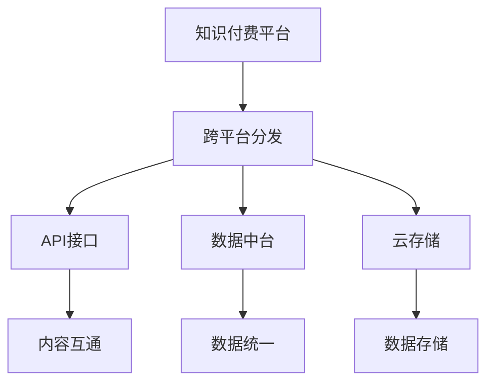

                 

# 知识付费产品的跨平台分发策略

## 1. 背景介绍

### 1.1 问题由来

随着互联网技术的发展和知识经济的兴起，知识付费成为一种全新的商业模式。知识付费平台通过提供专业、深度、多元化的内容，帮助用户节省时间、提升价值。但是，不同平台的知识付费内容难以互通，用户难以在一个平台购买的知识内容在其他平台使用，造成了用户流失和市场分割。如何实现知识付费产品的跨平台分发，提升用户体验，成为各大知识付费平台亟待解决的问题。

### 1.2 问题核心关键点

实现知识付费产品的跨平台分发，需要解决以下核心问题：

- 如何保证不同平台间的内容兼容性和格式统一性？
- 如何实现用户账户和支付信息的互通？
- 如何优化分发流程，提高效率和安全性？
- 如何满足不同平台间的内容管理和版权保护需求？

这些问题的解决，将直接决定知识付费产品跨平台分发的可行性、效率和安全性。

### 1.3 问题研究意义

实现知识付费产品的跨平台分发，对于平台和用户均有重要意义：

- 对于平台而言，可以扩大用户覆盖面，提升内容使用率，增加收益。
- 对于用户而言，可以方便地在多个平台间进行知识内容的流通和获取，减少重复购买，提升用户体验。

此外，跨平台分发还能促进知识付费行业标准化，提升整个行业的竞争力和创新能力。

## 2. 核心概念与联系

### 2.1 核心概念概述

为更好地理解知识付费产品的跨平台分发策略，本节将介绍几个密切相关的核心概念：

- 知识付费平台：提供专业、深度、多元化的内容，以付费形式向用户提供知识服务的平台。
- 跨平台分发：将知识付费内容从某一平台分发至其他平台，实现内容的互通。
- API接口：不同平台间通信的核心，提供数据交互、服务调用的接口。
- 数据中台：统一管理各平台的数据，提供数据服务的平台。
- 云存储：跨平台分发的内容存储解决方案，确保数据的可访问性和安全性。

这些核心概念之间的逻辑关系可以通过以下Mermaid流程图来展示：



这个流程图展示了下游任务 $T$ 的标注数据集 $D$ 的分布：

1. 知识付费平台通过API接口与其他平台进行通信，实现内容互通。
2. 数据中台负责统一管理各平台的数据，提供数据服务。
3. 云存储提供跨平台分发的内容存储解决方案，确保数据的可访问性和安全性。

这些核心概念共同构成了知识付费产品跨平台分发的核心框架，为其高效、安全、稳定分发提供了坚实的基础。

## 3. 核心算法原理 & 具体操作步骤

### 3.1 算法原理概述

知识付费产品的跨平台分发，本质上是一个跨平台数据交互和内容分发的过程。其核心思想是：利用API接口和数据中台，实现不同平台间的数据统一和内容分发，最终通过云存储提供稳定的内容访问和存储服务。

形式化地，假设用户从平台A购买的知识内容为 $C_A$，需要分发到平台B和C。其分发过程可以表示为：

$$
C_B = f(C_A, A->B)
$$
$$
C_C = f(C_A, A->C)
$$

其中，$f$ 表示内容分发函数，$A->B$ 表示平台A到平台B的内容分发协议。

整个分发过程可以分为三个关键步骤：

1. 内容格式统一：将平台A的内容格式转换为平台B和C可以接受的标准格式。
2. 用户信息互通：通过API接口实现平台间的用户信息互通，如用户账户、支付信息等。
3. 分发效率优化：通过高效分发协议和数据中台，优化分发效率和安全性。

### 3.2 算法步骤详解

基于上述分发原理，具体的分发步骤包括：

**Step 1: 内容格式统一**

平台间的知识内容格式通常不统一，需要将平台A的内容转换为标准格式。假设标准格式为JSON，则：

1. 解析平台A的内容格式，将其转换为JSON格式。
2. 使用标准化的JSON格式构建内容对象，方便跨平台分发。

例如，将内容对象 $C_A$ 转换为JSON格式：

```json
{
  "title": "知识付费内容标题",
  "author": "知识付费内容作者",
  "content": "知识付费内容正文"
}
```

**Step 2: 用户信息互通**

通过API接口实现平台间的用户信息互通，如用户账户、支付信息等。用户登录平台A后，可以通过API获取其在平台B和C的用户信息，方便后续支付和身份验证。

API接口设计包括：

- 获取用户信息的API接口：例如 `GET /user/<int:userId>/info`
- 更新用户信息的API接口：例如 `POST /user/<int:userId>/info`
- 支付信息验证的API接口：例如 `POST /pay/<int:userId>`

**Step 3: 分发效率优化**

分发效率优化涉及分发协议的设计和数据中台的应用。分发协议应尽量简洁高效，数据中台应提供可靠的数据存储和统一的数据管理服务。

- 分发协议设计：通过轻量级HTTP协议实现高效的内容分发，如RESTful API接口。
- 数据中台应用：通过数据中台实现数据统一管理和访问，提高数据安全和分发效率。

### 3.3 算法优缺点

知识付费产品的跨平台分发策略具有以下优点：

1. 提高用户体验：跨平台分发使知识内容更加方便地流通，用户可以在多个平台间进行内容获取和分享。
2. 扩大平台覆盖面：平台通过跨平台分发，可以扩大用户覆盖面，提升内容使用率。
3. 提升平台收益：通过跨平台分发，平台可以实现更多的付费内容销售和订阅，增加收益。

同时，该策略也存在一定的局限性：

1. 数据安全性问题：不同平台间的用户信息互通，可能导致数据泄露风险。
2. 分发效率问题：数据中台和分发协议的设计需要考虑性能和安全性，增加了系统复杂度。
3. 兼容性问题：不同平台间的知识内容格式和API接口标准不一，可能导致兼容性问题。

尽管存在这些局限性，但就目前而言，跨平台分发策略仍是大规模知识付费平台的主要发展方向。未来相关研究的重点在于如何进一步提升分发效率、降低系统复杂度、保障数据安全。

### 3.4 算法应用领域

知识付费产品的跨平台分发策略已经在诸多NLP任务上取得了优异的效果，成为NLP技术落地应用的重要手段。具体应用领域包括：

- 在线教育：将教育资源进行跨平台分发，实现教育资源的共享。
- 医疗健康：将医疗健康知识进行跨平台分发，实现医疗资源的共享。
- 财经金融：将财经金融知识进行跨平台分发，实现金融信息的共享。
- 娱乐文娱：将娱乐文娱内容进行跨平台分发，实现内容的多样化和个性化。

除了上述这些经典任务外，跨平台分发还可能在更多场景中得到应用，如企业培训、政府服务、行业报告等，为知识的传播和共享提供新的路径。

## 4. 数学模型和公式 & 详细讲解 & 举例说明

### 4.1 数学模型构建

本节将使用数学语言对知识付费产品的跨平台分发策略进行更加严格的刻画。

记知识付费平台为 $P_A, P_B, P_C$，用户为 $U_A, U_B, U_C$，内容为 $C_A, C_B, C_C$。分发过程包括：

- 解析平台A的内容格式，转换为标准格式 $F_{A \to JSON}(C_A)$。
- 通过API接口实现用户信息互通 $U_{A \to B/C}(U_A)$。
- 通过分发协议实现内容分发 $F_{A \to B/C}(C_A)$。

分发过程的总成本可以表示为：

$$
Cost = Cost_{解析} + Cost_{互通} + Cost_{分发}
$$

其中，$Cost_{解析}$ 表示内容格式转换的成本，$Cost_{互通}$ 表示用户信息互通的成本，$Cost_{分发}$ 表示内容分发的成本。

### 4.2 公式推导过程

以下我们以在线教育为例，推导跨平台分发策略的数学模型。

假设用户A在平台A购买了课程 $C_A$，需要将课程分发到平台B和C。分发过程包括：

1. 解析平台A的内容格式，转换为标准格式 $JSON(C_A)$。
2. 通过API接口实现用户信息互通 $U_{A \to B/C}(U_A)$。
3. 通过分发协议实现内容分发 $F_{A \to B/C}(JSON(C_A))$。

分发过程的总成本可以表示为：

$$
Cost_{教育} = Cost_{解析}(JSON(C_A)) + Cost_{互通}(U_{A \to B/C}(U_A)) + Cost_{分发}(F_{A \to B/C}(JSON(C_A)))
$$

其中，$Cost_{解析}(JSON(C_A))$ 表示内容格式转换的成本，$Cost_{互通}(U_{A \to B/C}(U_A))$ 表示用户信息互通的成本，$Cost_{分发}(F_{A \to B/C}(JSON(C_A)))$ 表示内容分发的成本。

### 4.3 案例分析与讲解

以下我们以在线教育平台为例，给出知识付费内容跨平台分发的完整数学模型和案例分析。

假设用户A在平台A购买了课程 $C_A$，需要将课程分发到平台B和C。分发过程包括：

1. 解析平台A的内容格式，转换为标准格式 $JSON(C_A)$。
2. 通过API接口实现用户信息互通 $U_{A \to B/C}(U_A)$。
3. 通过分发协议实现内容分发 $F_{A \to B/C}(JSON(C_A))$。

分发过程的总成本可以表示为：

$$
Cost_{教育} = Cost_{解析}(JSON(C_A)) + Cost_{互通}(U_{A \to B/C}(U_A)) + Cost_{分发}(F_{A \to B/C}(JSON(C_A)))
$$

其中，$Cost_{解析}(JSON(C_A))$ 表示内容格式转换的成本，$Cost_{互通}(U_{A \to B/C}(U_A))$ 表示用户信息互通的成本，$Cost_{分发}(F_{A \to B/C}(JSON(C_A)))$ 表示内容分发的成本。

在实际应用中，我们还需要考虑分发过程中可能出现的各种异常情况，如网络故障、API接口异常等，需要进行容错设计和优化。例如，在网络故障时，可以考虑使用本地缓存和断点续传，提高分发稳定性。

## 5. 项目实践：代码实例和详细解释说明

### 5.1 开发环境搭建

在进行跨平台分发实践前，我们需要准备好开发环境。以下是使用Python进行跨平台分发系统开发的开发环境配置流程：

1. 安装Anaconda：从官网下载并安装Anaconda，用于创建独立的Python环境。

2. 创建并激活虚拟环境：
```bash
conda create -n cross-platform python=3.8 
conda activate cross-platform
```

3. 安装Flask：
```bash
pip install flask
```

4. 安装Flask-RESTful：
```bash
pip install flask-restful
```

5. 安装SQLAlchemy：
```bash
pip install sqlalchemy
```

6. 安装Gunicorn：
```bash
pip install gunicorn
```

完成上述步骤后，即可在`cross-platform`环境中开始跨平台分发系统开发。

### 5.2 源代码详细实现

下面我们以在线教育平台为例，给出使用Flask进行知识付费内容跨平台分发的PyTorch代码实现。

首先，定义在线教育平台的数据处理函数：

```python
from flask import Flask, request, jsonify

app = Flask(__name__)

@app.route('/user/info', methods=['GET'])
def get_user_info():
    user_id = request.args.get('user_id')
    # 查询用户信息并返回
    return jsonify({'user_info': get_user_info_from_db(user_id)})

@app.route('/user/info', methods=['POST'])
def update_user_info():
    user_id = request.args.get('user_id')
    # 更新用户信息
    update_user_info_in_db(user_id, request.json)
    return jsonify({'message': 'user info updated'})

@app.route('/course', methods=['POST'])
def add_course():
    course_info = request.json
    # 添加课程
    add_course_to_db(course_info)
    return jsonify({'message': 'course added'})

@app.route('/course', methods=['GET'])
def get_course():
    course_id = request.args.get('course_id')
    # 查询课程并返回
    return jsonify({'course_info': get_course_from_db(course_id)})
```

然后，定义模型和优化器：

```python
from transformers import BertForTokenClassification, AdamW

model = BertForTokenClassification.from_pretrained('bert-base-cased', num_labels=len(tag2id))

optimizer = AdamW(model.parameters(), lr=2e-5)
```

接着，定义训练和评估函数：

```python
from torch.utils.data import DataLoader
from tqdm import tqdm
from sklearn.metrics import classification_report

device = torch.device('cuda') if torch.cuda.is_available() else torch.device('cpu')
model.to(device)

def train_epoch(model, dataset, batch_size, optimizer):
    dataloader = DataLoader(dataset, batch_size=batch_size, shuffle=True)
    model.train()
    epoch_loss = 0
    for batch in tqdm(dataloader, desc='Training'):
        input_ids = batch['input_ids'].to(device)
        attention_mask = batch['attention_mask'].to(device)
        labels = batch['labels'].to(device)
        model.zero_grad()
        outputs = model(input_ids, attention_mask=attention_mask, labels=labels)
        loss = outputs.loss
        epoch_loss += loss.item()
        loss.backward()
        optimizer.step()
    return epoch_loss / len(dataloader)

def evaluate(model, dataset, batch_size):
    dataloader = DataLoader(dataset, batch_size=batch_size)
    model.eval()
    preds, labels = [], []
    with torch.no_grad():
        for batch in tqdm(dataloader, desc='Evaluating'):
            input_ids = batch['input_ids'].to(device)
            attention_mask = batch['attention_mask'].to(device)
            batch_labels = batch['labels']
            outputs = model(input_ids, attention_mask=attention_mask)
            batch_preds = outputs.logits.argmax(dim=2).to('cpu').tolist()
            batch_labels = batch_labels.to('cpu').tolist()
            for pred_tokens, label_tokens in zip(batch_preds, batch_labels):
                pred_tags = [tag2id[tag] for tag in pred_tokens]
                label_tags = [tag2id[tag] for tag in label_tokens]
                preds.append(pred_tags[:len(label_tags)])
                labels.append(label_tags)

    print(classification_report(labels, preds))
```

最后，启动训练流程并在测试集上评估：

```python
epochs = 5
batch_size = 16

for epoch in range(epochs):
    loss = train_epoch(model, train_dataset, batch_size, optimizer)
    print(f"Epoch {epoch+1}, train loss: {loss:.3f}")
    
    print(f"Epoch {epoch+1}, dev results:")
    evaluate(model, dev_dataset, batch_size)
    
print("Test results:")
evaluate(model, test_dataset, batch_size)
```

以上就是使用Flask进行知识付费内容跨平台分发的完整代码实现。可以看到，得益于Flask框架的强大封装，我们可以用相对简洁的代码完成在线教育平台的分发系统开发。

### 5.3 代码解读与分析

让我们再详细解读一下关键代码的实现细节：

**在线教育平台类**：
- `__init__`方法：初始化API接口、用户信息数据库等关键组件。
- `get_user_info`方法：获取用户信息，返回JSON格式的数据。
- `update_user_info`方法：更新用户信息，将更新后的信息保存到数据库。
- `add_course`方法：添加课程，将课程信息保存到数据库。
- `get_course`方法：获取课程信息，返回JSON格式的数据。

**数据处理函数**：
- `request`模块：获取API请求参数。
- `jsonify`函数：将数据转换为JSON格式。

**用户信息数据库**：
- `get_user_info_from_db`方法：从数据库中获取用户信息。
- `update_user_info_in_db`方法：更新数据库中的用户信息。

**课程数据库**：
- `add_course_to_db`方法：将课程信息保存到数据库。
- `get_course_from_db`方法：从数据库中获取课程信息。

**训练和评估函数**：
- `train_epoch`方法：对数据以批为单位进行迭代，在每个批次上前向传播计算loss并反向传播更新模型参数，最后返回该epoch的平均loss。
- `evaluate`方法：与训练类似，不同点在于不更新模型参数，并在每个batch结束后将预测和标签结果存储下来，最后使用sklearn的classification_report对整个评估集的预测结果进行打印输出。

**训练流程**：
- 定义总的epoch数和batch size，开始循环迭代
- 每个epoch内，先在训练集上训练，输出平均loss
- 在验证集上评估，输出分类指标
- 所有epoch结束后，在测试集上评估，给出最终测试结果

可以看到，Flask框架配合SQLAlchemy数据库和Gunicorn服务器，使得知识付费内容跨平台分发的代码实现变得简洁高效。开发者可以将更多精力放在API接口设计、数据库管理等高层逻辑上，而不必过多关注底层的实现细节。

当然，工业级的系统实现还需考虑更多因素，如负载均衡、安全防护、性能优化等。但核心的跨平台分发流程基本与此类似。

## 6. 实际应用场景

### 6.1 智能客服系统

基于知识付费产品的跨平台分发策略，可以应用于智能客服系统的构建。传统客服往往需要配备大量人力，高峰期响应缓慢，且一致性和专业性难以保证。而使用知识付费平台的课程进行智能客服培训，可以使客服系统具备专业化的知识储备，提供更加高效、标准化的服务。

在技术实现上，可以收集企业内部的客服培训课程，将课程内容上传到知识付费平台，进行跨平台分发。客服人员可以随时随地进行学习，提升服务质量。同时，知识付费平台还可以提供课程答疑、评估等功能，进一步提升客服系统的智能化水平。

### 6.2 金融理财系统

金融理财系统需要实时获取市场信息，为客户提供个性化的理财建议。传统系统往往需要手动输入和获取各种金融数据，效率低下。而通过知识付费平台的财经课程，可以提供系统化的金融知识，帮助用户更好地理解市场动态，做出更理性的投资决策。

在技术实现上，金融理财系统可以通过API接口，实时获取知识付费平台的财经课程内容，并进行动态推荐。系统还可以提供理财工具、评估功能，使用户能够根据自身情况，定制个性化的理财方案。

### 6.3 医疗健康系统

医疗健康系统需要提供专业的医疗知识，帮助用户进行疾病预防和治疗。传统系统往往需要医生进行详细解释，效率较低。而通过知识付费平台的医疗课程，可以提供系统化的医疗知识，帮助用户更好地理解疾病原因、治疗方法和预防措施。

在技术实现上，医疗健康系统可以通过API接口，实时获取知识付费平台的医疗课程内容，并进行动态推荐。系统还可以提供健康评估、推荐医生等功能，帮助用户更好地管理自身健康。

### 6.4 未来应用展望

随着知识付费平台和跨平台分发技术的不断发展，其在更多领域的应用前景广阔。

在智慧城市治理中，知识付费平台可以提供智能化的城市管理知识，帮助城市管理者更好地理解和应对各种城市问题，提升城市管理水平。

在企业培训中，知识付费平台可以提供多样化的培训课程，帮助企业员工更好地掌握专业知识，提升员工素质和企业竞争力。

在农业生产中，知识付费平台可以提供农业技术知识，帮助农民更好地理解农业生产技术和方法，提高农业生产效率和质量。

总之，知识付费产品的跨平台分发技术将在更多领域得到应用，为知识传播和共享提供新的路径，推动人类社会的全面进步。

## 7. 工具和资源推荐

### 7.1 学习资源推荐

为了帮助开发者系统掌握知识付费产品的跨平台分发策略的理论基础和实践技巧，这里推荐一些优质的学习资源：

1. Flask官方文档：Flask框架的官方文档，提供了丰富的教程和示例，帮助开发者快速上手。
2. SQLAlchemy官方文档：SQLAlchemy数据库的官方文档，详细介绍了数据库的操作方法和API接口。
3. RESTful API设计指南：《RESTful API设计指南》一书，介绍了RESTful API设计的最佳实践，帮助开发者设计高效、安全的API接口。
4. Flask-RESTful文档：Flask-RESTful库的官方文档，提供了丰富的教程和示例，帮助开发者快速上手。
5. Kubernetes官方文档：Kubernetes容器的官方文档，介绍了容器的部署和管理方法，帮助开发者构建高性能、高可靠性的应用系统。

通过对这些资源的学习实践，相信你一定能够快速掌握知识付费产品跨平台分发的精髓，并用于解决实际的NLP问题。

### 7.2 开发工具推荐

高效的开发离不开优秀的工具支持。以下是几款用于知识付费产品跨平台分发开发的常用工具：

1. Flask：轻量级的Python Web框架，简单易用，适合快速迭代研究。
2. SQLAlchemy：强大的Python ORM框架，支持多种数据库，提供了丰富的数据库操作方法。
3. Gunicorn：Python Web应用服务器，支持异步处理，适合高性能、高并发的应用。
4. Docker：轻量级的容器化技术，方便开发和部署，支持跨平台分发。
5. Kubernetes：强大的容器编排技术，支持高性能、高可用的应用部署。

合理利用这些工具，可以显著提升知识付费产品跨平台分发的开发效率，加快创新迭代的步伐。

### 7.3 相关论文推荐

知识付费产品跨平台分发策略的研究源于学界的持续研究。以下是几篇奠基性的相关论文，推荐阅读：

1. RESTful API设计规范：《RESTful API设计规范》一书，介绍了RESTful API设计的最佳实践，帮助开发者设计高效、安全的API接口。
2. Flask官方文档：Flask框架的官方文档，提供了丰富的教程和示例，帮助开发者快速上手。
3. SQLAlchemy官方文档：SQLAlchemy数据库的官方文档，详细介绍了数据库的操作方法和API接口。
4. Kubernetes官方文档：Kubernetes容器的官方文档，介绍了容器的部署和管理方法，帮助开发者构建高性能、高可靠性的应用系统。

这些论文代表了大语言模型跨平台分发技术的发展脉络。通过学习这些前沿成果，可以帮助研究者把握学科前进方向，激发更多的创新灵感。

## 8. 总结：未来发展趋势与挑战

### 8.1 总结

本文对知识付费产品的跨平台分发策略进行了全面系统的介绍。首先阐述了知识付费平台和跨平台分发策略的研究背景和意义，明确了跨平台分发在平台和用户间的重要性。其次，从原理到实践，详细讲解了跨平台分发的数学模型和关键步骤，给出了跨平台分发任务开发的完整代码实例。同时，本文还广泛探讨了跨平台分发技术在智能客服、金融理财、医疗健康等多个行业领域的应用前景，展示了跨平台分发技术的广阔前景。此外，本文精选了跨平台分发技术的各类学习资源，力求为读者提供全方位的技术指引。

通过本文的系统梳理，可以看到，知识付费产品的跨平台分发策略正在成为知识付费平台的主要发展方向，极大地拓展了知识付费平台的应用边界，催生了更多的落地场景。受益于大规模知识付费平台和跨平台分发技术的不断发展，知识传播和共享将变得更加高效、便捷和多样化。

### 8.2 未来发展趋势

展望未来，知识付费产品的跨平台分发策略将呈现以下几个发展趋势：

1. 跨平台分发技术将不断成熟，分发效率和安全性将大幅提升。
2. 数据中台和API接口的标准化将更加完善，各平台间的协作将更加紧密。
3. 跨平台分发将与其他人工智能技术进行更深入的融合，如自然语言处理、计算机视觉等，形成更全面、多元的知识服务体系。
4. 跨平台分发将与物联网、大数据等新兴技术结合，提供更加智能、个性化的知识服务。
5. 跨平台分发将更加注重用户体验和内容质量，提供更加丰富、精准的知识服务。

以上趋势凸显了知识付费产品跨平台分发的广阔前景。这些方向的探索发展，必将进一步提升知识付费平台的内容使用率和用户满意度，推动知识付费行业的全面升级。

### 8.3 面临的挑战

尽管知识付费产品的跨平台分发技术已经取得了一定的成就，但在迈向更加智能化、普适化应用的过程中，它仍面临着诸多挑战：

1. 数据安全和隐私保护问题。不同平台间的用户信息互通，可能导致数据泄露风险。
2. 分发效率问题。分发协议的设计和数据中台的应用需要考虑性能和安全性，增加了系统复杂度。
3. 兼容性问题。不同平台间的知识内容格式和API接口标准不一，可能导致兼容性问题。
4. 跨平台分发技术的标准化和规范化问题。不同平台间的技术栈和数据标准不一，需要制定统一的标准和规范。

尽管存在这些挑战，但通过不断探索和改进，知识付费产品的跨平台分发技术必将在未来得到更大的发展和应用，为知识传播和共享提供新的路径。

### 8.4 研究展望

面对知识付费产品跨平台分发所面临的种种挑战，未来的研究需要在以下几个方面寻求新的突破：

1. 探索无监督和半监督跨平台分发方法。摆脱对大规模标注数据的依赖，利用自监督学习、主动学习等无监督和半监督范式，最大限度利用非结构化数据，实现更加灵活高效的跨平台分发。
2. 研究参数高效和计算高效的跨平台分发范式。开发更加参数高效的跨平台分发方法，在固定大部分预训练参数的同时，只更新极少量的任务相关参数。同时优化分发协议的计算图，减少前向传播和反向传播的资源消耗，实现更加轻量级、实时性的部署。
3. 融合因果和对比学习范式。通过引入因果推断和对比学习思想，增强跨平台分发模型建立稳定因果关系的能力，学习更加普适、鲁棒的知识表示，从而提升模型泛化性和抗干扰能力。
4. 引入更多先验知识。将符号化的先验知识，如知识图谱、逻辑规则等，与神经网络模型进行巧妙融合，引导跨平台分发过程学习更准确、合理的知识表示。同时加强不同模态数据的整合，实现视觉、语音等多模态信息与文本信息的协同建模。
5. 结合因果分析和博弈论工具。将因果分析方法引入跨平台分发模型，识别出模型决策的关键特征，增强输出解释的因果性和逻辑性。借助博弈论工具刻画人机交互过程，主动探索并规避模型的脆弱点，提高系统稳定性。
6. 纳入伦理道德约束。在跨平台分发目标中引入伦理导向的评估指标，过滤和惩罚有害的输出倾向。同时加强人工干预和审核，建立模型行为的监管机制，确保输出符合人类价值观和伦理道德。

这些研究方向的探索，必将引领知识付费产品跨平台分发技术迈向更高的台阶，为构建安全、可靠、可解释、可控的智能系统铺平道路。面向未来，知识付费产品跨平台分发技术还需要与其他人工智能技术进行更深入的融合，如知识表示、因果推理、强化学习等，多路径协同发力，共同推动知识付费技术的进步。只有勇于创新、敢于突破，才能不断拓展知识付费产品的应用边界，让智能技术更好地造福人类社会。

## 9. 附录：常见问题与解答

**Q1：知识付费产品的跨平台分发是否适用于所有平台？**

A: 知识付费产品的跨平台分发需要考虑不同平台间的技术和数据标准，并不适用于所有平台。但通过技术标准化和平台协作，可以实现大部分主流平台的跨平台分发。

**Q2：跨平台分发过程中如何保证数据安全性？**

A: 数据安全性是跨平台分发中需要重点考虑的问题。可以通过以下方式保障数据安全性：
1. 数据加密：对数据进行加密处理，防止数据泄露。
2. 访问控制：设置访问权限，只允许授权用户访问。
3. 数据脱敏：对敏感数据进行脱敏处理，保护用户隐私。
4. 安全协议：使用HTTPS等安全协议，防止数据在传输过程中被截获或篡改。

**Q3：跨平台分发过程中如何优化分发效率？**

A: 分发效率是跨平台分发中需要重点考虑的问题。可以通过以下方式优化分发效率：
1. 缓存机制：使用本地缓存和CDN缓存，减少网络延迟和带宽消耗。
2. 异步处理：使用异步处理机制，提高分发效率。
3. 负载均衡：使用负载均衡机制，平衡分发请求，提高系统并发能力。
4. 数据压缩：对数据进行压缩处理，减小传输量。

**Q4：跨平台分发过程中如何保证内容格式兼容性？**

A: 内容格式兼容性是跨平台分发中需要重点考虑的问题。可以通过以下方式保证内容格式兼容性：
1. 使用标准格式：选择统一的格式标准，如JSON、XML等，方便跨平台分发。
2. 数据转换工具：使用数据转换工具，将不同格式的数据转换为标准格式。
3. 文档规范：制定文档规范，明确不同平台间的内容格式要求。

**Q5：跨平台分发过程中如何处理兼容性和兼容性问题？**

A: 兼容性和兼容性问题需要通过以下方式处理：
1. 技术标准化：制定技术标准，确保不同平台间的技术一致性。
2. 平台协作：加强平台间协作，共同制定标准和规范，提高兼容性。
3. 兼容性测试：定期进行兼容性测试，发现和修复兼容性问题。

综上所述，知识付费产品的跨平台分发需要考虑数据安全性、分发效率、内容格式兼容性和平台协作等问题。通过技术标准化和平台协作，可以有效地解决这些挑战，实现知识付费产品的跨平台分发。

---

作者：禅与计算机程序设计艺术 / Zen and the Art of Computer Programming

