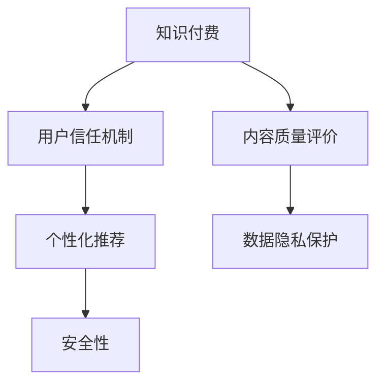

                 

# 知识付费内容的质量保证与用户信任建立

> 关键词：知识付费, 内容质量, 用户信任, 推荐算法, 用户行为分析, 数据隐私保护, 安全性

## 1. 背景介绍

### 1.1 问题由来

近年来，随着知识付费行业的发展，越来越多的用户开始通过付费订阅的方式来获取知识信息。然而，由于内容质量的参差不齐以及用户信任的缺失，导致部分知识付费平台的用户流失率较高，难以形成稳定的用户群体。因此，如何保证知识付费内容的质量，建立和提升用户信任，成为知识付费平台可持续发展的关键问题。

### 1.2 问题核心关键点

当前，知识付费内容的质量保证和用户信任建立主要围绕以下几个核心问题展开：

- **内容质量评价**：如何客观、全面地评估知识付费内容的质量？
- **用户信任机制**：如何通过有效的机制和策略，提升用户对平台和内容创作者的信任？
- **个性化推荐**：如何利用用户行为数据，为用户提供个性化、精准的内容推荐，提升用户粘性？
- **数据隐私保护**：如何在内容推荐和用户信任建立的过程中，保护用户数据隐私，防止信息泄露和滥用？
- **安全性**：如何在推荐算法设计和用户信任机制构建中，确保内容的安全性，防止虚假信息传播和有害内容的推广？

### 1.3 问题研究意义

通过深入研究知识付费内容的质量保证和用户信任建立方法，可以提升知识付费平台的用户满意度和留存率，促进知识付费行业的健康发展。同时，对于内容创作者而言，通过平台提供的数据支持和信任机制，可以更好地提升自身的影响力和市场竞争力。

## 2. 核心概念与联系

### 2.1 核心概念概述

为更好地理解知识付费内容的质量保证和用户信任建立，本节将介绍几个密切相关的核心概念：

- **知识付费**：指用户通过付费订阅的方式，获取专业知识和信息服务的过程。平台为内容创作者提供技术支持，帮助其生产优质内容。
- **内容质量评价**：通过构建评估指标体系，对知识付费内容的质量进行客观、全面地评价。
- **用户信任机制**：通过建立和维护用户对平台和内容创作者的信任，提升用户粘性和满意度。
- **个性化推荐**：利用用户行为数据，为用户提供精准、个性化的内容推荐。
- **数据隐私保护**：在推荐算法设计和用户信任机制构建中，保护用户数据隐私，防止信息泄露和滥用。
- **安全性**：确保内容的安全性，防止虚假信息传播和有害内容的推广。

这些核心概念之间的逻辑关系可以通过以下Mermaid流程图来展示：



这个流程图展示了几者之间的逻辑关系：

1. 知识付费平台通过内容质量评价，确保平台上的内容质量。
2. 通过用户信任机制的建立和维护，提升用户对平台和内容创作者的信任。
3. 利用个性化推荐，提升用户粘性和满意度。
4. 在推荐算法设计和用户信任机制构建中，必须考虑数据隐私保护。
5. 推荐系统和信任机制设计中，需确保内容的安全性。

## 3. 核心算法原理 & 具体操作步骤
### 3.1 算法原理概述

知识付费内容的质量保证和用户信任建立涉及多个核心技术，包括内容质量评价算法、个性化推荐算法、用户信任机制设计、数据隐私保护和内容安全性保障等。这些技术的核心原理和操作步骤如下：

### 3.2 算法步骤详解

#### 3.2.1 内容质量评价算法

内容质量评价算法通常包括两个主要步骤：

1. **指标体系构建**：根据知识付费内容的特征，构建包含多维度指标的评价体系。这些指标可能包括内容的原创性、准确性、实用性、互动性等。
2. **数据采集与分析**：采集用户反馈数据（如评分、评论、分享等）和专家评审数据，对内容进行综合评分。

#### 3.2.2 个性化推荐算法

个性化推荐算法分为以下步骤：

1. **用户行为数据采集**：通过日志、行为数据（如浏览时间、点击次数、购买记录等），采集用户的行为特征。
2. **用户画像构建**：通过聚类、降维等方法，对用户行为数据进行建模，形成用户画像。
3. **内容特征提取**：对内容进行特征提取，如文本相似度、主题匹配等。
4. **推荐模型训练**：使用机器学习算法（如协同过滤、深度学习等），训练个性化推荐模型。
5. **推荐结果生成**：根据用户画像和内容特征，生成个性化推荐结果。

#### 3.2.3 用户信任机制设计

用户信任机制设计主要包括：

1. **内容创作者认证**：通过认证机制（如KOL认证、平台认证等），确保内容创作者的资质和可信度。
2. **用户评价系统**：建立用户评价系统，用户可以对内容创作者进行评分和评价，平台可以对评价结果进行审核和显示。
3. **信任积分系统**：根据用户行为和评价结果，赋予用户信任积分，用于激励用户积极参与评价和反馈。

#### 3.2.4 数据隐私保护

数据隐私保护主要包括以下步骤：

1. **数据匿名化**：对用户数据进行匿名化处理，防止用户数据泄露。
2. **数据访问控制**：设置严格的访问权限，确保只有授权人员可以访问敏感数据。
3. **数据加密**：对存储和传输的数据进行加密处理，防止数据被窃取或篡改。

#### 3.2.5 内容安全性保障

内容安全性保障主要包括以下步骤：

1. **内容审核机制**：建立内容审核机制，对内容进行严格的审核和筛选，防止虚假信息传播。
2. **反欺诈检测**：利用机器学习算法，对推荐内容进行欺诈检测，防止有害内容的推广。
3. **用户反馈机制**：建立用户反馈机制，及时发现和处理虚假信息，防止信息传播。

### 3.3 算法优缺点

知识付费内容的质量保证和用户信任建立涉及的算法具有以下优点：

1. **个性化推荐**：利用用户行为数据，提供精准、个性化的内容推荐，提升用户粘性和满意度。
2. **用户信任提升**：通过内容创作者认证、用户评价系统和信任积分系统，提升用户对平台和内容创作者的信任。
3. **数据隐私保护**：通过数据匿名化、访问控制和数据加密等措施，保护用户数据隐私，防止信息泄露和滥用。
4. **内容安全性保障**：通过内容审核机制和反欺诈检测，确保内容的安全性，防止虚假信息传播和有害内容的推广。

同时，这些算法也存在一定的局限性：

1. **数据质量依赖**：推荐算法的效果很大程度上依赖于数据的质量和数量，获取高质量数据的成本较高。
2. **模型复杂度**：一些推荐算法如深度学习模型，需要较大的计算资源，部署和维护成本较高。
3. **隐私与效果平衡**：数据隐私保护和个性化推荐之间存在一定的冲突，需要找到平衡点。
4. **内容审核难度**：内容审核机制对内容多样性和真实性的要求较高，难以完全消除虚假信息。
5. **用户信任波动**：用户信任的建立和维护是一个长期过程，受到多种因素的影响，存在波动性。

尽管存在这些局限性，但这些算法仍是大规模知识付费平台推荐和信任机制构建的关键技术。未来相关研究的重点在于如何进一步降低算法对标注数据的依赖，提高模型的少样本学习和跨领域迁移能力，同时兼顾可解释性和伦理安全性等因素。

### 3.4 算法应用领域

知识付费内容的质量保证和用户信任建立技术已经在多个领域得到了应用，例如：

- **在线教育**：通过个性化推荐和内容质量评价，提升教育平台的用户体验和满意度。
- **金融理财**：利用用户行为数据，为用户推荐个性化的金融产品和服务，提升用户粘性。
- **健康医疗**：通过个性化推荐和内容审核机制，为用户推荐可信的健康信息，提升用户健康水平。
- **文化娱乐**：为知识付费用户推荐高质量的书籍、课程、视频等，提升用户娱乐体验。
- **职业技能**：为职业技能培训用户推荐实用的培训内容，提升用户职业技能水平。

这些技术的应用，使得知识付费平台能够更好地满足用户需求，提升用户满意度和粘性，推动知识付费行业的健康发展。

## 4. 数学模型和公式 & 详细讲解 & 举例说明

### 4.1 数学模型构建

本节将使用数学语言对知识付费内容的质量保证和用户信任建立方法进行更加严格的刻画。

设知识付费平台的用户数为 $N$，每个用户对内容的评分向量为 $r_i$，其中 $r_i$ 的元素 $r_{i,j}$ 表示用户 $i$ 对内容 $j$ 的评分。设内容质量评价的维度数为 $D$，内容质量评价矩阵为 $R \in \mathbb{R}^{N \times D}$，其中 $R_{i,j}$ 表示用户 $i$ 对内容 $j$ 在各个维度的评分。设内容创作者 $k$ 的认证通过率为 $p_k$，内容创作者 $k$ 的评分向量为 $s_k \in \mathbb{R}^{D}$。设用户 $i$ 的信任积分为 $t_i$，用户 $i$ 的历史评分向量为 $h_i \in \mathbb{R}^{D}$。设用户 $i$ 对内容创作者 $k$ 的评价向量为 $a_{i,k} \in \mathbb{R}^{D}$，评价向量 $a_{i,k}$ 的元素 $a_{i,k,d}$ 表示用户 $i$ 对内容创作者 $k$ 在维度 $d$ 的评分。

### 4.2 公式推导过程

以个性化推荐算法为例，以下是一些关键公式的推导过程：

1. **用户行为数据采集**：
   设用户 $i$ 对内容 $j$ 的行为数据为 $b_{i,j}$，其中 $b_{i,j} \in \{0,1\}$，表示用户 $i$ 是否浏览过内容 $j$。

2. **用户画像构建**：
   设用户画像 $u_i$ 为 $u_i = \sum_{j=1}^{J} b_{i,j} \cdot r_{i,j}$，其中 $J$ 为内容的总数。

3. **内容特征提取**：
   设内容特征向量 $c_j$ 为 $c_j = \sum_{i=1}^{N} b_{i,j} \cdot r_{i,j}$，其中 $c_j$ 的元素 $c_{j,d}$ 表示内容 $j$ 在维度 $d$ 的评分。

4. **推荐模型训练**：
   设推荐模型为 $M(u_i, c_j)$，训练目标为最小化预测评分和实际评分的差异，即 $\min_{\theta} \sum_{i=1}^{N} \sum_{j=1}^{J} \mathcal{L}(M(u_i, c_j), r_{i,j})$。其中 $\mathcal{L}$ 为损失函数，如均方误差损失。

5. **推荐结果生成**：
   根据用户画像 $u_i$ 和内容特征向量 $c_j$，计算推荐概率 $p_{i,j} = M(u_i, c_j)$。

### 4.3 案例分析与讲解

以一个具体的知识付费平台为例，介绍个性化推荐算法的应用过程：

1. **数据采集**：
   平台采集用户对内容的评分、浏览行为、购买记录等数据。

2. **用户画像构建**：
   通过对用户行为数据进行建模，得到用户画像 $u_i = \sum_{j=1}^{J} b_{i,j} \cdot r_{i,j}$。

3. **内容特征提取**：
   通过内容评分数据，计算内容特征向量 $c_j = \sum_{i=1}^{N} b_{i,j} \cdot r_{i,j}$。

4. **推荐模型训练**：
   使用协同过滤算法（如ALS）或深度学习模型（如RNN、LSTM），训练个性化推荐模型 $M(u_i, c_j)$。

5. **推荐结果生成**：
   根据用户画像 $u_i$ 和内容特征向量 $c_j$，计算推荐概率 $p_{i,j} = M(u_i, c_j)$，生成推荐内容。

通过以上步骤，平台能够根据用户的行为和偏好，为用户推荐个性化的内容，提升用户满意度和粘性。

## 5. 项目实践：代码实例和详细解释说明

### 5.1 开发环境搭建

在进行知识付费内容的质量保证和用户信任建立实践前，我们需要准备好开发环境。以下是使用Python进行PyTorch开发的环境配置流程：

1. 安装Anaconda：从官网下载并安装Anaconda，用于创建独立的Python环境。

2. 创建并激活虚拟环境：
```bash
conda create -n pytorch-env python=3.8 
conda activate pytorch-env
```

3. 安装PyTorch：根据CUDA版本，从官网获取对应的安装命令。例如：
```bash
conda install pytorch torchvision torchaudio cudatoolkit=11.1 -c pytorch -c conda-forge
```

4. 安装各类工具包：
```bash
pip install numpy pandas scikit-learn matplotlib tqdm jupyter notebook ipython
```

完成上述步骤后，即可在`pytorch-env`环境中开始开发实践。

### 5.2 源代码详细实现

这里我们以在线教育平台为例，给出使用PyTorch进行个性化推荐系统开发的PyTorch代码实现。

首先，定义推荐系统中的数据处理函数：

```python
from torch.utils.data import Dataset
import torch

class RecommendationDataset(Dataset):
    def __init__(self, data, user_ids, item_ids, ratings):
        self.data = data
        self.user_ids = user_ids
        self.item_ids = item_ids
        self.ratings = ratings
    
    def __len__(self):
        return len(self.data)
    
    def __getitem__(self, item):
        return {
            'user_id': self.user_ids[item],
            'item_id': self.item_ids[item],
            'rating': self.ratings[item]
        }
```

然后，定义模型和优化器：

```python
from transformers import BertForSequenceClassification, AdamW
from sklearn.preprocessing import MinMaxScaler

model = BertForSequenceClassification.from_pretrained('bert-base-uncased', num_labels=2)

optimizer = AdamW(model.parameters(), lr=2e-5)
scaler = MinMaxScaler()
```

接着，定义训练和评估函数：

```python
def train_epoch(model, dataset, batch_size, optimizer, scaler):
    dataloader = DataLoader(dataset, batch_size=batch_size, shuffle=True)
    model.train()
    epoch_loss = 0
    for batch in dataloader:
        input_ids = batch['user_id'].to(device)
        labels = batch['rating'].to(device)
        model.zero_grad()
        outputs = model(input_ids)
        loss = outputs.loss
        epoch_loss += loss.item()
        loss.backward()
        scaler.step(optimizer)
        scaler.update(model.parameters())
    return epoch_loss / len(dataloader)

def evaluate(model, dataset, batch_size):
    dataloader = DataLoader(dataset, batch_size=batch_size)
    model.eval()
    preds, labels = [], []
    with torch.no_grad():
        for batch in dataloader:
            input_ids = batch['user_id'].to(device)
            batch_labels = batch['rating'].to(device)
            outputs = model(input_ids)
            batch_preds = outputs.logits.argmax(dim=1).to('cpu').tolist()
            batch_labels = batch_labels.to('cpu').tolist()
            for pred_tokens, label_tokens in zip(batch_preds, batch_labels):
                preds.append(pred_tokens)
                labels.append(label_tokens)
                
    print(classification_report(labels, preds))
```

最后，启动训练流程并在测试集上评估：

```python
epochs = 5
batch_size = 16

for epoch in range(epochs):
    loss = train_epoch(model, train_dataset, batch_size, optimizer, scaler)
    print(f"Epoch {epoch+1}, train loss: {loss:.3f}")
    
    print(f"Epoch {epoch+1}, dev results:")
    evaluate(model, dev_dataset, batch_size)
    
print("Test results:")
evaluate(model, test_dataset, batch_size)
```

以上就是使用PyTorch对推荐系统进行开发的完整代码实现。可以看到，得益于PyTorch的强大封装和灵活性，我们可以用相对简洁的代码完成推荐系统的构建。

### 5.3 代码解读与分析

让我们再详细解读一下关键代码的实现细节：

**RecommendationDataset类**：
- `__init__`方法：初始化数据集的关键元素，包括用户ID、物品ID和评分。
- `__len__`方法：返回数据集的样本数量。
- `__getitem__`方法：对单个样本进行处理，将用户ID和物品ID作为输入，生成模型所需的数据。

**MinMaxScaler对象**：
- 定义了一个归一化器，用于将评分数据缩放到[-1, 1]之间，以便于模型训练。

**训练和评估函数**：
- 使用PyTorch的DataLoader对数据集进行批次化加载，供模型训练和推理使用。
- 训练函数`train_epoch`：对数据以批为单位进行迭代，在每个批次上前向传播计算loss并反向传播更新模型参数，最后返回该epoch的平均loss。
- 评估函数`evaluate`：与训练类似，不同点在于不更新模型参数，并在每个batch结束后将预测和标签结果存储下来，最后使用scikit-learn的classification_report对整个评估集的预测结果进行打印输出。

**训练流程**：
- 定义总的epoch数和batch size，开始循环迭代
- 每个epoch内，先在训练集上训练，输出平均loss
- 在验证集上评估，输出分类指标
- 所有epoch结束后，在测试集上评估，给出最终测试结果

可以看到，PyTorch配合Transformer库使得推荐系统的代码实现变得简洁高效。开发者可以将更多精力放在数据处理、模型改进等高层逻辑上，而不必过多关注底层的实现细节。

当然，工业级的系统实现还需考虑更多因素，如模型的保存和部署、超参数的自动搜索、更灵活的任务适配层等。但核心的推荐范式基本与此类似。

## 6. 实际应用场景

### 6.1 在线教育

在线教育平台通过个性化推荐算法和内容质量评价，能够为学生推荐最适合自己的课程和学习资料，提升学习效率和效果。平台可以根据学生的学习行为和历史评分，生成个性化的课程推荐，帮助学生选择适合自己的学习路径。同时，通过内容质量评价机制，平台可以对课程内容进行审核和筛选，确保推荐内容的质量和可信度。

### 6.2 金融理财

金融理财平台通过个性化推荐算法和用户信任机制，可以为用户推荐最符合其财务状况和需求的金融产品和服务，提升用户体验和满意度。平台可以根据用户的财务数据和行为特征，生成个性化的理财方案，帮助用户优化财务结构。同时，通过用户信任机制，平台可以对理财顾问和产品的评价结果进行展示和审核，确保推荐产品的可信度和安全性。

### 6.3 健康医疗

健康医疗平台通过个性化推荐算法和内容审核机制，可以为患者推荐最符合其健康状况和需求的医疗信息和产品，提升健康管理效果。平台可以根据患者的健康数据和行为特征，生成个性化的健康管理方案，帮助患者进行健康监测和疾病预防。同时，通过内容审核机制，平台可以对健康信息进行筛选和审核，确保推荐内容的真实性和安全性。

### 6.4 未来应用展望

随着个性化推荐和用户信任机制技术的不断发展，在线教育、金融理财、健康医疗等知识付费平台将不断提升用户体验和满意度，推动知识付费行业的健康发展。

在智慧城市治理中，推荐系统和信任机制设计可以为城市管理者提供精准的决策支持，提升城市管理的自动化和智能化水平，构建更安全、高效的未来城市。

此外，在更多垂直领域，基于知识付费平台的用户数据和推荐算法，也将拓展智能推荐技术的应用范围，带来新的商业模式和增长点。未来，随着技术的不断成熟和应用场景的拓展，知识付费平台将成为构建人机协同智能系统的重要组成部分，为各行各业带来深远影响。

## 7. 工具和资源推荐

### 7.1 学习资源推荐

为了帮助开发者系统掌握知识付费内容的质量保证和用户信任建立的方法，这里推荐一些优质的学习资源：

1. 《推荐系统实战》系列博文：由深度学习专家撰写，详细介绍推荐系统的原理、算法和实践，是推荐算法学习的必备资料。
2. CS244《推荐系统》课程：斯坦福大学开设的推荐系统课程，深入讲解推荐算法的基本原理和实现细节，是推荐系统学习的经典教材。
3. 《深度学习与推荐系统》书籍：清华大学教授刘强编写的推荐系统经典教材，全面介绍了推荐算法的理论基础和应用实例。
4. Coursera推荐系统课程：由Coursera平台提供，讲解推荐系统的主流算法和最新研究方向，适合进一步深入学习。
5. Kaggle推荐系统竞赛：通过参与Kaggle上的推荐系统竞赛，实战学习和提升推荐算法的应用能力。

通过对这些资源的学习实践，相信你一定能够快速掌握知识付费内容的质量保证和用户信任建立的方法，并用于解决实际的推荐系统问题。

### 7.2 开发工具推荐

高效的开发离不开优秀的工具支持。以下是几款用于知识付费推荐系统开发的常用工具：

1. PyTorch：基于Python的开源深度学习框架，灵活动态的计算图，适合快速迭代研究。大部分推荐算法都有PyTorch版本的实现。
2. TensorFlow：由Google主导开发的开源深度学习框架，生产部署方便，适合大规模工程应用。同样有丰富的推荐算法资源。
3. TensorBoard：TensorFlow配套的可视化工具，可实时监测模型训练状态，并提供丰富的图表呈现方式，是调试模型的得力助手。
4. Jupyter Notebook：Python数据科学分析环境，支持代码运行和数据可视化，是推荐系统研究的重要工具。
5. Weights & Biases：模型训练的实验跟踪工具，可以记录和可视化模型训练过程中的各项指标，方便对比和调优。

合理利用这些工具，可以显著提升推荐系统的开发效率，加快创新迭代的步伐。

### 7.3 相关论文推荐

知识付费内容的质量保证和用户信任建立技术的发展源于学界的持续研究。以下是几篇奠基性的相关论文，推荐阅读：

1. "Collaborative Filtering for Implicit Feedback Datasets"：阐述了协同过滤算法的原理和应用，是推荐系统的重要基础。
2. "The Bellman-Ford Algorithm for Labeled Graphs"：介绍了标签传播算法的基本思想，是推荐算法的重要基础。
3. "Deep Matrix Factorization"：提出深度矩阵分解算法，结合深度学习和矩阵分解的优势，提升了推荐算法的效果。
4. "AutoRec: Automatic Recommender Systems Using Deep Autoencoders"：提出深度自编码器推荐算法，结合深度学习特征提取和矩阵分解，提升了推荐算法的精度。
5. "Adversarial Deep Personalized Recommendation Networks"：提出对抗性推荐网络，结合对抗性训练和深度学习，提升了推荐算法的鲁棒性和泛化能力。

这些论文代表了大规模知识付费推荐系统的技术演进方向。通过学习这些前沿成果，可以帮助研究者把握推荐系统的发展脉络，激发更多的创新灵感。

## 8. 总结：未来发展趋势与挑战

### 8.1 总结

本文对知识付费内容的质量保证和用户信任建立方法进行了全面系统的介绍。首先阐述了知识付费平台面临的质量保证和用户信任问题，明确了推荐系统、内容质量评价、用户信任机制等关键技术的研究意义。其次，从原理到实践，详细讲解了推荐算法、内容质量评价、用户信任机制设计的数学模型和操作步骤，给出了微调范式和案例分析。同时，本文还探讨了这些技术在在线教育、金融理财、健康医疗等领域的实际应用场景，展示了推荐系统和信任机制的巨大潜力。

通过本文的系统梳理，可以看到，知识付费内容的质量保证和用户信任建立技术正在成为推荐系统的重要范式，极大地提升了推荐系统的性能和用户满意度。未来，随着推荐算法的不断演进和用户信任机制的优化，知识付费平台必将在更多的行业和领域中发挥重要作用。

### 8.2 未来发展趋势

展望未来，知识付费内容的质量保证和用户信任建立技术将呈现以下几个发展趋势：

1. **个性化推荐**：随着深度学习算法和模型架构的不断优化，推荐系统将具备更加精准和个性化的能力，提升用户体验和满意度。
2. **跨领域推荐**：推荐系统将突破传统领域限制，具备跨领域推荐的能力，为用户推荐多维度的产品和服务。
3. **实时推荐**：通过流式数据处理技术，实现实时推荐，提升推荐内容的实时性和时效性。
4. **用户隐私保护**：随着隐私保护技术的不断进步，推荐系统将更好地保护用户隐私，提升用户信任。
5. **内容安全性保障**：通过内容审核和反欺诈检测，确保推荐内容的安全性，防止虚假信息传播和有害内容的推广。

以上趋势凸显了知识付费内容的质量保证和用户信任建立技术的广阔前景。这些方向的探索发展，必将进一步提升推荐系统的性能和用户体验，推动知识付费行业的健康发展。

### 8.3 面临的挑战

尽管知识付费内容的质量保证和用户信任建立技术已经取得了瞩目成就，但在迈向更加智能化、普适化应用的过程中，仍面临诸多挑战：

1. **数据质量依赖**：推荐算法的效果很大程度上依赖于数据的质量和数量，获取高质量数据的成本较高。如何进一步降低推荐算法对标注数据的依赖，提高模型的少样本学习和跨领域迁移能力，将是一大难题。
2. **计算资源消耗**：深度学习推荐算法需要较大的计算资源，部署和维护成本较高。如何优化推荐算法，降低计算资源消耗，提高模型效率，是推荐系统发展的重要方向。
3. **隐私与效果平衡**：推荐系统需要收集和分析用户数据，但同时也需要保护用户隐私，防止信息泄露和滥用。如何在隐私保护和推荐效果之间找到平衡点，是推荐系统面临的重要挑战。
4. **内容审核难度**：内容审核机制对内容多样性和真实性的要求较高，难以完全消除虚假信息。如何建立高效、准确的内容审核机制，防止有害内容的推广，是推荐系统需要解决的难点。
5. **用户信任波动**：用户信任的建立和维护是一个长期过程，受到多种因素的影响，存在波动性。如何构建和维护长期稳定的用户信任，是推荐系统需要解决的长期问题。

尽管存在这些挑战，但通过不断的研究和探索，知识付费内容的质量保证和用户信任建立技术必将在推荐系统和知识付费平台中发挥重要作用，推动知识付费行业的健康发展。

### 8.4 研究展望

面对知识付费内容的质量保证和用户信任建立所面临的挑战，未来的研究需要在以下几个方面寻求新的突破：

1. **无监督和半监督推荐算法**：探索无监督和半监督推荐算法，摆脱对大规模标注数据的依赖，利用自监督学习、主动学习等无监督和半监督范式，最大限度利用非结构化数据。
2. **参数高效推荐算法**：开发更加参数高效的推荐算法，在固定大部分预训练参数的情况下，只更新极少量的任务相关参数，提高推荐算法的效率和效果。
3. **深度学习与传统算法融合**：将深度学习与传统推荐算法进行融合，结合两者的优势，提升推荐算法的精度和鲁棒性。
4. **跨领域推荐与内容推荐结合**：将跨领域推荐与内容推荐结合，利用多模态信息，提升推荐算法的综合性能。
5. **动态推荐与实时反馈**：利用动态推荐和实时反馈机制，提升推荐内容的时效性和用户体验。
6. **隐私保护与推荐结合**：将隐私保护技术与推荐算法结合，保护用户隐私的同时，提升推荐算法的性能和效果。

这些研究方向将引领知识付费内容的质量保证和用户信任建立技术迈向更高的台阶，为推荐系统的发展带来新的突破和创新。

## 9. 附录：常见问题与解答

**Q1：知识付费内容的质量保证和用户信任建立对平台有什么具体意义？**

A: 知识付费内容的质量保证和用户信任建立对平台具有重要的意义，主要体现在以下几个方面：

1. **提升用户满意度**：通过个性化推荐和内容质量评价，平台能够为用户推荐最符合其需求和兴趣的内容，提升用户满意度和粘性。
2. **增加用户留存率**：高质量的推荐系统和信任机制能够提升用户留存率，减少用户流失。
3. **增强平台竞争力**：平台可以通过推荐系统和信任机制提升自身的影响力和市场竞争力，吸引更多的用户和内容创作者。
4. **优化广告效果**：通过精准的个性化推荐，平台能够提高广告投放效果，提升平台的广告收入。
5. **增强用户信任**：通过用户信任机制的建立和维护，平台能够增强用户对平台和内容创作者的信任，提升用户粘性和满意度。

综上所述，知识付费内容的质量保证和用户信任建立对平台的持续发展和竞争力具有重要意义。

**Q2：推荐算法的效果如何评估？**

A: 推荐算法的效果可以通过以下几个指标进行评估：

1. **准确率（Precision）**：指推荐结果中与实际需求匹配的样本比例。
2. **召回率（Recall）**：指实际需求样本中与推荐结果匹配的样本比例。
3. **F1分数**：综合准确率和召回率，是二者的调和平均。
4. **平均绝对误差（MAE）**：指推荐结果与实际需求的平均差异。
5. **均方误差（MSE）**：指推荐结果与实际需求的平方平均差异。
6. **排序精度（DCG、NDCG）**：指排序结果与实际需求的匹配程度，是评估推荐算法的重要指标。

通过以上指标，可以全面评估推荐算法的效果，优化推荐系统的性能。

**Q3：如何提高推荐算法的泛化能力？**

A: 提高推荐算法的泛化能力，可以通过以下几个方法：

1. **多样性约束**：在推荐算法中引入多样性约束，确保推荐结果的丰富性和多样性。
2. **正则化**：通过L1、L2正则化等技术，防止模型过拟合，提高模型的泛化能力。
3. **半监督学习**：利用少量标注数据和大量非标注数据，提高模型的泛化能力。
4. **对抗性训练**：通过对抗性训练，提升模型对噪声数据的鲁棒性，提高泛化能力。
5. **多任务学习**：将多个任务关联起来，通过多任务学习提高模型的泛化能力。

通过以上方法，可以在保证推荐效果的前提下，提高模型的泛化能力和适应性。

**Q4：推荐算法中如何处理冷启动问题？**

A: 冷启动问题是指新用户或新物品加入系统时，推荐系统无法提供有效推荐的情况。以下是一些处理冷启动问题的方法：

1. **全局推荐**：利用全局用户的共同特征，进行全局推荐。
2. **物品推荐**：利用物品的相似性，对新用户进行物品推荐。
3. **模型初始化**：通过模型初始化，对新物品和新用户的特征进行补充，提高推荐效果。
4. **标签传播**：通过标签传播算法，对新物品和新用户进行标签预测，提高推荐效果。
5. **多模态信息融合**：利用用户的多模态信息（如文本、图片、行为等），进行综合推荐。

通过以上方法，可以有效解决推荐系统中的冷启动问题，提升推荐效果。

**Q5：推荐算法如何避免推荐结果过拟合？**

A: 推荐算法中的过拟合问题可以通过以下几个方法避免：

1. **正则化**：通过L1、L2正则化等技术，防止模型过拟合。
2. **数据增强**：通过数据增强技术，增加训练数据的多样性，防止过拟合。
3. **交叉验证**：通过交叉验证，评估模型的泛化能力，防止过拟合。
4. **对抗性训练**：通过对抗性训练，提升模型的鲁棒性，防止过拟合。
5. **模型集成**：通过模型集成技术，结合多个模型的输出，提高模型的泛化能力，防止过拟合。

通过以上方法，可以在保证推荐效果的前提下，避免推荐结果的过拟合问题。

**Q6：推荐算法如何处理用户隐私问题？**

A: 推荐算法中的隐私问题可以通过以下几个方法处理：

1. **数据匿名化**：对用户数据进行匿名化处理，防止用户数据泄露。
2. **访问控制**：设置严格的访问权限，确保只有授权人员可以访问敏感数据。
3. **数据加密**：对存储和传输的数据进行加密处理，防止数据被窃取或篡改。
4. **隐私保护算法**：利用隐私保护算法，如差分隐私、联邦学习等，保护用户隐私。
5. **用户可控隐私**：通过用户可控隐私技术，让用户对数据的使用进行控制，保护用户隐私。

通过以上方法，可以在推荐算法中有效保护用户隐私，防止信息泄露和滥用。

---

作者：禅与计算机程序设计艺术 / Zen and the Art of Computer Programming

