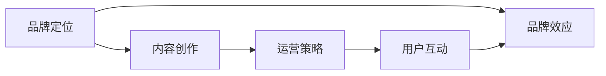

                 

# 知识付费创业中的个人品牌塑造

## 1. 背景介绍

在知识付费快速发展的时代，个人品牌塑造已成为知识创业的核心竞争力。良好的个人品牌不仅能吸引潜在用户，还能在竞争激烈的市场中脱颖而出，实现稳定的收入增长。本文将从品牌定位、内容创作、运营策略、用户互动等方面，系统阐述如何通过知识付费创业塑造强大的个人品牌。

## 2. 核心概念与联系

### 2.1 核心概念概述

- **品牌定位**：明确个人在知识付费领域的专业领域和目标受众，确保内容和风格统一，提升用户认知和信任。
- **内容创作**：个人品牌建立在优质内容之上，需持续输出与专业领域相关的深度文章、视频、课程等，满足用户需求。
- **运营策略**：制定有效的推广和用户增长策略，如SEO优化、社交媒体营销、付费广告等，扩大品牌影响力。
- **用户互动**：与用户建立良好互动，收集反馈，不断优化内容和互动方式，增强用户粘性。

- **品牌效应**：通过上述各环节的优化，个人品牌能产生聚集效应，带来稳定流量和收入。

### 2.2 核心概念原理和架构的 Mermaid 流程图



这个流程图展示了个人品牌塑造的循环过程：从品牌定位开始，通过内容创作提升品牌价值，利用运营策略扩大影响力，通过用户互动进一步增强品牌效应。

## 3. 核心算法原理 & 具体操作步骤

### 3.1 算法原理概述

个人品牌塑造遵循正反馈的算法原理。即品牌定位明确后，优质的内容创作吸引用户，用户互动增强品牌效应，运营策略进一步扩大品牌影响力，从而形成良性循环，不断提升品牌价值。

### 3.2 算法步骤详解

1. **品牌定位**：
   - 识别自己的专业领域，如编程、教育、心理等。
   - 确定目标受众，如初、中、高级开发者，家长，职场人士等。
   - 调研市场和竞品，定位自己的差异化优势。

2. **内容创作**：
   - 制定内容日历，定期发布高质量文章、视频、课程等。
   - 突出专业性和实用性，提供有价值的解决方案。
   - 运用多媒体元素，如图表、代码示例、案例分析等，增强内容吸引力。

3. **运营策略**：
   - 通过SEO优化，提高内容在搜索引擎中的排名。
   - 利用社交媒体，如微博、微信、B站等，进行内容传播和互动。
   - 投放精准广告，如百度、头条等平台的定向广告。

4. **用户互动**：
   - 建立社群，如QQ群、微信群、B站专栏等，进行知识分享和交流。
   - 定期举办问答、直播、讲座等活动，增强用户参与感。
   - 收集用户反馈，优化内容和互动方式。

### 3.3 算法优缺点

**优点**：
- **可扩展性强**：通过持续的内容创作和互动，个人品牌能够不断扩大影响力。
- **资源投入小**：相比传统媒体广告，个人品牌塑造成本较低。
- **高用户粘性**：通过深度内容和互动，用户粘性较高，能够带来稳定流量和收入。

**缺点**：
- **前期投入大**：优质内容创作和品牌推广需要较长时间和资金投入。
- **市场竞争激烈**：个人品牌塑造需要较强的市场敏感度和创新能力。
- **用户期望高**：用户对内容质量和互动体验有较高要求，品牌运营压力较大。

### 3.4 算法应用领域

个人品牌塑造广泛应用于知识付费、在线教育、内容营销等领域，帮助创业者通过知识输出建立专业形象，提升市场竞争力。

## 4. 数学模型和公式 & 详细讲解 & 举例说明

### 4.1 数学模型构建

品牌价值$V$可以表示为内容质量$C$、运营效率$E$、用户互动$I$的函数：

$$ V = f(C, E, I) $$

其中，内容质量$C$表示输出的内容深度、实用性和创新性；运营效率$E$表示品牌推广和用户获取的效率；用户互动$I$表示用户参与和反馈的质量。

### 4.2 公式推导过程

假设品牌价值$V$由以下三个部分组成：

$$ V = C \times E \times I $$

- **内容质量$C$**：
  $$ C = \frac{1}{\sigma} \sum_{i=1}^n \omega_i f_i(x_i) $$
  其中，$f_i(x_i)$为第$i$个内容的评分，$\omega_i$为权重，$\sigma$为标准化因子。

- **运营效率$E$**：
  $$ E = \eta_1 \times \eta_2 \times \eta_3 $$
  其中，$\eta_1$为广告投入，$\eta_2$为社交媒体影响力，$\eta_3$为SEO优化效果。

- **用户互动$I$**：
  $$ I = \lambda_1 \times \lambda_2 \times \lambda_3 $$
  其中，$\lambda_1$为用户参与度，$\lambda_2$为社群活跃度，$\lambda_3$为反馈优化度。

### 4.3 案例分析与讲解

以编程领域某知名博主为例，其品牌价值提升过程如下：

- **内容质量**：定期发布深度技术文章、编程视频、代码示例等，评分$f_i$通过专家和用户打分获得。
- **运营效率**：在博客、B站、微信等平台投放广告，通过SEO优化提升搜索引擎排名，社交媒体影响力通过活跃互动和分享获得。
- **用户互动**：建立编程社群，定期举办技术问答、编程比赛等活动，反馈通过用户评论和邮件收集。

通过上述计算，博主的品牌价值不断提升，用户粘性和收益持续增长。

## 5. 项目实践：代码实例和详细解释说明

### 5.1 开发环境搭建

1. **选择平台**：确定内容发布平台，如Medium、知乎、B站等。
2. **工具配置**：配置GitHub、GitLab等版本控制工具，进行内容版本管理。
3. **社交媒体**：注册并认证各大社交媒体账号，如微博、微信、YouTube等。

### 5.2 源代码详细实现

以某在线教育平台的博主为例，展示如何用Python和Markdown编写技术文章：

```python
# blog_content.py

import markdown

class BlogPost:
    def __init__(self, title, content):
        self.title = title
        self.content = markdown.markdown(content)

    def publish(self):
        print(f"Title: {self.title}")
        print(f"Content: {self.content}")

# 编写博客内容
post = BlogPost(
    "Python高级编程技巧", 
    """
    ...
    ...
    """
)

# 发布博客
post.publish()
```

### 5.3 代码解读与分析

1. **类设计**：使用类封装博客内容，支持标题和内容设置，并提供了发布功能。
2. **Markdown处理**：使用Markdown处理博客内容，支持格式化、代码块等语法。
3. **发布功能**：通过简单打印输出博客信息，模拟发布过程。

### 5.4 运行结果展示

```
Title: Python高级编程技巧
Content: 博客内容
```

## 6. 实际应用场景

### 6.1 在线教育

在线教育领域，通过个人品牌塑造，教师可以提升知名度，吸引更多学生，实现稳定的收入和成长。例如，通过在线课程、直播授课、书籍出版等形式，将自身专业知识输出给用户，建立品牌影响力。

### 6.2 内容营销

内容营销中，个人品牌是核心。通过深度内容吸引用户关注，并通过运营策略扩大品牌影响力，如通过SEO优化提升搜索排名，通过社交媒体推广内容，吸引更多流量和互动。

### 6.3 职业咨询

职业咨询领域，专家通过塑造个人品牌，提供深度咨询服务，建立行业口碑，吸引更多客户。例如，通过博客、视频、直播等形式，分享职业规划、面试技巧等专业内容，增强用户信任。

### 6.4 未来应用展望

未来，个人品牌塑造将更加多元化和个性化，结合大数据分析、人工智能等技术，更精准地定位目标受众，提供更个性化的内容和服务。同时，通过持续学习和创新，不断提升品牌价值，增强市场竞争力。

## 7. 工具和资源推荐

### 7.1 学习资源推荐

1. **《内容营销圣经》**：掌握内容创作和品牌推广的全面策略。
2. **《社交媒体营销入门》**：了解社交媒体营销的原理和实践。
3. **《数据分析基础》**：掌握数据分析方法，提升内容营销效果。
4. **在线课程平台**：如Coursera、Udemy、edX等，系统学习内容创作和运营策略。

### 7.2 开发工具推荐

1. **Markdown编辑器**：如Typora、Atom等，支持快速编写和发布博客内容。
2. **Git版本控制**：如GitHub、GitLab等，进行版本管理和协作开发。
3. **社交媒体管理工具**：如Hootsuite、Buffer等，自动化发布和管理内容。
4. **SEO优化工具**：如Google Analytics、SEMrush等，提升内容搜索引擎排名。

### 7.3 相关论文推荐

1. **《内容营销的理论与实践》**：了解内容营销的理论基础和实践方法。
2. **《社交媒体的传播效果研究》**：掌握社交媒体营销的效果评估和优化。
3. **《大数据在品牌塑造中的应用》**：了解大数据技术在品牌分析中的应用。

## 8. 总结：未来发展趋势与挑战

### 8.1 研究成果总结

本文系统介绍了知识付费创业中个人品牌塑造的理论和方法，从品牌定位、内容创作、运营策略、用户互动等方面，提出了具体的实践建议。通过实例分析，展示了品牌价值提升的过程和效果。

### 8.2 未来发展趋势

未来，个人品牌塑造将更加依赖于大数据分析和人工智能技术，实现更精准的目标受众定位和个性化内容输出。同时，结合多平台运营策略，提升品牌影响力和用户粘性。

### 8.3 面临的挑战

1. **内容创作**：需持续输出高质量内容，满足用户需求。
2. **品牌推广**：需优化运营策略，提升用户获取效率。
3. **用户互动**：需增强互动体验，提升用户粘性。

### 8.4 研究展望

结合大数据分析和人工智能技术，进一步优化品牌塑造过程。同时，探索更多元化的品牌推广渠道，提升品牌价值。

## 9. 附录：常见问题与解答

**Q1: 如何确定个人品牌定位？**

A: 通过市场调研和竞品分析，明确自己的专业领域和目标受众。同时，需要具备较强的市场敏感度和创新能力。

**Q2: 如何提升内容质量？**

A: 通过持续学习和创新，不断输出有深度、实用性的内容。同时，引入多媒体元素，增强内容的吸引力。

**Q3: 如何提升运营效率？**

A: 通过SEO优化、社交媒体推广和精准广告投放，提升内容曝光和用户获取效率。

**Q4: 如何增强用户互动？**

A: 建立社群，定期举办活动，增强用户参与感。同时，收集用户反馈，不断优化内容和互动方式。

**Q5: 如何评估品牌价值？**

A: 通过数据分析和用户反馈，评估内容质量、运营效率和用户互动的效果，不断优化品牌塑造过程。

---

作者：禅与计算机程序设计艺术 / Zen and the Art of Computer Programming

