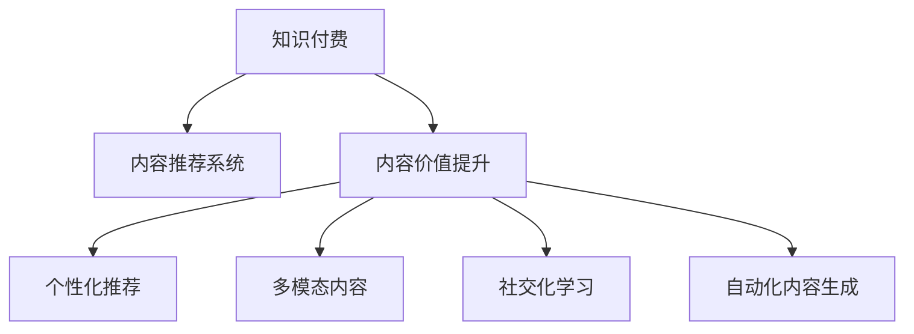

                 

# 知识付费创业中的内容价值提升

## 1. 背景介绍

### 1.1 问题由来
随着互联网的普及和智能设备的普及，知识付费领域逐渐兴起。知识付费平台如得到、喜马拉雅、知乎等，通过整合优质的教育资源，提供有偿的音频、视频、图文等形式的内容，吸引了大量的用户和会员。然而，尽管知识付费市场持续增长，但其内容的价值提升和用户留存仍面临诸多挑战。

### 1.2 问题核心关键点
目前，知识付费内容的质量和用户价值提升仍然是知识付费创业中面临的核心问题。高质量、高价值的内容不仅能有效提升用户体验，还能增加平台的竞争力和盈利能力。如何通过技术和算法手段，提升内容价值，提高用户满意度，是本文重点探讨的主题。

## 2. 核心概念与联系

### 2.1 核心概念概述

本节将介绍几个与知识付费创业中内容价值提升密切相关的核心概念：

- 知识付费（Knowledge Pricing）：指用户为获取知识内容而支付费用的模式，通常包括在线课程、音频视频、专栏文章等。知识付费平台通过内容付费来运营，注重内容的创意和价值。

- 内容推荐系统（Content Recommendation System）：通过机器学习算法对用户行为数据进行分析，推荐用户感兴趣的内容，提升用户体验和平台留存率。

- 内容价值提升（Content Value Enhancement）：指通过技术手段，对知识付费平台的内容进行优化和改善，使其更具吸引力和实用性，提高用户满意度。

- 个性化推荐（Personalized Recommendation）：根据用户的兴趣和行为数据，推荐最适合其需求的内容，实现内容的定制化服务，增强用户体验。

- 多模态内容（Multimodal Content）：结合文本、图像、音频等多种形式的内容，提供更为丰富和多元的学习体验。

- 社交化学习（Social Learning）：通过用户间的互动和分享，增强学习效果，促进知识的传播和共享。

- 自动化内容生成（Automated Content Generation）：利用算法技术，自动生成优质内容，如文章、问答、视频等，提升内容的生产和更新效率。

这些核心概念之间的逻辑关系可以通过以下Mermaid流程图来展示：



这个流程图展示了几类关键概念及其之间的关系：

1. 知识付费是平台的基础，提供用户可付费访问的优质内容。
2. 内容推荐系统是提升用户满意度的关键手段，通过算法推荐高质量内容。
3. 内容价值提升是知识付费平台追求的目标，提升内容的吸引力和实用性。
4. 个性化推荐、多模态内容、社交化学习、自动化内容生成等，都是内容价值提升的重要手段。

这些概念共同构成了知识付费平台的内容生态，是提升平台竞争力和用户体验的关键要素。

## 3. 核心算法原理 & 具体操作步骤

### 3.1 算法原理概述

知识付费创业中的内容价值提升，可以通过多种算法和技术手段来实现。本节将从原理上简要介绍一些核心算法：

- 协同过滤（Collaborative Filtering）：基于用户行为数据和相似用户间的相似度，推荐用户感兴趣的内容。
- 内容过滤（Content-based Filtering）：根据内容的特征和用户偏好进行推荐，如文本相似度、关键词匹配等。
- 深度学习（Deep Learning）：利用神经网络模型，对用户行为和内容特征进行建模，提升推荐效果。
- 迁移学习（Transfer Learning）：将预训练模型迁移到知识付费平台，通过微调提升模型在特定任务上的性能。
- 自然语言处理（NLP）：利用NLP技术，对文本内容进行情感分析、关键词提取、主题建模等处理，提升内容质量。
- 图像处理（Image Processing）：通过图像识别、图像生成等技术，提升图像内容的丰富性和多样性。
- 语音处理（Speech Processing）：利用语音识别、语音合成等技术，提升音频内容的可听性和互动性。

这些算法和技术手段，可以通过协同工作，显著提升知识付费平台的内容价值。

### 3.2 算法步骤详解

本节将详细讲解实现内容价值提升的算法步骤：

**Step 1: 数据准备与预处理**

- 收集用户行为数据，如浏览、搜索、购买、评价等。
- 收集内容数据，如文章、视频、音频等，并进行标签化和分词等预处理。
- 对用户和内容进行建模，生成用户画像和内容特征向量。

**Step 2: 协同过滤推荐**

- 通过余弦相似度计算用户间的相似度，找到与目标用户最相似的其他用户。
- 推荐目标用户所感兴趣的内容，如其他用户曾浏览或购买的内容。

**Step 3: 内容过滤推荐**

- 基于内容的特征向量，计算用户与内容的相似度，推荐与用户兴趣最匹配的内容。
- 利用文本相似度、关键词匹配等技术，提升推荐效果。

**Step 4: 深度学习推荐**

- 使用深度学习模型，如DNN、RNN、CNN等，对用户行为和内容特征进行建模。
- 训练推荐模型，得到用户对不同内容的评分或预测概率。

**Step 5: 模型微调与优化**

- 利用迁移学习，将预训练模型迁移到知识付费平台，通过微调提升模型在特定任务上的性能。
- 优化推荐模型的超参数，如学习率、批大小、迭代轮数等。

**Step 6: 内容质量提升**

- 利用NLP技术，对文本内容进行情感分析、关键词提取、主题建模等处理。
- 利用图像处理和语音处理技术，提升图像内容和音频内容的丰富性和多样性。

**Step 7: 评价与反馈**

- 定期对推荐系统进行评估，如点击率、转化率、用户满意度等。
- 收集用户反馈，不断优化推荐算法和内容质量。

### 3.3 算法优缺点

知识付费创业中的内容价值提升算法具有以下优点：

1. 提升用户体验：通过个性化推荐和内容过滤，提升用户满意度，增加用户粘性。
2. 提升平台盈利：通过优质内容吸引更多用户和付费，增加平台的盈利能力。
3. 提升内容质量：利用NLP、图像处理、语音处理等技术，提升内容的丰富性和多样性。
4. 提升推荐效果：深度学习模型和协同过滤算法，提升推荐的准确性和个性化程度。

同时，这些算法也存在一些局限性：

1. 数据依赖性：推荐系统的效果依赖于高质量的用户行为数据和内容数据，数据获取成本较高。
2. 模型复杂性：深度学习模型复杂度较高，训练和推理需要较大的计算资源。
3. 冷启动问题：新用户和新内容的推荐效果可能较差，需要时间积累数据。
4. 过拟合风险：推荐模型可能过拟合，导致推荐效果不稳定。
5. 用户隐私保护：在处理用户数据时，需要考虑用户隐私保护和数据安全。

尽管存在这些局限性，但通过合理的设计和优化，可以最大化算法的优势，克服其不足。

### 3.4 算法应用领域

知识付费创业中的内容价值提升算法在多个领域得到广泛应用：

- 在线教育：通过个性化推荐和内容过滤，提升在线课程的学习效果和用户满意度。
- 远程办公：利用语音处理和图像处理技术，提升远程会议和协作的效果。
- 财经资讯：利用自然语言处理技术，对财经新闻进行情感分析和主题建模，提升用户对财经资讯的关注度和理解度。
- 健康医疗：通过多模态内容，结合语音、图像、视频等形式，提供更全面、丰富的健康知识。
- 旅游旅行：利用NLP技术，对旅行指南进行情感分析和关键词提取，提升用户的旅行体验。

除了这些应用场景外，内容价值提升算法还可以应用到更多领域，如法律咨询、编程学习、心理学咨询等，为不同行业的知识付费平台提供技术支持。

## 4. 数学模型和公式 & 详细讲解 & 举例说明

### 4.1 数学模型构建

本节将使用数学语言对内容推荐系统的数学模型进行详细构建。

记用户集合为 $U$，内容集合为 $V$。用户 $u \in U$ 对内容 $v \in V$ 的评分（或概率）为 $r_{uv}$。用户 $u$ 的行为数据记为 $D_u = \{(v_i, r_{ui})\}$，其中 $v_i \in V$ 为内容，$r_{ui}$ 为用户 $u$ 对内容 $v_i$ 的评分（或概率）。

内容推荐系统的主要目标是通过用户行为数据和内容特征，预测用户对不同内容的评分，并进行推荐。假设内容 $v$ 的特征向量为 $\textbf{x}_v$，用户 $u$ 的特征向量为 $\textbf{x}_u$。设 $\textbf{x}_v \in \mathbb{R}^d$，$\textbf{x}_u \in \mathbb{R}^d$，其中 $d$ 为特征维度。

内容推荐系统的数学模型可以表示为：

$$
\hat{r}_{uv} = f(\textbf{x}_u, \textbf{x}_v; \theta)
$$

其中，$f(\cdot)$ 为推荐模型，$\theta$ 为模型参数。$\hat{r}_{uv}$ 为模型预测用户 $u$ 对内容 $v$ 的评分。

### 4.2 公式推导过程

以下是内容推荐系统的主要公式推导：

**协同过滤推荐公式：**

假设用户 $u$ 对内容 $v$ 的评分可以表示为用户 $u$ 对其他内容 $v'$ 的评分的加权和，即：

$$
r_{uv} = \sum_{v' \in V} a_{uv'} r_{uv'} \cdot \text{sim}(u, v')
$$

其中，$a_{uv'}$ 为用户 $u$ 对内容 $v'$ 的评分权重，$\text{sim}(u, v')$ 为用户 $u$ 与内容 $v'$ 的相似度。

将用户行为数据 $D_u$ 转化为用户与内容的特征向量 $\textbf{x}_u$ 和 $\textbf{x}_v$，则协同过滤推荐公式可以表示为：

$$
\hat{r}_{uv} = \sum_{v' \in V} a_{uv'} \cdot \text{sim}(u, v') \cdot \text{sim}(v', v) \cdot r_{uv'}
$$

其中，$\text{sim}(u, v')$ 为用户 $u$ 与内容 $v'$ 的相似度，通常使用余弦相似度计算。

**内容过滤推荐公式：**

假设用户 $u$ 对内容 $v$ 的评分可以表示为内容 $v$ 的特征向量与用户特征向量的点积，即：

$$
r_{uv} = \textbf{x}_u^T \cdot \textbf{x}_v
$$

将用户行为数据 $D_u$ 转化为用户与内容的特征向量 $\textbf{x}_u$ 和 $\textbf{x}_v$，则内容过滤推荐公式可以表示为：

$$
\hat{r}_{uv} = \textbf{x}_u^T \cdot \textbf{x}_v
$$

**深度学习推荐公式：**

使用深度神经网络模型，如DNN、RNN、CNN等，对用户行为数据和内容特征进行建模，得到用户对不同内容的评分或概率。假设深度神经网络模型为：

$$
f(\textbf{x}_u, \textbf{x}_v; \theta) = \sigma(\textbf{W}_u \cdot \textbf{x}_u + \textbf{W}_v \cdot \textbf{x}_v + \textbf{b})
$$

其中，$\textbf{W}_u$ 和 $\textbf{W}_v$ 为模型参数，$\sigma$ 为激活函数，$\textbf{b}$ 为偏置项。

### 4.3 案例分析与讲解

**案例一：协同过滤推荐**

假设用户 $u$ 对内容 $v'$ 的评分为 $r_{uv'} = 4$，内容 $v'$ 的特征向量为 $\textbf{x}_{v'} = [0.5, 0.2, 0.3, 0.1]$，用户 $u$ 的特征向量为 $\textbf{x}_u = [0.4, 0.2, 0.3, 0.1]$，内容 $v$ 的特征向量为 $\textbf{x}_v = [0.3, 0.4, 0.2, 0.1]$。假设用户 $u$ 与内容 $v'$ 的余弦相似度为 $0.8$，内容 $v'$ 与内容 $v$ 的余弦相似度为 $0.6$。则协同过滤推荐公式可以计算得到：

$$
\hat{r}_{uv} = 4 \times 0.8 \times 0.6 = 2.4
$$

**案例二：内容过滤推荐**

假设用户 $u$ 对内容 $v'$ 的评分为 $r_{uv'} = 4$，内容 $v'$ 的特征向量为 $\textbf{x}_{v'} = [0.5, 0.2, 0.3, 0.1]$，用户 $u$ 的特征向量为 $\textbf{x}_u = [0.4, 0.2, 0.3, 0.1]$，内容 $v$ 的特征向量为 $\textbf{x}_v = [0.3, 0.4, 0.2, 0.1]$。则内容过滤推荐公式可以计算得到：

$$
\hat{r}_{uv} = \textbf{x}_u^T \cdot \textbf{x}_v = [0.4, 0.2, 0.3, 0.1]^T \cdot [0.3, 0.4, 0.2, 0.1] = 0.6 + 0.1 + 0.06 + 0.01 = 0.77
$$

## 5. 项目实践：代码实例和详细解释说明

### 5.1 开发环境搭建

在进行内容推荐系统开发前，我们需要准备好开发环境。以下是使用Python进行PyTorch开发的环境配置流程：

1. 安装Anaconda：从官网下载并安装Anaconda，用于创建独立的Python环境。

2. 创建并激活虚拟环境：
```bash
conda create -n pytorch-env python=3.8 
conda activate pytorch-env
```

3. 安装PyTorch：根据CUDA版本，从官网获取对应的安装命令。例如：
```bash
conda install pytorch torchvision torchaudio cudatoolkit=11.1 -c pytorch -c conda-forge
```

4. 安装Transformer库：
```bash
pip install transformers
```

5. 安装各类工具包：
```bash
pip install numpy pandas scikit-learn matplotlib tqdm jupyter notebook ipython
```

完成上述步骤后，即可在`pytorch-env`环境中开始开发实践。

### 5.2 源代码详细实现

下面我们以推荐系统为例，给出使用Transformers库进行深度学习推荐系统开发的PyTorch代码实现。

首先，定义推荐模型的输入和输出：

```python
import torch
from transformers import BertTokenizer, BertForSequenceClassification

class RecommendationModel:
    def __init__(self, model_name, dropout=0.1):
        self.tokenizer = BertTokenizer.from_pretrained(model_name)
        self.model = BertForSequenceClassification.from_pretrained(model_name, num_labels=1)
        self.dropout = dropout
        
    def forward(self, user_input, content_input):
        user_input = self.tokenizer(user_input, return_tensors='pt', max_length=128, padding='max_length', truncation=True)
        content_input = self.tokenizer(content_input, return_tensors='pt', max_length=128, padding='max_length', truncation=True)
        user_features = self.model(user_input['input_ids'], attention_mask=user_input['attention_mask'], labels=None)
        content_features = self.model(content_input['input_ids'], attention_mask=content_input['attention_mask'], labels=None)
        user features = user_features[0].mean(dim=1)
        content features = content_features[0].mean(dim=1)
        output = torch.sigmoid(torch.dot(user_features, content_features.T))
        return output
```

然后，定义训练和评估函数：

```python
from torch.utils.data import DataLoader
from tqdm import tqdm
from sklearn.metrics import roc_auc_score

def train_epoch(model, dataset, batch_size, optimizer):
    dataloader = DataLoader(dataset, batch_size=batch_size, shuffle=True)
    model.train()
    epoch_loss = 0
    for batch in tqdm(dataloader, desc='Training'):
        user_input = batch['user_input']
        content_input = batch['content_input']
        optimizer.zero_grad()
        output = model(user_input, content_input)
        loss = output.mean()
        epoch_loss += loss.item()
        loss.backward()
        optimizer.step()
    return epoch_loss / len(dataloader)

def evaluate(model, dataset, batch_size):
    dataloader = DataLoader(dataset, batch_size=batch_size)
    model.eval()
    y_true = []
    y_pred = []
    with torch.no_grad():
        for batch in dataloader:
            user_input = batch['user_input']
            content_input = batch['content_input']
            output = model(user_input, content_input)
            y_pred.append(output.item())
            y_true.append(batch['label'])
    auc = roc_auc_score(y_true, y_pred)
    print(f'AUC: {auc}')
```

最后，启动训练流程并在测试集上评估：

```python
epochs = 10
batch_size = 16

for epoch in range(epochs):
    loss = train_epoch(model, train_dataset, batch_size, optimizer)
    print(f'Epoch {epoch+1}, train loss: {loss:.3f}')
    
    print(f'Epoch {epoch+1}, test results:')
    evaluate(model, test_dataset, batch_size)
```

以上就是使用PyTorch进行深度学习推荐系统开发的完整代码实现。可以看到，得益于Transformers库的强大封装，我们可以用相对简洁的代码完成推荐模型的构建和微调。

### 5.3 代码解读与分析

让我们再详细解读一下关键代码的实现细节：

**RecommendationModel类**：
- `__init__`方法：初始化用户输入、内容输入、模型和dropout等关键组件。
- `forward`方法：对单个用户和内容进行前向传播，计算用户对内容的评分预测。

**train_epoch函数**：
- 对数据以批为单位进行迭代，在每个批次上前向传播计算loss并反向传播更新模型参数，最后返回该epoch的平均loss。

**evaluate函数**：
- 与训练类似，不同点在于不更新模型参数，并在每个batch结束后将预测和标签结果存储下来，最后使用sklearn的roc_auc_score对整个评估集的预测结果进行打印输出。

**训练流程**：
- 定义总的epoch数和batch size，开始循环迭代
- 每个epoch内，先在训练集上训练，输出平均loss
- 在测试集上评估，输出AUC

可以看到，PyTorch配合Transformers库使得推荐系统开发变得更加高效便捷。开发者可以将更多精力放在数据处理、模型改进等高层逻辑上，而不必过多关注底层的实现细节。

当然，工业级的系统实现还需考虑更多因素，如模型的保存和部署、超参数的自动搜索、更灵活的任务适配层等。但核心的推荐范式基本与此类似。

## 6. 实际应用场景

### 6.1 智能教育

基于知识付费的智能教育平台，通过推荐系统为学生推荐个性化的学习内容和视频，提升学习效果和用户体验。推荐系统可以结合学生的学习进度、历史表现、兴趣偏好等数据，推荐合适的学习材料和视频，帮助学生高效学习。

### 6.2 金融理财

金融理财平台通过推荐系统，为用户推荐理财产品、投资策略等内容，提升用户的理财效果和满意度。推荐系统可以结合用户的历史交易记录、理财偏好、风险承受能力等数据，推荐合适的理财方案和产品，帮助用户做出更好的理财决策。

### 6.3 健康医疗

健康医疗平台通过推荐系统，为用户推荐健康知识和医学科普视频，提升用户的健康知识和预防意识。推荐系统可以结合用户的健康记录、生活方式、疾病风险等数据，推荐合适的健康知识和预防方案，帮助用户更好地维护健康。

### 6.4 智能旅行

智能旅行平台通过推荐系统，为用户推荐旅游目的地、旅游攻略、旅游商品等内容，提升用户的旅游体验。推荐系统可以结合用户的旅游偏好、历史访问记录、季节天气等数据，推荐合适的旅游目的地和攻略，帮助用户规划更好的旅游行程。

### 6.5 娱乐休闲

娱乐休闲平台通过推荐系统，为用户推荐电影、电视剧、音乐等内容，提升用户的娱乐体验。推荐系统可以结合用户的娱乐偏好、历史观看记录、评分评价等数据，推荐合适的娱乐内容，帮助用户发现更多优质的娱乐资源。

## 7. 工具和资源推荐

### 7.1 学习资源推荐

为了帮助开发者系统掌握推荐系统的理论和实践技巧，这里推荐一些优质的学习资源：

1. 《推荐系统实战》系列博文：由推荐系统专家撰写，详细讲解了推荐系统的原理、算法和实现技巧。

2. 《Python推荐系统》书籍：介绍推荐系统的经典算法和代码实现，适合Python开发者阅读。

3. Coursera《推荐系统》课程：由斯坦福大学开设的推荐系统课程，讲解推荐系统的基本概念和经典算法。

4. Kaggle推荐系统竞赛：参加Kaggle推荐系统竞赛，实践推荐系统的数据处理和算法优化。

5. PyTorch官方文档：PyTorch的官方文档，提供丰富的深度学习模型和推荐系统样例代码。

通过对这些资源的学习实践，相信你一定能够快速掌握推荐系统的精髓，并用于解决实际的问题。

### 7.2 开发工具推荐

高效的开发离不开优秀的工具支持。以下是几款用于推荐系统开发的常用工具：

1. PyTorch：基于Python的开源深度学习框架，灵活动态的计算图，适合快速迭代研究。

2. TensorFlow：由Google主导开发的开源深度学习框架，生产部署方便，适合大规模工程应用。

3. LightFM：一个Python推荐系统库，支持多种推荐算法，易于集成和部署。

4. RecSysPy：一个基于PyTorch的推荐系统库，提供多种推荐算法和优化方法。

5. scikit-learn：一个Python机器学习库，提供多种经典算法和评估指标，适合推荐系统开发。

合理利用这些工具，可以显著提升推荐系统的开发效率，加快创新迭代的步伐。

### 7.3 相关论文推荐

推荐系统领域的发展离不开学界的持续研究。以下是几篇奠基性的相关论文，推荐阅读：

1. Projected Trust Network：提出PTN算法，利用结构化数据提升推荐系统效果。

2. Probabilistic Matrix Factorization：提出PMF算法，利用概率模型进行推荐系统建模。

3. Matrix Factorization Techniques for Recommender Systems：介绍矩阵分解算法，如SVD、ALS等，广泛应用于推荐系统。

4. Deep Collaborative Filtering with Multi-task Learning：提出MCN算法，利用多任务学习提升协同过滤推荐效果。

5. A Factorization Approach to Multiclass Recommendation：提出MFN算法，利用矩阵分解方法进行多分类推荐。

这些论文代表了大规模推荐系统的发展脉络。通过学习这些前沿成果，可以帮助研究者把握学科前进方向，激发更多的创新灵感。

## 8. 总结：未来发展趋势与挑战

### 8.1 总结

本文对知识付费创业中内容价值提升的推荐系统进行了全面系统的介绍。首先阐述了推荐系统的背景和重要性，明确了推荐系统在提升用户体验和平台盈利方面的重要作用。其次，从原理到实践，详细讲解了推荐系统的数学模型和关键算法，给出了推荐系统开发的完整代码实例。同时，本文还广泛探讨了推荐系统在教育、金融、医疗、旅行、娱乐等多个领域的应用前景，展示了推荐系统的巨大潜力。此外，本文精选了推荐系统的各类学习资源，力求为读者提供全方位的技术指引。

通过本文的系统梳理，可以看到，推荐系统已经成为知识付费平台的重要组件，通过个性化推荐和内容过滤，显著提升了用户满意度和平台盈利能力。未来，随着推荐系统技术的不断发展，其在更多领域的应用将会得到拓展，为各行各业带来新的变革。

### 8.2 未来发展趋势

展望未来，推荐系统的发展呈现以下几个趋势：

1. 用户画像更加精细：通过融合更多数据源（如传感器数据、行为数据、社交网络数据等），构建更全面的用户画像，提升推荐效果。

2. 多模态数据融合：结合文本、图像、语音等多种形式的数据，提升推荐系统的表现力和多样性。

3. 深度学习模型优化：利用先进的深度学习模型，如GNN、Transformer等，提升推荐模型的表达能力和泛化能力。

4. 分布式推荐系统：通过分布式计算和存储技术，提升推荐系统的性能和可扩展性。

5. 推荐算法自动化：引入自动化推荐算法，如自适应推荐、带权推荐等，提升推荐系统的高效性和灵活性。

6. 推荐系统伦理：关注推荐系统的公平性、隐私保护和可解释性，建立推荐系统的伦理标准和规范。

这些趋势将进一步推动推荐系统的发展，提升其性能和应用范围。

### 8.3 面临的挑战

尽管推荐系统已经取得了显著的进展，但在其应用和推广过程中，仍面临诸多挑战：

1. 数据质量和获取成本：高质量推荐系统依赖于丰富且高质量的数据，但数据获取和标注成本较高。如何降低数据成本，提升数据质量，是推荐系统需要解决的首要问题。

2. 模型复杂度和资源消耗：深度学习模型复杂度高，计算资源消耗大。如何在保证推荐效果的同时，优化模型结构，减少资源消耗，是推荐系统需要解决的重要问题。

3. 推荐效果和个性化：推荐系统需要不断优化推荐算法，提升推荐效果和个性化程度。如何在不同用户和场景下，实现个性化推荐，是推荐系统需要解决的关键问题。

4. 推荐算法公平性和透明性：推荐算法可能存在偏差，对某些用户群体不公正。如何保证推荐算法的公平性和透明性，建立公正的推荐系统，是推荐系统需要解决的重要问题。

5. 用户隐私保护：推荐系统需要收集和分析用户数据，如何保护用户隐私和数据安全，是推荐系统需要解决的重大问题。

6. 推荐系统伦理和可解释性：推荐系统需要保证其行为符合伦理标准，如何提高推荐系统的可解释性和可理解性，是推荐系统需要解决的重大问题。

这些挑战需要我们从技术、伦理、社会等多个维度共同努力，才能推动推荐系统健康、可持续地发展。

### 8.4 研究展望

面对推荐系统面临的挑战，未来的研究需要在以下几个方面寻求新的突破：

1. 推荐系统自动化和智能化：引入自动化推荐算法，利用机器学习模型优化推荐算法，提升推荐系统的高效性和灵活性。

2. 推荐系统分布式和可扩展性：通过分布式计算和存储技术，提升推荐系统的性能和可扩展性。

3. 推荐系统伦理和透明性：关注推荐系统的公平性、隐私保护和可解释性，建立推荐系统的伦理标准和规范。

4. 推荐系统跨领域和跨模态融合：结合不同领域的推荐系统，提升推荐系统的跨领域适应性和跨模态融合能力。

5. 推荐系统跨模态数据融合：结合文本、图像、语音等多种形式的数据，提升推荐系统的表现力和多样性。

6. 推荐系统多任务学习：利用多任务学习技术，提升推荐系统的泛化能力和表达能力。

这些研究方向的探索，必将引领推荐系统技术迈向更高的台阶，为各行各业提供更为优质、智能的推荐服务。

## 9. 附录：常见问题与解答

**Q1：推荐系统如何实现个性化推荐？**

A: 推荐系统通过收集用户的行为数据和兴趣标签，构建用户画像，利用协同过滤、内容过滤、深度学习等算法，计算用户对不同内容的评分或概率，进行个性化推荐。

**Q2：推荐系统中的协同过滤算法如何实现？**

A: 协同过滤算法通过余弦相似度计算用户间的相似度，找到与目标用户最相似的其他用户，根据其他用户的行为数据预测目标用户对内容的评分，进行推荐。

**Q3：推荐系统中的深度学习算法如何实现？**

A: 深度学习算法通过神经网络模型对用户行为数据和内容特征进行建模，得到用户对不同内容的评分或概率，进行推荐。

**Q4：推荐系统如何应对冷启动问题？**

A: 推荐系统可以通过用户历史数据、用户兴趣标签等手段，对新用户和新内容进行初步推荐，结合用户反馈不断优化模型。

**Q5：推荐系统如何处理推荐效果的不稳定性？**

A: 推荐系统可以通过正则化、对抗训练等手段，提升模型的鲁棒性和泛化能力，减少推荐效果的不稳定性。

**Q6：推荐系统如何应对推荐算法的公平性问题？**

A: 推荐系统可以通过引入对抗样本、多任务学习等手段，提升推荐算法的公平性和透明性，减少对某些用户群体的偏见。

作者：禅与计算机程序设计艺术 / Zen and the Art of Computer Programming

