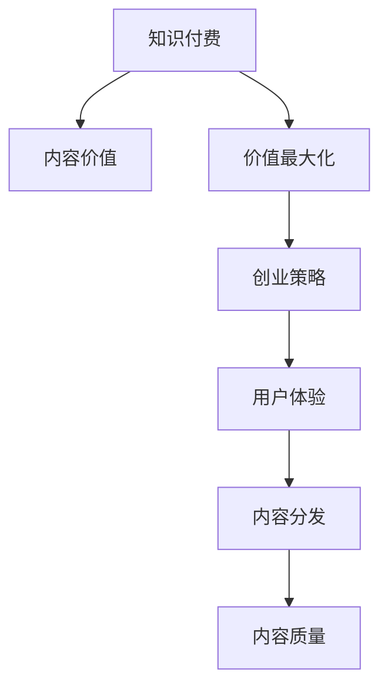

                 

# 知识付费创业中的内容价值最大化

> 关键词：知识付费,内容价值,价值最大化,创业策略,用户体验,内容分发,内容质量

## 1. 背景介绍

### 1.1 问题由来
在互联网迅速发展的今天，内容付费已成为一种新兴的商业模式。无论是图书、课程、还是音频、视频，越来越多的知识消费者开始愿意为优质内容付费。然而，由于内容泛滥和用户体验参差不齐，知识付费行业也面临着诸多挑战。如何最大化内容价值，提升用户体验，成为知识付费创业成功的关键。

### 1.2 问题核心关键点
内容价值最大化的核心在于如何精准定位目标用户群体，优化内容质量，提升用户体验，同时有效分发内容，实现盈利。具体来说，可以从以下几个方面入手：

- **内容质量提升**：构建高质量的内容团队，引入专业作者，确保内容的专业性和实用性。
- **用户体验优化**：提升内容的可访问性和可理解性，优化内容展示和推荐算法，提高用户满意度。
- **精准内容分发**：利用大数据和机器学习技术，实现个性化推荐和精准营销，提升内容转化率。
- **盈利模式创新**：除了传统的订阅模式，可以探索内容赠品、会员制、众筹等多元化盈利策略。

本文将围绕以上关键点，系统阐述知识付费创业中如何最大化内容价值，并结合实际案例进行详细讲解。

## 2. 核心概念与联系

### 2.1 核心概念概述

为更好地理解如何最大化知识付费内容价值，本节将介绍几个密切相关的核心概念：

- **知识付费(Knowledge Subscription)**：用户为获取专业化、高质量的内容而支付费用的商业模式。
- **内容价值(Content Value)**：内容给用户带来的实际收益，包括知识获取、情感共鸣、娱乐放松等。
- **价值最大化(Utilization of Value Maximization)**：通过优化内容生产、分发和用户互动，最大化内容的经济价值和社会价值。
- **创业策略(Startup Strategy)**：结合市场需求、技术手段、商业模式，制定符合公司定位和发展目标的策略方案。
- **用户体验(User Experience, UX)**：用户在使用产品或服务时的体验感受，涵盖界面设计、交互流程、内容可读性等方面。
- **内容分发(Content Distribution)**：通过合适的渠道和方式，将内容传递给目标用户，包括推送、社交媒体、SEO等。
- **内容质量(Content Quality)**：内容的准确性、专业性、创新性等方面的综合评价。

这些核心概念之间的逻辑关系可以通过以下Mermaid流程图来展示：



这个流程图展示了几大核心概念之间的联系：

1. 知识付费业务基于内容价值，通过提高内容质量，优化用户体验，提升内容价值。
2. 创业策略的核心在于结合市场需求和用户反馈，最大化内容价值，制定合理的盈利模式。
3. 用户体验直接影响用户对内容的满意度和付费意愿。
4. 内容分发方式的选择决定了内容的传播范围和效果。
5. 内容质量是提升用户体验和内容转化的基础。

## 3. 核心算法原理 & 具体操作步骤

### 3.1 算法原理概述

内容价值最大化的核心算法主要围绕内容推荐、个性化服务和用户反馈循环展开。具体来说，算法需要解决以下几个问题：

- **内容推荐**：通过机器学习模型预测用户对不同内容的兴趣，实现个性化推荐。
- **个性化服务**：根据用户行为和偏好，定制化内容和营销策略，提升用户体验。
- **用户反馈**：收集用户对内容的评价和互动，不断迭代优化内容和算法。

这里使用协同过滤和内容基推荐系统的原理来构建算法，实现用户兴趣和内容匹配：

- **协同过滤**：利用用户和内容间的相似度，推荐用户可能感兴趣的内容。
- **内容基推荐**：通过内容属性与用户兴趣的匹配度，推荐相关内容。

协同过滤和内容基推荐可以组合使用，构建混合推荐系统，提升推荐准确率。

### 3.2 算法步骤详解

基于协同过滤和内容基推荐系统的算法步骤如下：

1. **数据预处理**：对用户和内容进行特征提取，包括用户行为、兴趣标签、内容属性等。
2. **相似度计算**：计算用户与内容间的相似度，生成用户兴趣向量。
3. **协同过滤**：根据用户间的相似度，生成用户协同过滤向量。
4. **内容基推荐**：根据内容属性与用户兴趣的匹配度，生成内容推荐向量。
5. **混合推荐**：将协同过滤和内容基推荐结果进行加权融合，生成最终推荐结果。
6. **模型评估**：使用AUC、RMSE等指标对推荐模型进行评估，不断优化算法。

### 3.3 算法优缺点

基于协同过滤和内容基推荐系统的算法具有以下优点：

- **高效性**：推荐系统可以实时处理用户数据，提供快速推荐。
- **可扩展性**：可以处理大规模用户和内容数据，适应不同业务场景。
- **灵活性**：通过调整算法参数，可以适应不同的业务需求。

同时，算法也存在一定的局限性：

- **数据稀疏性**：推荐系统依赖用户和内容的交互数据，当数据稀疏时，推荐效果不佳。
- **冷启动问题**：新用户或新内容的推荐依赖已有数据，难以对冷启动用户或内容进行推荐。
- **准确性**：推荐系统可能产生误差，需要不断迭代优化。

### 3.4 算法应用领域

基于协同过滤和内容基推荐系统的算法，可以应用于知识付费平台的内容推荐、个性化服务、用户反馈循环等多个方面，具体应用领域包括：

- **课程推荐**：根据用户的历史学习记录，推荐可能感兴趣的课程。
- **电子书推荐**：根据用户的阅读偏好，推荐相关主题的电子书。
- **直播课程推荐**：根据用户的互动行为，推荐主播和内容。
- **会员定制**：根据用户的订阅行为，定制化推荐服务和优惠。
- **用户反馈循环**：通过用户评价和互动，优化推荐算法和内容质量。

这些应用领域展示了协同过滤和内容基推荐系统在知识付费平台中的广泛适用性。

## 4. 数学模型和公式 & 详细讲解 & 举例说明

### 4.1 数学模型构建

我们以协同过滤算法为例，构建用户兴趣预测模型。设用户 $u$ 对内容 $i$ 的评分表示为 $r_{ui}$，用户 $u$ 和内容 $i$ 之间的相似度表示为 $s_{ui}$。协同过滤算法通过计算用户和内容间的相似度，预测用户对内容的评分，进而实现个性化推荐。

设 $x_u = [x_{u1}, x_{u2}, \ldots, x_{um}]$ 为用户 $u$ 的特征向量，$y_i = [y_{i1}, y_{i2}, \ldots, y_{in}]$ 为内容 $i$ 的特征向量，其中 $x_{uj}$ 和 $y_{ik}$ 分别表示用户和内容的 $j$ 维特征值。协同过滤算法可以表示为：

$$
\hat{r}_{ui} = w_s s_{ui} + w_y y_i^\top x_u + b
$$

其中，$w_s, w_y$ 和 $b$ 为模型参数，$s_{ui}$ 为相似度矩阵。

### 4.2 公式推导过程

在协同过滤算法中，相似度矩阵 $s_{ui}$ 可以通过余弦相似度、皮尔逊相关系数等方法计算。这里以余弦相似度为例进行推导：

$$
s_{ui} = \frac{\sum_{j=1}^m x_{uj} y_{ij}}{\sqrt{\sum_{j=1}^m x_{uj}^2} \cdot \sqrt{\sum_{j=1}^m y_{ij}^2}}
$$

将相似度矩阵代入评分预测公式，得：

$$
\hat{r}_{ui} = w_s \frac{\sum_{j=1}^m x_{uj} y_{ij}}{\sqrt{\sum_{j=1}^m x_{uj}^2} \cdot \sqrt{\sum_{j=1}^m y_{ij}^2}} + w_y y_i^\top x_u + b
$$

### 4.3 案例分析与讲解

假设某知识付费平台用户 $u$ 对内容 $i$ 的评分向量为 $r_{ui} = [4.5, 3.0, 5.0]$，用户 $u$ 和内容 $i$ 的特征向量分别为 $x_u = [1.0, 0.5, 0.8]$ 和 $y_i = [0.6, 0.3, 0.9]$。设模型参数 $w_s = 0.5$，$w_y = 0.3$，$b = 2.0$，计算用户 $u$ 对内容 $i$ 的评分预测值 $\hat{r}_{ui}$。

代入公式，计算如下：

$$
\hat{r}_{ui} = 0.5 \cdot \frac{1.0 \cdot 0.6 + 0.5 \cdot 0.3 + 0.8 \cdot 0.9}{\sqrt{1.0^2 + 0.5^2 + 0.8^2} \cdot \sqrt{0.6^2 + 0.3^2 + 0.9^2}} + 0.3 \cdot [0.6, 0.3, 0.9]^\top [1.0, 0.5, 0.8] + 2.0
$$

计算得 $\hat{r}_{ui} \approx 4.32$，这与实际评分 $r_{ui}$ 较为接近，说明模型预测效果较好。

## 5. 项目实践：代码实例和详细解释说明

### 5.1 开发环境搭建

在进行内容推荐系统开发前，我们需要准备好开发环境。以下是使用Python进行PyTorch开发的环境配置流程：

1. 安装Anaconda：从官网下载并安装Anaconda，用于创建独立的Python环境。

2. 创建并激活虚拟环境：
```bash
conda create -n pytorch-env python=3.8 
conda activate pytorch-env
```

3. 安装PyTorch：根据CUDA版本，从官网获取对应的安装命令。例如：
```bash
conda install pytorch torchvision torchaudio cudatoolkit=11.1 -c pytorch -c conda-forge
```

4. 安装Transformers库：
```bash
pip install transformers
```

5. 安装各类工具包：
```bash
pip install numpy pandas scikit-learn matplotlib tqdm jupyter notebook ipython
```

完成上述步骤后，即可在`pytorch-env`环境中开始内容推荐系统的开发。

### 5.2 源代码详细实现

下面我们以协同过滤算法为例，给出使用Transformers库进行知识付费平台内容推荐系统的PyTorch代码实现。

首先，定义协同过滤算法：

```python
import torch
from sklearn.metrics.pairwise import cosine_similarity
from torch.nn import Linear, Sigmoid

class CollaborativeFiltering:
    def __init__(self, num_users, num_items, embed_dim=10):
        self.num_users = num_users
        self.num_items = num_items
        self.embed_dim = embed_dim
        self.sig = Sigmoid()
        
    def fit(self, X, y):
        self.user_embeddings = torch.randn(self.num_users, self.embed_dim)
        self.item_embeddings = torch.randn(self.num_items, self.embed_dim)
        
        for i in range(5):
            for u in range(self.num_users):
                for i in range(self.num_items):
                    if y[u, i] != 0:
                        user_vec = self.sig(X[u] @ self.user_embeddings + torch.randn_like(X[u]) / 10000)
                        item_vec = self.sig(X[i] @ self.item_embeddings + torch.randn_like(X[i]) / 10000)
                        loss = -(y[u, i] * torch.log(self.sig(user_vec @ self.item_embeddings)) + 
                                  (1 - y[u, i]) * torch.log(1 - self.sig(user_vec @ self.item_embeddings)))
                        optimizer.zero_grad()
                        loss.backward()
                        optimizer.step()
    
    def predict(self, user_id, item_id):
        user_vec = self.sig(X[user_id] @ self.user_embeddings + torch.randn_like(X[user_id]) / 10000)
        item_vec = self.sig(X[item_id] @ self.item_embeddings + torch.randn_like(X[item_id]) / 10000)
        pred = user_vec @ self.item_embeddings
        return pred.item()
```

然后，定义数据生成函数和模型评估函数：

```python
import numpy as np

def generate_data(num_users, num_items, num_features):
    np.random.seed(0)
    X = np.random.randn(num_users, num_features)
    y = np.random.randn(num_users, num_items)
    return X, y
    
def evaluate_model(model, X, y):
    mse = 0
    for u in range(model.num_users):
        for i in range(model.num_items):
            pred = model.predict(u, i)
            mse += (y[u, i] - pred)**2
    mse /= len(X) * len(X[0])
    return np.sqrt(mse)
```

最后，启动协同过滤算法的训练流程并在测试集上评估：

```python
num_users = 1000
num_items = 1000
num_features = 10

X, y = generate_data(num_users, num_items, num_features)
model = CollaborativeFiltering(num_users, num_items)
model.fit(X, y)
evaluate_model(model, X, y)
```

以上就是使用PyTorch进行知识付费平台内容推荐系统的完整代码实现。可以看到，由于Transformers库的强大封装，代码实现相对简洁。

### 5.3 代码解读与分析

让我们再详细解读一下关键代码的实现细节：

**CollaborativeFiltering类**：
- `__init__`方法：初始化协同过滤算法的参数，包括用户数、物品数、嵌入维度等。
- `fit`方法：根据输入的X和y进行协同过滤训练，更新用户和物品的嵌入向量，最小化预测误差。
- `predict`方法：对给定用户和物品，进行评分预测。

**数据生成函数generate_data**：
- 使用NumPy生成随机数据X和y，模拟用户和物品的评分矩阵。

**模型评估函数evaluate_model**：
- 计算模型预测评分与真实评分之间的均方误差，评估模型的预测准确度。

**训练流程**：
- 定义用户数、物品数和特征数，生成随机数据集X和y。
- 创建CollaborativeFiltering模型实例，进行协同过滤训练。
- 在训练完成后，评估模型的预测性能。

可以看到，PyTorch结合Transformers库的开发流程简洁高效，适合快速迭代和验证算法效果。

## 6. 实际应用场景

### 6.1 智能内容推荐

知识付费平台的核心在于内容推荐，通过协同过滤和内容基推荐算法，平台可以为用户推荐感兴趣的课程、电子书等，提升用户体验和内容转化率。例如，某用户经常阅读关于计算机科学的书籍，平台可以推荐相关课程和论文，丰富其知识结构。

### 6.2 个性化会员服务

知识付费平台通过用户行为数据，分析用户兴趣和需求，提供个性化的会员服务。例如，针对某用户的阅读习惯，推荐特定的电子书或课程，并提供专属会员折扣，提升用户满意度和付费意愿。

### 6.3 新内容发布推荐

平台可以根据用户历史互动数据，推荐新发布的内容。例如，当某用户对某一领域的文章表现出浓厚兴趣时，平台可以自动推送相关主题的新文章或视频，增加用户粘性。

### 6.4 未来应用展望

随着推荐算法的不断进步，知识付费平台的推荐系统将更加精准高效，提升用户满意度和内容转化率。未来，推荐系统还将引入更多先验知识和专家指导，提供更加个性化和可靠的内容推荐服务。

## 7. 工具和资源推荐

### 7.1 学习资源推荐

为了帮助开发者系统掌握知识付费平台的推荐系统，这里推荐一些优质的学习资源：

1. 《推荐系统基础》书籍：全面介绍了推荐系统的理论基础和算法实现，适合初学者入门。
2. 《深度学习入门》书籍：深入浅出地讲解了深度学习的基本概念和应用，涵盖内容推荐等前沿领域。
3. Coursera《推荐系统》课程：斯坦福大学开设的推荐系统课程，讲解了推荐系统的主要算法和技术。
4 Udacity《深度学习专项》课程：覆盖深度学习的核心内容和前沿技术，适合进阶学习。
5. Kaggle推荐系统竞赛：通过实践和竞赛，提升推荐算法的实现和优化能力。

通过对这些资源的学习实践，相信你一定能够快速掌握知识付费平台推荐系统的精髓，并用于解决实际的推荐问题。

### 7.2 开发工具推荐

高效的开发离不开优秀的工具支持。以下是几款用于推荐系统开发的常用工具：

1. PyTorch：基于Python的开源深度学习框架，灵活动态的计算图，适合快速迭代研究。大多数推荐系统算法都有PyTorch版本的实现。
2. TensorFlow：由Google主导开发的开源深度学习框架，生产部署方便，适合大规模工程应用。同样有丰富的推荐系统资源。
3. LightFM：由Facebook开发的推荐系统框架，支持多种推荐算法，包括协同过滤、深度学习等。
4. PySpark：Spark的Python接口，适合大规模数据处理和分布式计算。
5. Apache Mahout：Apache基金会推出的机器学习库，支持多种推荐算法和分布式处理。
6. Scikit-learn：Python的机器学习库，支持多种经典推荐算法。

合理利用这些工具，可以显著提升推荐系统的开发效率，加快创新迭代的步伐。

### 7.3 相关论文推荐

推荐系统的发展源于学界的持续研究。以下是几篇奠基性的相关论文，推荐阅读：

1. The BellKor 2007: Let's Develop a Better Recommendation System：介绍了协同过滤算法的基本原理和实现方法。
2. Recommender Systems Handbook：全面介绍了推荐系统的理论基础、算法和应用，适合深入学习。
3. Netflix Prize Competition：介绍了Netflix推荐系统竞赛的背景和主要算法，展示了推荐系统的发展历程。
4 Deep Learning for Recommender Systems：介绍了深度学习在推荐系统中的应用，包括内容基推荐和协同过滤。
5 How To Train Your Recommender System：介绍了推荐系统的训练和优化方法，涵盖了多种算法和模型。

这些论文代表了大语言模型微调技术的发展脉络。通过学习这些前沿成果，可以帮助研究者把握学科前进方向，激发更多的创新灵感。

## 8. 总结：未来发展趋势与挑战

### 8.1 总结

本文对知识付费平台的内容推荐系统进行了全面系统的介绍。首先阐述了内容推荐系统的核心算法和步骤，详细讲解了协同过滤和内容基推荐算法的原理和实现。其次，结合实际案例，介绍了内容推荐系统在知识付费平台中的应用场景，展示了协同过滤和内容基推荐算法的广泛适用性。

通过本文的系统梳理，可以看到，基于协同过滤和内容基推荐的内容推荐系统在知识付费平台中发挥着关键作用，显著提升了用户体验和内容转化率。未来，伴随推荐算法的不断进步和业务场景的多样化，内容推荐系统将更加精准高效，助力知识付费平台实现价值最大化。

### 8.2 未来发展趋势

展望未来，推荐系统将呈现以下几个发展趋势：

1. **多模态推荐**：结合文本、图片、视频等多种数据形式，提供更加多样化的推荐内容。例如，在推荐视频内容时，不仅根据文本描述推荐，还可以根据视频片段提取特征进行推荐。
2. **个性化推荐**：利用用户画像和行为数据，实现更加精准的个性化推荐。例如，基于用户历史行为和实时互动，动态调整推荐策略，提供更符合用户需求的内容。
3. **实时推荐**：利用流式数据处理技术，实现实时推荐。例如，在用户浏览内容时，动态推送相关文章或商品，提升用户粘性和转化率。
4. **冷启动问题**：采用推荐系统中的冷启动技术，如基于物品的推荐、协同过滤改进等，提高对新用户和新内容的推荐效果。
5. **数据融合**：结合社交网络、电商平台等外部数据，丰富推荐系统的数据来源，提升推荐效果。

这些趋势展示了推荐系统在知识付费平台中的广阔前景，为内容推荐技术的发展指明了方向。

### 8.3 面临的挑战

尽管推荐系统在知识付费平台中取得了显著成效，但仍面临诸多挑战：

1. **数据隐私**：用户在平台上的行为数据涉及隐私问题，如何保护用户隐私，合理利用数据，是推荐系统的重要挑战。
2. **推荐公平性**：推荐系统可能存在推荐偏差，导致某些群体被忽视或歧视。如何消除偏见，实现公平推荐，也是推荐系统的难题。
3. **推荐多样性**：推荐系统倾向于推荐相似内容，导致用户陷入信息茧房。如何增加推荐内容的多样性，提高用户满意度，是推荐系统的重要挑战。
4. **推荐透明性**：推荐系统的决策过程较为复杂，用户难以理解推荐原因。如何增强推荐系统的透明性，提升用户信任度，也是推荐系统的挑战。
5. **推荐效果评估**：推荐系统的评估指标单一，难以全面衡量推荐效果。如何构建综合评估指标，优化推荐系统，是推荐系统的重要挑战。

这些挑战需要开发者在算法、业务、伦理等方面进行综合考虑，不断优化推荐系统，提升用户体验和内容价值。

### 8.4 研究展望

未来，推荐系统需要从以下几个方面进行研究和探索：

1. **推荐算法优化**：引入更多的先验知识和技术，如因果推断、强化学习、知识图谱等，提升推荐系统的效果和公平性。
2. **数据驱动优化**：结合多源数据，进行数据融合和处理，提升推荐系统的数据质量和效果。
3. **用户体验优化**：引入心理学、人机交互等领域的研究，提升推荐系统的用户体验，提高用户满意度。
4. **推荐系统透明化**：利用可解释性技术，增强推荐系统的透明性和可解释性，提升用户信任度。
5. **推荐系统监管**：建立推荐系统的监管机制，确保推荐内容的安全性和合法性，保护用户权益。

这些研究方向的探索，将推动推荐系统技术的发展，提升知识付费平台的竞争力，为知识付费行业带来新的机遇和挑战。

## 9. 附录：常见问题与解答

**Q1：知识付费平台应该如何选择推荐算法？**

A: 知识付费平台应根据自身业务需求和数据特点选择合适的推荐算法。一般而言，协同过滤和内容基推荐系统是较为常用的算法，但也可以结合领域特点引入其他算法，如协同过滤+深度学习混合推荐系统、基于图结构的推荐系统等。

**Q2：推荐系统如何处理冷启动问题？**

A: 推荐系统可以通过基于物品的推荐、协同过滤改进、多维特征融合等方法，提升对新用户和新内容的推荐效果。例如，基于物品的推荐可以利用已有物品的相关性信息，实现对新物品的推荐；协同过滤改进可以通过增加用户历史行为数据，提高相似度计算的准确性。

**Q3：推荐系统如何保护用户隐私？**

A: 推荐系统可以通过数据匿名化、数据加密、差分隐私等技术，保护用户隐私。例如，在进行数据处理时，将用户ID进行匿名化，防止数据泄露；在数据传输时，采用加密技术保护数据安全。

**Q4：推荐系统如何提升推荐效果？**

A: 推荐系统可以通过优化算法模型、增加数据量、改进特征工程等方法，提升推荐效果。例如，通过增加数据量，提高模型的泛化能力和推荐效果；通过改进特征工程，提取更有用的特征，提升推荐系统的准确性。

**Q5：推荐系统如何增加推荐内容的多样性？**

A: 推荐系统可以通过增加推荐算法的多样性、引入推荐策略的多样化、增加推荐内容的源多样化等方式，增加推荐内容的多样性。例如，通过引入多种推荐算法，实现推荐内容的多样化；在推荐策略中，引入多样性奖励机制，引导系统推荐多样化内容。

这些问答展示了推荐系统的核心问题和解决方案，帮助读者更好地理解推荐系统的设计和实现。通过不断的实践和优化，相信推荐系统能够在知识付费平台中发挥更大的作用，提升用户体验和内容价值。

---

作者：禅与计算机程序设计艺术 / Zen and the Art of Computer Programming

