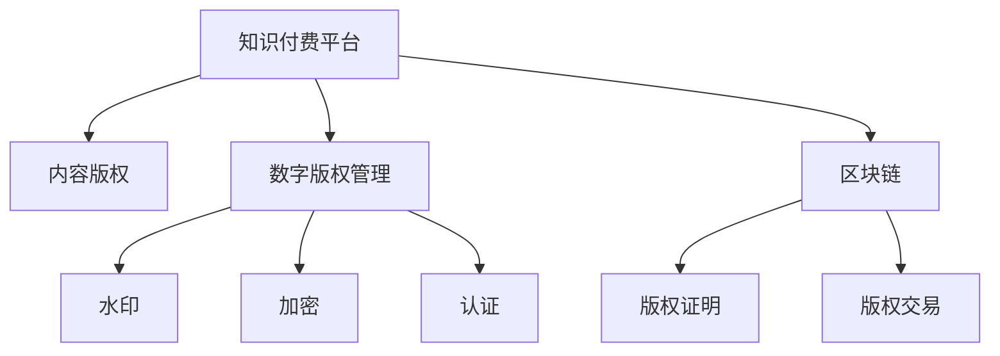

                 

# 知识付费创业中的内容版权保护

## 1. 背景介绍

在知识付费领域，内容版权保护至关重要。随着互联网和数字技术的快速发展，知识付费平台如雨后春笋般涌现，但也面临越来越多的版权纠纷和侵权风险。一旦被侵权，不仅会对平台造成巨大的经济损失，也会严重损害用户的信任，影响平台的长期发展。因此，如何在知识付费创业中建立有效的版权保护机制，是每个平台必须重视的问题。

## 2. 核心概念与联系

### 2.1 核心概念概述

- **知识付费**：指用户通过付费获取知识或信息的过程。内容提供商提供有价值的信息，用户通过订阅或购买支付费用，实现知识的快速获取。

- **内容版权**：指对作品进行法律保护的权益，包括著作权、商标权、专利权等。保护内容创作者的经济利益和声誉。

- **版权侵权**：指未经授权使用他人版权作品的行为，包括复制、分发、展示等。

- **版权保护**：指通过法律、技术、管理等手段，保护版权作品免受侵犯的措施。

- **数字版权管理(DRM)**：指在数字环境中保护版权的技术手段，如水印、加密、认证等。

- **区块链**：指分布式账本技术，用于记录和验证数据的真实性和不可篡改性，可应用于版权证明和交易。

### 2.2 核心概念原理和架构的 Mermaid 流程图



这个流程图展示了知识付费平台与版权保护核心概念之间的关系。平台首先通过收集内容，进行数字版权管理，随后利用区块链技术实现版权证明和交易，最终达到版权保护的目的。

## 3. 核心算法原理 & 具体操作步骤

### 3.1 算法原理概述

版权保护的核心在于保证内容不被侵权，防止非法复制、传播和使用。在知识付费领域，版权保护主要涉及以下几个方面：

- **数字版权管理**：通过水印、加密、认证等技术手段，确保内容的唯一性和完整性。

- **版权证明**：利用区块链等技术，记录和验证内容的版权归属，防止盗版和假冒。

- **版权交易**：通过智能合约等技术，实现版权的买卖和授权，确保交易的透明和公正。

- **内容监控**：利用爬虫、AI等技术，实时监控和检测侵权行为，及时响应。

### 3.2 算法步骤详解

1. **数字版权管理**：
   - 使用水印技术在内容中添加唯一标识信息，确保内容不可篡改。
   - 对内容进行加密处理，确保只有授权用户可以访问。
   - 利用认证技术，对内容的使用进行合法性验证。

2. **版权证明**：
   - 将内容上传到区块链，记录版权归属、发布时间等信息。
   - 使用去中心化技术，确保版权记录的透明和不可篡改。
   - 通过智能合约，实现版权交易的自动化和公正化。

3. **版权交易**：
   - 利用智能合约技术，记录和验证版权交易的合法性。
   - 通过区块链，实现版权的透明交易和自动分发。

4. **内容监控**：
   - 使用爬虫技术，实时监控网络上的内容发布和传播。
   - 利用AI技术，自动识别和检测侵权行为。
   - 建立响应机制，及时采取法律和行政措施，保护版权。

### 3.3 算法优缺点

#### 优点：

- **技术手段多样**：包括水印、加密、认证、区块链等多种技术手段，综合应用，形成多层次的保护体系。
- **自动化和透明化**：利用智能合约、区块链等技术，实现版权交易的自动化和透明化，减少人为干预。
- **实时监控和响应**：通过爬虫、AI等技术，实现对侵权行为的实时监控和快速响应，及时保护版权。

#### 缺点：

- **技术复杂度高**：数字版权管理、版权证明、版权交易等技术手段较为复杂，实施难度大。
- **成本较高**：数字版权管理和版权证明等技术手段需要投入较大的人力和资金。
- **用户感知弱**：数字版权管理和版权证明等技术手段对用户来说相对复杂，需要进一步优化用户体验。

### 3.4 算法应用领域

版权保护技术可以应用于知识付费平台的各个环节，包括内容创作、版权管理、内容分发等。其主要应用领域包括：

- **内容创作**：通过数字版权管理，确保内容的唯一性和完整性。
- **版权管理**：利用区块链技术，记录和验证内容的版权归属。
- **内容分发**：通过智能合约，实现版权的自动交易和分发。
- **内容监控**：利用爬虫和AI技术，实时监控和检测侵权行为。

## 4. 数学模型和公式 & 详细讲解 & 举例说明

### 4.1 数学模型构建

版权保护技术涉及多个技术领域，包括数字版权管理、区块链、智能合约等。以下将分别构建这些技术领域的数学模型。

#### 4.1.1 数字版权管理

数字版权管理主要涉及水印技术和加密技术。水印技术通常使用数字签名或哈希函数，将唯一标识信息嵌入到内容中。加密技术则使用对称加密或非对称加密算法，对内容进行加密处理。

- **水印技术**：
  - 假设内容为 $C$，标识信息为 $I$。
  - 水印函数 $W(C, I) = C'$
  - 其中 $C'$ 为带有水印的内容。

- **加密技术**：
  - 假设内容为 $C$，密钥为 $K$。
  - 加密函数 $E(C, K) = C'$。
  - 解密函数 $D(C', K) = C$。

#### 4.1.2 区块链

区块链技术通过分布式账本和共识算法，实现版权记录的透明和不可篡改。

- **区块链账本**：
  - 每个区块包含一个版权记录，包含版权归属、发布时间等信息。
  - 区块 $B$ 包含版权记录 $R$，下一区块 $B'$ 包含版权记录 $R'$，且 $R \neq R'$。

- **共识算法**：
  - 通过共识算法，确保所有节点对版权记录达成一致。
  - 常用的共识算法包括PoW、PoS等。

#### 4.1.3 智能合约

智能合约是一种自动执行的合约，通过代码实现版权交易的自动化和透明化。

- **智能合约函数**：
  - 假设版权交易为 $T$，版权记录为 $R$。
  - 智能合约函数 $C(T, R) = \text{true}$。
  - 其中 $\text{true}$ 表示交易合法。

### 4.2 公式推导过程

#### 4.2.1 水印技术

- **水印函数**：
  - 假设内容为 $C$，标识信息为 $I$。
  - $W(C, I) = C'$
  - 其中 $C'$ 为带有水印的内容。

#### 4.2.2 加密技术

- **加密函数**：
  - 假设内容为 $C$，密钥为 $K$。
  - $E(C, K) = C'$。
  - 解密函数 $D(C', K) = C$。

#### 4.2.3 区块链账本

- **区块链账本**：
  - 每个区块 $B$ 包含版权记录 $R$。
  - $B$ 和 $B'$ 的版权记录 $R \neq R'$。

#### 4.2.4 智能合约

- **智能合约函数**：
  - 假设版权交易为 $T$，版权记录为 $R$。
  - $C(T, R) = \text{true}$。
  - 其中 $\text{true}$ 表示交易合法。

### 4.3 案例分析与讲解

#### 4.3.1 数字版权管理

假设某知识付费平台发布一篇文章 $A$，平台为其添加水印 $I$，同时使用AES加密算法对文章进行加密。

- **水印添加过程**：
  - 使用哈希函数对文章 $A$ 进行哈希，得到哈希值 $H(A)$。
  - 将哈希值 $H(A)$ 和标识信息 $I$ 拼接，得到唯一标识 $U = H(A) \| I$。
  - 将唯一标识 $U$ 嵌入到文章 $A$ 中，得到带有水印的文章 $A'$。

- **加密过程**：
  - 使用AES加密算法，将文章 $A'$ 加密，得到加密文章 $A''$。
  - 平台将加密文章 $A''$ 和唯一标识 $U$ 存储在数据库中。

#### 4.3.2 区块链版权证明

平台将版权记录 $R$ 上传到区块链，确保其透明性和不可篡改性。

- **上传过程**：
  - 将版权归属、发布时间等记录上传到区块链，生成区块 $B$。
  - 区块链上的节点对区块 $B$ 进行共识验证，确保其合法性。
  - 区块 $B$ 中的版权记录 $R$ 公开存储在区块链上。

#### 4.3.3 智能合约版权交易

平台使用智能合约技术，实现版权交易的自动化和透明化。

- **交易过程**：
  - 用户 $U$ 购买版权 $T$，触发智能合约函数 $C(T, R)$。
  - 智能合约函数 $C(T, R)$ 验证版权记录 $R$ 的合法性，若合法则执行交易。
  - 交易结果自动记录在区块链上，完成版权交易。

## 5. 项目实践：代码实例和详细解释说明

### 5.1 开发环境搭建

在进行版权保护技术开发前，需要准备好开发环境。以下是使用Python进行开发的环境配置流程：

1. 安装Python：从官网下载并安装Python。
2. 安装相关库：安装必要的库，如 requests、hashlib、pycryptodome、ethereumpy 等。
3. 配置区块链环境：安装并配置区块链软件，如 Ethereum、Hyperledger 等。

### 5.2 源代码详细实现

以下是使用Python实现数字版权管理、版权证明和版权交易的代码示例。

#### 5.2.1 数字版权管理

```python
import hashlib
from Crypto.Cipher import AES
from Crypto.Util.Padding import pad, unpad
from Crypto.Random import get_random_bytes

# 添加水印
def watermark(content, info):
    hash_func = hashlib.sha256()
    hash_func.update(content.encode('utf-8'))
    digest = hash_func.digest()
    uid = digest + info.encode('utf-8')
    watermarked_content = content + uid.decode('utf-8')
    return watermarked_content

# 加密
def encrypt(content, key):
    cipher = AES.new(key, AES.MODE_CBC)
    padded_content = pad(content.encode('utf-8'), AES.block_size)
    ciphertext = cipher.encrypt(padded_content)
    return ciphertext, cipher.iv

# 解密
def decrypt(ciphertext, key, iv):
    cipher = AES.new(key, AES.MODE_CBC, iv)
    padded_content = cipher.decrypt(ciphertext)
    return unpad(padded_content, AES.block_size).decode('utf-8')

# 测试
content = '这是测试内容'
info = 'watermark info'
key = get_random_bytes(16)
watermarked_content = watermark(content, info)
ciphertext, iv = encrypt(watermarked_content, key)
decrypted_content = decrypt(ciphertext, key, iv)
print('原始内容：', content)
print('水印后内容：', watermarked_content)
print('加密内容：', ciphertext)
print('解密内容：', decrypted_content)
```

#### 5.2.2 区块链版权证明

```python
import ethreumpy

# 上传版权记录
def upload版权记录(content, owner, timestamp):
    contract = ethreumpy.Client(ethreumpy.MAINNET)  # 使用以太坊测试网
    tx = contract.transaction('upload版权记录', {'owner': owner, 'content': content, 'timestamp': timestamp})
    contract.send(tx)
    return tx.hash

# 查询版权记录
def query版权记录(tx_hash):
    contract = ethreumpy.Client(ethreumpy.MAINNET)
    record = contract.brownContract.read(tx_hash)
    return record['owner'], record['content'], record['timestamp']

# 测试
tx_hash = '0x1234567890abcdef'
owner, content, timestamp = query版权记录(tx_hash)
print('版权归属：', owner)
print('版权内容：', content)
print('发布时间：', timestamp)
```

#### 5.2.3 智能合约版权交易

```python
from ethreumpy import Solidity, Contract, Client, py.abi.decode

# 定义智能合约
abi = [
    {'inputs': [], 'outputs': [{'type': 'bool'}], 'name': 'execute'},
    {'inputs': [{'type': 'bytes32'}], 'outputs': [{'type': 'bool'}], 'name': 'prove'},
]
contract_code = '''
function execute() public {
    true
}

function prove(txHash bytes32) public view returns (bool) {
    var record = brownContract.read(txHash);
    return record.owner == msg.sender;
}
'''

contract = Contract(Solidity(contract_code), abi)
contract.deploy()

# 执行版权交易
def execute版权交易(tx_hash):
    tx = contract.transaction('execute', [])
    contract.send(tx)
    return tx.hash

# 验证版权交易
def verify版权交易(tx_hash, owner):
    tx = contract.transaction('prove', [tx_hash])
    contract.send(tx)
    return tx.hash

# 测试
tx_hash = execute版权交易(tx_hash)
print('版权交易哈希：', tx_hash)
```

### 5.3 代码解读与分析

#### 5.3.1 数字版权管理

在数字版权管理代码中，我们使用了哈希函数、AES加密算法和AES对称加密模式。

- **哈希函数**：使用SHA256对内容进行哈希，生成唯一标识信息。
- **加密算法**：使用AES加密算法对内容进行加密，确保内容的安全性。
- **对称加密模式**：使用CBC模式，确保加密的鲁棒性。

#### 5.3.2 区块链版权证明

在区块链版权证明代码中，我们使用了Ethereum客户端。

- **上传版权记录**：将版权记录上传到区块链，生成交易哈希。
- **查询版权记录**：从区块链上读取版权记录，获取版权归属、内容、发布时间等信息。

#### 5.3.3 智能合约版权交易

在智能合约代码中，我们定义了两个函数：execute和prove。

- **execute函数**：实现版权交易的自动化执行。
- **prove函数**：验证交易的合法性，确保交易的透明性。

## 6. 实际应用场景

### 6.1 版权保护在知识付费平台中的应用

在知识付费平台中，版权保护主要应用于以下几个场景：

- **内容创作**：对用户上传的内容进行水印和加密处理，确保内容的唯一性和完整性。
- **版权管理**：记录和验证版权归属，确保内容的合法性。
- **版权交易**：实现版权的自动交易和分发，确保交易的透明性和公正性。

### 6.2 版权保护在文化娱乐产业中的应用

在文化娱乐产业中，版权保护主要应用于以下几个场景：

- **影视作品**：对影视作品进行版权登记，防止盗版和假冒。
- **音乐作品**：对音乐作品进行版权保护，防止非法复制和分发。
- **文学作品**：对文学作品进行版权登记，确保作者的合法权益。

### 6.3 版权保护在科研领域的保护中的应用

在科研领域中，版权保护主要应用于以下几个场景：

- **研究论文**：对研究论文进行版权登记，防止盗版和假冒。
- **实验数据**：对实验数据进行版权保护，确保数据的安全性和完整性。
- **知识产权**：对知识产权进行保护，防止侵权和抄袭。

## 7. 工具和资源推荐

### 7.1 学习资源推荐

为了帮助开发者系统掌握版权保护技术，以下是一些优质的学习资源：

1. 《区块链与数字货币》书籍：详细介绍了区块链技术及其在版权保护中的应用。
2. 《数字版权管理技术》课程：介绍了数字版权管理的原理和实践方法。
3. 《智能合约开发实战》课程：介绍了智能合约技术的实现方法和应用场景。
4. 《数字版权保护系统》论文：深入研究了数字版权保护系统的设计和实现。

### 7.2 开发工具推荐

以下是几款用于版权保护技术开发的常用工具：

1. Python：开源编程语言，适用于快速原型开发。
2. PyCryptodome：Python的加密库，提供了多种加密算法和哈希函数。
3. Ethereum：流行的区块链平台，提供了丰富的开发工具和生态系统。
4. IPFS：分布式文件系统，用于存储和分发内容。

### 7.3 相关论文推荐

以下是几篇与版权保护技术相关的经典论文，推荐阅读：

1. "Secure Key Management for Digital Rights Management Systems"：研究了数字版权管理系统中的安全问题及其解决方案。
2. "Blockchain-based Digital Rights Management: A Survey"：综述了区块链技术在数字版权管理中的应用。
3. "Content Sharing and Data Privacy Using Blockchain"：探讨了区块链技术在内容共享和数据隐私保护中的应用。
4. "Contract Execution via Smart Contracts on Blockchains"：介绍了智能合约技术及其在版权保护中的应用。

## 8. 总结：未来发展趋势与挑战

### 8.1 研究成果总结

本文系统介绍了知识付费领域中的版权保护技术，包括数字版权管理、区块链、智能合约等关键技术。通过实例和分析，展示了版权保护技术的实现方法和应用场景。

### 8.2 未来发展趋势

未来，版权保护技术将向以下几个方向发展：

- **技术融合**：与其他技术如AI、大数据、物联网等进行深度融合，形成更全面的版权保护体系。
- **自动化和智能化**：利用AI技术实现版权自动保护和智能检测，提高效率和准确性。
- **跨平台和跨行业**：版权保护技术将应用于更多行业，实现跨平台和跨行业的版权保护。

### 8.3 面临的挑战

尽管版权保护技术已经取得了一些进展，但仍面临以下挑战：

- **技术复杂度高**：实现版权保护需要综合应用多种技术手段，技术难度较大。
- **成本较高**：版权保护技术需要投入大量资金和人力资源。
- **用户感知弱**：版权保护技术对用户来说较为复杂，需要进一步优化用户体验。

### 8.4 研究展望

未来，版权保护技术的研究方向包括：

- **技术优化**：进一步优化数字版权管理、区块链、智能合约等技术手段，降低实施难度和成本。
- **用户体验**：提升版权保护技术的用户友好性，使其更易于使用和理解。
- **应用拓展**：拓展版权保护技术的应用场景，应用于更多行业和领域。

## 9. 附录：常见问题与解答

**Q1: 什么是数字版权管理？**

A: 数字版权管理是一种保护数字内容版权的技术手段，包括水印、加密、认证等。其主要目的是确保数字内容的唯一性和完整性，防止非法复制和分发。

**Q2: 区块链技术在版权保护中有何优势？**

A: 区块链技术在版权保护中的优势包括：
1. 去中心化：所有版权记录存储在区块链上，不存在单点故障。
2. 透明性：版权记录公开存储，任何人都可以查询和验证。
3. 不可篡改性：一旦版权记录上链，就无法篡改，确保内容的真实性。

**Q3: 智能合约在版权保护中的应用场景有哪些？**

A: 智能合约在版权保护中的应用场景包括：
1. 版权交易：自动化记录和验证版权交易的合法性。
2. 版权证明：自动化验证版权记录的真实性。
3. 版权授权：自动化授权版权的许可和分发。

**Q4: 版权保护技术在知识付费平台中的实现方法有哪些？**

A: 版权保护技术在知识付费平台中的实现方法包括：
1. 数字版权管理：通过水印、加密、认证等技术手段，确保内容的唯一性和完整性。
2. 区块链版权证明：通过区块链技术，记录和验证版权归属，防止盗版和假冒。
3. 智能合约版权交易：通过智能合约技术，实现版权的自动交易和分发，确保交易的透明性和公正性。

**Q5: 版权保护技术在文化娱乐产业中的应用有哪些？**

A: 版权保护技术在文化娱乐产业中的应用包括：
1. 影视作品版权保护：防止盗版和假冒，确保影视作品的合法权益。
2. 音乐作品版权保护：防止非法复制和分发，确保音乐作品的知识产权。
3. 文学作品版权保护：防止盗版和抄袭，确保文学作品的原创性。

---

作者：禅与计算机程序设计艺术 / Zen and the Art of Computer Programming

