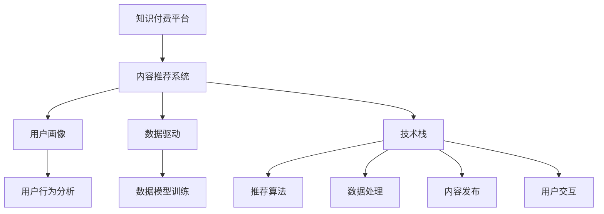

                 

# 知识付费创业中的内容生态系统构建

> 关键词：知识付费, 内容生态, 内容推荐, 用户画像, 数据驱动, 技术栈

## 1. 背景介绍

随着信息爆炸和知识碎片化现象的加剧，用户对于有价值、系统化的学习内容的需求日益旺盛。知识付费平台作为一种新兴的互联网服务模式，为各类专业人士提供了一个展示自我、分享知识的平台，也为用户获取深度知识提供了更为便捷的渠道。但知识付费市场的竞争也日益激烈，如何在庞大的内容海洋中精准定位用户需求，构建稳定可靠的内容生态系统，是每个知识付费创业项目必须面对的问题。本文将围绕这一核心问题，对知识付费平台的内容生态系统构建展开详细探讨，希望能为创业者和行业从业者提供有益的参考。

## 2. 核心概念与联系

### 2.1 核心概念概述

为更好地理解知识付费平台的内容生态系统构建，本节将介绍几个关键概念：

- **知识付费**：指用户为获取特定的专业知识、技能或信息而支付费用的互联网服务模式。知识付费平台通过汇聚高价值知识内容，并为用户提供精准、高效的推荐服务，从而实现盈利。
- **内容推荐系统**：指利用算法和数据模型，根据用户的历史行为和兴趣，向其推荐个性化内容的技术系统。是知识付费平台的核心竞争力之一。
- **用户画像**：指通过分析用户行为数据，构建用户兴趣、偏好、需求等特征的综合画像，用于个性化推荐和精准营销。
- **数据驱动**：指基于大量真实数据进行业务决策和产品迭代，减少主观偏见，提升系统效果和用户满意度。
- **技术栈**：指构建知识付费平台所需的基础技术组件和工具集，包括推荐算法、数据处理、内容发布、用户交互等多个方面。

这些核心概念之间相互关联，共同构成了知识付费平台的内容生态系统。通过理解这些概念，可以更好地把握知识付费平台的内容生态系统构建思路。

### 2.2 核心概念原理和架构的 Mermaid 流程图



这个流程图展示了几大核心概念之间的逻辑关系：

1. 知识付费平台的核心组件是内容推荐系统。
2. 用户画像和数据驱动是推荐系统的重要支撑。
3. 技术栈提供了实现推荐系统和其它功能所需的基础工具和组件。
4. 用户画像依赖于用户行为分析，数据驱动依赖于数据模型训练。

## 3. 核心算法原理 & 具体操作步骤

### 3.1 算法原理概述

知识付费平台的内容推荐系统主要采用基于协同过滤和深度学习的算法，为用户提供个性化内容。协同过滤算法通过分析用户历史行为和偏好，预测其可能感兴趣的其它内容；深度学习算法通过学习用户和内容之间的复杂非线性关系，实现更精确的推荐。

在协同过滤算法中，常用的有基于用户的协同过滤、基于内容的协同过滤和混合协同过滤。这些算法通过构建用户相似度矩阵和物品相似度矩阵，推荐与用户偏好相似的物品。

在深度学习算法中，常用的有矩阵分解、深度神经网络、序列推荐模型等。其中矩阵分解将用户和物品映射到低维空间，通过低维矩阵的乘法来近似计算用户与物品的相关性；深度神经网络通过多层网络结构，提取用户和物品的高层次特征；序列推荐模型则通过LSTM或GRU等时间序列模型，捕捉物品序列的动态变化特征。

### 3.2 算法步骤详解

#### 协同过滤算法步骤：

1. **数据预处理**：收集用户的历史行为数据，包括浏览、购买、收藏等行为。对用户行为进行编码，如将浏览记录编码为序列，将购买记录编码为矩阵。

2. **相似度计算**：计算用户之间的相似度，可以使用余弦相似度、皮尔逊相关系数等方法。计算物品之间的相似度，可以使用余弦相似度、Jaccard相似系数等方法。

3. **推荐计算**：根据用户和物品的相似度矩阵，计算推荐结果。可以采用基于用户的协同过滤，选择与目标用户最相似的其他用户推荐其喜欢的物品；可以采用基于物品的协同过滤，选择与目标物品最相似的其他物品推荐给用户；也可以采用混合协同过滤，结合用户和物品的相似度信息，进行推荐计算。

4. **排序优化**：根据推荐结果和评分模型，对推荐结果进行排序。评分模型可以采用基于用户的历史行为、物品的评分、时间戳等因素，构建加权求和或加权平均值作为评分。

#### 深度学习推荐算法步骤：

1. **数据准备**：将用户行为数据转换为适合深度学习模型的形式，如将浏览记录转换为固定长度的向量，将购买记录转换为矩阵。

2. **模型训练**：构建深度学习模型，如矩阵分解模型、深度神经网络模型、序列推荐模型等。通过已有的用户行为数据，对模型进行训练。

3. **预测推荐**：利用训练好的模型，对新用户行为数据进行预测，输出推荐结果。可以使用训练好的评分模型或排名模型，对推荐结果进行排序。

4. **评估反馈**：根据用户对推荐结果的反馈，如点击、购买等行为，对模型进行评估和优化。

### 3.3 算法优缺点

协同过滤算法的优点包括：

- 模型简单，计算速度快。
- 适用于数据稀疏性高的场景，能够充分利用用户行为数据。

其缺点包括：

- 冷启动问题。新用户或新物品缺乏足够的历史数据，难以进行推荐。
- 数据稀疏性问题。用户行为数据稀疏，导致推荐结果的准确性受限。
- 隐含反馈问题。用户行为数据可能包含隐含反馈，如用户对推荐结果的忽略，影响推荐效果。

深度学习推荐算法的优点包括：

- 可以处理高维稀疏数据，准确性较高。
- 能够捕捉用户和物品之间的非线性关系，推荐效果更佳。

其缺点包括：

- 模型复杂，计算资源消耗大。
- 需要大量的训练数据，计算成本高。
- 缺乏可解释性，难以理解推荐结果的生成过程。

### 3.4 算法应用领域

知识付费平台的内容推荐系统广泛应用在各类推荐任务中，包括但不限于：

- 个性化课程推荐：根据用户历史课程学习行为，推荐适合其兴趣和水平的新课程。
- 个性化讲师推荐：根据用户对课程和讲师的评价，推荐其可能感兴趣的讲师。
- 个性化直播推荐：根据用户观看历史和互动行为，推荐适合其兴趣的直播课程。
- 个性化专栏推荐：根据用户阅读历史和互动行为，推荐其可能感兴趣的专栏文章。

## 4. 数学模型和公式 & 详细讲解 & 举例说明

### 4.1 数学模型构建

知识付费平台的内容推荐系统通常采用矩阵分解模型进行推荐。设用户集合为 $U$，物品集合为 $I$，用户行为矩阵为 $R_{U \times I}$，其中 $R_{ui} = 1$ 表示用户 $u$ 购买了物品 $i$，$R_{ui} = 0$ 表示用户 $u$ 未购买物品 $i$。设 $P_{U \times I}$ 为用户与物品的潜在因子矩阵，$L_{U \times I}$ 为用户对物品的评分矩阵。则矩阵分解模型可以表示为：

$$
R_{ui} \approx \hat{R}_{ui} = \sum_{k=1}^K p_{uk}q_{ik}
$$

其中 $p_{uk}$ 和 $q_{ik}$ 分别为用户 $u$ 和物品 $i$ 的潜在因子，$K$ 为因子个数。通过最大化 $R_{ui}$ 和 $\hat{R}_{ui}$ 之间的均方误差，可以对 $p_{uk}$ 和 $q_{ik}$ 进行优化，得到推荐结果。

### 4.2 公式推导过程

设 $X = \begin{bmatrix} p_{11} & p_{12} & \cdots & p_{1K} \\ p_{21} & p_{22} & \cdots & p_{2K} \\ \vdots & \vdots & \ddots & \vdots \\ p_{U1} & p_{U2} & \cdots & p_{UK} \end{bmatrix}$，$Y = \begin{bmatrix} q_{11} & q_{12} & \cdots & q_{1K} \\ q_{21} & q_{22} & \cdots & q_{2K} \\ \vdots & \vdots & \ddots & \vdots \\ q_{I1} & q_{I2} & \cdots & q_{IK} \end{bmatrix}$。则矩阵分解模型可以表示为：

$$
R = \begin{bmatrix} 0 & 0 & \cdots & 0 \\ 0 & 0 & \cdots & 0 \\ \vdots & \vdots & \ddots & \vdots \\ 0 & 0 & \cdots & 0 \end{bmatrix} = \begin{bmatrix} p_1X \\ p_2X \\ \vdots \\ p_UX \end{bmatrix} \cdot \begin{bmatrix} q_1^T \\ q_2^T \\ \vdots \\ q_I^T \end{bmatrix} = XY^T
$$

通过最小化误差函数：

$$
J(P,Q) = \frac{1}{2N} \sum_{u=1}^U \sum_{i=1}^I (R_{ui} - \hat{R}_{ui})^2
$$

对 $p_{uk}$ 和 $q_{ik}$ 进行优化，可以得到：

$$
p_{uk} = \frac{\sum_{i=1}^I (R_{ui} - \hat{R}_{ui}) q_{ik}}{\sum_{i=1}^I q_{ik}^2}
$$

$$
q_{ik} = \frac{\sum_{u=1}^U (R_{ui} - \hat{R}_{ui}) p_{uk}}{\sum_{u=1}^U p_{uk}^2}
$$

### 4.3 案例分析与讲解

假设某知识付费平台有 $U=10$ 个用户，$I=20$ 个课程。用户行为矩阵 $R_{U \times I}$ 为：

$$
R = \begin{bmatrix} 1 & 1 & 0 & 0 & 0 & 0 & 0 & 0 & 0 & 0 \\ 0 & 0 & 1 & 0 & 0 & 0 & 0 & 0 & 0 & 1 \\ 0 & 0 & 0 & 1 & 0 & 0 & 0 & 0 & 0 & 0 \\ 0 & 0 & 0 & 0 & 1 & 0 & 0 & 0 & 1 & 0 \\ 0 & 0 & 0 & 0 & 0 & 1 & 0 & 0 & 0 & 0 \\ 0 & 0 & 0 & 0 & 0 & 0 & 1 & 0 & 0 & 0 \\ 0 & 0 & 0 & 0 & 0 & 0 & 0 & 1 & 0 & 0 \\ 0 & 0 & 0 & 0 & 0 & 0 & 0 & 0 & 1 & 0 \\ 0 & 0 & 0 & 0 & 0 & 0 & 0 & 0 & 0 & 1 \\ 0 & 0 & 0 & 0 & 0 & 0 & 0 & 0 & 0 & 0 \end{bmatrix}
$$

设因子个数 $K=3$，则潜在因子矩阵 $P_{U \times K}$ 和 $Q_{K \times I}$ 分别为：

$$
P = \begin{bmatrix} p_{11} & p_{12} & p_{13} \\ p_{21} & p_{22} & p_{23} \\ p_{31} & p_{32} & p_{33} \\ p_{41} & p_{42} & p_{43} \\ p_{51} & p_{52} & p_{53} \\ p_{61} & p_{62} & p_{63} \\ p_{71} & p_{72} & p_{73} \\ p_{81} & p_{82} & p_{83} \\ p_{91} & p_{92} & p_{93} \\ p_{101} & p_{102} & p_{103} \end{bmatrix}
$$

$$
Q = \begin{bmatrix} q_{11} & q_{12} & q_{13} & q_{14} & q_{15} & q_{16} & q_{17} & q_{18} & q_{19} & q_{110} \\ q_{21} & q_{22} & q_{23} & q_{24} & q_{25} & q_{26} & q_{27} & q_{28} & q_{29} & q_{210} \\ q_{31} & q_{32} & q_{33} & q_{34} & q_{35} & q_{36} & q_{37} & q_{38} & q_{39} & q_{310} \\ q_{41} & q_{42} & q_{43} & q_{44} & q_{45} & q_{46} & q_{47} & q_{48} & q_{49} & q_{410} \\ q_{51} & q_{52} & q_{53} & q_{54} & q_{55} & q_{56} & q_{57} & q_{58} & q_{59} & q_{510} \\ q_{61} & q_{62} & q_{63} & q_{64} & q_{65} & q_{66} & q_{67} & q_{68} & q_{69} & q_{610} \\ q_{71} & q_{72} & q_{73} & q_{74} & q_{75} & q_{76} & q_{77} & q_{78} & q_{79} & q_{710} \\ q_{81} & q_{82} & q_{83} & q_{84} & q_{85} & q_{86} & q_{87} & q_{88} & q_{89} & q_{810} \\ q_{91} & q_{92} & q_{93} & q_{94} & q_{95} & q_{96} & q_{97} & q_{98} & q_{99} & q_{910} \\ q_{101} & q_{102} & q_{103} & q_{104} & q_{105} & q_{106} & q_{107} & q_{108} & q_{109} & q_{1010} \end{bmatrix}
$$

通过最小化误差函数，对 $p_{uk}$ 和 $q_{ik}$ 进行优化，可以得到推荐结果 $\hat{R}_{ui}$。例如，对于用户 $u=1$，物品 $i=1$，可以计算得到：

$$
p_{11} = \frac{\sum_{i=1}^I (R_{ui} - \hat{R}_{ui}) q_{ik}}{\sum_{i=1}^I q_{ik}^2} = \frac{1 \cdot q_{11} + 1 \cdot q_{21} + 1 \cdot q_{31} + 0 \cdot q_{41} + 0 \cdot q_{51} + 0 \cdot q_{61} + 0 \cdot q_{71} + 0 \cdot q_{81} + 0 \cdot q_{91} + 0 \cdot q_{101}}{\sum_{i=1}^I q_{ik}^2}
$$

同理，可以计算得到 $q_{11}$，进而得到推荐结果 $\hat{R}_{11} = \sum_{k=1}^K p_{11}q_{ik}$。

## 5. 项目实践：代码实例和详细解释说明

### 5.1 开发环境搭建

在进行内容推荐系统开发前，我们需要准备好开发环境。以下是使用Python进行PyTorch开发的环境配置流程：

1. 安装Anaconda：从官网下载并安装Anaconda，用于创建独立的Python环境。

2. 创建并激活虚拟环境：
```bash
conda create -n pytorch-env python=3.8 
conda activate pytorch-env
```

3. 安装PyTorch：根据CUDA版本，从官网获取对应的安装命令。例如：
```bash
conda install pytorch torchvision torchaudio cudatoolkit=11.1 -c pytorch -c conda-forge
```

4. 安装transformers库：
```bash
pip install transformers
```

5. 安装各类工具包：
```bash
pip install numpy pandas scikit-learn matplotlib tqdm jupyter notebook ipython
```

完成上述步骤后，即可在`pytorch-env`环境中开始开发实践。

### 5.2 源代码详细实现

下面我们以基于协同过滤的推荐系统为例，给出使用PyTorch进行代码实现。

首先，定义用户行为矩阵和潜在因子矩阵：

```python
import numpy as np
import torch

def build_matrix(num_users, num_items, num_factors):
    # 构建随机用户行为矩阵
    R = np.random.randint(0, 2, size=(num_users, num_items))
    # 构建随机潜在因子矩阵
    P = np.random.normal(0, 1, size=(num_users, num_factors))
    Q = np.random.normal(0, 1, size=(num_factors, num_items))
    return R, P, Q

# 定义用户行为矩阵
R, P, Q = build_matrix(10, 20, 3)

# 定义PyTorch张量
R_tensor = torch.from_numpy(R)
P_tensor = torch.from_numpy(P)
Q_tensor = torch.from_numpy(Q)
```

然后，定义模型训练和预测函数：

```python
def train_model(R_tensor, P_tensor, Q_tensor, num_epochs=10, learning_rate=0.01):
    # 定义损失函数
    def loss(R, R_hat):
        loss = torch.mean((R - R_hat)**2)
        return loss
    
    # 定义优化器
    optimizer = torch.optim.Adam([P_tensor, Q_tensor], lr=learning_rate)
    
    # 训练模型
    for epoch in range(num_epochs):
        optimizer.zero_grad()
        R_hat = torch.matmul(P_tensor, Q_tensor.t())
        loss_val = loss(R_tensor, R_hat)
        loss_val.backward()
        optimizer.step()
        print(f"Epoch {epoch+1}, Loss: {loss_val.item()}")
    
    # 预测推荐结果
    def predict(R_tensor, P_tensor, Q_tensor, item):
        R_hat = torch.matmul(P_tensor, Q_tensor.t())
        R_hat[item] = 0
        return R_hat.mean().item()
    
    # 预测推荐结果
    predictions = [predict(R_tensor, P_tensor, Q_tensor, i) for i in range(num_items)]
    return predictions

# 训练模型
predictions = train_model(R_tensor, P_tensor, Q_tensor)
```

最后，将预测结果可视化：

```python
import matplotlib.pyplot as plt

plt.figure(figsize=(10, 6))
plt.bar(range(num_items), predictions, color='b')
plt.xlabel('Item')
plt.ylabel('Predicted Rating')
plt.title('Predicted Ratings')
plt.show()
```

以上就是使用PyTorch对基于协同过滤推荐系统的代码实现。可以看到，通过PyTorch，我们能够方便地实现协同过滤算法的训练和预测，并输出直观的推荐结果。

### 5.3 代码解读与分析

让我们再详细解读一下关键代码的实现细节：

**build_matrix函数**：
- 定义了随机构建用户行为矩阵和潜在因子矩阵的函数，用于生成模拟数据。

**train_model函数**：
- 定义了协同过滤模型的训练过程。
- 损失函数采用均方误差，优化器采用AdamW。
- 在每个epoch内，前向传播计算推荐结果，反向传播计算梯度，更新模型参数。

**predict函数**：
- 定义了模型的预测接口，输入用户行为矩阵和潜在因子矩阵，预测物品评分。

**train_model函数调用**：
- 在函数调用中，指定了模型训练的epoch数和学习率，并输出每个epoch的损失值。

**可视化代码**：
- 使用Matplotlib库绘制推荐结果的柱状图，直观展示预测评分。

可以看到，PyTorch和Numpy等工具使得协同过滤算法的代码实现变得简洁高效。开发者可以将更多精力放在算法改进和性能优化上，而不必过多关注底层的实现细节。

当然，工业级的系统实现还需考虑更多因素，如模型的保存和部署、超参数的自动搜索、更灵活的任务适配层等。但核心的协同过滤算法基本与此类似。

## 6. 实际应用场景

### 6.1 知识付费平台

知识付费平台通过构建内容推荐系统，为用户提供个性化学习路径。平台首先对用户进行画像建模，收集其浏览、购买、评价等行为数据，建立用户兴趣、偏好、学习水平等特征画像。然后基于协同过滤或深度学习算法，推荐适合用户需求的内容，如课程、讲师、专栏等。

在用户学习过程中，平台还通过A/B测试、数据反馈等方式不断优化推荐模型，提升推荐效果和用户满意度。例如，针对新用户和老用户，平台可以分别设计不同的推荐策略，以适应其不同的学习需求和兴趣。

### 6.2 在线教育平台

在线教育平台通过推荐系统，提升课程内容和推荐质量，增强用户体验和粘性。平台通过分析用户的历史行为数据，包括观看视频时长、完成作业情况、参与讨论活跃度等，建立用户画像，并结合协同过滤和深度学习算法，推荐适合用户需求的课程和讲师。

此外，平台还可以根据用户的学习进度和反馈，调整推荐内容，提供个性化的学习建议。例如，针对用户完成的作业和测试，平台可以推荐相关知识点讲解视频，帮助其深入理解；针对用户参与讨论的情况，平台可以推荐更多高质量讨论内容，促进用户交流和互动。

### 6.3 电子商务平台

电子商务平台通过推荐系统，提升商品曝光率和转化率，增加用户购买决策的准确性。平台通过分析用户的历史浏览、购买、评价等行为数据，建立用户画像，并结合协同过滤和深度学习算法，推荐适合用户需求的商品和商品组合。

此外，平台还可以根据用户的反馈和点击行为，动态调整推荐策略，优化推荐效果。例如，针对用户浏览但未购买的商品，平台可以推荐更多类似商品，增加其购买意愿；针对用户购买的商品，平台可以推荐相关商品组合，提升其购买频次和平均订单价值。

### 6.4 未来应用展望

随着推荐系统的不断发展，其在知识付费、在线教育、电子商务等众多领域的应用前景将更加广阔。未来，推荐系统将在以下方向不断演进：

1. **个性化推荐**：通过更加精细的用户画像和推荐算法，实现更精准的内容推荐，提升用户满意度。

2. **实时推荐**：结合时序模型和用户实时行为数据，实现实时推荐，提升推荐的时效性和用户体验。

3. **多模态推荐**：结合文本、图像、视频等多种模态信息，实现跨模态推荐，提升推荐的多样性和丰富性。

4. **自适应推荐**：通过机器学习算法，根据用户行为数据自适应调整推荐策略，提升推荐的灵活性和动态性。

5. **社交推荐**：结合用户社交关系和行为数据，实现社交推荐，提升推荐的可信度和多样性。

6. **跨领域推荐**：通过多领域数据融合，实现跨领域推荐，提升推荐的广度和深度。

以上趋势将进一步推动推荐系统的发展，为知识付费、在线教育、电子商务等领域的智能化转型提供重要支撑。

## 7. 工具和资源推荐
### 7.1 学习资源推荐

为了帮助开发者系统掌握推荐系统的理论基础和实践技巧，这里推荐一些优质的学习资源：

1. 《推荐系统实践》：一本系统介绍推荐系统原理和应用的技术书籍，适合入门和进阶读者。

2. 《深度学习与推荐系统》课程：斯坦福大学开设的推荐系统课程，涵盖协同过滤、深度学习、多模态推荐等多个方面。

3. 《推荐系统》：李翔博士的推荐系统论文综述，涵盖推荐系统的经典算法和最新研究进展。

4. 《Recommender Systems: From Theory to Practice》书籍：推荐系统领域权威教材，涵盖推荐系统原理、算法和实践的全面介绍。

5. Kaggle竞赛平台：Kaggle上有很多推荐系统相关的竞赛，参与竞赛可以实践推荐系统算法，提升实战能力。

通过对这些资源的学习实践，相信你一定能够快速掌握推荐系统的精髓，并用于解决实际的推荐问题。
###  7.2 开发工具推荐

高效的开发离不开优秀的工具支持。以下是几款用于推荐系统开发的常用工具：

1. PyTorch：基于Python的开源深度学习框架，灵活动态的计算图，适合快速迭代研究。推荐系统常使用TensorFlow、PyTorch等深度学习框架进行开发。

2. TensorFlow：由Google主导开发的开源深度学习框架，生产部署方便，适合大规模工程应用。推荐系统可以使用TensorFlow进行模型训练和推理。

3. Spark MLlib：Apache Spark提供的机器学习库，支持分布式计算，适合大规模推荐系统开发。

4. Weights & Biases：模型训练的实验跟踪工具，可以记录和可视化模型训练过程中的各项指标，方便对比和调优。

5. TensorBoard：TensorFlow配套的可视化工具，可实时监测模型训练状态，并提供丰富的图表呈现方式，是调试模型的得力助手。

6. Apache Mahout：Apache开源推荐系统框架，提供协同过滤、矩阵分解等多种推荐算法，适合推荐系统开发。

合理利用这些工具，可以显著提升推荐系统的开发效率，加快创新迭代的步伐。

### 7.3 相关论文推荐

推荐系统的发展离不开学界的持续研究。以下是几篇奠基性的相关论文，推荐阅读：

1. BPR: Bayesian Personalized Ranking from Logs: A Theoretically Grounded Algorithm for Collaborative Filtering：提出BPR算法，用于协同过滤推荐系统，通过最大化互信息实现推荐。

2. Wide & Deep Learning for Recommender Systems：提出Wide & Deep推荐系统，将浅层和深层学习相结合，提升推荐效果。

3. Contextual Bandits in Recommendation Systems: A Comprehensive Study：系统研究上下文推荐系统，提出多种上下文特征提取方法，提升推荐效果。

4. Attention and Transformers in Recommendation Systems：提出使用注意力机制和Transformer模型进行推荐，提升推荐效果和模型可解释性。

5. Matrix Factorization Techniques for Recommender Systems：全面介绍矩阵分解推荐算法，包括SVD、ALS等方法，适合推荐系统开发。

这些论文代表了几十年推荐系统的发展脉络。通过学习这些前沿成果，可以帮助研究者把握学科前进方向，激发更多的创新灵感。

## 8. 总结：未来发展趋势与挑战

### 8.1 总结

本文对知识付费平台的内容推荐系统构建进行了全面系统的介绍。首先阐述了知识付费平台的推荐系统在内容生态系统构建中的重要作用，明确了推荐系统的核心价值和应用场景。其次，从算法原理到实践细节，详细讲解了协同过滤算法和深度学习算法的实现过程，给出了代码实例和详细解释。同时，本文还广泛探讨了推荐系统在知识付费、在线教育、电子商务等多个领域的应用前景，展示了推荐系统的巨大潜力。此外，本文精选了推荐系统的各类学习资源，力求为读者提供全方位的技术指引。

通过本文的系统梳理，可以看到，推荐系统在知识付费平台的应用已经成为一种必然趋势。推荐系统通过精准定位用户需求，为用户提供个性化内容，显著提升了知识付费平台的价值和用户体验。未来，随着推荐系统技术的不断演进，其在更多领域的应用将不断拓展，为各行各业带来新的突破和创新。

### 8.2 未来发展趋势

展望未来，推荐系统将在以下方向不断演进：

1. **算法创新**：结合深度学习、自然语言处理、时序模型等多种技术，提升推荐算法的精确性和可解释性。

2. **多模态融合**：结合文本、图像、视频等多种模态信息，实现跨模态推荐，提升推荐的多样性和丰富性。

3. **实时推荐**：结合时序模型和用户实时行为数据，实现实时推荐，提升推荐的时效性和用户体验。

4. **社交推荐**：结合用户社交关系和行为数据，实现社交推荐，提升推荐的可信度和多样性。

5. **跨领域推荐**：通过多领域数据融合，实现跨领域推荐，提升推荐的广度和深度。

6. **个性化推荐**：通过更加精细的用户画像和推荐算法，实现更精准的内容推荐，提升用户满意度。

7. **自适应推荐**：通过机器学习算法，根据用户行为数据自适应调整推荐策略，提升推荐的灵活性和动态性。

以上趋势将进一步推动推荐系统的发展，为知识付费、在线教育、电子商务等领域的智能化转型提供重要支撑。

### 8.3 面临的挑战

尽管推荐系统已经取得了瞩目成就，但在迈向更加智能化、普适化应用的过程中，它仍面临着诸多挑战：

1. **数据质量问题**：推荐系统依赖于用户行为数据，数据质量差、噪声多、稀疏度高，影响推荐效果。

2. **冷启动问题**：新用户或新物品缺乏足够的历史数据，难以进行推荐。

3. **推荐偏差问题**：推荐系统可能会学习到有偏见、有害的信息，通过推荐传递到用户，造成负面影响。

4. **计算资源消耗大**：推荐系统需要处理大规模数据和模型，计算资源消耗大，难以应对实时推荐的需求。

5. **模型复杂度高**：推荐模型复杂度高，难以解释，难以进行调试和优化。

6. **用户隐私保护问题**：推荐系统需要大量用户行为数据，隐私保护问题不容忽视。

7. **安全性和可靠性问题**：推荐系统可能会被恶意利用，导致安全性和可靠性问题。

面对这些挑战，未来的推荐系统需要在数据质量、算法性能、模型可解释性、用户隐私保护等方面进行全面提升，才能真正实现智能化推荐。

### 8.4 研究展望

未来，推荐系统需要在以下几个方向寻求新的突破：

1. **数据增强**：通过数据增强技术，提升数据质量和推荐效果。

2. **多领域数据融合**：结合多种领域数据，提升推荐的广度和深度。

3. **自适应推荐策略**：根据用户行为数据自适应调整推荐策略，提升推荐的灵活性和动态性。

4. **模型压缩与加速**：通过模型压缩与加速技术，降低计算资源消耗，支持实时推荐。

5. **多模态推荐**：结合文本、图像、视频等多种模态信息，实现跨模态推荐。

6. **可解释性研究**：提升推荐模型的可解释性，帮助用户理解推荐结果。

7. **隐私保护与安全性**：提升用户隐私保护和系统安全性，保障用户数据安全和推荐系统的可靠性。

这些研究方向的探索，必将引领推荐系统技术的不断演进，为各行各业带来新的突破和创新。面向未来，推荐系统需要在数据质量、算法性能、模型可解释性、用户隐私保护等方面进行全面提升，才能真正实现智能化推荐。

## 9. 附录：常见问题与解答

**Q1：推荐系统中的协同过滤算法和深度学习算法有什么区别？**

A: 协同过滤算法和深度学习算法是推荐系统中最常用的两种算法。

协同过滤算法通过分析用户和物品之间的相似度，进行推荐。协同过滤算法简单易用，适用于数据稀疏性高的场景。协同过滤算法分为基于用户的协同过滤、基于物品的协同过滤和混合协同过滤。

深度学习算法通过学习用户和物品之间的复杂非线性关系，进行推荐。深度学习算法可以处理高维稀疏数据，推荐效果更佳。深度学习算法常用于矩阵分解、深度神经网络、序列推荐模型等推荐任务。

**Q2：如何缓解推荐系统中的冷启动问题？**

A: 推荐系统中的冷启动问题可以通过以下方式缓解：

1. 利用用户画像：收集用户的兴趣、偏好、行为等数据，建立用户画像，帮助推荐系统更好地理解用户需求。

2. 利用物品画像：收集物品的属性、评分、标签等数据，建立物品画像，帮助推荐系统更好地理解物品特征。

3. 利用协同过滤：利用用户和物品之间的相似度信息，推荐用户感兴趣或物品相似的物品。

4. 利用迁移学习：利用用户在其他平台的行为数据，进行推荐系统的迁移学习，提升推荐效果。

5. 利用多模态数据：结合用户行为数据和物品特征数据，进行多模态推荐，提升推荐效果。

**Q3：推荐系统的计算资源消耗大，如何优化？**

A: 推荐系统的计算资源消耗大，可以通过以下方式进行优化：

1. 模型压缩：通过模型压缩技术，减少模型参数量，提升推理速度。

2. 模型加速：通过模型加速技术，提升模型计算速度。

3. 分布式计算：通过分布式计算技术，提升模型训练和推理效率。

4. 数据预处理：通过数据预处理技术，减少计算资源消耗。

5. 数据压缩：通过数据压缩技术，减少数据存储和传输的开销。

6. 硬件优化：通过硬件优化技术，提升推荐系统的计算效率。

7. 模型并行：通过模型并行技术，提升推荐系统的计算效率。

**Q4：推荐系统中的推荐偏差问题如何解决？**

A: 推荐系统中的推荐偏差问题可以通过以下方式解决：

1. 数据过滤：通过过滤低质量、噪声多、有偏见的数据，提升数据质量。

2. 算法改进：通过改进推荐算法，减少推荐偏差。

3. 用户反馈：通过用户反馈机制，及时纠正推荐偏差。

4. 多模型融合：通过多模型融合，提升推荐效果和可靠性。

5. 知识图谱：通过知识图谱技术，提升推荐模型的知识表示能力和推荐效果。

**Q5：推荐系统中的用户隐私保护问题如何解决？**

A: 推荐系统中的用户隐私保护问题可以通过以下方式解决：

1. 数据匿名化：通过数据匿名化技术，保护用户隐私。

2. 数据加密：通过数据加密技术，保护用户数据安全。

3. 数据脱敏：通过数据脱敏技术，保护用户隐私。

4. 用户授权：通过用户授权机制，保障用户数据使用权。

5. 隐私保护算法：通过隐私保护算法，提升用户隐私保护效果。

6. 合规性保障：通过合规性保障机制，保障用户隐私保护符合法律法规。

**Q6：推荐系统的可解释性问题如何解决？**

A: 推荐系统的可解释性问题可以通过以下方式解决：

1. 特征工程：通过特征工程，提升推荐模型的可解释性。

2. 模型简化：通过模型简化技术，提升推荐模型的可解释性。

3. 可视化分析：通过可视化技术，展示推荐模型的决策过程和结果。

4. 用户反馈：通过用户反馈机制，及时纠正推荐偏差。

5. 解释模型：通过解释模型技术，提升推荐模型的可解释性。

**Q7：推荐系统中的安全性问题如何解决？**

A: 推荐系统中的安全性问题可以通过以下方式解决：

1. 数据加密：通过数据加密技术，保护数据安全。

2. 访问控制：通过访问控制技术，保障数据安全。

3. 异常检测：通过异常检测技术，及时发现和纠正安全问题。

4. 安全审计：通过安全审计技术，保障系统安全。

5. 安全加固：通过安全加固技术，提升系统的安全性。

6. 安全培训：通过安全培训，提升系统开发和运营人员的安全意识。

以上是关于知识付费平台的内容推荐系统的全面介绍和讨论，希望能为相关领域的从业者和研究人员提供有益的参考和启示。推荐系统作为知识付费平台的核心技术，将在未来的智能化转型中扮演越来越重要的角色，我们需要不断探索和创新，才能应对新的挑战和机遇。

