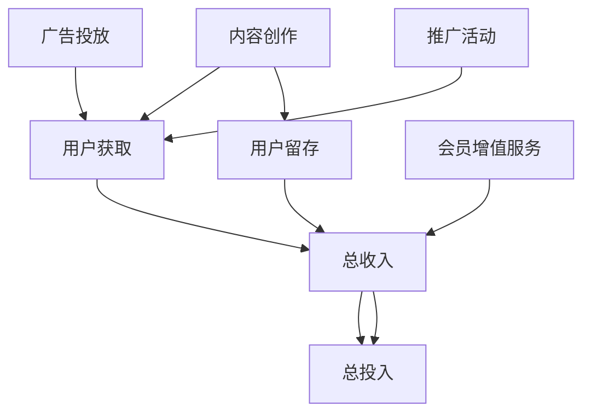

                 

# 知识付费创业中的内容营销ROI优化

## 1. 背景介绍

在知识付费快速发展的今天，内容营销已成为许多知识付费创业公司的主要收入来源。如何通过优化内容营销策略，最大化内容营销的投入回报率 (ROI)，是每一个知识付费创业者都必须面对的挑战。本文将全面探讨知识付费中的内容营销，从理论到实践，深入分析内容营销ROI优化的关键要素。

## 2. 核心概念与联系

### 2.1 核心概念概述

为了更好地理解知识付费中的内容营销ROI优化，我们需要先明确几个核心概念：

1. **知识付费**：一种新兴的商业模式，即通过付费订阅或单次付费，为消费者提供知识内容或专业知识服务。典型的知识付费平台包括得到、知乎live、小鹅通等。

2. **内容营销**：一种以内容为核心吸引用户、建立品牌信任、推动销售的营销策略。在知识付费领域，内容营销主要指通过优质内容吸引用户订阅，提高平台收入。

3. **ROI（投资回报率）**：衡量内容营销活动经济效果的一个重要指标，即通过内容营销投入产生的收益与投入之比。

4. **用户获取成本 (CAC)**：获取一个新用户所需的花费，包括广告费、推广费、内容制作费等。

5. **用户生命周期价值 (LTV)**：一个用户在生命周期内为平台带来的总收益，包括订阅费、广告分成、会员增值服务等。

6. **用户留存率**：在一定时间内，继续使用平台的用户比例，反映了用户对平台的粘性和忠诚度。

### 2.2 核心概念之间的联系

内容营销的ROI优化是一个复杂的系统工程，涉及内容质量、用户获取、用户留存等多个环节。各环节之间相互关联，共同影响最终的ROI。以下是一个简化的内容营销ROI优化流程图，展示了各环节的联系：



这个流程图展示了内容营销ROI优化的主要环节：内容创作、用户获取、用户留存、广告投放、推广活动、会员增值服务等，以及它们之间的关系。

## 3. 核心算法原理 & 具体操作步骤

### 3.1 算法原理概述

内容营销ROI优化的核心在于通过数据驱动的策略制定，最大化内容营销活动带来的收益。算法原理可以归纳为以下几个步骤：

1. **数据收集**：收集平台用户在订阅、消费、互动等方面的数据，包括点击率、观看时长、订阅量等。
2. **数据分析**：利用数据分析工具，如Google Analytics、Tableau等，对收集的数据进行清洗、分析和可视化。
3. **策略制定**：根据分析结果，制定内容营销策略，如内容主题、形式、投放渠道等。
4. **效果评估**：通过A/B测试等方法，评估内容营销策略的效果，迭代优化策略。

### 3.2 算法步骤详解

以下是内容营销ROI优化的详细步骤：

1. **用户行为分析**：通过用户行为数据，分析用户偏好和兴趣，识别高价值用户群体。

2. **内容推荐系统优化**：根据用户行为数据，优化推荐算法，提高内容相关性和用户满意度。

3. **广告投放策略制定**：基于用户行为数据，制定精准的广告投放策略，降低用户获取成本。

4. **内容生产与调度**：根据用户行为和市场趋势，制定内容生产计划，平衡内容质量与生产成本。

5. **用户留存策略优化**：分析用户留存数据，优化用户留存策略，提高用户生命周期价值。

6. **收入模型优化**：通过数据分析，优化平台的收入模型，提高总收入与总投入之比。

### 3.3 算法优缺点

#### 优点：

1. **数据驱动**：通过数据驱动的策略制定，可以有效避免主观判断带来的偏差，提高决策的科学性和准确性。
2. **精准投放**：精准的广告投放策略和内容推荐系统，能够提高广告和内容的转化率，降低用户获取成本。
3. **持续优化**：基于实时数据，持续迭代优化内容营销策略，最大化ROI。

#### 缺点：

1. **数据隐私问题**：大量用户数据的收集和使用，可能引发用户隐私和数据安全问题。
2. **技术门槛较高**：内容营销ROI优化涉及复杂的数据分析和算法优化，需要较高的技术储备。
3. **策略实施难度**：内容营销策略的实施需要跨部门协作，协调难度较大。

### 3.4 算法应用领域

内容营销ROI优化广泛应用于各类知识付费平台，如在线教育、职业培训、健康咨询等。通过优化内容营销策略，这些平台可以在激烈的市场竞争中脱颖而出，获得更高的用户满意度和收入回报。

## 4. 数学模型和公式 & 详细讲解 & 举例说明

### 4.1 数学模型构建

内容营销ROI优化的数学模型可以表示为：

$$ \text{ROI} = \frac{\text{总收入} - \text{总投入}}{\text{总投入}} $$

其中，总收入包括用户订阅费、广告分成、会员增值服务收入等，总投入包括内容创作、广告投放、推广活动等成本。

### 4.2 公式推导过程

通过上述公式，可以计算出内容营销活动的投资回报率。但实际应用中，还需要对总收入和总投入进行进一步的分解和优化。

假设内容营销活动带来的总收入为 $T$，总投入为 $C$，则ROI可以表示为：

$$ \text{ROI} = \frac{T}{C} $$

进一步分解总收入和总投入，可以表示为：

$$ T = T_{\text{订阅}} + T_{\text{广告}} + T_{\text{会员增值}} $$
$$ C = C_{\text{内容创作}} + C_{\text{广告投放}} + C_{\text{推广活动}} $$

其中，$T_{\text{订阅}}$ 为订阅费收入，$T_{\text{广告}}$ 为广告分成，$T_{\text{会员增值}}$ 为会员增值服务收入；$C_{\text{内容创作}}$ 为内容创作成本，$C_{\text{广告投放}}$ 为广告投放成本，$C_{\text{推广活动}}$ 为推广活动成本。

### 4.3 案例分析与讲解

以某在线教育平台为例，假设其内容营销活动带来了如下收入和成本：

| 收入 | 成本 |
| --- | --- |
| $T_{\text{订阅}} = 1000$ | $C_{\text{内容创作}} = 500$ |
| $T_{\text{广告}} = 200$ | $C_{\text{广告投放}} = 300$ |
| $T_{\text{会员增值}} = 300$ | $C_{\text{推广活动}} = 100$ |

根据上述数据，可以计算出ROI为：

$$ \text{ROI} = \frac{T_{\text{订阅}} + T_{\text{广告}} + T_{\text{会员增值}}}{C_{\text{内容创作}} + C_{\text{广告投放}} + C_{\text{推广活动}}} = \frac{1500}{1000} = 1.5 $$

这意味着，每投入1元的营销费用，能够带来1.5元的收入，ROI为1.5。

## 5. 项目实践：代码实例和详细解释说明

### 5.1 开发环境搭建

要实现内容营销ROI优化，首先需要搭建一个开发环境。以下是搭建环境的详细步骤：

1. **安装Python**：在服务器上安装Python 3.x版本，确保环境稳定。
2. **安装Pandas和NumPy**：这两个库是数据分析的基础，通过pip命令进行安装。
3. **安装TensorFlow或PyTorch**：选择其中之一，用于构建推荐系统和广告投放模型。
4. **安装Google Analytics API**：通过API获取用户行为数据，进行数据分析和优化。

### 5.2 源代码详细实现

以下是一个基于TensorFlow的内容推荐系统实现示例：

```python
import tensorflow as tf
import pandas as pd
import numpy as np

# 数据加载
data = pd.read_csv('user_behavior.csv')

# 构建用户行为矩阵
user_matrix = data.pivot_table(index='user_id', columns='content', values='interaction')
user_matrix.fillna(0, inplace=True)

# 构建内容矩阵
content_matrix = data.pivot_table(index='content', columns='user_id', values='interaction')
content_matrix.fillna(0, inplace=True)

# 模型构建
model = tf.keras.Sequential([
    tf.keras.layers.Embedding(user_matrix.shape[1], 128, input_length=user_matrix.shape[0]),
    tf.keras.layers.Flatten(),
    tf.keras.layers.Dense(64, activation='relu'),
    tf.keras.layers.Dense(1, activation='sigmoid')
])

# 模型编译
model.compile(optimizer='adam', loss='binary_crossentropy', metrics=['accuracy'])

# 模型训练
model.fit(user_matrix, content_matrix, epochs=10, batch_size=128)

# 模型预测
test_matrix = pd.read_csv('test_user_behavior.csv')
predictions = model.predict(test_matrix)
```

### 5.3 代码解读与分析

1. **数据加载**：通过Pandas库读取用户行为数据，并进行初步处理。
2. **矩阵构建**：将用户和内容的交互数据转化为矩阵形式，方便后续模型训练。
3. **模型构建**：使用TensorFlow构建推荐模型，包含嵌入层、全连接层等。
4. **模型训练**：通过指定损失函数和优化器，进行模型训练。
5. **模型预测**：在测试集上进行模型预测，评估推荐效果。

### 5.4 运行结果展示

运行上述代码后，可以生成用户行为推荐模型。在实际应用中，可以将模型嵌入到推荐系统中，根据用户行为数据实时推荐内容，提高用户满意度和留存率。

## 6. 实际应用场景

### 6.1 在线教育

在线教育平台通过内容营销活动，吸引大量用户注册和订阅。内容营销ROI优化可以帮助平台精准投放广告，提高用户获取效率，降低获客成本。同时，通过优化推荐系统，提高课程推荐的相关性和准确性，提高用户满意度和留存率。

### 6.2 健康咨询

健康咨询平台通过内容营销，吸引用户进行健康咨询和付费订阅。内容营销ROI优化可以帮助平台精准定位用户需求，提供个性化健康咨询服务，提高用户粘性和忠诚度。

### 6.3 职业培训

职业培训平台通过内容营销，提供各类专业培训课程。内容营销ROI优化可以帮助平台精准投放广告，吸引有实际需求的用户。同时，通过优化课程推荐，提高用户对培训课程的匹配度和满意度。

### 6.4 未来应用展望

随着知识付费市场的进一步发展，内容营销ROI优化将成为平台竞争的关键。未来，内容营销将更加注重个性化、精准化和互动化，通过AI和大数据分析技术，实现用户行为预测和推荐系统优化，最大化ROI。

## 7. 工具和资源推荐

### 7.1 学习资源推荐

1. **《数据科学与机器学习》**：该书系统介绍了数据分析和机器学习的核心技术和方法，适合知识付费创业者入门。
2. **Coursera《机器学习》课程**：由斯坦福大学Andrew Ng教授主讲的经典课程，涵盖了机器学习的基本概念和算法。
3. **Kaggle**：全球最大的数据科学竞赛平台，提供丰富的数据集和竞赛机会，适合实战练习。
4. **Google Analytics**：Google提供的免费数据分析工具，适合初学者快速上手。

### 7.2 开发工具推荐

1. **PyTorch**：深度学习领域的主流框架，支持GPU加速，适合构建推荐系统和广告投放模型。
2. **TensorFlow**：Google开发的深度学习框架，支持分布式训练和模型部署。
3. **Tableau**：强大的数据可视化工具，适合对用户行为数据进行可视化分析。
4. **Pandas**：数据处理和分析的必备工具，适合对数据进行清洗和预处理。

### 7.3 相关论文推荐

1. **《内容推荐系统：模型与算法》**：系统介绍了内容推荐系统的基本模型和算法，适合深入理解推荐系统原理。
2. **《基于深度学习的广告投放策略》**：介绍了深度学习在广告投放中的应用，适合了解广告投放技术。
3. **《数据驱动的内容营销优化》**：详细探讨了数据驱动的内容营销优化方法，适合实战应用。

## 8. 总结：未来发展趋势与挑战

### 8.1 研究成果总结

内容营销ROI优化在知识付费领域已经取得了显著成效，通过优化内容营销策略，许多平台在用户获取和留存方面取得了显著进步。然而，仍面临数据隐私、技术门槛、策略实施难度等挑战，需要进一步突破。

### 8.2 未来发展趋势

未来，内容营销ROI优化将进一步结合AI和大数据分析技术，实现更加精准和个性化的内容推荐，提高用户满意度和平台收入。

1. **AI和大数据分析**：通过AI和大数据分析，实现用户行为预测和个性化推荐，提高内容相关性和用户满意度。
2. **多渠道融合**：将线上线下渠道进行融合，提高用户获取和留存效率。
3. **跨平台协作**：加强跨部门协作，优化内容生产和投放策略。

### 8.3 面临的挑战

尽管内容营销ROI优化已经取得一定成效，但仍面临诸多挑战：

1. **数据隐私问题**：大量用户数据的收集和使用，可能引发用户隐私和数据安全问题。
2. **技术门槛较高**：内容营销ROI优化涉及复杂的数据分析和算法优化，需要较高的技术储备。
3. **策略实施难度**：内容营销策略的实施需要跨部门协作，协调难度较大。

### 8.4 研究展望

未来的内容营销ROI优化研究需要从以下几个方面进行突破：

1. **数据隐私保护**：研究数据隐私保护技术，确保用户数据安全和隐私。
2. **技术优化**：优化算法和模型，提高内容推荐和广告投放的效率和效果。
3. **策略优化**：优化内容营销策略，提高用户获取和留存效率。

## 9. 附录：常见问题与解答

### 9.1 问题1：如何降低用户获取成本？

答：通过精准广告投放和数据分析，可以实现低成本用户获取。例如，利用Google Analytics等工具，分析用户行为数据，找出高价值用户群体，进行定向投放。

### 9.2 问题2：内容推荐系统如何优化？

答：可以通过用户行为数据进行训练，使用深度学习模型如协同过滤、矩阵分解等，优化推荐系统。同时，引入反馈机制，实时更新推荐模型。

### 9.3 问题3：如何进行数据分析？

答：使用Pandas和NumPy等工具，对用户行为数据进行清洗、统计和可视化。通过Google Analytics等工具，获取实时用户行为数据，进行深入分析。

### 9.4 问题4：如何保护用户隐私？

答：采取数据匿名化、加密等措施，确保用户数据安全和隐私。同时，遵守相关法律法规，如GDPR等，保护用户隐私权利。

---

作者：禅与计算机程序设计艺术 / Zen and the Art of Computer Programming

