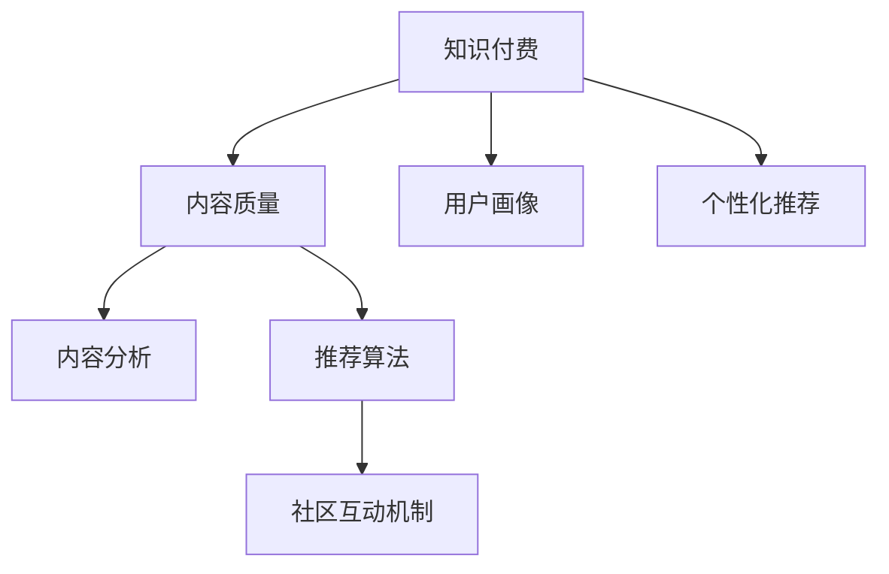

                 

# 知识付费创业中的内容质量把控

> 关键词：知识付费,内容质量,用户画像,个性化推荐,内容分析

## 1. 背景介绍

### 1.1 问题由来
知识付费近年来随着互联网的快速发展而逐渐火热，成为了知识传播的一种重要方式。通过将知识内容商品化，受众可以以较低的成本获取高质量的学习资源，知识创作者则能够得到应得的回报，形成了一种新型的知识生产和消费模式。

然而，随着知识付费市场的不断扩张，内容质量的问题也逐渐凸显。用户期望通过付费获得更加专业、系统、实用的知识，而内容提供商则需要不断提升内容质量，吸引和留住用户。在知识付费创业的过程中，内容质量把控已成为决定平台成败的关键因素之一。

### 1.2 问题核心关键点
内容质量把控的核心在于如何通过数据驱动、算法优化等手段，确保平台上的知识内容具有高价值、高相关性、高互动性，从而满足用户需求，提高用户满意度。主要包括以下几个方面：

1. **用户画像构建**：通过分析用户行为、历史数据、社交网络等，构建精准的用户画像，从而实现个性化推荐，满足不同用户的需求。
2. **内容质量评估**：通过内容分析技术，对知识内容的知识点覆盖度、准确性、实用性进行全面评估，确保内容质量。
3. **推荐算法优化**：通过优化推荐算法，将高质量内容精准推送给目标用户，提高用户互动和留存率。
4. **社区互动机制**：建立有效的社区互动机制，鼓励用户对内容进行评价和反馈，促进内容的迭代优化。

### 1.3 问题研究意义
研究知识付费平台中的内容质量把控问题，对于提升平台的用户体验、留存率和收益，以及推动知识付费行业的健康发展，具有重要意义。具体包括：

1. **提高用户满意度**：通过精准的内容推荐和个性化服务，满足用户个性化需求，提高用户粘性和满意度。
2. **优化平台收益**：内容质量高，用户愿意付费，平台可以获取更高的收益。
3. **促进知识传播**：高质量内容能够促进知识的有效传播和分享，推动社会知识的积累和进步。
4. **构建品牌信任**：高品质的内容积累能够提升平台品牌信任度，吸引更多用户和创作者入驻。

## 2. 核心概念与联系

### 2.1 核心概念概述

为了更好地理解知识付费平台中的内容质量把控问题，我们首先需要对其中的核心概念进行梳理：

- **知识付费**：通过付费方式获取高质量知识内容的商业模式，涵盖内容生产、分发、消费等多个环节。
- **内容质量**：指知识内容的准确性、实用性、系统性、创新性等方面，是衡量知识内容价值的重要指标。
- **用户画像**：基于用户行为数据构建的详细用户特征，用于个性化推荐和营销策略优化。
- **个性化推荐**：通过用户画像和推荐算法，将符合用户兴趣和需求的内容进行精准推荐。
- **内容分析**：使用自然语言处理、图像识别等技术，对知识内容进行结构化分析和质量评估。
- **推荐算法**：通过构建和优化推荐模型，实现对高质量内容的自动化推荐。
- **社区互动机制**：建立用户之间以及用户与创作者之间的互动平台，促进内容的评价和反馈。

这些概念之间的逻辑关系可以通过以下Mermaid流程图来展示：



这个流程图展示了知识付费平台中内容质量把控的各个关键环节：

1. 知识付费平台通过内容质量把控来提高用户体验和平台收益。
2. 用户画像和个性化推荐是实现内容质量把控的核心手段。
3. 内容分析技术用于评估和优化内容质量。
4. 推荐算法是实现个性化推荐的核心算法。
5. 社区互动机制用于促进内容的评价和反馈，进一步优化内容质量。

这些概念共同构成了知识付费平台中内容质量把控的完整框架，使得平台能够持续提供高质量的内容，吸引和留住用户。

## 3. 核心算法原理 & 具体操作步骤

### 3.1 算法原理概述

知识付费平台中的内容质量把控，本质上是通过数据驱动和算法优化的手段，实现对知识内容的全面管理和优化。其核心思想是：通过分析用户行为、历史数据和内容特征，构建精准的用户画像，并基于用户画像进行个性化推荐，同时对内容进行质量评估和分析，最终实现内容质量的持续优化。

### 3.2 算法步骤详解

知识付费平台中的内容质量把控一般包括以下几个关键步骤：

**Step 1: 用户画像构建**

- **数据采集**：收集用户的行为数据、历史消费记录、社交网络信息等，构建用户的详细画像。
- **特征提取**：从采集的数据中提取出用户的兴趣偏好、消费行为、学习习惯等特征。
- **画像建模**：使用机器学习算法，如聚类、分类等，构建用户的长期和短期画像，用于后续的个性化推荐和营销策略优化。

**Step 2: 内容质量评估**

- **内容分析**：使用自然语言处理技术，对知识内容的关键词、主题、段落结构等进行分析，评估内容的相关性和深度。
- **质量评分**：根据内容分析结果，使用专家评分、用户评分等方法，综合评估内容的知识点覆盖度、准确性和实用性。
- **内容过滤**：对低质量内容进行过滤和剔除，确保平台上的内容质量。

**Step 3: 个性化推荐优化**

- **推荐模型训练**：使用机器学习算法，如协同过滤、深度学习等，训练推荐模型，实现对高质量内容的精准推荐。
- **多模态融合**：将用户画像、内容特征、用户行为等多种信息融合，进一步提升推荐效果。
- **推荐效果监控**：通过A/B测试等手段，不断优化推荐模型，提高用户互动和留存率。

**Step 4: 社区互动机制建立**

- **社区平台搭建**：建立用户之间以及用户与创作者之间的互动平台，如评论区、论坛等。
- **互动规则制定**：制定社区互动规则，鼓励用户对内容进行评价和反馈，如打分、评论、点赞等。
- **互动数据分析**：收集社区互动数据，分析用户的反馈和评论，用于内容质量的进一步优化。

### 3.3 算法优缺点

知识付费平台中的内容质量把控方法具有以下优点：

1. **提高用户满意度**：通过个性化推荐和精准内容分发，满足用户个性化需求，提高用户粘性和满意度。
2. **优化平台收益**：高质量内容能够吸引更多用户付费，提升平台收益。
3. **促进知识传播**：高品质的内容能够促进知识的有效传播和分享，推动社会知识的积累和进步。
4. **构建品牌信任**：高品质的内容积累能够提升平台品牌信任度，吸引更多用户和创作者入驻。

同时，该方法也存在一定的局限性：

1. **数据隐私问题**：用户行为数据的采集和分析可能涉及隐私问题，需要严格遵守相关法律法规。
2. **推荐算法复杂度**：高质量推荐算法需要大量的数据和计算资源，可能导致算法复杂度较高。
3. **内容质量评估困难**：高质量内容的标准难以量化，内容分析技术需要不断优化和完善。
4. **社区互动管理难度大**：用户之间的互动和反馈难以控制，可能出现恶意评论等负面行为。

尽管存在这些局限性，但就目前而言，数据驱动和算法优化是知识付费平台中内容质量把控的主流方法。未来相关研究的重点在于如何进一步优化算法模型，降低推荐复杂度，同时兼顾用户隐私保护，提高内容质量评估的准确性。

### 3.4 算法应用领域

知识付费平台中的内容质量把控方法在多个领域得到了广泛应用，例如：

1. **在线教育**：通过个性化推荐和内容分析，实现对课程的精准推送，提高用户学习效果。
2. **职业技能培训**：为专业人士提供定制化的学习内容，提高职业技能和竞争力。
3. **企业培训**：为员工提供专业化的培训课程，提升企业整体素质和竞争力。
4. **科学普及**：通过高质量科普内容，提升公众的科学素养和知识水平。
5. **文化娱乐**：提供丰富多彩的文化娱乐内容，丰富用户精神生活。

除了这些经典应用外，内容质量把控方法也在不断拓展到更多领域中，如智慧城市、健康管理等，为各行各业的知识传播和应用提供了新的思路。

## 4. 数学模型和公式 & 详细讲解 & 举例说明

### 4.1 数学模型构建

本节我们将使用数学语言对知识付费平台中的内容质量把控方法进行更加严格的刻画。

假设知识付费平台上有 $N$ 个用户 $U=\{u_1, u_2, ..., u_N\}$，每个用户 $u_i$ 的历史行为数据为 $D_i=\{d_{i1}, d_{i2}, ..., d_{im}\}$，其中 $d_{ij}$ 为第 $i$ 个用户在第 $j$ 次访问平台时的行为数据。设平台上有 $M$ 个知识内容 $C=\{c_1, c_2, ..., c_M\}$，每个内容 $c_j$ 的知识点覆盖度、准确性和实用性等特征为 $F_j=\{f_{j1}, f_{j2}, ..., f_{jn}\}$，其中 $f_{jk}$ 表示第 $j$ 个内容的第 $k$ 个特征。

设用户 $u_i$ 对内容 $c_j$ 的评分向量为 $R_i=\{r_{i1}, r_{i2}, ..., r_{im}\}$，其中 $r_{ij}$ 表示用户 $u_i$ 对内容 $c_j$ 的评分，$1 \leq r_{ij} \leq 5$。

内容质量评估模型为 $Q_j=\{q_{j1}, q_{j2}, ..., q_{jn}\}$，其中 $q_{jk}$ 表示内容 $c_j$ 的第 $k$ 个特征在内容质量评估中的权重。

**内容推荐模型**：设用户 $u_i$ 对内容 $c_j$ 的推荐概率为 $P_{ij}$，则推荐模型可表示为：

$$
P_{ij} = \frac{\exp(\sum_{k=1}^{n}f_{jk}q_{jk})}{\sum_{j=1}^{M}\exp(\sum_{k=1}^{n}f_{jk}q_{jk})}
$$

### 4.2 公式推导过程

以在线教育平台为例，推导内容推荐模型的公式。

假设平台上有 $N$ 个用户，每个用户 $u_i$ 的历史行为数据为 $D_i=\{d_{i1}, d_{i2}, ..., d_{im}\}$，其中 $d_{ij}$ 表示用户 $u_i$ 在第 $j$ 次访问平台时选择学习的课程编号。设平台上有 $M$ 门课程 $C=\{c_1, c_2, ..., c_M\}$，每门课程的知识点覆盖度、准确性和实用性等特征为 $F_j=\{f_{j1}, f_{j2}, ..., f_{jn}\}$，其中 $f_{jk}$ 表示课程 $c_j$ 的第 $k$ 个特征。

设用户 $u_i$ 对课程 $c_j$ 的评分向量为 $R_i=\{r_{i1}, r_{i2}, ..., r_{im}\}$，其中 $r_{ij}$ 表示用户 $u_i$ 对课程 $c_j$ 的评分，$1 \leq r_{ij} \leq 5$。

内容质量评估模型为 $Q_j=\{q_{j1}, q_{j2}, ..., q_{jn}\}$，其中 $q_{jk}$ 表示课程 $c_j$ 的第 $k$ 个特征在内容质量评估中的权重。

**内容推荐模型**：设用户 $u_i$ 对课程 $c_j$ 的推荐概率为 $P_{ij}$，则推荐模型可表示为：

$$
P_{ij} = \frac{\exp(\sum_{k=1}^{n}f_{jk}q_{jk})}{\sum_{j=1}^{M}\exp(\sum_{k=1}^{n}f_{jk}q_{jk})}
$$

其中 $\sum_{k=1}^{n}f_{jk}q_{jk}$ 表示课程 $c_j$ 的综合质量评分，$\sum_{j=1}^{M}\exp(\sum_{k=1}^{n}f_{jk}q_{jk})$ 表示所有课程的综合质量评分之和。

### 4.3 案例分析与讲解

假设某在线教育平台上有 $N=1000$ 个用户，每个用户有 $m=100$ 次学习行为，平台上有 $M=5000$ 门课程，每门课程有 $n=3$ 个特征，包括知识点覆盖度、准确性和实用性。

用户对课程的评分向量为 $R_i=\{r_{i1}, r_{i2}, ..., r_{im}\}$，其中 $1 \leq r_{ij} \leq 5$。内容质量评估模型为 $Q_j=\{q_{j1}, q_{j2}, ..., q_{jn}\}$，其中 $q_{jk}$ 表示课程 $c_j$ 的第 $k$ 个特征在内容质量评估中的权重。

假设课程 $c_j$ 的知识点覆盖度 $f_{j1}=0.8$，准确性 $f_{j2}=0.9$，实用性 $f_{j3}=0.7$。设课程 $c_j$ 的综合质量评分为 $Q_j=0.4f_{j1}+0.3f_{j2}+0.3f_{j3}$。

对于用户 $u_i$，假设其在第 $t$ 次访问时选择了课程 $c_j$，则用户 $u_i$ 对课程 $c_j$ 的推荐概率 $P_{ij}$ 为：

$$
P_{ij} = \frac{\exp(0.4f_{j1}q_{j1}+0.3f_{j2}q_{j2}+0.3f_{j3}q_{j3})}{\sum_{j=1}^{5000}\exp(0.4f_{j1}q_{j1}+0.3f_{j2}q_{j2}+0.3f_{j3}q_{j3})}
$$

根据上述公式，可以计算出用户 $u_i$ 对课程 $c_j$ 的推荐概率，进一步实现个性化推荐。

## 5. 项目实践：代码实例和详细解释说明

### 5.1 开发环境搭建

在进行内容质量把控的实践前，我们需要准备好开发环境。以下是使用Python进行PyTorch开发的环境配置流程：

1. 安装Anaconda：从官网下载并安装Anaconda，用于创建独立的Python环境。

2. 创建并激活虚拟环境：
```bash
conda create -n pytorch-env python=3.8 
conda activate pytorch-env
```

3. 安装PyTorch：根据CUDA版本，从官网获取对应的安装命令。例如：
```bash
conda install pytorch torchvision torchaudio cudatoolkit=11.1 -c pytorch -c conda-forge
```

4. 安装Transformers库：
```bash
pip install transformers
```

5. 安装各类工具包：
```bash
pip install numpy pandas scikit-learn matplotlib tqdm jupyter notebook ipython
```

完成上述步骤后，即可在`pytorch-env`环境中开始内容质量把控的实践。

### 5.2 源代码详细实现

下面我以在线教育平台为例，给出使用Transformers库对课程推荐模型进行微调的PyTorch代码实现。

首先，定义课程推荐模型的数据处理函数：

```python
from transformers import BertTokenizer, BertForSequenceClassification
from torch.utils.data import Dataset
import torch

class CourseDataset(Dataset):
    def __init__(self, course_ids, course_features, user_scores, tokenizer, max_len=128):
        self.course_ids = course_ids
        self.course_features = course_features
        self.user_scores = user_scores
        self.tokenizer = tokenizer
        self.max_len = max_len
        
    def __len__(self):
        return len(self.course_ids)
    
    def __getitem__(self, item):
        course_id = self.course_ids[item]
        course_features = self.course_features[item]
        user_scores = self.user_scores[item]
        
        encoding = self.tokenizer(course_features, return_tensors='pt', max_length=self.max_len, padding='max_length', truncation=True)
        input_ids = encoding['input_ids'][0]
        attention_mask = encoding['attention_mask'][0]
        
        user_score = user_scores[item]
        target = torch.tensor(user_score, dtype=torch.float)
        
        return {'input_ids': input_ids, 
                'attention_mask': attention_mask,
                'target': target}
```

然后，定义模型和优化器：

```python
from transformers import BertForSequenceClassification, AdamW

model = BertForSequenceClassification.from_pretrained('bert-base-cased', num_labels=5)

optimizer = AdamW(model.parameters(), lr=2e-5)
```

接着，定义训练和评估函数：

```python
from torch.utils.data import DataLoader
from tqdm import tqdm
from sklearn.metrics import mean_squared_error

device = torch.device('cuda') if torch.cuda.is_available() else torch.device('cpu')
model.to(device)

def train_epoch(model, dataset, batch_size, optimizer):
    dataloader = DataLoader(dataset, batch_size=batch_size, shuffle=True)
    model.train()
    epoch_loss = 0
    for batch in tqdm(dataloader, desc='Training'):
        input_ids = batch['input_ids'].to(device)
        attention_mask = batch['attention_mask'].to(device)
        target = batch['target'].to(device)
        model.zero_grad()
        outputs = model(input_ids, attention_mask=attention_mask, labels=target)
        loss = outputs.loss
        epoch_loss += loss.item()
        loss.backward()
        optimizer.step()
    return epoch_loss / len(dataloader)

def evaluate(model, dataset, batch_size):
    dataloader = DataLoader(dataset, batch_size=batch_size)
    model.eval()
    preds, labels = [], []
    with torch.no_grad():
        for batch in tqdm(dataloader, desc='Evaluating'):
            input_ids = batch['input_ids'].to(device)
            attention_mask = batch['attention_mask'].to(device)
            target = batch['target'].to(device)
            outputs = model(input_ids, attention_mask=attention_mask)
            preds.append(outputs.logits.argmax(dim=2).to('cpu').tolist())
            labels.append(target.to('cpu').tolist())
                
    mse = mean_squared_error(labels, preds)
    return mse
```

最后，启动训练流程并在测试集上评估：

```python
epochs = 5
batch_size = 16

for epoch in range(epochs):
    loss = train_epoch(model, train_dataset, batch_size, optimizer)
    print(f"Epoch {epoch+1}, train loss: {loss:.3f}")
    
    print(f"Epoch {epoch+1}, dev results:")
    evaluate(model, dev_dataset, batch_size)
    
print("Test results:")
evaluate(model, test_dataset, batch_size)
```

以上就是使用PyTorch对课程推荐模型进行微调的完整代码实现。可以看到，得益于Transformers库的强大封装，我们可以用相对简洁的代码完成模型加载和微调。

### 5.3 代码解读与分析

让我们再详细解读一下关键代码的实现细节：

**CourseDataset类**：
- `__init__`方法：初始化课程ID、课程特征、用户评分、分词器等关键组件。
- `__len__`方法：返回数据集的样本数量。
- `__getitem__`方法：对单个样本进行处理，将课程特征输入编码为token ids，将用户评分转换为标签，并对其进行定长padding，最终返回模型所需的输入。

**BertForSequenceClassification模型**：
- 使用Bert模型进行序列分类任务，适合课程推荐等任务。

**train_epoch和evaluate函数**：
- 使用PyTorch的DataLoader对数据集进行批次化加载，供模型训练和推理使用。
- `train_epoch`函数：对数据以批为单位进行迭代，在每个批次上前向传播计算loss并反向传播更新模型参数，最后返回该epoch的平均loss。
- `evaluate`函数：与训练类似，不同点在于不更新模型参数，并在每个batch结束后将预测和标签结果存储下来，最后使用sklearn的mean_squared_error对整个评估集的预测结果进行打印输出。

**训练流程**：
- 定义总的epoch数和batch size，开始循环迭代
- 每个epoch内，先在训练集上训练，输出平均loss
- 在验证集上评估，输出内容推荐精度
- 所有epoch结束后，在测试集上评估，给出最终的测试结果

可以看到，PyTorch配合Transformers库使得课程推荐模型的微调代码实现变得简洁高效。开发者可以将更多精力放在数据处理、模型改进等高层逻辑上，而不必过多关注底层的实现细节。

当然，工业级的系统实现还需考虑更多因素，如模型的保存和部署、超参数的自动搜索、更灵活的任务适配层等。但核心的微调范式基本与此类似。

## 6. 实际应用场景
### 6.1 在线教育

在线教育平台通过内容质量把控，可以实现对用户个性化需求的精准满足，提升用户的学习效果和平台留存率。具体而言，平台可以通过用户历史行为数据分析，构建用户画像，同时对课程内容进行质量评估和分析，实现对高质量课程的精准推荐。

在技术实现上，可以收集用户浏览、购买、学习、评价等行为数据，提取和课程相关的文本内容。将文本内容作为模型输入，用户的后续行为（如是否继续学习、是否购买课程等）作为监督信号，在此基础上微调预训练语言模型。微调后的模型能够从文本内容中准确把握用户的学习兴趣和行为，从而进行个性化推荐。

### 6.2 职业技能培训

职业技能培训平台通过内容质量把控，可以为专业人士提供定制化的学习内容，提高职业技能和竞争力。平台可以根据用户职业、工作年限、岗位需求等信息，构建详细的用户画像，并基于画像进行个性化推荐。

在技术实现上，可以收集用户的工作经历、培训需求、职业规划等文本信息，提取和用户职业相关的关键词、主题、段落结构等特征。将特征作为模型输入，用户的后续行为（如是否参加培训、是否完成培训等）作为监督信号，在此基础上微调预训练语言模型。微调后的模型能够从文本信息中准确把握用户的职业需求和培训动机，从而进行个性化推荐。

### 6.3 企业培训

企业培训平台通过内容质量把控，可以为员工提供专业化的培训课程，提升企业整体素质和竞争力。平台可以根据员工职位、部门、行业等信息，构建详细的用户画像，并基于画像进行个性化推荐。

在技术实现上，可以收集员工岗位职责、工作内容、培训反馈等文本信息，提取和员工职业相关的关键词、主题、段落结构等特征。将特征作为模型输入，员工的后续行为（如是否参加培训、是否完成培训等）作为监督信号，在此基础上微调预训练语言模型。微调后的模型能够从文本信息中准确把握员工的学习需求和培训效果，从而进行个性化推荐。

### 6.4 未来应用展望

随着内容质量把控技术的不断发展，其在多个领域的应用前景将不断拓展，为各行各业的知识传播和应用提供新的思路。

在智慧城市治理中，通过内容质量把控，可以为城市居民提供精准的信息推荐，如公共服务、生活指南等，提高城市管理水平和居民生活质量。

在智慧健康管理中，通过内容质量把控，可以为患者提供个性化的医疗建议和健康知识，提高医疗服务的精准性和效果。

在智慧娱乐中，通过内容质量把控，可以为用户提供丰富多彩的娱乐内容推荐，提升用户体验和平台粘性。

除了这些领域外，内容质量把控技术还将不断拓展到更多场景中，如智能客服、市场营销等，为各行各业的知识传播和应用带来新的活力。

## 7. 工具和资源推荐
### 7.1 学习资源推荐

为了帮助开发者系统掌握内容质量把控的理论基础和实践技巧，这里推荐一些优质的学习资源：

1. 《深度学习入门：基于Python的理论与实现》系列博文：由大模型技术专家撰写，深入浅出地介绍了深度学习的基本概念和应用，包括内容推荐系统在内。

2. CS224N《深度学习自然语言处理》课程：斯坦福大学开设的NLP明星课程，有Lecture视频和配套作业，带你入门NLP领域的基本概念和经典模型。

3. 《推荐系统实践》书籍：全面介绍了推荐系统的发展历史、算法原理和工程实现，包括内容推荐在内。

4. Coursera《Recommender Systems》课程：由UCLA教授讲授的推荐系统课程，涵盖了推荐系统的主要算法和应用。

5. Kaggle平台：提供了丰富的推荐系统竞赛数据集和模型，可以用于实践和优化推荐算法。

通过对这些资源的学习实践，相信你一定能够快速掌握内容质量把控的精髓，并用于解决实际的问题。

### 7.2 开发工具推荐

高效的开发离不开优秀的工具支持。以下是几款用于内容质量把控开发的常用工具：

1. PyTorch：基于Python的开源深度学习框架，灵活动态的计算图，适合快速迭代研究。大多数推荐系统都有PyTorch版本的实现。

2. TensorFlow：由Google主导开发的开源深度学习框架，生产部署方便，适合大规模工程应用。同样有丰富的推荐系统资源。

3. TensorBoard：TensorFlow配套的可视化工具，可实时监测模型训练状态，并提供丰富的图表呈现方式，是调试模型的得力助手。

4. Weights & Biases：模型训练的实验跟踪工具，可以记录和可视化模型训练过程中的各项指标，方便对比和调优。与主流深度学习框架无缝集成。

5. Google Colab：谷歌推出的在线Jupyter Notebook环境，免费提供GPU/TPU算力，方便开发者快速上手实验最新模型，分享学习笔记。

合理利用这些工具，可以显著提升内容质量把控任务的开发效率，加快创新迭代的步伐。

### 7.3 相关论文推荐

内容质量把控技术的发展源于学界的持续研究。以下是几篇奠基性的相关论文，推荐阅读：

1. Matrix Factorization Techniques for Recommender Systems（隐式矩阵分解技术）：提出基于矩阵分解的推荐算法，用于大规模推荐系统。

2. Deep Matrix Factorization（深度矩阵分解）：将矩阵分解算法与深度学习结合，提高了推荐系统的精度和可解释性。

3. Collaborative Filtering for Implicit Feedback Datasets（协同过滤算法）：提出了协同过滤算法的基本思想和实现方法，用于推荐系统。

4. Learning from Sampled Data without Replacement（无放回抽样学习）：提出了一种基于无放回抽样的推荐算法，在数据稀疏性较强的情况下仍能取得良好效果。

5. Factorization Machines with Side Information for Multi-view Collaborative Filtering（多视图协同过滤）：将多视图数据融合到协同过滤模型中，提高了推荐系统的多样性和精准性。

这些论文代表了大数据推荐系统的发展脉络。通过学习这些前沿成果，可以帮助研究者把握学科前进方向，激发更多的创新灵感。

## 8. 总结：未来发展趋势与挑战

### 8.1 总结

本文对知识付费平台中的内容质量把控问题进行了全面系统的介绍。首先阐述了内容质量把控的核心思想和应用背景，明确了其对提升用户体验和平台收益的重要意义。其次，从原理到实践，详细讲解了内容质量把控的数学原理和关键步骤，给出了内容质量把控任务开发的完整代码实例。同时，本文还广泛探讨了内容质量把控方法在多个行业领域的应用前景，展示了其巨大的潜力。此外，本文精选了内容质量把控技术的各类学习资源，力求为读者提供全方位的技术指引。

通过本文的系统梳理，可以看到，内容质量把控技术正在成为知识付费平台的重要支撑，极大地提升了平台的用户体验和收益。未来，伴随技术的发展和应用的深化，内容质量把控将不断优化和创新，推动知识付费行业的健康发展。

### 8.2 未来发展趋势

展望未来，内容质量把控技术将呈现以下几个发展趋势：

1. **数据和模型融合**：通过数据增强、多模态融合等技术，进一步提高内容推荐的效果。
2. **个性化推荐**：随着用户画像的不断精细化，个性化推荐将更加精准和高效。
3. **实时推荐**：通过实时数据分析和模型优化，实现对用户行为的即时响应。
4. **社区互动增强**：通过社区互动数据的深度挖掘，提升内容的更新和优化速度。
5. **算法优化**：引入深度学习、强化学习等先进算法，进一步提升推荐模型的精准性和鲁棒性。

以上趋势凸显了内容质量把控技术的广阔前景。这些方向的探索发展，必将进一步提升内容质量把控的效果，满足用户更加个性化和多样化的需求。

### 8.3 面临的挑战

尽管内容质量把控技术已经取得了显著成效，但在迈向更加智能化、普适化应用的过程中，仍面临诸多挑战：

1. **数据隐私问题**：用户行为数据的采集和分析可能涉及隐私问题，需要严格遵守相关法律法规。
2. **数据稀疏性**：推荐系统中常常面临数据稀疏性问题，难以充分利用用户的历史行为数据。
3. **推荐算法复杂度**：高质量推荐算法需要大量的数据和计算资源，可能导致算法复杂度较高。
4. **推荐模型泛化性**：推荐模型需要适应多种数据分布，如何保证在不同场景下的泛化性能，是一个重要的研究方向。
5. **用户需求多变**：用户需求随时间变化，如何动态调整推荐策略，提升推荐效果，是亟待解决的问题。

尽管存在这些挑战，但就目前而言，数据驱动和算法优化仍是内容质量把控的主流方法。未来相关研究的重点在于如何进一步优化算法模型，降低推荐复杂度，同时兼顾用户隐私保护，提高内容质量评估的准确性。

### 8.4 研究展望

面对内容质量把控技术所面临的挑战，未来的研究需要在以下几个方面寻求新的突破：

1. **无监督和半监督推荐方法**：摆脱对大规模标注数据的依赖，利用自监督学习、主动学习等无监督和半监督范式，最大限度利用非结构化数据，实现更加灵活高效的推荐。
2. **参数高效推荐方法**：开发更加参数高效的推荐方法，在固定大部分预训练参数的情况下，只更新极少量的任务相关参数。同时优化推荐模型的计算图，减少前向传播和反向传播的资源消耗，实现更加轻量级、实时性的部署。
3. **多模态融合推荐**：将用户画像、内容特征、用户行为等多种信息融合，进一步提升推荐效果。
4. **深度学习和强化学习结合**：通过深度学习和强化学习的结合，提升推荐模型的鲁棒性和个性化。
5. **用户行为预测**：引入用户行为预测技术，动态调整推荐策略，提升推荐效果。

这些研究方向的探索，必将引领内容质量把控技术迈向更高的台阶，为知识付费平台提供更精准、高效、个性化的推荐服务。

## 9. 附录：常见问题与解答

**Q1：内容质量评估的主要指标有哪些？**

A: 内容质量评估的主要指标包括：
1. 准确度（Accuracy）：指推荐内容与用户真实需求的一致性。
2. 召回率（Recall）：指推荐系统覆盖到用户真实需求的广度。
3. 覆盖率（Coverage）：指推荐系统覆盖的知识点和主题的丰富度。
4. 多样性（Diversity）：指推荐内容的多样性和个性化。
5. 相关性（Relevance）：指推荐内容与用户兴趣和需求的契合度。

**Q2：如何构建高质量的用户画像？**

A: 构建高质量的用户画像主要包括以下几个步骤：
1. 数据采集：收集用户的历史行为数据、社交网络信息等。
2. 特征提取：从采集的数据中提取出用户的兴趣偏好、消费行为、学习习惯等特征。
3. 画像建模：使用机器学习算法，如聚类、分类等，构建用户的长期和短期画像，用于后续的个性化推荐和营销策略优化。

**Q3：推荐算法的训练和优化需要注意哪些问题？**

A: 推荐算法的训练和优化需要注意以下几个问题：
1. 数据隐私：保证用户行为数据的隐私和安全，遵循相关法律法规。
2. 数据稀疏性：处理数据稀疏性问题，利用用户历史行为数据进行推荐。
3. 模型复杂度：优化模型结构，减少计算资源消耗，提高推理速度。
4. 模型泛化性：保证模型在不同数据分布下的泛化性能。
5. 模型效果监控：通过A/B测试等手段，不断优化推荐模型，提高用户互动和留存率。

**Q4：社区互动机制的建立和管理有哪些关键点？**

A: 社区互动机制的建立和管理主要包括以下几个关键点：
1. 互动平台搭建：建立用户之间以及用户与创作者之间的互动平台，如评论区、论坛等。
2. 互动规则制定：制定社区互动规则，鼓励用户对内容进行评价和反馈，如打分、评论、点赞等。
3. 互动数据分析：收集社区互动数据，分析用户的反馈和评论，用于内容质量的进一步优化。

**Q5：如何提升内容质量评估的准确性？**

A: 提升内容质量评估的准确性主要包括以下几个方面：
1. 使用多模态数据：结合文本、图像、音频等多种数据，提高内容分析的全面性和准确性。
2. 引入专家评分：邀请专家对内容进行评分，提供客观的参考依据。
3. 动态更新评估模型：根据用户反馈和评价，动态更新内容质量评估模型，提高评估的实时性和准确性。

这些问题的解答，希望能够帮助你在知识付费创业中更好地理解和实践内容质量把控技术，提升平台的用户体验和收益。

