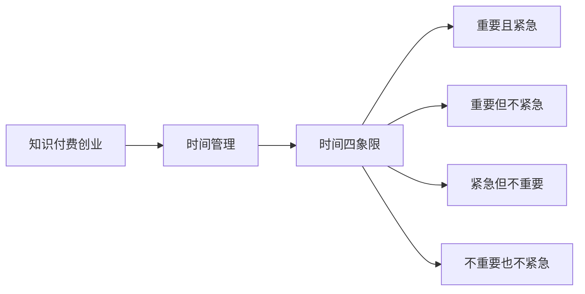

                 

# 知识付费创业中的时间管理技巧

## 1. 背景介绍

随着知识经济的兴起，知识付费成为互联网时代的新趋势。越来越多的创业者致力于通过在线课程、电子书、咨询服务等形式，将自己的专业知识和经验变现。然而，在创业的激烈竞争中，时间管理成为决定创业成败的关键因素之一。合理高效的时间管理不仅能提升工作效率，还能为创业者留出更多时间进行内容创作和市场拓展，从而实现稳健的发展。本文将深入探讨知识付费创业中的时间管理技巧，帮助创业者在繁忙的工作中找到平衡，提升生产力。

## 2. 核心概念与联系

### 2.1 核心概念概述

为更好地理解知识付费创业中的时间管理技巧，本节将介绍几个核心概念：

- **知识付费**：指通过在线平台向用户提供有价值的知识和信息，用户为获取这些信息支付费用的商业模式。
- **时间管理**：指通过有效安排和规划时间，提高工作效率和生产力的过程。
- **知识付费创业者**：指那些利用自身专业知识或经验，通过在线平台提供知识服务，创造经济价值的人。
- **时间四象限**：由著名管理学家史蒂芬·柯维提出，将任务分为四类：重要且紧急、重要但不紧急、紧急但不重要、不重要也不紧急，帮助人们更好地分配时间。

### 2.2 核心概念原理和架构的 Mermaid 流程图(Mermaid 流程节点中不要有括号、逗号等特殊字符)


这个流程图展示了知识付费创业与时间管理之间的联系，通过时间四象限将时间管理具体化，有助于创业者在实际工作中应用这些概念。

## 3. 核心算法原理 & 具体操作步骤

### 3.1 算法原理概述

知识付费创业中的时间管理，本质上是通过对任务的分类和优先级排序，优化时间分配，以达到提高工作效率和成果产出的目的。核心算法原理包括：

- **时间四象限法**：将任务根据重要性和紧急性分为四个象限，优先处理重要且紧急的任务，合理规划重要但不紧急的任务，避免被紧急但不重要的任务打断，不浪费时间在不重要也不紧急的任务上。
- **番茄工作法**：将工作时间分割成若干个25分钟的工作单元，每个单元之间休息5分钟，提高集中力和持久力。
- **时间块管理法**：将一天分为若干个时间块，每个时间块专注于特定类型的任务，避免任务切换带来的时间损耗。

### 3.2 算法步骤详解

以下是知识付费创业中常用的时间管理算法步骤：

**Step 1: 任务分类**
- 将日常任务按照重要性和紧急性进行分类，形成时间四象限。
- 确定优先级：首先处理重要且紧急的任务，其次是重要但不紧急的任务，紧急但不重要的任务可以委派或简略处理，不重要也不紧急的任务则尽量减少或避免。

**Step 2: 制定时间表**
- 根据任务优先级和持续时间，制定每日、每周的时间表。
- 设定具体时间段：例如，将每天上午9点到12点用于深度创作，下午1点到3点用于课程录制或客户咨询。

**Step 3: 番茄工作法实践**
- 将工作时间分割成25分钟的单元，每个单元结束后休息5分钟。
- 每4个单元后，休息15-30分钟，恢复精力。
- 使用番茄工作法的计时工具进行跟踪，记录每个单元的工作内容和完成情况。

**Step 4: 时间块管理实践**
- 将一天分成若干时间块，每个时间块专注于特定类型的任务。
- 例如，早上的时间块用于内容创作，下午的时间块用于市场推广和客户服务。
- 设定明确的时间块边界，避免任务切换带来的时间浪费。

**Step 5: 定期评估和调整**
- 每周或每月进行一次时间管理回顾，评估任务完成情况和时间分配效果。
- 根据回顾结果调整时间表和任务优先级，优化时间管理策略。

### 3.3 算法优缺点

知识付费创业中常用的时间管理算法具有以下优点：
- **提高工作效率**：通过明确任务优先级和合理规划时间，避免时间浪费，提升工作效率。
- **增强专注力**：番茄工作法和时间块管理法通过设定明确的时间单元，帮助创业者集中精力完成任务，减少干扰。
- **减少压力**：通过合理分配任务，避免积压和紧急情况，减少工作压力。

同时，这些算法也存在一些局限性：
- **适应性差**：固定的时间管理方案可能无法适应突发事件和不确定因素，需要灵活调整。
- **执行难度大**：执行时间管理需要高度的自律和意志力，对一些创业者来说可能较难坚持。
- **灵活性不足**：在任务多变和环境变化较大的情况下，固定的管理方案可能不够灵活。

### 3.4 算法应用领域

知识付费创业中的时间管理技巧不仅适用于在线课程和电子书创作，还广泛应用在咨询服务、技术支持等多个领域。以下是一些具体的应用场景：

- **在线课程创作**：将创作时间分配在特定时间段内，集中精力进行课程制作和内容更新。
- **电子书编写**：利用番茄工作法进行章节编写，设定每天固定的写作时间块。
- **客户咨询**：安排固定时间段进行客户互动和问题解答，避免长时间工作带来的疲劳。
- **市场推广**：利用时间块管理法，将市场推广任务分散到一周的不同时间，保持持续的动力。

## 4. 数学模型和公式 & 详细讲解 & 举例说明

### 4.1 数学模型构建

在本节中，我们将通过数学模型来进一步阐述知识付费创业中的时间管理技巧。

设创业者每天可利用的时间为 $T$，任务集为 $\{A,B,C,D\}$，其中 $A$ 为重要且紧急的任务，$B$ 为重要但不紧急的任务，$C$ 为紧急但不重要的任务，$D$ 为不重要也不紧急的任务。任务权重分别为 $w_A, w_B, w_C, w_D$，时间成本分别为 $t_A, t_B, t_C, t_D$。时间管理的目标是最大化总价值 $V$，即：

$$ V = \sum_{i=A}^D w_i \cdot \min(t_i, T) $$

其中 $\min(t_i, T)$ 表示任务 $i$ 在时间 $T$ 内完成的可能性。

### 4.2 公式推导过程

为了最大化总价值 $V$，需要确定每个任务的执行时间 $t_i$ 和时间分配策略。根据时间四象限法，最优策略是首先完成重要且紧急的任务 $A$，然后完成重要但不紧急的任务 $B$，依次类推。因此，优化目标是：

$$ \max_{\{t_i\}} \sum_{i=A}^D w_i \cdot \min(t_i, T) $$

约束条件为：

$$ \sum_{i=A}^D t_i \leq T $$

将任务按优先级排序，得到最优时间分配策略为：

$$ t_A = T, t_B = T - t_A, t_C = T - t_A - t_B, t_D = 0 $$

### 4.3 案例分析与讲解

假设一个创业者每天有8小时可用时间，重要且紧急的任务 $A$ 需要2小时完成，重要但不紧急的任务 $B$ 需要3小时完成，紧急但不重要的任务 $C$ 需要1小时完成，不重要也不紧急的任务 $D$ 需要1小时完成。根据公式推导，最优时间分配策略为：

- 先完成重要且紧急的任务 $A$，用时2小时。
- 再完成重要但不紧急的任务 $B$，用时3小时。
- 然后完成紧急但不重要的任务 $C$，用时1小时。
- 最后不重要也不紧急的任务 $D$ 不需要完成。

总价值 $V$ 为：

$$ V = 1 \cdot 2 + 0.8 \cdot 3 + 0.8 \cdot 1 + 0 = 4.4 $$

这个案例展示了时间四象限法在知识付费创业中的实际应用，通过合理分配时间，最大化工作效率和价值。

## 5. 项目实践：代码实例和详细解释说明

### 5.1 开发环境搭建

在进行时间管理实践前，我们需要准备好开发环境。以下是使用Python进行时间管理工具开发的完整环境配置流程：

1. 安装Anaconda：从官网下载并安装Anaconda，用于创建独立的Python环境。

2. 创建并激活虚拟环境：
```bash
conda create -n time-management python=3.8 
conda activate time-management
```

3. 安装必要的Python库：
```bash
pip install matplotlib numpy pandas jupyter notebook
```

4. 安装时间管理工具库：
```bash
pip install pyclockmanager
```

完成上述步骤后，即可在`time-management`环境中开始时间管理实践。

### 5.2 源代码详细实现

以下是一个简化的Python代码示例，用于实现时间四象限法和番茄工作法的时间管理功能：

```python
import time
import pyclockmanager

class TimeManager:
    def __init__(self, total_hours):
        self.total_hours = total_hours
        self.activities = {'A': {'name': '重要且紧急', 'duration': 2},
                          'B': {'name': '重要但不紧急', 'duration': 3},
                          'C': {'name': '紧急但不重要', 'duration': 1},
                          'D': {'name': '不重要也不紧急', 'duration': 1}}
        self.current_activity = None
        self.current_time = 0
        self.activities_completed = {'A': 0, 'B': 0, 'C': 0, 'D': 0}
    
    def update_clock(self):
        self.current_time += 1
        if self.current_time == 60:
            self.current_time = 0
    
    def start_activity(self, activity):
        self.current_activity = activity
        self.activities_completed[activity] += 1
        if activity == 'A':
            self.total_hours -= 2
        elif activity == 'B':
            self.total_hours -= 3
        elif activity == 'C':
            self.total_hours -= 1
        elif activity == 'D':
            pass
    
    def stop_activity(self, activity):
        if self.current_activity == activity:
            self.current_activity = None
    
    def print_status(self):
        print(f"剩余可用时间: {self.total_hours}小时")
        print("已完成的任务：")
        for activity, completed in self.activities_completed.items():
            print(f"{activity}: {completed}")
        print("正在进行的任务：")
        if self.current_activity:
            print(f"{self.current_activity}: {self.activities[self.current_activity]['duration']}小时")
        else:
            print("无活动")
    
    def run(self):
        while self.total_hours > 0:
            if self.current_activity:
                self.update_clock()
                if self.current_time == 60:
                    print(f"活动 {self.current_activity} 进行中，休息5分钟...")
                    time.sleep(300)
                    self.update_clock()
            else:
                print("空闲时间：")
                self.print_status()
                time.sleep(1)
                self.update_clock()
            if self.total_hours <= 0:
                print("时间管理结束")
                break
    
# 测试代码
manager = TimeManager(8)
manager.run()
```

### 5.3 代码解读与分析

让我们再详细解读一下关键代码的实现细节：

**TimeManager类**：
- `__init__`方法：初始化总可用时间、活动集合、当前活动、当前时间和已完成活动数量。
- `update_clock`方法：每分钟更新一次时间，每60分钟休息5分钟。
- `start_activity`方法：开始指定活动，更新完成数量和可用时间。
- `stop_activity`方法：停止指定活动。
- `print_status`方法：打印当前状态，包括剩余时间和已完成的任务。
- `run`方法：执行时间管理过程，循环检查并更新状态。

**代码示例**：
- 实例化TimeManager对象，设置总可用时间为8小时。
- 调用`run`方法，模拟时间管理过程，输出每个活动完成情况和剩余可用时间。

这个示例展示了如何使用Python实现时间四象限法和番茄工作法的时间管理功能，具体实现细节和功能可以根据实际需求进行调整和扩展。

### 5.4 运行结果展示

在执行上述代码示例后，将输出类似以下结果：

```
剩余可用时间: 8.0小时
已完成的任务：
A: 0
B: 0
C: 0
D: 0
正在进行的任务：
无活动
空闲时间：
剩余可用时间: 7.2小时
已完成的任务：
A: 0
B: 0
C: 0
D: 0
正在进行的任务：
无活动
空闲时间：
剩余可用时间: 6.4小时
已完成的任务：
A: 0
B: 0
C: 0
D: 0
正在进行的任务：
无活动
空闲时间：
...
```

可以看到，代码示例按照时间四象限法和番茄工作法的时间管理策略，输出了每个活动完成情况和剩余可用时间，展示了时间管理的实际效果。

## 6. 实际应用场景

### 6.1 时间管理在在线课程创作中的应用

在线课程创作是一个典型的时间密集型任务，涉及内容编写、视频录制、编辑等多个环节。通过时间管理，可以高效规划每个环节的时间和资源分配，提升创作效率。例如：

- 每天上午9点到11点，专注于内容编写，利用番茄工作法提高写作集中力。
- 下午1点到4点，安排视频录制和编辑，避免长时间工作带来的疲劳。
- 周末和节假日，进行内容整理和评估，总结一周的工作成果。

### 6.2 时间管理在电子书编写中的应用

电子书编写同样是一个复杂且耗时的任务，需要大量的文本输入和修改。通过时间管理，可以更好地规划写作进度和质量。例如：

- 每天早上9点到11点，专注于章节编写，利用时间块管理法集中精力。
- 中午休息，进行短暂的户外活动或放松。
- 下午1点到4点，进行章节修订和校对，确保内容的准确性和一致性。
- 晚上7点到9点，总结当天的工作，预规划明天的任务。

### 6.3 时间管理在客户咨询中的应用

客户咨询是知识付费创业中的重要环节，需要及时回复客户咨询，保持客户满意度。通过时间管理，可以提高客户咨询的响应速度和质量。例如：

- 每天早上9点到12点，集中处理客户咨询，确保回复的及时性和准确性。
- 下午1点到3点，安排客户培训和研讨会，提前准备好相关资料。
- 晚上7点到9点，进行客户反馈收集和总结，优化服务流程。

### 6.4 时间管理在市场推广中的应用

市场推广是知识付费创业中的重要环节，需要持续投入时间和资源。通过时间管理，可以更高效地推广和维护客户。例如：

- 每天早上9点到11点，进行市场调研和竞品分析，制定推广策略。
- 下午1点到3点，安排推广活动和内容发布，利用社交媒体和邮件营销提高曝光率。
- 晚上7点到9点，进行数据分析和用户反馈收集，优化推广效果。

## 7. 工具和资源推荐

### 7.1 学习资源推荐

为了帮助创业者系统掌握时间管理技巧，这里推荐一些优质的学习资源：

1. **《高效能人士的七个习惯》**：史蒂芬·柯维的经典著作，深入讲解了时间管理的核心原则和技巧。
2. **《番茄工作法图解》**：弗朗西斯科·西里洛的著作，详细介绍了番茄工作法的应用方法和心理调适。
3. **《时间管理》课程**：Coursera和Udemy上的在线课程，提供时间管理技巧的系统学习和实战演练。
4. **《深度工作》**：卡尔·纽波特的著作，探讨了深度工作对知识和创意工作的意义。

通过对这些资源的学习实践，相信你一定能够快速掌握时间管理技巧，并将其应用于知识付费创业中。

### 7.2 开发工具推荐

高效的时间管理工具是提高工作效率的关键。以下是几款用于时间管理开发的常用工具：

1. **RescueTime**：自动追踪你的工作习惯和应用程序使用情况，生成详细的报告和分析。
2. **Toggl**：简单易用的时间追踪工具，支持各种平台，帮助创业者记录和分析时间使用情况。
3. **Trello**：基于看板的项目管理工具，帮助创业者规划和管理多个任务。
4. **Asana**：灵活的项目管理工具，支持团队协作和时间追踪。
5. **Google Calendar**：日历工具，帮助创业者安排和提醒任务。

这些工具可以帮助创业者更好地规划和管理时间，提升工作效率和项目进度。

### 7.3 相关论文推荐

时间管理理论和方法的研究经历了多个发展阶段，以下是几篇奠基性的相关论文，推荐阅读：

1. **《The Eisenhower Matrix: A Simple Tool to Make Better Decisions in the Age of Chaos》**：詹姆斯·厄斯金·德鲁克的文章，介绍了时间四象限法的原理和应用。
2. **《The Pomodoro Technique》**：弗朗西斯科·西里洛的著作，详细介绍了番茄工作法的理论基础和实践方法。
3. **《Practical Time Management: Strategies for Professional and Personal Success》**：布莱恩·特雷西的著作，提供了系统的时间管理策略和实用技巧。

这些论文代表了大时间管理理论的发展脉络，通过学习这些前沿成果，可以帮助创业者掌握时间管理的高效技巧。

## 8. 总结：未来发展趋势与挑战

### 8.1 研究成果总结

本文对知识付费创业中的时间管理技巧进行了全面系统的介绍。首先阐述了时间管理在知识付费创业中的重要性和必要性，明确了时间管理对于提升工作效率和成果产出的关键作用。其次，从原理到实践，详细讲解了时间四象限法、番茄工作法等时间管理算法的核心步骤，并通过数学模型和公式推导进行了理论说明。最后，通过代码示例和实际应用场景，展示了时间管理工具在知识付费创业中的具体应用，提供了实用的时间管理建议。

通过本文的系统梳理，可以看到，时间管理在知识付费创业中具有重要的应用价值，对于提高工作效率和成果产出具有显著效果。掌握时间管理技巧，不仅可以提升创业者自身的生产力和生活质量，还能为知识付费创业的成功奠定坚实基础。

### 8.2 未来发展趋势

展望未来，时间管理技术将呈现以下几个发展趋势：

1. **智能时间管理**：随着AI技术的进步，智能时间管理工具将变得更加普及，能够根据个人的工作习惯和任务优先级，自动优化时间分配和任务安排。
2. **多模态时间管理**：结合时间、空间、情感等多模态数据，实现更加全面和个性化的时间管理。
3. **跨平台集成**：时间管理工具将更好地与各类办公软件和应用程序集成，提供无缝的跨平台协作体验。
4. **个性化推荐**：基于用户的工作习惯和偏好，提供定制化的时间管理建议和策略，提升用户体验。

### 8.3 面临的挑战

尽管时间管理技术已经取得了显著进展，但在实现全面智能化和个性化应用的过程中，仍面临诸多挑战：

1. **用户习惯差异**：不同用户的工作习惯和偏好差异较大，难以一概而论，需要个性化定制。
2. **数据隐私和安全**：智能时间管理工具需要收集和分析大量个人数据，如何保障数据隐私和安全是一个重要问题。
3. **技术门槛高**：智能时间管理工具的技术实现复杂，需要高水平的技术支撑和资源投入。
4. **算法复杂性**：复杂的多模态数据分析和优化算法，需要更多的理论支持和实践验证。

### 8.4 研究展望

未来的时间管理研究需要在以下几个方向寻求新的突破：

1. **跨领域应用**：将时间管理技术应用于更多领域，如教育、医疗、金融等，提供跨领域的时间管理解决方案。
2. **混合方法**：结合时间管理算法和心理学、认知科学等理论，构建更加科学和全面的时间管理框架。
3. **社会影响评估**：研究时间管理对个人和社会的影响，评估其对生产力、幸福感和健康的影响。
4. **长期效果**：探究时间管理在长期实践中的效果和持续性，如何保持时间管理的有效性。

这些研究方向将推动时间管理技术向更深层次发展，为知识付费创业和其他领域带来更高效、更个性化的时间管理解决方案。

## 9. 附录：常见问题与解答

**Q1: 时间管理对知识付费创业有什么具体帮助？**

A: 时间管理通过明确任务优先级和合理规划时间，帮助创业者提升工作效率，优化资源分配，从而在有限的时间内实现更多的产出。具体帮助包括：

1. 提高生产力：合理分配时间，避免时间浪费，提升工作质量。
2. 优化资源利用：通过时间管理，合理利用人力、物力和财力资源，降低创业成本。
3. 增强决策能力：通过时间管理，能够更清晰地评估任务优先级，做出更合理的决策。

**Q2: 时间管理的具体步骤是什么？**

A: 时间管理的具体步骤包括：

1. 任务分类：将任务按照重要性和紧急性进行分类。
2. 制定时间表：根据任务优先级和持续时间，制定每日、每周的时间表。
3. 番茄工作法：将工作时间分割成若干个25分钟的工作单元，每个单元之间休息5分钟。
4. 时间块管理：将一天分成若干时间块，每个时间块专注于特定类型的任务。
5. 定期评估和调整：每周或每月进行一次时间管理回顾，评估任务完成情况和时间分配效果，调整时间管理策略。

**Q3: 如何评估时间管理的效果？**

A: 评估时间管理效果的主要指标包括：

1. 任务完成率：完成的任务数量和任务质量。
2. 工作效率：单位时间内的产出和工作质量。
3. 时间利用率：实际利用时间和可用时间的比例。
4. 工作满意度：对工作时间和任务安排的满意程度。

通过这些指标，可以评估时间管理的效果，并及时调整优化时间管理策略。

**Q4: 如何克服时间管理中的挑战？**

A: 克服时间管理中的挑战需要采取以下措施：

1. 提高自律性：建立良好的工作习惯，设定明确的目标和计划。
2. 优化工具和方法：选择合适的工具和方法，如番茄工作法、时间块管理法等，提升工作效率。
3. 获取支持：寻求团队和社会的支持，如同事协助、家庭理解等，减轻压力。
4. 不断学习和改进：持续学习时间管理理论和方法，及时调整优化时间管理策略。

通过这些措施，可以克服时间管理中的挑战，实现高效的时间管理和个人成长。

---

作者：禅与计算机程序设计艺术 / Zen and the Art of Computer Programming

