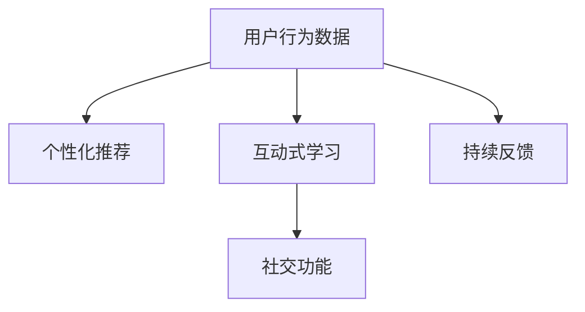

                 

# 知识付费创业中的用户体验优化

> 关键词：知识付费、用户体验、界面设计、个性化推荐、互动式学习、社交功能、持续反馈

## 1. 背景介绍

### 1.1 问题由来

在知识付费领域，用户体验（User Experience，UX）优化始终是成功的关键。近年来，随着互联网技术的进步和教育内容的多样化，知识付费平台呈现爆发式增长。据艾媒咨询发布的《2021年中国知识付费市场研究报告》显示，2021年中国知识付费市场规模已达194.1亿元，预测2025年将达到2,279.7亿元。然而，面对如此庞大的市场，如何在激烈竞争中脱颖而出，留住用户，提升用户体验，成为了所有知识付费平台面临的共同挑战。

### 1.2 问题核心关键点

知识付费平台的用户体验优化，主要围绕以下几个核心点展开：

- **界面设计**：直观、美观、易用的界面设计，能显著提升用户的使用体验，提高平台的用户留存率。
- **个性化推荐**：通过精准的个性化推荐，提升用户的学习效率，增强用户的粘性。
- **互动式学习**：通过互动式的学习方式，如提问、讨论、反馈等，提高用户的学习动机和参与度。
- **社交功能**：社交功能能够满足用户的社交需求，构建社区氛围，增强用户的归属感和互动性。
- **持续反馈**：收集用户的使用反馈，不断迭代优化平台功能和内容，提高用户体验。

本文将从这些核心点出发，探讨如何通过技术手段提升知识付费平台的用户体验。

## 2. 核心概念与联系

### 2.1 核心概念概述

为了更好地理解知识付费平台的用户体验优化，我们将介绍几个核心概念：

- **用户体验（UX）**：是指用户在使用产品或服务过程中，对其功能性、可用性、易用性、安全性等方面的整体感受。在知识付费平台中，用户体验涵盖了从内容选择、平台界面到互动学习全过程的每一个细节。

- **个性化推荐**：指通过分析用户行为数据，推荐最符合用户兴趣和需求的内容。个性化推荐能够提高用户的满意度，增加用户停留时间。

- **互动式学习**：指通过用户与平台之间的互动，增强学习效果和用户体验。互动式学习包括提问、讨论、社交等形式。

- **社交功能**：指通过构建社区、建立关系网络、组织讨论等方式，增强用户的互动和归属感，构建社区氛围。

- **持续反馈**：指通过定期收集用户反馈，及时调整平台功能和内容，提升用户体验。

这些核心概念之间的逻辑关系可以通过以下Mermaid流程图来展示：



这个流程图展示了用户体验优化过程中，用户行为数据的关键作用。通过分析这些数据，我们可以实现个性化推荐、互动式学习、社交功能，并通过持续反馈不断优化用户体验。

## 3. 核心算法原理 & 具体操作步骤

### 3.1 算法原理概述

知识付费平台的用户体验优化，主要依赖以下算法原理：

- **协同过滤推荐算法**：通过分析用户的历史行为数据，预测用户未发现内容的偏好，从而进行个性化推荐。
- **内容过滤推荐算法**：基于内容的相似性，推荐与用户已消费内容相似的新内容。
- **深度学习模型**：利用深度学习模型，如RNN、LSTM、BERT等，提取用户行为数据中的隐含特征，进行精准推荐。
- **强化学习**：通过模拟用户行为，不断优化推荐策略，提高用户体验。

### 3.2 算法步骤详解

基于上述算法原理，知识付费平台的用户体验优化一般包括以下关键步骤：

**Step 1: 数据收集与分析**

- 收集用户的行为数据，如浏览记录、点击率、评分等。
- 分析用户数据，挖掘用户的行为模式和兴趣偏好。
- 构建用户画像，为个性化推荐和互动式学习提供依据。

**Step 2: 个性化推荐算法**

- 设计个性化推荐算法，如协同过滤、内容过滤、深度学习等。
- 在推荐算法中引入实时学习机制，动态更新推荐模型。
- 对推荐算法进行优化，提高推荐精度和效率。

**Step 3: 互动式学习算法**

- 设计互动式学习模块，如问答、讨论、打卡等。
- 引入社交功能，构建学习社区，增强用户互动。
- 收集用户反馈，不断优化互动式学习模块。

**Step 4: 社交功能实现**

- 实现用户社交功能，如关注、点赞、评论、分享等。
- 构建社区氛围，通过话题讨论、兴趣小组等方式，增强用户互动。
- 分析用户社交数据，进行社交网络分析，优化用户推荐。

**Step 5: 持续反馈机制**

- 收集用户反馈，分析用户满意度。
- 根据用户反馈，优化平台功能和内容。
- 引入A/B测试，验证改进措施的效果，持续迭代优化。

### 3.3 算法优缺点

知识付费平台的用户体验优化算法具有以下优点：

- **个性化推荐**：能够提升用户的学习效率，增强用户粘性。
- **互动式学习**：通过互动增强用户参与度，提高学习效果。
- **社交功能**：满足用户的社交需求，构建社区氛围，增强归属感。

同时，这些算法也存在一些缺点：

- **数据隐私问题**：用户在平台上的行为数据可能涉及隐私，需要进行严格的数据保护。
- **推荐偏差**：推荐算法可能存在偏差，导致推荐结果不公平。
- **算法复杂度**：部分算法如深度学习模型的复杂度较高，对计算资源有较高要求。
- **实时性问题**：实时学习机制可能对系统性能造成影响。

尽管存在这些局限性，但通过合理的算法设计和实施，可以最大限度地提升知识付费平台的用户体验。

### 3.4 算法应用领域

知识付费平台的用户体验优化算法，已经在多个领域得到了应用，例如：

- **在线教育平台**：如Coursera、Udacity等，通过个性化推荐和互动式学习，提高用户的学习效率和体验。
- **职业培训平台**：如LinkedIn Learning、Skillshare等，通过社交功能和持续反馈，满足用户的职业发展需求。
- **学术研究平台**：如ResearchGate、ACM Digital Library等，通过社区建设和知识共享，促进学术交流和合作。
- **公共知识分享平台**：如TED、YouTube等，通过社交互动和持续反馈，提升用户参与度和平台活力。

这些领域的应用，展示了用户体验优化算法的广泛适用性和强大潜力。

## 4. 数学模型和公式 & 详细讲解 & 举例说明

### 4.1 数学模型构建

本节将使用数学语言对知识付费平台的用户体验优化算法进行更加严格的刻画。

假设用户行为数据为 $D=\{(x_i,y_i)\}_{i=1}^N$，其中 $x_i$ 为用户的浏览记录， $y_i$ 为用户对内容的评分。

定义用户行为数据矩阵 $X \in \mathbb{R}^{N \times M}$，其中 $X_{i,j}$ 表示用户 $i$ 对内容 $j$ 的评分。

个性化推荐算法的目标是最小化预测误差，即：

$$
\min_{\theta} \sum_{i=1}^N \sum_{j=1}^M (y_{i,j} - f(X_{i,j}; \theta))^2
$$

其中 $f(X_{i,j}; \theta)$ 为推荐模型，$\theta$ 为模型参数。

### 4.2 公式推导过程

以下我们以协同过滤推荐算法为例，推导个性化推荐模型的具体形式。

假设协同过滤算法采用用户-物品的评分矩阵 $R \in \mathbb{R}^{N \times M}$，其中 $R_{i,j}$ 表示用户 $i$ 对内容 $j$ 的评分。协同过滤的目标是预测用户未评分内容的评分，从而进行个性化推荐。

协同过滤算法通常分为基于用户的协同过滤和基于物品的协同过滤两种。这里以基于用户的协同过滤为例，推导推荐模型的形式。

基于用户的协同过滤算法使用用户-用户相似度矩阵 $U \in \mathbb{R}^{N \times N}$，其中 $U_{i,j}$ 表示用户 $i$ 和用户 $j$ 的相似度。推荐模型 $f(X_{i,j}; \theta)$ 为：

$$
f(X_{i,j}; \theta) = \sum_{k=1}^N \alpha_k \theta_k R_{k,j}
$$

其中 $\alpha_k$ 为用户的相似度加权系数，$\theta_k$ 为内容的权重参数。

### 4.3 案例分析与讲解

**案例分析**：假设某知识付费平台收集了1000位用户和5000篇文章的评分数据。通过协同过滤算法，计算每位用户对未评分文章的评分，并将评分结果推荐给用户。

**讲解**：协同过滤算法首先构建用户-用户相似度矩阵 $U \in \mathbb{R}^{1000 \times 1000}$，计算用户间的相似度。然后，根据用户-物品评分矩阵 $R \in \mathbb{R}^{1000 \times 5000}$，计算每位用户对未评分文章的预测评分，从而进行个性化推荐。

## 5. 项目实践：代码实例和详细解释说明

### 5.1 开发环境搭建

在进行用户体验优化项目实践前，我们需要准备好开发环境。以下是使用Python进行Flask框架开发的环境配置流程：

1. 安装Anaconda：从官网下载并安装Anaconda，用于创建独立的Python环境。

2. 创建并激活虚拟环境：
```bash
conda create -n flask-env python=3.8 
conda activate flask-env
```

3. 安装Flask：使用pip安装Flask，并配置项目依赖：
```bash
pip install flask
```

4. 安装Flask相关工具包：
```bash
pip install flask_sqlalchemy flask_apis flask_login flask_wtf flask_bcrypt flask_marshmallow
```

5. 安装数据库：安装SQLite数据库，用于存储用户行为数据。

完成上述步骤后，即可在`flask-env`环境中开始项目实践。

### 5.2 源代码详细实现

下面以一个简单的知识付费平台为例，给出使用Flask框架实现个性化推荐和互动式学习的代码实现。

```python
from flask import Flask, request, render_template, jsonify
from flask_sqlalchemy import SQLAlchemy
from flask_login import LoginManager, login_user, logout_user, login_required, current_user
from flask_bcrypt import Bcrypt
from flask_marshmallow import Marshmallow

# 初始化Flask应用
app = Flask(__name__)
app.config['SECRET_KEY'] = 'mysecretkey'
app.config['SQLALCHEMY_DATABASE_URI'] = 'sqlite:///users.db'
app.config['SQLALCHEMY_TRACK_MODIFICATIONS'] = False
app.config['bcrypt'] = Bcrypt(app)

# 初始化SQLAlchemy
db = SQLAlchemy(app)
ma = Marshmallow(app)

# 定义用户模型
class User(db.Model):
    id = db.Column(db.Integer, primary_key=True)
    username = db.Column(db.String(100), unique=True)
    password_hash = db.Column(db.String(100))
    scores = db.relationship('Score', backref='user', lazy='dynamic')

class Score(db.Model):
    id = db.Column(db.Integer, primary_key=True)
    user_id = db.Column(db.Integer, db.ForeignKey('user.id'))
    content_id = db.Column(db.Integer)
    score = db.Column(db.Float)

# 定义用户Schema
class UserSchema(ma.SQLAlchemyAutoSchema):
    class Meta:
        model = User
        fields = ('id', 'username', 'scores')

# 初始化用户Schema
user_schema = UserSchema()
users_schema = UserSchema(many=True)

# 定义登录和登出逻辑
@login_manager.user_loader
def load_user(user_id):
    return User.query.get(int(user_id))

@app.route('/login', methods=['POST'])
def login():
    username = request.json.get('username')
    password = request.json.get('password')
    
    user = User.query.filter_by(username=username).first()
    if not user or not bcrypt.check_password_hash(user.password_hash, password):
        return jsonify({'error': 'Invalid username or password'}), 401
    
    login_user(user)
    return jsonify({'message': 'Login successful'})

@app.route('/logout')
@login_required
def logout():
    logout_user()
    return jsonify({'message': 'Logout successful'})

# 定义用户行为数据模型
class UserBehavior(db.Model):
    id = db.Column(db.Integer, primary_key=True)
    user_id = db.Column(db.Integer, db.ForeignKey('user.id'))
    content_id = db.Column(db.Integer)
    timestamp = db.Column(db.DateTime, default=datetime.utcnow)

class UserBehaviorSchema(ma.SQLAlchemyAutoSchema):
    class Meta:
        model = UserBehavior
        fields = ('id', 'user_id', 'content_id', 'timestamp')

# 初始化用户行为数据Schema
behavior_schema = UserBehaviorSchema()
behaviors_schema = UserBehaviorSchema(many=True)

# 定义个性化推荐算法
def collaborative_filtering(user_id, content_id):
    user_scores = UserBehavior.query.filter_by(user_id=user_id, content_id=content_id).all()
    if len(user_scores) > 0:
        user_score = user_scores[0].score
        return user_score
    else:
        return None

# 定义互动式学习模块
@app.route('/study', methods=['POST'])
@login_required
def study():
    user_id = current_user.id
    content_id = request.json.get('content_id')
    
    # 查询用户行为数据
    user_scores = UserBehavior.query.filter_by(user_id=user_id, content_id=content_id).all()
    
    # 计算用户对内容的评分
    user_score = collaborative_filtering(user_id, content_id)
    if user_score is None:
        score = 1 # 初始化评分
    else:
        score = user_score
    
    # 保存用户行为数据
    new_behavior = UserBehavior(user_id=user_id, content_id=content_id, score=score)
    db.session.add(new_behavior)
    db.session.commit()
    
    # 返回推荐结果
    return jsonify({'score': score})

# 运行Flask应用
if __name__ == '__main__':
    app.run(debug=True)
```

### 5.3 代码解读与分析

让我们再详细解读一下关键代码的实现细节：

**User和UserBehavior模型**：
- 定义了用户和用户行为数据两个模型，用于存储用户信息和行为数据。
- 使用SQLAlchemy进行数据库操作，通过ORM（对象关系映射）实现数据建模。

**UserSchema和UserBehaviorSchema**：
- 定义了用户和用户行为数据的Schema，用于序列化和反序列化数据。
- 使用Marshmallow进行数据验证和序列化。

**登录和登出逻辑**：
- 实现用户登录和登出的逻辑，使用bcrypt进行密码加密。

**个性化推荐算法**：
- 实现基于协同过滤的个性化推荐算法，根据用户的行为数据计算评分。

**互动式学习模块**：
- 实现互动式学习模块，通过POST请求接收用户的学习行为数据，并计算评分。
- 使用Flask的装饰器@login_required进行身份验证，确保只有登录用户才能访问学习模块。

**运行Flask应用**：
- 运行Flask应用，通过debug=True开启调试模式，方便开发和测试。

## 6. 实际应用场景

### 6.1 智能客服

智能客服系统可以通过用户体验优化算法，提升用户满意度。例如，某在线教育平台通过个性化推荐和互动式学习，提高了用户的学习效率和体验。平台使用协同过滤算法，根据用户的学习记录和行为数据，推荐最适合的内容。同时，通过互动式学习模块，用户可以随时提问和讨论，获取即时反馈，提高学习效果。

### 6.2 知识图谱构建

知识图谱构建是知识付费平台的重要应用场景。通过用户体验优化算法，平台可以更好地收集和分析用户的行为数据，构建更加全面和准确的知识图谱。例如，某学术研究平台通过分析用户的研究兴趣和论文阅读行为，构建了领域内知识图谱，大大提升了用户的科研效率。

### 6.3 内容创作激励

内容创作激励是知识付费平台的重要功能之一。通过用户体验优化算法，平台可以更好地了解用户的需求和兴趣，鼓励用户创作高质量内容。例如，某在线写作平台通过个性化推荐和互动式学习，提高了用户的创作热情。平台通过分析用户的阅读和反馈数据，推荐用户感兴趣的主题和内容，激发用户的创作灵感。

### 6.4 未来应用展望

随着用户体验优化算法的不断进步，未来的知识付费平台将呈现以下几个趋势：

- **实时个性化推荐**：基于实时数据流进行个性化推荐，提升用户的学习效率和体验。
- **多模态学习**：结合文字、图片、视频等多种形式的内容，提供更加丰富和多样化的学习体验。
- **增强现实学习**：利用AR技术，增强用户的学习体验，提高学习效果。
- **社交化学习**：构建更加紧密的社区关系，促进用户之间的交流和合作。

## 7. 工具和资源推荐

### 7.1 学习资源推荐

为了帮助开发者系统掌握用户体验优化的技术基础和实践技巧，这里推荐一些优质的学习资源：

1. **《UX设计基础》课程**：由Coursera提供的UX设计基础课程，涵盖用户体验设计的基本原则和实践方法。
2. **《用户体验设计实战》书籍**：Jesse James Garrett所著，全面介绍了用户体验设计的理论和方法。
3. **《UX设计之美》书籍**：Jakob Nielsen所著，深入浅出地讲解了用户体验设计的核心要素。
4. **《设计心理学》书籍**：Don Norman所著，介绍了心理学在用户体验设计中的应用。
5. **《UX设计指南》网站**：Nielsen Norman Group提供的UX设计指南，涵盖用户体验设计的方方面面。

### 7.2 开发工具推荐

高效的开发离不开优秀的工具支持。以下是几款用于用户体验优化开发的常用工具：

1. **Flask框架**：轻量级、易用、灵活的Python Web框架，适合快速开发原型和API。
2. **SQLAlchemy**：Python的ORM库，支持多数据库，方便数据建模和操作。
3. **bcrypt库**：Python的密码加密库，保证用户密码的安全。
4. **Flask_Login扩展**：提供用户认证和授权功能，方便实现用户登录和登出。
5. **Flask_Bcrypt扩展**：提供密码哈希函数，方便密码的存储和验证。
6. **Flask_SqlAlchemy扩展**：提供SQLAlchemy的Flask集成，方便数据库操作。
7. **Flask_Marshmallow扩展**：提供序列化和反序列化功能，方便数据交互。

### 7.3 相关论文推荐

用户体验优化算法的研究源于学界的持续研究。以下是几篇奠基性的相关论文，推荐阅读：

1. **《个性化推荐系统研究综述》**：综述了个性化推荐系统的主要算法和技术。
2. **《协同过滤推荐算法》**：详细介绍了基于协同过滤的推荐算法。
3. **《深度学习在推荐系统中的应用》**：介绍了深度学习模型在推荐系统中的应用。
4. **《交互式学习系统研究》**：介绍了交互式学习系统的理论和技术。
5. **《社交网络分析》**：介绍了社交网络分析的方法和应用。

这些论文代表了大语言模型微调技术的发展脉络。通过学习这些前沿成果，可以帮助研究者把握学科前进方向，激发更多的创新灵感。

## 8. 总结：未来发展趋势与挑战

### 8.1 研究成果总结

本文对知识付费平台的用户体验优化算法进行了全面系统的介绍。首先阐述了用户体验优化的背景和意义，明确了个性化推荐、互动式学习、社交功能、持续反馈等关键技术的作用。其次，从原理到实践，详细讲解了个性化推荐和互动式学习的数学模型和算法步骤，给出了具体的代码实现。同时，本文还广泛探讨了用户体验优化在智能客服、知识图谱构建、内容创作激励等多个领域的应用前景，展示了用户体验优化的强大潜力。最后，本文精选了用户体验优化技术的各类学习资源，力求为开发者提供全方位的技术指引。

通过本文的系统梳理，可以看到，用户体验优化技术在大语言模型微调中的应用，不仅提升了知识付费平台的用户体验，也为其他领域的智能应用提供了有益的参考。未来，伴随用户体验优化算法的持续演进，知识付费平台将能够更好地满足用户需求，提升平台的竞争力和市场份额。

### 8.2 未来发展趋势

展望未来，知识付费平台的用户体验优化技术将呈现以下几个发展趋势：

- **智能化推荐**：通过深度学习和大数据分析，实现更加精准和智能化的推荐。
- **多模态学习**：结合文字、图片、视频等多种形式的内容，提供更加丰富和多样化的学习体验。
- **增强现实学习**：利用AR技术，增强用户的学习体验，提高学习效果。
- **社交化学习**：构建更加紧密的社区关系，促进用户之间的交流和合作。

以上趋势凸显了用户体验优化技术的广阔前景。这些方向的探索发展，必将进一步提升知识付费平台的性能和应用范围，为知识付费平台的智能化、个性化、社交化提供新的技术路径。

### 8.3 面临的挑战

尽管用户体验优化技术已经取得了显著进展，但在迈向更加智能化、个性化、社交化应用的过程中，它仍面临着诸多挑战：

- **数据隐私问题**：用户在平台上的行为数据涉及隐私，需要进行严格的数据保护。
- **算法复杂度**：部分算法如深度学习模型的复杂度较高，对计算资源有较高要求。
- **实时性问题**：实时数据流的处理和实时个性化推荐，对系统性能和扩展性提出了更高要求。
- **用户反馈机制**：如何收集和处理用户反馈，不断优化平台功能和内容，提升用户体验，仍需进一步探索。

尽管存在这些挑战，但通过合理的算法设计和实施，可以最大限度地提升知识付费平台的用户体验。

### 8.4 研究展望

面对用户体验优化所面临的挑战，未来的研究需要在以下几个方面寻求新的突破：

- **数据隐私保护**：研究和开发更加高效的数据隐私保护技术，确保用户数据的安全和隐私。
- **实时数据处理**：研究实时数据流处理和存储技术，提高推荐系统的实时性。
- **算法优化**：研究和开发更加高效的算法，降低算法复杂度，提高推荐系统效率。
- **用户反馈机制**：研究和开发更加智能和灵活的用户反馈机制，持续优化平台功能和内容。

这些研究方向的探索，必将引领知识付费平台用户体验优化技术的持续进步，为用户带来更加智能化、个性化、社交化的学习体验。总之，通过不断创新和优化，知识付费平台的用户体验优化技术必将在构建人机协同的智能时代中扮演越来越重要的角色。

---

作者：禅与计算机程序设计艺术 / Zen and the Art of Computer Programming

