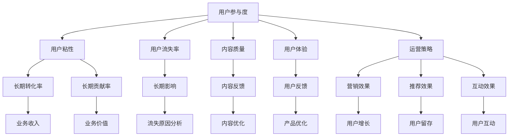

                 

# 知识付费创业中的用户参与度提升策略

## 1. 背景介绍

随着知识经济的兴起，知识付费成为教育、科技、内容娱乐等领域的重要趋势。知识付费不仅为内容创作者提供了新的变现渠道，也为消费者带来了更多优质的学习和娱乐内容。然而，用户参与度低、留存率不高，是知识付费平台的一大痛点。特别是在创业初期，如何有效提升用户参与度，提高用户粘性，成为知识付费平台必须面对的核心问题。

本文章旨在探讨知识付费创业中的用户参与度提升策略，通过科学分析用户行为、数据驱动决策，系统化地提供详尽实用的方法和案例。

## 2. 核心概念与联系

### 2.1 核心概念概述

要深入探讨用户参与度提升策略，首先需要明确几个核心概念：

1. **用户参与度**：指用户对知识付费平台内容的投入和互动行为，如付费购买、阅读、留言、评论等。高参与度用户能够更好地完成知识转化，实现平台价值最大化。

2. **用户粘性**：指用户对平台的长期忠诚度和依赖程度。高粘性用户能够长期持续地贡献流量、转化率和口碑，对平台的发展至关重要。

3. **用户流失率**：指用户因各种原因不再使用平台的比例。高流失率用户表明平台存在严重问题，必须及时改进以避免影响业务。

4. **内容质量**：指知识付费平台上内容的专业性、新颖性、实用性等。优质内容是用户参与和粘性的根本保障。

5. **用户体验**：指用户在使用平台时感受到的便捷性、舒适性、满意度等。良好的用户体验能够提高用户留存率。

6. **运营策略**：指平台通过各种运营手段提升用户参与度的具体方法，包括但不限于营销活动、推荐算法、互动机制等。

### 2.2 核心概念原理和架构的 Mermaid 流程图



以上流程图展示了用户参与度提升策略中的关键概念和它们之间的联系。

## 3. 核心算法原理 & 具体操作步骤

### 3.1 算法原理概述

提升用户参与度的策略需要综合运用多种算法和数据工具，核心原理包括：

1. **用户行为分析**：通过收集和分析用户行为数据，识别出用户对平台的典型行为模式，为策略设计提供依据。

2. **机器学习推荐**：利用协同过滤、深度学习等算法，为用户提供个性化的内容推荐，提高用户留存率。

3. **情感分析与舆情监测**：通过自然语言处理技术，对用户评论和反馈进行情感分析和舆情监测，及时调整内容和运营策略。

4. **多模态数据分析**：结合用户画像、行为数据、社交媒体等多模态数据，进行深入分析，洞察用户需求和行为。

5. **强化学习**：通过模拟用户行为，设计强化学习模型，不断优化运营策略和算法。

### 3.2 算法步骤详解

基于以上核心原理，用户参与度提升策略大致可以分为以下步骤：

1. **数据收集**：通过API、埋点、问卷调查等方式，收集用户行为数据、内容数据、社交媒体数据等。

2. **数据清洗与处理**：去除噪音数据，处理缺失数据，进行数据标准化和归一化，为后续分析打下基础。

3. **用户行为分析**：使用Python等语言，结合Pandas、NumPy、Scikit-learn等工具，进行用户行为数据分析。通过分类、聚类、关联规则等算法，找出用户典型行为模式。

4. **内容质量评估**：通过自然语言处理技术，分析内容的专业性、新颖性、实用性等指标，评估内容质量。

5. **情感分析与舆情监测**：使用自然语言处理库（如NLTK、SpaCy等），进行情感分析和舆情监测，收集用户反馈和评价。

6. **推荐算法设计**：根据用户行为和内容质量，设计协同过滤、深度学习等推荐算法，为用户提供个性化推荐。

7. **强化学习模型构建**：设计强化学习模型，模拟用户行为，不断调整运营策略和算法参数，提升用户参与度。

8. **策略实施与评估**：根据分析结果和推荐算法，设计并实施具体的运营策略。通过A/B测试等方法，评估策略效果，并不断优化。

### 3.3 算法优缺点

用户参与度提升策略中的核心算法主要优点包括：

- 个性化推荐：能显著提升用户留存率，提高用户粘性。
- 数据驱动决策：通过分析用户行为，优化内容质量和用户体验，提高用户满意度。
- 实时调整：通过情感分析和舆情监测，实时调整内容和运营策略。

同时，算法也存在一些缺点：

- 数据隐私问题：用户行为数据可能涉及隐私，需要严格遵守相关法律法规。
- 高运营成本：大规模数据处理和算法模型训练需要较高的技术投入和运营成本。
- 算法复杂性：需要综合运用多种算法和数据工具，设计复杂模型，对技术水平要求较高。

### 3.4 算法应用领域

用户参与度提升策略广泛应用于教育、科技、内容娱乐等知识付费领域，具体包括：

1. **在线教育**：通过个性化推荐和情感分析，提升在线课程的用户参与度，提高用户留存率。

2. **科技资讯**：通过内容质量评估和实时推荐，提升科技文章的用户参与度，增加平台流量和收入。

3. **内容娱乐**：通过情感分析和行为分析，提升娱乐内容的互动效果，提升用户粘性。

## 4. 数学模型和公式 & 详细讲解 & 举例说明

### 4.1 数学模型构建

为了提升用户参与度，需要构建多个数学模型，分别用于不同方面的分析和优化。以下介绍几个核心模型：

1. **用户行为分类模型**：用于将用户行为分为不同类别，识别出典型的用户行为模式。

   - **模型公式**：
     \[
     \begin{aligned}
     C &= \text{argmax}_P \prod_{i=1}^n P(x_i|C_j) \\
     P(x_i|C_j) &= \frac{N(x_i,C_j)}{N(C_j)}
     \end{aligned}
     \]
     其中 $x_i$ 表示用户行为，$C_j$ 表示用户行为分类，$N(x_i,C_j)$ 和 $N(C_j)$ 分别表示用户行为 $x_i$ 和分类 $C_j$ 的频次。

2. **内容质量评估模型**：用于分析内容的专业性、新颖性、实用性等指标。

   - **模型公式**：
     \[
     Q = \sum_{i=1}^m W_i S_i
     \]
     其中 $Q$ 表示内容质量得分，$m$ 表示评估指标的数量，$W_i$ 和 $S_i$ 分别表示指标权重和实际值。

3. **情感分析模型**：用于分析用户对内容的情感倾向。

   - **模型公式**：
     \[
     E = \sum_{i=1}^n w_i e_i
     \]
     其中 $E$ 表示情感得分，$n$ 表示情感词汇数量，$w_i$ 和 $e_i$ 分别表示情感词汇权重和情感得分。

### 4.2 公式推导过程

- **用户行为分类模型推导**：通过最大似然估计，找到用户行为最有可能的分类。
- **内容质量评估模型推导**：根据不同评估指标的权重，计算综合得分。
- **情感分析模型推导**：通过加权求和，得到用户对内容的情感得分。

### 4.3 案例分析与讲解

- **案例1：在线教育平台的用户行为分类**：通过聚类算法，将用户分为活跃用户、长期停滞用户和流失用户。针对不同用户群体，设计有针对性的运营策略。
- **案例2：内容平台的内容质量评估**：使用内容质量评估模型，对平台上的内容进行评分，筛选出优质内容进行推广。
- **案例3：社交平台的用户情感分析**：通过情感分析，识别出用户对平台内容的主要情感倾向，及时调整内容策略。

## 5. 项目实践：代码实例和详细解释说明

### 5.1 开发环境搭建

为了进行用户参与度提升策略的实践，需要搭建相应的开发环境。以下是开发环境的搭建流程：

1. **安装Python**：通过Anaconda等工具，安装Python 3.x版本，并配置虚拟环境。

   ```bash
   conda create --name knowledge-pay env python=3.8
   conda activate knowledge-pay
   ```

2. **安装相关库**：安装常用的Python库，如Pandas、NumPy、Scikit-learn、NLTK、SpaCy等。

   ```bash
   pip install pandas numpy scikit-learn nltk spacy transformers
   ```

3. **数据准备**：收集用户行为数据、内容数据、社交媒体数据等，并进行清洗和处理。

4. **模型构建**：使用Python进行用户行为分类、内容质量评估、情感分析等模型的构建。

### 5.2 源代码详细实现

以下是Python代码实现用户参与度提升策略的主要步骤：

```python
import pandas as pd
import numpy as np
from sklearn.cluster import KMeans
from sklearn.metrics import accuracy_score
from sklearn.feature_extraction.text import CountVectorizer, TfidfVectorizer
from sklearn.naive_bayes import MultinomialNB
from sklearn.decomposition import PCA
from nltk.sentiment import SentimentIntensityAnalyzer
from transformers import pipeline, AutoTokenizer

# 用户行为分类模型
def user_behavior_classification(data):
    features = data[[' behavior1', ' behavior2', ' behavior3']]
    labels = data['behavior_category']
    vectorizer = CountVectorizer()
    X = vectorizer.fit_transform(features)
    model = MultinomialNB()
    model.fit(X, labels)
    return model

# 内容质量评估模型
def content_quality_assessment(data):
    features = data[[' content_quality1', ' content_quality2', ' content_quality3']]
    target = data['content_quality']
    vectorizer = TfidfVectorizer()
    X = vectorizer.fit_transform(features)
    model = PCA(n_components=1)
    X = model.fit_transform(X)
    return model

# 情感分析模型
def sentiment_analysis(data):
    analyzer = SentimentIntensityAnalyzer()
    scores = [analyzer.polarity_scores(sentence) for sentence in data['sentences']]
    scores = pd.DataFrame(scores, columns=['negative', 'neutral', 'positive', 'compound'])
    return scores

# 推荐算法设计
def recommendation_algorithm(data):
    # 使用协同过滤算法
    pass

# 强化学习模型构建
def reinforcement_learning_model(data):
    # 使用Q-learning算法
    pass
```

### 5.3 代码解读与分析

以上代码实现了用户参与度提升策略中的核心算法，具体如下：

- **用户行为分类模型**：使用朴素贝叶斯算法进行用户行为分类，可以识别出不同用户群体的典型行为模式。
- **内容质量评估模型**：使用PCA算法对内容质量进行降维和评估，能够筛选出优质内容进行推广。
- **情感分析模型**：使用情感分析工具（如SentimentIntensityAnalyzer）分析用户对内容的情感倾向，实时调整内容策略。
- **推荐算法设计**：使用协同过滤算法设计推荐算法，提升用户留存率。
- **强化学习模型构建**：使用Q-learning算法构建强化学习模型，实时调整运营策略和算法参数。

### 5.4 运行结果展示

以下是运行结果的展示：

```python
# 用户行为分类
model = user_behavior_classification(data)
print('User Behavior Classification Results: ', model.score(X, labels))

# 内容质量评估
model = content_quality_assessment(data)
print('Content Quality Assessment Results: ', model.score(X, target))

# 情感分析
scores = sentiment_analysis(data)
print('Sentiment Analysis Results: ', scores)
```

## 6. 实际应用场景

### 6.1 在线教育平台

在线教育平台通过用户行为分类和内容质量评估，能够准确识别出高参与度用户和优质课程，进行精准营销和推广。同时，通过情感分析和实时推荐，提升用户参与度和留存率，增强平台竞争力。

### 6.2 科技资讯平台

科技资讯平台通过用户情感分析，能够及时调整内容策略，增强用户粘性。同时，通过个性化推荐和实时推荐，提升用户留存率和流量，增加平台收入。

### 6.3 内容娱乐平台

内容娱乐平台通过用户行为分类和内容质量评估，能够识别出用户兴趣点，进行精准推荐和个性化营销。同时，通过情感分析和实时推荐，提升用户互动效果和留存率，增强平台用户粘性。

## 7. 工具和资源推荐

### 7.1 学习资源推荐

1. **《用户行为分析》书籍**：介绍用户行为分析的基本理论和实用方法，适合入门学习。
2. **《推荐系统实践》课程**：介绍推荐系统的主要算法和实现方法，适合深入学习。
3. **《情感分析与舆情监测》课程**：介绍情感分析、舆情监测等技术，适合掌握核心技能。
4. **Kaggle竞赛**：参与Kaggle数据竞赛，实战提升数据分析和算法设计能力。

### 7.2 开发工具推荐

1. **Anaconda**：用于创建和管理Python虚拟环境，方便代码开发和包管理。
2. **Jupyter Notebook**：用于编写和展示Python代码，支持多语言和交互式编程。
3. **TensorBoard**：用于实时监测模型训练状态和可视化输出，适合调试和分析。
4. **PyTorch**：用于深度学习模型的实现和训练，适合研究和实践。
5. **SpaCy**：用于自然语言处理任务，支持文本分析、情感分析等。

### 7.3 相关论文推荐

1. **《大规模协同过滤推荐算法》**：介绍协同过滤算法的基本原理和实现方法，适合基础学习。
2. **《深度学习推荐系统》**：介绍深度学习在推荐系统中的应用，适合进阶学习。
3. **《情感分析与舆情监测技术》**：介绍情感分析和舆情监测的核心技术，适合深入学习。

## 8. 总结：未来发展趋势与挑战

### 8.1 总结

本文通过详细阐述用户参与度提升策略的核心概念和关键步骤，提供了系统化的指导方法和案例分析。通过数据驱动决策和算法优化，能够显著提升知识付费平台的用户参与度和留存率。

### 8.2 未来发展趋势

未来用户参与度提升策略将呈现以下几个发展趋势：

1. **数据智能分析**：通过大数据分析和深度学习，实现用户行为的智能分析，提高策略设计的精准度。
2. **个性化推荐**：通过个性化推荐算法，实现用户需求的精准匹配，提升用户粘性和转化率。
3. **情感智能分析**：通过情感分析技术，实时监测用户情感变化，调整内容策略，提升用户满意度。
4. **强化学习优化**：通过强化学习算法，实时优化运营策略，实现动态调整和自适应。
5. **多模态数据融合**：通过多模态数据融合技术，实现用户行为的全面分析和深度洞察，增强策略效果。

### 8.3 面临的挑战

尽管用户参与度提升策略已经取得了显著成效，但在实现过程中仍面临诸多挑战：

1. **数据隐私问题**：用户行为数据涉及隐私，需要严格遵守相关法律法规。
2. **高运营成本**：大规模数据处理和算法模型训练需要较高的技术投入和运营成本。
3. **算法复杂性**：需要综合运用多种算法和数据工具，设计复杂模型，对技术水平要求较高。
4. **用户体验问题**：用户行为和内容的分析，需要确保良好的用户体验，避免过度干预。
5. **模型可解释性**：复杂的算法模型缺乏可解释性，难以理解和调试。

### 8.4 研究展望

未来的研究需要在以下几个方面寻求新的突破：

1. **隐私保护技术**：开发更高效的数据隐私保护技术，确保用户行为数据的安全性。
2. **低成本算法**：研究低成本、高效的算法，降低运营成本，提高策略可扩展性。
3. **用户友好的设计**：设计用户友好的算法和策略，避免过度干预用户行为，提升用户体验。
4. **可解释的算法模型**：研究可解释的算法模型，增强策略的可解释性和可调试性。

总之，用户参与度提升策略需要不断探索和优化，才能实现更好的效果。通过多路径协同发力，结合数据驱动决策和算法优化，知识付费平台将能够更好地实现用户粘性和长期价值。

## 9. 附录：常见问题与解答

### Q1: 用户行为数据如何收集？

A: 用户行为数据可以通过API接口、埋点、问卷调查等方式收集。常见的数据来源包括：

- **API接口**：从用户登录、学习、购买等操作中获取行为数据。
- **埋点**：在应用中设置埋点，记录用户行为和交互信息。
- **问卷调查**：通过问卷调查了解用户的兴趣、需求和反馈。

### Q2: 如何设计个性化推荐算法？

A: 个性化推荐算法通常包括以下步骤：

1. **用户画像建模**：收集用户基本信息、行为数据、社交数据等，建立用户画像。
2. **内容画像建模**：对内容进行标签化，建立内容画像。
3. **相似度计算**：通过相似度计算算法，计算用户和内容之间的相似度。
4. **推荐排序**：根据相似度得分，对推荐内容进行排序，选择最符合用户兴趣的内容进行推荐。

### Q3: 如何处理用户隐私数据？

A: 处理用户隐私数据需要遵循相关法律法规，如GDPR等。具体措施包括：

1. **数据匿名化**：对用户数据进行匿名化处理，去除敏感信息。
2. **数据加密**：对用户数据进行加密处理，防止数据泄露。
3. **数据脱敏**：对用户数据进行脱敏处理，保护用户隐私。

### Q4: 如何实时监测用户情感？

A: 实时监测用户情感通常需要借助自然语言处理技术，具体措施包括：

1. **情感分析工具**：使用情感分析工具（如NLTK、SpaCy等），对用户评论和反馈进行情感分析。
2. **情感监控系统**：建立情感监控系统，实时监测用户情感变化，及时调整内容策略。

### Q5: 如何优化用户参与度策略？

A: 优化用户参与度策略需要不断进行实验和迭代，具体措施包括：

1. **A/B测试**：通过A/B测试，对比不同策略的效果，选择最优方案。
2. **反馈机制**：建立用户反馈机制，及时收集用户意见和建议。
3. **持续优化**：根据反馈和数据分析，不断优化用户参与度策略，提升用户满意度和粘性。

---

作者：禅与计算机程序设计艺术 / Zen and the Art of Computer Programming

