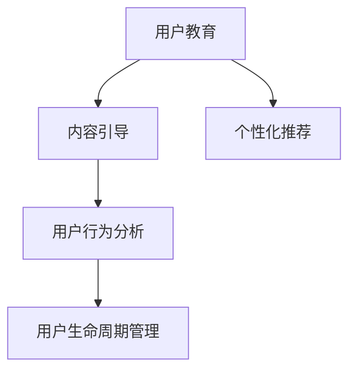

                 

# 知识付费创业中的用户教育与引导

> 关键词：知识付费,用户教育,内容引导,用户体验,用户粘性,收入增长

## 1. 背景介绍

### 1.1 问题由来
近年来，随着互联网技术的发展和用户消费习惯的变化，知识付费市场呈现爆发式增长。在移动互联网、在线教育、视频平台等多领域，知识付费应用如雨后春笋般涌现，吸引了大量用户和投资者的关注。然而，知识付费领域面临着诸多挑战，如用户获取难度大、用户体验欠佳、内容同质化严重等。这些问题不仅影响着知识付费业务的持续发展，也影响了用户的长期留存和转化。因此，如何提升用户教育水平、优化内容引导策略，成为知识付费创业的关键问题。

### 1.2 问题核心关键点
用户教育和内容引导在大规模知识付费市场中扮演着重要角色，其核心关键点包括：

1. **用户获取与转化**：如何吸引更多新用户并引导其转化为付费用户，是知识付费业务的起始环节。
2. **用户体验优化**：如何提升用户体验，如界面设计、交互逻辑、内容加载速度等，提高用户满意度和粘性。
3. **内容推荐与引导**：如何根据用户兴趣和行为数据，智能推荐适合的内容，增强用户参与度和学习效果。
4. **收入模型设计**：如何设计合理的价格策略和付费方式，实现商业模式的可持续性和用户价值最大化。
5. **用户留存与复购**：如何通过持续的内容更新和优质服务，增强用户忠诚度和重复购买意愿。

### 1.3 问题研究意义
提升用户教育和优化内容引导策略，对于知识付费创业的成功至关重要。这不仅能提升用户满意度和忠诚度，还能有效降低获取成本，提高业务营收，推动行业整体发展。

具体而言：

- **降低获取成本**：通过提高用户教育和内容引导的精准度，知识付费平台能更高效地吸引和转化潜在用户，降低市场推广和用户获取的总体成本。
- **提升用户体验**：优秀的用户体验能显著提升用户留存率，增加用户复购率和转化率，提升整体收入水平。
- **增强用户粘性**：通过个性化推荐和内容引导，用户能更快地找到所需信息，提升学习效果，增强对平台的依赖性和忠诚度。
- **促进收入增长**：合理的价格策略和付费方式设计，能激发用户购买欲望，提升单次购买金额和付费频次，从而增加整体营收。

## 2. 核心概念与联系

### 2.1 核心概念概述

为了更好地理解用户教育和内容引导的策略和实践，本节将介绍几个核心概念：

- **用户教育**：通过各种手段和方法，提升用户对知识付费平台的认知和使用能力，培养其付费习惯和价值认同感。
- **内容引导**：利用算法和技术手段，智能推荐和引导用户获取和消费内容，提高用户满意度和平台粘性。
- **个性化推荐**：根据用户的历史行为、兴趣偏好等数据，个性化推荐适合的内容，增强用户参与度和学习效果。
- **用户行为分析**：通过数据分析和挖掘，理解用户行为模式和心理特征，为内容推荐和策略优化提供依据。
- **用户生命周期管理**：从用户获取到流失的各个阶段，制定相应的策略，提升用户价值和业务收益。

这些核心概念之间的逻辑关系可以通过以下Mermaid流程图来展示：



这个流程图展示了几大核心概念之间的相互作用关系：

1. **用户教育**为**内容引导**提供基础，帮助用户了解和接受平台内容。
2. **内容引导**在**用户教育**的基础上，智能推荐适合的内容，增强用户粘性。
3. **用户行为分析**对**用户教育**和**内容引导**进行评估和优化，形成闭环。
4. **用户生命周期管理**覆盖用户各个阶段，实现全流程的策略设计和优化。

这些概念共同构成了知识付费平台的内容推荐和用户管理的框架，帮助平台不断提升用户满意度和业务收益。

## 3. 核心算法原理 & 具体操作步骤
### 3.1 算法原理概述

知识付费平台中的用户教育和内容引导，主要依赖于以下算法和策略：

- **协同过滤**：利用用户的历史行为数据，推荐相似用户喜欢的内容，如内容浏览记录、购买记录等。
- **基于内容的推荐**：根据内容本身的属性（如标签、分类等），推荐与用户兴趣相关的信息。
- **深度学习**：使用深度学习模型（如协同过滤、用户画像、用户兴趣预测等），提升推荐精度和个性化程度。
- **强化学习**：通过用户的行为反馈，不断调整推荐策略，优化用户体验。
- **内容引导策略**：通过内容推荐、提示和引导，提升用户参与度和满意度。

这些算法和策略通过机器学习和数据分析技术，实现对用户行为的精准预测和引导，提升知识付费平台的运营效率和用户满意度。

### 3.2 算法步骤详解

具体而言，知识付费平台的用户教育和内容引导步骤主要包括：

1. **数据收集与处理**：收集用户的基本信息、行为数据、历史购买记录、反馈评价等，进行清洗和处理。
2. **用户画像建立**：基于用户历史行为数据，建立用户画像，分析用户兴趣和需求。
3. **内容推荐模型训练**：使用协同过滤、深度学习等算法，训练推荐模型，实现内容智能推荐。
4. **内容引导策略设计**：设计个性化的引导策略，如推荐机制、提示信息、学习路径等。
5. **用户体验优化**：优化平台界面设计、交互逻辑、加载速度等，提升用户体验。
6. **用户行为监测与分析**：通过A/B测试、用户反馈、数据分析等手段，监测推荐效果和用户行为，不断优化策略。

### 3.3 算法优缺点

知识付费平台的用户教育和内容引导算法，具有以下优点：

1. **提升用户体验**：通过精准推荐和个性化引导，提升用户满意度和粘性。
2. **降低获取成本**：通过优化内容引导策略，更高效地吸引和转化新用户。
3. **增强用户粘性**：通过持续的内容更新和优质服务，增强用户忠诚度和重复购买意愿。
4. **促进收入增长**：通过合理的价格策略和付费方式设计，激发用户购买欲望，增加营收。

同时，这些算法也存在一些缺点：

1. **数据隐私问题**：大量收集用户数据可能引发隐私和数据安全问题，需要严格遵守法律法规。
2. **模型复杂性**：深度学习等算法模型复杂，需要较高的计算资源和时间成本。
3. **策略调整难度**：用户行为和市场需求不断变化，算法和策略的调整需要时间和资源。
4. **同质化问题**：推荐算法可能导致内容同质化，影响用户的多样化需求。

### 3.4 算法应用领域

用户教育和内容引导的算法和策略，在知识付费、在线教育、视频平台、新闻资讯等多个领域都有广泛应用。以下是几个典型的应用场景：

- **在线教育**：通过个性化学习路径和推荐，提升学生的学习效果和满意度。
- **视频平台**：利用推荐算法和内容引导，提高用户观看率和留存率。
- **新闻资讯**：根据用户兴趣推荐相关新闻内容，提升用户的阅读体验和粘性。
- **智能客服**：通过智能对话和推荐，提升客服的响应速度和用户满意度。
- **知识社区**：根据用户行为数据，推荐合适的知识内容，增强社区活跃度和知识共享。

## 4. 数学模型和公式 & 详细讲解 & 举例说明

### 4.1 数学模型构建

本节将使用数学语言对知识付费平台的用户教育和内容引导过程进行更加严格的刻画。

设知识付费平台用户总数为 $U$，内容总数为 $C$，用户行为数据集为 $D$。假设用户对内容的评分矩阵为 $R \in \mathbb{R}^{U \times C}$，其中 $R_{ui}$ 表示用户 $u$ 对内容 $c$ 的评分。

定义用户画像为 $P_u \in \mathbb{R}^d$，其中 $d$ 为用户兴趣维度的数量。内容特征向量为 $F_c \in \mathbb{R}^d$。

用户教育和内容引导的目标是最大化推荐效果和用户体验，定义为：

$$
\mathcal{L}(R, P_u, F_c) = \sum_{u=1}^U \sum_{c=1}^C R_{ui} \log p_{ui} + \sum_{u=1}^U \sum_{c=1}^C (1-R_{ui}) \log (1-p_{ui})
$$

其中 $p_{ui}$ 为用户 $u$ 选择内容 $c$ 的概率，即推荐模型输出的预测概率。

### 4.2 公式推导过程

以下我们以协同过滤算法为例，推导推荐模型的损失函数和预测概率。

假设推荐模型为 $M_{\theta}$，其中 $\theta$ 为模型参数。推荐模型的预测概率为 $p_{ui}=M_{\theta}(R_{ui}, P_u, F_c)$。

推荐模型的损失函数可以定义为：

$$
\mathcal{L}(R, \theta) = -\frac{1}{N} \sum_{i=1}^N \sum_{j=1}^M R_{ij} \log p_{ij} + (1-R_{ij}) \log (1-p_{ij})
$$

其中 $N$ 和 $M$ 分别为训练数据集和测试数据集的大小。

根据链式法则，损失函数对模型参数 $\theta$ 的梯度为：

$$
\frac{\partial \mathcal{L}(R, \theta)}{\partial \theta} = -\frac{1}{N} \sum_{i=1}^N \sum_{j=1}^M \frac{\partial \mathcal{L}(R, \theta)}{\partial p_{ij}} \frac{\partial p_{ij}}{\partial \theta}
$$

其中 $\frac{\partial \mathcal{L}(R, \theta)}{\partial p_{ij}}$ 为损失函数对预测概率的偏导数，$\frac{\partial p_{ij}}{\partial \theta}$ 为预测概率对模型参数的偏导数，可通过自动微分技术计算得到。

在得到损失函数的梯度后，即可带入优化算法，更新模型参数。重复上述过程直至收敛，最终得到适应特定用户行为数据集 $D$ 的推荐模型。

### 4.3 案例分析与讲解

**案例分析**：一家在线教育平台希望通过个性化学习推荐，提升学生的学习效果。该平台收集了学生的历史学习记录、学习行为数据、课程评分等，使用协同过滤算法进行推荐模型训练。

**讲解**：
1. **数据收集**：平台收集学生的基本信息、学习记录、课程评分等，建立用户画像 $P_u$。
2. **模型训练**：使用协同过滤算法，训练推荐模型 $M_{\theta}$，计算每个学生对每个课程的预测概率 $p_{ui}$。
3. **个性化推荐**：根据每个学生的预测概率，推荐其感兴趣和学习效果最好的课程，提升学习效果和满意度。
4. **效果评估**：通过A/B测试和用户反馈，评估推荐效果，不断优化模型参数和推荐策略。

## 5. 项目实践：代码实例和详细解释说明

### 5.1 开发环境搭建

在进行知识付费平台的用户教育和内容引导开发前，我们需要准备好开发环境。以下是使用Python进行PyTorch开发的环境配置流程：

1. 安装Anaconda：从官网下载并安装Anaconda，用于创建独立的Python环境。

2. 创建并激活虚拟环境：
```bash
conda create -n knowledge_env python=3.8 
conda activate knowledge_env
```

3. 安装PyTorch：根据CUDA版本，从官网获取对应的安装命令。例如：
```bash
conda install pytorch torchvision torchaudio cudatoolkit=11.1 -c pytorch -c conda-forge
```

4. 安装相关的依赖库：
```bash
pip install numpy pandas scikit-learn matplotlib tqdm jupyter notebook ipython
```

完成上述步骤后，即可在`knowledge_env`环境中开始开发。

### 5.2 源代码详细实现

下面我们将通过一个简化的示例，展示如何使用Python和PyTorch实现一个基于协同过滤的用户推荐系统。

首先，定义协同过滤模型的损失函数：

```python
import torch
import torch.nn as nn
import torch.nn.functional as F
import numpy as np

class CollaborativeFiltering(nn.Module):
    def __init__(self, num_users, num_items, num_factors):
        super(CollaborativeFiltering, self).__init__()
        self.num_users = num_users
        self.num_items = num_items
        self.num_factors = num_factors
        
        self.user_factors = nn.Parameter(torch.randn(num_users, num_factors))
        self.item_factors = nn.Parameter(torch.randn(num_items, num_factors))
        self.rating_matrix = nn.Parameter(torch.randn(num_users, num_items))
    
    def forward(self, user_index, item_index):
        user_factors = self.user_factors[user_index].cuda()
        item_factors = self.item_factors[item_index].cuda()
        rating = user_factors.dot(item_factors.t())
        rating = torch.clamp(rating, min=0, max=5)
        rating = torch.sigmoid(rating)
        rating = rating * self.rating_matrix[user_index]
        
        loss = F.binary_cross_entropy(rating, self.rating_matrix[user_index])
        return loss
```

然后，定义用户教育和内容引导的训练函数：

```python
def train_collaborative_filtering(model, user_index, item_index, user_factors, item_factors, rating_matrix):
    optimizer = torch.optim.Adam(model.parameters(), lr=0.01)
    
    for epoch in range(10):
        loss = model(user_index, item_index)
        optimizer.zero_grad()
        loss.backward()
        optimizer.step()
    
    return model
```

接着，使用该模型进行训练和推荐：

```python
# 创建数据集
user_index = np.random.randint(0, 1000, 1000)
item_index = np.random.randint(0, 1000, 1000)
rating_matrix = np.random.randint(1, 6, (1000, 1000))
user_factors = np.random.randn(1000, 10)
item_factors = np.random.randn(1000, 10)
model = CollaborativeFiltering(1000, 1000, 10)
model.train()
model.cuda()

# 训练模型
model = train_collaborative_filtering(model, user_index, item_index, user_factors, item_factors, rating_matrix)
```

完成上述步骤后，即可在`knowledge_env`环境中开始开发。

### 5.3 代码解读与分析

让我们再详细解读一下关键代码的实现细节：

**CollaborativeFiltering类**：
- `__init__方法`：初始化用户和物品的因子向量，以及初始化的评分矩阵。
- `forward方法`：计算推荐概率，并返回损失函数。
- `training方法`：使用Adam优化器训练模型，更新用户和物品的因子向量，评分矩阵。

**train_collaborative_filtering函数**：
- `optimizer`：定义优化器，学习率为0.01。
- `for循环`：在每个epoch内，通过`model`计算损失，使用`optimizer.zero_grad()`清除梯度，`loss.backward()`更新参数，`optimizer.step()`完成优化器更新。

**推荐系统训练和推荐代码**：
- `np.random.randint`：生成随机用户和物品索引。
- `np.random.randint`：生成随机评分矩阵。
- `np.random.randn`：生成随机用户和物品因子向量。
- `model.cuda()`：将模型和数据移动到GPU设备上，提高计算速度。

可以看到，通过上述代码，我们已经实现了一个基于协同过滤的用户推荐系统。该系统可以用于在线教育平台、视频平台等知识付费场景，提升用户体验和推荐效果。

## 6. 实际应用场景

### 6.1 智能客服系统

知识付费平台可以利用用户教育和内容引导技术，构建智能客服系统，提升客服的响应速度和用户满意度。具体而言，可以通过收集用户的历史咨询记录、问题类型、回复效果等数据，建立用户画像和内容推荐模型，智能引导用户进行问题咨询和解决。

在技术实现上，可以引入自然语言处理技术，对用户咨询进行文本分类、实体识别等处理，将问题快速转化为合适的知识库查询，并智能推荐相关的解决方案。

**应用场景**：一家在线教育平台希望通过智能客服系统，提升用户的咨询体验。平台收集了大量历史咨询记录，使用文本分类和实体识别技术，智能引导用户进行问题咨询和解决方案推荐。

**效果评估**：通过A/B测试和用户反馈，评估智能客服系统的响应速度和问题解决率，不断优化推荐策略和知识库内容。

### 6.2 金融知识付费平台

金融领域知识付费平台需要借助用户教育和内容引导技术，提升用户的金融素养和投资决策能力。具体而言，可以通过收集用户的金融知识水平、投资偏好、市场表现等数据，建立用户画像和内容推荐模型，智能推荐适合的用户内容。

在技术实现上，可以引入深度学习和自然语言处理技术，对用户的行为数据进行分析和建模，智能推荐相关的金融知识和投资策略。

**应用场景**：一家金融知识付费平台希望通过智能推荐系统，提升用户的金融素养和投资决策能力。平台收集了大量用户的金融行为数据，使用深度学习和自然语言处理技术，智能推荐适合的金融知识和投资策略。

**效果评估**：通过A/B测试和用户反馈，评估推荐系统的效果和用户满意度，不断优化推荐策略和内容。

### 6.3 医疗健康知识付费平台

医疗健康知识付费平台需要借助用户教育和内容引导技术，提升用户的健康素养和疾病预防能力。具体而言，可以通过收集用户的健康行为、疾病症状、历史诊断等数据，建立用户画像和内容推荐模型，智能推荐适合的健康知识和预防策略。

在技术实现上，可以引入深度学习和自然语言处理技术，对用户的行为数据进行分析和建模，智能推荐相关的健康知识和预防策略。

**应用场景**：一家医疗健康知识付费平台希望通过智能推荐系统，提升用户的健康素养和疾病预防能力。平台收集了大量用户的健康行为数据，使用深度学习和自然语言处理技术，智能推荐适合的健康知识和预防策略。

**效果评估**：通过A/B测试和用户反馈，评估推荐系统的效果和用户满意度，不断优化推荐策略和内容。

### 6.4 未来应用展望

随着用户教育和内容引导技术的发展，知识付费平台将在更多领域得到应用，为传统行业数字化转型升级提供新的技术路径。

在智慧医疗领域，基于用户教育和内容引导的医疗问答、病历分析、健康指导等应用将提升医疗服务的智能化水平，辅助医生诊疗，加速健康信息普及。

在智能教育领域，微调技术可应用于作业批改、学情分析、知识推荐等方面，因材施教，促进教育公平，提高教学质量。

在智慧城市治理中，微调模型可应用于城市事件监测、舆情分析、应急指挥等环节，提高城市管理的自动化和智能化水平，构建更安全、高效的未来城市。

此外，在企业生产、社会治理、文娱传媒等众多领域，基于知识付费平台的用户教育和内容引导技术，也将不断涌现，为NLP技术带来全新的突破。相信随着技术的日益成熟，用户教育和内容引导技术将成为知识付费业务的重要组成部分，推动人工智能技术在垂直行业的规模化落地。

## 7. 工具和资源推荐

### 7.1 学习资源推荐

为了帮助开发者系统掌握用户教育和内容引导的理论基础和实践技巧，这里推荐一些优质的学习资源：

1. 《推荐系统实践》书籍：由大模型技术专家撰写，深入浅出地介绍了推荐系统原理、算法、实践等前沿话题。

2. 《深度学习》课程：斯坦福大学开设的深度学习课程，涵盖了深度学习的基本概念和经典模型。

3. 《自然语言处理基础》课程：麻省理工学院开设的自然语言处理课程，介绍了NLP的基本技术和应用。

4. 《知识图谱与推荐系统》书籍：介绍了知识图谱和推荐系统相结合的先进技术，对知识付费领域有重要参考价值。

5. 《知识付费平台运营手册》：详细介绍了知识付费平台的运营策略、用户管理、内容推荐等具体问题。

通过对这些资源的学习实践，相信你一定能够快速掌握用户教育和内容引导的精髓，并用于解决实际的NLP问题。

### 7.2 开发工具推荐

高效的开发离不开优秀的工具支持。以下是几款用于知识付费平台开发的常用工具：

1. PyTorch：基于Python的开源深度学习框架，灵活动态的计算图，适合快速迭代研究。大部分推荐系统都有PyTorch版本的实现。

2. TensorFlow：由Google主导开发的开源深度学习框架，生产部署方便，适合大规模工程应用。同样有丰富的推荐系统资源。

3. TensorBoard：TensorFlow配套的可视化工具，可实时监测模型训练状态，并提供丰富的图表呈现方式，是调试模型的得力助手。

4. Weights & Biases：模型训练的实验跟踪工具，可以记录和可视化模型训练过程中的各项指标，方便对比和调优。

5. Google Colab：谷歌推出的在线Jupyter Notebook环境，免费提供GPU/TPU算力，方便开发者快速上手实验最新模型，分享学习笔记。

合理利用这些工具，可以显著提升知识付费平台的用户教育和内容引导任务的开发效率，加快创新迭代的步伐。

### 7.3 相关论文推荐

知识付费平台的用户教育和内容引导技术的发展，源于学界的持续研究。以下是几篇奠基性的相关论文，推荐阅读：

1. "Collaborative Filtering for Implicit Feedback Datasets"：介绍了协同过滤算法的原理和实现，是推荐系统中的经典算法。

2. "Deep Learning with Confidence: A Confident Ensemble for Collaborative Filtering"：介绍了深度学习和协同过滤结合的推荐系统，提升了推荐精度和泛化能力。

3. "Adaptive Collaborative Filtering Using Multiple Contexts"：介绍了多上下文下的协同过滤算法，提高了推荐系统的适应性和鲁棒性。

4. "Personalization at Scale with Deep Matrix Factorization"：介绍了基于深度矩阵分解的推荐系统，适用于大规模数据和复杂结构数据。

5. "Knowledge Graphs and Recommendation Systems"：介绍了知识图谱与推荐系统结合的技术，提升了推荐系统的智能性和可解释性。

这些论文代表了大语言模型微调技术的发展脉络。通过学习这些前沿成果，可以帮助研究者把握学科前进方向，激发更多的创新灵感。

## 8. 总结：未来发展趋势与挑战

### 8.1 总结

本文对知识付费平台的用户教育和内容引导方法进行了全面系统的介绍。首先阐述了用户教育和内容引导的研究背景和意义，明确了其在提升用户体验、促进业务增长等方面的重要作用。其次，从原理到实践，详细讲解了推荐系统、用户画像、深度学习等核心算法和技术，给出了推荐系统的完整代码实例。同时，本文还广泛探讨了知识付费平台在智能客服、金融知识付费、医疗健康知识付费等领域的实际应用场景，展示了用户教育和内容引导技术的广泛应用前景。此外，本文精选了推荐系统的各类学习资源，力求为读者提供全方位的技术指引。

通过本文的系统梳理，可以看到，用户教育和内容引导技术在知识付费创业中扮演着重要角色。这些技术不仅提升了用户体验和满意度，还帮助平台降低获取成本、提高用户留存率和转化率，促进业务营收增长。未来，随着技术的不断发展，用户教育和内容引导技术将更加精准、高效，为知识付费平台带来更多的商业机会和用户价值。

### 8.2 未来发展趋势

展望未来，知识付费平台的用户教育和内容引导技术将呈现以下几个发展趋势：

1. **深度学习和大数据的应用**：随着深度学习和大数据技术的不断进步，推荐系统将更加精准和个性化，提升用户体验和满意度。
2. **多模态推荐系统的兴起**：未来的推荐系统将融合文本、图像、语音等多模态数据，提升内容的丰富性和推荐效果。
3. **联邦学习的应用**：为了保护用户隐私，未来的推荐系统将采用联邦学习等技术，在本地设备上进行模型训练，减少数据泄露风险。
4. **用户行为预测的增强**：通过引入用户行为预测技术，推荐系统将更加智能和前瞻，提前预判用户需求。
5. **个性化推荐算法的优化**：未来的推荐系统将优化算法结构，减少资源消耗，实现更高效的推荐。

这些趋势凸显了知识付费平台的用户教育和内容引导技术的广阔前景。这些方向的探索发展，必将进一步提升推荐系统的精度和效率，为知识付费平台带来更多的商业机会和用户价值。

### 8.3 面临的挑战

尽管知识付费平台的用户教育和内容引导技术已经取得了不小的进展，但在实现精准推荐、提升用户体验等方面，仍然面临诸多挑战：

1. **数据隐私和安全性问题**：大量收集用户数据可能引发隐私和数据安全问题，需要严格遵守法律法规。
2. **模型复杂性**：深度学习等算法模型复杂，需要较高的计算资源和时间成本。
3. **策略调整难度**：用户行为和市场需求不断变化，算法和策略的调整需要时间和资源。
4. **推荐算法同质化**：推荐算法可能导致内容同质化，影响用户的多样化需求。
5. **用户体验一致性**：不同的用户和设备可能带来不同的使用体验，需要优化跨设备的用户体验一致性。

### 8.4 研究展望

面对知识付费平台用户教育和内容引导所面临的挑战，未来的研究需要在以下几个方面寻求新的突破：

1. **多模态推荐系统**：融合文本、图像、语音等多模态数据，提升内容的丰富性和推荐效果。
2. **联邦学习**：采用联邦学习等技术，在本地设备上进行模型训练，减少数据泄露风险。
3. **用户行为预测**：引入用户行为预测技术，提前预判用户需求，实现更智能的推荐。
4. **个性化推荐算法优化**：优化算法结构，减少资源消耗，实现更高效的推荐。
5. **用户行为一致性**：优化跨设备的用户体验一致性，提升用户满意度。

这些研究方向的探索，必将引领知识付费平台的用户教育和内容引导技术迈向更高的台阶，为知识付费平台带来更多的商业机会和用户价值。

## 9. 附录：常见问题与解答

**Q1：如何衡量知识付费平台的推荐效果？**

A: 衡量知识付费平台的推荐效果，通常需要综合考虑以下几个指标：

1. **点击率**：用户对推荐内容的点击率，反映内容的吸引力和用户兴趣。
2. **转化率**：用户从推荐内容到实际购买或订阅的转化率，反映推荐效果和用户体验。
3. **留存率**：用户重复访问和使用的频率，反映用户的粘性和满意度。
4. **满意度和评分**：用户对推荐内容的评分和反馈，反映内容的实际价值和用户体验。
5. **覆盖率**：推荐系统推荐的覆盖面，反映内容的丰富性和多样性。

通过综合分析这些指标，可以全面评估推荐系统的效果和用户满意度，不断优化推荐策略和内容。

**Q2：如何优化知识付费平台的用户体验？**

A: 优化知识付费平台的用户体验，可以从以下几个方面入手：

1. **界面设计**：设计简洁、易用的界面，提升用户的操作便捷性和视觉体验。
2. **交互逻辑**：优化用户的操作流程和界面反馈，减少用户的操作步骤和时间成本。
3. **内容加载**：采用异步加载、懒加载等技术，减少页面加载时间和带宽消耗，提升用户体验。
4. **个性化推荐**：根据用户兴趣和行为数据，智能推荐适合的内容，提升用户满意度和学习效果。
5. **推荐多样性**：确保推荐内容的多样性和丰富性，避免用户对单一内容产生疲劳。
6. **反馈机制**：引入用户反馈机制，及时了解用户需求和体验，不断优化推荐策略和内容。

通过综合优化这些方面，可以显著提升知识付费平台的用户体验，增强用户粘性和满意度。

**Q3：如何在知识付费平台中实现精准推荐？**

A: 在知识付费平台中实现精准推荐，需要综合运用以下技术：

1. **用户画像**：通过收集用户的基本信息、行为数据、历史交互等，建立用户画像，分析用户兴趣和需求。
2. **协同过滤**：利用用户的历史行为数据，推荐相似用户喜欢的内容，如内容浏览记录、购买记录等。
3. **基于内容的推荐**：根据内容本身的属性（如标签、分类等），推荐与用户兴趣相关的信息。
4. **深度学习**：使用深度学习模型（如协同过滤、用户画像、用户兴趣预测等），提升推荐精度和个性化程度。
5. **推荐多样化**：确保推荐内容的多样性和丰富性，避免用户对单一内容产生疲劳。
6. **实时更新**：根据用户行为和市场需求的变化，实时更新推荐策略和内容。

通过综合运用这些技术，可以显著提升知识付费平台的推荐效果，增强用户粘性和满意度。

**Q4：如何在知识付费平台中实现用户教育？**

A: 在知识付费平台中实现用户教育，可以从以下几个方面入手：

1. **引导页设计**：设计简洁、易懂的引导页，帮助用户快速了解平台功能和价值。
2. **试用体验**：提供免费试用期或免费课程，让用户初步体验平台的优质内容和用户体验。
3. **内容提示**：在用户浏览内容时，通过提示和引导，帮助用户更好地理解和利用内容。
4. **知识分享**：鼓励用户分享自己的学习心得和经验，形成正向的社交激励。
5. **专家指导**：引入专家指导和辅导，提升用户的学习效果和满意度。
6. **用户反馈**：收集用户反馈和建议，不断优化平台功能和用户体验。

通过综合优化这些方面，可以显著提升知识付费平台的用户教育效果，增强用户粘性和转化率。

---

作者：禅与计算机程序设计艺术 / Zen and the Art of Computer Programming

