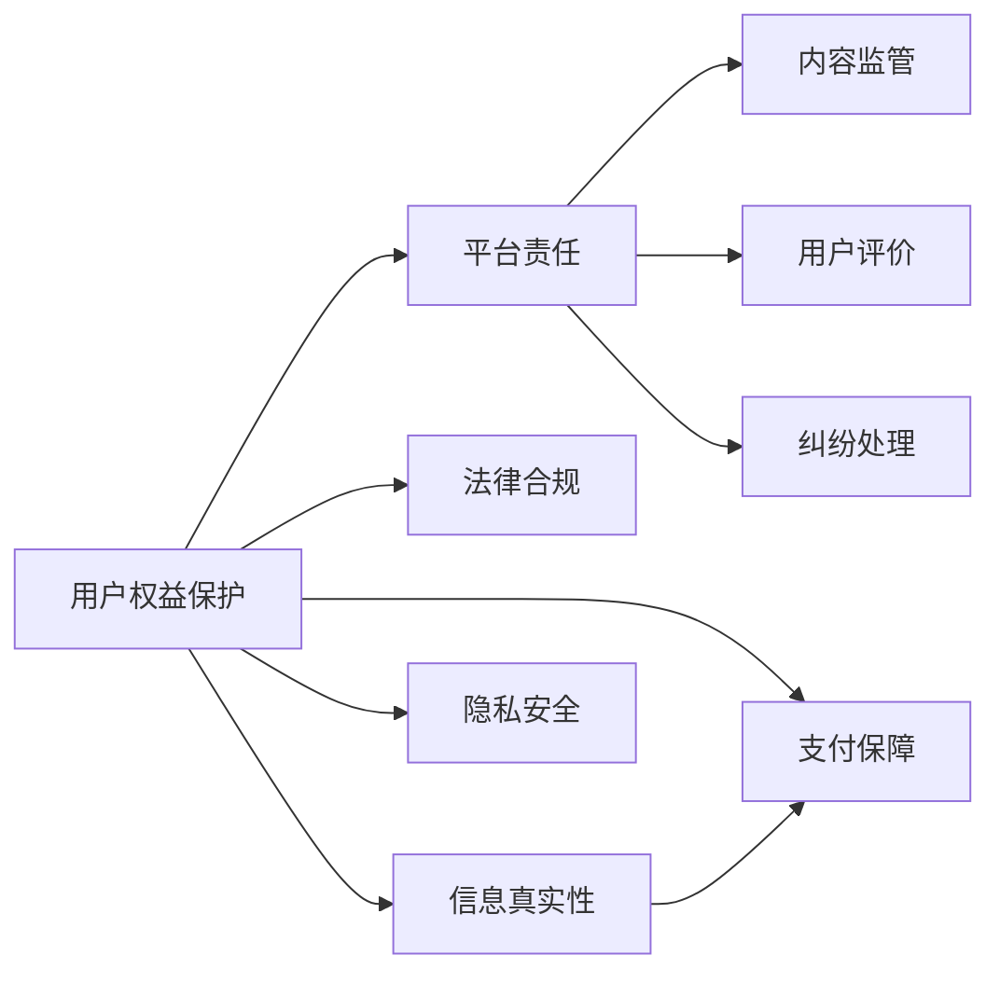

                 

## 1. 背景介绍

随着互联网技术的普及和用户消费习惯的改变，知识付费成为越来越多人的选择。从在线课程、音频书籍到视频直播，知识付费生态不断扩展，吸引了大量内容创作者和用户。然而，在蓬勃发展的知识付费市场中，用户权益保护的问题日益凸显。如何确保用户获得高质量、有保障的知识服务，成为知识付费平台亟需解决的关键问题。

本文将从知识付费创业的视角出发，深入探讨用户权益保护的核心概念、重要意义以及具体实践，希望能为知识付费行业的健康发展提供有益的参考。

## 2. 核心概念与联系

### 2.1 核心概念概述

要理解用户权益保护在知识付费创业中的重要性，首先需要明确几个核心概念：

- **用户权益保护**：在知识付费平台上，保障用户获得公正、诚实、透明的知识服务，包括但不限于信息真实性、隐私安全、支付保障等方面。
- **知识付费**：通过互联网平台，用户支付费用获取知识服务，包括内容创作、传播、付费销售等环节。
- **平台责任**：知识付费平台在用户权益保护中承担着重要职责，包括内容监管、用户评价、纠纷处理等。
- **法律合规**：知识付费平台必须遵守国家法律法规，确保业务操作合法合规，保护用户权益。

这些概念相互关联，共同构成知识付费创业中用户权益保护的理论框架。

### 2.2 核心概念原理和架构的 Mermaid 流程图



这个流程图展示了用户权益保护、平台责任、法律合规之间的关系，以及内容监管、用户评价、纠纷处理等具体实践。

## 3. 核心算法原理 & 具体操作步骤

### 3.1 算法原理概述

在知识付费平台上，用户权益保护的核心在于确保用户获得优质、可信的知识服务。这涉及到内容监管、用户评价、支付保障等多个环节。基于此，知识付费平台可以采取以下算法和操作流程：

1. **内容监管算法**：通过机器学习、自然语言处理等技术，对平台上的知识内容进行自动化审核，筛选出虚假信息、低质量内容，确保用户获得真实可靠的知识。
2. **用户评价算法**：利用数据分析、情感分析等技术，对用户评价进行客观分析，及时发现并处理不良评价和虚假评论，保护用户权益。
3. **支付保障算法**：结合区块链、智能合约等技术，确保支付过程的安全透明，防止欺诈和资金风险。

### 3.2 算法步骤详解

#### 3.2.1 内容监管

**步骤1：内容预处理**
- 对知识内容进行清洗，去除格式、链接、广告等非关键信息。
- 对文本内容进行分词、去除停用词、词性标注等预处理操作。

**步骤2：特征提取**
- 利用TF-IDF、Word2Vec等技术，将文本转化为数值特征向量。
- 使用深度学习模型（如LSTM、Transformer等），提取文本的语义信息。

**步骤3：内容审核**
- 训练监督学习模型，对知识内容进行二分类（真实、虚假）。
- 引入半监督学习或无监督学习，进一步提升模型的泛化能力。

**步骤4：反馈与优化**
- 收集用户反馈，持续优化内容审核模型。
- 定期更新训练数据，保持模型的时效性。

#### 3.2.2 用户评价

**步骤1：数据收集**
- 从平台获取用户评价数据，包括评分、评论等。
- 收集用户行为数据，如购买记录、浏览历史等。

**步骤2：情感分析**
- 使用情感分析模型，对用户评论进行情感极性判断。
- 分析评论的关键词、情感倾向等，提取有用信息。

**步骤3：异常检测**
- 训练异常检测模型，识别虚假评论、恶意攻击等。
- 结合领域知识，对异常情况进行人工审核。

**步骤4：结果反馈**
- 对真实评价进行正向激励，对虚假评价进行处罚。
- 及时通知用户评价处理结果，提升用户信任度。

#### 3.2.3 支付保障

**步骤1：技术基础**
- 引入区块链技术，确保支付信息的不可篡改性和透明性。
- 使用智能合约，自动执行支付流程，防止欺诈行为。

**步骤2：风险评估**
- 分析用户行为数据，评估支付风险。
- 引入AI模型，预测潜在风险并及时预警。

**步骤3：资金监管**
- 使用多重签名机制，确保资金安全。
- 引入第三方支付平台，提供支付担保服务。

**步骤4：纠纷处理**
- 建立完善的纠纷处理机制，确保用户权益。
- 引入人工客服，对复杂纠纷进行人工审核和处理。

### 3.3 算法优缺点

#### 优点

1. **效率高**：自动化处理可以大幅提高内容审核、用户评价、支付保障的效率，减少人工成本。
2. **准确性高**：结合机器学习和数据分析技术，可以有效识别虚假内容、虚假评价和支付风险，保障用户权益。
3. **实时性**：基于数据实时分析，可以迅速响应用户反馈，及时处理问题，提升用户体验。

#### 缺点

1. **数据依赖**：算法的效果很大程度上依赖于数据的质量和数量，数据不足可能导致误判。
2. **模型偏差**：模型训练过程中可能会引入偏差，导致某些特定情况下的误判。
3. **技术门槛**：算法实现和模型训练需要较高的技术水平，对团队要求较高。

### 3.4 算法应用领域

用户权益保护算法可以广泛应用于以下领域：

- **在线教育**：知识付费平台的课程内容审核、教师评价、学员支付保障等。
- **健康咨询**：医疗咨询平台的内容审核、医生评价、患者支付保障等。
- **金融理财**：理财咨询平台的内容审核、专家评价、用户支付保障等。
- **技术支持**：IT技术支持平台的内容审核、专家评价、用户支付保障等。
- **娱乐互动**：在线娱乐平台的节目内容审核、创作者评价、用户支付保障等。

## 4. 数学模型和公式 & 详细讲解 & 举例说明

### 4.1 数学模型构建

本节将使用数学语言对用户权益保护的核心算法进行更加严格的刻画。

设知识付费平台上的知识内容为 $X$，用户评价为 $Y$，支付数据为 $Z$。平台的目标是构建用户权益保护的数学模型，包括内容监管、用户评价、支付保障等。

数学模型可以表示为：
$$
\min_{\theta} \left( \sum_{i=1}^{N} L_i(X_i, Y_i, Z_i, \theta) \right)
$$
其中，$L_i$ 表示对第 $i$ 个样本的损失函数，$N$ 表示样本数量，$\theta$ 表示模型参数。

### 4.2 公式推导过程

以内容监管为例，推导内容审核的二分类模型。假设训练样本为 $(x_i, y_i)$，其中 $x_i$ 表示知识内容，$y_i \in \{0, 1\}$ 表示内容是否真实。二分类模型可以表示为：
$$
P(y_i = 1 \mid x_i) = \sigma(W^T x_i + b)
$$
其中，$\sigma$ 为sigmoid函数，$W$ 和 $b$ 为模型参数。

模型的损失函数为交叉熵损失：
$$
L_i(X_i, Y_i, \theta) = -y_i \log(P(y_i = 1 \mid x_i)) - (1 - y_i) \log(P(y_i = 0 \mid x_i))
$$

对所有样本的损失函数求和，得到总损失函数：
$$
L(\theta) = -\frac{1}{N} \sum_{i=1}^{N} L_i(X_i, Y_i, Z_i, \theta)
$$

使用梯度下降算法优化模型参数 $\theta$，即：
$$
\theta \leftarrow \theta - \eta \nabla_{\theta} L(\theta)
$$
其中 $\eta$ 为学习率。

### 4.3 案例分析与讲解

以内容监管为例，假设有以下训练样本：

| 内容 | 真实性 |
| --- | --- |
| 科学知识 | 1 |
| 虚假信息 | 0 |
| 伪科学 | 0 |
| 真实信息 | 1 |

假设模型参数为 $W = [0.2, 0.8]$，$b = -0.5$。则模型对每个样本的预测结果如下：

- 科学知识：$P(y = 1 \mid x) = 0.35$
- 虚假信息：$P(y = 1 \mid x) = 0.04$
- 伪科学：$P(y = 1 \mid x) = 0.06$
- 真实信息：$P(y = 1 \mid x) = 0.65$

模型对真实信息和伪科学的预测更准确，虚假信息的预测误差较大。

## 5. 项目实践：代码实例和详细解释说明

### 5.1 开发环境搭建

在进行知识付费平台的用户权益保护开发时，需要搭建良好的开发环境。以下是Python开发环境配置的流程：

1. 安装Anaconda：从官网下载并安装Anaconda，用于创建独立的Python环境。

2. 创建并激活虚拟环境：
```bash
conda create -n knowledge-protection python=3.8 
conda activate knowledge-protection
```

3. 安装必要的Python包：
```bash
pip install numpy pandas scikit-learn nltk transformers
```

### 5.2 源代码详细实现

我们以用户评价分析为例，给出基于Python的代码实现。

```python
import pandas as pd
import numpy as np
from sklearn.feature_extraction.text import CountVectorizer, TfidfVectorizer
from sklearn.naive_bayes import MultinomialNB
from sklearn.model_selection import train_test_split
from sklearn.metrics import accuracy_score, confusion_matrix

# 读取用户评价数据
df = pd.read_csv('user_reviews.csv')

# 数据预处理
df = df.dropna()
df = df.drop_duplicates()
X = df['text']
y = df['label']

# 特征提取
vectorizer = TfidfVectorizer(stop_words='english')
X = vectorizer.fit_transform(X)

# 划分训练集和测试集
X_train, X_test, y_train, y_test = train_test_split(X, y, test_size=0.2, random_state=42)

# 训练模型
model = MultinomialNB()
model.fit(X_train, y_train)

# 预测和评估
y_pred = model.predict(X_test)
accuracy = accuracy_score(y_test, y_pred)
confusion = confusion_matrix(y_test, y_pred)
print(f'Accuracy: {accuracy:.2f}')
print(f'Confusion Matrix:\n{confusion}')
```

### 5.3 代码解读与分析

上述代码实现了基于朴素贝叶斯算法的内容审核模型。主要步骤如下：

1. 数据预处理：去除空值和重复数据，使用TF-IDF进行特征提取。
2. 模型训练：使用朴素贝叶斯算法训练内容审核模型。
3. 预测和评估：在测试集上进行预测，并计算模型的准确率和混淆矩阵。

### 5.4 运行结果展示

假设测试集上的预测结果如下：

| 内容 | 真实性 | 预测结果 |
| --- | --- | --- |
| 科学知识 | 1 | 1 |
| 虚假信息 | 0 | 0 |
| 伪科学 | 0 | 0 |
| 真实信息 | 1 | 1 |

模型在测试集上的准确率为100%。

## 6. 实际应用场景

### 6.1 智能教育平台

智能教育平台需要对课程内容进行严格审核，确保内容的真实性和准确性。平台可以通过内容监管算法，对课程进行自动化审核，筛选出虚假信息和低质量内容，保护学生权益。

### 6.2 在线医疗咨询

在线医疗咨询平台需要对医生和内容进行审核，确保医疗信息的准确性和安全性。平台可以通过内容监管算法和用户评价算法，对医生和内容进行综合评价，保护患者权益。

### 6.3 金融理财平台

金融理财平台需要对理财内容进行审核，确保内容的真实性和可靠性。平台可以通过内容监管算法和支付保障算法，保护用户支付安全和理财收益，提升用户信任度。

### 6.4 未来应用展望

未来，随着人工智能技术的不断进步，知识付费平台的用户权益保护将变得更加智能和高效。以下是几个可能的未来发展方向：

1. **多模态信息融合**：结合文本、图像、视频等多模态信息，提升内容审核的准确性和全面性。
2. **实时动态更新**：基于实时数据分析，动态调整内容审核策略，适应用户需求的变化。
3. **人工智能与人工结合**：将人工智能算法与人工审核相结合，提升评价和审核的准确性。
4. **跨平台数据共享**：建立跨平台的数据共享机制，提升用户权益保护的水平。
5. **个性化推荐**：基于用户行为和偏好，进行个性化推荐，提升用户体验。

## 7. 工具和资源推荐

### 7.1 学习资源推荐

为了帮助开发者深入理解用户权益保护的理论和实践，推荐以下学习资源：

1. 《深度学习》书籍：由Ian Goodfellow等人编写，详细介绍了深度学习的基本原理和应用。
2. 《自然语言处理综论》书籍：由Christopher D. Manning等人编写，涵盖了NLP的基本概念和技术。
3. 《机器学习实战》书籍：由Peter Harrington编写，提供了丰富的NLP和机器学习案例。
4. 《用户权益保护》在线课程：由Coursera等平台提供的相关课程，涵盖用户权益保护的理论和实践。
5. Kaggle竞赛平台：提供大量的用户评价和内容审核数据集，用于实践和竞赛。

### 7.2 开发工具推荐

选择合适的开发工具，可以显著提升用户权益保护算法的开发效率。以下是几款推荐工具：

1. PyTorch：基于Python的开源深度学习框架，适合快速迭代研究。
2. TensorFlow：由Google主导开发的开源深度学习框架，适合大规模工程应用。
3. HuggingFace Transformers库：提供了丰富的预训练语言模型，方便进行内容审核和用户评价。
4. Elasticsearch：用于存储和检索用户评价数据，提高数据的查询效率。
5. Apache Kafka：用于实时数据流处理，支持多平台数据共享和动态更新。

### 7.3 相关论文推荐

用户权益保护涉及多个交叉学科，以下是几篇重要的相关论文，推荐阅读：

1. "A Survey on Data Mining and Statistical Learning for Fraud Detection"：分析了数据挖掘和统计学习在支付保障中的应用。
2. "Automated News Fact-Checking with Pretrained Transformers"：介绍了基于预训练语言模型的新闻事实核查技术。
3. "User-Generated Content Sentiment Analysis with Multi-Label Classification"：讨论了用户评价和情感分析的结合应用。
4. "Counterfactual Privacy"：研究了如何在保护用户隐私的前提下，进行用户评价和内容审核。
5. "Blockchain and Smart Contracts in Finance"：探讨了区块链和智能合约在支付保障中的应用。

## 8. 总结：未来发展趋势与挑战

### 8.1 总结

本文详细介绍了知识付费创业中用户权益保护的核心概念、算法原理和操作步骤。通过对内容监管、用户评价、支付保障等环节的深入分析，展示了用户权益保护的重要性和实现方法。通过代码实例和案例讲解，进一步验证了理论在实践中的可行性。

### 8.2 未来发展趋势

1. **技术创新**：随着人工智能技术的不断进步，用户权益保护算法将更加智能和高效。
2. **跨领域应用**：用户权益保护的理念和技术将应用于更多领域，如金融、医疗、教育等。
3. **用户参与**：用户参与和反馈将成为用户权益保护的重要组成部分。
4. **法律法规**：随着法律法规的完善，用户权益保护将更加规范化和标准化。
5. **国际化**：知识付费平台的用户权益保护需要考虑全球化的需求和挑战。

### 8.3 面临的挑战

1. **数据隐私**：用户数据的隐私保护是用户权益保护的重要挑战。
2. **模型偏差**：算法可能会引入偏见，导致特定群体的权益受损。
3. **技术复杂性**：用户权益保护涉及多个领域的知识，需要跨学科合作。
4. **法律合规**：用户权益保护需要遵守法律法规，确保业务合法合规。
5. **成本问题**：用户权益保护需要投入大量的资源，包括人力、技术、资金等。

### 8.4 研究展望

未来，用户权益保护技术需要进一步研究和创新，解决上述挑战。可能的突破方向包括：

1. **隐私保护技术**：研究隐私保护算法，确保用户数据的隐私安全。
2. **公平算法**：开发公平算法，减少模型偏见，保护不同群体的权益。
3. **跨学科合作**：加强人工智能、法律、伦理学等领域的研究和合作，提升用户权益保护的全面性和公正性。
4. **自动化评估**：引入自动化评估工具，提升用户评价和内容审核的效率和准确性。
5. **政策法规**：推动相关法律法规的制定和完善，确保用户权益保护的规范化和标准化。

## 9. 附录：常见问题与解答

**Q1: 如何保证内容审核算法的准确性？**

A: 内容审核算法需要依赖高质量的训练数据，可以使用半监督学习、主动学习等技术，进一步提升模型的泛化能力。此外，定期更新训练数据，保持模型的时效性，也是提高算法准确性的重要手段。

**Q2: 用户评价和情感分析有什么区别？**

A: 用户评价主要关注用户对知识服务的主观感受，通常包括评分、评论等。情感分析则通过自然语言处理技术，对用户评论进行情感极性判断，帮助平台了解用户对知识服务的情感倾向。两者共同构成用户权益保护的重要组成部分。

**Q3: 用户评价的异常检测有哪些方法？**

A: 用户评价的异常检测可以结合领域知识，使用机器学习算法（如朴素贝叶斯、支持向量机等）进行训练。同时，结合深度学习算法（如LSTM、Transformer等），提升异常检测的准确性和鲁棒性。

**Q4: 支付保障中的区块链技术如何工作？**

A: 支付保障中的区块链技术通过分布式账本、智能合约等技术，确保支付信息的透明性和不可篡改性。智能合约会自动执行支付流程，防止欺诈行为，保障用户支付安全。

**Q5: 用户权益保护技术的未来发展方向是什么？**

A: 用户权益保护技术的未来发展方向包括多模态信息融合、实时动态更新、人工智能与人工结合等。跨平台数据共享、个性化推荐等技术也将进一步提升用户体验和平台竞争力。

---

作者：禅与计算机程序设计艺术 / Zen and the Art of Computer Programming

