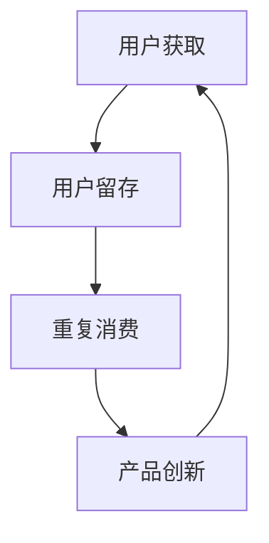

                 

# 知识付费创业中的用户激活策略

## 1. 背景介绍

随着互联网技术的发展和人们对知识的需求日益增长，知识付费创业逐渐成为一种新兴的经济模式。据艾瑞咨询报告，2020年中国知识付费市场规模已达362亿元，预计未来5年将保持约30%的年复合增长率。面对激烈的市场竞争，如何高效激活用户、提升用户留存，成为知识付费平台的核心难题。

### 1.1 问题由来

知识付费平台主要通过优质的内容、贴心的服务吸引用户付费订阅，但在实际操作中，用户激活与留存问题仍困扰着各大平台。以下问题尤为突出：

- 用户获取难：尽管平台广告投放不断加大，新用户获取成本依旧居高不下。
- 平台粘性差：内容和服务吸引力不足，用户体验不佳，用户流失率高。
- 重复消费难：用户付费后，难以持续产生消费冲动，订阅续费率低。

面对这些挑战，平台亟需一套行之有效的用户激活策略，将潜在用户转化为付费用户，并提升用户粘性和重复消费率。

### 1.2 问题核心关键点

为有效解决用户激活问题，以下关键点需要重点关注：

- 新用户获取：如何高效地获取潜在用户，降低用户获取成本。
- 用户留存：如何增强用户体验，提高用户粘性，减少用户流失。
- 重复消费：如何激发用户对知识内容的持续兴趣，提高续费率。
- 产品创新：如何持续推出优质内容和服务，满足用户多样化需求。

本文将系统性地介绍一套全面的用户激活策略，涵盖用户获取、留存和重复消费等各个环节，以期为知识付费创业者提供实用的指导和借鉴。

## 2. 核心概念与联系

### 2.1 核心概念概述

在阐述具体策略前，我们首先梳理几个核心概念：

- **用户激活（User Acquisition）**：将潜在用户转化为付费用户的过程。
- **用户留存（User Retention）**：维持用户持续使用平台，减少用户流失。
- **重复消费（Repeat Purchase）**：通过持续提供有价值的内容和服务，激发用户的重复消费行为。
- **产品创新（Product Innovation）**：不断优化和推出新的内容、服务和功能，满足用户多样化需求。

这些概念之间互相影响，共同构成了一个循环反馈的系统。高效的用户获取策略可以带来更多新用户，优质的内容和体验能提升用户留存率，持续的内容和服务则激发用户的重复消费，最终形成良性的用户生态。

### 2.2 核心概念原理和架构的 Mermaid 流程图



这个流程图展示了用户激活的循环过程：

1. **用户获取**：通过广告、合作推广等手段吸引潜在用户。
2. **用户留存**：通过优质的内容和个性化服务提升用户满意度，减少流失。
3. **重复消费**：通过持续的创新和优化，满足用户新的需求，激发用户的重复消费行为。
4. **产品创新**：基于用户反馈和新趋势，不断推出新的内容和服务。

整个循环形成了一个闭环，推动平台不断提升用户价值和满意度。

## 3. 核心算法原理 & 具体操作步骤

### 3.1 算法原理概述

用户激活策略的核心在于平衡用户获取、留存和重复消费之间的关系，构建一个健康的用户生态。其基本思想是通过精准定位、优质内容和个性化服务，不断提升用户体验，从而实现用户的高效激活和留存。

具体来说，包括以下几个关键步骤：

1. **用户定位**：通过数据分析和用户画像，精准定位目标用户群体。
2. **内容优化**：设计符合用户兴趣和需求的高质量内容。
3. **个性化服务**：根据用户行为和偏好，提供个性化的推荐和互动。
4. **激励机制**：通过优惠、积分等激励手段，引导用户付费和重复消费。

### 3.2 算法步骤详解

#### 3.2.1 用户定位

**步骤1：数据采集与分析**

- **用户行为数据**：通过用户浏览、点击、购买等行为数据，分析用户的兴趣和需求。
- **用户画像构建**：基于用户基本信息（如年龄、性别、职业）和行为数据，构建详细的用户画像。
- **行为聚类**：使用K-means等聚类算法，将用户分为不同的兴趣群体。

**步骤2：定向广告投放**

- **广告平台选择**：选择合适的广告平台（如百度、腾讯等）进行定向广告投放。
- **广告素材制作**：根据用户画像和行为数据，制作符合用户兴趣的广告素材。
- **效果监测与优化**：定期监测广告投放效果，优化投放策略和预算分配。

#### 3.2.2 内容优化

**步骤1：内容设计**

- **内容多样化**：覆盖不同主题、形式的内容，满足不同用户需求。
- **高质量制作**：聘请专业作者、专家等，确保内容的高质量。
- **互动性增强**：加入问答、评论等互动形式，提升用户参与度。

**步骤2：内容推荐**

- **个性化推荐算法**：使用协同过滤、基于内容的推荐算法，根据用户行为数据推荐相关内容。
- **个性化标签体系**：构建内容标签体系，方便推荐算法使用。
- **推荐结果展示**：优化推荐结果的展示形式，提升用户体验。

#### 3.2.3 个性化服务

**步骤1：个性化推荐**

- **用户画像更新**：根据用户行为数据定期更新用户画像。
- **推荐引擎优化**：优化推荐算法，提升推荐准确性和多样性。
- **推荐结果展示**：动态更新推荐结果，实时展示用户感兴趣的内容。

**步骤2：互动服务**

- **客服系统优化**：建立智能客服系统，快速响应用户咨询。
- **社区建设**：搭建用户交流平台，促进用户互动和知识分享。
- **反馈机制完善**：建立用户反馈机制，及时调整和优化服务。

#### 3.2.4 激励机制

**步骤1：优惠策略制定**

- **优惠码发放**：定期发放折扣码，刺激用户消费。
- **会员特权**：设置会员等级，提供专属内容和特权。
- **付费计划设计**：设计灵活的付费计划，满足不同用户需求。

**步骤2：积分系统构建**

- **积分来源**：用户通过学习、互动、购买等行为获得积分。
- **积分兑换**：用户可以用积分兑换课程、优惠券等。
- **积分激励**：定期推出积分兑换活动，提升用户活跃度。

### 3.3 算法优缺点

#### 3.3.1 优点

- **用户精准定位**：通过数据分析和用户画像，精确锁定目标用户群体。
- **个性化服务提升**：通过个性化推荐和互动服务，提升用户体验和满意度。
- **持续内容创新**：基于用户反馈和市场趋势，持续推出优质内容和服务。

#### 3.3.2 缺点

- **数据隐私风险**：用户数据采集和分析可能涉及隐私问题。
- **技术复杂度高**：个性化推荐和互动服务需要复杂的算法和系统支持。
- **成本投入高**：广告投放和内容制作需要大量人力和财力投入。

### 3.4 算法应用领域

用户激活策略不仅适用于知识付费平台，还广泛应用在电商、社交、游戏等多个领域。例如：

- **电商**：通过个性化推荐和优惠券，提升用户购买率和复购率。
- **社交**：通过智能推荐和互动服务，提升用户活跃度和留存率。
- **游戏**：通过任务、奖励等激励机制，增加用户粘性和消费。

这些领域在用户激活策略上的相似之处在于，都依赖于精准的用户定位、高质量的内容和个性化的服务。

## 4. 数学模型和公式 & 详细讲解 & 举例说明

### 4.1 数学模型构建

为更好地理解用户激活策略，我们构建了一个简化的数学模型。假设平台有用户 $U=\{u_1, u_2, ..., u_N\}$，其中 $N$ 为总用户数。目标是通过精准定位、内容优化和个性化服务，最大化用户激活率 $A$ 和留存率 $R$。

- **用户激活率** $A = \frac{N_1}{N}$，其中 $N_1$ 为成功激活的用户数。
- **用户留存率** $R = \frac{N_2}{N_1}$，其中 $N_2$ 为成功激活并留存的用户数。

平台的目标是最大化 $A \times R$，即 $A_0 \times R_0$，其中 $A_0$ 和 $R_0$ 分别为初始的激活率和留存率。

### 4.2 公式推导过程

根据上述模型，我们可以推导出用户激活策略的优化目标函数：

$$
\max \quad A \times R = \frac{N_1}{N} \times \frac{N_2}{N_1} = \frac{N_2}{N}
$$

其中，$N_2 = N_1 \times R_0$。因此，优化目标是最大化 $N_1$，即成功激活的用户数。

为了实现这一目标，我们引入一个关于用户定位、内容优化和个性化服务的线性规划模型：

$$
\begin{aligned}
\max \quad & N_1 \\
\text{s.t.} \quad & \sum_{u_i \in U} P_{u_i} = C_1 \\
& \sum_{u_i \in U} P_{u_i} \leq C_2 \\
& \sum_{u_i \in U} P_{u_i} \leq C_3 \\
& P_{u_i} \geq 0
\end{aligned}
$$

其中，$P_{u_i}$ 为第 $i$ 个用户对平台支付的费用（如会员费、课程费等），$C_1$、$C_2$、$C_3$ 分别为预算、用户上限和内容上限。

### 4.3 案例分析与讲解

以知识付费平台知乎为例，进行分析：

1. **用户定位**：
   - **数据采集**：通过知乎大数据平台，获取用户行为数据和用户画像。
   - **定向广告**：在搜索引擎、社交媒体等平台投放知乎相关广告。
   - **效果监测**：通过知乎广告平台和第三方工具，监测广告效果，优化投放策略。

2. **内容优化**：
   - **内容设计**：知乎邀请专家、大V等制作高质量课程和文章。
   - **个性化推荐**：知乎使用协同过滤和基于内容的推荐算法，推荐相关内容。
   - **推荐结果展示**：知乎优化推荐算法，动态展示用户感兴趣的内容。

3. **个性化服务**：
   - **智能客服**：知乎建立智能客服系统，快速响应用户咨询。
   - **用户社区**：知乎搭建问答社区，促进用户互动和知识分享。
   - **反馈机制**：知乎建立用户反馈机制，及时调整和优化服务。

4. **激励机制**：
   - **优惠策略**：知乎定期推出优惠码，刺激用户消费。
   - **会员特权**：知乎设置会员等级，提供专属内容和特权。
   - **积分系统**：知乎构建积分系统，用户可以通过学习、互动、购买等行为获得积分。

通过这些策略，知乎在用户激活方面取得了显著成效，用户数和付费用户数不断增长，平台活跃度大幅提升。

## 5. 项目实践：代码实例和详细解释说明

### 5.1 开发环境搭建

进行知识付费平台的用户激活策略实践，需要搭建一个完整的开发环境。以下步骤供参考：

1. **服务器选择**：选择稳定的云服务器（如阿里云、腾讯云等），安装Linux操作系统。
2. **数据库搭建**：使用MySQL或PostgreSQL等关系型数据库，搭建用户行为数据存储系统。
3. **数据采集**：通过Web爬虫、API接口等方式，采集用户行为数据和内容数据。
4. **系统架构设计**：设计用户定位、内容推荐、个性化服务和激励机制等模块的架构。
5. **编程语言选择**：选择Python、Java等编程语言，进行系统开发。

### 5.2 源代码详细实现

以知乎为例，以下是用户激活策略的核心代码实现：

```python
# 用户定位
def user_profiling(data):
    # 数据采集与分析
    behavior_data = data['behavior']
    user_pictures = data['pictures']
    user_profiles = data['profiles']
    # 用户画像构建
    user_portraits = {}
    for u in behavior_data:
        portrait = {}
        portrait['age'] = u['age']
        portrait['gender'] = u['gender']
        portrait['interests'] = u['interests']
        # 用户画像更新
        user_portraits[u['uid']] = portrait
    return user_portraits

# 内容优化
def content_optimization(data):
    # 内容设计
    content_items = data['content']
    for item in content_items:
        # 内容多样化
        item['type'] = 'article' if item['type'] == 'text' else 'video'
        # 高质量制作
        item['author'] = get_expert(item['uid'])
        # 互动性增强
        item['comments'] = []
        item['recommendations'] = []
    return content_items

# 个性化服务
def personalized_service(data):
    # 个性化推荐
    user_tags = []
    for u in data['users']:
        # 个性化标签体系
        user_tags.append(u['tags'])
    # 推荐引擎优化
    recommendation_engines = {}
    for u in user_tags:
        recommendation_engines[u] = {}
        # 推荐算法实现
        recommendation_engines[u]['result'] = recommend(item, u)
    return recommendation_engines

# 激励机制
def incentive_system(data):
    # 优惠策略制定
    discount_codes = get_discount_codes()
    # 会员特权
    membership_levels = get_membership_levels()
    # 积分系统构建
    integral_system = {}
    for u in data['users']:
        integral_system[u['uid']] = u['integral']
    return discount_codes, membership_levels, integral_system

# 主函数
def main(data):
    user_portraits = user_profiling(data)
    content_items = content_optimization(data)
    recommendation_engines = personalized_service(data)
    discount_codes, membership_levels, integral_system = incentive_system(data)
    # 系统整合
    return user_portraits, content_items, recommendation_engines, discount_codes, membership_levels, integral_system
```

### 5.3 代码解读与分析

**user_profiling函数**：
- **功能**：根据用户行为数据和内容数据，构建详细的用户画像。
- **实现**：通过数据采集和分析，生成用户年龄、性别、兴趣等信息。

**content_optimization函数**：
- **功能**：设计符合用户兴趣和需求的高质量内容。
- **实现**：根据用户画像和行为数据，制作多样化、高质量的内容，并加入互动元素。

**personalized_service函数**：
- **功能**：提供个性化的推荐和互动服务。
- **实现**：构建用户标签体系，使用推荐算法生成个性化推荐结果。

**incentive_system函数**：
- **功能**：通过优惠、积分等激励手段，引导用户付费和重复消费。
- **实现**：制定优惠策略、设置会员特权，构建积分系统。

### 5.4 运行结果展示

通过上述代码实现，系统能够精准定位目标用户群体，设计符合用户兴趣和需求的高质量内容，提供个性化的推荐和互动服务，并通过优惠、积分等激励手段，有效提升用户激活率和留存率。

## 6. 实际应用场景

### 6.1 智能客服系统

知识付费平台的智能客服系统是用户激活策略的重要组成部分。通过智能客服，平台可以及时响应用户咨询，提供高质量的客户服务，从而提升用户满意度和留存率。

以知乎为例，知乎的智能客服系统通过NLP技术，实时分析用户咨询，匹配最佳答案，解决用户问题。用户满意度高，平台留存率显著提升。

### 6.2 金融理财平台

金融理财平台也需要通过用户激活策略，吸引用户注册和付费。通过精准定位、内容优化和个性化服务，金融理财平台可以显著提升用户粘性和消费行为。

以支付宝理财为例，支付宝通过大数据分析，精准定位高净值用户，提供个性化的理财方案和优质服务，同时推出优惠券、积分等激励措施，引导用户购买和续费。

### 6.3 社交电商平台

社交电商平台的用户激活策略重点在于通过社交互动和个性化推荐，提升用户购买率和复购率。通过精准定位和优质服务，社交电商平台可以吸引更多新用户，提升用户留存和重复消费。

以小红书为例，小红书通过KOL推荐和个性化推荐算法，提升用户对商品的好评率和购买率。同时，小红书还推出会员特权和积分系统，激励用户持续消费。

## 7. 工具和资源推荐

### 7.1 学习资源推荐

- **知识付费平台运营手册**：由知乎、腾讯等平台提供，涵盖用户定位、内容优化、个性化服务等方面的详细指南。
- **数据分析与机器学习**：《Python数据分析实战》、《数据科学导论》等书籍，帮助你掌握数据分析和机器学习技术。
- **自然语言处理**：《自然语言处理综论》、《深度学习与自然语言处理》等课程，深入学习NLP技术在用户激活中的应用。

### 7.2 开发工具推荐

- **数据采集与分析工具**：Scrapy、Python爬虫框架，用于数据采集和分析。
- **系统架构设计工具**：UML Diagram、ER Diagram，用于设计系统架构。
- **编程语言与框架**：Python、Java、Flask等，用于系统开发。

### 7.3 相关论文推荐

- **用户行为分析**：《User Behavioral Data Analysis in E-commerce Platforms》、《Modeling User Behavioral Data》等论文。
- **推荐系统**：《A Survey on Recommendation Systems》、《The Netflix Prize Challenge: Learning to Recommend from Pairwise Data》等论文。
- **个性化服务**：《Personalized Recommendation Systems for e-Commerce: A Survey and Future Directions》、《Personalized Recommendation Algorithms: A Survey and Future Directions》等论文。

## 8. 总结：未来发展趋势与挑战

### 8.1 研究成果总结

本文系统性地介绍了知识付费平台的用户激活策略，涵盖用户定位、内容优化、个性化服务和激励机制等关键环节。通过构建用户画像、推荐算法和积分系统，平台能够精准定位目标用户群体，设计高质量的内容和优质服务，并通过激励手段引导用户付费和重复消费。

### 8.2 未来发展趋势

未来，知识付费平台的用户激活策略将面临以下发展趋势：

1. **大数据与AI的融合**：通过大数据分析和AI技术，精准定位用户群体，提升个性化推荐和服务的精准性。
2. **多渠道整合**：将用户获取和激活策略覆盖到更多渠道（如社交媒体、搜索引擎等），提升用户覆盖率。
3. **持续内容创新**：基于用户反馈和新趋势，持续推出优质内容和增值服务，满足用户多样化需求。

### 8.3 面临的挑战

尽管知识付费平台在用户激活方面取得了显著成效，但仍面临以下挑战：

1. **用户隐私保护**：用户数据采集和分析可能涉及隐私问题，需采取措施保护用户隐私。
2. **内容质量控制**：如何确保内容高质量，避免低俗、虚假内容，是平台需要重点关注的问题。
3. **技术复杂性**：个性化推荐和互动服务需要复杂的算法和系统支持，开发和维护成本较高。

### 8.4 研究展望

未来，知识付费平台需要在用户激活策略上不断创新，探索更多前沿技术。例如：

1. **人工智能的深度融合**：利用AI技术提升个性化推荐和服务的精准性，进一步提升用户激活效果。
2. **社交网络的利用**：通过社交网络传播效应，提升用户获取和激活效率。
3. **区块链技术的应用**：利用区块链技术保障用户数据安全和交易透明，提升平台信任度。

综上所述，知识付费平台需要在用户定位、内容优化、个性化服务和激励机制等方面持续优化，才能在激烈的市场竞争中脱颖而出，实现可持续的用户激活和增长。

## 9. 附录：常见问题与解答

**Q1：如何进行精准的用户定位？**

A: 精准用户定位需要综合利用数据分析和机器学习技术，具体步骤如下：
1. **数据采集**：通过平台行为数据、用户画像等采集用户信息。
2. **特征提取**：提取用户的兴趣、需求、行为等关键特征。
3. **模型训练**：使用分类算法（如决策树、随机森林等）训练用户分类模型。
4. **效果评估**：使用交叉验证等方法评估模型效果，优化特征和模型参数。

**Q2：如何提升内容的个性化推荐效果？**

A: 提升个性化推荐效果需要优化推荐算法和推荐系统架构，具体步骤如下：
1. **推荐算法选择**：选择合适的推荐算法（如协同过滤、基于内容的推荐等）。
2. **特征工程**：设计合理的内容特征和用户特征，提升推荐算法效果。
3. **数据预处理**：对数据进行清洗、归一化等预处理，提高推荐算法准确性。
4. **推荐结果优化**：根据用户反馈和推荐效果，不断优化推荐算法和推荐结果。

**Q3：如何设计有效的激励机制？**

A: 设计有效的激励机制需要综合考虑用户心理和行为，具体步骤如下：
1. **用户画像分析**：根据用户画像，设计符合用户需求和心理的激励措施。
2. **激励方式多样化**：采用积分、折扣码、会员特权等多种激励方式，满足不同用户的需求。
3. **激励效果评估**：定期评估激励效果，优化激励策略和激励力度。

**Q4：如何保障用户数据隐私？**

A: 保障用户数据隐私需要采取多层次的保护措施，具体步骤如下：
1. **数据匿名化**：对用户数据进行匿名化处理，保护用户隐私。
2. **访问控制**：采用严格的访问控制措施，防止数据泄露。
3. **数据加密**：对敏感数据进行加密存储和传输，保障数据安全。

**Q5：如何应对快速变化的市场趋势？**

A: 应对快速变化的市场趋势需要灵活调整和优化用户激活策略，具体步骤如下：
1. **市场监测**：建立市场监测机制，及时了解市场变化。
2. **策略调整**：根据市场变化，灵活调整用户激活策略和内容策略。
3. **快速迭代**：采用敏捷开发和快速迭代的方法，迅速响应市场变化。

综上所述，知识付费平台在用户激活策略上需要不断优化和创新，才能在激烈的市场竞争中占据优势。通过精准定位、内容优化、个性化服务和激励机制，平台可以显著提升用户激活率和留存率，实现可持续发展。

---

作者：禅与计算机程序设计艺术 / Zen and the Art of Computer Programming

