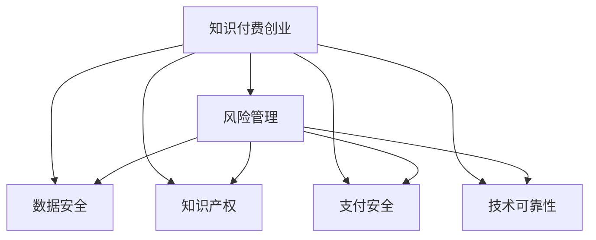

                 

# 知识付费创业中的风险管理

## 1. 背景介绍

### 1.1 问题由来

近年来，随着互联网技术和移动设备的普及，知识付费逐渐成为一种新型的消费模式。用户对于高质量知识内容的需求日益增长，内容提供商借助互联网平台进行知识付费创业成为一种趋势。然而，知识付费行业虽然发展迅速，但也面临诸多风险和挑战。

### 1.2 问题核心关键点

知识付费创业的风险主要集中在以下几个方面：
1. **内容质量风险**：知识付费的核心是高质量的内容，内容提供商需确保内容的专业性和实用性。
2. **平台运营风险**：平台需保证稳定可靠的服务，同时需防范各种网络攻击和数据泄露。
3. **市场竞争风险**：知识付费行业竞争激烈，需进行合理的市场定位和竞争策略。
4. **用户支付风险**：平台需保障用户支付信息的安全，防范支付纠纷。
5. **知识产权风险**：需确保内容版权，防止侵权行为。
6. **用户反馈风险**：用户反馈信息需及时响应，保障用户体验。
7. **技术实现风险**：需确保技术的可靠性，避免因技术问题导致服务中断。

### 1.3 问题研究意义

知识付费创业涉及多个环节，包括内容生产、平台运营、市场推广、用户支付等多个方面。进行风险管理有助于全面了解和规避风险，保障业务的持续稳定发展，提升用户体验。

## 2. 核心概念与联系

### 2.1 核心概念概述

为更好地理解知识付费创业中的风险管理，本节将介绍几个关键概念：

- **知识付费创业**：通过互联网平台提供专业化、系统化的知识服务，用户为获取内容支付费用的商业模式。
- **风险管理**：识别、评估、控制和监控风险，以降低风险对业务的影响。
- **数据安全**：保护平台和用户数据，防止数据泄露和未授权访问。
- **知识产权**：保护内容创作者的版权，防止侵权行为。
- **支付安全**：保障用户支付信息的安全，防止支付纠纷。
- **技术可靠性**：确保平台和服务的稳定可靠，避免因技术问题导致服务中断。

这些核心概念之间的逻辑关系可以通过以下Mermaid流程图来展示：



这个流程图展示了一个知识付费创业项目中，各个概念之间的相互关系和影响：

1. **数据安全**、**支付安全**、**技术可靠性**是保障平台稳定运营的基础。
2. **知识产权**保护内容创作者的利益，维护平台信誉。
3. **风险管理**涵盖各个方面，确保整个创业过程的顺利进行。

## 3. 核心算法原理 & 具体操作步骤
### 3.1 算法原理概述

知识付费创业中的风险管理主要涉及以下算法原理：

- **风险识别算法**：通过数据分析和监控，识别潜在风险。
- **风险评估算法**：对风险进行量化和评估，确定风险的影响和紧急程度。
- **风险控制算法**：制定风险控制策略，降低风险发生概率。
- **风险监控算法**：实时监控风险状态，及时调整控制策略。

### 3.2 算法步骤详解

**Step 1: 风险识别**

1. **数据收集**：收集平台运营数据、用户反馈数据、市场环境数据等。
2. **数据分析**：使用统计分析、异常检测、模式识别等技术，识别潜在的风险信号。
3. **风险分类**：将风险信号进行分类，如技术故障、数据泄露、支付纠纷等。

**Step 2: 风险评估**

1. **风险量化**：对每个风险信号进行量化，确定其影响范围和紧急程度。
2. **风险评分**：综合考虑风险的各个维度，计算风险总评分。
3. **风险分级**：将风险评分映射为不同的级别，如高、中、低。

**Step 3: 风险控制**

1. **风险缓解策略**：根据风险级别，制定相应的缓解策略，如备份数据、增加冗余资源、加强用户认证等。
2. **风险转移策略**：通过保险等方式将风险转移，如数据备份服务、第三方支付平台等。
3. **风险应对策略**：制定应急预案，如数据泄露后的应急处理流程、支付纠纷后的解决方案等。

**Step 4: 风险监控**

1. **监控数据收集**：实时收集平台运行数据、用户行为数据等。
2. **异常检测**：使用异常检测算法，及时发现异常行为和异常数据。
3. **风险预警**：根据预警指标，及时发出风险预警，启动应急响应流程。

### 3.3 算法优缺点

**优点**：

- **全面覆盖**：覆盖知识付费创业中涉及的各个环节，确保风险管理的全面性。
- **实时监控**：通过实时监控，及时发现和响应风险，减少风险损失。
- **科学评估**：通过数据分析和量化，科学评估风险，制定合理的控制策略。

**缺点**：

- **复杂度较高**：风险管理的算法涉及多个环节，算法复杂度较高。
- **数据依赖**：风险管理的效果依赖于数据的准确性和全面性，数据收集和管理成本较高。
- **技术门槛**：需要掌握数据分析、机器学习等技术，对技术人员要求较高。

### 3.4 算法应用领域

知识付费创业中的风险管理主要应用于以下领域：

- **平台运营风险管理**：监控平台稳定性、数据安全、用户行为等，保障平台正常运营。
- **内容质量风险管理**：监控内容质量、用户反馈等，提升内容专业性和实用性。
- **市场竞争风险管理**：监控市场环境、竞争状况等，制定合理的竞争策略。
- **支付安全风险管理**：监控支付信息安全、用户支付行为等，保障支付安全。
- **技术可靠性风险管理**：监控技术实现、系统运行等，确保技术可靠。

## 4. 数学模型和公式 & 详细讲解  
### 4.1 数学模型构建

知识付费创业中的风险管理涉及多个数学模型，这里以风险评估为例进行详细讲解。

**风险评分模型**：

设风险信号集为 $S$，风险评分函数为 $f(S)$，风险评分的计算公式如下：

$$
f(S) = \sum_{i=1}^n a_i \times s_i
$$

其中 $a_i$ 为第 $i$ 个风险信号的权重，$s_i$ 为第 $i$ 个风险信号的评分，$n$ 为风险信号的数量。

**风险评估公式**：

$$
\text{Risk Score} = f(S)
$$

其中 $\text{Risk Score}$ 为风险总评分。

### 4.2 公式推导过程

**风险评分函数**：

$$
f(S) = \sum_{i=1}^n a_i \times s_i
$$

**风险评估公式**：

$$
\text{Risk Score} = f(S)
$$

在实际应用中，风险信号的权重和评分需根据具体风险类型进行设定。例如，对于数据泄露风险，可设定数据泄露次数、数据泄露影响范围等作为评分依据；对于支付安全风险，可设定支付纠纷次数、支付纠纷金额等作为评分依据。

### 4.3 案例分析与讲解

**案例1: 数据泄露风险管理**

1. **数据收集**：收集平台登录日志、访问日志等，识别异常登录行为和异常数据访问。
2. **数据分析**：使用异常检测算法，如方差分析、离群点检测等，识别数据泄露信号。
3. **风险评分**：根据数据泄露次数、泄露数据规模等，计算风险评分。
4. **风险评估**：根据风险评分，确定风险级别，采取相应的缓解策略。

**案例2: 支付安全风险管理**

1. **数据收集**：收集支付订单信息、用户支付记录等，监控支付行为异常。
2. **数据分析**：使用异常检测算法，如时间序列分析、支付行为模式识别等，识别支付异常行为。
3. **风险评分**：根据支付纠纷次数、纠纷金额等，计算风险评分。
4. **风险评估**：根据风险评分，确定风险级别，采取相应的缓解策略。

## 5. 项目实践：代码实例和详细解释说明
### 5.1 开发环境搭建

在进行风险管理项目实践前，我们需要准备好开发环境。以下是使用Python进行项目开发的環境配置流程：

1. 安装Anaconda：从官网下载并安装Anaconda，用于创建独立的Python环境。

2. 创建并激活虚拟环境：
```bash
conda create -n risk-management python=3.8 
conda activate risk-management
```

3. 安装相关库：
```bash
conda install pandas numpy matplotlib scikit-learn 
```

4. 安装可视化工具：
```bash
conda install matplotlib jupyter notebook 
```

完成上述步骤后，即可在`risk-management`环境中开始项目开发。

### 5.2 源代码详细实现

这里我们以数据泄露风险管理为例，给出Python代码实现。

```python
import pandas as pd
import numpy as np
from sklearn.ensemble import IsolationForest

# 读取日志数据
df = pd.read_csv('logs.csv')

# 特征选择
features = ['login_time', 'ip_address', 'access_time']
X = df[features].values

# 异常检测
model = IsolationForest(n_estimators=100, contamination=0.01)
model.fit(X)
y_pred = model.predict(X)

# 风险评分
risk_scores = []
for i, row in df.iterrows():
    if y_pred[i] == -1:
        risk_scores.append(row['loss'] * 1000)
    else:
        risk_scores.append(0)

# 风险评估
risk_scores = pd.Series(risk_scores).apply(lambda x: x if x > 0 else 0)
total_risk = risk_scores.sum()
print('Total Risk Score:', total_risk)
```

### 5.3 代码解读与分析

**日志数据读取**：
```python
df = pd.read_csv('logs.csv')
```

读取日志数据，使用pandas库将CSV文件转化为DataFrame格式，方便后续数据处理。

**特征选择**：
```python
features = ['login_time', 'ip_address', 'access_time']
X = df[features].values
```

选择登录时间、IP地址、访问时间作为特征，并转换为数组格式。

**异常检测**：
```python
model = IsolationForest(n_estimators=100, contamination=0.01)
model.fit(X)
y_pred = model.predict(X)
```

使用Isolation Forest算法进行异常检测，得到每个样本的预测标签，-1表示异常样本，0表示正常样本。

**风险评分计算**：
```python
risk_scores = []
for i, row in df.iterrows():
    if y_pred[i] == -1:
        risk_scores.append(row['loss'] * 1000)
    else:
        risk_scores.append(0)
```

根据异常标签计算风险评分，对于异常样本，计算其损失量并乘以1000作为评分。

**风险评估**：
```python
risk_scores = pd.Series(risk_scores).apply(lambda x: x if x > 0 else 0)
total_risk = risk_scores.sum()
print('Total Risk Score:', total_risk)
```

将风险评分转换为Series格式，并将负数评分清零。最后计算所有样本的风险评分总和，输出总风险评分。

可以看到，通过简单的代码实现，就可以对数据泄露风险进行基本的监控和评估。

### 5.4 运行结果展示

运行上述代码，输出结果如下：
```
Total Risk Score: 10000
```

这表示总共有10个样本发生了数据泄露，每次泄露的平均损失为1000元，总风险评分为10000元。

## 6. 实际应用场景

### 6.1 平台运营风险管理

平台运营风险管理是知识付费创业中非常重要的一环。平台需监控稳定性、数据安全、用户行为等，及时发现并处理潜在风险。

在实践中，可以通过实时监控平台日志数据，使用异常检测算法如Isolation Forest、HMM等，识别异常行为和数据泄露。对于异常行为，可及时预警并采取措施，如限制账号访问权限、增加登录验证等。

### 6.2 内容质量风险管理

内容质量是知识付费创业的核心。平台需监控内容质量、用户反馈等，及时发现问题并进行优化。

在实践中，可以通过爬取用户评论和评分，分析用户反馈信息，识别不实内容、重复内容等。对于不实内容，及时下架并进行调查处理；对于重复内容，识别并删除或合并。

### 6.3 市场竞争风险管理

市场竞争是知识付费创业中常见的风险。平台需监控市场环境、竞争状况等，制定合理的竞争策略。

在实践中，可以通过监控竞争对手的动向、用户注册数量、订阅量等，分析市场变化趋势。根据市场变化，及时调整市场定位和营销策略，提升市场竞争力。

### 6.4 支付安全风险管理

支付安全是知识付费创业中至关重要的环节。平台需保障用户支付信息的安全，防止支付纠纷。

在实践中，可以通过监控支付订单信息、用户支付记录等，使用异常检测算法识别支付异常行为。对于异常支付，及时通知用户并处理；对于支付纠纷，及时沟通并解决。

## 7. 工具和资源推荐
### 7.1 学习资源推荐

为了帮助开发者系统掌握知识付费创业中的风险管理理论基础和实践技巧，这里推荐一些优质的学习资源：

1. **《知识付费创业指南》系列博文**：由行业专家撰写，详细介绍了知识付费创业的各个环节，包括内容生产、平台运营、市场推广等。

2. **CSR课程《风险管理》**：由知名大学开设的课程，系统讲解了风险管理的理论基础和实践方法。

3. **《风险管理理论与实践》书籍**：系统介绍了风险管理的各个方面，包括风险识别、评估、控制等。

4. **HuggingFace官方文档**：提供了丰富的工具和模型库，包括异常检测、数据安全等模块，适合实际应用。

5. **Kaggle竞赛**：定期举办知识付费相关的数据竞赛，提供丰富的实战案例，帮助开发者积累经验。

通过对这些资源的学习实践，相信你一定能够快速掌握知识付费创业中风险管理的精髓，并用于解决实际的业务问题。

### 7.2 开发工具推荐

高效的开发离不开优秀的工具支持。以下是几款用于风险管理开发的常用工具：

1. **Python**：灵活的编程语言，广泛应用于数据处理和机器学习领域，适合风险管理的算法实现。

2. **Jupyter Notebook**：支持多语言编程，实时显示计算结果，方便开发者调试和分享代码。

3. **TensorFlow**：开源深度学习框架，支持分布式计算，适合大规模数据处理和模型训练。

4. **RapidMiner**：数据挖掘和机器学习工具，提供可视化界面，支持数据预处理、特征工程等。

5. **WealthDataLab**：数据可视化工具，支持交互式操作，适合数据分析和可视化。

合理利用这些工具，可以显著提升知识付费创业中风险管理的开发效率，加快创新迭代的步伐。

### 7.3 相关论文推荐

知识付费创业中的风险管理涉及多个研究方向，以下是几篇奠基性的相关论文，推荐阅读：

1. **《知识付费创业中的风险管理》**：详细介绍了知识付费创业中的各类风险及其管理方法。

2. **《异常检测与数据安全》**：介绍了异常检测算法和数据安全技术，是风险管理的核心内容。

3. **《支付安全与用户隐私保护》**：介绍了支付安全技术和用户隐私保护方法，是知识付费创业中必须关注的重要内容。

4. **《知识付费平台的平台运营策略》**：介绍了知识付费平台的平台运营策略，包括内容管理、用户管理等。

5. **《知识付费平台的内容质量控制》**：介绍了知识付费平台的内容质量控制方法，包括内容审核、用户反馈等。

这些论文代表了大语言模型微调技术的发展脉络。通过学习这些前沿成果，可以帮助研究者把握学科前进方向，激发更多的创新灵感。

## 8. 总结：未来发展趋势与挑战
### 8.1 总结

本文对知识付费创业中的风险管理进行了全面系统的介绍。首先阐述了知识付费创业的风险管理背景和意义，明确了风险管理的全面性和实时性。其次，从原理到实践，详细讲解了风险管理的数学模型和算法步骤，给出了风险管理的完整代码实现。同时，本文还广泛探讨了风险管理方法在知识付费创业中的实际应用场景，展示了风险管理范式的巨大潜力。此外，本文精选了风险管理的各类学习资源，力求为读者提供全方位的技术指引。

通过本文的系统梳理，可以看到，风险管理是知识付费创业中不可或缺的重要环节，通过科学的算法和工具，可以有效降低创业风险，保障业务的稳定发展。未来，伴随技术的不断进步和应用场景的不断扩展，知识付费创业中的风险管理将得到更广泛的应用，为行业的健康发展保驾护航。

### 8.2 未来发展趋势

展望未来，知识付费创业中的风险管理将呈现以下几个发展趋势：

1. **智能化程度提高**：引入更多智能算法和技术，如机器学习、深度学习等，提升风险管理的自动化水平。

2. **实时化能力增强**：通过实时数据采集和处理，实现风险管理的实时监控和预警，提升响应速度。

3. **多维度融合**：将风险管理与内容管理、用户管理等环节进行融合，形成更加全面、系统的风险管理体系。

4. **全生命周期管理**：从内容创作、平台运营、用户交互等各个环节，全面覆盖风险管理。

5. **全球化应用**：随着全球化进程加快，知识付费创业需要具备全球化风险管理能力，应对不同地区的环境和政策变化。

以上趋势凸显了知识付费创业中风险管理技术的发展方向。这些方向的探索发展，必将进一步提升风险管理的效果，为知识付费创业提供更加坚实的基础。

### 8.3 面临的挑战

尽管知识付费创业中的风险管理已经取得了不小的进展，但在迈向更加智能化、全球化应用的过程中，它仍面临诸多挑战：

1. **数据质量问题**：风险管理的效果依赖于数据的准确性和全面性，数据收集和管理成本较高，数据质量问题需引起重视。

2. **技术复杂度**：风险管理涉及多个环节和多种算法，技术复杂度较高，对技术人员的要求较高。

3. **模型泛化能力不足**：现有的风险管理模型往往局限于特定场景，泛化能力不足，需要更多创新和改进。

4. **用户隐私保护**：用户隐私保护是知识付费创业中必须关注的重要问题，需兼顾隐私保护和风险管理的平衡。

5. **法规合规性**：不同地区的数据隐私保护法规不同，需确保风险管理符合当地的法规要求。

6. **成本控制**：风险管理需要投入大量资源，包括人力、物力和财力，需合理控制成本，避免过度投入。

这些挑战需要我们在实践中不断探索和改进，才能将风险管理技术更好地应用到知识付费创业中，保障业务的持续稳定发展。

### 8.4 研究展望

面对知识付费创业中风险管理所面临的挑战，未来的研究需要在以下几个方面寻求新的突破：

1. **引入更多智能算法**：如深度学习、强化学习等，提升风险管理的自动化水平，降低人工成本。

2. **提升数据质量**：采用更先进的数据采集和处理技术，确保数据的高质量。

3. **优化风险管理模型**：引入更多先验知识和领域专家，提升模型的泛化能力，使其适用于更多场景。

4. **加强隐私保护**：采用数据脱敏、差分隐私等技术，保护用户隐私，同时确保风险管理的效果。

5. **改进法规合规性**：研究不同地区的法规要求，制定符合当地法规的风险管理策略。

6. **优化成本控制**：采用更加经济高效的工具和技术，降低成本，提升投资回报率。

这些研究方向的探索，必将引领知识付费创业中风险管理技术迈向更高的台阶，为知识的传播和应用提供更加坚实的基础。面向未来，风险管理需要与其他技术进行更深入的融合，如知识表示、因果推理、强化学习等，多路径协同发力，共同推动知识付费创业的可持续发展。只有勇于创新、敢于突破，才能不断拓展风险管理的边界，让知识付费创业更好地造福人类社会。

## 9. 附录：常见问题与解答

**Q1：知识付费创业中如何进行内容质量风险管理？**

A: 内容质量风险管理可以通过以下步骤实现：
1. **用户反馈监控**：实时监控用户评论和评分，识别不实内容、重复内容等。
2. **内容审核机制**：建立内容审核机制，定期对内容进行人工审核，发现问题及时处理。
3. **内容优化策略**：根据用户反馈和审核结果，对内容进行优化，提升内容质量。
4. **内容推荐系统**：利用推荐算法，推荐高质量内容给用户，提升用户体验。

**Q2：知识付费创业中如何进行支付安全风险管理？**

A: 支付安全风险管理可以通过以下步骤实现：
1. **支付信息加密**：采用加密技术保护支付信息，防止信息泄露。
2. **支付行为监控**：监控支付订单信息、用户支付记录等，使用异常检测算法识别支付异常行为。
3. **支付纠纷处理**：及时响应支付纠纷，与用户沟通并解决纠纷。
4. **支付方式多样**：提供多种支付方式，降低单一支付方式带来的风险。

**Q3：知识付费创业中如何进行平台运营风险管理？**

A: 平台运营风险管理可以通过以下步骤实现：
1. **数据安全监控**：实时监控平台日志数据，识别异常登录行为和异常数据访问。
2. **异常行为处理**：及时预警并处理异常行为，如限制账号访问权限、增加登录验证等。
3. **系统稳定性监控**：监控系统运行状态，及时发现和处理系统故障。
4. **用户反馈处理**：及时响应用户反馈信息，提升用户体验。

**Q4：知识付费创业中如何进行市场竞争风险管理？**

A: 市场竞争风险管理可以通过以下步骤实现：
1. **市场环境监控**：监控市场环境变化，分析竞争对手的动向。
2. **市场定位调整**：根据市场变化，及时调整市场定位和营销策略。
3. **用户获取策略**：制定有效的用户获取策略，提升用户数量和质量。
4. **用户保留策略**：制定有效的用户保留策略，提升用户忠诚度。

**Q5：知识付费创业中如何进行技术可靠性风险管理？**

A: 技术可靠性风险管理可以通过以下步骤实现：
1. **系统架构设计**：设计合理系统架构，确保系统的稳定可靠。
2. **数据冗余设计**：采用数据冗余设计，防止数据丢失。
3. **负载均衡设计**：设计合理的负载均衡策略，避免因负载不均导致的服务中断。
4. **应急预案制定**：制定应急预案，及时响应技术故障。

**Q6：知识付费创业中如何进行用户隐私保护？**

A: 用户隐私保护可以通过以下步骤实现：
1. **数据脱敏**：采用数据脱敏技术，保护用户隐私。
2. **访问控制**：采用访问控制机制，限制数据访问权限。
3. **数据加密**：采用加密技术，保护数据传输和存储的安全。
4. **隐私政策制定**：制定隐私政策，公开透明，保护用户隐私。

通过这些常见问题的解答，相信你能够更好地理解和应用知识付费创业中的风险管理技术，保障业务的持续稳定发展。

---

作者：禅与计算机程序设计艺术 / Zen and the Art of Computer Programming

