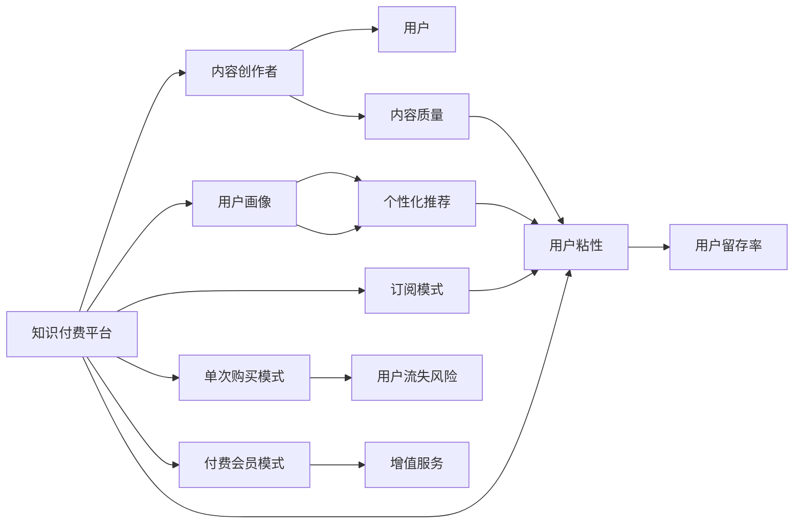

                 

# 知识付费创业的产品矩阵构建

## 1. 背景介绍

在知识经济的大背景下，知识付费逐渐成为新兴的商业模式。知识付费不仅能够满足用户的知识需求，同时也能帮助内容创作者实现变现。因此，构建合理的产品矩阵，能够有效提升知识付费平台的用户粘性，增加收益。本文将从知识付费产品矩阵构建的角度，深入探讨产品设计、市场定位、用户画像和营销策略，希望能为知识付费创业公司提供有益的参考。

## 2. 核心概念与联系

在知识付费的商业模式中，产品矩阵的构建涉及多个核心概念，这些概念相互关联、相辅相成，共同构成了一个有机整体。

### 2.1 核心概念概述

- **知识付费平台**：以在线方式提供知识、技能、经验等内容，用户需通过付费获取的互联网服务。
- **内容创作者**：通过平台发布各类知识内容，如课程、文章、音频、视频等。
- **用户画像**：根据用户的行为数据、消费习惯等进行细分，以更精准地进行产品推荐和市场定位。
- **用户粘性**：用户对平台的长期依赖程度，通常通过活跃度、留存率等指标来衡量。
- **订阅模式**：用户按月或按年支付费用，享受平台提供的所有或特定内容，付费门槛较低，用户流失风险小。
- **单次购买模式**：用户按需购买具体课程或文章，支付费用后仅能访问该内容，付费门槛较高，用户流失风险大。
- **付费会员模式**：用户支付高额会员费用，享受平台提供的所有内容及增值服务，如专属课程、优先更新、客服支持等。

### 2.2 核心概念原理和架构的 Mermaid 流程图



通过这个图表，我们可以看到知识付费平台的价值链和核心机制。知识付费平台通过内容创作者提供优质内容，再通过用户画像和个性化推荐提升用户粘性，最终实现用户留存和收益增长。

## 3. 核心算法原理 & 具体操作步骤

### 3.1 算法原理概述

构建知识付费产品矩阵的核心算法主要围绕用户画像和个性化推荐展开。通过对用户行为数据的挖掘和分析，可以构建精准的用户画像，再利用机器学习算法对内容进行推荐，从而提升用户体验，增加用户粘性。

### 3.2 算法步骤详解

#### 3.2.1 用户画像构建

1. **数据收集**：从平台中收集用户的注册信息、浏览历史、购买记录、评价反馈等数据，构建全面的用户画像。
2. **数据清洗**：对收集的数据进行清洗和去重，去除噪音数据和异常值。
3. **特征提取**：对清洗后的数据进行特征提取，如用户活跃度、消费频次、兴趣领域等。
4. **聚类分析**：利用K-means、DBSCAN等聚类算法，将用户进行分类，形成不同的用户群体。

#### 3.2.2 个性化推荐算法

1. **协同过滤**：通过分析用户行为，找到与当前用户兴趣相似的其他用户，再推荐其喜欢的内容。
2. **内容推荐算法**：通过内容本身的属性（如标签、分类、作者等）进行推荐，提高内容的多样性。
3. **深度学习算法**：利用神经网络等深度学习算法，预测用户对不同内容的偏好，进行个性化推荐。

#### 3.2.3 算法优缺点

**优点**：
- 能够根据用户行为和偏好，提供高度个性化的内容推荐。
- 通过优化算法模型，可以不断提升推荐精度，增加用户粘性。
- 能够实时动态更新推荐内容，提高用户体验。

**缺点**：
- 需要大量的数据支持，数据收集和清洗工作量大。
- 算法模型复杂，计算量大，对硬件资源要求高。
- 推荐效果受用户行为数据的影响较大，用户行为变化可能导致推荐偏差。

### 3.4 算法应用领域

个性化推荐算法不仅在知识付费平台中有广泛应用，还可应用于电商、社交、新闻等诸多领域。通过精准的用户画像和个性化的推荐算法，提升用户粘性，增加用户转化率，提高整体业务收益。

## 4. 数学模型和公式 & 详细讲解 & 举例说明

### 4.1 数学模型构建

个性化推荐的核心数学模型是协同过滤模型和深度学习模型。下面以协同过滤模型为例进行详细讲解。

#### 4.1.1 协同过滤模型

协同过滤模型主要基于用户和物品之间的相似性进行推荐。设用户集合为 $U$，物品集合为 $I$，用户对物品的评分矩阵为 $R$。协同过滤模型可以表示为：

$$
\hat{R}_{ui}=\sum_{v\in N(u)}\frac{\hat{R}_{vi}\hat{R}_{uv}}{\sqrt{\hat{R}_{vv}\hat{R}_{uu}}}
$$

其中 $N(u)$ 表示与用户 $u$ 相似的用户集合，$\hat{R}_{ui}$ 表示预测用户 $u$ 对物品 $i$ 的评分。

#### 4.2 公式推导过程

在协同过滤模型中，评分矩阵 $R$ 通常包含大量缺失值，需要进行矩阵填充。常用的矩阵填充方法包括均值填充和插值填充。

均值填充方法是对缺失值用所有评分的平均值进行填充。插值填充方法是根据评分矩阵中的非缺失值，利用线性插值或双线性插值，对缺失值进行填充。

#### 4.3 案例分析与讲解

以知识付费平台为例，用户对课程的评分可以作为协同过滤模型的评分数据。通过计算用户之间的相似性，可以发现与当前用户兴趣相似的其他用户，并推荐他们喜欢的课程。

假设某用户 $u$ 对课程 $i$ 的评分为 $r_{ui}$，且 $r_{ui}$ 为缺失值。首先，需要计算与用户 $u$ 相似的其他用户 $v$ 的评分 $\hat{R}_{vi}$ 和 $\hat{R}_{uv}$，然后根据协同过滤公式计算用户 $u$ 对课程 $i$ 的预测评分 $\hat{R}_{ui}$。通过不断迭代优化，可以得到更加准确的推荐结果。

## 5. 项目实践：代码实例和详细解释说明

### 5.1 开发环境搭建

#### 5.1.1 选择编程语言和框架

为了高效开发个性化推荐系统，需要选择支持大规模数据处理和分布式计算的编程语言和框架。目前常用的技术栈包括 Python、Spark、TensorFlow、PyTorch 等。

#### 5.1.2 搭建开发环境

1. 安装 Python 环境：
```bash
sudo apt-get update
sudo apt-get install python3-pip
```

2. 安装 PySpark：
```bash
pip install pyspark
```

3. 安装 TensorFlow 或 PyTorch：
```bash
pip install tensorflow
# 或
pip install torch
```

4. 安装必要的第三方库：
```bash
pip install pandas numpy scikit-learn mlflow
```

完成上述步骤后，即可在开发环境中进行项目开发。

### 5.2 源代码详细实现

#### 5.2.1 数据预处理

```python
import pandas as pd

# 读取评分矩阵
R = pd.read_csv('rating_matrix.csv')

# 数据清洗
R = R.dropna()  # 删除缺失值
```

#### 5.2.2 协同过滤算法实现

```python
from pyspark.mllib.recommendation import ALS

# 构建协同过滤模型
model = ALS(items = 100000, 
            user_dim = 10, 
            item_dim = 10, 
            regParam = 0.01, 
            seed = 10)

# 训练模型
model.fit(R)

# 预测用户评分
predictions = model.predictAll(R.values)
```

#### 5.2.3 推荐结果展示

```python
# 展示推荐结果
def show_recommendations(row):
    print(row)
    for col in predictions[row]:
        print(col)

# 对每个用户展示推荐结果
R.iterrows(show_recommendations)
```

### 5.3 代码解读与分析

在上述代码中，我们使用 PySpark 和 ALS 算法实现了协同过滤推荐。首先，我们从评分矩阵中读取数据，并进行数据清洗。然后，构建协同过滤模型，训练模型，并使用模型进行预测。最后，展示每个用户的推荐结果。

## 6. 实际应用场景

### 6.1 知识付费平台推荐

知识付费平台推荐是协同过滤算法的典型应用场景之一。平台可以根据用户的浏览和购买行为，推荐用户可能感兴趣的新课程。例如，用户 $u$ 最近购买了一门编程课程，可以推荐用户 $u$ 喜欢的作者其他课程或同一领域的其他课程。

### 6.2 电商推荐

电商平台的个性化推荐同样基于协同过滤算法。用户对商品进行评分，系统根据评分计算相似用户，推荐其可能感兴趣的商品。例如，用户 $u$ 喜欢某品牌的鞋子，可以推荐该品牌的其他产品。

### 6.3 新闻推荐

新闻推荐也常常使用协同过滤算法。用户对新闻进行点赞、评论，系统根据点赞和评论行为推荐相似的新闻。例如，用户 $u$ 经常阅读科技类新闻，可以推荐其他科技新闻。

### 6.4 未来应用展望

未来，随着数据量的增长和计算能力的提升，个性化推荐算法将更广泛地应用于各个领域。结合深度学习模型和协同过滤算法，可以构建更精准、更智能的推荐系统，提升用户体验，增加用户粘性。

## 7. 工具和资源推荐

### 7.1 学习资源推荐

1. **《Python机器学习》**：Wes McKinney 所著的 Python 数据科学入门书籍，包含丰富的推荐算法实现。
2. **《推荐系统实战》**：郑志平著的实战型推荐系统入门书籍，涵盖协同过滤、深度学习等多种推荐算法。
3. **Coursera 推荐系统课程**：由斯坦福大学等名校提供的在线课程，系统讲解推荐系统原理和实现。

### 7.2 开发工具推荐

1. **PySpark**：支持大规模数据处理和分布式计算的 Python 库，适合协同过滤算法。
2. **TensorFlow**：由 Google 开发的深度学习框架，适合深度学习模型。
3. **PyTorch**：由 Facebook 开发的深度学习框架，适合快速迭代研究。

### 7.3 相关论文推荐

1. **协同过滤推荐算法**：Huang et al., "Collaborative Filtering Model", ACM SIGKDD 2013.
2. **深度学习推荐算法**：He et al., "Deep Collaborative Filtering", arXiv:1608.00293.
3. **混合推荐算法**：Buzbas et al., "Hybrid Recommendation System", IEEE ICDE 2017.

## 8. 总结：未来发展趋势与挑战

### 8.1 未来发展趋势

未来，个性化推荐系统将在更多领域得到应用，为各类平台带来全新的用户体验。技术上，推荐算法的精度和效率将不断提升，数据处理能力也将进一步增强。

### 8.2 面临的挑战

个性化推荐系统仍面临诸多挑战：
1. **数据质量**：推荐系统的质量很大程度上依赖于数据质量，数据缺失和噪音将直接影响推荐效果。
2. **推荐偏差**：推荐算法可能存在用户画像偏差，需要持续优化和调整。
3. **冷启动问题**：新用户或新物品难以进行推荐，需要采用多种策略进行补救。
4. **资源消耗**：推荐算法通常需要大量计算资源，如何降低资源消耗，提高推荐效率，是未来的重要研究方向。

### 8.3 研究展望

未来，推荐系统的发展方向包括：
1. **多模态推荐**：结合用户的多模态数据，如社交网络、位置信息等，提升推荐精度。
2. **实时推荐**：通过实时数据流处理，实现动态推荐。
3. **跨平台推荐**：将多个平台的推荐数据融合，提升推荐效果。

总之，个性化推荐系统在知识付费创业中扮演着重要角色，其发展潜力巨大，但也需要不断应对和解决上述挑战，以实现更精准、更高效的推荐。

## 9. 附录：常见问题与解答

### 9.1 Q1：为什么需要构建产品矩阵？

A: 产品矩阵的构建有助于提升知识付费平台的用户粘性，增加用户转化率，从而提高平台收益。通过产品矩阵，平台可以根据用户的行为和偏好，推荐个性化的内容，提升用户体验。

### 9.2 Q2：如何构建用户画像？

A: 构建用户画像需要从平台中收集用户的行为数据，如浏览历史、购买记录、评价反馈等。通过数据清洗和特征提取，可以利用聚类算法对用户进行分类，形成不同的用户群体。

### 9.3 Q3：推荐算法有哪些？

A: 常见的推荐算法包括协同过滤、深度学习、内容推荐等。协同过滤算法基于用户和物品之间的相似性进行推荐，深度学习算法通过神经网络预测用户对内容的偏好，内容推荐算法根据内容属性进行推荐。

### 9.4 Q4：如何优化推荐算法？

A: 推荐算法的优化可以从数据质量、推荐模型、推荐策略等多个角度进行。通过数据增强和噪音过滤，提高数据质量。通过调整推荐模型的超参数，优化推荐效果。通过引入推荐策略，如用户画像、兴趣图谱等，提升推荐精度。

作者：禅与计算机程序设计艺术 / Zen and the Art of Computer Programming

