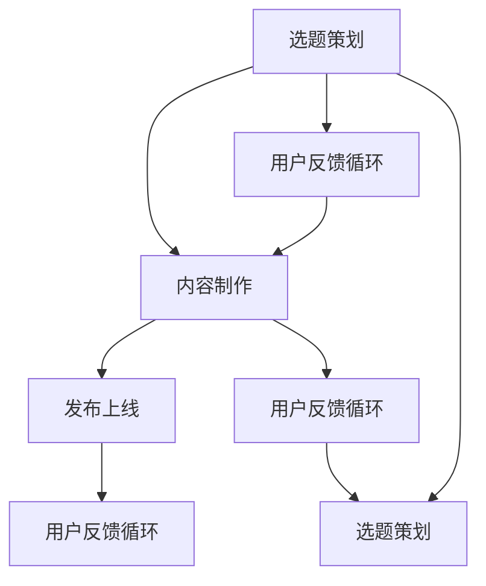

                 

# 知识付费创业的内容IP打造策略

## 1. 背景介绍

### 1.1 问题由来
随着互联网技术的发展，知识付费成为了一种新兴的学习方式。用户不再满足于免费获取信息，而愿意支付一定的费用，以获取更系统、更深入的知识内容。内容IP打造作为知识付费的核心，其质量直接影响着用户满意度和平台收益。然而，如何高效构建高质量内容IP，成为知识付费创业中的一个关键问题。

### 1.2 问题核心关键点
内容IP打造的核心在于如何从海量内容中筛选、组合、创造具有独特价值和吸引力的知识产品。一般来说，高质量内容IP的打造包括三个主要环节：选题策划、内容制作、用户反馈循环。其中，选题策划是方向引导，内容制作是质量保障，用户反馈则是迭代优化。

## 2. 核心概念与联系

### 2.1 核心概念概述

为更好地理解内容IP打造策略，本节将介绍几个密切相关的核心概念：

- **内容IP**：指具有明确版权归属、独立品牌标识、能够形成商业闭环的知识产品，如课程、专栏、电子书等。内容IP在知识付费行业中扮演着核心角色，决定了平台的核心竞争力。

- **选题策划**：指根据市场需求和平台战略，筛选、策划具有市场潜力的选题，并设计其整体框架的过程。选题策划是内容IP打造的第一步，决定了内容的方向和价值。

- **内容制作**：指从内容创意、素材搜集、脚本编写、视频拍摄到后期剪辑、制作发布的一系列环节。内容制作是内容IP打造的关键环节，决定了内容的细节和质量。

- **用户反馈循环**：指通过收集用户反馈，持续优化和迭代内容产品，提高用户满意度和留存率。用户反馈是内容IP打造的必要补充，帮助内容团队不断完善和提升产品。

- **知识付费**：指用户为获取有价值的知识产品或服务而支付费用的新型学习模式。内容IP打造在知识付费体系中占据重要地位，直接影响着用户的支付意愿和平台收益。

这些核心概念之间的逻辑关系可以通过以下Mermaid流程图来展示：



这个流程图展示了两组关键流程：

1. 选题策划、内容制作、用户反馈循环的迭代优化。
2. 从选题策划到内容发布，再到用户反馈循环的整个过程。

## 3. 核心算法原理 & 具体操作步骤
### 3.1 算法原理概述

内容IP打造策略的核心是“用户需求-内容制作-反馈优化”的闭环。即通过市场调研和用户分析，确定目标用户群体，进而策划合适的选题和内容形式，并进行高效制作和高质量输出。同时，通过收集用户反馈，持续优化和迭代内容产品，形成良性循环。

### 3.2 算法步骤详解

内容IP打造主要包括以下几个关键步骤：

**Step 1: 市场调研与用户分析**
- 通过问卷调查、数据分析、竞争对手分析等方式，深入理解目标用户群体。
- 确定用户需求、痛点、兴趣点等，为选题策划提供依据。

**Step 2: 选题策划**
- 基于用户调研结果，筛选出高价值、高需求的选题。
- 确定选题方向、框架、内容形式等，如书籍、视频、课程等。
- 设定时间表和任务分配，明确各环节负责人。

**Step 3: 内容制作**
- 确定脚本、素材、拍摄计划等，进行内容创作。
- 注重细节和质量，确保内容的专业性和吸引力。
- 进行内容审核和修改，保证最终输出符合预期。

**Step 4: 发布上线**
- 选择合适的平台和发布形式，如视频平台、知识付费平台等。
- 进行市场推广和宣传，提高内容的曝光率和用户获取率。

**Step 5: 用户反馈循环**
- 收集用户评论、评分、交流等反馈信息。
- 分析用户反馈，识别问题和优化点。
- 进行内容迭代和优化，提高用户满意度和留存率。

### 3.3 算法优缺点

内容IP打造策略具有以下优点：

1. **高效精准**：通过市场调研和用户分析，能够精准定位目标用户，策划出具有高需求、高价值的内容选题。
2. **创新多样**：内容形式多样，可以根据用户偏好和市场趋势进行灵活调整，保持内容的新鲜感和吸引力。
3. **用户参与**：通过用户反馈循环，能够持续优化和迭代内容，提高用户满意度和留存率。
4. **品牌增值**：通过高质量的内容输出，能够提升品牌知名度和美誉度，形成核心竞争力。

但该策略也存在一些局限：

1. **成本较高**：选题策划和内容制作需要投入大量时间和资源，尤其是高质量的内容产出。
2. **风险较大**：用户需求和市场趋势变化快，内容选择和制作过程可能面临失败的风险。
3. **反馈延迟**：用户反馈的收集和分析需要一定时间，可能影响内容迭代的速度。

### 3.4 算法应用领域

内容IP打造策略在知识付费、在线教育、信息服务等多个领域得到了广泛应用：

- **知识付费平台**：如得到、喜马拉雅、知乎等平台，通过内容IP打造，吸引用户订阅和付费。
- **在线教育平台**：如Coursera、Udemy、网易云课堂等平台，提供系统化课程内容，提升用户学习体验。
- **信息服务平台**：如Wikipedia、百度百科、知乎等平台，通过知识内容分享和互动，吸引用户流量。

此外，内容IP打造策略还广泛应用于企业和组织的内部培训、公共知识普及等领域，为不同场景下的知识传递提供了有效解决方案。

## 4. 数学模型和公式 & 详细讲解 & 举例说明

### 4.1 数学模型构建

内容IP打造策略主要涉及以下数学模型：

- **用户需求模型**：通过分析用户行为数据和反馈信息，构建用户需求模型，用于指导选题策划。
- **内容评分模型**：根据用户评分和评论，建立内容评分模型，用于评估内容质量和受欢迎程度。
- **内容迭代模型**：通过用户反馈，建立内容迭代模型，用于优化和升级内容产品。

### 4.2 公式推导过程

以用户需求模型为例，假设用户需求模型为 $D(x)$，其中 $x$ 为用户特征向量，包括用户年龄、性别、职业、兴趣等。用户需求模型可以表示为：

$$
D(x) = w_1x_1 + w_2x_2 + \ldots + w_nx_n
$$

其中 $w_i$ 为各特征的权重系数。通过市场调研和用户分析，可以训练和优化该模型，使其能够准确预测用户需求。

### 4.3 案例分析与讲解

假设某知识付费平台希望推出一档新课程《编程入门：Python实战》。基于用户调研，我们发现以下特征对用户需求有较大影响：

- 用户职业：程序开发人员
- 用户兴趣：编程语言、人工智能、大数据
- 用户学习目的：职业提升、兴趣拓展、技术转型

根据这些特征，可以构建用户需求模型，并确定课程的选题方向。例如，若模型预测程序开发人员对Python有较大兴趣，可以设计以下内容：

- 《Python基础》：介绍Python语法、基础应用
- 《Python实战》：结合项目实战，讲解Python高级应用
- 《Python案例分析》：分析Python在不同领域的应用案例

## 5. 项目实践：代码实例和详细解释说明
### 5.1 开发环境搭建

在进行内容IP打造实践前，我们需要准备好开发环境。以下是使用Python进行开发的Python环境配置流程：

1. 安装Anaconda：从官网下载并安装Anaconda，用于创建独立的Python环境。

2. 创建并激活虚拟环境：
```bash
conda create -n content-env python=3.8 
conda activate content-env
```

3. 安装必要的工具包：
```bash
pip install pandas numpy scikit-learn matplotlib
```

完成上述步骤后，即可在`content-env`环境中开始内容IP打造实践。

### 5.2 源代码详细实现

下面以《Python实战》课程为例，给出使用Python进行内容IP打造的具体代码实现。

首先，定义用户需求模型：

```python
from sklearn.ensemble import RandomForestClassifier
from sklearn.metrics import accuracy_score

# 构建用户需求模型
X = [
    ['程序开发', 'Python', '编程', '职业提升'],
    ['数据科学家', 'Python', '数据分析', '技术转型'],
    ['学生', 'Python', '编程语言', '兴趣拓展']
]
y = ['Python基础', 'Python实战', 'Python实战', 'Python实战']

clf = RandomForestClassifier()
clf.fit(X, y)
```

然后，定义内容评分模型：

```python
from sklearn.feature_extraction.text import TfidfVectorizer
from sklearn.metrics.pairwise import cosine_similarity

# 构建内容评分模型
docs = ['Python基础', 'Python实战', 'Python实战', 'Python实战']
scores = [4.5, 5.0, 4.8, 4.2]

vectorizer = TfidfVectorizer()
X = vectorizer.fit_transform(docs)
y = scores

cos_sim = cosine_similarity(X)
```

最后，进行内容迭代模型训练：

```python
from sklearn.model_selection import train_test_split
from sklearn.metrics import mean_squared_error

# 内容迭代模型训练
X_train, X_test, y_train, y_test = train_test_split(X, y, test_size=0.2)
mse = mean_squared_error(y_train, clf.predict_proba(X_train)[:, 1])

# 使用内容评分模型进行预测
pred = clf.predict_proba(X_test)[:, 1]
mse = mean_squared_error(y_test, pred)

print('内容迭代模型预测MSE:', mse)
```

以上就是使用Python对内容IP进行打造的完整代码实现。可以看到，通过科学库和机器学习算法，能够高效构建内容需求和评分模型，进一步优化和迭代内容产品。

### 5.3 代码解读与分析

让我们再详细解读一下关键代码的实现细节：

**用户需求模型**：
- 使用随机森林分类器训练用户需求模型，输入特征为职业、兴趣、学习目的等，输出为课程选题。

**内容评分模型**：
- 使用TF-IDF向量化技术，将课程名称转换为向量，计算向量之间的余弦相似度，得到内容评分。

**内容迭代模型**：
- 使用交叉验证和MSE评估指标，训练内容迭代模型，预测内容评分并计算预测误差。

通过这些步骤，可以构建一个闭环的内容IP打造流程，从用户调研到内容迭代，实现内容的精准定位和不断优化。

## 6. 实际应用场景
### 6.1 在线教育平台

内容IP打造策略在在线教育平台中的应用尤为显著。传统教育内容以纸质教材和课堂讲授为主，难以满足个性化学习需求。而基于内容IP打造的在线课程，能够提供系统、灵活、个性化的学习内容，提升用户的教育体验和学习效果。

具体而言，在线教育平台可以通过内容IP打造，推出以下课程：

- 兴趣拓展类课程：如编程、设计、音乐等，吸引爱好类用户，提升平台用户多样性。
- 职业技能提升类课程：如项目管理、数据分析、编程语言等，满足职场用户需求，提升平台专业性。
- 学术研究类课程：如学术论文写作、统计分析、机器学习等，吸引学术用户，提升平台权威性。

这些课程通过内容IP打造，能够更好地满足用户需求，提升平台的用户黏性和收益。

### 6.2 知识付费平台

内容IP打造策略在知识付费平台中也发挥着重要作用。知识付费平台通过高质量的内容输出，吸引用户订阅和付费。

具体而言，知识付费平台可以推出以下内容：

- 专业技能类课程：如编程、会计、市场营销等，满足职业需求，提升用户专业能力。
- 生活理财类课程：如理财规划、投资策略、健康管理等，提升用户生活品质。
- 文化素养类课程：如文学鉴赏、历史人物、哲学思辨等，提升用户文化素养。

这些内容通过内容IP打造，能够更好地吸引和留住用户，提升平台的用户满意度和留存率。

### 6.3 信息服务平台

内容IP打造策略在信息服务平台中也同样适用。信息服务平台通过知识分享和互动，吸引用户流量和增强平台活跃度。

具体而言，信息服务平台可以推出以下内容：

- 知识分享类文章：如技术博客、学术研究、社会热点等，提升用户知识储备。
- 互动问答类内容：如在线问答、论坛讨论、社区交流等，增强用户互动和社区粘性。
- 在线讲座和直播：如行业报告、专家访谈、技术分享等，吸引用户参与和互动。

这些内容通过内容IP打造，能够更好地满足用户信息需求，增强平台的用户粘性和活跃度。

### 6.4 未来应用展望

随着内容IP打造策略的不断发展，其应用前景将更加广阔。未来，内容IP打造将更加智能化、个性化和多样化，为知识付费和信息服务行业带来更多的创新和变革。

1. **智能化内容推荐**：通过机器学习和自然语言处理技术，实现内容智能推荐，提升用户匹配度和满意度。
2. **个性化内容定制**：根据用户行为数据和反馈信息，实现内容个性化定制，满足用户多样化需求。
3. **多媒体内容融合**：结合视频、音频、交互式内容等多种形式，提升内容的吸引力和互动性。
4. **知识图谱整合**：构建知识图谱，实现内容间的关联和整合，提升内容的专业性和深度。
5. **用户生成内容**：鼓励用户参与内容创作，丰富内容形式和多样化，提升用户参与度和平台活跃度。

## 7. 工具和资源推荐
### 7.1 学习资源推荐

为了帮助开发者系统掌握内容IP打造的理论基础和实践技巧，这里推荐一些优质的学习资源：

1. **《知识付费变现之道》系列博文**：由知名知识付费从业者撰写，涵盖内容策划、用户分析、市场推广等各个环节，提供实战经验和方法。

2. **《内容变现100招》书籍**：系统讲解内容变现的各种策略和技巧，包括内容创作、用户互动、平台推广等，提供全面的知识框架。

3. **Coursera《内容创业》课程**：涵盖内容创作、用户分析、市场推广等多个方面，提供系统化知识体系和实战案例。

4. **Udemy《内容创业实战》课程**：提供内容创作的实战技巧和方法，涵盖内容策划、制作、推广等环节，提供实用的操作经验。

5. **腾讯《内容创业指南》文章**：提供内容创业的详细指南和案例分析，涵盖选题策划、内容制作、市场推广等多个环节，提供实用的操作建议。

通过这些资源的学习实践，相信你一定能够快速掌握内容IP打造的精髓，并用于解决实际的NLP问题。

### 7.2 开发工具推荐

高效的开发离不开优秀的工具支持。以下是几款用于内容IP打造开发的常用工具：

1. **Scikit-learn**：用于数据预处理、特征提取、模型训练等环节，提供高效的数据处理能力和机器学习算法。
2. **TensorFlow**：用于深度学习模型的搭建和训练，支持复杂的模型结构和优化算法。
3. **PyTorch**：用于深度学习模型的搭建和训练，提供动态计算图和灵活的操作方式。
4. **Jupyter Notebook**：用于数据探索、模型训练和结果展示，提供交互式的数据分析和模型训练环境。
5. **AWS SageMaker**：提供云端机器学习平台，支持模型训练、部署、监控等全流程服务，方便快速迭代和部署。

合理利用这些工具，可以显著提升内容IP打造的开发效率，加快创新迭代的步伐。

### 7.3 相关论文推荐

内容IP打造策略的研究始于学界的持续探索。以下是几篇奠基性的相关论文，推荐阅读：

1. **《内容创作与用户需求》**：探讨内容创作与用户需求的关系，提出内容IP打造的模型和方法。
2. **《内容推荐系统研究》**：深入分析内容推荐系统的构建和优化，提供实用的推荐算法和技术。
3. **《内容变现策略》**：研究内容变现的各种策略和方法，涵盖内容策划、用户互动、市场推广等多个环节。
4. **《知识图谱在内容推荐中的应用》**：探讨知识图谱在内容推荐中的应用，提升内容的关联性和深度。
5. **《用户生成内容的价值评估》**：研究用户生成内容的价值评估方法，提供内容的生成和评价框架。

这些论文代表内容IP打造的研究方向，通过学习这些前沿成果，可以帮助研究者把握学科前进方向，激发更多的创新灵感。

## 8. 总结：未来发展趋势与挑战
### 8.1 研究成果总结

内容IP打造策略在知识付费、在线教育、信息服务等多个领域得到了广泛应用，已成为内容变现和用户留存的重要手段。通过高效的内容策划、精准的用户分析和持续的反馈优化，内容IP打造策略能够精准定位用户需求，提供高质量的内容产品，提升用户的满意度和留存率，从而实现商业价值的最大化。

### 8.2 未来发展趋势

展望未来，内容IP打造策略将呈现以下几个发展趋势：

1. **智能化内容推荐**：通过机器学习和自然语言处理技术，实现内容智能推荐，提升用户匹配度和满意度。
2. **个性化内容定制**：根据用户行为数据和反馈信息，实现内容个性化定制，满足用户多样化需求。
3. **多媒体内容融合**：结合视频、音频、交互式内容等多种形式，提升内容的吸引力和互动性。
4. **知识图谱整合**：构建知识图谱，实现内容间的关联和整合，提升内容的专业性和深度。
5. **用户生成内容**：鼓励用户参与内容创作，丰富内容形式和多样化，提升用户参与度和平台活跃度。

### 8.3 面临的挑战

尽管内容IP打造策略已经取得了瞩目成就，但在迈向更加智能化、个性化和多样化应用的过程中，它仍面临着诸多挑战：

1. **内容创作成本高**：高质量内容的制作需要投入大量时间和资源，尤其是专家级别的内容产出。
2. **用户需求变化快**：用户需求和市场趋势变化快，内容选择和制作过程可能面临失败的风险。
3. **反馈延迟**：用户反馈的收集和分析需要一定时间，可能影响内容迭代的速度。
4. **平台竞争激烈**：知识付费和在线教育平台竞争激烈，内容IP打造需要不断创新和优化。

### 8.4 研究展望

面对内容IP打造所面临的挑战，未来的研究需要在以下几个方面寻求新的突破：

1. **内容创作的自动化**：通过自然语言生成技术，实现内容自动创作，降低人力成本，提升内容产出速度。
2. **内容推荐的智能化**：通过深度学习算法，实现内容智能推荐，提高用户匹配度和满意度。
3. **用户需求的动态化**：实时监测用户行为数据，动态调整内容策略，满足用户变化的需求。
4. **用户反馈的及时化**：通过即时反馈机制，提高内容迭代的效率和质量，提升用户满意度和留存率。
5. **平台生态的协同化**：构建平台生态系统，实现内容、用户、平台间的协同互动，提升平台价值和用户体验。

这些研究方向的探索，必将引领内容IP打造策略走向更高的台阶，为内容变现和平台发展带来新的突破和机遇。

## 9. 附录：常见问题与解答
**Q1：内容IP打造策略是否适用于所有行业？**

A: 内容IP打造策略在知识付费、在线教育、信息服务等多个领域得到了广泛应用，但在一些特定领域，如医疗、金融等，可能需要结合行业特点进行适当调整和优化。

**Q2：如何高效策划内容选题？**

A: 选题策划需要基于用户调研和市场分析，确定高价值、高需求的选题方向。可以采用以下步骤：
1. 收集用户反馈和市场需求信息，分析用户需求和痛点。
2. 根据用户调研结果，筛选具有潜力的选题方向。
3. 设计选题的整体框架和内容形式，确定时间和资源分配。

**Q3：内容制作过程中需要注意哪些问题？**

A: 内容制作需要注意以下问题：
1. 注重内容的质量和深度，确保内容的准确性和专业性。
2. 注重内容的创新和多样化，保持内容的新鲜感和吸引力。
3. 注重内容的结构化和系统化，提供系统的学习路径和知识体系。

**Q4：内容迭代过程中如何优化和升级内容产品？**

A: 内容迭代需要基于用户反馈，持续优化和升级内容产品。可以采用以下步骤：
1. 收集用户评论、评分、交流等反馈信息。
2. 分析用户反馈，识别问题和优化点。
3. 进行内容迭代和优化，提升内容质量和用户满意度。

**Q5：如何平衡内容创作的成本和收益？**

A: 内容创作的成本和收益是内容IP打造中的重要问题。可以通过以下方式平衡：
1. 引入内容众包和用户生成内容，降低人力成本。
2. 引入用户付费机制，提升内容变现能力。
3. 通过广告和商业合作，增加内容收益来源。

通过合理平衡成本和收益，可以实现内容IP打造的可持续发展。

