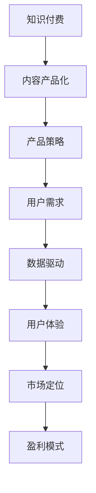

                 

# 知识付费创业的内容产品化策略

> 关键词：知识付费,内容产品化,产品策略,用户需求,数据驱动,用户体验,市场定位,盈利模式

## 1. 背景介绍

### 1.1 问题由来
知识付费的兴起，带来了内容创业的巨大机会。在互联网时代，知识和信息正在变得越来越有价值。人们愿意为获取更高质量、更高效的学习资源付费，以加速个人成长和职业发展。而知识付费创业的崛起，也使得越来越多的内容创作者能够通过提供有价值的知识内容，获得持续的收益和影响力。

然而，知识付费的竞争日益激烈，内容创业的成功不仅依赖于内容本身的价值，还需要科学的产品化策略来提升用户的粘性和转化率。内容产品化不仅是将知识内容转化为产品，更是一门艺术，需要精准把握用户需求，精心设计产品功能和体验，从而在激烈的市场竞争中脱颖而出。

### 1.2 问题核心关键点
知识付费创业的内容产品化策略，主要关注以下几个关键点：

1. **用户需求理解**：准确把握用户的学习需求、痛点和行为特征，从而设计符合用户期望的内容产品。
2. **内容质量提升**：确保内容的深度、广度和时效性，不断提升内容的价值和吸引力。
3. **用户体验优化**：打造直观易用、互动性强、个性化定制的用户界面和功能，提升用户的参与度和满意度。
4. **市场定位明确**：精准定位目标用户群体，差异化竞争，形成独特的产品定位和品牌形象。
5. **盈利模式多元化**：探索多种盈利方式，如订阅制、单次付费、会员特权等，实现多元化收入。

### 1.3 问题研究意义
掌握知识付费创业的内容产品化策略，对于内容创作者和创业者来说，具有重要意义：

1. **提升内容价值**：通过科学的产品化策略，可以更好地实现内容价值，提升用户的支付意愿和长期粘性。
2. **降低创业风险**：明确的用户需求定位和市场差异化策略，能够帮助创业公司在激烈的市场竞争中稳定发展。
3. **拓展盈利渠道**：多元化的盈利模式，可以增强收入的稳定性和抗风险能力，提升公司的财务健康度。
4. **建立品牌形象**：独特的产品定位和用户体验设计，有助于建立良好的品牌形象，提升市场竞争力。
5. **激励内容创新**：通过用户反馈和数据驱动的产品优化，激励创作者不断改进内容，提升产品竞争力。

## 2. 核心概念与联系

### 2.1 核心概念概述

为更好地理解知识付费创业的内容产品化策略，本节将介绍几个密切相关的核心概念：

- **知识付费**：指通过付费方式获取知识和信息服务的模式。用户通过支付一定的费用，获得对知识内容的高效访问和使用。
- **内容产品化**：将知识内容转化为易于传播、购买和使用的产品形式。通过内容产品化，将内容与用户需求紧密结合，提升内容的价值和吸引力。
- **产品策略**：指在产品设计、开发、推广等环节，为实现用户需求和商业目标所采取的一系列规划和执行措施。
- **用户需求**：指用户在使用产品时所产生的一系列需求和期望。内容产品化需以用户需求为出发点，设计符合用户期望的产品功能和体验。
- **数据驱动**：指通过收集和分析用户行为数据，指导产品设计和优化决策的过程。数据驱动能够帮助产品团队精准把握用户需求，提升用户体验和产品效果。
- **用户体验**：指用户在接触和使用产品时所感受到的满意度和愉悦度。优秀的用户体验能够增强用户粘性和转化率，提升产品竞争力。
- **市场定位**：指产品根据目标用户的特征和需求，明确自身的市场定位和差异化策略。市场定位有助于产品在市场中占据独特的竞争优势。
- **盈利模式**：指产品如何实现商业价值的策略，包括但不限于订阅制、单次付费、会员特权等。多元化的盈利模式有助于增强收入的稳定性和抗风险能力。

这些核心概念之间的逻辑关系可以通过以下Mermaid流程图来展示：



这个流程图展示的内容产品化过程的核心链条：从知识付费出发，经过内容产品化，逐步细化到产品策略、用户需求、数据驱动、用户体验、市场定位和盈利模式等环节，从而形成完整的产品化策略框架。

## 3. 核心算法原理 & 具体操作步骤
### 3.1 算法原理概述

知识付费创业的内容产品化策略，本质上是一个多目标优化过程。其核心思想是：通过精准的用户需求分析、优质的内容创作、创新的产品设计、科学的市场推广和合理的盈利模式，实现知识付费产品的高效转化和持续盈利。

形式化地，假设知识付费产品的用户体验为 $U$，用户满意度为 $S$，用户留存率为 $R$，产品商业收益为 $P$，则内容产品化策略的优化目标为：

$$
\max_{\theta} U(S, R, P)
$$

其中 $\theta$ 为策略参数，包括内容质量、用户体验、市场推广等。通过梯度下降等优化算法，不断调整策略参数 $\theta$，最大化用户体验和商业收益。

### 3.2 算法步骤详解

知识付费创业的内容产品化策略，一般包括以下几个关键步骤：

**Step 1: 用户需求调研与分析**

- 通过问卷调查、用户访谈、数据分析等方法，收集目标用户的学习需求、痛点和行为特征。
- 分析用户行为数据，识别用户在不同场景下的需求变化趋势。
- 通过用户画像、用户画像聚类等技术，进一步细分用户群体，识别不同用户群体的独特需求。

**Step 2: 内容质量提升**

- 组织专业团队，根据用户需求，设计高质量的内容方案。
- 采用内容运营策略，如专题策划、知识图谱、案例分享等，不断提升内容的时效性和深度。
- 引入技术手段，如知识图谱、自然语言处理等，提升内容检索和推荐效果。

**Step 3: 用户体验优化**

- 设计直观易用、互动性强、个性化定制的用户界面和功能。
- 引入多媒体元素，如视频、音频、图像等，丰富用户体验。
- 通过A/B测试等方法，不断迭代优化产品功能和交互方式。

**Step 4: 市场定位明确**

- 根据目标用户群体，明确产品市场定位和差异化策略。
- 设计符合目标用户群体特征的营销策略和推广渠道。
- 建立品牌形象，通过社交媒体、行业论坛等渠道进行品牌曝光和用户互动。

**Step 5: 盈利模式多元化**

- 探索多种盈利方式，如订阅制、单次付费、会员特权等。
- 设计合理的会员体系和权益，提升用户粘性和消费频率。
- 引入增值服务，如专属课程、定制内容等，提升用户付费意愿。

**Step 6: 数据驱动产品优化**

- 收集用户行为数据，如学习时长、互动频率、消费行为等。
- 分析数据，识别用户行为变化趋势和潜在需求。
- 通过数据反馈，指导产品迭代和优化。

### 3.3 算法优缺点

知识付费创业的内容产品化策略，具有以下优点：

1. **用户需求精准把握**：通过用户调研和数据分析，可以精准把握用户需求，设计符合用户期望的产品功能和体验。
2. **内容价值提升**：通过内容运营和内容优化，不断提升内容的时效性和深度，增加用户粘性和支付意愿。
3. **市场定位明确**：明确的市场定位有助于产品在市场中占据独特的竞争优势，提高品牌知名度和用户信任度。
4. **盈利模式多样**：多元化的盈利模式可以增强收入的稳定性和抗风险能力，提升公司的财务健康度。

同时，该策略也存在一定的局限性：

1. **用户调研成本高**：用户调研和数据分析需要投入大量人力和资源，尤其是对于新用户群体，调研难度较大。
2. **内容创作难度大**：高质量内容创作需要专业团队和丰富的知识储备，且创作周期较长，难以快速响应市场变化。
3. **用户体验优化复杂**：用户体验优化需要持续迭代和优化，尤其对于复杂功能，涉及前端、后端、设计等多个团队协同工作，难以快速迭代。
4. **市场推广难度高**：市场定位和推广策略需要精准把握市场趋势和用户需求，否则容易出现推广效果不佳的情况。
5. **数据隐私问题**：收集和分析用户数据时，需遵守相关法律法规，保护用户隐私，避免数据泄露和滥用。

尽管存在这些局限性，但就目前而言，知识付费创业的内容产品化策略仍是最主流范式。未来相关研究的重点在于如何进一步降低用户调研成本，提高内容创作效率，优化用户体验，同时兼顾数据隐私和安全等因素。

### 3.4 算法应用领域

知识付费创业的内容产品化策略，已经在众多领域得到广泛应用，例如：

- 在线教育：提供专业课程、技能培训、个性化学习计划等，满足用户的多样化学习需求。
- 职场培训：提供职业技能、管理知识、职业规划等课程，帮助用户提升职场竞争力。
- 健康管理：提供健康知识、营养指导、心理健康等课程，帮助用户提高生活质量。
- 财经投资：提供投资知识、财务规划、市场分析等课程，帮助用户做出更明智的投资决策。
- 编程开发：提供编程语言、框架技术、项目实战等课程，帮助用户提升编程能力。

除了上述这些经典领域外，知识付费创业的内容产品化策略还被创新性地应用到更多场景中，如亲子教育、旅游攻略、设计艺术等，为不同用户群体提供个性化的知识和信息服务。

## 4. 数学模型和公式 & 详细讲解 & 举例说明

### 4.1 数学模型构建

本节将使用数学语言对知识付费创业的内容产品化策略进行更加严格的刻画。

记知识付费产品的用户体验为 $U$，用户满意度为 $S$，用户留存率为 $R$，产品商业收益为 $P$。设用户需求为 $D$，内容质量为 $C$，用户体验为 $X$，市场推广为 $M$，则优化目标为：

$$
\max_{\theta} U(S, R, P) = f(D, C, X, M)
$$

其中 $\theta$ 为策略参数，包括内容质量、用户体验、市场推广等。

### 4.2 公式推导过程

以下我们以在线教育领域为例，推导用户体验函数 $U(S, R, P)$ 的计算公式。

假设在线教育平台的订阅用户数为 $U_0$，用户续订率为 $r$，单月订阅费用为 $P_0$，则平台每月商业收益为 $P = U_0 \times r \times P_0$。用户满意度 $S$ 可以分解为学习内容的深度和广度 $C_D$、用户体验 $X_E$ 和市场推广效果 $M_E$ 的加权和，即：

$$
S = w_C \times C_D + w_X \times X_E + w_M \times M_E
$$

其中 $w_C$、$w_X$、$w_M$ 为权重系数，$C_D$、$X_E$、$M_E$ 分别为内容深度、用户体验和市场推广效果的评分。

用户留存率 $R$ 可以表示为用户续订率 $r$ 的函数，即：

$$
R = r = f(D, C, X, M)
$$

综合上述公式，优化目标 $U(S, R, P)$ 可以表示为：

$$
U(S, R, P) = f(D, C, X, M)
$$

通过优化 $f(D, C, X, M)$，最大化用户体验 $U$ 和商业收益 $P$。

### 4.3 案例分析与讲解

以在线教育平台的微调策略为例，分析用户体验优化过程。

假设在线教育平台提供了一门关于编程语言 Python 的课程，用户学习完课程后的满意度评分 $S$ 可以分解为课程内容的深度 $C_D$、学习界面的用户体验 $X_E$ 和平台推广效果 $M_E$ 的加权和，即：

$$
S = w_C \times C_D + w_X \times X_E + w_M \times M_E
$$

其中 $w_C$、$w_X$、$w_M$ 为权重系数。课程深度 $C_D$ 可以通过专业评测和用户反馈评估，学习界面的体验 $X_E$ 可以通过A/B测试等方法获得，平台推广效果 $M_E$ 可以通过广告投放效果和用户转化率等数据计算得出。

在优化过程中，可以通过调整权重系数 $w_C$、$w_X$、$w_M$ 和各指标的值，不断优化用户体验函数 $U(S, R, P)$，提升用户满意度和商业收益。例如，通过增加用户互动和个性化推荐，提升 $X_E$ 的值；通过优化课程内容，提升 $C_D$ 的值；通过优化广告投放策略，提升 $M_E$ 的值，从而整体提升用户体验 $U$ 和商业收益 $P$。

## 5. 项目实践：代码实例和详细解释说明

### 5.1 开发环境搭建

在进行内容产品化策略的实践前，我们需要准备好开发环境。以下是使用Python进行Flask框架开发的环境配置流程：

1. 安装Anaconda：从官网下载并安装Anaconda，用于创建独立的Python环境。

2. 创建并激活虚拟环境：
```bash
conda create -n flask-env python=3.8 
conda activate flask-env
```

3. 安装Flask和相关依赖：
```bash
pip install flask
pip install flask-restful flask-migrate flask-sqlalchemy
```

4. 安装必要的数据库：
```bash
pip install mysql-connector-python
```

5. 安装必要的第三方库：
```bash
pip install Jinja2 PyYAML requests
```

完成上述步骤后，即可在`flask-env`环境中开始微调实践。

### 5.2 源代码详细实现

这里我们以知识付费平台为例，给出使用Flask框架构建在线教育平台的代码实现。

首先，定义平台的数据库和模型：

```python
from flask_sqlalchemy import SQLAlchemy
from flask_marshmallow import Marshmallow

db = SQLAlchemy()
ma = Marshmallow()

class User(db.Model):
    id = db.Column(db.Integer, primary_key=True)
    name = db.Column(db.String(100))
    email = db.Column(db.String(100))
    password = db.Column(db.String(100))

    def __init__(self, name, email, password):
        self.name = name
        self.email = email
        self.password = password

class UserSchema(ma.SQLAlchemyAutoSchema):
    class Meta:
        model = User
        fields = ('id', 'name', 'email', 'password')
```

然后，定义API接口：

```python
from flask import Flask, request
from flask_restful import Resource, Api

app = Flask(__name__)
api = Api(app)

class UserResource(Resource):
    def get(self, user_id):
        user = User.query.get(user_id)
        return user, 200

    def post(self):
        data = request.get_json()
        user = User(name=data['name'], email=data['email'], password=data['password'])
        db.session.add(user)
        db.session.commit()
        return {'message': 'User created'}, 201

class UserListResource(Resource):
    def get(self):
        users = User.query.all()
        users_schema = UserSchema(many=True)
        return users_schema.dump(users), 200

api.add_resource(UserResource, '/users/<int:user_id>')
api.add_resource(UserListResource, '/users')
```

最后，启动Flask应用：

```python
if __name__ == '__main__':
    app.run(debug=True)
```

以上就是使用Flask框架构建在线教育平台的完整代码实现。可以看到，通过Flask的RESTful API设计，我们能够快速搭建一个简单的用户管理平台，方便后续进行内容产品化的功能扩展和优化。

### 5.3 代码解读与分析

让我们再详细解读一下关键代码的实现细节：

**User类和UserSchema**：
- `User`类表示平台用户，包含用户的基本信息，如姓名、邮箱和密码。
- `UserSchema`类用于序列化和反序列化`User`对象，方便在前端和后端之间进行数据交换。

**API接口**：
- 定义了两个API接口，一个是根据用户ID获取用户信息的接口，另一个是创建新用户的接口。
- 在获取用户信息的接口中，使用了SQLAlchemy进行数据库查询，并返回了`UserSchema`序列化后的用户对象。
- 在创建新用户的接口中，从请求中获取用户信息，并将其添加到数据库中。

**Flask应用**：
- 通过`Flask`和`Flask-Restful`扩展，定义了Flask应用和RESTful API接口。
- 在应用启动时，调用`app.run(debug=True)`启动应用，并在控制台打印出调试信息。

这个简单的用户管理平台虽然功能有限，但通过API接口设计，可以方便地扩展和集成到在线教育平台中，实现更多的内容产品化功能。

## 6. 实际应用场景

### 6.1 智能学习平台

基于知识付费创业的内容产品化策略，智能学习平台可以实现个性化推荐和智能辅助学习。通过收集用户的学习行为数据，分析用户的知识水平和学习偏好，可以智能推荐符合用户需求的学习内容。同时，平台可以引入智能辅导系统，根据用户的理解程度和知识盲点，提供个性化的学习计划和实时反馈，提升学习效果。

例如，平台可以根据用户的过往学习记录和知识掌握情况，推荐适合的课程和习题。通过智能分析用户的答题情况，及时发现用户的知识盲点和错误，并提供相应的错题分析和个性化解析，帮助用户迅速纠正错误，提升学习效果。

### 6.2 企业内部培训

在企业内部培训中，知识付费创业的内容产品化策略可以帮助企业构建更加高效、灵活的培训系统。通过收集员工的培训反馈和行为数据，可以设计符合员工需求的培训课程，提升培训的针对性和有效性。同时，平台可以引入虚拟现实(VR)和增强现实(AR)技术，提供沉浸式的培训体验，增强培训的趣味性和互动性。

例如，平台可以根据员工的岗位需求和学习进度，推荐适合的培训课程和案例。通过VR/AR技术，模拟真实工作场景，提供员工实操演练的机会，帮助员工更好地理解和掌握知识点。同时，平台可以通过学习行为分析，提供个性化的学习路径和反馈，帮助员工更快地掌握新技能。

### 6.3 内容创作者平台

在内容创作者平台中，知识付费创业的内容产品化策略可以帮助创作者更好地推广和变现内容。通过数据分析和用户反馈，创作者可以优化内容质量和传播策略，提升内容的受欢迎程度和用户粘性。同时，平台可以引入付费墙、付费文章等商业模式，提升创作者的收益和平台的用户转化率。

例如，平台可以根据用户对某一主题的兴趣程度，推荐相关的优质内容。通过付费墙和付费文章，创作者可以吸引更多的精准用户，提升收益。同时，平台可以通过数据分析和用户反馈，优化内容推荐策略，提升内容的曝光度和受欢迎程度。

## 7. 工具和资源推荐

### 7.1 学习资源推荐

为了帮助开发者系统掌握知识付费创业的内容产品化策略，这里推荐一些优质的学习资源：

1. **《知识付费产品化：从0到1》系列博文**：由知识付费行业专家撰写，详细介绍了从用户调研、内容创作、产品设计到市场推广的全流程实践方法。

2. **《产品经理必备的数据分析工具》课程**：通过介绍常用的数据分析工具和技巧，帮助产品经理提升数据驱动的决策能力。

3. **《用户体验设计指南》书籍**：系统介绍了用户体验设计的理论和实践方法，包括用户调研、界面设计、交互设计等环节。

4. **《数据科学实战》课程**：通过实战案例，介绍了数据收集、数据处理、模型训练等全流程的实战技巧，帮助产品经理提升数据驱动的产品决策能力。

5. **《知识付费创业实战指南》书籍**：通过实战经验分享，介绍了知识付费创业的各个环节，包括用户调研、内容创作、产品设计、市场推广等。

通过对这些资源的学习实践，相信你一定能够快速掌握知识付费创业的内容产品化策略，并用于解决实际的产品设计问题。

### 7.2 开发工具推荐

高效的开发离不开优秀的工具支持。以下是几款用于知识付费创业内容产品化开发的常用工具：

1. **Flask**：Python的轻量级Web框架，适合快速搭建API接口和Web应用，具有灵活性和易用性。
2. **Django**：Python的全功能Web框架，具有丰富的功能库和模板，适合复杂应用开发。
3. **RESTful API设计工具**：如Postman、Swagger等，用于测试和文档设计API接口。
4. **MySQL和PostgreSQL**：常用的关系型数据库，适合存储和管理用户数据和行为数据。
5. **MongoDB和Redis**：常用的NoSQL数据库和内存数据库，适合存储和管理大规模数据和实时数据。
6. **Jupyter Notebook**：Python开发常用的交互式开发环境，适合进行数据分析和模型训练。

合理利用这些工具，可以显著提升内容产品化开发的效率，加快创新迭代的步伐。

### 7.3 相关论文推荐

知识付费创业的内容产品化策略，已经得到了学界的广泛关注。以下是几篇奠基性的相关论文，推荐阅读：

1. **《知识付费平台的用户行为分析与优化》**：通过分析用户行为数据，提出优化知识付费平台用户体验的策略。
2. **《基于机器学习的智能学习平台推荐算法》**：通过引入机器学习算法，提升智能学习平台的内容推荐效果。
3. **《企业内部培训的个性化学习路径设计》**：通过个性化学习路径设计，提升企业内部培训的效果。
4. **《知识付费创业的商业模式创新》**：通过探索新的商业模式，提升知识付费创业的盈利能力和用户转化率。

这些论文代表了大规模知识付费创业的内容产品化策略的发展脉络。通过学习这些前沿成果，可以帮助研究者把握学科前进方向，激发更多的创新灵感。

## 8. 总结：未来发展趋势与挑战

### 8.1 总结

本文对知识付费创业的内容产品化策略进行了全面系统的介绍。首先阐述了知识付费创业的背景和意义，明确了内容产品化在提升用户体验和商业收益中的重要作用。其次，从原理到实践，详细讲解了内容产品化的数学模型和关键步骤，给出了内容产品化的完整代码实例。同时，本文还广泛探讨了内容产品化在智能学习平台、企业内部培训和内容创作者平台等多个领域的应用前景，展示了内容产品化策略的巨大潜力。此外，本文精选了内容产品化的各类学习资源，力求为读者提供全方位的技术指引。

通过本文的系统梳理，可以看到，知识付费创业的内容产品化策略正在成为知识付费领域的重要范式，极大地提升了内容价值和用户体验，为知识付费创业提供了新的方向。未来，伴随内容创作技术、数据技术和市场推广技术的不断进步，知识付费创业的内容产品化策略必将迎来更大的发展机遇。

### 8.2 未来发展趋势

展望未来，知识付费创业的内容产品化策略将呈现以下几个发展趋势：

1. **AI驱动的个性化推荐**：通过引入AI技术，实现更精准的内容推荐，提升用户体验和转化率。例如，引入自然语言处理和知识图谱技术，提升内容检索和推荐效果。
2. **数据驱动的产品优化**：通过大规模用户行为数据的收集和分析，指导产品设计和优化决策，实现数据驱动的产品优化。例如，通过用户行为数据分析，发现用户痛点和需求变化，进行产品迭代和优化。
3. **多元化盈利模式**：探索更多的盈利方式，如订阅制、单次付费、会员特权等，增强收入的稳定性和抗风险能力。例如，通过会员体系和增值服务，提升用户粘性和消费频率。
4. **跨平台内容协同**：通过跨平台内容协同，实现内容在多个平台之间的互通和共享，提升内容传播效果和用户覆盖面。例如，通过内容集成和共享，提升内容的曝光度和受欢迎程度。
5. **全球化内容推广**：通过全球化内容推广，拓展知识付费创业的市场空间，提升国际用户的覆盖面和品牌影响力。例如，通过全球化的市场推广策略，拓展国际市场，提升全球用户的覆盖面。

以上趋势凸显了知识付费创业的内容产品化策略的广阔前景。这些方向的探索发展，必将进一步提升知识付费创业的产品竞争力，为内容创作者和用户带来更多的价值和机会。

### 8.3 面临的挑战

尽管知识付费创业的内容产品化策略已经取得了瞩目成就，但在迈向更加智能化、普适化应用的过程中，它仍面临着诸多挑战：

1. **用户调研成本高**：用户调研和数据分析需要投入大量人力和资源，尤其是对于新用户群体，调研难度较大。如何降低调研成本，提高调研效率，是未来的一个重要课题。
2. **内容创作难度大**：高质量内容创作需要专业团队和丰富的知识储备，且创作周期较长，难以快速响应市场变化。如何提升内容创作效率，缩短内容生产和传播周期，是未来的一个重要方向。
3. **数据隐私问题**：收集和分析用户数据时，需遵守相关法律法规，保护用户隐私，避免数据泄露和滥用。如何在保护用户隐私的前提下，利用数据驱动的产品优化，是未来的一个重要挑战。
4. **市场推广难度高**：市场定位和推广策略需要精准把握市场趋势和用户需求，否则容易出现推广效果不佳的情况。如何精准把握市场趋势，提升市场推广效果，是未来的一个重要课题。
5. **内容质量不稳定**：高质量内容创作需要严格的审核和校验机制，但内容质量的不稳定性仍然是一个重要问题。如何建立稳定的内容审核机制，保证内容质量，是未来的一个重要方向。

尽管存在这些挑战，但就目前而言，知识付费创业的内容产品化策略仍是最主流范式。未来相关研究的重点在于如何进一步降低用户调研成本，提高内容创作效率，优化用户体验，同时兼顾数据隐私和安全等因素。

### 8.4 研究展望

面对知识付费创业的内容产品化策略所面临的种种挑战，未来的研究需要在以下几个方面寻求新的突破：

1. **无监督学习和自适应推荐**：探索无监督学习和自适应推荐方法，摆脱对大规模标注数据的依赖，利用用户行为数据进行内容推荐。例如，引入生成对抗网络(GAN)和自适应推荐算法，提升推荐效果。
2. **内容创作自动化**：引入内容创作自动化技术，利用自然语言生成(NLG)和智能摘要技术，提升内容创作的效率和质量。例如，引入NLG技术，自动生成知识文章和案例分析，提升内容创作效率。
3. **数据驱动的内容优化**：通过大数据分析和机器学习技术，实现数据驱动的内容优化。例如，利用用户行为数据分析，发现用户痛点和需求变化，进行内容迭代和优化。
4. **跨平台内容协同**：通过跨平台内容协同，实现内容在多个平台之间的互通和共享，提升内容传播效果和用户覆盖面。例如，通过内容集成和共享，提升内容的曝光度和受欢迎程度。
5. **全球化内容推广**：通过全球化内容推广，拓展知识付费创业的市场空间，提升国际用户的覆盖面和品牌影响力。例如，通过全球化的市场推广策略，拓展国际市场，提升全球用户的覆盖面。

这些研究方向的探索，必将引领知识付费创业的内容产品化策略迈向更高的台阶，为内容创作者和用户带来更多的价值和机会。面向未来，知识付费创业的内容产品化策略还需要与其他人工智能技术进行更深入的融合，如知识表示、因果推理、强化学习等，多路径协同发力，共同推动知识付费技术的进步。只有勇于创新、敢于突破，才能不断拓展知识付费创业的边界，让知识付费技术更好地造福社会。

## 9. 附录：常见问题与解答

**Q1：知识付费创业的内容产品化策略是否适用于所有领域？**

A: 知识付费创业的内容产品化策略适用于大多数领域，特别是那些需要高质量知识和信息服务的领域。但在一些特定领域，如医疗、金融等，需要更多专业知识储备和严格审核机制，才能保证内容的质量和可信度。

**Q2：如何评估内容产品化策略的效果？**

A: 内容产品化策略的效果评估可以从多个维度进行，如用户满意度、用户留存率、商业收益、内容点击率、互动率等。可以通过A/B测试、用户调研和数据分析等方法，评估内容产品化策略的实际效果。同时，可以通过KPI指标和业务目标，指导内容产品化的优化方向。

**Q3：如何在内容产品化过程中优化用户体验？**

A: 优化用户体验是内容产品化的重要目标。可以通过收集用户反馈、分析用户行为数据、优化产品界面和交互方式等方法，不断提升用户体验。例如，通过A/B测试，不断迭代和优化产品界面和交互方式，提升用户满意度。同时，可以通过引入多媒体元素和个性化推荐，提升用户粘性和互动性。

**Q4：如何平衡用户体验和商业收益？**

A: 在内容产品化过程中，用户体验和商业收益是相互关联的。需要通过科学的产品设计，平衡用户体验和商业收益。例如，通过引入付费墙和增值服务，提升商业收益，同时通过优化内容质量和个性化推荐，提升用户体验。

**Q5：知识付费创业的内容产品化策略有哪些具体的实现方式？**

A: 内容产品化策略的具体实现方式包括但不限于：
1. 用户需求调研：通过问卷调查、用户访谈、数据分析等方法，收集用户需求和行为数据。
2. 内容质量提升：通过专业团队和内容运营策略，提升内容质量和深度。
3. 用户体验优化：通过A/B测试和用户反馈，优化产品界面和交互方式。
4. 市场定位明确：通过市场调研和数据分析，明确产品市场定位和差异化策略。
5. 盈利模式多元化：通过订阅制、单次付费、会员特权等盈利方式，提升商业收益。
6. 数据驱动产品优化：通过用户行为数据分析，指导产品设计和优化决策。

这些实现方式需要根据具体产品特点和市场需求，灵活组合和应用。

---

作者：禅与计算机程序设计艺术 / Zen and the Art of Computer Programming

