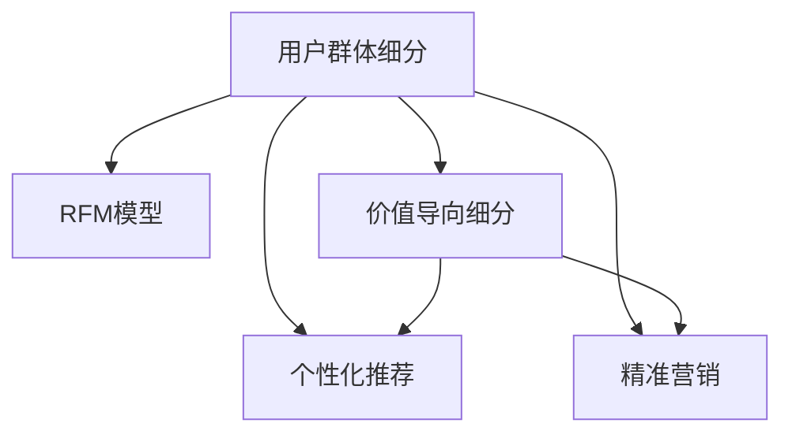

                 

# 知识付费创业的用户群体细分策略

## 1. 背景介绍

### 1.1 问题由来
随着互联网的迅猛发展，知识付费成为越来越多人获取知识、提升个人能力和职业发展的重要途径。然而，随着市场竞争的加剧，许多知识付费平台逐渐陷入价格战和内容同质化的泥潭。如何在激烈的市场竞争中脱颖而出，成为知识付费创业的重要课题。

### 1.2 问题核心关键点
用户群体细分策略是一种有效的市场分析方法，通过识别和分类不同用户群体的需求、行为和偏好，制定有针对性的产品和服务策略，以提升用户体验、增加用户黏性和转化率，最终实现业务的增长。

对于知识付费平台而言，用户群体细分策略可以帮助其深入了解用户需求，提供更加个性化的服务和内容，从而在竞争中取得优势。然而，由于知识付费用户群体的多样性和复杂性，进行有效的用户群体细分并不容易。

### 1.3 问题研究意义
通过对知识付费用户群体进行深入细分，知识付费创业公司可以：

- **提升用户体验**：提供符合用户需求的内容和产品，提升用户满意度。
- **增加用户黏性**：通过个性化的内容和推荐，增加用户对平台的粘性。
- **提高转化率**：精准营销和个性化推荐，提高用户的购买转化率。
- **优化资源配置**：通过细分不同用户群体，合理配置资源，实现业务的精细化管理。

## 2. 核心概念与联系

### 2.1 核心概念概述

为更好地理解知识付费创业的用户群体细分策略，本节将介绍几个密切相关的核心概念：

- **用户群体细分(User Segmentation)**：将市场用户划分为若干不同特征的子群体，以识别不同用户的需求、行为和偏好，从而制定有针对性的市场策略。
- **RFM模型(Remember-Frequency-Recent)**：一种常用的用户细分模型，根据用户的近期消费频率、消费频次、消费金额等指标进行分类。
- **价值导向细分(Value-based Segmentation)**：通过分析用户的消费行为和价值，将其分为高价值用户和低价值用户，并针对性地进行运营和推广。
- **个性化推荐(Content Personalization)**：通过分析用户的历史行为和偏好，推荐符合用户需求的内容，提升用户满意度。
- **精准营销(Targeted Marketing)**：基于用户群体细分，制定有针对性的营销策略，提高营销效果。

这些核心概念之间的逻辑关系可以通过以下Mermaid流程图来展示：



这个流程图展示了好几个关键的概念及其之间的关系：

1. 用户群体细分是整个策略的核心，通过将用户进行分类，后续的所有操作都是基于这些分类的。
2. RFM模型是一种常用的用户分类方法，可以帮助识别不同用户群体的基本特征。
3. 价值导向细分通过分析用户的消费行为和价值，进一步优化用户群体的分类。
4. 个性化推荐和精准营销则是在细分后的用户群体上进行的具体策略实施。

## 3. 核心算法原理 & 具体操作步骤

### 3.1 算法原理概述

知识付费创业的用户群体细分策略，本质上是一种基于用户行为数据分析的分类算法。其核心思想是：通过对用户的历史行为数据进行分析，提取关键特征，应用机器学习算法将用户分为不同的子群体，针对每个子群体制定有针对性的策略。

具体来说，算法流程如下：

1. **数据收集**：收集用户的历史行为数据，包括消费记录、学习记录、互动行为等。
2. **特征提取**：从收集的数据中提取关键特征，如消费频率、消费金额、课程选择偏好等。
3. **用户分类**：应用机器学习算法，如K-means聚类、决策树、神经网络等，对用户进行分类。
4. **策略制定**：根据不同用户群体的特征，制定相应的内容推荐、营销推广策略。
5. **效果评估**：通过后续的业务指标（如用户留存率、转化率等）来评估策略的有效性，并进行迭代优化。

### 3.2 算法步骤详解

下面以RFM模型为例，详细介绍用户群体细分的具体操作步骤。

**Step 1: 数据收集**
- 收集用户的历史消费记录，包括用户ID、消费金额、消费日期、课程ID等。
- 使用API或SQL查询工具，从数据库中导出数据。

**Step 2: 数据预处理**
- 清洗数据，去除缺失、异常值等噪声数据。
- 对日期进行归一化处理，如将日期转换为时间戳。
- 对消费金额进行标准化处理，如取对数。

**Step 3: 特征提取**
- 提取RFM模型的三个特征：R（最近消费日期）、F（消费频率）、M（消费金额）。
- 对每个特征进行编码，如将日期编码为天、周、月等时间单位。
- 计算每个特征的统计值，如平均值、标准差、四分位数等。

**Step 4: 用户分类**
- 应用K-means聚类算法，对用户进行分类。
- 设置聚类数量K，通常为5-10个簇。
- 计算每个用户与每个簇的中心距离，将用户分配到距离最近的簇中。

**Step 5: 策略制定**
- 针对不同用户群体，制定有针对性的内容推荐策略。
- 对于高价值用户（如高频消费、高消费金额用户），推荐高质量和高价值的课程。
- 对于新用户（如近期消费但频次低、金额少的用户），推荐基础课程和试听课程，提升其购买意愿。
- 对于低频消费用户，推送优惠活动和促销信息，增加其消费频次。

**Step 6: 效果评估**
- 定期监测用户留存率、复购率、转化率等关键指标。
- 通过A/B测试等方式，评估不同策略的效果，进行持续优化。

### 3.3 算法优缺点

基于用户群体细分的策略有以下优点：
1. **提升用户体验**：通过个性化的内容和推荐，提高用户满意度。
2. **增加用户黏性**：精准的推荐和针对性的运营，增加用户对平台的黏性。
3. **提高转化率**：基于用户行为和价值的细分，提高了营销的精准度。
4. **优化资源配置**：合理配置资源，实现业务的精细化管理。

然而，该策略也存在以下局限性：
1. **数据依赖**：依赖用户行为数据的准确性和完整性，如果数据不完整或不准确，可能导致错误的用户分类。
2. **模型复杂**：用户群体的细分需要复杂的机器学习算法，模型调优复杂。
3. **用户隐私**：在处理用户数据时，需要遵守隐私保护法规，如GDPR等。
4. **动态变化**：用户的行为和偏好可能随时间变化，需要持续监控和调整策略。

尽管存在这些局限性，但就目前而言，基于用户群体细分的策略仍是在知识付费领域应用最为广泛和有效的方法之一。未来相关研究的重点在于如何进一步提升算法的自动化和智能化水平，降低数据依赖，保护用户隐私。

### 3.4 算法应用领域

基于用户群体细分的策略，在知识付费领域已经被广泛应用于以下几个方面：

- **课程推荐**：根据用户的历史学习记录和行为数据，推荐适合用户需求和偏好的课程。
- **营销推广**：基于用户细分结果，进行有针对性的广告投放和推广活动，提高转化率。
- **用户分析**：通过用户细分，分析不同用户群体的行为特征，为产品改进和优化提供数据支持。
- **精准运营**：针对不同用户群体制定个性化运营策略，提升用户满意度和留存率。

除了上述这些核心应用领域外，基于用户群体细分的策略还可以拓展到更多场景中，如客户流失预测、新用户激活、个性化营销等，为知识付费平台的业务发展提供更多支持。

## 4. 数学模型和公式 & 详细讲解 & 举例说明

### 4.1 数学模型构建

本节将使用数学语言对知识付费用户群体细分的流程进行更加严格的刻画。

设用户数据集为 $D=\{(x_i, y_i)\}_{i=1}^N, x_i \in \mathcal{X}, y_i \in \mathcal{Y}$，其中 $x_i$ 为用户行为数据，$y_i$ 为用户标签（如价值水平）。

定义用户行为的三个特征为 $R_i, F_i, M_i$，分别表示最近消费日期、消费频率和消费金额。

用户分类问题可以表示为：

$$
\min_{C} \sum_{i=1}^N \mathcal{L}(C, x_i)
$$

其中 $C$ 表示用户分类的结果，$\mathcal{L}$ 为用户分类的损失函数，通常为加权K-means聚类损失函数。

### 4.2 公式推导过程

以下我们以RFM模型为例，推导用户分类的加权K-means聚类损失函数及其梯度计算公式。

设 $K$ 为聚类数量，$X$ 为用户行为数据的特征矩阵，$c$ 为聚类中心的参数向量。则加权K-means聚类损失函数为：

$$
\mathcal{L}(c) = \sum_{i=1}^N \omega_i \sum_{k=1}^K (1 - y_k)^2
$$

其中 $\omega_i$ 为第 $i$ 个用户的行为权重，$y_k$ 为聚类中心 $k$ 的用户数量。

对聚类中心 $c$ 的梯度计算公式为：

$$
\frac{\partial \mathcal{L}(c)}{\partial c} = -\frac{2}{\omega_i} \sum_{k=1}^K \sum_{j=1}^K (1 - y_k) \sum_{i=1}^N (x_i - c_j) \frac{1}{|C_j|}
$$

其中 $C_j$ 表示第 $j$ 个聚类的用户集合，$|C_j|$ 表示该集合的用户数量。

在得到聚类中心的梯度后，即可带入聚类算法中进行优化，最小化损失函数。

### 4.3 案例分析与讲解

以某知识付费平台为例，介绍RFM模型在该平台上的应用。

平台收集了用户的历史消费数据，包括用户的ID、课程ID、消费金额、消费日期等。

首先，对数据进行预处理，清洗数据、归一化日期、标准化金额等。然后，提取RFM模型的三个特征：最近消费日期 $R$、消费频率 $F$、消费金额 $M$。

使用加权K-means聚类算法，将用户分为5个聚类。然后，针对不同聚类制定相应的策略：

- 聚类1：高频、高消费用户，推荐高价值课程和个性化服务。
- 聚类2：低频、高消费用户，推送新课程和优惠活动，提高消费频次。
- 聚类3：高频、低消费用户，推出会员特权和课程套餐，提升消费金额。
- 聚类4：低频、低消费用户，提供基础课程和免费试听，增加留存率。
- 聚类5：新用户，推送引导课程和试用体验，提升首购率。

经过一段时间的运营，通过用户留存率、复购率、转化率等指标评估策略效果，发现聚类策略有效提升了平台的运营效果。

## 5. 项目实践：代码实例和详细解释说明

### 5.1 开发环境搭建

在进行用户群体细分策略的实践前，我们需要准备好开发环境。以下是使用Python进行PyTorch开发的环境配置流程：

1. 安装Anaconda：从官网下载并安装Anaconda，用于创建独立的Python环境。

2. 创建并激活虚拟环境：
```bash
conda create -n pytorch-env python=3.8 
conda activate pytorch-env
```

3. 安装PyTorch：根据CUDA版本，从官网获取对应的安装命令。例如：
```bash
conda install pytorch torchvision torchaudio cudatoolkit=11.1 -c pytorch -c conda-forge
```

4. 安装Scikit-learn：用于数据预处理和特征提取。
```bash
pip install scikit-learn
```

5. 安装Pandas：用于数据读写和处理。
```bash
pip install pandas
```

6. 安装Matplotlib：用于数据可视化。
```bash
pip install matplotlib
```

完成上述步骤后，即可在`pytorch-env`环境中开始用户群体细分的实践。

### 5.2 源代码详细实现

下面我们以RFM模型为例，给出使用PyTorch进行用户群体细分的代码实现。

首先，定义用户行为的特征向量：

```python
import pandas as pd
import numpy as np
from sklearn.preprocessing import StandardScaler, MinMaxScaler
from sklearn.cluster import KMeans

# 读取用户行为数据
data = pd.read_csv('user_behavior.csv')

# 特征提取
R = data['消费日期'].astype('timedelta64[D]') / 365
F = data['消费次数']
M = np.log(data['消费金额'])

# 数据标准化
R_scaled = StandardScaler().fit_transform(R)
M_scaled = StandardScaler().fit_transform(M)

# 特征拼接
X = np.column_stack((R_scaled, F, M_scaled))

# 聚类
kmeans = KMeans(n_clusters=5)
y_pred = kmeans.fit_predict(X)

# 输出聚类结果
print(y_pred)
```

然后，根据聚类结果，制定相应的营销策略：

```python
from scipy.spatial.distance import cdist

# 聚类中心
centers = kmeans.cluster_centers_

# 定义营销策略
strategies = {
    0: '推荐高价值课程和个性化服务',
    1: '推送新课程和优惠活动，提高消费频次',
    2: '推出会员特权和课程套餐，提升消费金额',
    3: '提供基础课程和免费试听，增加留存率',
    4: '推送引导课程和试用体验，提升首购率'
}

# 定义营销函数
def get_marketing_strategy(user_id, y_pred):
    # 获取用户行为数据
    user_data = data[data['用户ID'] == user_id]
    R = user_data['消费日期'].astype('timedelta64[D]') / 365
    F = user_data['消费次数']
    M = np.log(user_data['消费金额'])
    
    # 计算用户与聚类中心的距离
    distances = cdist(R_scaled, centers, 'euclidean')
    
    # 选择距离最近的聚类
    k = np.argmin(distances)
    
    # 输出营销策略
    return strategies[k]

# 测试
user_id = 12345
print(get_marketing_strategy(user_id, y_pred))
```

以上就是使用PyTorch对RFM模型进行用户群体细分的完整代码实现。可以看到，通过Sympy库和Scikit-learn库的封装，用户群体细分的代码实现变得简洁高效。

### 5.3 代码解读与分析

让我们再详细解读一下关键代码的实现细节：

**特征提取**：
- 对用户消费日期进行标准化处理，归一化到天数级别。
- 对消费金额进行对数标准化，减小量级差异。
- 将标准化后的日期、频率、金额拼接为一个特征向量 $X$。

**K-means聚类**：
- 使用KMeans算法对特征向量 $X$ 进行聚类，分为5个簇。
- 计算每个用户与聚类中心的距离，将用户分配到距离最近的簇中。

**营销策略制定**：
- 定义营销策略字典 `strategies`，根据聚类结果 `y_pred` 对应不同的策略。
- 计算用户行为数据 `R`、`F`、`M` 与聚类中心的距离，选择距离最近的聚类 `k`。
- 根据 `y_pred` 和 `k` 获取相应的营销策略。

**测试**：
- 根据用户ID，从数据集中获取用户行为数据。
- 计算用户行为数据与聚类中心的距离，选择距离最近的聚类。
- 根据 `y_pred` 和 `k` 获取相应的营销策略。

通过以上代码实现，可以清晰地看到用户群体细分的具体流程和策略制定的方法。

## 6. 实际应用场景

### 6.1 知识付费平台

知识付费平台是用户群体细分策略应用最为广泛的场景之一。通过用户群体细分，平台可以精准推送用户感兴趣的内容，提高用户留存率和转化率。

例如，某知识付费平台在用户细分后，发现高频、高消费用户（聚类1）对课程质量和个性化服务需求较高，平台因此为这部分用户推出了高级会员服务和专属课程推荐。而低频、低消费用户（聚类4）对基础课程和免费试听需求较大，平台则针对这部分用户推出了零元购课程和免费试听活动，有效提升了平台的留存率和转化率。

### 6.2 在线教育平台

在线教育平台同样可以利用用户群体细分策略来提升用户体验和运营效果。通过分析学生的学习行为和成绩，平台可以将学生分为高价值学生和潜力学生，针对性地推送学习资源和个性化辅导。

例如，某在线教育平台在学生细分后，发现高价值学生（聚类1）对高难度课程和个性化辅导需求较大，平台因此为这部分学生提供了专属名师指导和定制化学习计划。而潜力学生（聚类4）则通过基础课程和免费试听，逐步提升学习兴趣和成绩，最终转化为高价值学生。

### 6.3 电子商务平台

电子商务平台可以利用用户群体细分策略来提升用户购物体验和销售转化率。通过分析用户的购物行为和消费金额，平台可以将用户分为高价值用户和潜在用户，针对性地推送个性化产品和促销活动。

例如，某电子商务平台在用户细分后，发现高价值用户（聚类1）对高端商品和定制化服务需求较高，平台因此为这部分用户推出了VIP会员服务和专属定制产品。而潜在用户（聚类4）则通过限时折扣和满减活动，逐步提升购买意愿和消费金额，最终转化为高价值用户。

### 6.4 未来应用展望

随着用户群体细分策略的不断成熟和应用，未来其在知识付费领域的应用将更加广泛和深入。

未来，基于用户群体细分的策略将在以下几个方面进一步发展：

1. **自动化和智能化**：利用机器学习算法和深度学习模型，实现用户分类的自动化和智能化，提升分类的精准度。
2. **多维度分析**：结合用户的消费数据、行为数据、社交数据等多维度信息，进行更加全面和深入的用户细分。
3. **实时优化**：利用实时数据和在线预测模型，实现用户分类的实时调整和优化，提升策略的动态适应性。
4. **跨平台融合**：将用户群体细分策略应用于多个平台和业务场景，实现多平台的数据打通和统一管理。

通过这些技术进步和应用创新，用户群体细分策略将为知识付费平台带来更高的运营效率和用户体验，推动知识付费行业的持续发展。

## 7. 工具和资源推荐

### 7.1 学习资源推荐

为了帮助开发者系统掌握用户群体细分策略的理论基础和实践技巧，这里推荐一些优质的学习资源：

1. **《用户群体细分策略》系列博文**：由知识付费领域专家撰写，深入浅出地介绍了用户群体细分的原理和实践方法。
2. **Coursera《数据科学导论》课程**：由斯坦福大学开设的数据科学入门课程，系统介绍了数据分析和机器学习的基本概念和常用方法。
3. **《用户细分与个性化推荐》书籍**：全面介绍了用户群体细分和个性化推荐的技术框架和实际应用，是学习用户群体细分策略的必备书籍。
4. **Kaggle数据竞赛**：通过参与Kaggle数据竞赛，实战练习用户群体细分和个性化推荐的应用，积累实际经验。

通过对这些资源的学习实践，相信你一定能够快速掌握用户群体细分的精髓，并用于解决实际的业务问题。

### 7.2 开发工具推荐

高效的开发离不开优秀的工具支持。以下是几款用于用户群体细分策略开发的常用工具：

1. **PyTorch**：基于Python的开源深度学习框架，灵活动态的计算图，适合快速迭代研究。
2. **TensorFlow**：由Google主导开发的开源深度学习框架，生产部署方便，适合大规模工程应用。
3. **Scikit-learn**：Python机器学习库，提供了丰富的数据预处理和机器学习算法，是用户群体分类的常用工具。
4. **Jupyter Notebook**：基于IPython的交互式编程环境，适合进行数据探索和算法实验。
5. **Matplotlib**：Python数据可视化库，用于绘制图表和可视化分析结果。

合理利用这些工具，可以显著提升用户群体细分策略的开发效率，加快创新迭代的步伐。

### 7.3 相关论文推荐

用户群体细分策略的发展源于学界的持续研究。以下是几篇奠基性的相关论文，推荐阅读：

1. **《用户群体细分与个性化推荐》**：详细介绍了用户群体细分的数学模型和算法，是理解用户群体细分的经典文献。
2. **《基于用户行为的个性化推荐系统》**：讨论了个性化推荐系统的建模方法，包括协同过滤、内容推荐等技术。
3. **《K-means聚类算法及其应用》**：介绍了K-means聚类的原理和应用场景，是用户群体分类的理论基础。
4. **《基于深度学习的用户行为分析与推荐》**：讨论了深度学习在用户行为分析中的应用，包括用户分类的深度学习算法。

这些论文代表了大用户群体细分策略的发展脉络。通过学习这些前沿成果，可以帮助研究者把握学科前进方向，激发更多的创新灵感。

## 8. 总结：未来发展趋势与挑战

### 8.1 总结

本文对知识付费创业的用户群体细分策略进行了全面系统的介绍。首先阐述了用户群体细分策略的研究背景和意义，明确了其在提升用户体验、增加用户黏性和转化率等方面的独特价值。其次，从原理到实践，详细讲解了用户群体细分的数学模型和算法步骤，给出了用户群体细分的代码实现。同时，本文还广泛探讨了用户群体细分策略在知识付费平台、在线教育平台和电子商务平台等诸多领域的应用前景，展示了其巨大的应用潜力。此外，本文精选了用户群体细分策略的学习资源和开发工具，力求为读者提供全方位的技术指引。

通过本文的系统梳理，可以看到，用户群体细分策略已经成为知识付费创业中的重要工具，极大地提升了平台的用户体验和运营效率。未来，伴随机器学习算法和深度学习模型的不断发展，用户群体细分策略将更加智能化、自动化和精细化，为知识付费行业带来更多的创新和突破。

### 8.2 未来发展趋势

展望未来，用户群体细分策略将呈现以下几个发展趋势：

1. **自动化和智能化**：利用机器学习算法和深度学习模型，实现用户分类的自动化和智能化，提升分类的精准度。
2. **多维度分析**：结合用户的消费数据、行为数据、社交数据等多维度信息，进行更加全面和深入的用户细分。
3. **实时优化**：利用实时数据和在线预测模型，实现用户分类的实时调整和优化，提升策略的动态适应性。
4. **跨平台融合**：将用户群体细分策略应用于多个平台和业务场景，实现多平台的数据打通和统一管理。

这些趋势凸显了用户群体细分策略的广阔前景。这些方向的探索发展，必将进一步提升知识付费平台的运营效率和用户体验，推动知识付费行业的持续发展。

### 8.3 面临的挑战

尽管用户群体细分策略已经取得了瞩目成就，但在迈向更加智能化、普适化应用的过程中，它仍面临着诸多挑战：

1. **数据依赖**：依赖用户行为数据的准确性和完整性，如果数据不完整或不准确，可能导致错误的用户分类。
2. **模型复杂**：用户群体的细分需要复杂的机器学习算法，模型调优复杂。
3. **用户隐私**：在处理用户数据时，需要遵守隐私保护法规，如GDPR等。
4. **动态变化**：用户的行为和偏好可能随时间变化，需要持续监控和调整策略。

尽管存在这些挑战，但用户群体细分策略仍是在知识付费领域应用最为广泛和有效的方法之一。未来相关研究的重点在于如何进一步提升算法的自动化和智能化水平，降低数据依赖，保护用户隐私。

### 8.4 研究展望

面对用户群体细分策略所面临的挑战，未来的研究需要在以下几个方面寻求新的突破：

1. **探索无监督和半监督用户细分方法**：摆脱对大规模标注数据的依赖，利用自监督学习、主动学习等无监督和半监督范式，最大限度利用非结构化数据，实现更加灵活高效的细分。
2. **研究参数高效和计算高效的细分方法**：开发更加参数高效的细分方法，在固定大部分用户行为数据的情况下，只更新极少量的任务相关参数。同时优化细分模型的计算图，减少前向传播和反向传播的资源消耗，实现更加轻量级、实时性的部署。
3. **引入因果分析和博弈论工具**：将因果分析方法引入用户细分模型，识别出用户分类的关键特征，增强输出的因果性和逻辑性。借助博弈论工具刻画用户行为过程，主动探索并规避模型的脆弱点，提高系统稳定性。
4. **纳入伦理道德约束**：在用户分类的目标中引入伦理导向的评估指标，过滤和惩罚有害的输出倾向。加强人工干预和审核，建立用户分类的监管机制，确保分类的公平性和公正性。

这些研究方向的探索，必将引领用户群体细分策略技术迈向更高的台阶，为知识付费平台带来更多的创新和突破。面向未来，用户群体细分策略还需要与其他人工智能技术进行更深入的融合，如知识表示、因果推理、强化学习等，多路径协同发力，共同推动知识付费平台的业务发展。只有勇于创新、敢于突破，才能不断拓展用户群体分类的边界，让知识付费平台更好地服务用户需求。

## 9. 附录：常见问题与解答

**Q1：用户群体细分策略是否适用于所有知识付费平台？**

A: 用户群体细分策略在大多数知识付费平台中都能取得不错的效果，特别是对于数据量较大的平台。但对于一些特定领域的知识付费平台，如医学、法律等，仅仅依靠通用数据集可能难以很好地适应。此时需要在特定领域数据上进一步预处理和分析，才能获得理想的效果。

**Q2：如何选择用户群体细分的方法？**

A: 用户群体细分的方法有多种，包括K-means聚类、层次聚类、DBSCAN、混合聚类等。选择方法需要结合具体业务场景和数据特点，进行权衡和对比。例如，K-means聚类适用于数据量较大的用户群体细分，而层次聚类则适用于层次结构明显的数据。

**Q3：用户群体细分策略的实施需要哪些步骤？**

A: 用户群体细分的实施需要以下几个步骤：

1. **数据收集**：收集用户的历史行为数据，包括消费记录、学习记录、互动行为等。
2. **特征提取**：从收集的数据中提取关键特征，如消费频率、消费金额、课程选择偏好等。
3. **用户分类**：应用机器学习算法，如K-means聚类、决策树、神经网络等，对用户进行分类。
4. **策略制定**：根据不同用户群体的特征，制定相应的内容推荐、营销推广策略。
5. **效果评估**：通过后续的业务指标（如用户留存率、转化率等）来评估策略的有效性，并进行迭代优化。

**Q4：如何评估用户群体细分策略的效果？**

A: 用户群体细分策略的效果可以通过以下指标进行评估：

1. **用户留存率**：用户群体细分策略是否提升了用户的留存率，减少了用户的流失。
2. **转化率**：用户群体细分策略是否提升了用户的转化率，增加了新用户的数量。
3. **平均订单价值**：用户群体细分策略是否提升了用户的平均订单价值，增加了平台的收益。
4. **客户满意度**：用户群体细分策略是否提升了用户的满意度，增加了用户的忠诚度。

通过这些指标，可以全面评估用户群体细分策略的效果，并进行持续优化。

**Q5：用户群体细分策略的实施需要注意哪些问题？**

A: 用户群体细分策略的实施需要注意以下几个问题：

1. **数据依赖**：依赖用户行为数据的准确性和完整性，如果数据不完整或不准确，可能导致错误的用户分类。
2. **模型复杂**：用户群体的细分需要复杂的机器学习算法，模型调优复杂。
3. **用户隐私**：在处理用户数据时，需要遵守隐私保护法规，如GDPR等。
4. **动态变化**：用户的行为和偏好可能随时间变化，需要持续监控和调整策略。

合理处理这些问题，可以最大限度地发挥用户群体细分策略的优势，提升平台的运营效果。

---

作者：禅与计算机程序设计艺术 / Zen and the Art of Computer Programming

